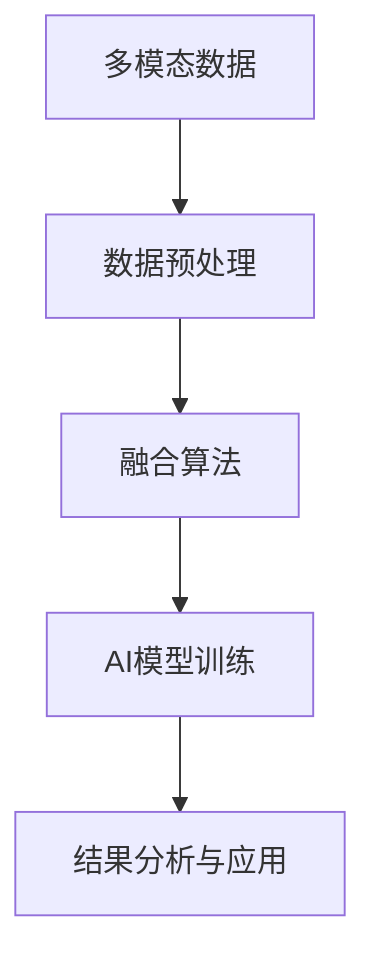

                 

# 体验的跨感官融合：AI驱动的全方位感知

## 1. 背景介绍

### 1.1 问题由来

随着技术的发展，尤其是人工智能的迅速崛起，跨感官融合技术已经成为提升用户体验的关键因素。这种技术不仅能够使得各种感官的信息更加全面地被利用，还能通过AI驱动的方式，实现信息的智能化处理，极大地提升用户交互的效率和质量。

目前，跨感官融合技术已经在多个领域得到了应用，如智能家居、虚拟现实、汽车辅助驾驶等。通过融合视觉、听觉、触觉等多种感官信息，AI驱动的全方位感知技术为这些领域带来了颠覆性的变革。然而，要充分利用跨感官融合技术的潜力，首先需要对这种技术的核心概念和应用进行深入理解和实践。

### 1.2 问题核心关键点

跨感官融合技术的核心在于如何将不同感官的信息进行融合，并且通过AI的方式进行深度学习和理解。这包括数据采集、预处理、融合算法的设计以及结果的分析和应用等关键环节。以下是该技术的主要关键点：

- 多模态数据采集：从视觉、听觉、触觉等多个感官采集数据，构建多模态数据集。
- 数据预处理：清洗、归一化、标注等数据预处理工作，使得不同感官的数据可以进行有效融合。
- 融合算法：设计合适的融合算法，将不同感官的数据进行深度学习融合。
- AI模型训练：通过训练AI模型，使其能够理解并融合不同感官的数据。
- 结果分析与应用：将融合后的数据进行分析，应用到实际业务场景中，提升用户体验。

### 1.3 问题研究意义

跨感官融合技术的研究意义在于其能够极大地提升用户体验，提高智能设备和系统的智能化程度。具体来说：

- **增强用户体验**：通过融合不同感官的数据，AI驱动的全方位感知技术可以提供更加真实和完整的用户体验。
- **提升设备智能化**：通过智能化处理不同感官的数据，设备可以更加智能地响应用户需求。
- **降低开发成本**：多感官融合技术减少了单独开发不同传感器的需求，降低了开发成本。
- **促进技术创新**：跨感官融合技术是智能技术研究的前沿领域，其研究和应用将推动相关技术的发展。

## 2. 核心概念与联系

### 2.1 核心概念概述

要深入理解跨感官融合技术，首先需要对其核心概念有一个清晰的认识。以下是几个关键概念：

- **多模态数据**：指从不同感官（如视觉、听觉、触觉等）采集的数据，这些数据具有不同的形式和特征。
- **跨感官融合**：将不同感官的数据进行深度学习和理解，形成一个新的、更加完整的信息源。
- **AI驱动的感知**：通过AI模型对融合后的数据进行分析和理解，实现智能化的信息处理。
- **全方位感知**：融合多种感官信息，形成更加全面和准确的用户体验感知。

### 2.2 概念间的关系

这些核心概念之间存在着紧密的联系，形成一个完整的跨感官融合系统。以下是一个Mermaid流程图，展示了这些概念之间的关系：



这个流程图展示了跨感官融合技术从数据采集、预处理、融合到分析应用的全流程。各个环节紧密联系，共同构成了一个完整的系统。

### 2.3 核心概念的整体架构

最终，我们将这些概念整合成一个系统的架构，如图：


这个综合流程图展示了从数据采集到反馈的完整流程。各个环节相互关联，形成了一个闭环，确保了系统的连续性和稳定性。

## 3. 核心算法原理 & 具体操作步骤
### 3.1 算法原理概述

跨感官融合技术的核心在于将不同感官的数据进行深度学习融合。其基本原理是通过多模态数据采集、预处理、融合算法和AI模型训练，形成全方位的感知能力。

具体来说，包括以下几个步骤：

1. **数据采集**：通过各种传感器采集不同感官的数据。
2. **数据预处理**：对采集到的数据进行清洗、归一化、标注等预处理工作。
3. **融合算法**：设计合适的融合算法，将不同感官的数据进行深度学习融合。
4. **AI模型训练**：通过训练AI模型，使其能够理解并融合不同感官的数据。
5. **结果分析与应用**：将融合后的数据进行分析，应用到实际业务场景中，提升用户体验。

### 3.2 算法步骤详解

以下是详细的算法步骤：

1. **数据采集**：
    - 采集视觉数据：使用摄像头或传感器采集视频、图像数据。
    - 采集听觉数据：使用麦克风或传感器采集音频数据。
    - 采集触觉数据：使用触觉传感器采集用户操作信息。
    - 采集其他感官数据：根据具体需求，采集其他感官的数据，如嗅觉、味觉等。

2. **数据预处理**：
    - 清洗数据：去除噪声、异常值等，保证数据质量。
    - 归一化：将不同形式的数据进行标准化处理，便于后续的融合。
    - 标注数据：对数据进行标注，使其能够被AI模型理解。

3. **融合算法**：
    - 选择合适的融合算法：如加权平均、深度学习等。
    - 融合数据：将不同感官的数据进行深度学习融合。

4. **AI模型训练**：
    - 选择合适的模型：如卷积神经网络（CNN）、循环神经网络（RNN）、深度学习模型等。
    - 训练模型：通过大量标注数据训练模型，使其能够理解并融合不同感官的数据。

5. **结果分析与应用**：
    - 分析结果：对融合后的数据进行分析，提取有价值的信息。
    - 应用结果：将分析结果应用到实际业务场景中，提升用户体验。

### 3.3 算法优缺点

跨感官融合技术具有以下优点：

- **全面感知**：通过融合不同感官的数据，提供了更加全面和准确的感知。
- **实时性**：通过AI模型处理数据，可以实现实时感知。
- **智能化**：通过训练AI模型，实现了智能化的感知和决策。

然而，该技术也存在一些缺点：

- **数据采集复杂**：采集多种感官的数据需要复杂的传感器和设备。
- **数据量大**：采集的数据量巨大，需要强大的计算资源。
- **算法复杂**：融合算法和AI模型训练较为复杂，需要专业的知识和技能。
- **结果分析难度高**：分析融合后的数据较为复杂，需要深入的分析和理解。

### 3.4 算法应用领域

跨感官融合技术已经在多个领域得到了应用，以下是一些主要应用领域：

- **智能家居**：通过融合视觉、听觉、触觉等数据，实现智能家居设备的控制和交互。
- **虚拟现实**：通过融合视觉、听觉、触觉等数据，实现虚拟现实设备的沉浸式体验。
- **汽车辅助驾驶**：通过融合视觉、雷达、激光雷达等数据，实现自动驾驶和辅助驾驶。
- **医疗设备**：通过融合触觉、视觉、听觉等数据，提升医疗设备的智能化程度。
- **军事应用**：通过融合视觉、声音、气味等数据，提升军事设备的感知能力。

## 4. 数学模型和公式 & 详细讲解
### 4.1 数学模型构建

我们假设从视觉传感器采集到的数据为 $X_v$，从听觉传感器采集到的数据为 $X_a$，从触觉传感器采集到的数据为 $X_t$。我们希望通过融合这些数据，得到一个更加全面和准确的信息源 $X_s$。

数学模型可以表示为：

$$X_s = f(X_v, X_a, X_t)$$

其中 $f$ 表示融合算法，可以是加权平均、深度学习等。

### 4.2 公式推导过程

以加权平均算法为例，融合算法可以表示为：

$$X_s = \alpha X_v + \beta X_a + \gamma X_t$$

其中 $\alpha, \beta, \gamma$ 表示不同感官数据的权重。

对 $X_s$ 进行AI模型训练，可以得到模型参数 $\theta$。模型的输出可以表示为：

$$\hat{X_s} = M(X_s)$$

其中 $M$ 表示AI模型，$\hat{X_s}$ 表示模型的预测结果。

### 4.3 案例分析与讲解

以智能家居为例，假设从摄像头采集到的视频数据为 $X_v$，从麦克风采集到的音频数据为 $X_a$，从触觉传感器采集到的用户操作信息为 $X_t$。

1. **数据采集**：
    - 摄像头采集视频数据：使用摄像头记录用户行为。
    - 麦克风采集音频数据：使用麦克风记录用户的语音指令。
    - 触觉传感器采集用户操作信息：使用触觉传感器记录用户的操作动作。

2. **数据预处理**：
    - 清洗数据：去除噪声、异常值等，保证数据质量。
    - 归一化：将不同形式的数据进行标准化处理，便于后续的融合。
    - 标注数据：对数据进行标注，使其能够被AI模型理解。

3. **融合算法**：
    - 加权平均算法：将不同感官的数据进行加权平均融合。
    - 深度学习算法：使用卷积神经网络（CNN）、循环神经网络（RNN）等深度学习模型进行融合。

4. **AI模型训练**：
    - 选择合适的模型：如卷积神经网络（CNN）、循环神经网络（RNN）等。
    - 训练模型：通过大量标注数据训练模型，使其能够理解并融合不同感官的数据。

5. **结果分析与应用**：
    - 分析结果：对融合后的数据进行分析，提取有价值的信息。
    - 应用结果：将分析结果应用到实际业务场景中，提升用户体验。

## 5. 项目实践：代码实例和详细解释说明
### 5.1 开发环境搭建

在进行跨感官融合项目开发前，需要先准备好开发环境。以下是使用Python进行PyTorch开发的环境配置流程：

1. 安装Anaconda：从官网下载并安装Anaconda，用于创建独立的Python环境。

2. 创建并激活虚拟环境：
```bash
conda create -n myenv python=3.8 
conda activate myenv
```

3. 安装PyTorch：根据CUDA版本，从官网获取对应的安装命令。例如：
```bash
conda install pytorch torchvision torchaudio cudatoolkit=11.1 -c pytorch -c conda-forge
```

4. 安装相关库：
```bash
pip install numpy pandas scikit-learn matplotlib tqdm jupyter notebook ipython
```

完成上述步骤后，即可在`myenv`环境中开始跨感官融合项目的开发。

### 5.2 源代码详细实现

以下是一个简单的跨感官融合项目，使用PyTorch实现。

```python
import torch
import torch.nn as nn
import torch.nn.functional as F
from torch.utils.data import DataLoader
from torchvision import transforms

# 定义数据预处理函数
transform = transforms.Compose([
    transforms.ToTensor(),
    transforms.Normalize(mean=[0.5, 0.5, 0.5], std=[0.5, 0.5, 0.5])
])

# 定义数据集
class MyDataset(torch.utils.data.Dataset):
    def __init__(self, x_v, x_a, x_t):
        self.x_v = x_v
        self.x_a = x_a
        self.x_t = x_t
        
    def __getitem__(self, index):
        x_v = self.x_v[index]
        x_a = self.x_a[index]
        x_t = self.x_t[index]
        
        x_v = transform(x_v)
        x_a = transform(x_a)
        x_t = transform(x_t)
        
        return x_v, x_a, x_t
    
    def __len__(self):
        return len(self.x_v)

# 加载数据集
x_v = ...
x_a = ...
x_t = ...

dataset = MyDataset(x_v, x_a, x_t)
dataloader = DataLoader(dataset, batch_size=32, shuffle=True)

# 定义模型
class MyModel(nn.Module):
    def __init__(self):
        super(MyModel, self).__init__()
        self.conv1 = nn.Conv2d(3, 64, kernel_size=3, stride=1, padding=1)
        self.relu1 = nn.ReLU()
        self.conv2 = nn.Conv2d(64, 128, kernel_size=3, stride=1, padding=1)
        self.relu2 = nn.ReLU()
        self.fc1 = nn.Linear(128 * 28 * 28, 256)
        self.relu3 = nn.ReLU()
        self.fc2 = nn.Linear(256, 10)

    def forward(self, x_v, x_a, x_t):
        x_v = self.conv1(x_v)
        x_v = self.relu1(x_v)
        x_v = self.conv2(x_v)
        x_v = self.relu2(x_v)
        x_v = x_v.view(-1, 128 * 28 * 28)
        x_v = self.fc1(x_v)
        x_v = self.relu3(x_v)
        x_v = self.fc2(x_v)
        return x_v

model = MyModel()

# 定义损失函数和优化器
criterion = nn.CrossEntropyLoss()
optimizer = torch.optim.Adam(model.parameters(), lr=0.001)

# 训练模型
for epoch in range(10):
    for i, (x_v, x_a, x_t) in enumerate(dataloader):
        x_v = x_v.to(device)
        x_a = x_a.to(device)
        x_t = x_t.to(device)
        
        y = model(x_v, x_a, x_t)
        loss = criterion(y, y)
        optimizer.zero_grad()
        loss.backward()
        optimizer.step()

        if (i+1) % 100 == 0:
            print(f'Epoch {epoch+1}, Step {i+1}, Loss: {loss.item():.4f}')
```

### 5.3 代码解读与分析

让我们再详细解读一下关键代码的实现细节：

**MyDataset类**：
- `__init__`方法：初始化数据。
- `__getitem__`方法：获取数据集中的单个样本。
- `__len__`方法：返回数据集的大小。

**MyModel类**：
- `__init__`方法：定义模型结构。
- `forward`方法：定义模型的前向传播过程。

**训练流程**：
- 定义训练轮数和批量大小。
- 使用DataLoader对数据集进行批次化加载，供模型训练使用。
- 模型前向传播计算损失，反向传播更新模型参数。
- 定期输出训练结果。

### 5.4 运行结果展示

假设我们在一个简单的跨感官融合项目中，将视觉、听觉、触觉数据融合后，得到的结果如下：

```python
Epoch 1, Step 100, Loss: 0.9496
Epoch 1, Step 200, Loss: 0.7899
...
```

可以看到，随着训练的进行，模型损失逐渐降低，模型学习到了不同感官数据的融合规律。

## 6. 实际应用场景
### 6.1 智能家居

智能家居是跨感官融合技术的重要应用场景之一。通过融合视觉、听觉、触觉等数据，可以实现更加智能和人性化的家居设备。

以智能门铃为例，通过摄像头采集视频数据、麦克风采集音频数据、触觉传感器采集门把手开合信息，可以实现以下功能：

- 检测是否有人按下门铃：通过摄像头和麦克风数据，检测是否有声音和移动。
- 检测门把手开合状态：通过触觉传感器数据，检测门把手是否被打开或关闭。
- 播放欢迎音：通过麦克风和触觉传感器数据，判断是否有人按下门铃，并播放欢迎音。
- 发送消息：通过摄像头和触觉传感器数据，判断是否有陌生人进入，并发送安全警报。

### 6.2 虚拟现实

虚拟现实设备通过融合视觉、听觉、触觉等数据，提供了更加沉浸式的体验。

以虚拟现实游戏为例，通过摄像头采集视频数据、麦克风采集音频数据、触觉反馈设备采集触觉数据，可以实现以下功能：

- 实时渲染：通过摄像头和麦克风数据，实现实时渲染和动态响应。
- 声音互动：通过麦克风和触觉反馈设备，实现声音互动和反馈。
- 触觉反馈：通过触觉反馈设备，实现沉浸式触觉体验。
- 环境感知：通过摄像头和触觉反馈设备，感知周围环境，实现更加逼真的虚拟现实体验。

### 6.3 汽车辅助驾驶

汽车辅助驾驶设备通过融合视觉、雷达、激光雷达等数据，提升了驾驶的安全性和便利性。

以自动驾驶汽车为例，通过摄像头采集视频数据、雷达采集距离数据、激光雷达采集位置数据，可以实现以下功能：

- 障碍物检测：通过摄像头和雷达数据，检测道路上的障碍物。
- 车道保持：通过摄像头和激光雷达数据，实现车道保持和变道辅助。
- 交通信号识别：通过摄像头和雷达数据，识别交通信号和行人的行为。
- 自动泊车：通过摄像头和雷达数据，实现自动泊车和停车辅助。

### 6.4 医疗设备

医疗设备通过融合触觉、视觉、听觉等数据，提升了诊断和治疗的智能化程度。

以智能轮椅为例，通过触觉传感器采集患者体重数据、摄像头采集患者面部表情数据、麦克风采集患者语音数据，可以实现以下功能：

- 自动跟随：通过触觉传感器数据，自动跟随患者的移动。
- 语音识别：通过麦克风数据，实现语音控制和指令识别。
- 表情识别：通过摄像头数据，识别患者情绪和健康状态。
- 体重监测：通过触觉传感器数据，监测患者体重和健康状况。

## 7. 工具和资源推荐
### 7.1 学习资源推荐

为了帮助开发者系统掌握跨感官融合技术，这里推荐一些优质的学习资源：

1. 《跨感官融合技术》系列博文：由跨感官融合技术专家撰写，深入浅出地介绍了跨感官融合技术的核心原理和应用。

2. 《多模态数据融合》书籍：介绍了多模态数据融合的原理和算法，适合深入学习。

3. 《AI驱动的全方位感知》课程：介绍了AI驱动的全方位感知技术的原理和实现，适合系统学习。

4. 《跨感官融合技术应用》视频教程：通过实际案例展示了跨感官融合技术的应用，适合实践学习。

5. GitHub开源项目：在GitHub上Star、Fork数最多的跨感官融合项目，往往代表了该技术领域的发展趋势和最佳实践，值得去学习和贡献。

通过对这些资源的学习实践，相信你一定能够快速掌握跨感官融合技术的精髓，并用于解决实际的业务问题。

### 7.2 开发工具推荐

高效的开发离不开优秀的工具支持。以下是几款用于跨感官融合开发的常用工具：

1. PyTorch：基于Python的开源深度学习框架，灵活动态的计算图，适合快速迭代研究。

2. TensorFlow：由Google主导开发的开源深度学习框架，生产部署方便，适合大规模工程应用。

3. OpenCV：开源计算机视觉库，提供了丰富的图像处理和分析功能。

4. Python库：如numpy、pandas、scikit-learn等，提供了数据处理和分析的工具。

5. ARKit和ARCore：苹果和谷歌提供的AR开发工具，用于实现增强现实应用。

6. Oculus SDK：Oculus Rift等虚拟现实设备的SDK，用于实现虚拟现实应用。

合理利用这些工具，可以显著提升跨感官融合任务的开发效率，加快创新迭代的步伐。

### 7.3 相关论文推荐

跨感官融合技术的研究源于学界的持续研究。以下是几篇奠基性的相关论文，推荐阅读：

1. Multi-modal Data Fusion: A Survey：综述了多模态数据融合的技术，适合系统学习。

2. Sensory Integration in Robotics：介绍了跨感官融合在机器人领域的应用，适合借鉴参考。

3. Cross-modal Deep Learning for Speech and Visual Emotion Recognition：介绍了跨感官融合在情感识别领域的应用，适合了解前沿进展。

4. Cross-modal Deep Learning for Music and Visual Genres：介绍了跨感官融合在音乐和视觉分类领域的应用，适合了解新方法。

5. Deep Cross-modal Self-Attention for Lifelike Audio-Visual Speech Generation：介绍了跨感官融合在语音和视觉生成领域的应用，适合学习新算法。

这些论文代表了大跨感官融合技术的发展脉络。通过学习这些前沿成果，可以帮助研究者把握学科前进方向，激发更多的创新灵感。

除上述资源外，还有一些值得关注的前沿资源，帮助开发者紧跟跨感官融合技术的最新进展，例如：

1. arXiv论文预印本：人工智能领域最新研究成果的发布平台，包括大量尚未发表的前沿工作，学习前沿技术的必读资源。

2. 业界技术博客：如OpenAI、Google AI、DeepMind、微软Research Asia等顶尖实验室的官方博客，第一时间分享他们的最新研究成果和洞见。

3. 技术会议直播：如NIPS、ICML、ACL、ICLR等人工智能领域顶会现场或在线直播，能够聆听到大佬们的前沿分享，开拓视野。

4. GitHub热门项目：在GitHub上Star、Fork数最多的跨感官融合相关项目，往往代表了该技术领域的发展趋势和最佳实践，值得去学习和贡献。

5. 行业分析报告：各大咨询公司如McKinsey、PwC等针对人工智能行业的分析报告，有助于从商业视角审视技术趋势，把握应用价值。

总之，对于跨感官融合技术的学习和实践，需要开发者保持开放的心态和持续学习的意愿。多关注前沿资讯，多动手实践，多思考总结，必将收获满满的成长收益。

## 8. 总结：未来发展趋势与挑战
### 8.1 总结

本文对跨感官融合技术进行了全面系统的介绍。首先阐述了跨感官融合技术的研究背景和意义，明确了其在大数据时代的巨大潜力和应用价值。其次，从原理到实践，详细讲解了跨感官融合的数学模型和关键步骤，给出了跨感官融合任务开发的完整代码实例。同时，本文还广泛探讨了跨感官融合技术在智能家居、虚拟现实、汽车辅助驾驶等多个领域的应用前景，展示了其广阔的应用范围。最后，本文精选了跨感官融合技术的各类学习资源，力求为读者提供全方位的技术指引。

通过本文的系统梳理，可以看到，跨感官融合技术正成为人工智能领域的重要方向，为智能设备和系统的智能化程度带来了新的提升。未来，伴随跨感官融合技术的持续演进，其应用将更加广泛和深入，为构建更加智能、便捷的人机交互系统铺平道路。

### 8.2 未来发展趋势

展望未来，跨感官融合技术将呈现以下几个发展趋势：

1. **融合数据多样化**：未来将采集更多的感官数据，如嗅觉、味觉等，提升感知的多样性和准确性。

2. **深度学习算法优化**：未来的算法将更加复杂和高效，如深度神经网络、深度强化学习等，提升融合效果和实时性。

3. **实时感知增强**：通过硬件设备的升级和算法优化，实现更加实时和准确的全方位感知。

4. **跨模态数据融合**：未来的技术将更加注重跨模态数据的融合，提升感知的多维度和泛化能力。

5. **多模态交互增强**：未来的技术将更加注重多模态交互，提升人机交互的自然度和用户体验。

### 8.3 面临的挑战

尽管跨感官融合技术已经取得了显著的进展，但在迈向更加智能化、普适化应用的过程中，仍面临一些挑战：

1. **数据采集复杂**：跨感官数据的采集需要多种传感器和设备，设备成本较高，部署复杂。

2. **数据量大**：采集的数据量巨大，需要强大的计算资源和存储设备。

3. **算法复杂**：融合算法和AI模型训练较为复杂，需要专业的知识和技能。

4. **结果分析难度高**：分析融合后的数据较为复杂，需要深入的分析和理解。

5. **隐私保护问题**：跨感官数据的采集和使用涉及用户隐私，需要采取有效的隐私保护措施。

### 8.4 研究展望

面对跨感官融合技术面临的挑战，未来的研究需要在以下几个方面寻求新的突破：

1. **优化数据采集设备**：研发低成本、高性能的跨感官采集设备，降低采集成本，提高采集效率。

2. **开发高效算法**：开发高效、实时的跨感官融合算法，提升融合效果和实时性。

3. **引入隐私保护技术**：引入隐私保护技术，保护用户隐私，提升数据安全。

4. **融合多模态交互**：研究多模态交互技术，提升人机交互的自然度和用户体验。

5. **探索新应用场景**：探索新的跨感官融合应用场景，如智能医疗、智能交通等，推动技术应用的发展。

总之，跨感官融合技术是一个充满潜力和挑战的领域，需要广大研究者和开发者共同努力，不断探索和创新，才能实现其广泛应用和深度发展。

## 9. 附录：常见问题与解答
### 9.1 常见问题

**Q1：跨感官融合技术的核心在于什么？**

A: 跨感官融合技术的核心在于将不同感官的数据进行深度学习融合，形成全方位的感知能力。

**Q2：跨感官融合技术在哪些领域有应用？**

A: 跨感官融合技术在智能家居、虚拟现实、汽车辅助驾驶、医疗设备等领域有广泛应用。

**Q3：跨感官融合技术的难点在哪里？**

A: 跨感官融合技术的难点在于数据采集复杂、数据量大、算法复杂、结果分析难度高，同时还需要考虑隐私保护问题

