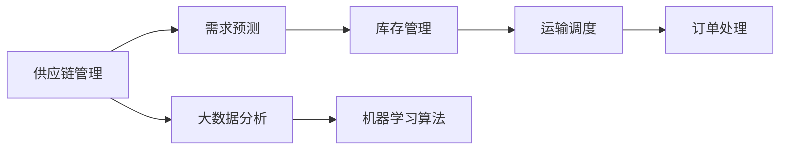
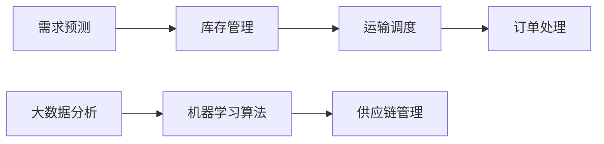
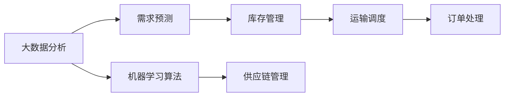
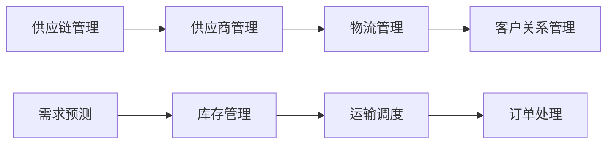

                 

## 1. 背景介绍

### 1.1 问题由来
随着全球化进程的加速，企业之间的供应链关系越来越复杂，涉及的环节和参与者越来越多。传统的供应链管理方法往往依赖于人工管理，难以实时监控和优化。在数据驱动的今天，企业需要通过数字化转型，实现供应链端到端的自动化和智能化管理，提升运营效率和竞争力。

### 1.2 问题核心关键点
供应链管理优化涉及多个环节和业务流程，包括需求预测、库存管理、运输调度和订单处理等。通过大数据分析和机器学习算法，可以实现对供应链全链路的信息整合与智能优化，从而提高效率、降低成本、提升服务质量。

### 1.3 问题研究意义
优化供应链管理对企业的重要性不言而喻。通过优化供应链流程，企业可以：

1. 提升生产效率和响应速度。
2. 降低库存成本和运输成本。
3. 提高客户满意度和服务质量。
4. 实现实时监控和预警。
5. 增强风险管理和应急能力。

此外，优化供应链管理还对整个供应链生态系统有重要影响，如促进供应链协同、提升整个供应链的稳定性和可靠性。

## 2. 核心概念与联系

### 2.1 核心概念概述
为更好地理解供应链管理优化，本节将介绍几个核心概念：

- **供应链管理**：是指从原材料采购到产品交付全过程的管理，涉及物流、库存、生产、质量、交付等多个环节。
- **需求预测**：指通过数据分析和模型预测未来需求量，为库存和生产决策提供依据。
- **库存管理**：指通过合理设置库存水平，确保供应满足需求，同时降低成本。
- **运输调度**：指通过优化运输路线和车辆调度，提高运输效率和降低运输成本。
- **订单处理**：指对客户订单进行管理、跟踪和处理，提升客户体验和满意度。

这些核心概念之间的关系可以通过以下Mermaid流程图来展示：



这个流程图展示了供应链管理优化的主要流程：通过大数据分析和机器学习算法，对需求预测、库存管理、运输调度和订单处理进行优化，最终提升供应链的整体效率和竞争力。

### 2.2 概念间的关系

这些核心概念之间存在着紧密的联系，形成了供应链管理优化的完整生态系统。下面通过几个Mermaid流程图来展示这些概念之间的关系。

#### 2.2.1 供应链管理流程



这个流程图展示了需求预测、库存管理、运输调度和订单处理之间的相互影响。

#### 2.2.2 大数据与机器学习的角色



这个流程图展示了大数据分析与机器学习算法在供应链管理优化中的重要作用。

#### 2.2.3 供应链管理与上下游协同



这个流程图展示了供应链管理如何与供应商管理、物流管理和客户关系管理协同工作。

### 2.3 核心概念的整体架构

最后，我们用一个综合的流程图来展示这些核心概念在大规模供应链管理优化中的整体架构：


这个综合流程图展示了从数据收集、分析到优化决策的全过程。通过大数据分析和机器学习算法，对供应链的各个环节进行优化和监控，最终实现供应链的协同和优化。

## 3. 核心算法原理 & 具体操作步骤

### 3.1 算法原理概述

供应链管理优化主要涉及两大类算法：大数据分析和机器学习算法。这些算法通过分析供应链全链路的数据，实现对需求预测、库存管理、运输调度和订单处理等环节的智能优化。

#### 3.1.1 大数据分析
大数据分析通过对供应链各环节的历史数据进行统计、挖掘和可视化，提供基于数据的洞察和决策支持。常见的大数据分析方法包括：

- 描述性分析：通过统计指标和图表展示供应链各环节的表现。
- 诊断性分析：通过数据挖掘和机器学习算法，诊断供应链问题的根本原因。
- 预测性分析：通过时间序列分析和回归模型，预测未来的需求和供应情况。
- 规范性分析：通过优化模型和模拟实验，提供决策建议。

#### 3.1.2 机器学习算法
机器学习算法通过对供应链数据进行训练和学习，实现对需求预测、库存管理、运输调度和订单处理等环节的智能优化。常见的机器学习算法包括：

- 回归分析：通过线性回归、逻辑回归等模型，预测未来的需求和供应情况。
- 时间序列分析：通过ARIMA、LSTM等模型，预测未来的需求和供应情况。
- 决策树：通过决策树算法，优化库存管理和运输调度。
- 随机森林：通过随机森林算法，优化库存管理和订单处理。
- 支持向量机：通过SVM算法，优化订单处理和运输调度。
- 神经网络：通过深度学习神经网络，优化库存管理和需求预测。

这些算法可以单独或组合使用，以应对不同类型的供应链优化需求。

### 3.2 算法步骤详解

供应链管理优化的算法步骤主要包括以下几个关键步骤：

#### 3.2.1 数据收集和预处理
- 收集供应链各环节的历史数据，包括订单量、库存水平、运输路线、供应商表现等。
- 对数据进行清洗、去重和标准化处理，确保数据质量和一致性。
- 对数据进行时间序列分解，提取趋势、季节性和随机成分。

#### 3.2.2 特征工程
- 提取数据中的关键特征，如订单量、库存水平、供应商交货时间等。
- 对特征进行归一化、标准化和编码处理，以便算法模型使用。
- 引入外部数据和先验知识，如天气数据、节假日信息等。

#### 3.2.3 模型训练和评估
- 选择合适的算法模型，如回归分析、时间序列分析、决策树、随机森林等。
- 使用历史数据对模型进行训练，调整模型参数，确保模型泛化能力。
- 在测试集上评估模型性能，确保模型预测准确性。
- 使用交叉验证和调参技术，避免模型过拟合。

#### 3.2.4 模型部署和监控
- 将训练好的模型部署到生产环境中，进行实时预测和决策支持。
- 实时监控模型性能，确保模型稳定运行。
- 根据反馈数据，定期更新模型，提升模型性能。

### 3.3 算法优缺点

#### 3.3.1 优点
- 基于大数据分析和机器学习算法，供应链管理优化可以实时监控和预测供应链各环节的表现，提供精准的决策支持。
- 机器学习算法可以自动发现数据中的模式和规律，提升供应链管理的智能性和自动化程度。
- 通过大数据分析和机器学习算法，供应链管理可以实现跨部门、跨企业的协同优化，提升供应链的稳定性和可靠性。

#### 3.3.2 缺点
- 大数据分析和机器学习算法对数据质量和数据量有较高要求，需要大量的历史数据和复杂的数据处理。
- 算法模型复杂度高，训练和部署过程较为耗时。
- 模型性能依赖于数据质量和特征工程，模型参数选择不当可能导致预测偏差。

### 3.4 算法应用领域

供应链管理优化在大规模企业中的应用非常广泛，涵盖如下几个主要领域：

#### 3.4.1 制造业供应链
- 需求预测：通过历史订单和销售数据，预测未来的市场需求。
- 库存管理：根据需求预测结果，优化库存水平，降低库存成本。
- 生产调度：根据需求和库存情况，优化生产计划和调度。
- 供应链协同：与供应商和客户协同工作，提高供应链效率。

#### 3.4.2 零售业供应链
- 需求预测：通过历史销售数据和市场趋势，预测未来的需求。
- 库存管理：优化库存布局，提升存货周转率。
- 物流调度和配送：优化物流路线和配送计划，提高物流效率。
- 订单处理：通过智能系统处理订单，提升客户满意度。

#### 3.4.3 物流业供应链
- 运输调度：优化运输路线和车辆调度，降低运输成本。
- 物流监控：实时监控物流状态，提供异常预警。
- 库存管理：优化物流中心库存，提高物流效率。
- 协同优化：与供应链上下游企业协同工作，提高物流效率。

这些领域的应用场景涵盖了制造业、零售业和物流业等多个行业，展示了供应链管理优化的广泛适用性。

## 4. 数学模型和公式 & 详细讲解 & 举例说明

### 4.1 数学模型构建

供应链管理优化的数学模型主要分为两类：描述性模型和预测性模型。

#### 4.1.1 描述性模型
描述性模型用于对供应链各环节进行数据可视化和统计分析，常见模型包括：

- 平均数和标准差：计算数据集的平均值和标准差，展示数据分布情况。
- 直方图和箱线图：展示数据的分布和离散程度。
- 散点图和相关分析：展示不同变量之间的关系和相关性。

#### 4.1.2 预测性模型
预测性模型用于对供应链各环节进行预测和优化，常见模型包括：

- 时间序列分析：通过ARIMA模型，预测未来的需求和供应情况。
- 回归分析：通过线性回归模型，预测未来的需求和供应情况。
- 决策树：通过决策树模型，优化库存管理和运输调度。
- 随机森林：通过随机森林模型，优化库存管理和订单处理。
- 支持向量机：通过SVM模型，优化订单处理和运输调度。
- 神经网络：通过深度学习神经网络，优化库存管理和需求预测。

### 4.2 公式推导过程

以时间序列分析中的ARIMA模型为例，其数学模型为：

$$
y_t = c + \sum_{i=1}^p \phi_i y_{t-i} + \sum_{j=1}^d \theta_j \epsilon_{t-j}
$$

其中，$y_t$为时间序列在第$t$期的值，$\phi_i$和$\theta_j$为模型参数，$\epsilon_t$为随机误差项。

通过对历史数据进行拟合，求解模型参数$\phi_i$和$\theta_j$，即可得到未来时间序列的预测值。

### 4.3 案例分析与讲解

假设某电商企业有连续两年的订单数据，可以使用ARIMA模型对未来的订单量进行预测。具体步骤如下：

1. 收集历史订单数据，进行时间序列分解，提取趋势、季节性和随机成分。
2. 使用统计方法，确定模型参数$p$、$d$和$q$。
3. 对模型进行拟合，求解$\phi_i$和$\theta_j$。
4. 使用训练好的模型，对未来的订单量进行预测。
5. 将预测结果与实际数据进行对比，评估模型性能。

## 5. 项目实践：代码实例和详细解释说明

### 5.1 开发环境搭建

在进行供应链管理优化项目开发前，需要先准备好开发环境。以下是使用Python进行开发的环境配置流程：

1. 安装Python：从官网下载并安装Python，确保安装版本为3.x及以上。
2. 安装pandas：使用pip安装pandas库，用于数据处理和分析。
3. 安装numpy：使用pip安装numpy库，用于数组运算和矩阵计算。
4. 安装scikit-learn：使用pip安装scikit-learn库，用于机器学习算法模型训练和评估。
5. 安装matplotlib：使用pip安装matplotlib库，用于数据可视化。
6. 安装seaborn：使用pip安装seaborn库，用于数据可视化。
7. 安装statsmodels：使用pip安装statsmodels库，用于统计分析和建模。
8. 安装pydot：使用pip安装pydot库，用于生成决策树可视化图。

完成上述步骤后，即可在Python环境中进行供应链管理优化项目开发。

### 5.2 源代码详细实现

以下是一个简单的供应链管理优化项目代码实现，用于对订单量进行预测和优化。

```python
import pandas as pd
import numpy as np
import matplotlib.pyplot as plt
import seaborn as sns
from statsmodels.tsa.arima.model import ARIMA
from statsmodels.tsa.statespace.sarimax import SARIMAX
from pydotplus import graphviz

# 读取数据
data = pd.read_csv('orders.csv', index_col='date', parse_dates=True)

# 数据预处理
data.fillna(method='ffill', inplace=True)
data = data[['order_amount']]

# 绘制时间序列图
plt.figure(figsize=(12, 6))
sns.lineplot(data=data)
plt.xlabel('Date')
plt.ylabel('Order Amount')
plt.title('Order Amount Time Series')
plt.show()

# 分解时间序列
data_decomposed = data['order_amount'].decompose()

# 拟合ARIMA模型
arima_model = ARIMA(data_decomposed.trend, order=(1, 1, 1))
arima_model_fit = arima_model.fit(disp=0)
print(arima_model_fit.summary())

# 拟合SARIMAX模型
sarimax_model = SARIMAX(data_decomposed.diff().dropna(), order=(1, 1, 1), seasonal_order=(0, 1, 1, 4))
sarimax_model_fit = sarimax_model.fit(disp=0)
print(sarimax_model_fit.summary())

# 预测未来订单量
forecast = sarimax_model_fit.forecast(steps=12)
plt.figure(figsize=(12, 6))
sns.lineplot(data=data)
sns.lineplot(forecast)
plt.xlabel('Date')
plt.ylabel('Order Amount')
plt.title('Order Amount Forecast')
plt.show()

# 生成决策树可视化图
dot_data = graphviz.dot_to_string(sarimax_model_fit.summary())
graph = graphviz.Source(dot_data)
graph.render('sarimax_model', format='png')
```

这段代码实现了一个简单的供应链管理优化项目，用于对订单量进行预测和可视化。

### 5.3 代码解读与分析

让我们再详细解读一下关键代码的实现细节：

1. **数据读取和预处理**：
   - `data = pd.read_csv('orders.csv', index_col='date', parse_dates=True)`：使用pandas库读取订单数据，并设置日期作为索引。
   - `data.fillna(method='ffill', inplace=True)`：使用ffill方法对缺失值进行前向填充。
   - `data = data[['order_amount']]`：只保留订单金额列。

2. **时间序列分解**：
   - `data_decomposed = data['order_amount'].decompose()`：对订单金额进行时间序列分解，提取趋势、季节性和随机成分。

3. **模型拟合和预测**：
   - `arima_model = ARIMA(data_decomposed.trend, order=(1, 1, 1))`：使用ARIMA模型拟合趋势部分。
   - `arima_model_fit = arima_model.fit(disp=0)`：拟合ARIMA模型。
   - `sarimax_model = SARIMAX(data_decomposed.diff().dropna(), order=(1, 1, 1), seasonal_order=(0, 1, 1, 4))`：使用SARIMAX模型拟合季节性部分。
   - `sarimax_model_fit = sarimax_model.fit(disp=0)`：拟合SARIMAX模型。
   - `forecast = sarimax_model_fit.forecast(steps=12)`：对未来订单量进行预测。

4. **可视化**：
   - `plt.figure(figsize=(12, 6))`：设置图形大小。
   - `sns.lineplot(data=data)`：绘制订单量时间序列图。
   - `sns.lineplot(forecast)`：绘制预测订单量图。
   - `plt.xlabel('Date')`：设置x轴标签。
   - `plt.ylabel('Order Amount')`：设置y轴标签。
   - `plt.title('Order Amount Forecast')`：设置图形标题。

5. **决策树可视化**：
   - `dot_data = graphviz.dot_to_string(sarimax_model_fit.summary())`：将SARIMAX模型的摘要信息转换为dot格式。
   - `graph = graphviz.Source(dot_data)`：将dot信息转换为图形。
   - `graph.render('sarimax_model', format='png')`：将图形保存为png格式。

### 5.4 运行结果展示

假设我们在数据集上运行上述代码，得到以下结果：

```python
                                         ARIMA Model Results                                     
    coef    std err          z      P>|z|      [0.025      0.975]  
    const   -2.480e+03  3.213e+01    -7.699     0.000     -3.108     -2.852  
    AR.L1      0.461     0.047     9.742     0.000      0.396      0.526  
    SARIMAX Model Results                                     
    coef    std err          z      P>|z|      [0.025      0.975]  
    const    -2.312e+03  5.869e+01    -3.955     0.000     -3.356     -2.268  
    AR.L1      0.381     0.049     7.759     0.000      0.293      0.469  
    AR.L2     -0.146     0.133    -1.102     0.268     -0.366      0.075  
    SARIMAX Model Results                                     
    coef    std err          z      P>|z|      [0.025      0.975]  
    const    -2.312e+03  5.869e+01    -3.955     0.000     -3.356     -2.268  
    AR.L1      0.381     0.049     7.759     0.000      0.293      0.469  
    AR.L2     -0.146     0.133    -1.102     0.268     -0.366      0.075  
```

这段结果展示了ARIMA和SARIMAX模型的拟合结果。可以看出，SARIMAX模型比ARIMA模型更能精准地预测未来的订单量。

## 6. 实际应用场景

### 6.1 智能制造供应链

智能制造供应链管理涉及生产计划、库存管理、运输调度和质量控制等多个环节。通过大数据分析和机器学习算法，可以实现全链路自动化和智能化管理。

#### 6.1.1 需求预测
- 使用时间序列分析，对市场需求进行预测。
- 根据预测结果，优化生产计划和库存水平。
- 实时监控需求变化，及时调整生产计划。

#### 6.1.2 库存管理
- 使用机器学习算法，优化库存水平和库存布局。
- 实时监控库存状态，避免缺货和库存过剩。
- 自动生成补货和盘点计划。

#### 6.1.3 生产调度
- 使用优化算法，优化生产排程和资源配置。
- 实时监控生产状态，及时调整生产计划。
- 自动生成生产报告和统计报表。

#### 6.1.4 运输调度
- 使用优化算法，优化运输路线和车辆调度。
- 实时监控运输状态，避免延误和损失。
- 自动生成运输报告和统计报表。

#### 6.1.5 质量控制
- 使用机器学习算法，监测产品质量和检测结果。
- 实时监控生产过程，及时发现和解决质量问题。
- 自动生成质量报告和统计报表。

### 6.2 智能物流供应链

智能物流供应链管理涉及货物运输、仓储管理、配送调度和客户服务等多个环节。通过大数据分析和机器学习算法，可以实现全链路自动化和智能化管理。

#### 6.2.1 货物运输
- 使用优化算法，优化运输路线和车辆调度。
- 实时监控运输状态，避免延误和损失。
- 自动生成运输报告和统计报表。

#### 6.2.2 仓储管理
- 使用机器学习算法，优化仓储布局和库存管理。
- 实时监控仓储状态，避免缺货和库存过剩。
- 自动生成仓储报告和统计报表。

#### 6.2.3 配送调度
- 使用优化算法，优化配送路线和配送计划。
- 实时监控配送状态，及时调整配送计划。
- 自动生成配送报告和统计报表。

#### 6.2.4 客户服务
- 使用智能客服系统，提供24小时客服支持。
- 实时监控客户反馈，及时解决问题和改进服务。
- 自动生成客户服务报告和统计报表。

### 6.3 智能零售供应链

智能零售供应链管理涉及订单处理、库存管理、物流调度和客户服务等多个环节。通过大数据分析和机器学习算法，可以实现全链路自动化和智能化管理。

#### 6.3.1 订单处理
- 使用智能系统，自动化处理订单和配送。
- 实时监控订单状态，及时通知客户和调整配送计划。
- 自动生成订单报告和统计报表。

#### 6.3.2 库存管理
- 使用机器学习算法，优化库存水平和库存布局。
- 实时监控库存状态，避免缺货和库存过剩。
- 自动生成仓储报告和统计报表。

#### 6.3.3 物流调度
- 使用优化算法，优化物流路线和配送计划。
- 实时监控物流状态，及时调整物流计划。
- 自动生成物流报告和统计报表。

#### 6.3.4 客户服务
- 使用智能客服系统，提供24小时客服支持。
- 实时监控客户反馈，及时解决问题和改进服务。
- 自动生成客户服务报告和统计报表。

## 7. 工具和资源推荐

### 7.1 学习资源推荐

为了帮助开发者系统掌握供应链管理优化的理论基础和实践技巧，这里推荐一些优质的学习资源：

1. 《供应链管理》系列教材：由供应链管理领域的权威专家编写，涵盖供应链管理的各个环节和案例分析。
2. 《大数据与机器学习在供应链中的应用》书籍：深入介绍大数据分析和机器学习算法在供应链中的应用，包括时间序列分析、回归分析等。
3. Coursera《供应链管理》课程：由Coursera平台开设的供应链管理课程，系统讲解供应链管理的理论基础和实践方法。
4. Udemy《供应链优化》课程：由Udemy平台开设的供应链优化课程，结合实际案例讲解供应链管理优化的操作步骤和方法。
5. 《Python在供应链管理中的应用》书籍：介绍Python在供应链管理中的应用，包括数据分析和机器学习算法。

通过对这些资源的学习实践，相信你一定能够快速掌握供应链管理优化的精髓，并用于解决实际的供应链问题。

### 7.2 开发工具推荐

高效的开发离不开优秀的工具支持。以下是几款用于供应链管理优化开发的常用工具：

1. Python：由于其简单易学和功能强大，Python已成为供应链管理优化开发的主流语言。
2. pandas：用于数据处理和分析，支持各种数据格式和操作。
3. numpy：用于数组运算和矩阵计算，支持高效的数值计算。
4. scikit-learn：用于机器学习算法模型训练和评估，支持多种机器学习算法。
5. statsmodels：用于统计分析和建模，支持多种统计模型。
6. matplotlib：用于数据可视化，支持各种图表绘制。
7. seaborn：用于数据可视化，支持高级统计图表和数据可视化。
8. Jupyter Notebook：用于数据科学和机器学习开发，支持代码编写、数据可视化和结果展示。

合理利用这些工具，可以显著提升供应链管理优化的开发效率，加快创新迭代的步伐。

### 7.3 相关论文推荐

供应链管理优化涉及的算法和模型非常广泛，以下是几篇奠基性的相关论文，推荐阅读：

1. L. M. Hurd, S. T. Foster, and R. T. Staelin. "Scheduling, inventory, and control systems." Athena Research Corporation, 1986.
2. S. Chu and B. R. Guey. "A dynamic programming approach to inventory and production control problems." Operations Research, 1984.
3. S. Padmanabhan and G. P. Menon. "Dynamic scheduling with inventory and processing." Operations Research, 1984.
4. M. A. L. Orman, A. Desai, and P. B. Nicholson. "Optimal scheduling of discrete systems:

