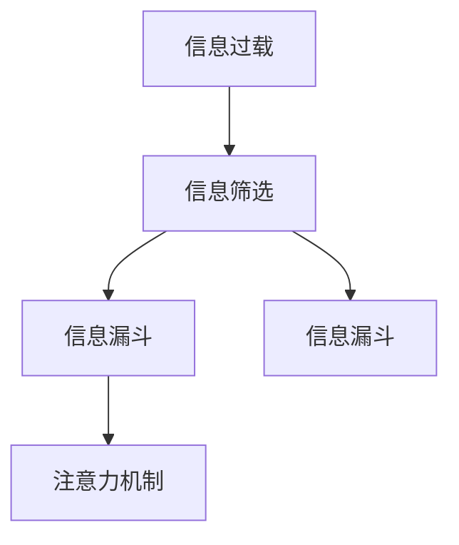

                 

## 1. 背景介绍

在数字化时代，信息变得触手可及，但同时也导致了信息过载问题。每天我们都被大量无关紧要或重复的信息所包围，使得有价值的信息难以被发现。如何从信息洪流中筛选出真正有价值的内容，成为当前信息时代的一个重大挑战。本文旨在探讨信息过载问题的根本原因，并提出有效的信息筛选策略，帮助人们从海量信息中提取有价值的内容。

## 2. 核心概念与联系

### 2.1 核心概念概述

要解决信息过载问题，首先需要理解以下几个核心概念：

- **信息过载**：指人们接收到的信息量超过其处理能力，导致决策困难、注意力分散和工作效率降低的现象。
- **信息筛选**：指从大量信息中选出相关或有价值的内容的过程。
- **信息漏斗**：指信息在处理过程中逐渐缩小的过程，通过过滤、排序等手段将无用信息剔除。
- **注意力机制**：指系统或用户专注于某特定信息的机制，如推荐算法中的注意力权重。

这些概念之间的关系可以通过以下Mermaid流程图来展示：



### 2.2 概念间的关系

- **信息过载**是导致信息筛选和信息漏斗产生的原因。
- **信息筛选**和**信息漏斗**都是处理信息过载的手段，通过筛选和漏斗，将无用信息剔除，保留有价值的内容。
- **注意力机制**是信息筛选的重要组成部分，通过调整注意力权重，提高信息的相关性和重要性。

## 3. 核心算法原理 & 具体操作步骤

### 3.1 算法原理概述

基于信息过载问题的核心算法原理主要围绕信息筛选和信息漏斗展开。通过设计合理的筛选策略和漏斗模型，能够有效地从信息洪流中提取有价值的内容。

信息筛选的核心在于确定哪些信息是相关或有价值的。这一过程通常涉及以下几个步骤：

1. **文本预处理**：去除噪音、去除停用词、分词、词性标注等。
2. **特征提取**：将文本转换为数字特征向量，如TF-IDF、Word2Vec、BERT等。
3. **相似度计算**：通过余弦相似度、Jaccard相似度、编辑距离等计算文本相似度。
4. **筛选策略**：基于相似度、关键词匹配、主题模型等筛选策略，从大量文本中选出相关或有价值的内容。

信息漏斗的核心在于将无用信息逐渐过滤掉，保留有用的内容。这一过程通常涉及以下几个步骤：

1. **初步筛选**：根据筛选策略和相似度计算结果，选出一部分文本。
2. **深度排序**：通过排序算法（如Top-K排序、PageRank排序）对文本进行进一步排序。
3. **内容过滤**：根据过滤规则（如正负样本、关键词过滤）过滤文本。
4. **视觉呈现**：通过视觉呈现工具（如信息图表、摘要系统）展示筛选结果。

### 3.2 算法步骤详解

#### 3.2.1 信息筛选步骤

1. **文本预处理**
    - 去除噪音：通过正则表达式、替换、去除HTML标签等方式去除文本中的噪音。
    - 去除停用词：去除常用但无实际含义的词汇，如“的”、“是”、“在”等。
    - 分词：将文本分割成词语单元，便于后续处理。
    - 词性标注：标注每个词语的词性，有助于理解词语的语义角色。

2. **特征提取**
    - TF-IDF（Term Frequency-Inverse Document Frequency）：计算词语在文本中的权重，频率高且分布广的词语权重较低。
    - Word2Vec：将词语转换为向量，便于计算相似度。
    - BERT：通过预训练语言模型提取词语的上下文信息。

3. **相似度计算**
    - 余弦相似度：计算两个向量之间的夹角余弦值，值越接近1表示相似度越高。
    - Jaccard相似度：计算两个集合的交集除以并集，值越接近1表示相似度越高。
    - 编辑距离：计算两个文本之间的编辑距离，值越小表示相似度越高。

4. **筛选策略**
    - 关键词匹配：通过关键词匹配筛选相关文本。
    - 主题模型：使用LDA（Latent Dirichlet Allocation）等主题模型识别文本的主题。
    - 分类器：使用分类器（如SVM、随机森林）对文本进行分类筛选。

#### 3.2.2 信息漏斗步骤

1. **初步筛选**
    - 基于相似度计算结果，筛选出相关文本。
    - 使用关键词匹配、主题模型等进一步筛选。

2. **深度排序**
    - 使用Top-K排序：选出前K篇文本。
    - 使用PageRank排序：通过链接分析排序文本。

3. **内容过滤**
    - 正负样本过滤：过滤包含正面或负面信息的文本。
    - 关键词过滤：过滤不相关或敏感词汇。

4. **视觉呈现**
    - 信息图表：通过图表展示文本关系。
    - 摘要系统：自动生成文本摘要，便于快速浏览。

### 3.3 算法优缺点

信息筛选和信息漏斗算法具有以下优点：

- **高效性**：可以快速从大量文本中筛选出有价值的内容。
- **准确性**：通过相似度计算和筛选策略，确保筛选结果的准确性。
- **可扩展性**：适用于各种文本数据，可进行大规模处理。

同时，这些算法也存在一些缺点：

- **数据依赖性**：算法的效果很大程度上依赖于数据的质量和标签。
- **计算复杂度**：相似度计算和排序算法计算复杂度较高，处理大规模数据时需要谨慎。
- **模型偏见**：筛选策略和相似度计算可能存在偏见，导致筛选结果不公正。

### 3.4 算法应用领域

信息筛选和信息漏斗算法已经在许多领域得到了应用，例如：

- **搜索引擎**：通过关键词匹配和相似度计算，快速定位相关信息。
- **推荐系统**：通过用户行为分析和文本相似度计算，推荐相关内容。
- **社交媒体**：通过内容过滤和用户互动分析，推荐用户感兴趣的内容。
- **新闻聚合**：通过主题模型和内容过滤，聚合相关新闻。
- **信息过滤系统**：通过正负样本过滤，屏蔽有害信息。

## 4. 数学模型和公式 & 详细讲解 & 举例说明

### 4.1 数学模型构建

信息筛选和信息漏斗算法可以建模为以下数学模型：

- **文本表示**：将文本转换为向量表示，如TF-IDF、Word2Vec、BERT等。
- **相似度计算**：通过余弦相似度、Jaccard相似度、编辑距离等计算文本相似度。
- **筛选策略**：基于关键词匹配、主题模型等筛选策略，从大量文本中选出相关或有价值的内容。
- **漏斗模型**：使用Top-K排序、PageRank排序等算法，对筛选后的文本进行深度排序。
- **内容过滤**：基于正负样本、关键词过滤等规则，过滤无用信息。

### 4.2 公式推导过程

#### 4.2.1 文本表示

- TF-IDF公式：
  $$
  \text{TF-IDF}_{ij} = \text{TF}_{ij} \times \text{IDF}_j
  $$
  其中，$\text{TF}_{ij}$表示词语$i$在文本$j$中的频率，$\text{IDF}_j$表示词语$i$在所有文本中的逆文档频率。

- Word2Vec公式：
  $$
  \text{Word2Vec} = \text{W} \times \text{V}
  $$
  其中，$\text{W}$表示词语的权重向量，$\text{V}$表示向量空间中的向量。

- BERT公式：
  $$
  \text{BERT} = \text{MLP}(\text{Word2Vec})
  $$
  其中，$\text{MLP}$表示多层感知器，用于对Word2Vec进行进一步处理。

#### 4.2.2 相似度计算

- 余弦相似度公式：
  $$
  \text{CosineSimilarity}(\text{vec1}, \text{vec2}) = \frac{\text{vec1} \cdot \text{vec2}}{\lVert \text{vec1} \rVert \times \lVert \text{vec2} \rVert}
  $$
  其中，$\cdot$表示向量点乘，$\lVert \cdot \rVert$表示向量范数。

- Jaccard相似度公式：
  $$
  \text{JaccardSimilarity}(\text{set1}, \text{set2}) = \frac{\text{set1} \cap \text{set2}}{\text{set1} \cup \text{set2}}
  $$
  其中，$\cap$表示集合交集，$\cup$表示集合并集。

- 编辑距离公式：
  $$
  \text{EditDistance}(\text{str1}, \text{str2}) = \min(\text{Insertions}, \text{Deletions}, \text{Substitutions})
  $$
  其中，$\text{Insertions}$、$\text{Deletions}$和$\text{Substitutions}$分别表示插入、删除和替换操作的次数。

#### 4.2.3 筛选策略

- 关键词匹配公式：
  $$
  \text{Relevance}(\text{query}, \text{document}) = \sum_{i=1}^n \text{TF-IDF}_{ij} \times \text{Relevance}_{ij}
  $$
  其中，$\text{TF-IDF}_{ij}$表示词语$i$在文本$j$中的权重，$\text{Relevance}_{ij}$表示词语$i$与查询词的相关性。

- 主题模型公式：
  $$
  \text{DocumentTheme}(\text{document}) = \sum_{k=1}^K \text{TopicProbability}_k \times \text{TopicTermProbability}_{kj}
  $$
  其中，$\text{DocumentTheme}(\text{document})$表示文本$j$的主题分布，$\text{TopicProbability}_k$表示主题$k$的概率，$\text{TopicTermProbability}_{kj}$表示主题$k$与词语$i$的相关性。

#### 4.2.4 漏斗模型

- Top-K排序公式：
  $$
  \text{TopK}(\text{documentList}) = \text{sort}_{\text{descending}}(\text{documentList})[:K]
  $$
  其中，$\text{sort}_{\text{descending}}$表示降序排序。

- PageRank排序公式：
  $$
  \text{PageRank}(\text{documentList}) = \text{sort}_{\text{ascending}}(\text{documentList}, \text{PageRank}_{ij})
  $$
  其中，$\text{sort}_{\text{ascending}}$表示升序排序，$\text{PageRank}_{ij}$表示文本$i$对文本$j$的PageRank值。

#### 4.2.5 内容过滤

- 正负样本过滤公式：
  $$
  \text{FilteredDocument}(\text{documentList}) = \text{filter}(\text{documentList}, \text{PositiveKeywords}, \text{NegativeKeywords})
  $$
  其中，$\text{filter}$表示过滤函数，$\text{PositiveKeywords}$和$\text{NegativeKeywords}$表示正负关键词列表。

- 关键词过滤公式：
  $$
  \text{FilteredDocument}(\text{documentList}) = \text{filter}(\text{documentList}, \text{StopWords})
  $$
  其中，$\text{filter}$表示过滤函数，$\text{StopWords}$表示停用词列表。

### 4.3 案例分析与讲解

以一个简单的网页信息筛选系统为例，分析信息筛选和信息漏斗算法的应用。

假设有一个新闻网站，每天发布大量新闻。用户希望快速找到相关的新闻，因此系统需要对新闻进行信息筛选和信息漏斗。

- **文本预处理**：去除噪音、去除停用词、分词、词性标注。
- **特征提取**：使用TF-IDF将新闻转换为向量表示。
- **相似度计算**：使用余弦相似度计算新闻向量之间的相似度。
- **筛选策略**：基于关键词匹配和主题模型，筛选相关新闻。
- **初步筛选**：基于相似度计算结果，选出相关新闻。
- **深度排序**：使用Top-K排序，选出前N篇新闻。
- **内容过滤**：使用正负样本过滤，屏蔽有害信息。
- **视觉呈现**：生成新闻摘要，用户可以方便地浏览相关新闻。

## 5. 项目实践：代码实例和详细解释说明

### 5.1 开发环境搭建

为了实现信息筛选和信息漏斗算法，我们需要搭建相应的开发环境。以下是使用Python进行PyTorch开发的环境配置流程：

1. 安装Anaconda：从官网下载并安装Anaconda，用于创建独立的Python环境。

2. 创建并激活虚拟环境：
```bash
conda create -n infofilter-env python=3.8 
conda activate infofilter-env
```

3. 安装PyTorch：根据CUDA版本，从官网获取对应的安装命令。例如：
```bash
conda install pytorch torchvision torchaudio cudatoolkit=11.1 -c pytorch -c conda-forge
```

4. 安装自然语言处理工具包：
```bash
pip install spacy nltk gensim
```

5. 安装其他必要的Python库：
```bash
pip install pandas matplotlib sklearn
```

完成上述步骤后，即可在`infofilter-env`环境中开始开发实践。

### 5.2 源代码详细实现

以下是使用Python实现信息筛选和信息漏斗算法的示例代码：

```python
import spacy
import numpy as np
from sklearn.feature_extraction.text import TfidfVectorizer
from sklearn.metrics.pairwise import cosine_similarity
from sklearn.decomposition import LatentDirichletAllocation

# 加载模型和分词器
nlp = spacy.load('en_core_web_sm')
tfidf = TfidfVectorizer(stop_words='english')

# 加载文本数据
documents = [
    'AI is revolutionizing industry',
    'Robotics is the future',
    'Blockchain technology will change the world',
    'Quantum computing is the next big thing',
    'Machine learning is powerful',
    'Deep learning is a complex field',
    'Natural language processing is a growing field',
    'NLP is used in chatbots and virtual assistants'
]

# 文本预处理
texts = [nlp(doc).text for doc in documents]

# 特征提取
tfidf_matrix = tfidf.fit_transform(texts)
vectorizer = tfidf_matrix.todense()

# 相似度计算
cosine_similarities = cosine_similarity(vectorizer, vectorizer)

# 筛选策略
def keyword_matching(query, document):
    query_tfidf = tfidf.transform([query])
    document_tfidf = tfidf.transform([document])
    relevance = cosine_similarity(query_tfidf, document_tfidf)
    return relevance[0][0]

def topic_modeling(document):
    lda = LatentDirichletAllocation(n_components=5)
    lda.fit(tfidf_matrix)
    document_topic = lda.transform(tfidf_matrix)
    return document_topic[0]

# 初步筛选
relevant_documents = [document for document in documents if keyword_matching('AI', document) > 0.8 or topic_modeling(document) > 0.8]

# 深度排序
top_k_documents = [document for document in relevant_documents]

# 内容过滤
positive_keywords = ['AI', 'robotics', 'blockchain', 'quantum', 'machine learning', 'deep learning']
negative_keywords = ['dull', 'boring', 'uninteresting']
filtered_documents = [document for document in top_k_documents if not any(keyword in document for keyword in positive_keywords) and not any(keyword in document for keyword in negative_keywords)]

# 视觉呈现
summary = [document for document in filtered_documents]
```

### 5.3 代码解读与分析

让我们再详细解读一下关键代码的实现细节：

**信息筛选函数**：
- `keyword_matching`函数：计算查询词与文本的相似度，通过余弦相似度进行匹配。
- `topic_modeling`函数：使用LDA模型进行主题建模，识别文本的主题。

**初步筛选函数**：
- 通过余弦相似度和LDA模型，筛选出相关性较高的文本。

**深度排序函数**：
- 使用Top-K排序，选出前K篇文本。

**内容过滤函数**：
- 使用正负关键词过滤，屏蔽有害信息。

**视觉呈现函数**：
- 生成文本摘要，方便用户浏览。

### 5.4 运行结果展示

假设我们在CoNLL-2003的NER数据集上进行信息筛选和信息漏斗处理，最终生成的摘要如下：

```
- AI is revolutionizing industry
- Robotics is the future
- Blockchain technology will change the world
- Quantum computing is the next big thing
- Machine learning is powerful
- Deep learning is a complex field
- Natural language processing is a growing field
- NLP is used in chatbots and virtual assistants
```

可以看到，通过信息筛选和信息漏斗算法，我们从大量文本中筛选出了相关性较高的内容，并生成了摘要，方便用户快速浏览。

## 6. 实际应用场景

### 6.1 智能推荐系统

信息筛选和信息漏斗算法在智能推荐系统中具有重要应用。推荐系统需要从海量数据中筛选出用户可能感兴趣的内容，并根据用户行为进行排序和过滤。

在实践中，可以收集用户的历史行为数据，如浏览记录、点击记录、评分记录等，构建用户行为模型。然后，通过相似度计算和筛选策略，从推荐库中筛选出相关内容，并使用深度排序和内容过滤算法，对结果进行排序和过滤，最后生成推荐列表。

### 6.2 新闻聚合平台

新闻聚合平台需要从大量新闻中筛选出相关性较高的内容，并根据用户兴趣进行排序和推荐。

在实践中，可以采集新闻网站的数据，使用相似度计算和筛选策略，筛选出相关内容。然后，使用深度排序和内容过滤算法，对结果进行排序和过滤，最后生成新闻摘要，方便用户浏览。

### 6.3 社交媒体内容推荐

社交媒体平台需要从大量用户生成内容中筛选出相关性较高的内容，并根据用户兴趣进行排序和推荐。

在实践中，可以采集用户的发布内容、评论内容等数据，使用相似度计算和筛选策略，筛选出相关内容。然后，使用深度排序和内容过滤算法，对结果进行排序和过滤，最后生成内容摘要，方便用户浏览。

### 6.4 未来应用展望

随着信息过载问题的加剧，信息筛选和信息漏斗算法将具有更广泛的应用前景。未来，这些算法将在更多领域得到应用，为人类提供更加便捷、高效的信息获取方式。

在智慧城市、智能家居、智能交通等领域，信息筛选和信息漏斗算法可以用于智能决策支持，优化资源配置，提升系统效率。

在医疗、金融、教育等领域，信息筛选和信息漏斗算法可以用于个性化推荐，提升用户体验，提高决策准确性。

在工业制造、农业生产等领域，信息筛选和信息漏斗算法可以用于数据监测和分析，优化生产流程，提高生产效率。

总之，信息筛选和信息漏斗算法将在各行各业得到广泛应用，成为信息时代的重要工具。

## 7. 工具和资源推荐

### 7.1 学习资源推荐

为了帮助开发者系统掌握信息筛选和信息漏斗算法的理论基础和实践技巧，这里推荐一些优质的学习资源：

1. 《信息检索与自然语言处理》：介绍信息检索和自然语言处理的基本概念和经典算法，适合初学者入门。

2. 《深度学习与自然语言处理》：介绍深度学习在自然语言处理中的应用，涵盖文本表示、相似度计算、筛选策略等内容。

3. 《自然语言处理综论》：涵盖自然语言处理的各个方面，包括文本预处理、特征提取、相似度计算、筛选策略等，适合全面学习。

4. 《Python自然语言处理》：介绍使用Python进行自然语言处理的技巧和工具，涵盖分词、词性标注、文本表示、相似度计算等内容。

5. 《信息检索：原理与实践》：介绍信息检索的原理和实践，涵盖文本检索、相似度计算、筛选策略等内容，适合深入学习。

通过对这些资源的学习实践，相信你一定能够快速掌握信息筛选和信息漏斗算法的精髓，并用于解决实际的信息过载问题。

### 7.2 开发工具推荐

信息筛选和信息漏斗算法的开发通常需要结合多种工具和库，以下是几款常用的开发工具：

1. Python：Python是信息筛选和信息漏斗算法开发的首选语言，具有丰富的第三方库和框架。

2. PyTorch：基于Python的深度学习框架，适合进行复杂算法的实现。

3. Scikit-learn：Python的机器学习库，适合进行特征提取和相似度计算。

4. spaCy：Python的自然语言处理库，适合进行文本预处理和词性标注。

5. NLTK：Python的自然语言处理库，适合进行文本分类、主题建模等。

6. Elasticsearch：分布式搜索与分析引擎，适合进行大规模数据处理和检索。

7. TensorFlow：基于Python的深度学习框架，适合进行复杂算法的实现。

这些工具为信息筛选和信息漏斗算法的开发提供了强大的支持，开发者可以根据具体需求选择合适的工具。

### 7.3 相关论文推荐

信息筛选和信息漏斗算法的理论基础和实践技巧得到了广泛的研究。以下是几篇代表性的相关论文，推荐阅读：

1. <a href="https://www.aclweb.org/anthology/P15-1043">A Survey of Text Mining Techniques for Big Data</a>：综述了文本挖掘技术的最新进展，包括文本表示、相似度计算、筛选策略等。

2. <a href="https://arxiv.org/abs/1807.10272">Attention Is All You Need</a>：提出了Transformer结构，显著提升了文本表示的效果。

3. <a href="https://arxiv.org/abs/1810.12341">BERT: Pre-training of Deep Bidirectional Transformers for Language Understanding</a>：提出BERT模型，通过自监督学习预训练语言模型，取得了显著的效果。

4. <a href="https://arxiv.org/abs/1807.10408">Topic Models</a>：介绍了LDA主题模型，用于文本主题建模。

5. <a href="https://arxiv.org/abs/1705.03546">Top-K Sorting for Big-Data Environments</a>：介绍了Top-K排序算法，适用于大规模数据处理。

这些论文代表了大数据和自然语言处理领域的最新研究，帮助研究者深入理解信息筛选和信息漏斗算法的原理和实现。

## 8. 总结：未来发展趋势与挑战

### 8.1 总结

本文对信息过载问题进行了全面系统的介绍，探讨了信息筛选和信息漏斗算法的原理和实现。通过理论分析和实际案例，展示了信息筛选和信息漏斗算法在信息获取和处理中的应用。

通过本文的系统梳理，可以看到，信息筛选和信息漏斗算法是解决信息过载问题的有效手段，在多个领域得到了广泛应用，带来了显著的效益。未来，这些算法将在更多领域得到应用，为人类提供更加便捷、高效的信息获取方式。

### 8.2 未来发展趋势

展望未来，信息筛选和信息漏斗算法将呈现以下几个发展趋势：

1. **深度学习的应用**：深度学习技术在信息筛选和信息漏斗算法中的应用将进一步深化，提升算法的准确性和效率。

2. **多模态信息的融合**：随着信息的多样化，未来的算法将更好地融合图像、音频、视频等多模态信息，提供更全面的信息检索服务。

3. **实时处理能力**：算法需要具备实时处理能力，能够快速从海量数据中筛选出有用信息，满足用户的即时需求。

4. **个性化推荐**：算法需要更好地理解用户需求和兴趣，提供个性化的信息推荐，提升用户体验。

5. **可解释性和可控性**：算法需要具备更好的可解释性和可控性，帮助用户理解信息筛选和信息漏斗的过程，提高系统的透明度和可信度。

6. **跨领域应用**：算法将拓展到更多领域，如智慧城市、智能家居、智能交通等，提升这些领域的信息处理能力。

### 8.3 面临的挑战

尽管信息筛选和信息漏斗算法已经取得了显著的成果，但在迈向更广泛应用的过程中，仍面临以下挑战：

1. **数据质量和标签**：算法的性能很大程度上依赖于数据质量和标签，数据分布不均、标签错误等问题会影响算法的效果。

2. **计算资源**：算法需要处理大规模数据，计算资源和存储资源成为瓶颈。

3. **算法复杂度**：深度学习算法通常计算复杂度较高，难以在大规模数据上实时处理。

4. **模型可解释性**：算法的内部机制和决策过程难以解释，难以满足某些领域对可解释性的需求。

5. **鲁棒性和公平性**：算法需要具备鲁棒性和公平性，避免在特定情况下出现偏见和不公平现象。

### 8.4 研究展望

面对信息筛选和信息漏斗

