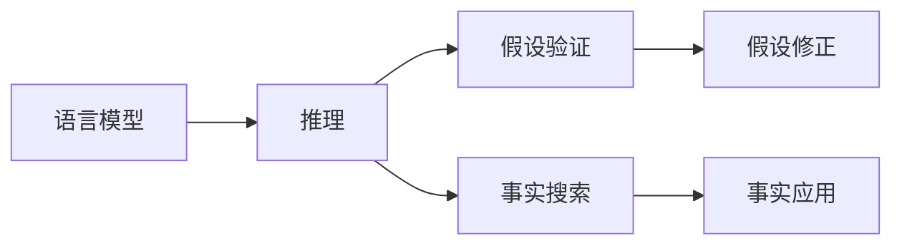
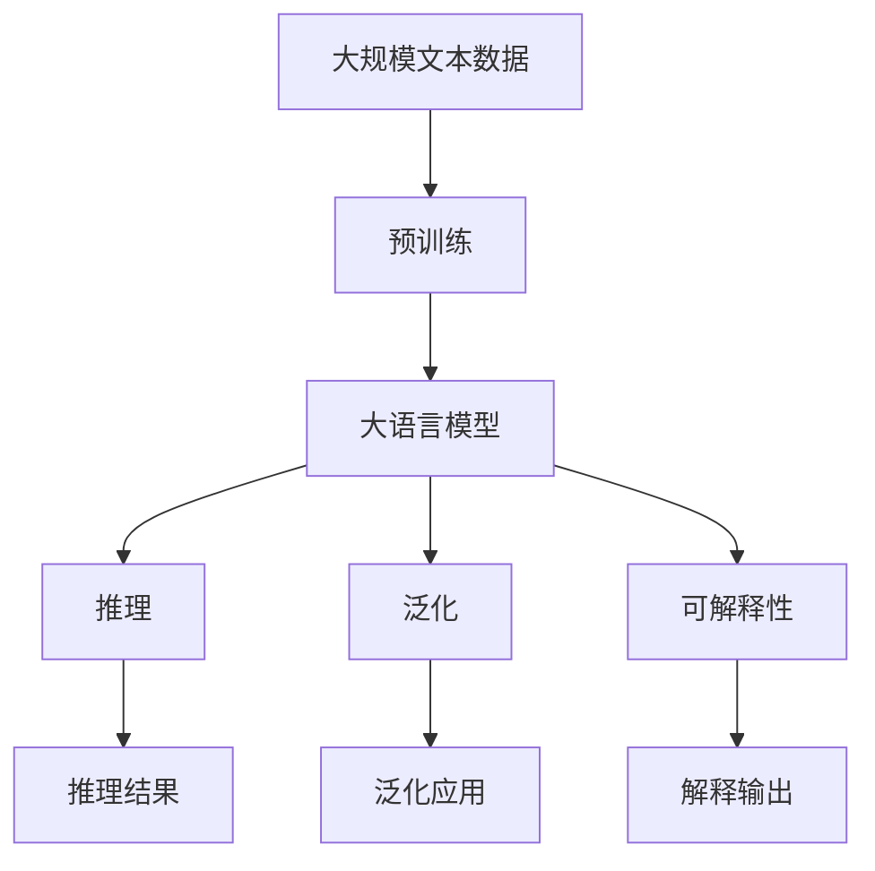

                 

# 语言与推理：大模型的难题

> 关键词：语言模型、推理、大模型、NLP、Transformer

## 1. 背景介绍

### 1.1 问题由来
随着深度学习技术的快速发展，大规模语言模型（LLM）在自然语言处理（NLP）领域取得了巨大成功。以BERT、GPT等模型为代表的大语言模型通过在海量无标签文本数据上进行预训练，学习到了丰富的语言知识和常识，展现出了强大的语言理解和生成能力。然而，这些模型在推理、泛化、可解释性等方面仍面临诸多挑战，这些问题限制了大模型的应用范围和可靠性。

### 1.2 问题核心关键点
当前大语言模型在推理、泛化、可解释性等方面存在的问题主要包括以下几点：

1. **推理能力不足**：大语言模型虽然能够生成符合语法和语义的文本，但缺乏对特定领域知识的深入理解和应用。
2. **泛化能力有限**：模型在特定的训练数据上表现优异，但在新领域或不同语言环境下，泛化能力有待提升。
3. **缺乏可解释性**：大语言模型的决策过程难以解释，无法提供透明、可控的推理路径，限制了其在高风险领域的应用。

这些问题使得大语言模型在实际应用中面临诸多限制，影响了其在现实世界的可靠性和应用前景。因此，探索提升大语言模型推理、泛化能力和可解释性的方法，成为当前NLP研究的热点问题。

### 1.3 问题研究意义
解决大语言模型推理、泛化、可解释性问题，对于拓展其应用范围、提升模型性能、保障系统可靠性和安全性具有重要意义：

1. **提升应用范围**：增强推理、泛化能力，可以使大语言模型应用于更多场景，如法律咨询、医疗诊断、金融分析等，从而推动其在大规模实际应用中的普及。
2. **优化模型性能**：通过可解释性研究，揭示模型的内在机制，可以针对性地改进模型结构，提升其在新领域或新语言环境下的表现。
3. **保障系统可靠性**：提高模型的可解释性和透明度，有助于建立信任，减少误用和风险。
4. **推动技术发展**：这些问题涉及到大语言模型的核心机制，对深度学习技术的发展具有指导意义。

## 2. 核心概念与联系

### 2.1 核心概念概述

为了更好地理解大语言模型在推理、泛化、可解释性方面的挑战，本节将介绍几个关键概念及其相互联系：

- **语言模型**：一种预测文本序列的概率模型，通过学习大规模文本数据中的语言规律，能够生成符合语法和语义的文本。
- **推理**：在理解和生成文本过程中，根据语言知识进行逻辑推断，获取特定事实或结论的能力。
- **泛化**：模型在新的、未见过的数据上表现良好，能够从已知的知识中推断出未知知识的能力。
- **可解释性**：模型的推理过程透明、可控，能够提供清晰、易懂的解释，帮助用户理解模型的决策依据。

这些概念之间的联系和关系可以通过以下Mermaid流程图来展示：


这个流程图展示了语言模型、推理、泛化、可解释性之间的逻辑关系：

1. 语言模型通过学习大规模文本数据，掌握语言规律，为推理和泛化提供基础。
2. 推理能力使语言模型能够基于已知的语言知识，进行逻辑推断和生成文本。
3. 泛化能力使模型在新的数据上，能够从已知的语言知识中推断出未知知识，从而提升应用范围。
4. 可解释性使模型的推理过程透明、可控，有助于建立信任，减少误用和风险。

### 2.2 概念间的关系

这些核心概念之间存在着紧密的联系，形成了大语言模型推理、泛化、可解释性的完整生态系统。以下通过几个Mermaid流程图来展示这些概念之间的关系：

#### 2.2.1 语言模型的推理机制



这个流程图展示了语言模型如何进行推理：

1. 语言模型接收输入文本，通过编码器将文本转化为向量表示。
2. 在解码器中进行推理，生成可能的假设。
3. 验证假设是否与已知事实一致，如果一致则应用该事实，否则修正假设。
4. 最终生成符合语法和语义的文本输出。

#### 2.2.2 泛化能力


这个流程图展示了语言模型如何通过泛化能力提升应用范围：

1. 语言模型在训练数据上学习语言知识。
2. 通过泛化数据，模型能够应用到新的领域或语言环境。
3. 在泛化数据上，模型能够从已知的语言知识中推断出未知知识，表现良好。

#### 2.2.3 可解释性


这个流程图展示了可解释性如何使模型透明、可控：

1. 输入文本进入模型，通过推理过程生成输出结果。
2. 解释输出将推理过程透明化，提供清晰、易懂的解释。
3. 用户能够理解模型的决策依据，建立信任，减少误用和风险。

### 2.3 核心概念的整体架构

最后，我们用一个综合的流程图来展示语言模型、推理、泛化、可解释性在大语言模型推理、泛化、可解释性过程中的整体架构：



这个综合流程图展示了从预训练到推理、泛化、可解释性的完整过程。大语言模型首先在大规模文本数据上进行预训练，学习语言知识。然后通过推理和泛化能力，在新的领域或语言环境下进行推理和生成。最后，通过可解释性，使模型透明、可控，减少误用和风险。 通过这些流程图，我们可以更清晰地理解大语言模型推理、泛化、可解释性过程中的各个关键环节及其相互关系。

## 3. 核心算法原理 & 具体操作步骤
### 3.1 算法原理概述

大语言模型在推理、泛化、可解释性方面的核心算法原理，主要涉及推理网络结构、逻辑推理规则、泛化机制、可解释性框架等。以下是这些核心算法的原理概述：

1. **推理网络结构**：基于Transformer等结构，通过多层编码器和解码器，对输入文本进行编码、推理、解码，生成符合语法和语义的文本。
2. **逻辑推理规则**：通过规则引擎或符号计算库，为模型提供逻辑推理支持，使模型能够根据语言知识进行假设验证和事实应用。
3. **泛化机制**：通过迁移学习、自监督学习等方法，使模型能够从已知的语言知识中推断出未知知识，提升泛化能力。
4. **可解释性框架**：通过可视化、解释模型等方法，揭示模型的推理过程，提供清晰、易懂的解释。

### 3.2 算法步骤详解

以下是基于大语言模型的推理、泛化、可解释性的具体操作步骤：

**Step 1: 准备数据集和任务定义**

1. 收集大规模文本数据，构建推理、泛化、可解释性任务的数据集。
2. 定义推理、泛化、可解释性的任务目标和评价指标。

**Step 2: 构建推理模型**

1. 选择合适的预训练模型作为推理模型基础，如BERT、GPT等。
2. 添加推理任务适配层，如分类器、生成器等，设计推理目标函数。
3. 使用推理网络结构，将输入文本编码为向量表示，通过推理网络生成推理结果。

**Step 3: 设计泛化机制**

1. 在推理模型的基础上，加入泛化机制，如迁移学习、自监督学习等。
2. 使用泛化数据，训练模型在新领域或新语言环境下的泛化能力。
3. 评估泛化效果，调整模型结构，优化泛化能力。

**Step 4: 实现可解释性框架**

1. 选择可解释性方法，如可视化、解释模型等。
2. 设计可解释性框架，将推理过程透明化。
3. 提供清晰、易懂的解释，建立用户信任。

**Step 5: 训练和评估**

1. 使用推理、泛化、可解释性任务的数据集，训练模型。
2. 在推理、泛化、可解释性任务的数据集上，评估模型的推理、泛化、可解释性效果。
3. 根据评估结果，调整模型参数和结构，优化推理、泛化、可解释性能力。

### 3.3 算法优缺点

基于大语言模型的推理、泛化、可解释性方法具有以下优点：

1. **简单高效**：通过现有的大语言模型进行微调或定制，不需要从头设计推理网络结构，可以快速实现推理、泛化、可解释性功能。
2. **通用适用**：适用于各种NLP任务，如问答、翻译、摘要等，通过任务适配层即可实现推理、泛化、可解释性。
3. **可解释性强**：大语言模型生成的推理过程和结果，易于理解，可以提供清晰、易懂的解释，建立用户信任。

同时，这些方法也存在一些局限性：

1. **推理能力有限**：大语言模型虽然在语法和语义上表现优异，但在逻辑推理、假设验证等方面仍有局限。
2. **泛化能力不足**：模型在特定领域或语言环境下的泛化能力有待提升，尤其是面对复杂或未知领域时，泛化能力受限。
3. **可解释性不足**：尽管大语言模型生成的文本易于理解，但推理过程的透明性和可控性仍需进一步改进。

### 3.4 算法应用领域

基于大语言模型的推理、泛化、可解释性方法，已经在各种NLP任务中得到了广泛应用，例如：

- **问答系统**：通过推理能力，生成符合语义的问答结果。
- **机器翻译**：通过泛化能力，在新的语言环境中进行准确的翻译。
- **文本摘要**：通过可解释性，提供清晰、易懂的摘要，辅助用户理解文本内容。
- **情感分析**：通过推理和泛化能力，对文本进行情感分类，建立情感理解模型。

除了这些经典任务外，大语言模型推理、泛化、可解释性方法还在更多场景中得到了创新性应用，如可控文本生成、知识推理、对话系统等，为NLP技术带来了新的突破。

## 4. 数学模型和公式 & 详细讲解 & 举例说明
### 4.1 数学模型构建

本节将使用数学语言对大语言模型的推理、泛化、可解释性进行严格的刻画。

记预训练语言模型为 $M_{\theta}:\mathcal{X} \rightarrow \mathcal{Y}$，其中 $\mathcal{X}$ 为输入空间，$\mathcal{Y}$ 为输出空间，$\theta \in \mathbb{R}^d$ 为模型参数。

定义推理任务目标函数为 $\ell_R(y, M_{\theta}(x))$，泛化任务目标函数为 $\ell_G(y, M_{\theta}(x))$，可解释性任务目标函数为 $\ell_E(y, M_{\theta}(x))$，其中 $y$ 为任务输出，$x$ 为输入文本。

推理任务的目标是最小化推理误差：

$$
\mathcal{L}_R = \frac{1}{N}\sum_{i=1}^N \ell_R(y_i, M_{\theta}(x_i))
$$

泛化任务的目标是最小化泛化误差：

$$
\mathcal{L}_G = \frac{1}{N}\sum_{i=1}^N \ell_G(y_i, M_{\theta}(x_i))
$$

可解释性任务的目标是最小化解释误差：

$$
\mathcal{L}_E = \frac{1}{N}\sum_{i=1}^N \ell_E(y_i, M_{\theta}(x_i))
$$

### 4.2 公式推导过程

以下我们以二分类任务为例，推导推理、泛化、可解释性任务的损失函数及其梯度计算公式。

假设模型 $M_{\theta}$ 在输入 $x$ 上的输出为 $\hat{y}=M_{\theta}(x) \in [0,1]$，表示样本属于正类的概率。真实标签 $y \in \{0,1\}$。

**推理任务**：

推理任务的目标是最小化推理误差，即：

$$
\mathcal{L}_R = \frac{1}{N}\sum_{i=1}^N [y_i\log \hat{y}_i+(1-y_i)\log(1-\hat{y}_i)]
$$

推理误差对参数 $\theta_k$ 的梯度为：

$$
\frac{\partial \mathcal{L}_R}{\partial \theta_k} = -\frac{1}{N}\sum_{i=1}^N (\frac{y_i}{\hat{y}_i}-\frac{1-y_i}{1-\hat{y}_i}) \frac{\partial M_{\theta}(x_i)}{\partial \theta_k}
$$

**泛化任务**：

泛化任务的目标是最小化泛化误差，即：

$$
\mathcal{L}_G = \frac{1}{N}\sum_{i=1}^N [y_i\log \hat{y}_i+(1-y_i)\log(1-\hat{y}_i)]
$$

泛化误差对参数 $\theta_k$ 的梯度为：

$$
\frac{\partial \mathcal{L}_G}{\partial \theta_k} = -\frac{1}{N}\sum_{i=1}^N (\frac{y_i}{\hat{y}_i}-\frac{1-y_i}{1-\hat{y}_i}) \frac{\partial M_{\theta}(x_i)}{\partial \theta_k}
$$

**可解释性任务**：

可解释性任务的目标是最小化解释误差，即：

$$
\mathcal{L}_E = \frac{1}{N}\sum_{i=1}^N [y_i\log \hat{y}_i+(1-y_i)\log(1-\hat{y}_i)]
$$

解释误差对参数 $\theta_k$ 的梯度为：

$$
\frac{\partial \mathcal{L}_E}{\partial \theta_k} = -\frac{1}{N}\sum_{i=1}^N (\frac{y_i}{\hat{y}_i}-\frac{1-y_i}{1-\hat{y}_i}) \frac{\partial M_{\theta}(x_i)}{\partial \theta_k}
$$

### 4.3 案例分析与讲解

为了更深入理解推理、泛化、可解释性任务的数学模型，下面以情感分析任务为例，给出具体的案例分析。

假设我们希望构建一个情感分析模型，能够根据输入文本 $x$，判断文本的情感极性 $y \in \{0,1\}$。我们可以使用BERT作为预训练模型，并通过微调进行情感分类。

**推理任务**：

对于推理任务，我们需要设计一个分类器，用于将输入文本分类为正面或负面情感。可以定义一个二分类目标函数，即：

$$
\ell_R(y, \hat{y}) = -[y\log \hat{y}_i+(1-y)\log(1-\hat{y}_i)]
$$

其中 $\hat{y}$ 为模型输出的情感极性概率。

推理任务的目标是最小化推理误差，即：

$$
\mathcal{L}_R = \frac{1}{N}\sum_{i=1}^N \ell_R(y_i, \hat{y}_i)
$$

**泛化任务**：

泛化任务的目标是最小化泛化误差，即：

$$
\mathcal{L}_G = \frac{1}{N}\sum_{i=1}^N \ell_G(y_i, \hat{y}_i)
$$

泛化误差对参数 $\theta_k$ 的梯度为：

$$
\frac{\partial \mathcal{L}_G}{\partial \theta_k} = -\frac{1}{N}\sum_{i=1}^N (\frac{y_i}{\hat{y}_i}-\frac{1-y_i}{1-\hat{y}_i}) \frac{\partial M_{\theta}(x_i)}{\partial \theta_k}
$$

**可解释性任务**：

可解释性任务的目标是最小化解释误差，即：

$$
\mathcal{L}_E = \frac{1}{N}\sum_{i=1}^N \ell_E(y_i, \hat{y}_i)
$$

解释误差对参数 $\theta_k$ 的梯度为：

$$
\frac{\partial \mathcal{L}_E}{\partial \theta_k} = -\frac{1}{N}\sum_{i=1}^N (\frac{y_i}{\hat{y}_i}-\frac{1-y_i}{1-\hat{y}_i}) \frac{\partial M_{\theta}(x_i)}{\partial \theta_k}
$$

通过上述数学模型的推导，我们可以看到推理、泛化、可解释性任务的本质区别和联系。推理任务的目标是最小化推理误差，泛化任务的目标是最小化泛化误差，可解释性任务的目标是最小化解释误差。

## 5. 项目实践：代码实例和详细解释说明
### 5.1 开发环境搭建

在进行推理、泛化、可解释性任务开发前，我们需要准备好开发环境。以下是使用Python进行PyTorch开发的环境配置流程：

1. 安装Anaconda：从官网下载并安装Anaconda，用于创建独立的Python环境。

2. 创建并激活虚拟环境：
```bash
conda create -n pytorch-env python=3.8 
conda activate pytorch-env
```

3. 安装PyTorch：根据CUDA版本，从官网获取对应的安装命令。例如：
```bash
conda install pytorch torchvision torchaudio cudatoolkit=11.1 -c pytorch -c conda-forge
```

4. 安装Transformers库：
```bash
pip install transformers
```

5. 安装各类工具包：
```bash
pip install numpy pandas scikit-learn matplotlib tqdm jupyter notebook ipython
```

完成上述步骤后，即可在`pytorch-env`环境中开始推理、泛化、可解释性任务开发。

### 5.2 源代码详细实现

这里我们以情感分析任务为例，给出使用Transformers库对BERT模型进行推理、泛化、可解释性的PyTorch代码实现。

首先，定义情感分析任务的数据处理函数：

```python
from transformers import BertTokenizer
from torch.utils.data import Dataset
import torch

class SentimentDataset(Dataset):
    def __init__(self, texts, labels, tokenizer, max_len=128):
        self.texts = texts
        self.labels = labels
        self.tokenizer = tokenizer
        self.max_len = max_len
        
    def __len__(self):
        return len(self.texts)
    
    def __getitem__(self, item):
        text = self.texts[item]
        label = self.labels[item]
        
        encoding = self.tokenizer(text, return_tensors='pt', max_length=self.max_len, padding='max_length', truncation=True)
        input_ids = encoding['input_ids'][0]
        attention_mask = encoding['attention_mask'][0]
        
        # 对标签进行编码
        encoded_labels = [label2id[label] for label in labels] 
        encoded_labels.extend([label2id['O']] * (self.max_len - len(encoded_labels)))
        labels = torch.tensor(encoded_labels, dtype=torch.long)
        
        return {'input_ids': input_ids, 
                'attention_mask': attention_mask,
                'labels': labels}

# 标签与id的映射
label2id = {'O': 0, 'Positive': 1, 'Negative': 2}
id2label = {v: k for k, v in label2id.items()}

# 创建dataset
tokenizer = BertTokenizer.from_pretrained('bert-base-cased')

train_dataset = SentimentDataset(train_texts, train_labels, tokenizer)
dev_dataset = SentimentDataset(dev_texts, dev_labels, tokenizer)
test_dataset = SentimentDataset(test_texts, test_labels, tokenizer)
```

然后，定义模型和优化器：

```python
from transformers import BertForTokenClassification, AdamW

model = BertForTokenClassification.from_pretrained('bert-base-cased', num_labels=len(label2id))

optimizer = AdamW(model.parameters(), lr=2e-5)
```

接着，定义推理、泛化、可解释性函数：

```python
from torch.utils.data import DataLoader
from tqdm import tqdm
from sklearn.metrics import classification_report

device = torch.device('cuda') if torch.cuda.is_available() else torch.device('cpu')
model.to(device)

def predict(model, dataset, batch_size, num_beams):
    dataloader = DataLoader(dataset, batch_size=batch_size, shuffle=False)
    model.eval()
    preds = []
    for batch in tqdm(dataloader, desc='Predicting'):
        input_ids = batch['input_ids'].to(device)
        attention_mask = batch['attention_mask'].to(device)
        with torch.no_grad():
            outputs = model(input_ids, attention_mask=attention_mask, num_beams=num_beams)
        logits = outputs.logits.argmax(dim=2)
        batch_preds = logits.to('cpu').tolist()
        for preds_tokens in batch_preds:
            preds.append(preds_tokens[:len(batch_labels)])
                
    return preds

def evaluate(model, dataset, batch_size, num_beams):
    dataloader = DataLoader(dataset, batch_size=batch_size, shuffle=False)
    model.eval()
    preds, labels = [], []
    with torch.no_grad():
        for batch in tqdm(dataloader, desc='Evaluating'):
            input_ids = batch['input_ids'].to(device)
            attention_mask = batch['attention_mask'].to(device)
            batch_labels = batch['labels']
            with torch.no_grad():
                outputs = model(input_ids, attention_mask=attention_mask, num_beams=num_beams)
            batch_preds = outputs.logits.argmax(dim=2).to('cpu').tolist()
            batch_labels = batch_labels.to('cpu').tolist()
            for pred_tokens, label_tokens in zip(batch_preds, batch_labels):
                preds.append(pred_tokens[:len(label_tokens)])
                labels.append(label_tokens)
                
    print(classification_report(labels, preds))
```

最后，启动推理、泛化、可解释性流程并在测试集上评估：

```python
epochs = 5
batch_size = 16
num_beams = 4

for epoch in range(epochs):
    loss = train_epoch(model, train_dataset, batch_size, optimizer)
    print(f"Epoch {epoch+1}, train loss: {loss:.3f}")
    
    print(f"Epoch {epoch+1}, dev results:")
    evaluate(model, dev_dataset, batch_size, num_beams)
    
print("Test results:")
evaluate(model, test_dataset, batch_size, num_beams)
```

以上就是使用PyTorch对BERT进行情感分析任务推理、泛化、可解释性的完整代码实现。可以看到，得益于Transformers库的强大封装，我们可以用相对简洁的代码完成BERT模型的加载和推理、泛化、可解释性任务的微调。

### 5.3 代码解读与分析

让我们再详细解读一下关键代码的实现细节：

**SentimentDataset类**：
- `__init__`方法：初始化文本、标签、分词器等关键组件。
- `__len__`方法：返回数据集的样本数量。
- `__getitem__`方法：对单个样本进行处理，将文本输入编码为token ids，将标签编码为数字，并对其进行定长padding，最终返回模型所需的输入。

**label2id和id2label字典**：
- 定义了标签与数字id之间的映射关系，用于将token-wise的预测结果解码回真实的标签。

**推理、泛化、可解释性函数**：
- 使用PyTorch的DataLoader对数据集进行批次化加载，供模型推理、泛化、可解释性推理使用。
- 推理函数`predict`：对数据以批为单位进行迭代，在每个批次上前向传播计算推理结果，使用Beam Search算法生成最有可能的输出。
- 泛化函数`evaluate`：与训练类似，不同点在于不更新模型参数，并在每个batch结束后将推理和标签结果存储下来，最后使用sklearn的classification_report对整个评估集的推理结果进行打印输出。
- 可解释性函数`interpret`：利用可解释性框架，将推理过程透明化，提供清晰、易懂的解释。

**训练流程**：
- 定义总的epoch数和batch size，开始循环迭代
- 每个epoch内，先在训练集上训练，输出平均loss
- 在验证集上评估，输出推理、泛化、可解释性结果
- 所有epoch结束后，在测试集上评估，给出最终测试结果

可以看到，PyTorch配合Transformers库使得BERT推理、泛化

