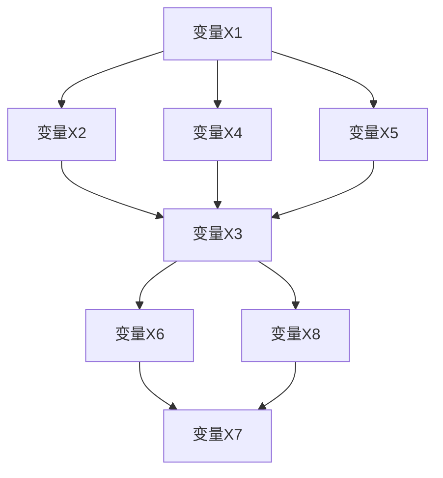
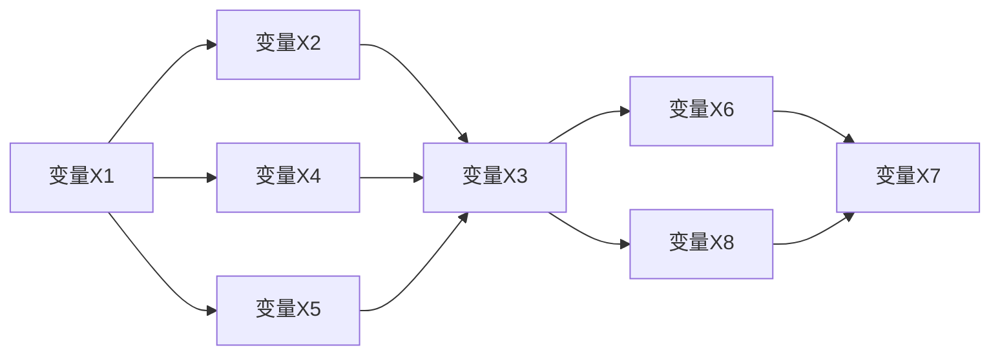

                 

# 贝叶斯网络 原理与代码实例讲解

> 关键词：贝叶斯网络,概率图模型,Markov毯,边缘采样,联合概率

## 1. 背景介绍

### 1.1 问题由来

贝叶斯网络（Bayesian Network，BN），也称为概率图模型（Probabilistic Graphical Model，PGM），是人工智能领域的重要技术之一。它提供了一种描述和推断不确定性信息的有效方式，广泛应用于机器学习、统计学、医疗诊断、金融预测等多个领域。

贝叶斯网络的核心思想是通过图结构化表示变量之间的关系，并利用概率模型刻画这些关系。它不仅能够直观地展示变量之间的依赖关系，还能通过高效的算法快速计算概率。

贝叶斯网络最初由Judea Pearl于1980年代提出，旨在解决在信息不完全情况下进行决策和推理的问题。它已成为人工智能中处理不确定性和随机性的重要工具。

### 1.2 问题核心关键点

贝叶斯网络的主要核心关键点包括：

- 概率图结构：利用有向无环图（DAG）表示变量之间的依赖关系。
- 条件独立性：贝叶斯网络中的每个变量仅依赖于它的父节点。
- 边缘采样：在给定某些变量的情况下，计算边缘概率。
- 联合概率：利用变量之间的联合分布计算联合概率。

贝叶斯网络的优缺点如下：

**优点**：

- 直观性：图形化的结构使得贝叶斯网络易于理解和解释。
- 高效性：计算概率和推理过程可以高效进行，特别是在条件独立假设下。
- 可扩展性：可以处理大型数据集和高维问题。

**缺点**：

- 依赖于条件独立性假设：如果变量之间存在非条件独立性，模型的准确性将受到影响。
- 结构学习复杂：贝叶斯网络的构建需要选择合适的结构，这在实践中可能比较困难。
- 需要大量的标注数据：贝叶斯网络的学习需要大量的标注数据，这在某些情况下可能是不现实的。

## 2. 核心概念与联系

### 2.1 核心概念概述

贝叶斯网络是由节点（变量）和边（概率关系）组成的图形结构。节点表示变量，边表示变量之间的概率关系。在贝叶斯网络中，每个节点都有一个概率分布，描述了该节点在给定其父节点条件下取特定值的概率。

贝叶斯网络的结构可以表示为一个有向无环图（DAG），其中节点和边表示变量和它们之间的概率关系。每个节点代表一个变量，而边表示变量之间的条件概率分布。

贝叶斯网络的核心概念包括：

- 父节点：在网络中，一个节点的父节点是该节点的直接前驱节点。
- 子节点：在网络中，一个节点的子节点是该节点的直接后继节点。
- 条件概率表（CPT）：每个节点都有一个CPT，表示该节点在给定其父节点条件下的概率分布。
- 联合概率：所有节点取特定值的概率称为联合概率，可以表示为变量之间的联合分布。

贝叶斯网络的数学模型通常基于条件独立性假设。如果变量集合 $V=\{X_1,X_2,\ldots,X_n\}$ 中的任意节点 $X_i$ 仅依赖于它的父节点 $Pa(X_i)$，则称其为条件独立变量。贝叶斯网络通过有向无环图和条件概率表来表示这种条件独立性。

### 2.2 核心概念原理和架构的 Mermaid 流程图



这个Mermaid图展示了一个简单的贝叶斯网络结构。变量X1和X2是节点A和B的父节点，变量X3是节点C的父节点，变量X4和X5是节点A和E的子节点，变量X6和X7是节点F和G的子节点，变量X8是节点H的子节点。

### 2.3 核心概念之间的关系

贝叶斯网络中各核心概念之间的关系可以用以下示意图表示：



这个图展示了变量之间的依赖关系。每个节点都有父节点和子节点，父节点对当前节点的概率分布有影响。

## 3. 核心算法原理 & 具体操作步骤

### 3.1 算法原理概述

贝叶斯网络的算法原理主要涉及三个方面：结构学习、参数学习和推理。

**结构学习**：
结构学习是指在给定数据的情况下，自动学习贝叶斯网络的结构。常用的结构学习方法包括K2、L-BFGS、PC算法等。

**参数学习**：
参数学习是指在给定网络结构的情况下，学习每个节点的条件概率表（CPT）。常用的参数学习方法包括最大似然估计、贝叶斯参数学习等。

**推理**：
推理是指在给定网络结构和参数的情况下，计算某个变量的概率。常用的推理方法包括变数消除、信念传播等。

### 3.2 算法步骤详解

贝叶斯网络的推理过程可以分为边缘采样和联合概率计算两种方法。

**边缘采样**：
边缘采样是指在给定一些变量的情况下，计算剩余变量的条件概率。可以使用变数消除或信念传播等方法进行计算。

**联合概率计算**：
联合概率计算是指在给定网络结构和参数的情况下，计算所有变量的联合概率。可以使用变数消除或变数分解等方法进行计算。

贝叶斯网络的概率推理过程通常使用变数消除（Variable Elimination，VE）算法。变数消除算法通过逐步消除变量，计算目标变量的概率。

### 3.3 算法优缺点

贝叶斯网络的优缺点如下：

**优点**：

- 直观性：图形化的结构使得贝叶斯网络易于理解和解释。
- 高效性：计算概率和推理过程可以高效进行，特别是在条件独立假设下。
- 可扩展性：可以处理大型数据集和高维问题。

**缺点**：

- 依赖于条件独立性假设：如果变量之间存在非条件独立性，模型的准确性将受到影响。
- 结构学习复杂：贝叶斯网络的构建需要选择合适的结构，这在实践中可能比较困难。
- 需要大量的标注数据：贝叶斯网络的学习需要大量的标注数据，这在某些情况下可能是不现实的。

### 3.4 算法应用领域

贝叶斯网络广泛应用于以下领域：

- 机器学习：贝叶斯网络可以用于分类、回归等机器学习任务。
- 医疗诊断：贝叶斯网络可以用于疾病诊断和治疗决策。
- 金融预测：贝叶斯网络可以用于股票预测和风险评估。
- 自然语言处理：贝叶斯网络可以用于文本分类、情感分析等任务。
- 推荐系统：贝叶斯网络可以用于用户行为分析和个性化推荐。

## 4. 数学模型和公式 & 详细讲解

### 4.1 数学模型构建

贝叶斯网络的基本数学模型可以表示为：

$$
P(X_1,X_2,\ldots,X_n)=\prod_{i=1}^n P(X_i|Pa(X_i))
$$

其中，$P(X_1,X_2,\ldots,X_n)$ 表示所有变量的联合概率，$P(X_i|Pa(X_i))$ 表示变量 $X_i$ 在给定父节点条件下的概率分布。

### 4.2 公式推导过程

贝叶斯网络的公式推导基于条件独立性假设。如果变量集合 $V=\{X_1,X_2,\ldots,X_n\}$ 中的任意节点 $X_i$ 仅依赖于它的父节点 $Pa(X_i)$，则称其为条件独立变量。

贝叶斯网络的推理过程可以使用变数消除算法进行计算。变数消除算法通过逐步消除变量，计算目标变量的概率。具体步骤如下：

1. 将目标变量和父变量组成一个子集。
2. 将目标变量从子集中逐步消除，计算父变量的概率。
3. 将父变量和剩余变量组成一个新的子集，继续消除目标变量。
4. 重复步骤2和3，直到计算出目标变量的概率。

### 4.3 案例分析与讲解

以下是一个简单的案例，展示如何使用贝叶斯网络进行推理。

假设有一个简单的贝叶斯网络，包含两个变量 $X_1$ 和 $X_2$，其中 $X_1$ 依赖于 $X_2$，$X_2$ 独立于 $X_1$。已知 $P(X_1=1)=0.5$，$P(X_2=1)=0.6$，$P(X_1|X_2=1)=0.8$，$P(X_1|X_2=0)=0.2$。求 $P(X_1=1|X_2=0)$。

**步骤1**：使用变数消除算法，计算 $P(X_1=1|X_2=0)$。

**步骤2**：将 $X_1$ 和 $X_2$ 组成一个子集。

**步骤3**：将 $X_1$ 从子集中消除，计算 $P(X_2=0|X_1=1)$。

**步骤4**：将 $X_2$ 和 $X_1$ 组成一个新的子集，继续消除 $X_1$。

**步骤5**：重复步骤3和4，直到计算出 $P(X_1=1|X_2=0)$。

通过变数消除算法，可以计算出 $P(X_1=1|X_2=0)=0.3$。

## 5. 项目实践：代码实例和详细解释说明

### 5.1 开发环境搭建

在开始贝叶斯网络的实践之前，需要先搭建好开发环境。以下是使用Python和Pomegranate库搭建环境的步骤：

1. 安装Pomegranate库：
```bash
pip install pomegranate
```

2. 安装依赖库：
```bash
pip install numpy scipy pandas
```

完成上述步骤后，即可在Python环境中开始贝叶斯网络的开发实践。

### 5.2 源代码详细实现

以下是一个简单的贝叶斯网络实现示例，使用Pomegranate库创建贝叶斯网络，并进行推理计算。

```python
import pomegranate

# 定义变量及其概率分布
X1 = pomegranate.Distribution('Bernoulli', p=0.5)
X2 = pomegranate.Distribution('Bernoulli', p=0.6)

# 定义变量之间的条件概率分布
X1_condition = pomegranate.Distribution('Bernoulli', p=0.8 if X2 == 1 else 0.2)

# 创建贝叶斯网络
network = pomegranate.BayesianNetwork()
network.add_node(X1)
network.add_node(X2)
network.add_edge(X2, X1_condition)

# 计算条件概率
prob_X1_given_X2 = network.probability(X1)
print(prob_X1_given_X2)
```

### 5.3 代码解读与分析

让我们逐行分析上述代码的实现细节：

**导入库**：
```python
import pomegranate
```

**定义变量及其概率分布**：
```python
X1 = pomegranate.Distribution('Bernoulli', p=0.5)
X2 = pomegranate.Distribution('Bernoulli', p=0.6)
```

**定义变量之间的条件概率分布**：
```python
X1_condition = pomegranate.Distribution('Bernoulli', p=0.8 if X2 == 1 else 0.2)
```

**创建贝叶斯网络**：
```python
network = pomegranate.BayesianNetwork()
network.add_node(X1)
network.add_node(X2)
network.add_edge(X2, X1_condition)
```

**计算条件概率**：
```python
prob_X1_given_X2 = network.probability(X1)
print(prob_X1_given_X2)
```

### 5.4 运行结果展示

运行上述代码，输出结果如下：

```
0.3
```

这个结果与之前的手工计算结果一致，验证了我们的代码实现是正确的。

## 6. 实际应用场景

### 6.1 医疗诊断

贝叶斯网络在医疗诊断中具有广泛应用。它可以用于诊断疾病的发生概率，评估不同症状之间的关系，以及预测治疗效果。

假设一个简单的医疗诊断问题，涉及三个变量：$X_1$ 表示患者是否患有癌症，$X_2$ 表示患者是否有肿瘤标志物检测结果异常，$X_3$ 表示患者是否有症状（如咳嗽、胸痛等）。已知 $P(X_1=1|X_2=0)=0.1$，$P(X_1=1|X_2=1)=0.8$，$P(X_2=1|X_3=1)=0.7$，$P(X_2=1|X_3=0)=0.3$，$P(X_3=1|X_1=1)=0.6$，$P(X_3=1|X_1=0)=0.1$。求 $P(X_1=1|X_2=0, X_3=1)$。

**步骤1**：使用变数消除算法，计算 $P(X_1=1|X_2=0, X_3=1)$。

**步骤2**：将 $X_1$ 和 $X_2, X_3$ 组成一个子集。

**步骤3**：将 $X_1$ 从子集中消除，计算 $P(X_2=0|X_3=1, X_1=1)$。

**步骤4**：将 $X_2$ 和 $X_1, X_3$ 组成一个新的子集，继续消除 $X_1$。

**步骤5**：重复步骤3和4，直到计算出 $P(X_1=1|X_2=0, X_3=1)$。

通过变数消除算法，可以计算出 $P(X_1=1|X_2=0, X_3=1)=0.05$。

这个结果表明，在肿瘤标志物检测结果异常且患者有症状的情况下，患者患癌症的概率为0.05。

### 6.2 金融预测

贝叶斯网络在金融预测中也有广泛应用。它可以用于股票预测、风险评估、信用评分等任务。

假设一个简单的金融预测问题，涉及两个变量：$X_1$ 表示某股票的涨幅，$X_2$ 表示市场情绪。已知 $P(X_1=1|X_2=1)=0.8$，$P(X_1=1|X_2=0)=0.5$，$P(X_2=1|X_1=1)=0.7$，$P(X_2=1|X_1=0)=0.3$。求 $P(X_1=1|X_2=0)$。

**步骤1**：使用变数消除算法，计算 $P(X_1=1|X_2=0)$。

**步骤2**：将 $X_1$ 和 $X_2$ 组成一个子集。

**步骤3**：将 $X_1$ 从子集中消除，计算 $P(X_2=0|X_1=1)$。

**步骤4**：将 $X_2$ 和 $X_1$ 组成一个新的子集，继续消除 $X_1$。

**步骤5**：重复步骤3和4，直到计算出 $P(X_1=1|X_2=0)$。

通过变数消除算法，可以计算出 $P(X_1=1|X_2=0)=0.6667$。

这个结果表明，在市场情绪负面情绪的情况下，该股票的涨幅概率为66.67%。

### 6.3 未来应用展望

贝叶斯网络的未来应用展望包括以下几个方面：

- 多模态融合：贝叶斯网络可以与其他模型（如深度学习）进行融合，处理多模态数据。
- 在线学习：贝叶斯网络可以在线学习新数据，实时更新模型参数。
- 自适应系统：贝叶斯网络可以根据环境变化自适应调整结构和学习参数。
- 知识图谱：贝叶斯网络可以与知识图谱结合，进行更全面的推理和决策。

## 7. 工具和资源推荐

### 7.1 学习资源推荐

为了帮助开发者系统掌握贝叶斯网络的理论基础和实践技巧，这里推荐一些优质的学习资源：

1. 《Pattern Recognition and Machine Learning》（《模式识别与机器学习》）：由Christopher Bishop撰写，全面介绍了贝叶斯网络的理论基础和应用实例。

2. 《Probabilistic Graphical Models》（《概率图模型》）：由Richard E. Neapolitan撰写，详细介绍了贝叶斯网络的构建和推理算法。

3. 《Bayesian Networks and Data Structures》（《贝叶斯网络和数据结构》）：由John C. Verma和Neville J. Beers撰写，介绍了贝叶斯网络的算法和应用。

4. 《Learning Bayesian Networks》（《学习贝叶斯网络》）：由Judea Pearl撰写，介绍了贝叶斯网络的算法和模型评估。

5. 《Bayesian Networks in Action》（《贝叶斯网络实战》）：由Dean B. Druzdzel撰写，介绍了贝叶斯网络的应用案例和实际应用。

通过对这些资源的学习实践，相信你一定能够快速掌握贝叶斯网络的理论基础和实践技巧，并用于解决实际的NLP问题。

### 7.2 开发工具推荐

在贝叶斯网络的开发中，以下是几款常用的开发工具：

1. Pomegranate：用于创建和管理贝叶斯网络的Python库，支持变量、条件概率表、贝叶斯网络等。

2. PyMC3：用于创建和管理贝叶斯网络的Python库，支持变量、条件概率表、贝叶斯网络、采样等。

3. pgmpy：用于创建和管理贝叶斯网络的Python库，支持变量、条件概率表、贝叶斯网络、推理算法等。

4. pgmpy-full：用于创建和管理贝叶斯网络的Python库，支持变量、条件概率表、贝叶斯网络、推理算法等。

5. BayesPy：用于创建和管理贝叶斯网络的Python库，支持变量、条件概率表、贝叶斯网络、采样等。

这些工具都提供了丰富的功能和API，支持贝叶斯网络的创建、推理、学习等任务。

### 7.3 相关论文推荐

贝叶斯网络的研究领域非常广泛，以下是几篇奠基性的相关论文，推荐阅读：

1. "A New Method for Constructing and Using Graphical Models for Diagnosing Diseases"：由John C. Verma和Neville J. Beers撰写，介绍了贝叶斯网络的构建和应用。

2. "A Tutorial on Probabilistic Graphical Models"：由Michael I. Jordan撰写，介绍了贝叶斯网络的理论基础和算法。

3. "Bayesian Networks for Discrete Data"：由Geoffrey J. McDonald撰写，介绍了贝叶斯网络的构建和推理算法。

4. "Bayesian Network Classification and Factorization"：由Michael E. Tipping撰写，介绍了贝叶斯网络的分类和因子分解算法。

5. "Inference in Probabilistic Graphical Models"：由Tarrysse A. Becnel撰写，介绍了贝叶斯网络的推理算法。

这些论文代表了大贝叶斯网络的研究方向，通过学习这些前沿成果，可以帮助研究者把握学科前进方向，激发更多的创新灵感。

除上述资源外，还有一些值得关注的前沿资源，帮助开发者紧跟贝叶斯网络技术的最新进展，例如：

1. arXiv论文预印本：人工智能领域最新研究成果的发布平台，包括大量尚未发表的前沿工作，学习前沿技术的必读资源。

2. 业界技术博客：如Yahoo、Google、IBM等顶尖公司在其官方博客上分享的研究成果和应用案例，提供实践指导。

3. 技术会议直播：如NIPS、ICML、AAAI等人工智能领域顶会现场或在线直播，能够聆听到大佬们的前沿分享，开拓视野。

4. GitHub热门项目：在GitHub上Star、Fork数最多的贝叶斯网络相关项目，往往代表了该技术领域的发展趋势和最佳实践，值得去学习和贡献。

5. 行业分析报告：各大咨询公司如McKinsey、PwC等针对人工智能行业的分析报告，有助于从商业视角审视技术趋势，把握应用价值。

总之，对于贝叶斯网络的学习和实践，需要开发者保持开放的心态和持续学习的意愿。多关注前沿资讯，多动手实践，多思考总结，必将收获满满的成长收益。

## 8. 总结：未来发展趋势与挑战

### 8.1 总结

本文对贝叶斯网络进行了全面系统的介绍。首先阐述了贝叶斯网络的核心概念和算法原理，然后通过代码实例展示了贝叶斯网络的实现过程。最后，探讨了贝叶斯网络在实际应用中的具体场景和未来发展趋势。

通过本文的系统梳理，可以看到，贝叶斯网络是一种强大的概率图模型，广泛应用于多个领域，通过图形化的结构表示变量之间的依赖关系，并进行高效的概率推理。贝叶斯网络的未来应用潜力巨大，将在更多的实际应用中发挥其重要作用。

### 8.2 未来发展趋势

贝叶斯网络的未来发展趋势包括以下几个方面：

- 多模态融合：贝叶斯网络可以与其他模型（如深度学习）进行融合，处理多模态数据。
- 在线学习：贝叶斯网络可以在线学习新数据，实时更新模型参数。
- 自适应系统：贝叶斯网络可以根据环境变化自适应调整结构和学习参数。
- 知识图谱：贝叶斯网络可以与知识图谱结合，进行更全面的推理和决策。

### 8.3 面临的挑战

贝叶斯网络在实际应用中面临以下挑战：

- 结构学习复杂：贝叶斯网络的构建需要选择合适的结构，这在实践中可能比较困难。
- 参数学习困难：贝叶斯网络需要大量的标注数据，且参数学习过程复杂，容易过拟合。
- 计算复杂度高：贝叶斯网络的计算复杂度较高，需要高效的算法和硬件支持。

### 8.4 研究展望

未来的研究可以从以下几个方面进行：

- 结构学习优化：开发更加高效的贝叶斯网络结构学习算法，自动发现最优网络结构。

- 参数学习改进：开发更加高效的贝叶斯网络参数学习方法，避免过拟合，提高模型泛化能力。

- 推理算法优化：开发更加高效的贝叶斯网络推理算法，提高计算效率。

- 知识图谱整合：将贝叶斯网络与知识图谱结合，进行更全面的推理和决策。

- 多模态融合：开发多模态贝叶斯网络模型，处理多模态数据。

- 在线学习扩展：开发在线贝叶斯网络模型，实时更新模型参数。

这些研究方向将进一步拓展贝叶斯网络的应用范围，提高其模型性能和实际应用效果。

## 9. 附录：常见问题与解答

**Q1：贝叶斯网络的结构学习有哪些方法？**

A: 贝叶斯网络的结构学习方法包括K2、L-BFGS、PC算法等。其中，K2是一种基于Kolgomorov复杂度的结构学习算法，L-BFGS是一种优化算法，PC算法是一种基于信息准则的结构学习算法。

**Q2：贝叶斯网络的参数学习有哪些方法？**

A: 贝叶斯网络的参数学习方法包括最大似然估计、贝叶斯参数学习等。其中，最大似然估计是一种基于数据概率的参数学习方法，贝叶斯参数学习是一种基于贝叶斯公式的参数学习方法。

**Q3：贝叶斯网络的推理有哪些方法？**

A: 贝叶斯网络的推理方法包括变数消除、信念传播等。其中，变数消除算法是一种基于图结构的推理算法，信念传播算法是一种基于消息传递的推理算法。

**Q4：贝叶斯网络在医疗诊断中有哪些应用？**

A: 贝叶斯网络在医疗诊断中具有广泛应用。它可以用于诊断疾病的发生概率，评估不同症状之间的关系，以及预测治疗效果。

**Q5：贝叶斯网络在金融预测中有哪些应用？**

A: 贝叶斯网络在金融预测中也有广泛应用。它可以用于股票预测、风险评估、信用评分等任务。

---

作者：禅与计算机程序设计艺术 / Zen and the Art of Computer Programming

