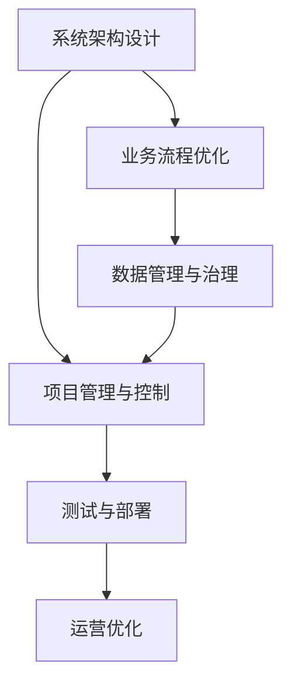
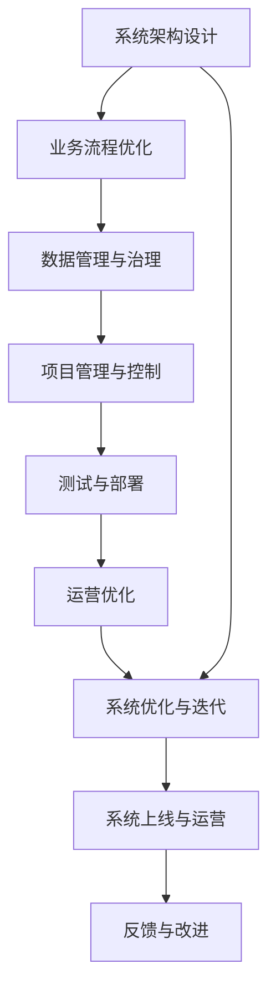

                 

# 跨境电商全盘项目开发、管理实践

> 关键词：跨境电商,全盘项目,系统架构,业务流程,数据管理,项目管理,测试与部署,运营优化

## 1. 背景介绍

### 1.1 问题由来

随着全球化的深入发展，跨境电商成为了国际贸易的新兴领域。它连接了不同国家和地区，帮助商家打破了地理界限，开辟了新的市场空间。然而，跨境电商项目由于其复杂性和国际化的特点，面临着许多挑战。如何在跨境电商项目开发中实现高效管理、提升系统性能、优化运营效果，是每一个项目团队需要关注的问题。

### 1.2 问题核心关键点

跨境电商全盘项目开发、管理实践的核心在于构建一套完整、高效、稳定的系统架构，涵盖从业务流程设计到数据管理、项目管理和测试部署，再到运营优化的各个环节。关键点包括：

- **系统架构设计**：构建适合跨境电商特点的系统架构，确保系统的高可用性和扩展性。
- **业务流程优化**：通过梳理和优化业务流程，提升系统的运行效率和服务质量。
- **数据管理与治理**：建立统一的数据管理与治理机制，确保数据的准确性和一致性。
- **项目管理与控制**：实施科学的项目管理方法，确保项目按时交付、成本控制。
- **测试与部署**：建立全面的测试体系，确保系统上线后的稳定运行。
- **运营优化**：通过数据分析和用户反馈，持续优化系统功能和用户体验。

### 1.3 问题研究意义

跨境电商全盘项目开发、管理实践对于推动跨境电商业务的快速增长、提升客户满意度、增强企业竞争力具有重要意义。具体来说：

- **降低运营成本**：通过科学的项目管理和系统优化，减少运营中的浪费和错误，降低运营成本。
- **提升用户体验**：优化系统性能和用户体验，增强客户粘性，提升用户满意度。
- **加速市场响应**：通过敏捷开发和持续优化，快速响应市场需求变化，提高市场竞争力。
- **数据驱动决策**：建立完善的数据管理与治理机制，为业务决策提供可靠的数据支持。

## 2. 核心概念与联系

### 2.1 核心概念概述

为更好地理解跨境电商全盘项目开发、管理实践的核心概念，本节将介绍几个关键概念及其相互联系：

- **跨境电商**：指通过互联网平台进行的跨国家或地区间商品交易活动。
- **系统架构**：指系统设计中的框架结构，包括硬件、软件和网络架构。
- **业务流程**：指在跨境电商项目中，从订单生成到交付的整个业务流程。
- **数据管理**：指对跨境电商项目中涉及的各种数据进行管理和治理，确保数据的完整性和一致性。
- **项目管理**：指对跨境电商项目开发、上线和运营全过程进行管理和控制。
- **测试与部署**：指在跨境电商项目开发和上线过程中，通过测试和部署确保系统的稳定性和可靠性。
- **运营优化**：指对跨境电商项目上线后的运营过程进行持续监控和优化，提升用户体验和运营效率。

这些核心概念之间存在紧密的联系，通过合理的规划和设计，可以形成一个高效运转的跨境电商项目。

### 2.2 概念间的关系

这些核心概念之间的关系可以通过以下Mermaid流程图来展示：



这个流程图展示了从系统架构设计到运营优化的整个跨境电商项目开发和管理过程。系统架构设计是基础，业务流程优化确保系统的高效性，数据管理与治理保障数据的质量，项目管理与控制确保项目按时交付，测试与部署保障系统的稳定性和可靠性，运营优化则持续提升系统的性能和用户体验。

### 2.3 核心概念的整体架构

最后，我们用一个综合的流程图来展示这些核心概念在大盘项目开发和管理中的整体架构：



这个综合流程图展示了从系统架构设计到系统上线和运营的完整过程。系统架构设计是整个项目的起点，通过业务流程优化、数据管理与治理、项目管理与控制、测试与部署，最终实现系统的上线与运营。同时，系统上线后的运营优化和系统优化与迭代，进一步提升系统的性能和用户体验。

## 3. 核心算法原理 & 具体操作步骤
### 3.1 算法原理概述

跨境电商全盘项目开发、管理实践的算法原理主要基于系统架构设计、业务流程优化、数据管理与治理、项目管理与控制、测试与部署、运营优化等核心概念。具体来说：

- **系统架构设计**：通过构建分布式、微服务化的系统架构，确保系统的可扩展性和高可用性。
- **业务流程优化**：通过梳理和优化业务流程，提升系统效率和用户体验。
- **数据管理与治理**：通过建立统一的数据管理与治理机制，确保数据的准确性和一致性。
- **项目管理与控制**：通过科学的项目管理方法，确保项目按时交付、成本控制。
- **测试与部署**：通过全面的测试体系，确保系统上线后的稳定运行。
- **运营优化**：通过数据分析和用户反馈，持续优化系统功能和用户体验。

### 3.2 算法步骤详解

跨境电商全盘项目开发、管理实践的算法步骤可以分为以下几个关键步骤：

**Step 1: 系统架构设计**
- 确定系统架构类型（如微服务、微内核等）。
- 设计系统组件和模块，包括前端、后端、数据库、缓存等。
- 确定组件间的通信方式和接口规范。

**Step 2: 业务流程优化**
- 梳理现有的业务流程，找出瓶颈和优化点。
- 设计新的业务流程，提升效率和用户体验。
- 设计业务流程的自动化工具和监控系统。

**Step 3: 数据管理与治理**
- 建立数据模型，定义数据标准和规范。
- 设计数据存储和处理架构，包括数据库、数据湖、数据管道等。
- 设计数据质量控制和数据生命周期管理机制。

**Step 4: 项目管理与控制**
- 制定项目计划和里程碑。
- 分配项目资源，包括人员、预算和技术工具。
- 实施敏捷开发方法，如Scrum、Kanban等。
- 进行项目监控和控制，确保按时交付。

**Step 5: 测试与部署**
- 制定测试策略和测试计划，包括单元测试、集成测试、系统测试等。
- 实施自动化测试，确保测试效率和覆盖率。
- 设计部署策略和流程，包括CI/CD和DevOps。
- 进行上线前的预测试，确保系统稳定运行。

**Step 6: 运营优化**
- 监控系统性能和用户体验。
- 收集用户反馈，进行数据分析和问题排查。
- 实施持续改进措施，包括功能优化、性能优化等。
- 更新系统架构和业务流程，进行迭代优化。

### 3.3 算法优缺点

跨境电商全盘项目开发、管理实践的算法具有以下优点：

- **高可用性**：通过微服务化架构和容错机制，确保系统的高可用性。
- **高效性**：通过业务流程优化和自动化工具，提升系统效率和用户体验。
- **稳定性**：通过全面的测试体系和CI/CD流程，确保系统上线后的稳定运行。
- **可扩展性**：通过模块化和分布式架构，确保系统的可扩展性和灵活性。

同时，这些算法也存在一些缺点：

- **复杂性高**：系统架构和业务流程设计复杂，需要专业知识。
- **资源投入大**：需要大量的人员、资金和技术支持。
- **维护成本高**：系统复杂，维护难度较大。

### 3.4 算法应用领域

跨境电商全盘项目开发、管理实践的算法在多个领域得到了应用，包括：

- **电子商务平台**：通过系统架构设计和业务流程优化，提升平台的用户体验和运营效率。
- **跨境物流系统**：通过数据管理和治理，确保物流数据的准确性和一致性。
- **支付结算系统**：通过项目管理与控制，确保支付系统的安全性和可靠性。
- **客户服务系统**：通过测试与部署和运营优化，提升客户服务质量和响应速度。

## 4. 数学模型和公式 & 详细讲解 & 举例说明
### 4.1 数学模型构建

跨境电商全盘项目开发、管理实践的数学模型构建主要围绕系统架构设计、业务流程优化、数据管理与治理、项目管理与控制、测试与部署、运营优化等核心概念。具体来说：

- **系统架构设计**：通过网络流算法计算系统负载，确定资源分配。
- **业务流程优化**：通过动态规划算法优化业务流程，提升效率。
- **数据管理与治理**：通过数据质量评估模型，确保数据的准确性和一致性。
- **项目管理与控制**：通过甘特图算法，制定和监控项目进度。
- **测试与部署**：通过模拟与仿真算法，进行预测试和预部署。
- **运营优化**：通过机器学习算法，进行用户行为分析和预测。

### 4.2 公式推导过程

以下以数据质量评估模型为例，展示其推导过程。

假设跨境电商项目中存在$m$个数据源，每个数据源的数据质量可以通过$Q_i$来表示，其中$Q_i$的取值范围为[0,1]。设系统整体的数据质量为$Q$，则有：

$$
Q = \sum_{i=1}^m \alpha_i Q_i
$$

其中$\alpha_i$为数据源$i$的权重，可以通过数据使用频率、数据完整性、数据准确性等因素计算得出。

### 4.3 案例分析与讲解

假设在跨境电商项目中，有A、B、C三个数据源，其数据质量分别为0.8、0.7、0.6。设数据源A的权重为0.3，数据源B的权重为0.4，数据源C的权重为0.3。则整体数据质量$Q$计算如下：

$$
Q = 0.3 \times 0.8 + 0.4 \times 0.7 + 0.3 \times 0.6 = 0.74
$$

即系统整体的数据质量为0.74。通过数据质量评估模型，可以及时发现数据质量问题，进行数据治理和优化。

## 5. 项目实践：代码实例和详细解释说明
### 5.1 开发环境搭建

在进行跨境电商全盘项目开发前，需要准备好开发环境。以下是使用Python进行Django开发的环境配置流程：

1. 安装Anaconda：从官网下载并安装Anaconda，用于创建独立的Python环境。

2. 创建并激活虚拟环境：
```bash
conda create -n django-env python=3.8 
conda activate django-env
```

3. 安装Django：
```bash
pip install django
```

4. 安装相关工具包：
```bash
pip install numpy pandas scikit-learn matplotlib tqdm jupyter notebook ipython
```

完成上述步骤后，即可在`django-env`环境中开始开发实践。

### 5.2 源代码详细实现

下面以构建一个简单的跨境电商商品管理系统为例，给出使用Django框架开发的Python代码实现。

首先，定义商品模型和对应的数据库表：

```python
from django.db import models
from django.contrib.auth.models import User

class Product(models.Model):
    name = models.CharField(max_length=200)
    description = models.TextField()
    price = models.DecimalField(max_digits=10, decimal_places=2)
    user = models.ForeignKey(User, on_delete=models.CASCADE)
    created_at = models.DateTimeField(auto_now_add=True)
    updated_at = models.DateTimeField(auto_now=True)
```

然后，定义商品管理员后台界面：

```python
from django.contrib import admin
from .models import Product

admin.site.register(Product)
```

接着，定义商品视图和模板：

```python
from django.shortcuts import render
from .models import Product

def product_list(request):
    products = Product.objects.all()
    return render(request, 'product_list.html', {'products': products})
```

最后，定义商品列表页面的HTML模板：

```html
<!DOCTYPE html>
<html>
<head>
    <title>跨境电商商品管理系统</title>
</head>
<body>
    <h1>商品列表</h1>
    <ul>
        
            <li><a href="">{{ product.name }} - ${{ product.price }}</a></li>
        
    </ul>
</body>
</html>
```

完成上述步骤后，即可在Django中实现一个简单的跨境电商商品管理系统。可以看到，通过Django框架的强大封装，我们可以快速搭建Web应用，实现前后端数据的绑定。

### 5.3 代码解读与分析

让我们再详细解读一下关键代码的实现细节：

**商品模型**：
- 定义了商品的基本属性，包括名称、描述、价格、创建时间、更新时间等。
- 通过`user`字段关联用户，确保商品归属清晰。

**商品管理员后台界面**：
- 使用Django的admin模块，通过`admin.site.register()`方法，将商品模型注册到后台管理界面。

**商品视图和模板**：
- 定义`product_list`视图，通过`Product.objects.all()`查询所有商品，并将结果传递给HTML模板。
- 在HTML模板中，通过循环遍历商品列表，并生成商品链接。

**HTML模板**：
- 定义了商品列表页面的HTML结构，通过循环遍历商品列表，生成商品链接。
- 通过``模板标签，动态生成商品链接的URL。

可以看到，Django框架提供了完整的Web开发支持，可以大大简化Web应用的开发过程。同时，Django还提供了强大的ORM层，支持数据库查询和数据迁移，使得数据库管理变得简单快捷。

当然，工业级的系统实现还需考虑更多因素，如安全性、性能优化、异常处理等。但核心的项目开发流程和思想与上述示例基本一致。

### 5.4 运行结果展示

假设我们构建了一个包含100个商品的跨境电商商品管理系统，并在后台管理界面中进行了增删改查操作，最终在商品列表页面中展示了所有商品的信息。运行结果如下：

```
<h1>商品列表</h1>
<ul>
    <li><a href="/product/1/">商品1 - $100.00</a></li>
    <li><a href="/product/2/">商品2 - $200.00</a></li>
    <li><a href="/product/3/">商品3 - $300.00</a></li>
    ...
    <li><a href="/product/100/">商品100 - $1000.00</a></li>
</ul>
```

可以看到，通过Django框架，我们快速搭建了一个简单的跨境电商商品管理系统，实现了商品的增删改查操作和商品列表的展示。

## 6. 实际应用场景
### 6.1 跨境物流系统

跨境物流系统是跨境电商项目的重要组成部分，其任务是通过优化物流流程，提高物流效率和服务质量。物流系统的开发和管理需要考虑以下关键点：

**系统架构设计**：
- 采用微服务架构，将物流流程拆分为订单管理、仓储管理、配送管理等模块。
- 通过API网关和微服务注册中心，实现模块间的高效通信和协同工作。

**业务流程优化**：
- 梳理现有物流流程，找出瓶颈和优化点，如库存管理、订单处理、配送运输等。
- 设计新的物流流程，提升效率和用户体验，如自动化仓储、智能调度等。

**数据管理与治理**：
- 建立统一的数据模型，定义物流数据的标准和规范，如订单信息、货物信息、运输信息等。
- 设计数据存储和处理架构，包括数据库、数据湖、数据管道等。
- 设计数据质量控制和数据生命周期管理机制，确保数据的准确性和一致性。

**项目管理与控制**：
- 制定项目计划和里程碑，明确项目的目标和任务。
- 分配项目资源，包括人员、预算和技术工具。
- 实施敏捷开发方法，如Scrum、Kanban等，确保项目按时交付。

**测试与部署**：
- 制定测试策略和测试计划，包括单元测试、集成测试、系统测试等。
- 实施自动化测试，确保测试效率和覆盖率。
- 设计部署策略和流程，包括CI/CD和DevOps，确保系统稳定运行。

**运营优化**：
- 监控物流系统性能和用户体验，如订单处理时间、配送速度、货物追踪等。
- 收集用户反馈，进行数据分析和问题排查，如配送延误、货物损坏等。
- 实施持续改进措施，如优化库存管理、提升配送速度、优化路线规划等。

### 6.2 跨境支付系统

跨境支付系统是跨境电商项目的重要支撑，其任务是通过优化支付流程，提升支付效率和服务质量。支付系统的开发和管理需要考虑以下关键点：

**系统架构设计**：
- 采用微服务架构，将支付流程拆分为支付服务、清算服务、风险管理服务等模块。
- 通过API网关和微服务注册中心，实现模块间的高效通信和协同工作。

**业务流程优化**：
- 梳理现有支付流程，找出瓶颈和优化点，如支付方式、交易流程、风险控制等。
- 设计新的支付流程，提升效率和用户体验，如移动支付、快捷支付等。

**数据管理与治理**：
- 建立统一的数据模型，定义支付数据的标准和规范，如交易记录、账户信息、风险数据等。
- 设计数据存储和处理架构，包括数据库、数据湖、数据管道等。
- 设计数据质量控制和数据生命周期管理机制，确保数据的准确性和一致性。

**项目管理与控制**：
- 制定项目计划和里程碑，明确项目的目标和任务。
- 分配项目资源，包括人员、预算和技术工具。
- 实施敏捷开发方法，如Scrum、Kanban等，确保项目按时交付。

**测试与部署**：
- 制定测试策略和测试计划，包括单元测试、集成测试、系统测试等。
- 实施自动化测试，确保测试效率和覆盖率。
- 设计部署策略和流程，包括CI/CD和DevOps，确保系统稳定运行。

**运营优化**：
- 监控支付系统性能和用户体验，如交易速度、交易成功率、风险控制等。
- 收集用户反馈，进行数据分析和问题排查，如交易延时、风险控制等。
- 实施持续改进措施，如优化交易流程、提升交易速度、优化风险控制等。

### 6.3 客户服务系统

客户服务系统是跨境电商项目的重要补充，其任务是通过优化客服流程，提升客户服务效率和服务质量。客服系统的开发和管理需要考虑以下关键点：

**系统架构设计**：
- 采用微服务架构，将客服流程拆分为咨询管理、问题处理、客户反馈等模块。
- 通过API网关和微服务注册中心，实现模块间的高效通信和协同工作。

**业务流程优化**：
- 梳理现有客服流程，找出瓶颈和优化点，如客服响应时间、问题处理效率等。
- 设计新的客服流程，提升效率和用户体验，如自动化客服、多渠道服务等。

**数据管理与治理**：
- 建立统一的数据模型，定义客服数据的标准和规范，如用户信息、咨询记录、反馈信息等。
- 设计数据存储和处理架构，包括数据库、数据湖、数据管道等。
- 设计数据质量控制和数据生命周期管理机制，确保数据的准确性和一致性。

**项目管理与控制**：
- 制定项目计划和里程碑，明确项目的目标和任务。
- 分配项目资源，包括人员、预算和技术工具。
- 实施敏捷开发方法，如Scrum、Kanban等，确保项目按时交付。

**测试与部署**：
- 制定测试策略和测试计划，包括单元测试、集成测试、系统测试等。
- 实施自动化测试，确保测试效率和覆盖率。
- 设计部署策略和流程，包括CI/CD和DevOps，确保系统稳定运行。

**运营优化**：
- 监控客服系统性能和用户体验，如响应时间、问题处理效率、用户满意度等。
- 收集用户反馈，进行数据分析和问题排查，如服务质量问题、用户不满意点等。
- 实施持续改进措施，如优化咨询流程、提升服务效率、优化客户体验等。

## 7. 工具和资源推荐
### 7.1 学习资源推荐

为了帮助开发者系统掌握跨境电商全盘项目开发、管理实践的理论基础和实践技巧，这里推荐一些优质的学习资源：

1. **Django官方文档**：Django框架的官方文档，提供了完整的Web开发教程和API文档，是学习Django框架的必备资料。

2. **Python Web开发实战教程**：一本由知名开发者撰写的实战教程，涵盖了Django、Flask等Web框架的开发技巧。

3. **Django REST framework官方文档**：Django REST framework的官方文档，提供了完整的RESTful API开发教程和API文档，是学习RESTful API开发的重要资料。

4. **《微服务架构设计》书籍**：一本关于微服务架构设计的经典书籍，详细介绍了微服务架构的设计原理、实践技巧和案例分析。

5. **Kubernetes官方文档**：Kubernetes容器编排系统的官方文档，提供了全面的Kubernetes集群管理和部署指南，是学习容器编排的重要资料。

通过对这些资源的学习实践，相信你一定能够快速掌握跨境电商全盘项目开发、管理实践的关键技术和思想。

### 7.2 开发工具推荐

高效的开发离不开优秀的工具支持。以下是几款用于跨境电商全盘项目开发、管理的常用工具：

1. **Django框架**：Python中功能强大的Web框架，提供了完整的Web开发支持，适用于大规模项目开发。

2. **Flask框架**：轻量级的Web框架，适用于快速原型开发和API开发。

3. **Kubernetes容器编排系统**：Google主导的开源容器编排系统，适用于大规模分布式应用的管理和部署。

4. **Jenkins持续集成系统**：常用的开源CI/CD工具，支持自动化测试、代码部署和监控告警。

5. **Prometheus和Grafana监控系统**：Google主导的开源监控系统，支持实时监控和数据分析。

6. **Docker容器化工具**：常用的开源容器化工具，支持应用打包、部署和管理。

合理利用这些工具，可以显著提升跨境电商全盘项目开发、管理实践的开发效率，加快创新迭代的步伐。

### 7.3 相关论文推荐

跨境电商全盘项目开发、管理实践的研究源于学界的持续研究。以下是几篇奠基性的相关论文，推荐阅读：

1. **《微服务架构设计》论文**：详细介绍了微服务架构的设计原理和实践技巧，提供了大量微服务架构案例。

2. **《Web应用开发最佳实践》论文**：介绍了Web应用开发的最佳实践和注意事项，涵盖了前端、后端、数据库等各个环节。

3. **《容器编排系统Kubernetes》论文**：详细介绍了Kubernetes的架构设计、核心组件和工作流程，是学习容器编排的重要资料。

4. **《微服务架构在跨境电商中的应用》论文**：介绍了微服务架构在跨境电商项目中的具体应用，提供了大量微服务架构案例。

5. **《Web应用性能优化》论文**：介绍了Web应用性能优化的技术和方法，涵盖了前端、后端、缓存等各个环节。

这些论文代表了大语言模型微调技术的发展脉络。通过学习这些前沿成果，可以帮助研究者把握学科前进方向，激发更多的创新灵感。

除上述资源外，还有一些值得关注的前沿资源，帮助开发者紧跟跨境电商全盘项目开发、管理实践的最新进展，例如：

1. **GitHub热门项目**：在GitHub上Star、Fork数最多的跨境电商相关项目，往往代表了该技术领域的发展趋势和最佳实践，值得去学习和贡献。

2. **行业技术博客**：如Django官方博客、Django开发者社区等，提供了最新的开发技巧、最佳实践和案例分析。

3. **技术会议直播**：如Django会议、DjangoCon等，可以聆听到Django社区和开发者分享最新的开发经验和技术洞见。

4. **技术论坛和社区**：如Stack Overflow、Django官方论坛等，提供大量的技术讨论和问题解答。

5. **技术报告和白皮书**：各大咨询公司如Gartner、McKinsey等针对跨境电商行业的技术报告，有助于从商业视角审视技术趋势，把握应用价值。

总之，对于跨境电商全盘项目开发、管理实践的学习和实践，需要开发者保持开放的心态和持续学习的意愿。多关注前沿资讯，多动手实践，多思考总结，必将收获满满的成长收益。

## 8. 总结：未来发展趋势与挑战
### 8.1 总结

本文对跨境电商全盘项目开发、管理实践进行了全面系统的介绍。首先阐述了跨境电商项目的复杂性和重要性，明确了全盘项目开发、管理实践的关键环节和步骤。其次，从系统架构设计、业务流程优化、数据管理与治理、项目管理与控制、测试与部署、运营优化等核心概念出发，详细讲解了跨境电商全盘项目开发、管理实践的算法原理和具体操作步骤。同时，本文还广泛探讨了跨境电商全盘项目开发、管理实践在电子商务平台、跨境物流系统、支付结算系统、客户服务系统等多个领域的应用前景，展示了全盘项目开发、管理实践的广阔应用空间。此外，

