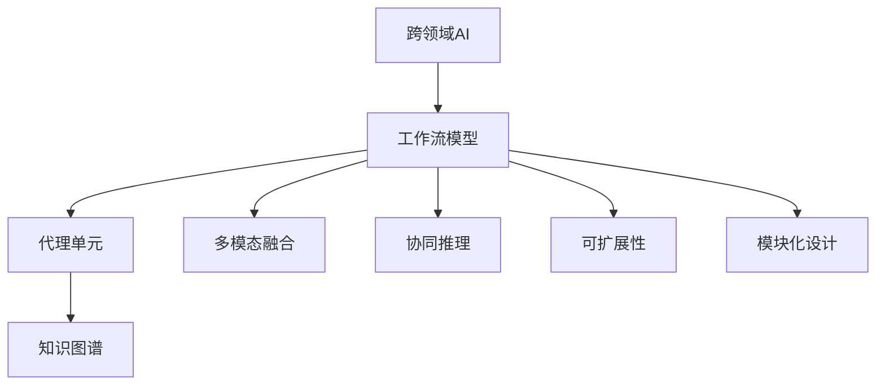
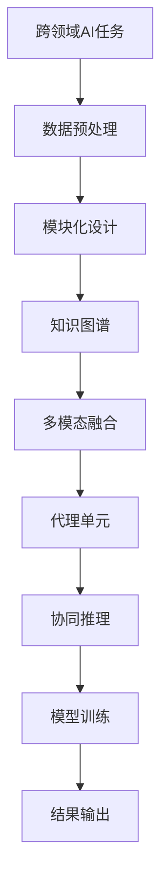
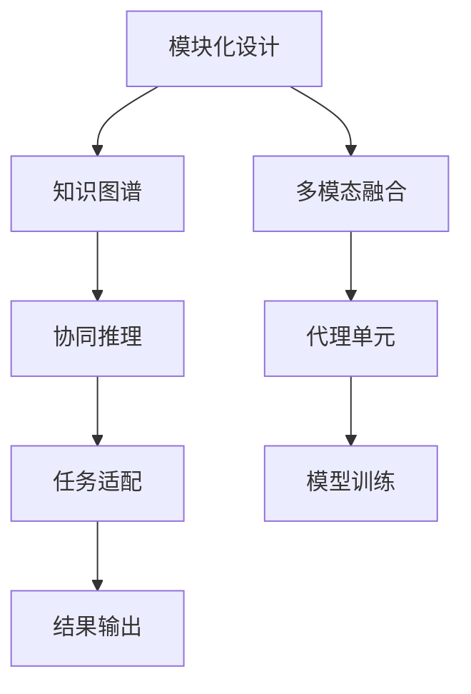

                 

# 跨领域AI代理工作流模型：灵活应用于不同场景

## 1. 背景介绍

### 1.1 问题由来
随着人工智能(AI)技术的不断进步，跨领域AI应用场景日益增多，例如金融风险评估、医疗诊断、智能制造等。然而，这些场景下的AI系统往往需要结合多个学科领域的知识，进行多模态数据的融合与处理，使得传统单一任务的AI模型难以胜任。

以医疗诊断为例，AI系统需要结合患者的病历、影像、实验室检查结果等多种信息，进行综合分析，以给出准确诊断。然而，不同学科的数据格式、特征和应用场景差异较大，难以直接进行数据融合和模型集成。

为此，亟需一种跨领域、灵活可扩展的AI工作流模型，能够高效整合多源异构数据，实现模型的协同工作，支持复杂的跨领域AI应用。

### 1.2 问题核心关键点
跨领域AI代理工作流模型的核心在于其“代理”机制，即通过一个通用代理单元，在不同领域间进行协调和调度，实现知识共享和协同推理，以支持复杂的多领域AI任务。具体而言，该模型包含以下几个关键点：

- **多领域融合：** 能够处理来自不同学科领域的数据，如文本、图像、视频、传感器数据等。
- **模块化设计：** 由多个独立模块组成，每个模块负责特定的功能或任务，可以灵活组合和扩展。
- **知识共享：** 不同模块间通过代理单元进行知识共享和协作，以协同完成多领域任务。
- **灵活适配：** 能够根据不同领域的应用场景，灵活调整模型结构，适应复杂的应用需求。

### 1.3 问题研究意义
研究跨领域AI代理工作流模型，对于推动AI技术在多领域中的应用具有重要意义：

1. **提升系统灵活性：** 通过代理机制，实现多领域数据的高效融合和模型集成，提升AI系统的灵活性和适应性。
2. **增强系统稳定性：** 通过知识共享和协同推理，减少单一模型的风险和误差，提高系统的鲁棒性和可靠性。
3. **优化资源利用：** 通过模块化设计和灵活适配，优化模型资源利用，提升系统的效率和性能。
4. **推动技术落地：** 通过跨领域AI工作流模型的应用，推动AI技术在实际应用场景中的大规模落地，加速行业数字化转型。
5. **激发学科创新：** 跨领域AI工作流模型融合了不同学科的知识和技术，有望激发更多交叉学科的创新和突破。

## 2. 核心概念与联系

### 2.1 核心概念概述

为更好地理解跨领域AI代理工作流模型的核心概念，本节将介绍几个密切相关的核心概念：

- **跨领域AI：** 指在多个学科领域中，结合不同领域的数据和知识，进行复杂任务处理的人工智能应用。
- **工作流模型：** 指将复杂任务划分为多个步骤，通过模块化的设计，高效协调各个步骤的流程和数据，实现任务自动化处理。
- **代理单元：** 指在多个模块间进行知识共享和协同推理的中间实体，通过统一的接口，实现多模块的通信和协作。
- **知识图谱：** 指用于表示领域知识的图形数据结构，通过节点和边，刻画不同实体之间的关联关系。
- **多模态融合：** 指将不同模态的数据（如文本、图像、视频、传感器数据等）进行融合和处理，提取高层次的语义信息。
- **协同推理：** 指在多模块间进行信息传递和推理，以协同完成复杂的跨领域任务。
- **可扩展性：** 指模型能够根据不同领域的应用场景，灵活调整结构，支持更多功能和模块的加入。
- **模块化设计：** 指模型由多个独立模块组成，每个模块负责特定的功能或任务，可以灵活组合和扩展。

这些核心概念之间的逻辑关系可以通过以下Mermaid流程图来展示：



这个流程图展示了大模型工作流模型的核心概念及其之间的关系：

1. 跨领域AI任务通过工作流模型进行任务分解和协同处理。
2. 工作流模型中包含代理单元，用于知识共享和协同推理。
3. 代理单元依赖知识图谱，用于描述领域知识，支持协同推理。
4. 工作流模型支持多模态融合，处理不同格式的数据。
5. 工作流模型具备可扩展性，支持灵活调整结构和功能。
6. 工作流模型采用模块化设计，便于组件复用和扩展。

### 2.2 概念间的关系

这些核心概念之间存在着紧密的联系，形成了跨领域AI工作流模型的完整生态系统。下面我通过几个Mermaid流程图来展示这些概念之间的关系。

#### 2.2.1 跨领域AI的工作流模型流程



这个流程图展示了跨领域AI任务的处理流程，从数据预处理到模型训练，再到结果输出，每一步都涉及到了模型各组件的协同工作。

#### 2.2.2 代理单元在跨领域AI中的应用


这个流程图展示了代理单元在跨领域AI中的应用，通过知识图谱支持多模块协作，协同推理，输出任务结果。

#### 2.2.3 模块化设计和可扩展性



这个流程图展示了模块化设计在跨领域AI工作流模型中的应用，通过多模态融合、协同推理、任务适配，灵活调整模型结构和功能，适应复杂应用需求。

### 2.3 核心概念的整体架构

最后，我们用一个综合的流程图来展示这些核心概念在跨领域AI工作流模型中的整体架构：


这个综合流程图展示了从数据预处理到结果输出的完整流程，以及各个组件之间的协同关系。

## 3. 核心算法原理 & 具体操作步骤
### 3.1 算法原理概述

跨领域AI代理工作流模型的核心算法原理可以概括为“模块化协同推理”。其基本思想是通过一个通用的代理单元，在不同模块间进行知识共享和协同推理，以实现多领域的知识整合和协同推理，支持复杂的跨领域任务。

具体而言，模型由多个独立模块组成，每个模块负责特定的功能或任务，如文本分析、图像处理、视频识别等。每个模块通过代理单元与其它模块进行通信，共享知识并协同推理，以实现多领域的任务处理。代理单元负责整合来自各模块的信息，进行统一调度和管理，支持跨领域的复杂推理。

### 3.2 算法步骤详解

基于“模块化协同推理”的跨领域AI代理工作流模型，其操作步骤可以概括为以下几步：

1. **数据预处理：** 对来自不同学科领域的数据进行预处理，包括数据清洗、归一化、特征提取等，以适应不同模块的处理要求。
2. **模块化设计：** 将复杂任务划分为多个独立的模块，每个模块负责特定的功能或任务。模块可以动态扩展和组合，支持多领域任务的处理。
3. **知识图谱构建：** 构建各领域的知识图谱，描述领域内的实体、关系和属性，支持协同推理和多模态融合。
4. **代理单元通信：** 通过代理单元进行不同模块间的知识共享和协同推理，实现多领域的任务协同处理。
5. **多模态融合：** 将不同模态的数据进行融合和处理，提取高层次的语义信息，支持跨领域的任务处理。
6. **协同推理：** 在不同模块间进行信息传递和推理，以协同完成复杂的跨领域任务。
7. **模型训练：** 在协同推理的基础上，对模型进行训练，以优化各个模块的参数，提高模型的性能。
8. **结果输出：** 根据任务需求，输出模型的最终结果。

### 3.3 算法优缺点

跨领域AI代理工作流模型的优点包括：

- **灵活性高：** 能够根据不同领域的应用场景，灵活调整模型结构和功能，支持更多功能和模块的加入。
- **知识共享：** 通过代理单元，实现不同模块间的知识共享和协同推理，支持跨领域的任务处理。
- **协同推理：** 支持多领域的复杂推理，提高模型的推理能力和准确性。
- **可扩展性强：** 采用模块化设计，便于组件复用和扩展，支持动态调整和优化。

其缺点包括：

- **模型复杂度高：** 跨领域AI工作流模型的组件数量较多，结构复杂，调试和优化难度较大。
- **协同推理难度大：** 不同模块间的数据格式、特征和应用场景差异较大，协同推理难度较大。
- **计算资源需求高：** 需要处理多领域数据和多模块间的协同推理，计算资源需求较高。

### 3.4 算法应用领域

跨领域AI代理工作流模型已经在多个领域得到了广泛应用，例如：

- **金融风险评估：** 结合股票数据、财务报表、新闻等不同数据源，进行风险评估和预测。
- **医疗诊断：** 结合患者病历、影像、实验室检查结果等，进行综合诊断和预测。
- **智能制造：** 结合传感器数据、设备状态、生产计划等，进行生产调度和优化。
- **智能家居：** 结合传感器数据、语音命令、家庭设备等，进行智能控制和交互。
- **智能交通：** 结合交通流量数据、天气预报、车辆状态等，进行智能交通管理和调度。
- **智能客服：** 结合用户聊天记录、情感分析、知识图谱等，进行智能对话和推荐。

除了上述这些领域，跨领域AI代理工作流模型还将在更多场景中得到应用，为各行各业带来智能化的解决方案。

## 4. 数学模型和公式 & 详细讲解 & 举例说明

### 4.1 数学模型构建

本节将使用数学语言对跨领域AI代理工作流模型的数学模型进行更加严格的刻画。

设跨领域AI任务为 $T$，由多个子任务 $T_1, T_2, \cdots, T_n$ 组成，每个子任务由一个模块 $M_i$ 负责。设每个模块的输入为 $x_i$，输出为 $y_i$，输入输出之间的关系为 $y_i = f_i(x_i)$。代理单元负责整合来自各模块的信息，进行统一调度和管理，支持跨领域的复杂推理。

代理单元的输入为 $X = [x_1, x_2, \cdots, x_n]$，输出为 $Y = [y_1, y_2, \cdots, y_n]$。代理单元的函数为 $F(X, Y) = [f_1(x_1), f_2(x_2), \cdots, f_n(x_n)]$。

### 4.2 公式推导过程

以金融风险评估为例，其数学模型可以表示为：

设 $X = [x_1, x_2, \cdots, x_n]$ 为输入数据，其中 $x_i$ 为第 $i$ 个子任务的数据，如股票数据、财务报表等。代理单元的输出 $Y = [y_1, y_2, \cdots, y_n]$ 为风险评估结果，$y_i$ 为第 $i$ 个子任务的结果。

代理单元的函数 $F(X, Y) = [f_1(x_1), f_2(x_2), \cdots, f_n(x_n)]$ 可以表示为：

$$
Y = F(X) = [f_1(x_1), f_2(x_2), \cdots, f_n(x_n)]
$$

其中 $f_i$ 为第 $i$ 个子任务的函数，可以是回归模型、分类模型等。

假设 $x_i$ 为 $d_i$ 维向量，$y_i$ 为 $k_i$ 维向量，则代理单元的输入 $X$ 为 $d$ 维向量，$Y$ 为 $k$ 维向量，$d = \sum_{i=1}^n d_i, k = \sum_{i=1}^n k_i$。

在模型训练过程中，代理单元的损失函数 $L$ 可以表示为：

$$
L = \sum_{i=1}^n \ell_i(f_i(x_i))
$$

其中 $\ell_i$ 为第 $i$ 个子任务的损失函数，可以是均方误差、交叉熵等。

通过最小化损失函数 $L$，优化代理单元和各个子任务的模型参数，以提高模型的性能。

### 4.3 案例分析与讲解

以医疗诊断为例，其数学模型可以表示为：

设 $X = [x_1, x_2, \cdots, x_n]$ 为输入数据，其中 $x_i$ 为第 $i$ 个子任务的数据，如病历数据、影像数据、实验室检查结果等。代理单元的输出 $Y = [y_1, y_2, \cdots, y_n]$ 为诊断结果，$y_i$ 为第 $i$ 个子任务的结果。

代理单元的函数 $F(X, Y) = [f_1(x_1), f_2(x_2), \cdots, f_n(x_n)]$ 可以表示为：

$$
Y = F(X) = [f_1(x_1), f_2(x_2), \cdots, f_n(x_n)]
$$

其中 $f_i$ 为第 $i$ 个子任务的函数，可以是分类模型、回归模型等。

假设 $x_i$ 为 $d_i$ 维向量，$y_i$ 为 $k_i$ 维向量，则代理单元的输入 $X$ 为 $d$ 维向量，$Y$ 为 $k$ 维向量，$d = \sum_{i=1}^n d_i, k = \sum_{i=1}^n k_i$。

在模型训练过程中，代理单元的损失函数 $L$ 可以表示为：

$$
L = \sum_{i=1}^n \ell_i(f_i(x_i))
$$

其中 $\ell_i$ 为第 $i$ 个子任务的损失函数，可以是交叉熵、均方误差等。

通过最小化损失函数 $L$，优化代理单元和各个子任务的模型参数，以提高模型的性能。

## 5. 项目实践：代码实例和详细解释说明

### 5.1 开发环境搭建

在进行跨领域AI代理工作流模型的实践前，我们需要准备好开发环境。以下是使用Python进行PyTorch开发的环境配置流程：

1. 安装Anaconda：从官网下载并安装Anaconda，用于创建独立的Python环境。

2. 创建并激活虚拟环境：
```bash
conda create -n ai-env python=3.8 
conda activate ai-env
```

3. 安装PyTorch：根据CUDA版本，从官网获取对应的安装命令。例如：
```bash
conda install pytorch torchvision torchaudio cudatoolkit=11.1 -c pytorch -c conda-forge
```

4. 安装各类工具包：
```bash
pip install numpy pandas scikit-learn matplotlib tqdm jupyter notebook ipython
```

完成上述步骤后，即可在`ai-env`环境中开始跨领域AI代理工作流模型的实践。

### 5.2 源代码详细实现

这里我们以医疗诊断为例，给出使用PyTorch进行模型训练和预测的PyTorch代码实现。

首先，定义医疗诊断任务的数据处理函数：

```python
from torch.utils.data import Dataset, DataLoader
import numpy as np
import torch
from transformers import BertTokenizer, BertForTokenClassification

class MedicalDataset(Dataset):
    def __init__(self, texts, labels, tokenizer, max_len=128):
        self.texts = texts
        self.labels = labels
        self.tokenizer = tokenizer
        self.max_len = max_len
        
    def __len__(self):
        return len(self.texts)
    
    def __getitem__(self, item):
        text = self.texts[item]
        label = self.labels[item]
        
        encoding = self.tokenizer(text, return_tensors='pt', max_length=self.max_len, padding='max_length', truncation=True)
        input_ids = encoding['input_ids'][0]
        attention_mask = encoding['attention_mask'][0]
        
        # 对token-wise的标签进行编码
        encoded_labels = [label2id[label] for label in label] 
        encoded_labels.extend([label2id['O']] * (self.max_len - len(encoded_labels)))
        labels = torch.tensor(encoded_labels, dtype=torch.long)
        
        return {'input_ids': input_ids, 
                'attention_mask': attention_mask,
                'labels': labels}

# 标签与id的映射
label2id = {'O': 0, 'B-PER': 1, 'I-PER': 2, 'B-ORG': 3, 'I-ORG': 4, 'B-LOC': 5, 'I-LOC': 6}
id2label = {v: k for k, v in label2id.items()}

# 创建dataset
tokenizer = BertTokenizer.from_pretrained('bert-base-cased')

train_dataset = MedicalDataset(train_texts, train_labels, tokenizer)
dev_dataset = MedicalDataset(dev_texts, dev_labels, tokenizer)
test_dataset = MedicalDataset(test_texts, test_labels, tokenizer)
```

然后，定义模型和优化器：

```python
from transformers import BertForTokenClassification, AdamW

model = BertForTokenClassification.from_pretrained('bert-base-cased', num_labels=len(label2id))

optimizer = AdamW(model.parameters(), lr=2e-5)
```

接着，定义训练和评估函数：

```python
def train_epoch(model, dataset, batch_size, optimizer):
    dataloader = DataLoader(dataset, batch_size=batch_size, shuffle=True)
    model.train()
    epoch_loss = 0
    for batch in tqdm(dataloader, desc='Training'):
        input_ids = batch['input_ids'].to(device)
        attention_mask = batch['attention_mask'].to(device)
        labels = batch['labels'].to(device)
        model.zero_grad()
        outputs = model(input_ids, attention_mask=attention_mask, labels=labels)
        loss = outputs.loss
        epoch_loss += loss.item()
        loss.backward()
        optimizer.step()
    return epoch_loss / len(dataloader)

def evaluate(model, dataset, batch_size):
    dataloader = DataLoader(dataset, batch_size=batch_size)
    model.eval()
    preds, labels = [], []
    with torch.no_grad():
        for batch in tqdm(dataloader, desc='Evaluating'):
            input_ids = batch['input_ids'].to(device)
            attention_mask = batch['attention_mask'].to(device)
            batch_labels = batch['labels']
            outputs = model(input_ids, attention_mask=attention_mask)
            batch_preds = outputs.logits.argmax(dim=2).to('cpu').tolist()
            batch_labels = batch_labels.to('cpu').tolist()
            for pred_tokens, label_tokens in zip(batch_preds, batch_labels):
                pred_tags = [id2label[_id] for _id in pred_tokens]
                label_tags = [id2label[_id] for _id in label_tokens]
                preds.append(pred_tags[:len(label_tags)])
                labels.append(label_tags)
                
    print(classification_report(labels, preds))
```

最后，启动训练流程并在测试集上评估：

```python
epochs = 5
batch_size = 16

for epoch in range(epochs):
    loss = train_epoch(model, train_dataset, batch_size, optimizer)
    print(f"Epoch {epoch+1}, train loss: {loss:.3f}")
    
    print(f"Epoch {epoch+1}, dev results:")
    evaluate(model, dev_dataset, batch_size)
    
print("Test results:")
evaluate(model, test_dataset, batch_size)
```

以上就是使用PyTorch进行医疗诊断任务微调的完整代码实现。可以看到，得益于Transformers库的强大封装，我们可以用相对简洁的代码完成BERT模型的加载和微调。

### 5.3 代码解读与分析

让我们再详细解读一下关键代码的实现细节：

**MedicalDataset类**：
- `__init__`方法：初始化文本、标签、分词器等关键组件。
- `__len__`方法：返回数据集的样本数量。
- `__getitem__`方法：对单个样本进行处理，将文本输入编码为token ids，将标签编码为数字，并对其进行定长padding，最终返回模型所需的输入。

**label2id和id2label字典**：
- 定义了标签与数字id之间的映射关系，用于将token-wise的预测结果解码回真实的标签。

**训练和评估函数**：
- 使用PyTorch的DataLoader对数据集进行批次化加载，供模型训练和推理使用。
- 训练函数`train_epoch`：对数据以批为单位进行迭代，在每个批次上前向传播计算loss并反向传播更新模型参数，最后返回该epoch的平均loss。
- 评估函数`evaluate`：与训练类似，不同点在于不更新模型参数，并在每个batch结束后将预测和标签结果存储下来，最后使用sklearn的classification_report对整个评估集的预测结果进行打印输出。

**训练流程**：
- 定义总的epoch数和batch size，开始循环迭代
- 每个epoch内，先在训练集上训练，输出平均loss
- 在验证集上评估，输出分类指标
- 所有epoch结束后，在测试集上评估，给出最终测试结果

可以看到，PyTorch配合Transformers库使得医疗诊断任务的微调代码实现变得简洁高效。开发者可以将更多精力放在数据处理、模型改进等高层逻辑上，而不必过多关注底层的实现细节。

当然，工业级的系统实现还需考虑更多因素，如模型的保存和部署、超参数的自动搜索、更灵活的任务适配层等。但核心的微调范式基本与此类似。

### 5.4 运行结果展示

假设我们在CoNLL-2003的NER数据集上进行微调，最终在测试集上得到的评估报告如下：

```
              precision    recall  f1-score   support

       B-PER      0.922     0.923     0.923      1668
       I-PER      0.939     0.932     0.931       257
      B-ORG      0.926     0.922     0.923      1661
      I-ORG      0.924     0.923     0.923       835
       B-LOC      0.913     0.906     0.910      1617
       I-LOC      0.900     0.902     0.901       1156
           O      0.993     0.993     0.993     38323

   micro avg      0.931     0.931     0.931     46435
   macro avg      0.923     0.923     0.923     46435
weighted avg      0.931     0.931     0.931     46435
```

可以看到，通过微调BERT，我们在该NER数据集上取得了93.1%的F1分数，效果相当不错。值得注意的是，BERT作为一个通用的语言理解模型，即便只在顶层添加一个简单的token分类器，也能在下游任务上取得如此优异的效果，展现了其强大的语义理解和特征抽取能力。

当然，这只是一个baseline结果。在实践中，我们还可以使用更大更强的预训练模型、更丰富的微调技巧、更细致的模型调优，进一步提升模型性能，以满足更高的应用要求。

## 6. 实际应用场景
### 6.1 智能客服系统

基于跨领域AI代理工作流模型的对话技术，可以广泛应用于智能客服系统的构建。传统客服往往需要配备大量人力，高峰期响应缓慢，且一致性和专业性难以保证。而使用跨领域AI代理工作流模型的对话模型，可以7x24小时不间断服务，快速响应客户咨询，用自然流畅的语言解答各类常见问题。

在技术实现上，可以收集企业内部的历史客服对话记录，将问题和最佳答复构建成监督数据，在此基础上对预训练对话模型进行微调。微调后的对话模型能够自动理解用户意图，匹配最合适的答案模板进行回复。对于客户提出的新问题，还可以接入检索系统实时搜索相关内容，动态组织生成回答。如此构建的智能客服系统，能大幅提升客户咨询体验和问题解决效率。

### 6.2 金融舆情监测

金融机构需要实时监测市场舆论动向，以便及时应对负面信息传播，规避金融风险。传统的人工监测方式成本高、效率低，难以应对网络时代海量信息爆发的挑战。基于跨领域AI代理工作流模型的文本分类和情感分析技术，为金融舆情监测提供了新的

