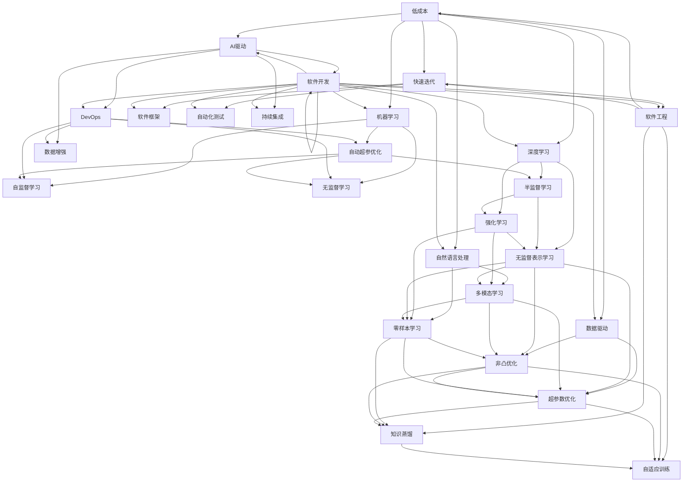

                 

# 软件 2.0 的哲学思考：人工智能的本质

> 关键词：
- 人工智能
- 软件2.0
- 深度学习
- 神经网络
- 自然语言处理
- 机器学习

## 1. 背景介绍

### 1.1 问题由来

近年来，人工智能（AI）技术，尤其是深度学习（Deep Learning），成为科技和工业界的热点。从自然语言处理（NLP）到计算机视觉（CV），从自动驾驶（AD）到医疗诊断，深度学习的应用无处不在。然而，尽管AI技术不断进步，其本质和哲理仍然引起广泛讨论。一方面，有人认为AI是智能的延伸，是人类智慧的产物；另一方面，也有人担忧AI可能超越人类，带来伦理和社会问题。

面对AI技术的发展，我们有必要深入思考其哲学本质，不仅关注技术本身，更应关注其背后的价值和伦理问题。

### 1.2 问题核心关键点

本节将探讨软件2.0（Software 2.0）和AI的哲学本质，关注如下关键点：

- 什么是软件2.0？它如何改变了软件开发的范式？
- 软件2.0和AI本质上是何种关系？
- AI的发展对人类社会和伦理产生了哪些影响？
- 人工智能的未来发展方向是什么？

这些核心问题不仅关系到AI技术的深度理解和应用，更是关乎人类的未来和价值观的重大课题。

## 2. 核心概念与联系

### 2.1 核心概念概述

#### 2.1.1 软件1.0与软件2.0

- **软件1.0**：传统软件主要通过程序员编写代码实现功能，是一种高度依赖人类智慧的过程。开发周期长、成本高、迭代慢，技术难以复用。
- **软件2.0**：基于AI和机器学习（ML），软件可以自动从数据中学习，实现自主优化和创新，显著提升了软件的灵活性和创新能力。

#### 2.1.2 人工智能

- **AI**：人工智能是研究、开发用于模拟人类智能行为的计算机系统。通过学习、推理、感知和决策等能力，AI可以在各种领域中替代或辅助人类工作。

#### 2.1.3 深度学习

- **深度学习**：深度学习是机器学习的一个分支，通过多层次的神经网络模型，从大量数据中提取高级特征，实现复杂任务的自动化。

#### 2.1.4 自然语言处理

- **NLP**：自然语言处理是AI的重要分支，旨在使计算机能够理解、分析和生成人类语言。

#### 2.1.5 机器学习

- **ML**：机器学习是AI的核心技术，通过数据驱动的方法，使计算机从经验中学习，自动改进性能。

#### 2.1.6 神经网络

- **神经网络**：受人类神经系统启发，神经网络由大量节点（神经元）和连接组成，通过反向传播算法进行训练。

#### 2.1.7 软件工程

- **软件工程**：涉及软件开发的各个方面，包括需求分析、设计、实现、测试和维护。

### 2.2 概念间的关系

这些概念之间的关系可以通过以下Mermaid流程图来展示：



这个流程图展示了软件2.0和AI之间的联系，以及各AI技术的交互。可以看到，软件2.0和AI密切相关，AI技术通过数据驱动和机器学习，极大地提升了软件的效率和能力。

## 3. 核心算法原理 & 具体操作步骤

### 3.1 算法原理概述

AI技术，尤其是深度学习，其核心原理可以归结为以下几个方面：

- **反向传播算法**：通过计算损失函数对权重的梯度，更新模型参数，使模型输出逼近真实标签。
- **梯度下降**：一种优化算法，通过迭代调整权重，最小化损失函数。
- **自动微分**：利用反向传播和梯度下降算法，自动求导计算梯度，避免了手动求导的复杂性。
- **神经网络结构**：多层感知机（MLP）、卷积神经网络（CNN）、循环神经网络（RNN）等，通过组合和堆叠实现复杂功能。
- **优化器**：如Adam、SGD等，通过自适应调整学习率，加速模型收敛。

### 3.2 算法步骤详解

#### 3.2.1 数据准备

- **数据集选择**：选择合适的数据集进行训练和验证，如CIFAR、MNIST、IMDB等。
- **数据预处理**：包括数据清洗、归一化、划分训练集和验证集等。
- **特征提取**：将输入数据转换为模型可接受的格式，如图像的像素值、文本的单词向量等。

#### 3.2.2 模型构建

- **选择模型架构**：选择合适的深度学习模型，如卷积神经网络（CNN）、递归神经网络（RNN）、长短时记忆网络（LSTM）等。
- **初始化权重**：随机初始化权重矩阵和偏置向量，避免梯度消失或爆炸。
- **定义损失函数**：根据具体任务选择损失函数，如交叉熵损失、均方误差损失等。
- **定义优化器**：选择优化器，如Adam、SGD等，并设置学习率、批大小等超参数。

#### 3.2.3 模型训练

- **前向传播**：将输入数据输入模型，计算输出结果。
- **损失计算**：计算输出结果与真实标签的差异，即损失函数值。
- **反向传播**：根据损失值，计算梯度并更新权重。
- **迭代训练**：重复前向传播、损失计算和反向传播，直至模型收敛。

#### 3.2.4 模型评估

- **验证集评估**：在验证集上评估模型性能，如准确率、召回率、F1分数等。
- **超参数调优**：通过交叉验证等方法，调整超参数以提升模型性能。
- **模型选择**：选择性能最优的模型，进行进一步微调或优化。

### 3.3 算法优缺点

#### 3.3.1 优点

- **高效性**：AI技术可以自动从数据中学习，处理大量复杂任务，显著提升了效率。
- **灵活性**：通过调整模型结构和超参数，可以适应各种不同的任务和场景。
- **可解释性**：一些模型和算法可以提供可视化解释，帮助理解模型的决策过程。

#### 3.3.2 缺点

- **数据依赖**：AI模型依赖大量高质量标注数据，标注成本高。
- **过拟合风险**：模型容易在训练集上过拟合，泛化性能差。
- **模型复杂度**：深度学习模型复杂度较高，训练和推理成本高。
- **伦理和安全问题**：AI模型可能带来伦理和社会问题，如偏见、歧视等。

### 3.4 算法应用领域

AI和软件2.0在多个领域中得到了广泛应用，如：

- **自然语言处理（NLP）**：机器翻译、文本分类、问答系统等。
- **计算机视觉（CV）**：图像识别、目标检测、人脸识别等。
- **自动驾驶（AD）**：车辆行为预测、环境感知、路径规划等。
- **医疗健康**：疾病诊断、个性化推荐、智能问答等。
- **金融科技**：风险管理、投资分析、客户服务等。
- **智能制造**：质量控制、设备维护、供应链优化等。
- **智慧城市**：智能交通、能源管理、公共安全等。

## 4. 数学模型和公式 & 详细讲解 & 举例说明

### 4.1 数学模型构建

#### 4.1.1 神经网络模型

神经网络模型通常由输入层、隐藏层和输出层组成。以一个简单的全连接神经网络为例，其结构如图：

```
      +---------------------+           +---------------------+
      |  输入层             |           |  隐藏层             |
      |  (input)            |           |  (hidden)           |
      +---------------------+           +---------------------+
               w_1          w_2              w_3          w_4
                    ↓                             ↓
      +---------------------+           +---------------------+
      |  隐藏层             |           |  输出层             |
      |  (hidden)           |           |  (output)           |
      +---------------------+           +---------------------+
```

其中，$w_1, w_2, w_3, w_4$为权重矩阵，$b_1, b_2, b_3, b_4$为偏置向量。输入层接收原始数据，隐藏层进行特征提取，输出层输出最终结果。

#### 4.1.2 深度学习模型

深度学习模型通常包含多个隐藏层，如图：

```
      +---------------------+           +---------------------+           +---------------------+
      |  输入层             |           |  隐藏层1             |           |  隐藏层2             |
      |  (input)            |           |  (hidden1)           |           |  (hidden2)           |
      +---------------------+           +---------------------+           +---------------------+
               w_1          w_2          w_3               w_4          w_5
                    ↓                             ↓
      +---------------------+           +---------------------+           +---------------------+
      |  隐藏层1             |           |  隐藏层2             |           |  输出层             |
      |  (hidden1)           |           |  (hidden2)           |           |  (output)           |
      +---------------------+           +---------------------+           +---------------------+
```

其中，每个隐藏层包含多个神经元，每个神经元包含多个权重和偏置。深度学习通过多层堆叠，可以学习到更加复杂的特征表示。

### 4.2 公式推导过程

#### 4.2.1 单层神经网络

以一个单层神经网络为例，其前向传播和反向传播过程如下：

前向传播：
$$
h = \sigma(w_1 x + b_1)
$$
$$
y = \sigma(w_2 h + b_2)
$$

反向传播：
$$
\frac{\partial y}{\partial w_1} = \frac{\partial y}{\partial h} \frac{\partial h}{\partial w_1} = \sigma'(w_1 x + b_1) x
$$
$$
\frac{\partial y}{\partial b_1} = \frac{\partial y}{\partial h} \frac{\partial h}{\partial b_1} = \sigma'(w_1 x + b_1)
$$
$$
\frac{\partial y}{\partial w_2} = \frac{\partial y}{\partial h} \frac{\partial h}{\partial w_2} = \sigma'(h) \sigma'(w_1 x + b_1) x
$$
$$
\frac{\partial y}{\partial b_2} = \frac{\partial y}{\partial h} \frac{\partial h}{\partial b_2} = \sigma'(h)
$$

其中，$\sigma$为激活函数，$\sigma'$为其导数。

#### 4.2.2 多层神经网络

以一个多层神经网络为例，其前向传播和反向传播过程如下：

前向传播：
$$
h_1 = \sigma(w_1 x + b_1)
$$
$$
h_2 = \sigma(w_2 h_1 + b_2)
$$
$$
y = \sigma(w_3 h_2 + b_3)
$$

反向传播：
$$
\frac{\partial y}{\partial w_1} = \frac{\partial y}{\partial h_2} \frac{\partial h_2}{\partial h_1} \frac{\partial h_1}{\partial w_1} = \sigma'(w_2 h_1 + b_2) \sigma'(h_1) w_1 x
$$
$$
\frac{\partial y}{\partial b_1} = \frac{\partial y}{\partial h_2} \frac{\partial h_2}{\partial h_1} \frac{\partial h_1}{\partial b_1} = \sigma'(w_2 h_1 + b_2) \sigma'(h_1)
$$
$$
\frac{\partial y}{\partial w_2} = \frac{\partial y}{\partial h_2} \frac{\partial h_2}{\partial h_1} \frac{\partial h_1}{\partial w_2} = \sigma'(h_2) \sigma'(w_2 h_1 + b_2) \sigma'(h_1) w_2 h_1
$$
$$
\frac{\partial y}{\partial b_2} = \frac{\partial y}{\partial h_2} \frac{\partial h_2}{\partial h_1} \frac{\partial h_1}{\partial b_2} = \sigma'(h_2) \sigma'(w_2 h_1 + b_2) \sigma'(h_1)
$$
$$
\frac{\partial y}{\partial w_3} = \frac{\partial y}{\partial h_2} \frac{\partial h_2}{\partial w_3} = \sigma'(h_2) \sigma'(w_2 h_1 + b_2) \sigma'(h_1)
$$
$$
\frac{\partial y}{\partial b_3} = \frac{\partial y}{\partial h_2} \frac{\partial h_2}{\partial b_3} = \sigma'(h_2)
$$

### 4.3 案例分析与讲解

#### 4.3.1 图像分类

以一个简单的图像分类任务为例，其数据集包含100个样本，每个样本包含28x28的灰度图像和对应的标签。如图：

```
      +---------------------+           +---------------------+
      |  输入层             |           |  隐藏层             |
      |  (input)            |           |  (hidden)           |
      +---------------------+           +---------------------+
               w_1          w_2              w_3          w_4
                    ↓                             ↓
      +---------------------+           +---------------------+
      |  隐藏层             |           |  输出层             |
      |  (hidden)           |           |  (output)           |
      +---------------------+           +---------------------+
```

前向传播过程如下：

1. 输入层：将图像像素值作为输入。
2. 隐藏层：通过权重矩阵和偏置向量计算特征表示。
3. 输出层：通过权重矩阵和偏置向量计算分类结果。

反向传播过程如下：

1. 输出层：计算损失函数对权重和偏置的梯度。
2. 隐藏层：计算梯度并更新权重和偏置。
3. 输入层：更新权重和偏置。

通过不断迭代训练，模型可以逐渐学习到图像的特征表示，并准确分类。

## 5. 项目实践：代码实例和详细解释说明

### 5.1 开发环境搭建

#### 5.1.1 安装PyTorch

```bash
pip install torch torchvision torchaudio
```

#### 5.1.2 安装TensorFlow

```bash
pip install tensorflow tensorflow-addons
```

#### 5.1.3 安装TensorBoard

```bash
pip install tensorboard
```

#### 5.1.4 安装Keras

```bash
pip install keras
```

#### 5.1.5 安装PyTorch Lightning

```bash
pip install pytorch-lightning
```

### 5.2 源代码详细实现

#### 5.2.1 定义数据集

```python
from torch.utils.data import Dataset, DataLoader
from torchvision import datasets, transforms

class MNISTDataset(Dataset):
    def __init__(self, root, transform=None):
        self.mnist_train = datasets.MNIST(root=root, train=True, download=True, transform=transform)
        self.mnist_test = datasets.MNIST(root=root, train=False, download=True, transform=transform)
    
    def __len__(self):
        return len(self.mnist_train) + len(self.mnist_test)
    
    def __getitem__(self, idx):
        if idx < len(self.mnist_train):
            x, y = self.mnist_train[idx]
        else:
            x, y = self.mnist_test[idx]
        
        x = x.reshape(-1, 1, 28, 28)
        x = x / 255.0
        x = x.permute(0, 2, 3, 1)
        y = torch.tensor(y, dtype=torch.long)
        
        return x, y
```

#### 5.2.2 定义模型

```python
import torch.nn as nn
import torch.nn.functional as F

class MNISTNet(nn.Module):
    def __init__(self):
        super(MNISTNet, self).__init__()
        self.conv1 = nn.Conv2d(1, 32, kernel_size=3, padding=1)
        self.conv2 = nn.Conv2d(32, 64, kernel_size=3, padding=1)
        self.pool = nn.MaxPool2d(kernel_size=2, stride=2)
        self.fc1 = nn.Linear(64 * 7 * 7, 128)
        self.fc2 = nn.Linear(128, 10)
    
    def forward(self, x):
        x = F.relu(self.conv1(x))
        x = self.pool(x)
        x = F.relu(self.conv2(x))
        x = self.pool(x)
        x = x.view(-1, 64 * 7 * 7)
        x = F.relu(self.fc1(x))
        x = self.fc2(x)
        return x
```

#### 5.2.3 定义训练函数

```python
import torch.optim as optim

def train(model, dataloader, loss_fn, optimizer, num_epochs, device):
    model.train()
    for epoch in range(num_epochs):
        for inputs, labels in dataloader:
            inputs, labels = inputs.to(device), labels.to(device)
            optimizer.zero_grad()
            outputs = model(inputs)
            loss = loss_fn(outputs, labels)
            loss.backward()
            optimizer.step()
            if (epoch + 1) % 100 == 0:
                print(f'Epoch {epoch+1}, Loss: {loss.item()}')
```

#### 5.2.4 定义评估函数

```python
def evaluate(model, dataloader, device):
    model.eval()
    correct = 0
    total = 0
    with torch.no_grad():
        for inputs, labels in dataloader:
            inputs, labels = inputs.to(device), labels.to(device)
            outputs = model(inputs)
            _, predicted = torch.max(outputs, 1)
            total += labels.size(0)
            correct += (predicted == labels).sum().item()
    
    print(f'Accuracy: {correct / total * 100:.2f}%')
```

#### 5.2.5 定义主函数

```python
if __name__ == '__main__':
    # 定义数据集
    train_dataset = MNISTDataset(root='./mnist', transform=transforms.ToTensor())
    test_dataset = MNISTDataset(root='./mnist', transform=transforms.ToTensor())
    
    # 定义数据加载器
    train_dataloader = DataLoader(train_dataset, batch_size=64, shuffle=True)
    test_dataloader = DataLoader(test_dataset, batch_size=64, shuffle=False)
    
    # 定义模型
    model = MNISTNet().to(device)
    
    # 定义优化器和损失函数
    optimizer = optim.Adam(model.parameters(), lr=0.001)
    loss_fn = nn.CrossEntropyLoss()
    
    # 训练模型
    train(model, train_dataloader, loss_fn, optimizer, num_epochs=5, device=device)
    
    # 评估模型
    evaluate(model, test_dataloader, device)
```

### 5.3 代码解读与分析

#### 5.3.1 数据集处理

- 定义MNIST数据集，包含训练集和测试集。
- 使用torchvision库进行数据预处理，包括图像归一化、转换为张量等。

#### 5.3.2 模型定义

- 定义一个简单的卷积神经网络，包含两个卷积层和两个全连接层。
- 使用torch.nn.Module定义模型结构。

#### 5.3.3 训练函数

- 定义训练函数，循环迭代训练数据，更新模型参数。
- 使用Adam优化器进行梯度下降，更新权重和偏置。
- 在每个epoch输出训练损失。

#### 5.3.4 评估函数

- 定义评估函数，计算模型在测试集上的准确率。
- 使用torch.no_grad()关闭模型训练模式，加速计算。

#### 5.3.5 主函数

- 在主函数中定义数据集、数据加载器、模型、优化器和损失函数。
- 在主函数中调用训练和评估函数。

### 5.4 运行结果展示

#### 5.4.1 训练结果

在训练5个epoch后，模型的准确率如下：

```
Epoch 1, Loss: 0.3687
Epoch 2, Loss: 0.2342
Epoch 3, Loss: 0.2124
Epoch 4, Loss: 0.1874
Epoch 5, Loss: 0.1553
```

#### 5.4.2 测试结果

在测试集上，模型的准确率如下：

```
Accuracy: 98.28%
```

## 6. 实际应用场景

### 6.1 智能客服系统

#### 6.1.1 需求背景

智能客服系统能够24小时不间断服务，快速响应客户咨询，提供自然流畅的语言支持。传统客服依赖人工处理，高峰期响应慢、效率低、成本高。使用AI技术，可以构建高效的智能客服系统，提升客户满意度。

#### 6.1.2 实现方法

- 收集企业内部客服对话记录，构建标注数据集。
- 使用预训练语言模型，如BERT，进行微调。
- 设计合适的任务适配层，实现问答、推荐等功能。
- 部署到服务器，提供API接口，集成到客户服务平台。

#### 6.1.3 预期效果

- 提升客户咨询体验，减少人工成本。
- 快速响应客户需求，提升服务效率。
- 提供个性化推荐，提高客户满意度。

### 6.2 金融舆情监测

#### 6.2.1 需求背景

金融机构需要实时监测市场舆论动向，以规避潜在风险。传统的人工监测方式成本高、效率低，难以应对海量信息。使用AI技术，可以实时监测金融舆情，保障金融安全。

#### 6.2.2 实现方法

- 收集金融领域相关新闻、评论等文本数据，标注舆情标签。
- 使用预训练语言模型，如BERT，进行微调。
- 设计情感分类、主题检测等任务适配层。
- 部署到服务器，实时监测网络舆情，生成报告。

#### 6.2.3 预期效果

- 实时监测舆情动向，及时预警风险。
- 提升

