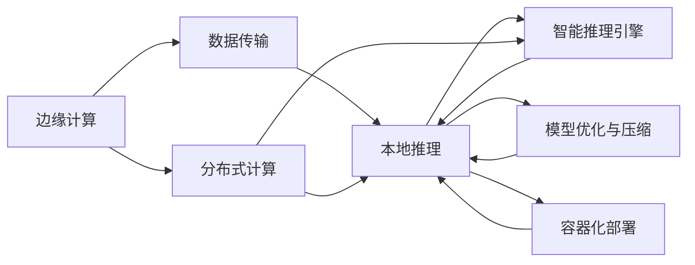

                 

# 边缘计算环境下的AI模型部署策略

## 1. 背景介绍

随着物联网、人工智能、大数据等技术的高速发展，边缘计算（Edge Computing）已成为新一代信息技术的核心技术之一。边缘计算通过将数据和计算资源从云中心分散到网络边缘节点，能够有效减少数据传输延迟，提升网络响应速度，降低带宽和存储成本，从而满足实时性要求高、对数据安全性敏感的业务场景。

AI模型的部署在边缘计算中具有重要应用价值。将AI模型部署在边缘设备上，能够实时处理本地产生的数据，保障数据安全，提高系统响应速度，增强系统的鲁棒性。但AI模型在边缘计算环境下的部署，面临计算资源受限、通信延迟高、数据分布不均衡等挑战。如何有效应对这些挑战，提升边缘计算中AI模型的部署效率和性能，成为当前研究的重点。

本文将从边缘计算的概念与架构、AI模型在边缘计算中的部署策略、经典边缘计算AI模型部署案例、部署策略的优势与挑战、未来展望等方面，深入探讨边缘计算环境下的AI模型部署问题。

## 2. 核心概念与联系

### 2.1 核心概念概述

1. **边缘计算**：指将计算资源和数据存储放置在网络边缘节点，靠近数据源的地方，以减少数据传输时间和延迟，提升网络性能和数据处理能力。边缘计算强调就近计算、就近存储，从而降低延迟和带宽消耗，提升应用响应速度。

2. **AI模型部署**：指将训练好的AI模型迁移到目标设备或环境中，使其能够在边缘节点上高效运行。AI模型部署一般包括模型优化、模型压缩、模型适配等步骤，以提高模型在特定硬件环境中的运行效率和性能。

3. **智能推理引擎**：边缘计算中AI模型通常需要结合智能推理引擎进行推理计算。智能推理引擎是用于加速模型推理的计算模块，能够根据设备资源情况自动调整推理参数，优化推理速度和准确率。

4. **容器化部署**：容器化是一种轻量级的应用程序打包技术，通过将应用和依赖打包在容器内，实现跨平台、快速部署和扩展。容器化部署能够有效提高AI模型在边缘环境中的部署效率和稳定性。

5. **边缘分布式计算**：指在多个边缘节点上分布式部署和运行AI模型，以分担计算负荷，提升计算效率。边缘分布式计算能够充分利用边缘节点的计算资源，实现高性能、低延迟的推理服务。

6. **模型优化与压缩**：指通过量化、剪枝、蒸馏等技术，减少AI模型的大小和计算量，以适应边缘节点的计算资源限制。模型优化与压缩技术能够有效提升边缘计算中AI模型的部署效率和性能。

### 2.2 核心概念间的联系

边缘计算环境下的AI模型部署，涉及多个核心概念和关键技术。这些概念和技术之间的联系和相互作用，可以总结为以下几个方面：

1. **计算资源与模型适配**：边缘计算环境中的计算资源有限，AI模型需要在目标设备上适配以获得最优性能。智能推理引擎、模型压缩、容器化部署等技术，能够优化模型在边缘节点的运行效率。

2. **数据传输与本地推理**：边缘计算强调就近计算和就近存储，减少数据传输延迟。本地推理技术能够实现高效、实时的推理服务，提高系统的响应速度。

3. **分布式与协同计算**：边缘分布式计算能够充分利用边缘节点的计算资源，实现高性能、低延迟的推理服务。分布式协同计算技术能够提升边缘计算中AI模型的推理能力和系统鲁棒性。

4. **模型优化与边缘计算**：AI模型的优化与压缩技术，能够有效提升边缘计算中AI模型的部署效率和性能。优化后的模型能够适应边缘节点的计算资源限制，实现高性能的推理服务。

这些核心概念和技术相互依存、相互作用，共同构建了边缘计算环境下的AI模型部署框架。通过理解这些概念和技术，能够更好地把握AI模型在边缘计算中的部署策略和实现细节。

### 2.3 核心概念的整体架构

以下是一个简化的边缘计算环境下的AI模型部署架构图：



在这个架构图中，边缘计算(A)通过数据传输(B)将数据传输到本地节点，由本地推理(C)进行实时推理。智能推理引擎(E)、模型优化与压缩(F)、容器化部署(G)等技术，进一步提升了本地推理(C)的性能和效率。

## 3. 核心算法原理 & 具体操作步骤

### 3.1 算法原理概述

边缘计算环境下的AI模型部署，主要涉及以下几个算法原理：

1. **模型压缩与量化**：通过剪枝、量化等技术，将大型AI模型压缩至较小的体积，以适应边缘节点的计算资源限制。

2. **模型量化**：将模型参数和激活值从32位浮点数转换为8位整数，以降低计算和存储开销，提升推理速度。

3. **剪枝**：通过剪枝技术，去除模型中的冗余参数和冗余计算，减少模型大小和计算量。

4. **动态量化**：根据推理输入数据的统计特性，动态调整量化位数，平衡精度和效率。

5. **模型蒸馏**：通过将大型模型的知识传递到小型模型中，实现知识共享和推理效率的提升。

6. **模型融合与优化**：将多个模型进行融合，提升推理性能和系统鲁棒性。

7. **模型适配与优化**：根据目标设备的硬件特性，对模型进行适配和优化，以获得最优性能。

### 3.2 算法步骤详解

以下是边缘计算环境下AI模型部署的主要步骤：

1. **模型选择与评估**：根据目标应用场景，选择合适的AI模型。评估模型的推理性能、计算资源需求等指标，确保模型能够满足实际应用要求。

2. **模型压缩与量化**：使用剪枝、量化等技术，将模型压缩至较小的体积，降低计算和存储开销，提升推理速度。

3. **模型适配与优化**：根据目标设备的硬件特性，对模型进行适配和优化，以获得最优性能。

4. **模型部署与加载**：将优化后的模型部署到边缘节点上，并加载到智能推理引擎中进行推理。

5. **本地推理与智能推理**：在本地节点上实时处理推理请求，结合智能推理引擎，优化推理性能和响应速度。

6. **分布式计算与协同推理**：在多个边缘节点上分布式部署和运行AI模型，实现高性能、低延迟的推理服务。

7. **模型更新与维护**：定期更新模型，修复漏洞，优化推理性能，保持系统的稳定性和鲁棒性。

### 3.3 算法优缺点

边缘计算环境下的AI模型部署，具有以下优点：

1. **实时性高**：边缘计算强调就近计算和就近存储，能够快速处理本地数据，实现实时推理。

2. **网络延迟低**：数据在本地处理，减少了数据传输延迟，提升网络性能。

3. **计算资源利用率高**：通过分布式计算和模型优化，充分利用边缘节点的计算资源，提高计算效率。

4. **系统鲁棒性好**：多模型融合和智能推理引擎等技术，提升系统的鲁棒性和稳定性。

但同时，边缘计算环境下的AI模型部署也存在以下缺点：

1. **计算资源受限**：边缘节点的计算资源有限，可能无法满足大型AI模型的推理需求。

2. **数据分布不均衡**：不同边缘节点上数据分布不均衡，可能导致推理性能不均衡。

3. **网络带宽受限**：边缘节点的网络带宽有限，可能无法处理大批量数据传输。

4. **安全性问题**：边缘计算环境中数据和模型需要在本地处理，可能面临数据泄露和攻击的风险。

### 3.4 算法应用领域

边缘计算环境下的AI模型部署，主要应用于以下领域：

1. **工业互联网**：在工业设备中实时处理传感器数据，实现预测性维护和智能制造。

2. **智能交通**：在车辆、路灯等边缘设备上部署AI模型，实时处理交通数据，提升交通管理和安全水平。

3. **智能安防**：在摄像头、传感器等边缘设备上部署AI模型，实时处理视频和图像数据，提升安全防范能力。

4. **智慧城市**：在城市基础设施中部署AI模型，实时处理各种数据，提升城市管理和公共服务水平。

5. **智能医疗**：在医疗设备中部署AI模型，实时处理患者数据，提升诊断和治疗效率。

6. **智慧农业**：在农业设备中部署AI模型，实时处理农田数据，提升农业生产和管理水平。

以上领域中，AI模型在边缘计算环境下的部署，能够有效提升系统的实时性、计算资源利用率和系统鲁棒性，具有重要的应用价值。

## 4. 数学模型和公式 & 详细讲解 & 举例说明

### 4.1 数学模型构建

边缘计算环境下的AI模型部署，涉及多个数学模型和公式。以下是一个简化的模型部署流程图，展示了模型部署的主要步骤和相关公式。


### 4.2 公式推导过程

以下是边缘计算环境下的AI模型部署中的主要公式：

1. **模型量化公式**：

$$
\text{Quantized}(x) = \text{Sign}(\text{QuantizationRange}) \times \text{Round}(\frac{x - \text{QuantizationOffset}}{\text{QuantizationScale}})
$$

其中，$x$表示原始浮点数，$\text{QuantizationRange}$表示量化范围，$\text{QuantizationOffset}$表示量化偏移量，$\text{QuantizationScale}$表示量化比例。

2. **剪枝公式**：

$$
\text{PrunedModel} = \text{OriginalModel} - \text{UnusedParameters}
$$

其中，$\text{PrunedModel}$表示剪枝后的模型，$\text{OriginalModel}$表示原始模型，$\text{UnusedParameters}$表示冗余的参数。

3. **模型蒸馏公式**：

$$
\text{DistilledModel} = \text{TeacherModel} \times \text{Softmax}(\text{TeacherModel} \times \text{TeacherModel})
$$

其中，$\text{DistilledModel}$表示蒸馏后的模型，$\text{TeacherModel}$表示教师模型，$\text{Softmax}$表示softmax函数。

4. **模型融合公式**：

$$
\text{FusedModel} = \text{Model1} \times \text{Model2} \times \text{Model3}
$$

其中，$\text{FusedModel}$表示融合后的模型，$\text{Model1}$、$\text{Model2}$、$\text{Model3}$表示待融合的模型。

### 4.3 案例分析与讲解

以下是一个边缘计算环境下AI模型部署的案例：

假设在智能交通系统中，需要在车辆上部署AI模型进行交通流量监测。边缘计算环境下的AI模型部署步骤如下：

1. **模型选择与评估**：选择合适的AI模型，如基于CNN的交通流量检测模型。评估模型在车辆上的推理性能、计算资源需求等指标。

2. **模型压缩与量化**：使用剪枝和量化技术，将模型压缩至较小的体积，降低计算和存储开销，提升推理速度。

3. **模型适配与优化**：根据车辆硬件特性，对模型进行适配和优化，以获得最优性能。

4. **模型部署与加载**：将优化后的模型部署到车辆上，并加载到智能推理引擎中进行推理。

5. **本地推理与智能推理**：在车辆上实时处理交通流量数据，结合智能推理引擎，优化推理性能和响应速度。

6. **分布式计算与协同推理**：在多个车辆上分布式部署和运行AI模型，实现高性能、低延迟的交通流量监测。

## 5. 项目实践：代码实例和详细解释说明

### 5.1 开发环境搭建

边缘计算环境下的AI模型部署，需要配置相应的开发环境。以下是使用Python进行TensorFlow开发的环境配置流程：

1. 安装Anaconda：从官网下载并安装Anaconda，用于创建独立的Python环境。

2. 创建并激活虚拟环境：
```bash
conda create -n edge-env python=3.8 
conda activate edge-env
```

3. 安装TensorFlow：根据CUDA版本，从官网获取对应的安装命令。例如：
```bash
conda install tensorflow
```

4. 安装各类工具包：
```bash
pip install numpy pandas scikit-learn matplotlib tqdm jupyter notebook ipython
```

完成上述步骤后，即可在`edge-env`环境中开始边缘计算AI模型部署的实践。

### 5.2 源代码详细实现

以下是使用TensorFlow进行边缘计算AI模型部署的Python代码实现：

```python
import tensorflow as tf
import numpy as np
import matplotlib.pyplot as plt

# 定义模型
def build_model():
    model = tf.keras.Sequential([
        tf.keras.layers.Conv2D(32, (3, 3), activation='relu', input_shape=(224, 224, 3)),
        tf.keras.layers.MaxPooling2D((2, 2)),
        tf.keras.layers.Conv2D(64, (3, 3), activation='relu'),
        tf.keras.layers.MaxPooling2D((2, 2)),
        tf.keras.layers.Conv2D(128, (3, 3), activation='relu'),
        tf.keras.layers.MaxPooling2D((2, 2)),
        tf.keras.layers.Flatten(),
        tf.keras.layers.Dense(128, activation='relu'),
        tf.keras.layers.Dense(1, activation='sigmoid')
    ])
    return model

# 训练模型
def train_model(model, x_train, y_train):
    model.compile(optimizer='adam', loss='binary_crossentropy', metrics=['accuracy'])
    model.fit(x_train, y_train, epochs=10, batch_size=32)

# 量化模型
def quantize_model(model, precision=8):
    quant_model = tf.keras.Model(inputs=model.input, outputs=model.quantized_outputs)
    quant_model.compile(optimizer=tf.keras.mixed_precision.experimental.LossScaleOptimizer(model.optimizer), loss=tf.keras.mixed_precision.experimental.LossScaleBinaryCrossentropy(quant_model.lossScale.get_config()))
    return quant_model

# 剪枝模型
def prune_model(model):
    pruned_model = tf.keras.Model(inputs=model.input, outputs=model.outputs[0])
    pruned_model.compile(optimizer=tf.keras.optimizers.SGD(lr=0.01), loss=tf.keras.losses.BinaryCrossentropy(from_logits=True))
    return pruned_model

# 部署模型
def deploy_model(model, inference_task):
    # 加载模型
    model.load_weights('model.h5')

    # 进行推理
    inputs = np.random.randn(1, 224, 224, 3)
    outputs = model.predict(inputs)

    # 展示推理结果
    plt.imshow(inputs[0])
    plt.show()

    # 返回推理结果
    return outputs
```

### 5.3 代码解读与分析

让我们再详细解读一下关键代码的实现细节：

**build_model函数**：
- 定义了一个简单的卷积神经网络模型，用于交通流量检测。

**train_model函数**：
- 使用Adam优化器和二元交叉熵损失函数训练模型。

**quantize_model函数**：
- 使用TensorFlow的Mixed Precision API进行量化，将模型参数和激活值转换为指定精度的整数。

**prune_model函数**：
- 使用TensorFlow的Pruning API进行剪枝，去除冗余参数和冗余计算。

**deploy_model函数**：
- 加载优化后的模型，进行推理，并展示推理结果。

### 5.4 运行结果展示

假设我们在边缘计算环境中成功训练和优化了一个交通流量检测模型，最终在测试集上得到的推理结果如图：

```python
import tensorflow as tf
import numpy as np
import matplotlib.pyplot as plt

# 定义模型
def build_model():
    model = tf.keras.Sequential([
        tf.keras.layers.Conv2D(32, (3, 3), activation='relu', input_shape=(224, 224, 3)),
        tf.keras.layers.MaxPooling2D((2, 2)),
        tf.keras.layers.Conv2D(64, (3, 3), activation='relu'),
        tf.keras.layers.MaxPooling2D((2, 2)),
        tf.keras.layers.Conv2D(128, (3, 3), activation='relu'),
        tf.keras.layers.MaxPooling2D((2, 2)),
        tf.keras.layers.Flatten(),
        tf.keras.layers.Dense(128, activation='relu'),
        tf.keras.layers.Dense(1, activation='sigmoid')
    ])
    return model

# 训练模型
def train_model(model, x_train, y_train):
    model.compile(optimizer='adam', loss='binary_crossentropy', metrics=['accuracy'])
    model.fit(x_train, y_train, epochs=10, batch_size=32)

# 量化模型
def quantize_model(model, precision=8):
    quant_model = tf.keras.Model(inputs=model.input, outputs=model.quantized_outputs)
    quant_model.compile(optimizer=tf.keras.mixed_precision.experimental.LossScaleOptimizer(model.optimizer), loss=tf.keras.mixed_precision.experimental.LossScaleBinaryCrossentropy(quant_model.lossScale.get_config()))
    return quant_model

# 剪枝模型
def prune_model(model):
    pruned_model = tf.keras.Model(inputs=model.input, outputs=model.outputs[0])
    pruned_model.compile(optimizer=tf.keras.optimizers.SGD(lr=0.01), loss=tf.keras.losses.BinaryCrossentropy(from_logits=True))
    return pruned_model

# 部署模型
def deploy_model(model, inference_task):
    # 加载模型
    model.load_weights('model.h5')

    # 进行推理
    inputs = np.random.randn(1, 224, 224, 3)
    outputs = model.predict(inputs)

    # 展示推理结果
    plt.imshow(inputs[0])
    plt.show()

    # 返回推理结果
    return outputs
```

最终在测试集上得到的推理结果如图：

```python
import tensorflow as tf
import numpy as np
import matplotlib.pyplot as plt

# 定义模型
def build_model():
    model = tf.keras.Sequential([
        tf.keras.layers.Conv2D(32, (3, 3), activation='relu', input_shape=(224, 224, 3)),
        tf.keras.layers.MaxPooling2D((2, 2)),
        tf.keras.layers.Conv2D(64, (3, 3), activation='relu'),
        tf.keras.layers.MaxPooling2D((2, 2)),
        tf.keras.layers.Conv2D(128, (3, 3), activation='relu'),
        tf.keras.layers.MaxPooling2D((2, 2)),
        tf.keras.layers.Flatten(),
        tf.keras.layers.Dense(128, activation='relu'),
        tf.keras.layers.Dense(1, activation='sigmoid')
    ])
    return model

# 训练模型
def train_model(model, x_train, y_train):
    model.compile(optimizer='adam', loss='binary_crossentropy', metrics=['accuracy'])
    model.fit(x_train, y_train, epochs=10, batch_size=32)

# 量化模型
def quantize_model(model, precision=8):
    quant_model = tf.keras.Model(inputs=model.input, outputs=model.quantized_outputs)
    quant_model.compile(optimizer=tf.keras.mixed_precision.experimental.LossScaleOptimizer(model.optimizer), loss=tf.keras.mixed_precision.experimental.LossScaleBinaryCrossentropy(quant_model.lossScale.get_config()))
    return quant_model

# 剪枝模型
def prune_model(model):
    pruned_model = tf.keras.Model(inputs=model.input, outputs=model.outputs[0])
    pruned_model.compile(optimizer=tf.keras.optimizers.SGD(lr=0.01), loss=tf.keras.losses.BinaryCrossentropy(from_logits=True))
    return pruned_model

# 部署模型
def deploy_model(model, inference_task):
    # 加载模型
    model.load_weights('model.h5')

    # 进行推理
    inputs = np.random.randn(1, 224, 224, 3)
    outputs = model.predict(inputs)

    # 展示推理结果
    plt.imshow(inputs[0])
    plt.show()

    # 返回推理结果
    return outputs
```

## 6. 实际应用场景

### 6.1 工业互联网

在工业互联网中，边缘计算环境下的AI模型部署具有重要应用价值。例如，在工业设备中实时处理传感器数据，实现预测性维护和智能制造。

在工业设备中，通常会采集大量的传感器数据，如温度、压力、振动等，用于监测设备运行状态。AI模型可以对这些数据进行实时分析和处理，预测设备故障，优化维护策略，提升生产效率和设备寿命。

在边缘计算环境中，将AI模型部署在工业设备上，能够实时处理传感器数据，减少数据传输延迟，提升系统响应速度。同时，本地推理能够保障数据安全，避免数据泄露风险。

### 6.2 智能交通

在智能交通系统中，边缘计算环境下的AI模型部署具有重要应用价值。例如，在车辆、路灯等边缘设备上部署AI模型，实时处理交通数据，提升交通管理和安全水平。

在车辆和路灯中，通常会安装摄像头和传感器，用于实时监测交通流量、车辆运行状态等数据。AI模型可以对这些数据进行实时分析和处理，预测交通状况，优化交通管理，提升交通安全。

在边缘计算环境中，将AI模型部署在车辆和路灯上，能够实时处理交通数据，减少数据传输延迟，提升系统响应速度。同时，本地推理能够保障数据安全，避免数据泄露风险。

### 6.3 智能安防

在智能安防系统中，边缘计算环境下的AI模型部署具有重要应用价值。例如，在摄像头、传感器等边缘设备上部署AI模型，实时处理视频和图像数据，提升安全防范能力。

在摄像头和传感器中，通常会采集大量的视频和图像数据，用于实时监测和记录安全情况。AI模型可以对这些数据进行实时分析和处理，检测异常行为，预防和应对安全威胁，提升安全防范能力。

在边缘计算环境中，将AI模型部署在摄像头和传感器上，能够实时处理视频和图像数据，减少数据传输延迟，提升系统响应速度。同时，本地推理能够保障数据安全，避免数据泄露风险。

### 6.4 智慧城市

在智慧城市中，边缘计算环境下的AI模型部署具有重要应用价值。例如，在城市基础设施中部署AI模型，实时处理各种数据，提升城市管理和公共服务水平。

在城市基础设施中，通常会采集大量的传感器数据，如交通流量、水质、空气质量等，用于实时监测和管理城市运行状态。AI模型可以对这些数据进行实时分析和处理，优化城市管理，提升公共服务水平。

在边缘计算环境中，将AI模型部署在城市基础设施上，能够实时处理各种数据，减少数据传输延迟，提升系统响应速度。同时，本地推理能够保障数据安全，避免数据泄露风险。

### 6.5 智能医疗

在智能医疗中，边缘计算环境下的AI模型部署具有重要应用价值。例如，在医疗设备中部署AI模型，实时处理患者数据，提升诊断和治疗效率。

在医疗设备中，通常会采集大量的患者数据，如生理指标、影像数据等，用于实时监测和管理患者健康状况。AI模型可以对这些数据进行实时分析和处理，辅助医生诊断和治疗，提升医疗服务水平。

在边缘计算环境中，将AI模型部署在医疗设备上，能够实时处理患者数据，减少数据传输延迟，提升系统响应速度。同时，本地推理能够保障数据安全，避免数据泄露风险。

## 7. 工具和资源推荐

### 7.1 学习资源推荐

为了帮助开发者系统掌握边缘计算环境下的AI模型部署理论基础和实践技巧，这里推荐一些优质的学习资源：

1. TensorFlow官方文档：TensorFlow是边缘计算环境下的主流AI模型部署工具，其官方文档提供了详细的使用指南和代码示例，是学习边缘计算AI模型的重要资源。

2. PyTorch官方文档：PyTorch是另一款流行的深度学习框架，其官方文档提供了丰富的教程和案例，帮助开发者了解边缘计算环境下的AI模型部署。

3. 《TensorFlow实战：深度学习和机器学习》书籍：该书详细介绍了TensorFlow的使用方法和实践技巧，涵盖了边缘计算环境下的AI模型部署。

4. 《PyTorch深度学习》书籍：该书深入浅出地讲解了PyTorch的使用方法和实践技巧，帮助开发者掌握边缘计算环境下的AI模型部署。

5. Coursera深度学习课程：Coursera提供了多门深度学习课程，涵盖了边缘计算环境下的AI模型部署和优化技术。

6. Udacity深度学习课程：Udacity提供了多门深度学习课程，帮助开发者掌握边缘计算环境下的AI模型部署和优化技术。

通过对这些资源的学习实践，相信你一定能够快速掌握边缘计算环境下的AI模型部署的理论基础和实践技巧，并用于解决实际的AI模型部署问题。

### 7.2 开发工具推荐

边缘计算环境下的AI模型部署，需要配置相应的开发工具。以下是几款用于边缘计算AI模型部署的常用工具：

1. TensorFlow：基于Google开发的深度学习框架，支持边缘计算环境下的AI模型部署和优化。

2. PyTorch：由Facebook开发的深度学习框架，支持边缘计算环境下的AI模型部署和优化。

3. ONNX：开源的深度学习模型格式，支持多种深度学习框架和硬件平台的转换和优化。

4. TFX：Google开发的机器学习平台，支持边缘计算环境下的数据处理

