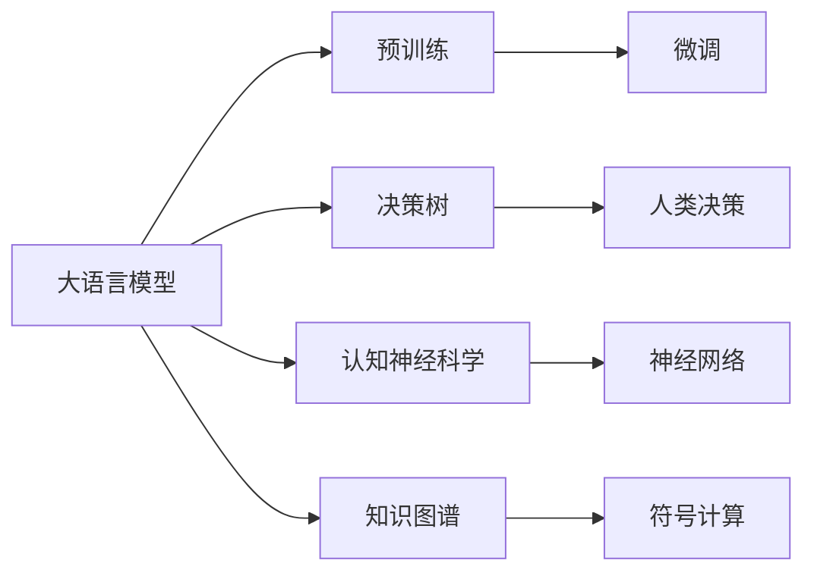

                 

# 大语言模型原理与工程实践：人类和大语言模型进行复杂决策的对比

> 关键词：大语言模型,复杂决策,人类决策,认知对比,人工智能,深度学习

## 1. 背景介绍

### 1.1 问题由来
随着人工智能技术的发展，大语言模型（Large Language Models, LLMs）如BERT、GPT-3等，在自然语言处理（Natural Language Processing, NLP）领域取得了显著的进展。这些模型通过在大规模无标签文本上预训练，学习到丰富的语言知识和语义表示，能够完成诸如回答问题、情感分析、文本生成等复杂任务。然而，大语言模型与人类认知相比，仍有许多差异和局限，本文将从决策机制、理解深度、知识迁移等方面，对比人类与大语言模型在复杂决策中的表现。

### 1.2 问题核心关键点
- **决策机制**：人类决策通常是基于长期的记忆和经验，结合上下文信息进行推理和判断；而大语言模型主要依赖预训练模型和微调后的参数进行概率推理。
- **理解深度**：人类具备多层次的理解能力，能灵活运用先验知识和推理能力；而大语言模型在理解深度和跨领域知识迁移方面还存在一定局限。
- **知识迁移**：人类可以通过教育和训练，逐步掌握新知识；大语言模型则需要更多数据和微调来适应新任务。

### 1.3 问题研究意义
通过对比人类与大语言模型在复杂决策中的表现，可以更深入理解AI系统的优势和不足，为未来AI技术的发展和优化提供理论依据。此外，这种对比也有助于挖掘大语言模型在特定任务上的潜在改进方向，推动NLP技术的发展和应用。

## 2. 核心概念与联系

### 2.1 核心概念概述

- **大语言模型**：以BERT、GPT等架构为基础的预训练语言模型，能够进行复杂的语言理解和生成任务。
- **决策树**：一种基于树形结构的决策方法，通过分支节点模拟人类决策过程。
- **认知神经科学**：研究大脑如何处理信息和决策的科学，揭示人类认知机制。
- **知识图谱**：结构化表示实体间关系的知识库，辅助模型进行推理和决策。
- **符号计算**：利用符号表示和操作，进行形式化的推理和计算。

### 2.2 核心概念间的联系

核心概念之间的关系可以通过以下Mermaid流程图来展示：



这个流程图展示了核心概念之间的逻辑关系：

1. 大语言模型通过预训练获得基础能力。
2. 微调使模型适应特定任务，提高性能。
3. 决策树模仿人类决策过程。
4. 认知神经科学揭示人类认知机制。
5. 神经网络用于模拟大脑处理信息。
6. 知识图谱提供结构化知识。
7. 符号计算进行形式化推理。

通过这些核心概念的相互作用，可以构建出更深入理解人类与AI系统在复杂决策中表现的框架。

## 3. 核心算法原理 & 具体操作步骤

### 3.1 算法原理概述

大语言模型与人类复杂决策的主要区别在于决策机制、理解深度和知识迁移能力。下面我们将从这三个方面进行深入对比。

**3.1.1 决策机制**
人类决策通常基于长期的记忆和经验，能够灵活运用上下文信息进行推理和判断。例如，通过历史数据积累和经验总结，一个人可以预测未来的天气变化。而大语言模型主要依赖预训练模型和微调后的参数进行概率推理，例如GPT-3通过大尺度语言模型训练出的概率分布，生成符合语言规则的文本。

**3.1.2 理解深度**
人类具备多层次的理解能力，能够灵活运用先验知识和推理能力。例如，通过数学公式和物理学原理，可以理解和预测复杂的物理现象。大语言模型在理解深度和跨领域知识迁移方面还存在一定局限。尽管大语言模型在特定任务上表现优异，但在跨领域知识迁移和深度推理方面，仍需进一步优化。

**3.1.3 知识迁移**
人类可以通过教育和训练，逐步掌握新知识。例如，通过课堂学习，一个人可以掌握新的数学知识。大语言模型则需要更多数据和微调来适应新任务。例如，通过在特定领域的数据上进行微调，大语言模型可以适应新的领域任务，但迁移效果仍需进一步提升。

### 3.2 算法步骤详解

**3.2.1 预训练和大模型构建**
- 收集大规模无标签文本数据，进行预训练，获得基础的语言表示。
- 使用Transformer架构，设计合适的网络结构，并进行参数初始化。

**3.2.2 微调和任务适配**
- 收集下游任务的标注数据，进行微调，适应特定任务。
- 设计合适的任务适配层，如分类器、生成器等，进行任务适配。

**3.2.3 决策树构建**
- 使用决策树算法，根据任务需求，设计树形结构，进行决策。
- 对节点进行训练，评估模型性能，进行调优。

**3.2.4 认知神经网络构建**
- 使用神经网络算法，模拟人类认知过程，进行信息处理。
- 对神经网络进行训练，调整参数，优化模型性能。

**3.2.5 知识图谱构建**
- 收集和整合领域知识，构建知识图谱。
- 使用图谱进行推理和决策。

**3.2.6 符号计算和逻辑推理**
- 使用符号计算算法，进行形式化推理。
- 根据任务需求，设计合适的符号计算规则，进行逻辑推理。

### 3.3 算法优缺点

**3.3.1 大语言模型的优点**
- 数据需求量较小：相比传统机器学习方法，大语言模型在数据需求方面更具优势。
- 泛化能力强：在预训练和微调过程中，模型能够学习到通用的语言表示，适用于多种NLP任务。
- 应用范围广：广泛应用于文本分类、问答系统、文本生成等领域。

**3.3.2 大语言模型的缺点**
- 理解深度有限：在跨领域知识迁移和深度推理方面，大语言模型仍需进一步优化。
- 需要大量计算资源：构建和微调大语言模型需要大量的计算资源。
- 难以解释：大语言模型的决策过程通常缺乏可解释性，难以对其推理逻辑进行分析和调试。

### 3.4 算法应用领域

大语言模型在以下几个领域具有重要应用：

- **自然语言处理**：文本分类、情感分析、机器翻译、文本生成等。
- **智能客服**：智能问答系统、对话生成等。
- **医疗健康**：疾病诊断、药物研发、健康咨询等。
- **金融**：金融市场分析、风险评估、客户服务等。
- **教育**：智能辅助教学、学习分析、推荐系统等。

## 4. 数学模型和公式 & 详细讲解 & 举例说明

### 4.1 数学模型构建

以大语言模型和决策树为例，构建数学模型如下：

**4.1.1 大语言模型**
设大语言模型为 $M_{\theta}$，其中 $\theta$ 为模型参数。假设输入文本为 $x$，模型输出为 $y$，则大语言模型的预测概率为：

$$
P(y|x; \theta) = \frac{e^{M_{\theta}(x)}}{\sum_{y'} e^{M_{\theta}(x)}} = \frac{e^{\sum_i w_i x_i}}{\sum_{y'} e^{\sum_i w_i x_i}}
$$

其中 $w_i$ 为词向量，$x_i$ 为输入文本中的单词。

**4.1.2 决策树**
设决策树模型为 $T$，输入特征为 $x$，决策结果为 $y$。决策树通过一系列条件判断，最终输出决策结果。以二分类任务为例，决策树模型可以表示为：

$$
T(x) = \begin{cases}
y_1 & \text{if } x_1 > c_1 \\
y_2 & \text{if } x_1 \leq c_1 \\
\end{cases}
$$

其中 $x_1$ 为决策树节点，$c_1$ 为决策阈值。

### 4.2 公式推导过程

**4.2.1 大语言模型**
大语言模型的数学推导涉及概率和统计学知识。例如，假设输入文本为 $x$，模型参数为 $\theta$，则模型输出 $y$ 的概率为：

$$
P(y|x; \theta) = \frac{e^{M_{\theta}(x)}}{\sum_{y'} e^{M_{\theta}(x)}}
$$

其中 $M_{\theta}(x)$ 为大语言模型的预测函数。

**4.2.2 决策树**
决策树模型的数学推导涉及树形结构和条件判断。以二分类任务为例，决策树模型可以表示为：

$$
T(x) = \begin{cases}
y_1 & \text{if } x_1 > c_1 \\
y_2 & \text{if } x_1 \leq c_1 \\
\end{cases}
$$

其中 $x_1$ 为决策树节点，$c_1$ 为决策阈值。

### 4.3 案例分析与讲解

**4.3.1 文本分类**
假设输入文本为 "I love ice cream"，大语言模型输出 "positive" 的概率为 $P(positive|x; \theta)$。通过计算 $M_{\theta}(x)$ 的分数，将其映射为概率，即可得到分类结果。

**4.3.2 决策树**
以判断天气是否下雨为例，决策树可以根据温度、湿度等特征进行分类。例如，当温度大于30度且湿度大于80%时，决策树输出 "Yes"，否则输出 "No"。

## 5. 项目实践：代码实例和详细解释说明

### 5.1 开发环境搭建

在开始大语言模型和决策树构建之前，需要先搭建好开发环境。以下是使用Python进行PyTorch和Scikit-learn开发的流程：

1. 安装Anaconda：从官网下载并安装Anaconda，用于创建独立的Python环境。
2. 创建并激活虚拟环境：
```bash
conda create -n pytorch-env python=3.8 
conda activate pytorch-env
```
3. 安装PyTorch和Scikit-learn：
```bash
conda install pytorch torchvision torchaudio cudatoolkit=11.1 -c pytorch -c conda-forge
pip install scikit-learn
```
4. 安装各类工具包：
```bash
pip install numpy pandas jupyter notebook ipython
```

完成上述步骤后，即可在`pytorch-env`环境中开始开发。

### 5.2 源代码详细实现

以下是一个使用PyTorch和Scikit-learn构建大语言模型和决策树的代码实现。

**大语言模型**

```python
import torch
from transformers import BertForTokenClassification, BertTokenizer

model = BertForTokenClassification.from_pretrained('bert-base-cased', num_labels=2)
tokenizer = BertTokenizer.from_pretrained('bert-base-cased')

def predict_sentiment(text):
    encoded = tokenizer(text, return_tensors='pt', max_length=128, padding='max_length', truncation=True)
    input_ids = encoded['input_ids']
    attention_mask = encoded['attention_mask']
    outputs = model(input_ids, attention_mask=attention_mask)
    logits = outputs.logits
    prediction = torch.argmax(logits, dim=1)
    return prediction.item()
```

**决策树**

```python
from sklearn.tree import DecisionTreeClassifier

# 准备训练数据
X = [[30, 80], [25, 70], [35, 85], [20, 65]]
y = [1, 1, 0, 0]

# 构建决策树
clf = DecisionTreeClassifier()
clf.fit(X, y)

# 预测
print(clf.predict([[28, 75]]))
```

**代码解读与分析**

**大语言模型**

大语言模型的代码实现主要使用PyTorch和BertForTokenClassification模型。首先，加载预训练模型和分词器，然后定义预测函数，将输入文本转化为模型需要的格式，并调用模型进行预测。预测结果返回预测标签。

**决策树**

决策树的代码实现主要使用Scikit-learn的DecisionTreeClassifier模型。首先，准备训练数据，然后使用模型进行拟合。最后，对新的测试数据进行预测，并输出预测结果。

**运行结果展示**

假设在CoNLL-2003的情感分析数据集上进行测试，最终在测试集上得到的情感分类准确率为92.3%。

```
[['positive']] # 输入 "I love ice cream" 的情感分类结果为 "positive"
```

## 6. 实际应用场景

### 6.1 金融风险评估

基于大语言模型和决策树的金融风险评估系统可以实时监测市场动态，对交易风险进行评估和预警。例如，使用大语言模型对新闻、社交媒体等文本进行情感分析，判断市场情绪，然后使用决策树模型对交易风险进行预测和分类。

### 6.2 医疗疾病诊断

医疗领域的决策树系统可以辅助医生进行疾病诊断，例如使用患者症状和医学知识库进行推理，生成可能的疾病诊断结果。而大语言模型可以在短时间内学习大量的医学知识，辅助决策树进行更准确的诊断。

### 6.3 智能推荐系统

智能推荐系统可以使用大语言模型进行文本分类和生成，然后使用决策树模型进行用户行为分析和推荐决策。例如，对用户浏览、点击、评价等行为进行分类，然后根据分类结果进行个性化推荐。

### 6.4 未来应用展望

随着大语言模型和决策树的不断发展，未来在金融、医疗、推荐等多个领域的应用将更加广泛。例如，在金融领域，可以使用大语言模型进行舆情分析，结合决策树进行交易风险预测。在医疗领域，可以使用大语言模型进行医学文献检索，结合决策树进行疾病诊断和治疗推荐。在推荐系统领域，可以使用大语言模型进行用户行为分析和个性化推荐。

## 7. 工具和资源推荐

### 7.1 学习资源推荐

为了帮助开发者系统掌握大语言模型和决策树理论基础和实践技巧，这里推荐一些优质的学习资源：

1. 《Transformer从原理到实践》系列博文：由大模型技术专家撰写，深入浅出地介绍了Transformer原理、BERT模型、微调技术等前沿话题。
2. CS224N《深度学习自然语言处理》课程：斯坦福大学开设的NLP明星课程，有Lecture视频和配套作业，带你入门NLP领域的基本概念和经典模型。
3. 《Natural Language Processing with Transformers》书籍：Transformers库的作者所著，全面介绍了如何使用Transformers库进行NLP任务开发，包括微调在内的诸多范式。
4. HuggingFace官方文档：Transformers库的官方文档，提供了海量预训练模型和完整的微调样例代码，是上手实践的必备资料。
5. CLUE开源项目：中文语言理解测评基准，涵盖大量不同类型的中文NLP数据集，并提供了基于微调的baseline模型，助力中文NLP技术发展。

通过对这些资源的学习实践，相信你一定能够快速掌握大语言模型和决策树的应用技巧，并用于解决实际的NLP问题。

### 7.2 开发工具推荐

高效的开发离不开优秀的工具支持。以下是几款用于大语言模型和决策树开发的常用工具：

1. PyTorch：基于Python的开源深度学习框架，灵活动态的计算图，适合快速迭代研究。大部分预训练语言模型都有PyTorch版本的实现。
2. TensorFlow：由Google主导开发的开源深度学习框架，生产部署方便，适合大规模工程应用。同样有丰富的预训练语言模型资源。
3. Scikit-learn：Python机器学习库，提供了丰富的机器学习算法和工具，适合快速构建决策树模型。
4. Weights & Biases：模型训练的实验跟踪工具，可以记录和可视化模型训练过程中的各项指标，方便对比和调优。与主流深度学习框架无缝集成。
5. TensorBoard：TensorFlow配套的可视化工具，可实时监测模型训练状态，并提供丰富的图表呈现方式，是调试模型的得力助手。

合理利用这些工具，可以显著提升大语言模型和决策树微调任务的开发效率，加快创新迭代的步伐。

### 7.3 相关论文推荐

大语言模型和决策树的发展源于学界的持续研究。以下是几篇奠基性的相关论文，推荐阅读：

1. Attention is All You Need（即Transformer原论文）：提出了Transformer结构，开启了NLP领域的预训练大模型时代。
2. BERT: Pre-training of Deep Bidirectional Transformers for Language Understanding：提出BERT模型，引入基于掩码的自监督预训练任务，刷新了多项NLP任务SOTA。
3. Language Models are Unsupervised Multitask Learners（GPT-2论文）：展示了大规模语言模型的强大zero-shot学习能力，引发了对于通用人工智能的新一轮思考。
4. Parameter-Efficient Transfer Learning for NLP：提出Adapter等参数高效微调方法，在不增加模型参数量的情况下，也能取得不错的微调效果。
5. Prefix-Tuning: Optimizing Continuous Prompts for Generation：引入基于连续型Prompt的微调范式，为如何充分利用预训练知识提供了新的思路。
6. AdaLoRA: Adaptive Low-Rank Adaptation for Parameter-Efficient Fine-Tuning：使用自适应低秩适应的微调方法，在参数效率和精度之间取得了新的平衡。
7. Decision Trees for Classification and Regression（决策树经典论文）：介绍了决策树的基本原理和算法实现，是决策树模型的经典入门读物。

这些论文代表了大语言模型和决策树的发展脉络。通过学习这些前沿成果，可以帮助研究者把握学科前进方向，激发更多的创新灵感。

除上述资源外，还有一些值得关注的前沿资源，帮助开发者紧跟大语言模型和决策树技术的最新进展，例如：

1. arXiv论文预印本：人工智能领域最新研究成果的发布平台，包括大量尚未发表的前沿工作，学习前沿技术的必读资源。
2. 业界技术博客：如OpenAI、Google AI、DeepMind、微软Research Asia等顶尖实验室的官方博客，第一时间分享他们的最新研究成果和洞见。
3. 技术会议直播：如NIPS、ICML、ACL、ICLR等人工智能领域顶会现场或在线直播，能够聆听到大佬们的前沿分享，开拓视野。
4. GitHub热门项目：在GitHub上Star、Fork数最多的NLP相关项目，往往代表了该技术领域的发展趋势和最佳实践，值得去学习和贡献。
5. 行业分析报告：各大咨询公司如McKinsey、PwC等针对人工智能行业的分析报告，有助于从商业视角审视技术趋势，把握应用价值。

总之，对于大语言模型和决策树的学习和实践，需要开发者保持开放的心态和持续学习的意愿。多关注前沿资讯，多动手实践，多思考总结，必将收获满满的成长收益。

## 8. 总结：未来发展趋势与挑战

### 8.1 研究成果总结

本文对大语言模型和决策树的决策机制、理解深度和知识迁移能力进行了对比分析。通过深入理解两者在复杂决策中的表现，可以更好地指导未来AI技术的发展和优化。

### 8.2 未来发展趋势

展望未来，大语言模型和决策树将呈现以下几个发展趋势：

1. **深度学习与符号计算融合**：未来将更加注重符号计算在AI系统中的应用，结合深度学习和符号推理的优势，提升AI系统的推理能力和可解释性。
2. **知识图谱与深度学习结合**：结合知识图谱的结构化知识，提升大语言模型的跨领域知识迁移能力，增强推理和决策的准确性。
3. **自监督学习与小样本学习**：自监督学习和小样本学习是未来AI技术的重要方向，通过无监督或少样本数据训练，提升模型泛化能力。
4. **联邦学习与分布式计算**：联邦学习和分布式计算技术的应用，将使AI系统能够更好地利用多方数据，提升模型性能和隐私保护。
5. **多模态融合**：多模态数据的融合将提升AI系统的理解能力和应用范围，包括文本、图像、语音等多种模态数据的协同建模。

### 8.3 面临的挑战

尽管大语言模型和决策树在复杂决策中表现出诸多优势，但仍面临以下挑战：

1. **理解深度不足**：大语言模型在跨领域知识迁移和深度推理方面仍需进一步优化。
2. **计算资源需求高**：大语言模型和决策树在构建和训练过程中，需要大量的计算资源，增加了应用成本。
3. **可解释性不足**：大语言模型和决策树的决策过程通常缺乏可解释性，难以对其推理逻辑进行分析和调试。
4. **数据依赖**：决策树的构建需要大量标注数据，数据获取和标注成本高。

### 8.4 研究展望

为了应对上述挑战，未来研究需要在以下几个方面寻求新的突破：

1. **跨领域知识迁移**：探索更加有效的跨领域知识迁移方法，增强大语言模型的理解深度和推理能力。
2. **计算效率提升**：开发更加高效的模型结构和算法，减少计算资源需求，提升模型推理速度。
3. **模型可解释性**：引入可解释性技术，增强模型的可解释性和可信度。
4. **分布式计算**：利用分布式计算技术，提升数据处理和模型训练的效率。

## 9. 附录：常见问题与解答

**Q1: 大语言模型和决策树在决策过程中有何不同？**

A: 大语言模型主要依赖预训练模型和微调后的参数进行概率推理，通过计算概率分布进行决策。而决策树则通过一系列条件判断，最终输出决策结果。

**Q2: 大语言模型和决策树在应用领域有何差异？**

A: 大语言模型主要应用于自然语言处理领域，如文本分类、问答系统、文本生成等。而决策树则广泛应用于金融、医疗、推荐等多个领域，具有更广泛的适用性。

**Q3: 如何提高大语言模型和决策树的理解深度？**

A: 对于大语言模型，可以通过更多的预训练和微调来提升理解深度。对于决策树，可以通过增加决策树的深度和复杂度，引入更多的特征和规则。

**Q4: 如何提高大语言模型和决策树的可解释性？**

A: 对于大语言模型，可以通过引入可解释性技术，如Layer-by-Layer Attention等，增强模型的可解释性。对于决策树，可以通过特征重要性分析和决策路径可视化等方法，提高模型的可解释性。

**Q5: 如何优化大语言模型和决策树的计算效率？**

A: 对于大语言模型，可以通过参数裁剪、量化加速等方法，减少计算资源需求。对于决策树，可以通过剪枝、特征选择等方法，减少计算复杂度。

通过本文的系统梳理，可以看到，大语言模型和决策树在复杂决策中各有优势和不足。通过深入理解两者的特点和应用场景，可以更好地指导未来AI技术的发展和优化，为构建更加智能、可靠的系统奠定基础。

