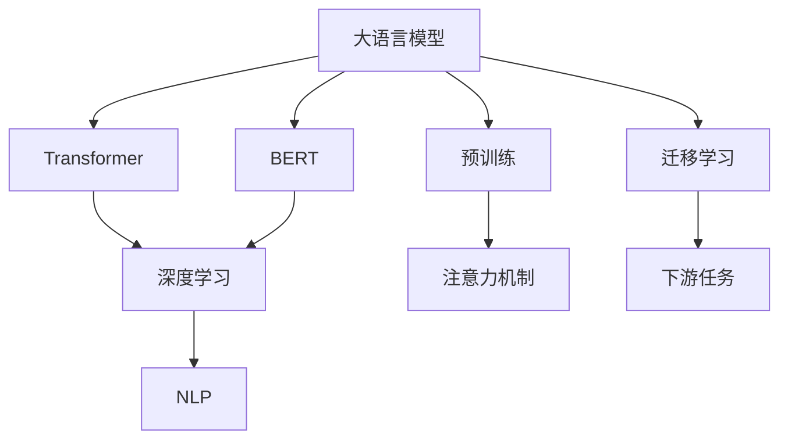
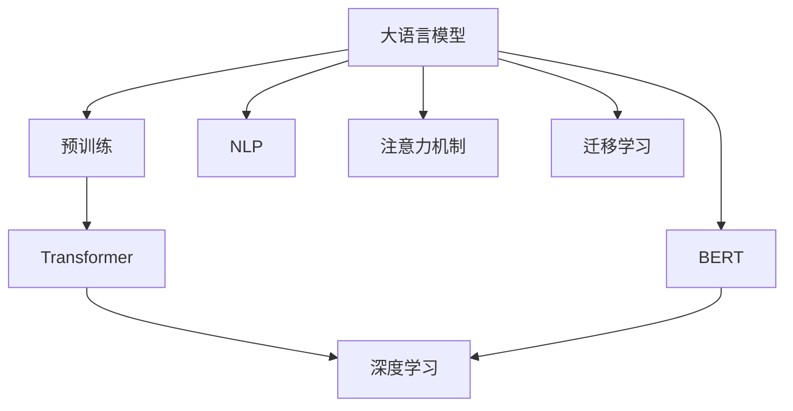
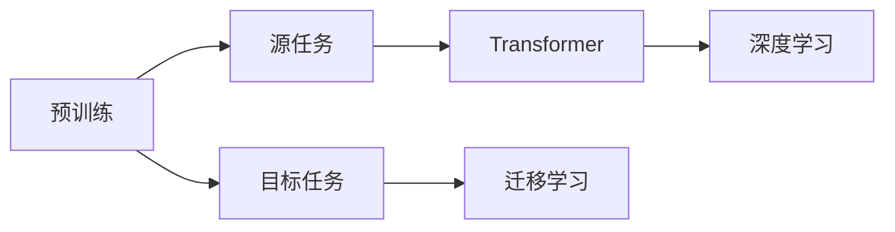
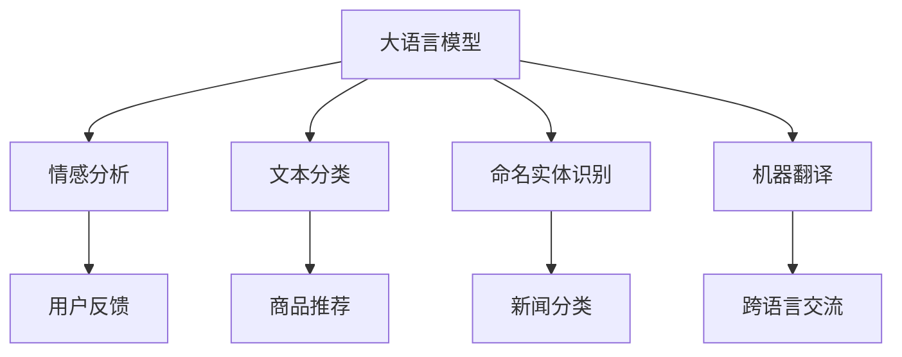
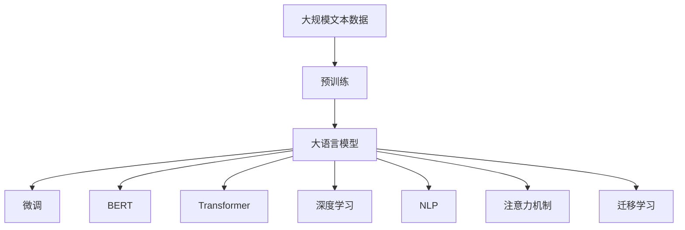

                 

# 大语言模型应用指南：机器能思考吗

> 关键词：大语言模型,Transformer,BERT,预训练,深度学习,自然语言处理(NLP),迁移学习

## 1. 背景介绍

### 1.1 问题由来
近年来，随着深度学习技术的快速发展，人工智能在自然语言处理(Natural Language Processing, NLP)领域取得了显著进步。大语言模型（Large Language Models, LLMs）如BERT、GPT-3等，通过在海量文本数据上进行预训练，学习到了丰富的语言知识，展现出了强大的文本生成、语义理解和任务处理能力。这些大模型在情感分析、文本分类、问答系统、机器翻译等任务上取得了领先的性能，极大提升了NLP技术的应用水平。

然而，尽管大语言模型在特定任务上表现出色，但对于其是否具备真正的“思考”能力，即是否能够理解复杂、多变的语言环境，并据此做出合理的决策和推断，学界和业界仍存在巨大争议。大语言模型的“思考”能力如何定义？模型能否超越传统算法，形成自主的推理逻辑？本文将通过深入分析大语言模型的架构、训练过程及其应用场景，探讨这些问题，揭示大语言模型在实际应用中的表现，以及其未来发展趋势和面临的挑战。

### 1.2 问题核心关键点
本文将聚焦于以下几个关键问题：

1. 大语言模型在预训练和微调中的核心算法和原理是什么？
2. 大语言模型在不同任务上的应用表现如何？
3. 大语言模型在实际应用中面临哪些技术挑战？
4. 大语言模型如何与人工智能的深度学习、自然语言处理等技术结合，形成更强大的智能系统？
5. 大语言模型在未来技术发展中可能扮演怎样的角色？

### 1.3 问题研究意义
深入了解大语言模型的原理、应用和挑战，对于人工智能技术的发展具有重要意义：

1. 推动NLP技术的进步。大语言模型在NLP领域的优异表现，为传统NLP技术注入了新的活力，推动了人工智能技术的进步。
2. 拓展人工智能应用场景。大语言模型的高效性和准确性，使得其在更多领域的应用成为可能，如智能客服、智能推荐、智能写作等。
3. 促进多学科融合。大语言模型的研究和应用，促进了计算机科学、语言学、认知科学等学科的交叉融合，推动了人工智能研究的深度和广度。
4. 探索AI的理论边界。大语言模型的发展和应用，为人类认知智能的探索提供了新的视角，挑战了人工智能的理论边界。

## 2. 核心概念与联系

### 2.1 核心概念概述

为了更好地理解大语言模型，本节将介绍几个关键概念及其相互关系：

- **大语言模型 (Large Language Models, LLMs)**：基于深度学习的模型，能够在海量的文本数据上进行预训练，学习到丰富的语言知识和常识，用于各种NLP任务，如文本分类、命名实体识别、翻译等。

- **Transformer (Attention Mechanism)**：一种用于深度学习的神经网络架构，具有并行计算的优点，能够高效地处理序列数据。Transformer模型在自然语言处理中得到广泛应用。

- **BERT (Bidirectional Encoder Representations from Transformers)**：由Google开发的预训练语言模型，通过双向Transformer编码器学习语言表示，广泛应用于各种下游任务。

- **预训练 (Pre-training)**：在大规模无标签文本数据上进行自监督学习，学习到通用的语言表示。预训练是构建大语言模型的重要步骤。

- **迁移学习 (Transfer Learning)**：利用预训练模型在新任务上的微调，通过共享预训练的通用知识，提升下游任务的性能。

- **深度学习 (Deep Learning)**：一种基于神经网络的机器学习方法，通过多层神经元的学习，解决复杂的模式识别和预测问题。

- **自然语言处理 (Natural Language Processing, NLP)**：研究计算机如何理解和生成人类语言，是人工智能的重要分支之一。

- **注意力机制 (Attention Mechanism)**：用于处理序列数据的机制，能够动态调整模型对序列中不同位置的信息关注度，提高模型的准确性和效率。

这些概念之间的逻辑关系可以通过以下Mermaid流程图来展示：



这个流程图展示了不同概念之间的联系：

1. 大语言模型基于Transformer架构，结合BERT等预训练技术，通过预训练和迁移学习实现。
2. 预训练和迁移学习是深度学习在大语言模型中的应用，利用自监督和有监督学习提升模型性能。
3. 注意力机制是Transformer的核心，提升模型处理序列数据的能力。
4. 深度学习是构建大语言模型的基础，通过多层神经元学习语言表示。
5. 自然语言处理是大语言模型的应用领域，包括文本分类、命名实体识别、翻译等任务。

### 2.2 概念间的关系

这些概念之间存在着紧密的联系，形成了大语言模型的完整生态系统。下面我们通过几个Mermaid流程图来展示这些概念之间的关系。

#### 2.2.1 大语言模型的学习范式



这个流程图展示了大语言模型的学习范式：

1. 大语言模型通过预训练和迁移学习，利用Transformer架构和深度学习技术，学习到通用的语言表示。
2. 注意力机制是Transformer的核心，提升模型处理序列数据的能力。
3. 自然语言处理是大语言模型的应用领域，通过不同的任务适配层，实现对各种NLP任务的微调。

#### 2.2.2 预训练与迁移学习的关系



这个流程图展示了预训练和迁移学习的基本原理：

1. 预训练通过自监督学习，在大规模无标签数据上训练通用语言模型。
2. 迁移学习通过微调，在预训练模型的基础上，利用少量有标签数据优化模型，适应特定任务。
3. 预训练和迁移学习相辅相成，预训练提供通用的语言知识，迁移学习将这些知识应用到特定任务上。

#### 2.2.3 大语言模型在实际应用中的角色



这个流程图展示了大语言模型在实际应用中的多种角色：

1. 大语言模型可以应用于情感分析、文本分类、命名实体识别、机器翻译等任务。
2. 通过微调，大语言模型可以适应不同的应用场景，提升模型性能。
3. 大语言模型在智能客服、智能推荐、智能写作等领域都有广泛应用。

### 2.3 核心概念的整体架构

最后，我们用一个综合的流程图来展示这些核心概念在大语言模型应用中的整体架构：



这个综合流程图展示了从预训练到微调，再到迁移学习的完整过程：

1. 大语言模型首先在大规模文本数据上进行预训练，学习通用的语言表示。
2. 通过微调，适应特定任务，提升模型性能。
3. 利用BERT等预训练技术，进一步增强语言表示能力。
4. 利用Transformer架构和深度学习技术，提升模型处理序列数据的能力。
5. 利用自然语言处理技术，实现对各种NLP任务的适配和优化。

通过这些流程图，我们可以更清晰地理解大语言模型在预训练、微调和迁移学习中的工作原理，为后续深入讨论具体应用提供基础。

## 3. 核心算法原理 & 具体操作步骤
### 3.1 算法原理概述

大语言模型的核心算法包括预训练、微调和迁移学习。本节将详细讲解这些算法的原理和具体操作步骤。

### 3.2 算法步骤详解

#### 3.2.1 预训练步骤

大语言模型通过在大量无标签文本数据上进行自监督预训练，学习到通用的语言表示。预训练过程通常包括以下步骤：

1. **数据准备**：选择大规模的文本数据，如Wikipedia、Common Crawl等，构建预训练数据集。
2. **模型构建**：构建Transformer架构的模型，包括编码器、解码器和注意力机制。
3. **模型训练**：使用预训练任务（如语言建模、掩码语言模型等），对模型进行训练。

以BERT为例，其预训练任务包括掩码语言模型和下一句预测：

- **掩码语言模型 (Masked Language Model, MLM)**：随机掩盖输入序列中的某些单词，预测被掩盖的单词。
- **下一句预测 (Next Sentence Prediction, NSP)**：预测两个句子是否连续，提升模型对句子关系的理解。

#### 3.2.2 微调步骤

微调是大语言模型应用的具体过程，通过在特定任务上的训练，优化模型参数，提升模型在该任务上的表现。微调过程通常包括以下步骤：

1. **数据准备**：选择特定任务的数据集，如情感分析数据集、命名实体识别数据集等。
2. **模型适配**：设计任务适配层，将预训练模型的输出映射到任务标签空间。
3. **模型训练**：在微调数据集上训练模型，使用合适的损失函数和优化器，最小化模型预测与真实标签之间的差距。

以情感分析为例，其微调过程包括：

- **数据准备**：选择情感分析数据集，如IMDB影评数据集。
- **模型适配**：在预训练模型顶层添加线性分类器和交叉熵损失函数。
- **模型训练**：使用微调数据集训练模型，最小化交叉熵损失。

#### 3.2.3 迁移学习步骤

迁移学习是通过在已有预训练模型的基础上，进一步微调，提升模型在特定任务上的性能。迁移学习过程通常包括以下步骤：

1. **数据准备**：选择特定任务的数据集，如问答数据集、翻译数据集等。
2. **模型适配**：设计任务适配层，将预训练模型的输出映射到任务标签空间。
3. **模型训练**：在迁移学习数据集上训练模型，使用合适的损失函数和优化器，最小化模型预测与真实标签之间的差距。

以问答系统为例，其迁移学习过程包括：

- **数据准备**：选择问答数据集，如QA数据集。
- **模型适配**：在预训练模型顶层添加线性分类器和交叉熵损失函数。
- **模型训练**：使用问答数据集训练模型，最小化交叉熵损失。

### 3.3 算法优缺点

大语言模型的预训练、微调和迁移学习算法具有以下优点：

1. **高效性**：预训练和微调过程不需要标注数据，利用大规模无标签数据进行训练，大大降低了数据获取成本。
2. **通用性**：预训练和微调模型可以应用于各种NLP任务，通过微调适配不同的任务。
3. **可扩展性**：大语言模型可以通过增加数据和计算资源进行扩展，提升模型性能。
4. **鲁棒性**：预训练和微调模型具有一定的鲁棒性，能够适应多种数据分布和噪声。

同时，这些算法也存在一些缺点：

1. **数据依赖**：预训练和微调过程对数据的质量和数量要求较高，数据不足可能导致模型性能下降。
2. **计算成本高**：预训练和微调过程需要大量的计算资源，对硬件要求较高。
3. **过拟合风险**：模型在大规模数据上进行训练，容易出现过拟合现象。
4. **解释性差**：大语言模型的内部机制复杂，难以解释其推理过程和决策依据。

### 3.4 算法应用领域

大语言模型的预训练、微调和迁移学习算法已经广泛应用于以下几个领域：

1. **自然语言处理 (NLP)**：情感分析、文本分类、命名实体识别、机器翻译、问答系统等任务。
2. **信息检索**：通过自然语言处理技术，提高搜索结果的相关性和准确性。
3. **智能客服**：利用自然语言理解技术，实现智能客服系统，提高客户体验。
4. **智能推荐**：通过自然语言处理技术，提升推荐系统的准确性和个性化。
5. **智能写作**：利用自然语言生成技术，辅助写作和内容创作。

这些领域的应用，展示了大语言模型在实际场景中的广泛价值和强大能力。

## 4. 数学模型和公式 & 详细讲解 & 举例说明

### 4.1 数学模型构建

大语言模型的数学模型通常基于深度学习和Transformer架构，本节将详细讲解这些模型的数学模型构建过程。

#### 4.1.1 深度学习模型

深度学习模型通常由多层神经元组成，通过前向传播和反向传播进行训练。以一个简单的深度学习模型为例，其数学模型构建过程如下：

1. **输入层**：将输入数据映射为向量，记为 $x_1, x_2, ..., x_n$。
2. **隐藏层**：通过多层神经元的计算，得到中间表示 $h_1, h_2, ..., h_m$。
3. **输出层**：将中间表示映射到输出空间，得到最终输出 $y$。

深度学习模型的前向传播过程可以用数学公式表示为：

$$
h_1 = f_1(w_1 x_1 + b_1), h_2 = f_2(w_2 h_1 + b_2), ..., h_m = f_m(w_m h_{m-1} + b_m)
$$

$$
y = w_y h_m + b_y
$$

其中 $f$ 表示激活函数， $w$ 和 $b$ 分别表示权重和偏置。

#### 4.1.2 Transformer模型

Transformer模型是一种用于深度学习的神经网络架构，通过自注意力机制学习序列数据之间的依赖关系。以一个简单的Transformer模型为例，其数学模型构建过程如下：

1. **输入层**：将输入数据映射为向量，记为 $x_1, x_2, ..., x_n$。
2. **编码器**：通过多层编码器计算中间表示 $h_1, h_2, ..., h_m$。
3. **解码器**：通过多层解码器计算输出 $y$。

Transformer模型的编码器和解码器结构如下：

$$
\begin{aligned}
&Q = XW^Q + b^Q \\
&K = XW^K + b^K \\
&V = XW^V + b^V \\
&S = K^T \cdot Q \\
&h = \text{softmax}(S) \cdot V \\
&y = hW^O + b^O
\end{aligned}
$$

其中 $Q$、$K$、$V$ 分别表示查询、键、值向量， $h$ 表示注意力权重， $y$ 表示输出向量。

### 4.2 公式推导过程

#### 4.2.1 深度学习模型

以一个简单的分类任务为例，其数学模型构建和公式推导过程如下：

1. **输入层**：将输入数据映射为向量，记为 $x_1, x_2, ..., x_n$。
2. **隐藏层**：通过多层神经元的计算，得到中间表示 $h_1, h_2, ..., h_m$。
3. **输出层**：将中间表示映射到输出空间，得到最终输出 $y$。

其数学公式如下：

$$
h_1 = f_1(w_1 x_1 + b_1), h_2 = f_2(w_2 h_1 + b_2), ..., h_m = f_m(w_m h_{m-1} + b_m)
$$

$$
y = w_y h_m + b_y
$$

其中 $f$ 表示激活函数， $w$ 和 $b$ 分别表示权重和偏置。

#### 4.2.2 Transformer模型

以一个简单的机器翻译任务为例，其数学模型构建和公式推导过程如下：

1. **输入层**：将输入数据映射为向量，记为 $x_1, x_2, ..., x_n$。
2. **编码器**：通过多层编码器计算中间表示 $h_1, h_2, ..., h_m$。
3. **解码器**：通过多层解码器计算输出 $y$。

其数学公式如下：

$$
\begin{aligned}
&Q = XW^Q + b^Q \\
&K = XW^K + b^K \\
&V = XW^V + b^V \\
&S = K^T \cdot Q \\
&h = \text{softmax}(S) \cdot V \\
&y = hW^O + b^O
\end{aligned}
$$

其中 $Q$、$K$、$V$ 分别表示查询、键、值向量， $h$ 表示注意力权重， $y$ 表示输出向量。

### 4.3 案例分析与讲解

#### 4.3.1 深度学习模型

以一个简单的分类任务为例，其数学模型构建和公式推导过程如下：

1. **输入层**：将输入数据映射为向量，记为 $x_1, x_2, ..., x_n$。
2. **隐藏层**：通过多层神经元的计算，得到中间表示 $h_1, h_2, ..., h_m$。
3. **输出层**：将中间表示映射到输出空间，得到最终输出 $y$。

其数学公式如下：

$$
h_1 = f_1(w_1 x_1 + b_1), h_2 = f_2(w_2 h_1 + b_2), ..., h_m = f_m(w_m h_{m-1} + b_m)
$$

$$
y = w_y h_m + b_y
$$

其中 $f$ 表示激活函数， $w$ 和 $b$ 分别表示权重和偏置。

#### 4.3.2 Transformer模型

以一个简单的机器翻译任务为例，其数学模型构建和公式推导过程如下：

1. **输入层**：将输入数据映射为向量，记为 $x_1, x_2, ..., x_n$。
2. **编码器**：通过多层编码器计算中间表示 $h_1, h_2, ..., h_m$。
3. **解码器**：通过多层解码器计算输出 $y$。

其数学公式如下：

$$
\begin{aligned}
&Q = XW^Q + b^Q \\
&K = XW^K + b^K \\
&V = XW^V + b^V \\
&S = K^T \cdot Q \\
&h = \text{softmax}(S) \cdot V \\
&y = hW^O + b^O
\end{aligned}
$$

其中 $Q$、$K$、$V$ 分别表示查询、键、值向量， $h$ 表示注意力权重， $y$ 表示输出向量。

## 5. 项目实践：代码实例和详细解释说明

### 5.1 开发环境搭建

在进行大语言模型项目实践前，我们需要准备好开发环境。以下是使用Python进行PyTorch开发的环境配置流程：

1. 安装Anaconda：从官网下载并安装Anaconda，用于创建独立的Python环境。

2. 创建并激活虚拟环境：
```bash
conda create -n pytorch-env python=3.8 
conda activate pytorch-env
```

3. 安装PyTorch：根据CUDA版本，从官网获取对应的安装命令。例如：
```bash
conda install pytorch torchvision torchaudio cudatoolkit=11.1 -c pytorch -c conda-forge
```

4. 安装Transformers库：
```bash
pip install transformers
```

5. 安装各类工具包：
```bash
pip install numpy pandas scikit-learn matplotlib tqdm jupyter notebook ipython
```

完成上述步骤后，即可在`pytorch-env`环境中开始大语言模型项目实践。

### 5.2 源代码详细实现

这里我们以BERT模型为例，给出使用Transformers库进行情感分析任务的PyTorch代码实现。

首先，定义情感分析任务的数据处理函数：

```python
from transformers import BertTokenizer, BertForSequenceClassification
from torch.utils.data import Dataset
import torch

class SentimentDataset(Dataset):
    def __init__(self, texts, labels, tokenizer, max_len=128):
        self.texts = texts
        self.labels = labels
        self.tokenizer = tokenizer
        self.max_len = max_len
        
    def __len__(self):
        return len(self.texts)
    
    def __getitem__(self, item):
        text = self.texts[item]
        label = self.labels[item]
        
        encoding = self.tokenizer(text, return_tensors='pt', max_length=self.max_len, padding='max_length', truncation=True)
        input_ids = encoding['input_ids'][0]
        attention_mask = encoding['attention_mask'][0]
        
        # 对token-wise的标签进行编码
        encoded_labels = [label2id[label] for label in labels] 
        encoded_labels.extend([label2id['O']] * (self.max_len - len(encoded_labels)))
        labels = torch.tensor(encoded_labels, dtype=torch.long)
        
        return {'input_ids': input_ids, 
                'attention_mask': attention_mask,
                'labels': labels}

# 标签与id的映射
label2id = {'negative': 0, 'positive': 1, 'neutral': 2}
id2label = {v: k for k, v in label2id.items()}
```

然后，定义模型和优化器：

```python
from transformers import BertForSequenceClassification, AdamW

model = BertForSequenceClassification.from_pretrained('bert-base-uncased', num_labels=len(label2id))

optimizer = AdamW(model.parameters(), lr=2e-5)
```

接着，定义训练和评估函数：

```python
from torch.utils.data import DataLoader
from tqdm import tqdm
from sklearn.metrics import classification_report

device = torch.device('cuda') if torch.cuda.is_available() else torch.device('cpu')
model.to(device)

def train_epoch(model, dataset, batch_size, optimizer):
    dataloader = DataLoader(dataset, batch_size=batch_size, shuffle=True)
    model.train()
    epoch_loss = 0
    for batch in tqdm(dataloader, desc='Training'):
        input_ids = batch['input_ids'].to(device)
        attention_mask = batch['attention_mask'].to(device)
        labels = batch['labels'].to(device)
        model.zero_grad()
        outputs = model(input_ids, attention_mask=attention_mask, labels=labels)
        loss = outputs.loss
        epoch_loss += loss.item()
        loss.backward()
        optimizer.step()
    return epoch_loss / len(dataloader)

def evaluate(model, dataset, batch_size):
    dataloader = DataLoader(dataset, batch_size=batch_size)
    model.eval()
    preds, labels = [], []
    with torch.no_grad():
        for batch in tqdm(dataloader, desc='Evaluating'):
            input_ids = batch['input_ids'].to(device)
            attention_mask = batch['attention_mask'].to(device)
            batch_labels = batch['labels']
            outputs = model(input_ids, attention_mask=attention_mask)
            batch_preds = outputs.logits.argmax(dim=2).to('cpu').tolist()
            batch_labels = batch_labels.to('cpu').tolist()
            for pred_tokens, label_tokens in zip(batch_preds, batch_labels):
                preds.append(pred_tokens[:len(label_tokens)])
                labels.append(label_tokens)
                
    print(classification_report(labels, preds))
```

最后，启动训练流程并在测试集上评估：

```python
epochs = 5
batch_size = 16

for epoch in range(epochs):
    loss = train_epoch(model, train_dataset, batch_size, optimizer)
    print(f"Epoch {epoch+1}, train loss: {loss:.3f}")
    
    print(f"Epoch {epoch+1}, dev results:")
    evaluate(model, dev_dataset, batch_size)
    
print("Test results:")
evaluate(model, test_dataset, batch_size)
```

以上就是使用PyTorch对BERT进行情感分析任务微调的完整代码实现。可以看到，得益于Transformers库的强大封装，我们可以用相对简洁的代码完成BERT模型的加载和微调。

### 5.3 代码解读与分析

让我们再详细解读一下关键代码的实现细节：

**SentimentDataset类**：
- `__init__`方法：初始化文本、标签、分词器等关键组件。
- `__len__`方法：返回数据集的样本数量。
- `__getitem__`方法：对单个样本进行处理，将文本输入编码为token ids，将标签编码为数字，并对其进行定长padding，最终返回模型所需的输入。

**label2id和id2label字典**：
- 定义了标签与数字id之间的映射关系，用于将token

