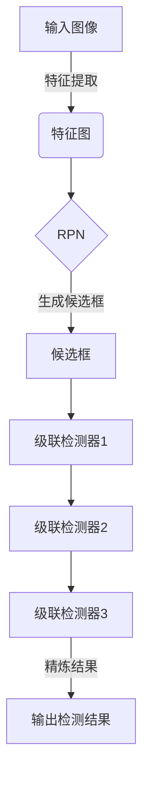

# Cascade R-CNN原理与代码实例讲解

## 1. 背景介绍

### 1.1 问题的由来

在计算机视觉领域中,目标检测是一项极具挑战性的任务。它旨在定位图像中的目标对象,并对其进行分类。传统的目标检测算法通常采用滑动窗口或区域候选框的方式生成大量候选区域,然后对每个候选区域进行分类,判断是否包含目标对象。但这种方法存在一些明显的缺陷:

1. 计算效率低下:需要对大量候选区域进行分类,计算量巨大。
2. 目标遗漏:由于候选区域生成策略的限制,可能会遗漏一些目标对象。
3. 分类质量不佳:对于一些复杂场景,传统分类器的性能往往不尽人意。

为了解决这些问题,需要一种新的目标检测算法,能够在保证检测精度的同时,提高计算效率。这就是Cascade R-CNN算法诞生的背景。

### 1.2 研究现状

目标检测算法的发展大致可以分为以下几个阶段:

1. **传统算法阶段**:基于手工设计的特征提取和滑动窗口方法,如Viola-Jones,DPM等。这些算法计算效率低下,检测精度有限。

2. **基于深度学习的两阶段算法**:R-CNN系列算法(R-CNN,Fast R-CNN,Faster R-CNN)将深度学习引入目标检测,取得了革命性的进展。这些算法将目标检测任务分为两个阶段:先生成候选区域,再对每个区域进行分类。

3. **基于深度学习的单阶段算法**:YOLO,SSD等算法将目标检测任务合并为一个回归问题,直接预测目标边界框和类别,计算效率更高。但精度往往略低于两阶段算法。

4. **Cascade结构算法**:Cascade R-CNN等算法在两阶段算法的基础上引入级联结构,提高了检测精度和计算效率。

Cascade R-CNN算法属于第四阶段,它在Faster R-CNN的基础上引入了级联结构,取得了很好的性能表现。

### 1.3 研究意义

Cascade R-CNN算法的提出对计算机视觉领域具有重要意义:

1. **精度与效率的平衡**:通过级联结构,Cascade R-CNN在保持较高检测精度的同时,大幅提高了计算效率。
2. **复杂场景应用**:级联结构使算法能够更好地处理复杂场景,如小目标、遮挡、密集排列等情况。
3. **算法创新**:Cascade R-CNN提出了一种新颖的级联思想,为目标检测算法的发展开辟了新的研究方向。

### 1.4 本文结构

本文将全面介绍Cascade R-CNN算法的原理、实现细节和代码实例,内容安排如下:

1. 背景介绍
2. 核心概念与联系
3. 核心算法原理与具体操作步骤
4. 数学模型和公式详细讲解与举例说明
5. 项目实践:代码实例和详细解释说明
6. 实际应用场景
7. 工具和资源推荐
8. 总结:未来发展趋势与挑战
9. 附录:常见问题与解答

## 2. 核心概念与联系

在介绍Cascade R-CNN算法之前,我们先了解一些核心概念:

1. **目标检测(Object Detection)**:在给定的图像或视频序列中,定位目标对象的位置,并确定其类别。

2. **区域候选框(Region Proposal)**:可能包含目标对象的矩形区域,作为目标检测的输入。

3. **anchors**:一种预先定义的参考框,用于生成区域候选框。

4. **特征金字塔(Feature Pyramid)**:多尺度特征层次结构,用于检测不同尺度的目标。

5. **Region Proposal Network(RPN)**:生成区域候选框的深度神经网络。

6. **RoI Pooling**:将不同大小的区域候选框映射到固定大小的特征图,用于后续分类和回归。

7. **级联(Cascade)**:一种分阶段、逐步精炼的结构,用于提高检测精度和计算效率。

Cascade R-CNN算法主要涉及以下几个核心模块:

- **Region Proposal Network(RPN)**:生成区域候选框。
- **级联检测头(Cascade Detection Head)**:包含多个级联的检测器,逐步精炼候选框和分类结果。
- **特征金字塔(Feature Pyramid)**:提取多尺度特征,用于检测不同大小的目标。

这些模块协同工作,构成了Cascade R-CNN算法的整体架构。接下来,我们将详细介绍算法的原理和实现细节。

## 3. 核心算法原理与具体操作步骤

### 3.1 算法原理概述

Cascade R-CNN算法的核心思想是在Faster R-CNN的基础上引入级联结构,逐步精炼目标检测的结果。它的工作流程如下:

1. **生成区域候选框**:使用Region Proposal Network(RPN)从图像特征图中生成一组区域候选框。

2. **级联检测**:将候选框输入到级联检测头,经过多个级联的检测器处理,逐步精炼候选框和分类结果。每个级联检测器都会重新评估和调整前一级的输出,舍弃质量较差的候选框,保留质量较高的候选框进入下一级。

3. **预测输出**:最后一级检测器输出最终的目标检测结果,包括精炼后的目标边界框和类别预测。

通过这种级联的方式,Cascade R-CNN算法能够逐步提高检测精度,同时舍弃大量低质量的候选框,从而提高计算效率。

### 3.2 算法步骤详解

Cascade R-CNN算法的具体步骤如下:

1. **特征提取**:使用卷积神经网络(如ResNet、VGG等)从输入图像中提取特征图。

2. **生成区域候选框**:
   - 在特征图上使用anchors生成大量的初始候选框。
   - 将这些候选框输入到RPN网络,进行二分类(是否包含目标)和回归(调整边界框)。
   - 根据分数和非极大值抑制(NMS)策略,筛选出一组高质量的候选框。

3. **级联检测**:
   - 将候选框输入到第一级检测器,进行分类和边界框回归。
   - 根据置信度阈值和NMS,筛选出质量较高的候选框,输入到下一级检测器。
   - 在后续级联检测器中,重复上述过程,逐步精炼候选框和分类结果。
   - 最后一级检测器输出最终的检测结果。

4. **特征金字塔**:
   - 为了检测不同尺度的目标,Cascade R-CNN使用特征金字塔结构。
   - 在不同级别的特征图上生成anchors,并分别经过RPN和级联检测头处理。
   - 最终将所有级别的检测结果合并,得到最终输出。

### 3.3 算法优缺点

**优点**:

1. **高精度**:通过级联结构,Cascade R-CNN能够逐步提高检测精度,在复杂场景下表现出色。

2. **高效计算**:级联结构能够快速舍弃大量低质量的候选框,降低了计算量。

3. **鲁棒性强**:对于小目标、遮挡、密集排列等困难情况,Cascade R-CNN表现出较强的鲁棒性。

4. **易于优化**:级联结构使得算法易于调整和优化,可以根据需求调整级联器的数量和参数。

**缺点**:

1. **训练复杂**:由于引入了级联结构,Cascade R-CNN的训练过程相对复杂,需要对每个级联器进行单独训练。

2. **内存消耗大**:级联结构和特征金字塔结构会增加内存消耗,对硬件要求较高。

3. **速度略慢**:相比于单阶段算法,Cascade R-CNN的推理速度略慢,但仍在可接受范围内。

4. **超参数较多**:算法涉及较多超参数,如级联器数量、阈值设置等,需要进行大量调参工作。

### 3.4 算法应用领域

Cascade R-CNN算法由于其高精度和鲁棒性,在以下领域有广泛的应用:

1. **目标检测**:作为通用目标检测算法,可应用于各种场景,如安防监控、无人驾驶、机器人视觉等。

2. **实例分割**:通过将Cascade R-CNN与实例分割模型(如Mask R-CNN)结合,可用于实例分割任务。

3. **小目标检测**:由于对小目标的检测能力较强,可应用于航空遥感、医学影像等领域的小目标检测。

4. **密集目标检测**:在存在大量密集排列目标的场景(如人群计数、细胞计数等),Cascade R-CNN表现出色。

5. **遮挡目标检测**:对于存在遮挡的目标,Cascade R-CNN也具有一定的检测能力,可应用于视频监控等场景。

总的来说,Cascade R-CNN算法是一种通用、高性能的目标检测算法,在计算机视觉的多个领域都有广泛的应用前景。

## 4. 数学模型和公式详细讲解与举例说明

### 4.1 数学模型构建

Cascade R-CNN算法的数学模型主要包括以下几个部分:

1. **Region Proposal Network (RPN)**
2. **级联检测头**
3. **分类和回归损失函数**

#### 4.1.1 Region Proposal Network (RPN)

RPN是Faster R-CNN中提出的一种生成区域候选框的网络结构。它的数学模型如下:

对于每个滑动窗口位置,RPN会生成 $k$ 个anchors(预定义的参考框),每个anchor都会输出 $2k$ 个分数,分别对应于前景和背景的 $k$ 个分数。同时,RPN还会为每个anchor输出 $4k$ 个坐标值,用于调整anchor的位置和大小。

设输入特征图的大小为 $(W, H)$,滑动窗口的步长为 $s$,则RPN输出的分数图和回归图的大小分别为:

$$
\begin{aligned}
\text{分数图大小} &= \left(\frac{W}{s}, \frac{H}{s}, 2k\right) \
\text{回归图大小} &= \left(\frac{W}{s}, \frac{H}{s}, 4k\right)
\end{aligned}
$$

通过对分数图进行softmax操作和对回归图进行边界框解码,我们可以获得一组候选框及其对应的前景分数。

#### 4.1.2 级联检测头

级联检测头是Cascade R-CNN算法的核心部分,它由多个级联的检测器组成。每个检测器都会对前一级的输出进行精炼,包括:

1. **分类**:对候选框进行二分类(前景或背景),获得更准确的分类分数。
2. **回归**:对候选框的位置和大小进行调整,获得更精确的边界框。

设第 $t$ 级检测器的输入为 $N_t$ 个候选框,输出为 $N_{t+1}$ 个精炼后的候选框。每个候选框都会获得一个分类分数 $p_i^{(t)}$ 和一组回归系数 $\boldsymbol{r}_i^{(t)}$,用于调整边界框位置和大小。

通过设置置信度阈值 $\theta_t$ 和非极大值抑制(NMS),我们可以从第 $t$ 级检测器的输出中筛选出 $N_{t+1}$ 个高质量的候选框,作为下一级检测器的输入。

#### 4.1.3 分类和回归损失函数

Cascade R-CNN算法的训练目标是最小化分类和回归的综合损失函数。对于第 $t$ 级检测器,其损失函数可表示为:

$$
L^{(t)}(\boldsymbol{p}^{(t)}, \boldsymbol{r}^{(t)}) = \frac