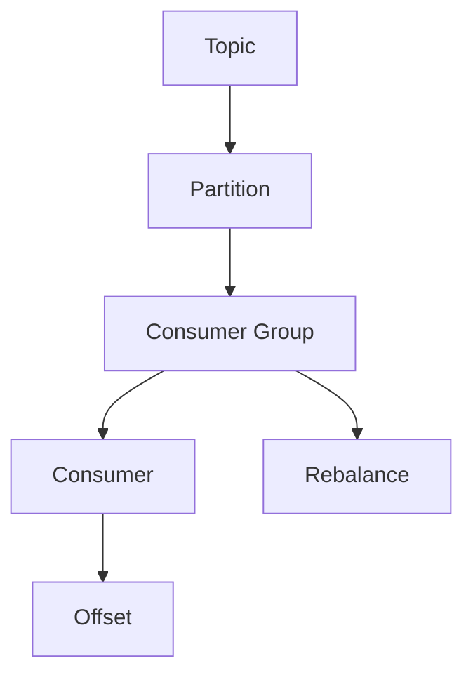

# Kafka Consumer原理与代码实例讲解

## 1. 背景介绍

### 1.1 问题的由来

在现代分布式系统中，数据流的实时处理和消费是一个关键挑战。传统的消息队列系统往往难以满足大规模、高吞吐量和低延迟的需求。Apache Kafka作为一个分布式流处理平台,被广泛应用于各种场景,如日志收集、数据管道、流处理等。Kafka Consumer作为Kafka的核心组件之一,负责从Kafka集群中消费数据,是整个数据处理流程中不可或缺的一环。

### 1.2 研究现状

Kafka Consumer的设计和实现一直是研究热点。早期的Consumer实现较为简单,主要关注于从Broker拉取数据的基本功能。随着Kafka的不断发展,Consumer也逐步演进,引入了更多高级特性,如分区分配策略、消费位移(Offset)管理、消费者组(Consumer Group)等概念。此外,Kafka Streams等流处理API的出现,也对Consumer提出了更高的要求。

### 1.3 研究意义

深入理解Kafka Consumer的原理和实现,对于高效利用Kafka进行数据处理至关重要。本文将全面剖析Kafka Consumer的设计思路、核心算法和实现细节,旨在帮助读者掌握Kafka Consumer的工作机制,提高开发和运维效率。同时,本文还将介绍Kafka Consumer的最佳实践和常见问题解答,为读者在实际项目中使用Kafka Consumer提供指导。

### 1.4 本文结构

本文将从以下几个方面全面解析Kafka Consumer:

1. 核心概念与联系
2. 核心算法原理与具体操作步骤
3. 数学模型和公式详细讲解与案例分析
4. 项目实践:代码实例和详细解释说明
5. 实际应用场景
6. 工具和资源推荐
7. 总结:未来发展趋势与挑战
8. 附录:常见问题与解答

## 2. 核心概念与联系

在深入探讨Kafka Consumer的原理之前,我们需要先了解一些核心概念及它们之间的关系。

### 2.1 消费者(Consumer)

消费者是从Kafka集群中读取数据的客户端应用程序。一个消费者通常属于一个特定的消费者组(Consumer Group),并且只能消费订阅的主题(Topic)中的数据。

### 2.2 消费者组(Consumer Group)

消费者组是Kafka提供的一种抽象,用于实现负载均衡和容错。属于同一个消费者组的消费者实例,会自动地对订阅主题的分区进行重新分配,每个分区只会被组内的一个消费者实例消费。

### 2.3 分区(Partition)

Kafka中的每个主题都被分割为一个或多个分区。分区是Kafka实现水平扩展和并行处理的关键,也是实现消费者组内的负载均衡的基础。

### 2.4 消费位移(Offset)

消费位移是Kafka中用于记录消费者在每个分区中的消费位置的概念。Kafka能够自动为每个消费者组维护消费位移,以便在重启或失败后能够继续从上次的位置开始消费。

### 2.5 消费者重平衡(Rebalance)

当消费者组内的消费者实例数量发生变化时(如新增或离开消费者实例),Kafka会自动触发重平衡过程,重新为组内的所有消费者实例分配订阅主题的分区。

### 2.6 核心概念关系

上述核心概念之间的关系如下所示:

- 一个Topic被划分为多个Partition
- 一个Consumer Group中可以包含多个Consumer
- 每个Consumer都会被分配到一个或多个Partition
- 每个Consumer都会为自己消费的Partition维护一个Offset
- 当Consumer Group内的Consumer数量发生变化时,会触发Rebalance过程

## 3. 核心算法原理与具体操作步骤

### 3.1 算法原理概述

Kafka Consumer的核心算法主要包括以下几个方面:

1. **分区分配算法**: 用于在消费者组内分配订阅主题的分区给各个消费者实例,实现负载均衡。
2. **消费位移管理算法**: 用于跟踪和维护每个消费者实例在各个分区中的消费位移。
3. **消费者重平衡算法**: 用于在消费者组内的消费者实例数量发生变化时,重新分配分区给各个消费者实例。

这些算法共同构成了Kafka Consumer的核心功能,确保了数据能够被高效、可靠地消费。

### 3.2 算法步骤详解

#### 3.2.1 分区分配算法

Kafka采用了一种称为"Range Partitioning Strategy"的分区分配策略,具体步骤如下:

1. 对订阅主题的所有分区进行排序。
2. 计算每个消费者实例应该分配到的分区数量(`numPartitionsPerConsumer`)。
3. 为每个消费者实例分配一个连续的分区范围,确保分区均匀分布。

该算法的优点是简单高效,能够较好地实现负载均衡。但是,当消费者实例数量发生变化时,可能会导致大量的分区被重新分配,引起较大的开销。

#### 3.2.2 消费位移管理算法

Kafka提供了两种消费位移存储方式:

1. **基于Zookeeper**: 早期版本中,Kafka将消费位移存储在Zookeeper中。这种方式简单但存在单点故障风险。
2. **基于Kafka内部主题**: 后来的版本中,Kafka引入了一种新的方式,将消费位移存储在一个内部的压缩主题(`__consumer_offsets`)中。这种方式更加可靠和高效。

无论采用哪种方式,Kafka都会定期将消费位移数据刷新到存储中,以确保消费位移的持久化。

#### 3.2.3 消费者重平衡算法

当消费者组内的消费者实例数量发生变化时,Kafka会自动触发重平衡过程,具体步骤如下:

1. 检测到消费者实例数量变化。
2. 一个消费者实例被选举为"领导者"(Leader),负责执行重平衡。
3. 领导者根据分区分配算法,重新计算分区分配方案。
4. 领导者将新的分区分配方案发送给所有消费者实例。
5. 消费者实例根据新的分区分配方案,重新分配分区。

在重平衡过程中,为了避免数据重复消费或丢失,Kafka采用了一些策略,如"停止读取旧分区,再订阅新分区"等。

### 3.3 算法优缺点

Kafka Consumer的核心算法具有以下优点:

- 分区分配算法简单高效,能够较好地实现负载均衡。
- 消费位移管理算法可靠,确保了消费位移的持久化。
- 消费者重平衡算法自动化,降低了手动操作的复杂性。

但同时也存在一些缺点:

- 分区分配算法在消费者实例数量变化时,可能会导致大量分区被重新分配,引起较大的开销。
- 消费位移存储在Zookeeper中存在单点故障风险(早期版本)。
- 消费者重平衡过程中,可能会导致短暂的数据重复消费或丢失。

### 3.4 算法应用领域

Kafka Consumer的核心算法不仅应用于Kafka自身,也被广泛应用于其他分布式系统中,如:

- 分布式流处理系统(如Apache Flink、Apache Spark Streaming等)
- 分布式数据库系统(如Apache Cassandra、Apache HBase等)
- 分布式缓存系统(如Redis Cluster等)

这些系统都需要对数据进行分区,并在多个节点之间进行负载均衡和容错,因此Kafka Consumer的核心算法为它们提供了有价值的参考和借鉴。

## 4. 数学模型和公式详细讲解与举例说明

在分析Kafka Consumer的核心算法时,我们需要借助一些数学模型和公式来更好地理解和表述算法的原理。

### 4.1 数学模型构建

#### 4.1.1 分区分配模型

假设我们有一个主题`T`,包含`n`个分区`P = {p_1, p_2, ..., p_n}`。该主题被订阅到一个消费者组`G`,组内有`m`个消费者实例`C = {c_1, c_2, ..., c_m}`。我们需要将这`n`个分区分配给`m`个消费者实例,使得每个消费者实例分配到的分区数量尽可能均匀。

我们可以将这个问题建模为一个**整数划分问题**,目标是找到一种划分方式,使得每个消费者实例分配到的分区数量尽可能接近`n/m`。

#### 4.1.2 消费位移模型

对于每个消费者实例`c_i`和它分配到的每个分区`p_j`,我们用`offset(c_i, p_j)`表示`c_i`在`p_j`中的消费位移。我们需要一种机制来持久化和管理这些消费位移,以便在消费者实例重启或失败后能够继续从上次的位置开始消费。

我们可以将这个问题建模为一个**键值存储问题**,其中键为`(c_i, p_j)`的组合,值为对应的`offset(c_i, p_j)`。我们需要一种高效、可靠的存储方式来管理这些键值对。

### 4.2 公式推导过程

#### 4.2.1 分区分配公式

假设我们采用Kafka的"Range Partitioning Strategy"算法,则分区分配过程可以用以下公式表示:

$$
\begin{align*}
numPartitionsPerConsumer &= \left\lceil \frac{n}{m} \right\rceil \
startPartition(c_i) &= (i - 1) \times numPartitionsPerConsumer \
endPartition(c_i) &= \min\left(startPartition(c_i) + numPartitionsPerConsumer - 1, n - 1\right) \
partitions(c_i) &= \left\{p_j \mid startPartition(c_i) \leq j \leq endPartition(c_i)\right\}
\end{align*}
$$

其中:

- `numPartitionsPerConsumer`表示每个消费者实例应该分配到的分区数量。
- `startPartition(c_i)`和`endPartition(c_i)`分别表示消费者实例`c_i`分配到的第一个和最后一个分区的索引。
- `partitions(c_i)`表示分配给消费者实例`c_i`的分区集合。

#### 4.2.2 消费位移存储公式

假设我们将消费位移存储在一个压缩的Kafka内部主题`__consumer_offsets`中,则消费位移的键值对可以用以下公式表示:

$$
\begin{align*}
key &= \text{encode}(groupId, topic, partition) \
value &= \text{encode}(offset, metadata, timestamp)
\end{align*}
$$

其中:

- `key`是一个由消费者组ID、主题名称和分区ID组成的复合键。
- `value`包含了消费位移、元数据和时间戳信息。
- `encode`是一种序列化函数,用于将数据编码为字节流。

通过这种方式,Kafka可以高效地存储和查询消费位移数据。

### 4.3 案例分析与讲解

为了更好地理解上述数学模型和公式,我们来分析一个具体的案例。

假设我们有一个主题`T`,包含6个分区`P = {p_0, p_1, p_2, p_3, p_4, p_5}`。该主题被订阅到一个消费者组`G`,组内有3个消费者实例`C = {c_1, c_2, c_3}`。

#### 4.3.1 分区分配分析

根据分区分配公式,我们可以计算出:

- `numPartitionsPerConsumer = 6 / 3 = 2`
- `startPartition(c_1) = 0, endPartition(c_1) = 1, partitions(c_1) = {p_0, p_1}`
- `startPartition(c_2) = 2, endPartition(c_2) = 3, partitions(c_2) = {p_2, p_3}`
- `startPartition(c_3) = 4, endPartition(c_3) = 5, partitions(c_3) = {p_4, p_5}`

因此,分区`p_0`和`p_1`被分配给`c_1`、分区`p_2`和`p_3`被分配给`c_2`、分区`p_4