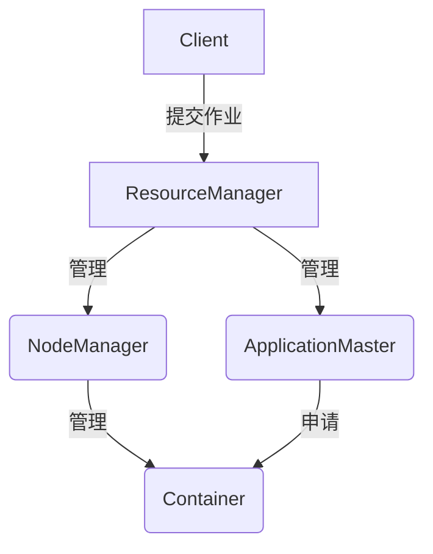
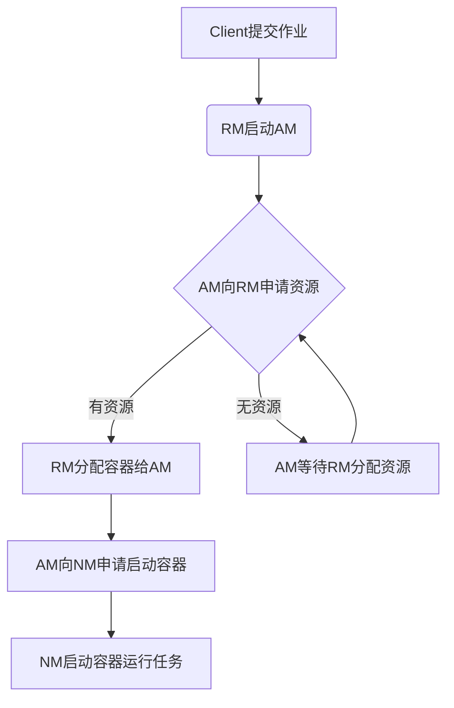

# Yarn 原理与代码实例讲解

## 1. 背景介绍

### 1.1 问题的由来

在大数据时代,分布式计算框架的需求日益增长。Apache Hadoop作为开源的分布式系统基础架构,支持在廉价的计算机集群上运行大规模数据的分布式应用程序。然而,Hadoop MapReduce计算模型存在一些缺陷,如只能支持批处理作业、延迟高、不支持循环等,这使得其在一些实时计算场景下难以满足需求。

为了解决这些问题,Apache Hadoop社区推出了全新的资源管理和调度系统Yarn(Yet Another Resource Negotiator),旨在构建一个通用的数据处理平台,支持多种编程模型和数据处理引擎,如批处理、交互式查询、实时流处理等。Yarn的出现,使得Hadoop从单一的MapReduce计算模型,演变为一个更加通用、灵活的大数据处理平台。

### 1.2 研究现状

Yarn自2012年发布以来,已经成为Apache Hadoop生态系统中最重要的组件之一,得到了广泛的应用和研究。目前,Yarn已经被许多知名公司和组织采用,如Yahoo、微软、Uber等,并且在学术界也有大量的研究工作。

然而,随着大数据应用场景的不断扩展,对Yarn的性能、可扩展性、安全性等方面也提出了更高的要求。研究人员一直在努力改进Yarn的调度算法、资源隔离机制、容错能力等,以满足不同场景的需求。

### 1.3 研究意义

深入理解Yarn的原理和实现机制,对于构建高效、可靠的大数据处理平台至关重要。本文将全面介绍Yarn的核心概念、架构设计、算法原理等,并通过代码实例进行详细讲解,帮助读者掌握Yarn的工作机制和应用开发。

此外,本文还将探讨Yarn在实际应用中的场景,以及未来的发展趋势和挑战,为读者提供全面的理解和指导。

### 1.4 本文结构

本文共分为9个部分:

1. 背景介绍
2. 核心概念与联系
3. 核心算法原理与具体操作步骤
4. 数学模型和公式详细讲解与举例说明
5. 项目实践:代码实例和详细解释说明
6. 实际应用场景
7. 工具和资源推荐
8. 总结:未来发展趋势与挑战
9. 附录:常见问题与解答

## 2. 核心概念与联系

在深入探讨Yarn的原理之前,我们先来了解一些核心概念及它们之间的联系。

- **ResourceManager(RM)**: Yarn集群的主节点,负责整个集群的资源管理和调度。
- **NodeManager(NM)**: 运行在每个节点上,负责管理该节点上的资源和容器(Container)。
- **ApplicationMaster(AM)**: 每个应用程序的"大脑",负责向RM申请资源,并监控应用的执行。
- **Container**: 资源抽象的单位,封装了CPU、内存等多种资源。
- **Client**: 客户端,用于向Yarn集群提交应用程序。

上图展示了这些核心组件之间的关系。Client将应用提交给RM,RM分配容器资源并启动AM。AM向RM申请容器资源,并与NM交互,在容器中运行任务。整个过程由RM进行协调和管理。

## 3. 核心算法原理与具体操作步骤

### 3.1 算法原理概述

Yarn的核心是资源管理和调度算法,用于高效地将集群资源分配给不同的应用程序。主要包括以下几个方面:

1. **资源模型**: Yarn采用了统一的资源模型,将CPU、内存等资源进行抽象,使用容器(Container)作为资源分配和任务运行的单位。

2. **资源请求**: 应用程序通过AM向RM请求容器资源,描述所需CPU、内存等资源量。

3. **容量调度器**: RM中的容量调度器(Capacity Scheduler)根据队列的资源配置,将资源公平分配给不同的应用程序。

4. **延迟调度**: 当某个节点资源紧张时,延迟调度器(Delay Scheduler)会将任务延迟调度到其他节点,以提高集群资源利用率。

5. **容错机制**: Yarn采用了多种容错机制,如AM重启、工作重试等,提高系统的可靠性。

### 3.2 算法步骤详解

Yarn的资源管理和调度过程可以概括为以下几个步骤:

1. **Client提交作业**: 客户端向Yarn集群提交应用程序。

2. **RM启动AM**: RM为应用程序启动一个AM实例。

3. **AM向RM申请资源**: AM根据应用程序的需求,向RM申请容器资源。

4. **RM分配容器给AM**: 如果有足够的资源,RM将分配容器给AM。

5. **AM向NM申请启动容器**: AM与NM交互,在获得的容器中启动任务。

6. **NM启动容器运行任务**: NM在本节点上启动容器,运行任务。

7. **AM等待RM分配资源**: 如果资源不足,AM需要等待RM分配资源。

整个过程是一个动态的循环,AM会根据任务进度持续向RM申请资源,直到应用程序完成。

### 3.3 算法优缺点

Yarn的资源管理和调度算法具有以下优点:

- **资源统一抽象**: 将CPU、内存等资源进行统一抽象,使得调度更加灵活。
- **支持多种工作负载**: 支持批处理、交互式查询、实时流处理等多种工作负载。
- **资源隔离和公平调度**: 通过容量调度器实现资源隔离和公平调度。
- **高可靠性**: 采用多种容错机制,提高系统的可靠性。

但也存在一些缺点和局限性:

- **中心化设计**: RM是单点故障,存在可靠性风险。
- **延迟较高**: 资源申请和分配过程会引入一定延迟。
- **调度策略有限**: 内置的调度器策略可能无法满足所有场景。

### 3.4 算法应用领域

Yarn的资源管理和调度算法可以应用于以下领域:

- **大数据处理**: 支持Hadoop生态系统中的各种大数据处理引擎,如Spark、Flink等。
- **机器学习**: 可用于分布式机器学习任务的资源管理和调度。
- **云计算**: 作为云计算平台的资源管理和调度框架。
- **科学计算**: 支持高性能计算(HPC)任务的资源管理和调度。

## 4. 数学模型和公式详细讲解与举例说明

### 4.1 数学模型构建

为了更好地理解和优化Yarn的资源管理和调度算法,我们可以构建数学模型对其进行描述和分析。

假设集群中有$N$个节点,每个节点$i$的资源为$R_i = (CPU_i, Memory_i)$,其中$CPU_i$表示CPU核数,$Memory_i$表示内存大小。

有$M$个应用程序$J_1, J_2, \cdots, J_M$,每个应用程序$J_j$的资源需求为$D_j = (CPU_j, Memory_j)$。

我们的目标是找到一种资源分配方案$X$,使得所有应用程序的资源需求都得到满足,并最大化集群资源利用率。可以将这个问题建模为一个整数线性规划问题:

$$
\begin{aligned}
\max \quad & \sum_{i=1}^{N} \sum_{j=1}^{M} x_{ij} \
\text{s.t.} \quad & \sum_{i=1}^{N} x_{ij} CPU_i \geq CPU_j, \quad \forall j \
& \sum_{i=1}^{N} x_{ij} Memory_i \geq Memory_j, \quad \forall j \
& \sum_{j=1}^{M} x_{ij} \leq 1, \quad \forall i \
& x_{ij} \in \{0, 1\}, \quad \forall i, j
\end{aligned}
$$

其中,$x_{ij}$表示是否将应用程序$J_j$分配到节点$i$上,目标函数是最大化分配的容器数量。约束条件分别表示:

1. 每个应用程序的CPU需求都必须得到满足。
2. 每个应用程序的内存需求都必须得到满足。
3. 每个节点最多只能分配给一个应用程序。
4. $x_{ij}$是0-1变量,表示分配或不分配。

这个整数线性规划问题是NP难的,我们可以采用启发式算法或者其他优化技术来求解。

### 4.2 公式推导过程

在实际场景中,我们还需要考虑资源公平性。Yarn采用了一种称为"容量调度器"(Capacity Scheduler)的算法来实现资源的公平分配。

假设集群中有$K$个队列$Q_1, Q_2, \cdots, Q_K$,每个队列$Q_k$被分配了一定的资源配额$C_k$,满足$\sum_{k=1}^{K} C_k = 1$。

我们定义队列$Q_k$的资源利用率为:

$$
U_k = \frac{\sum_{i=1}^{N} \sum_{j \in Q_k} x_{ij} R_i}{\sum_{i=1}^{N} C_k R_i}
$$

其中,分子表示队列$Q_k$实际使用的资源量,分母表示队列$Q_k$被分配的资源量。

为了实现资源的公平分配,我们希望所有队列的资源利用率都接近1,即:

$$
\min \max_{1 \leq k \leq K} \left| 1 - U_k \right|
$$

将这个目标函数加入到之前的整数线性规划问题中,我们就可以得到一个综合了资源利用率最大化和公平分配的优化模型。

### 4.3 案例分析与讲解

现在,我们来看一个具体的案例,分析Yarn的资源管理和调度策略。

假设我们有一个4节点的Yarn集群,每个节点的资源如下:

- Node1: 8 CPU, 32GB Memory
- Node2: 4 CPU, 16GB Memory
- Node3: 4 CPU, 16GB Memory
- Node4: 2 CPU, 8GB Memory

现在有3个应用程序提交到集群:

- Job1: 需求 4 CPU, 8GB Memory
- Job2: 需求 2 CPU, 4GB Memory
- Job3: 需求 6 CPU, 16GB Memory

我们将这3个应用程序分别提交到3个不同的队列Queue1、Queue2和Queue3,资源配额分别为40%、30%和30%。

根据Yarn的容量调度器算法,资源将按如下方式分配:

1. Job1被分配到Node1,使用4 CPU和8GB Memory。
2. Job2被分配到Node2,使用2 CPU和4GB Memory。
3. Job3无法完全分配,因为没有节点同时满足6 CPU和16GB Memory的需求。它将被部分分配:
   - 2 CPU, 8GB Memory 分配到Node4
   - 4 CPU, 8GB Memory 分配到Node3

通过这种分配方式,三个队列的资源利用率分别为:

- Queue1: $U_1 = \frac{4 \times 8 + 4 \times 32}{0.4 \times (8 \times 8 + 4 \times 16 + 4 \times 16 + 2 \times 8)} = 1$
- Queue2: $U_2 = \frac{2 \times 4 + 2 \times 16}{0.3 \times (8 \times 8 + 4 \times 16 + 4 \times 16 + 2 \times 8)} = 1$
- Queue3: $U_3 = \frac{2 \times 2 + 2 \times 8 + 4 \times 4 + 4 \times 16}{0.3 \times (8 \times 8 + 4 \times 16 + 4 \times 16