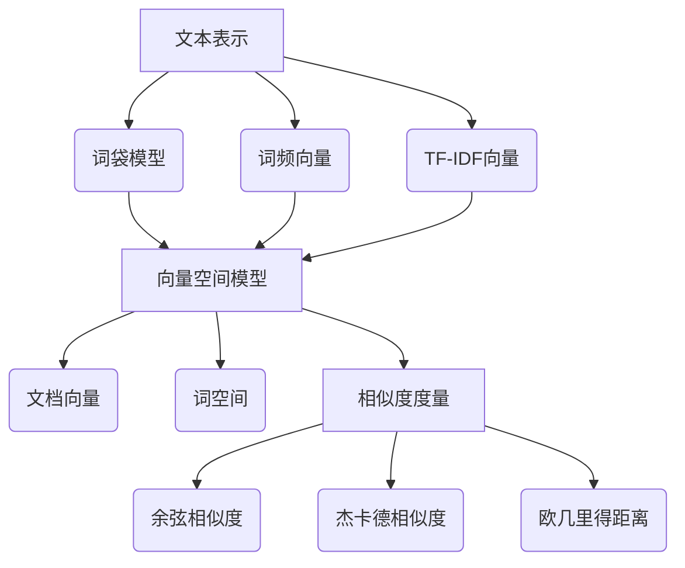

# 用词袋模型计算文本相似度

## 1. 背景介绍

### 1.1 问题的由来

在自然语言处理和信息检索领域中,计算文本相似度是一个非常重要的任务。文本相似度计算广泛应用于文本聚类、重复检测、信息检索、问答系统等多个领域。随着互联网上海量文本数据的快速增长,如何高效、准确地计算文本相似度成为一个亟待解决的问题。

### 1.2 研究现状

目前,常用的文本相似度计算方法主要有:

1. **基于字符串匹配的方法**: 如编辑距离(Edit Distance)、最长公共子串(Longest Common Substring)等,这类方法通常用于检测短文本的相似性,对长文本效果不佳。

2. **基于语义的方法**: 如词向量(Word Embedding)、主题模型(Topic Model)等,这类方法考虑了词语的语义信息,能够较好地计算长文本的相似度,但计算复杂度较高。

3. **基于词袋模型的方法**: 将文本表示为词频向量,然后计算向量之间的相似度,如余弦相似度(Cosine Similarity)、杰卡德相似度(Jaccard Similarity)等。这类方法简单高效,是目前应用最广泛的文本相似度计算方法之一。

### 1.3 研究意义

词袋模型(Bag-of-Words Model)是自然语言处理中一种经典的文本表示方法,它将文本看作是一个无序的词集合,忽略了词与词之间的顺序和语法结构信息。尽管简单,但词袋模型能够较好地捕捉文本的主题信息,并且具有计算高效、实现简单等优点,因此广泛应用于文本分类、聚类、相似度计算等任务中。

本文将重点介绍如何基于词袋模型,利用向量空间模型(Vector Space Model)和相似度度量方法(Similarity Measures)来计算文本相似度,并对相关核心概念、算法原理、数学模型、代码实现等进行深入探讨,旨在为读者提供一个全面的理解和实践指南。

### 1.4 本文结构

本文共分为9个部分:

1. 背景介绍
2. 核心概念与联系
3. 核心算法原理与具体操作步骤
4. 数学模型和公式详细讲解与举例说明
5. 项目实践:代码实例和详细解释说明
6. 实际应用场景
7. 工具和资源推荐
8. 总结:未来发展趋势与挑战
9. 附录:常见问题与解答

## 2. 核心概念与联系

在介绍词袋模型计算文本相似度的核心算法之前,我们先来了解一下相关的核心概念:

1. **文本表示(Text Representation)**
   - 词袋模型(Bag-of-Words Model)
   - 词频向量(Term Frequency Vector)
   - TF-IDF向量(Term Frequency-Inverse Document Frequency Vector)

2. **向量空间模型(Vector Space Model)**
   - 文档向量(Document Vector)
   - 词空间(Term Space)

3. **相似度度量(Similarity Measures)**
   - 余弦相似度(Cosine Similarity)
   - 杰卡德相似度(Jaccard Similarity)
   - 欧几里得距离(Euclidean Distance)

这些概念相互关联、环环相扣,构成了计算文本相似度的整体理论框架。下面我们将逐一对它们进行详细阐述。

## 3. 核心算法原理与具体操作步骤

### 3.1 算法原理概述

基于词袋模型计算文本相似度的核心思想是:

1. 将文本映射为词频向量或TF-IDF向量
2. 将向量归一化到单位向量空间
3. 计算向量之间的相似度作为文本相似度的度量

整个过程可以概括为以下3个主要步骤:

1. **文本预处理**
   - 分词
   - 去除停用词
   - 词形还原(可选)

2. **生成文档向量**
   - 构建词袋模型词典
   - 计算词频或TF-IDF权重
   - 生成归一化的文档向量

3. **计算文本相似度**
   - 选择相似度度量方法(如余弦相似度)
   - 计算文档向量之间的相似度得分

### 3.2 算法步骤详解

1. **文本预处理**

   - **分词**: 将文本按照某种策略分割成词语序列,通常使用规则或统计模型方法。
   - **去除停用词**: 去掉语气词、虚词等对文本主题无关的高频词。
   - **词形还原(可选)**: 将单词简化为基本形式,如时态转换、复数转换等,以减少数据的稀疏性。

2. **生成文档向量**

   - **构建词袋模型词典**: 统计预料中所有出现的词,构建一个词袋模型词典(vocabulary)。
   - **计算词频或TF-IDF权重**:
     - 词频(Term Frequency, TF): 对于每个文档,统计每个词在该文档中出现的频率。
     - TF-IDF: 在词频的基础上,加入逆向文档频率(Inverse Document Frequency, IDF)作为修正,降低常见词的权重,提高低频词的权重。
   - **生成归一化的文档向量**: 将词频或TF-IDF值生成的向量归一化到单位向量空间。

3. **计算文本相似度**

   - **选择相似度度量方法**: 常用的有余弦相似度、杰卡德相似度、欧几里得距离等。
   - **计算文档向量之间的相似度得分**: 利用所选的相似度度量方法,计算两个文档向量之间的相似度分数。

### 3.3 算法优缺点

**优点**:

1. **简单高效**: 词袋模型非常简单,计算过程高效,能够快速处理大规模文本数据。
2. **直观易懂**: 将文本表示为词频向量,符合人类的直觉,易于理解和解释。
3. **无需语料训练**: 与基于深度学习的方法不同,词袋模型不需要大规模语料进行预训练。

**缺点**:

1. **丢失语序信息**: 将文本视为词的袋子,忽略了词与词之间的位置和语法信息。
2. **词义不明确**: 无法有效区分词语的不同义项,容易产生语义歧义。
3. **数据稀疏**: 在大规模语料上,词袋向量往往非常高维且稀疏,影响计算效率。

### 3.4 算法应用领域

基于词袋模型的文本相似度计算方法广泛应用于以下领域:

- **文本聚类**: 根据文本的相似度对文档进行聚类分组。
- **重复检测**: 检测语料库中是否存在高度相似的重复文本。
- **信息检索**: 根据查询与文档的相似度对搜索结果进行排序。
- **新闻分类**: 将新闻文本按主题进行自动分类。
- **垃圾邮件过滤**: 检测垃圾邮件与正常邮件的相似度,进行内容过滤。
- **文本去重**: 对语料库进行文本去重,保留代表性文本。
- **自动文摘**: 选取与主题最相关的句子作为文本摘要。

## 4. 数学模型和公式详细讲解与举例说明

### 4.1 数学模型构建

为了形式化描述词袋模型和文本相似度计算过程,我们首先需要构建数学模型。假设语料库中共有 $m$ 个文档,词典中共有 $n$ 个不同的词,则:

- 文档 $d_i$ 可以表示为一个 $n$ 维的向量 $\vec{v_i}$,其中第 $j$ 个元素 $v_{ij}$ 表示词 $t_j$ 在文档 $d_i$ 中的权重(词频或TF-IDF值)。
- 文档向量 $\vec{v_i}$ 的长度为 $\sqrt{\sum_{j=1}^{n}v_{ij}^2}$。
- 为了消除文档长度的影响,我们通常将文档向量归一化为单位向量,即令 $\vec{u_i} = \frac{\vec{v_i}}{\|\vec{v_i}\|}$,则 $\|\vec{u_i}\| = 1$。

于是,语料库中所有文档可以表示为一个 $m \times n$ 的文档向量矩阵:

$$
D =
\begin{bmatrix}
\vec{u_1}\
\vec{u_2}\
\vdots\
\vec{u_m}
\end{bmatrix}
=
\begin{bmatrix}
u_{11} & u_{12} & \cdots & u_{1n}\
u_{21} & u_{22} & \cdots & u_{2n}\
\vdots & \vdots & \ddots & \vdots\
u_{m1} & u_{m2} & \cdots & u_{mn}
\end{bmatrix}
$$

其中每一行向量 $\vec{u_i}$ 表示一个文档在词空间中的坐标。

### 4.2 公式推导过程

**余弦相似度(Cosine Similarity)**

余弦相似度用于计算两个非零向量之间的夹角余弦值,其数值范围在 $[-1,1]$ 之间。对于两个文档向量 $\vec{u_i}$ 和 $\vec{u_j}$,它们的余弦相似度定义为:

$$
\text{sim}_\text{cos}(\vec{u_i}, \vec{u_j}) = \cos(\theta) = \frac{\vec{u_i} \cdot \vec{u_j}}{\|\vec{u_i}\| \|\vec{u_j}\|} = \frac{\sum_{k=1}^{n}u_{ik}u_{jk}}{\sqrt{\sum_{k=1}^{n}u_{ik}^2}\sqrt{\sum_{k=1}^{n}u_{jk}^2}}
$$

由于文档向量已经归一化为单位向量,所以公式可以简化为:

$$
\text{sim}_\text{cos}(\vec{u_i}, \vec{u_j}) = \vec{u_i} \cdot \vec{u_j} = \sum_{k=1}^{n}u_{ik}u_{jk}
$$

当两个向量完全相同时,夹角为 $0$,余弦相似度为 $1$;当两个向量完全相反时,夹角为 $\pi$,余弦相似度为 $-1$;当两个向量夹角为直角时,余弦相似度为 $0$。

**杰卡德相似度(Jaccard Similarity)**

杰卡德相似度用于计算两个集合的相似程度,定义为两个集合的交集与并集之比。对于两个文档向量 $\vec{u_i}$ 和 $\vec{u_j}$,它们的杰卡德相似度可以定义为:

$$
\text{sim}_\text{jac}(\vec{u_i}, \vec{u_j}) = \frac{\sum_{k=1}^{n}\min(u_{ik}, u_{jk})}{\sum_{k=1}^{n}\max(u_{ik}, u_{jk})}
$$

其中,分子 $\sum_{k=1}^{n}\min(u_{ik}, u_{jk})$ 表示两个向量对应元素的最小值之和,可看作是两个集合的交集;分母 $\sum_{k=1}^{n}\max(u_{ik}, u_{jk})$ 表示两个向量对应元素的最大值之和,可看作是两个集合的并集。

杰卡德相似度的取值范围在 $[0,1]$ 之间,当两个集合完全相同时,相似度为 $1$;当两个集合没有交集时,相似度为 $0$。

**欧几里得距离(Euclidean Distance)**

欧几里得距离用于计算两个向量在欧几里得空间中的距离,定义为:

$$
\text{dist}_\text{euc}(\vec{u_i}, \vec{u_j}) = \sqrt{\sum_{k=1}^{n}(u_{ik} - u_{jk})^2}
$$

欧几里得距离的取值范围为 $[0, +\infty)$,当两个向量完全相同时,距离为 $