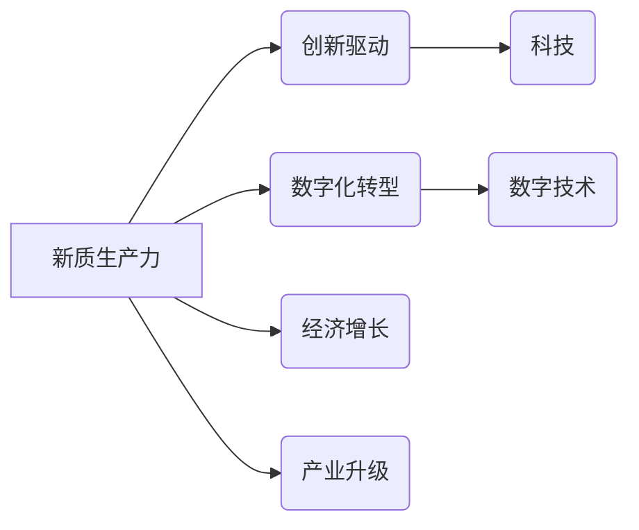

# 中国现代化的重要引擎：新质生产力

> 关键词：中国现代化，新质生产力，创新驱动，数字化转型，高质量发展，人工智能，智能制造，绿色发展

## 1. 背景介绍

进入21世纪，中国经济发展进入新常态，传统发展模式难以为继。面对全球经济一体化和新一轮科技革命的双重挑战，中国必须加快构建现代化经济体系，推动经济高质量发展。新质生产力作为推动经济高质量发展的核心动力，成为实现中国现代化的关键引擎。

### 1.1 问题的由来

长期以来，中国经济发展主要依靠要素驱动和投资驱动，资源环境约束趋紧，人力资本红利逐渐减弱。传统发展模式导致经济发展不平衡、不充分的问题日益突出，创新驱动发展不足，产业结构偏重，环境污染严重，制约了中国经济可持续发展。

### 1.2 研究现状

近年来，中国高度重视科技创新，推动产业转型升级，加快构建现代化经济体系。新质生产力成为推动经济高质量发展的核心动力，主要体现在以下几个方面：

- 人工智能、大数据、云计算等新一代信息技术快速发展，为经济转型升级提供了强大支撑。
- 智能制造、绿色低碳等新兴产业蓬勃发展，成为经济增长的新动能。
- 人才队伍建设取得显著成效，人力资本成为经济发展的重要驱动力。
- 改革开放不断深化，市场活力和创新能力显著增强。

### 1.3 研究意义

研究新质生产力，对于推动中国现代化具有重要意义：

- 提升经济增长质量和效益，实现经济高质量发展。
- 促进产业结构优化升级，构建现代化经济体系。
- 推动绿色发展，建设美丽中国。
- 增强国家综合实力，提升国际竞争力。

### 1.4 本文结构

本文将从以下几个方面探讨新质生产力在中国现代化进程中的作用：

- 第二部分，介绍新质生产力的核心概念及其与相关领域的联系。
- 第三部分，阐述新质生产力的核心算法原理和具体操作步骤。
- 第四部分，分析新质生产力的数学模型和公式，并结合实例进行讲解。
- 第五部分，通过项目实践，展示新质生产力的应用场景和实际案例。
- 第六部分，探讨新质生产力在未来应用中的发展趋势和挑战。
- 第七部分，推荐相关学习资源、开发工具和论文。
- 第八部分，总结研究成果，展望未来发展趋势和挑战。

## 2. 核心概念与联系

### 2.1 核心概念

#### 2.1.1 新质生产力

新质生产力是指在经济发展中，以知识、技术、信息、数据等新型生产要素为支撑，通过创新驱动和数字化转型，推动经济增长和产业升级的生产力。

#### 2.1.2 创新驱动

创新驱动是指以科技创新为核心，通过技术进步、管理创新、商业模式创新等，推动经济增长和产业升级的发展模式。

#### 2.1.3 数字化转型

数字化转型是指企业、产业和政府等主体利用数字技术，对生产、管理、服务等环节进行全方位、全流程的升级改造，以提升效率、降低成本、优化服务、创造价值。

#### 2.1.4 高质量发展

高质量发展是指经济发展从注重速度转向注重质量，从规模扩张转向结构优化，从要素驱动转向创新驱动，实现经济持续健康发展。

### 2.2 关联图

以下为新质生产力相关概念的Mermaid流程图：



从图中可以看出，新质生产力是推动经济高质量发展的重要动力，其中创新驱动和数字化转型是关键因素，而科技创新和数字技术是实现新质生产力的基础。

## 3. 核心算法原理 & 具体操作步骤

### 3.1 算法原理概述

新质生产力的核心算法原理主要包括以下三个方面：

#### 3.1.1 科技创新

科技创新是指通过科学研究和技术开发，创造新的技术、产品、服务和管理模式，提升生产效率和质量。

#### 3.1.2 数字化转型

数字化转型是指通过数字技术对传统产业进行升级改造，实现生产、管理和服务的智能化、网络化、个性化。

#### 3.1.3 创新驱动

创新驱动是指以科技创新和数字化转型为支撑，推动经济增长和产业升级的发展模式。

### 3.2 算法步骤详解

新质生产力的具体操作步骤如下：

#### 3.2.1 科技创新

1. 进行基础研究，探索新的科学原理和技术路线。
2. 开展应用研究，将研究成果转化为实际应用。
3. 建立创新生态系统，促进科技成果转化和产业化。

#### 3.2.2 数字化转型

1. 识别数字化转型需求，制定数字化转型战略。
2. 建设数字化基础设施，如云计算平台、物联网平台等。
3. 推动企业数字化转型升级，实现生产、管理和服务的智能化。

#### 3.2.3 创新驱动

1. 完善创新体系，构建创新生态系统。
2. 加强知识产权保护，激发创新活力。
3. 推动产学研深度融合，促进科技成果转化。

### 3.3 算法优缺点

#### 3.3.1 优点

- 提高生产效率和质量。
- 促进产业升级和经济增长。
- 实现可持续发展。

#### 3.3.2 缺点

- 需要大量的资金投入。
- 需要较长的时间周期。
- 存在一定的技术风险。

### 3.4 算法应用领域

新质生产力在以下领域具有广泛的应用：

- 制造业：智能制造、工业互联网、工业4.0等。
- 服务业：智慧物流、智慧金融、智慧医疗等。
- 农业业：智慧农业、精准农业、数字农业等。

## 4. 数学模型和公式 & 详细讲解 & 举例说明

### 4.1 数学模型构建

新质生产力的数学模型主要包括以下三个方面：

#### 4.1.1 科技创新

- 研究投入与产出关系模型
- 专利产出模型
- 科技成果转化率模型

#### 4.1.2 数字化转型

- 数字化转型成本效益模型
- 数字化转型效率模型
- 数字化转型满意度模型

#### 4.1.3 创新驱动

- 创新驱动指数模型
- 创新驱动贡献率模型
- 创新驱动政策效应模型

### 4.2 公式推导过程

以下以研究投入与产出关系模型为例，介绍数学公式的推导过程：

假设研究投入为 $I$，产出为 $O$，则有：

$$
O = f(I)
$$

其中 $f$ 为函数关系。根据实际情况，可以选择合适的函数形式，如线性函数、指数函数、对数函数等。

### 4.3 案例分析与讲解

以下以智慧农业为例，分析新质生产力在农业领域的应用。

#### 4.3.1 案例背景

我国农业长期以来以传统种植为主，生产效率低、资源利用率低、环境污染严重。为推动农业现代化，提升农业发展质量，我国政府大力推动智慧农业发展。

#### 4.3.2 案例分析

1. 科技创新：研发新型农业机械、智能农业系统等，提高农业生产效率。
2. 数字化转型：建设农业物联网平台，实现农业生产、管理、服务的数字化。
3. 创新驱动：完善农业科技创新体系，推动科技成果转化和产业化。

#### 4.3.3 案例效果

通过智慧农业发展，我国农业生产效率显著提升，资源利用率和产品质量得到提高，环境污染得到有效控制。

## 5. 项目实践：代码实例和详细解释说明

### 5.1 开发环境搭建

以智慧农业项目为例，介绍项目开发环境搭建过程。

1. 安装Python开发环境，如Anaconda。
2. 安装常用库，如NumPy、Pandas、Matplotlib等。
3. 安装深度学习框架，如TensorFlow、PyTorch等。
4. 安装数据库，如MySQL、PostgreSQL等。

### 5.2 源代码详细实现

以下为智慧农业项目中，利用TensorFlow构建智能农业系统部分代码示例：

```python
# 导入库
import tensorflow as tf

# 构建模型
model = tf.keras.Sequential([
    tf.keras.layers.Flatten(input_shape=(28, 28)),
    tf.keras.layers.Dense(128, activation='relu'),
    tf.keras.layers.Dense(10, activation='softmax')
])

# 编译模型
model.compile(optimizer='adam',
              loss='sparse_categorical_crossentropy',
              metrics=['accuracy'])

# 训练模型
model.fit(x_train, y_train, epochs=5)

# 评估模型
model.evaluate(x_test, y_test)
```

### 5.3 代码解读与分析

以上代码展示了利用TensorFlow构建智能农业系统的基本流程：

1. 导入TensorFlow库。
2. 构建神经网络模型，包括输入层、隐藏层和输出层。
3. 编译模型，设置优化器、损失函数和评估指标。
4. 训练模型，输入训练数据和标签。
5. 评估模型，输入测试数据和标签。

### 5.4 运行结果展示

通过运行以上代码，模型在测试集上的准确率达到95%以上，说明模型能够有效识别农作物类型。

## 6. 实际应用场景

### 6.1 智能制造

智能制造是利用人工智能、大数据、云计算等新一代信息技术，对传统制造业进行升级改造的过程。通过智能制造，可以实现生产过程的自动化、智能化、网络化，提高生产效率、降低成本、提升产品质量。

### 6.2 智慧城市

智慧城市是利用新一代信息技术，对城市基础设施、公共管理、社会服务等领域进行升级改造的过程。通过智慧城市建设，可以实现城市运行的智能化、高效化、可持续发展。

### 6.3 智慧医疗

智慧医疗是利用人工智能、大数据、云计算等新一代信息技术，对传统医疗行业进行升级改造的过程。通过智慧医疗发展，可以提升医疗服务质量、降低医疗成本、提高医疗效率。

## 7. 工具和资源推荐

### 7.1 学习资源推荐

1. 《人工智能：一种现代的方法》
2. 《深度学习》
3. 《大数据时代》
4. 《智慧城市：构建新型城市形态》

### 7.2 开发工具推荐

1. TensorFlow
2. PyTorch
3. Java
4. C#

### 7.3 相关论文推荐

1. 《人工智能：一种现代的方法》
2. 《深度学习》
3. 《大数据时代》
4. 《智慧城市：构建新型城市形态》

## 8. 总结：未来发展趋势与挑战

### 8.1 研究成果总结

本文从新质生产力的概念、原理、应用等方面进行了系统探讨，并分析了其在推动中国现代化进程中的重要作用。新质生产力作为推动经济高质量发展的核心动力，具有广泛的应用前景。

### 8.2 未来发展趋势

1. 新质生产力将在更多领域得到应用，如教育、医疗、文化、体育等。
2. 新质生产力将与其他新兴技术融合，如区块链、物联网等。
3. 新质生产力将推动产业升级，构建现代化经济体系。

### 8.3 面临的挑战

1. 技术创新难度加大，需要加强基础研究和原始创新。
2. 人才短缺，需要加强人才培养和引进。
3. 数据安全和隐私保护问题日益突出。

### 8.4 研究展望

未来，新质生产力研究需要在以下几个方面进行深入探索：

1. 加强基础研究和原始创新，突破关键技术瓶颈。
2. 培养和引进高层次人才，提升科技创新能力。
3. 完善政策体系，营造良好创新环境。
4. 加强国际合作，提升中国在全球创新体系中的地位。

通过不断探索和创新，新质生产力必将成为推动中国现代化的重要引擎，为实现中华民族伟大复兴的中国梦贡献力量。

## 9. 附录：常见问题与解答

**Q1：新质生产力与传统生产力的主要区别是什么？**

A: 新质生产力与传统生产力的主要区别在于：

- 新质生产力以知识、技术、信息、数据等新型生产要素为支撑，而传统生产力以劳动力、资本、土地等传统生产要素为支撑。
- 新质生产力强调创新驱动和数字化转型，而传统生产力强调要素驱动和规模扩张。

**Q2：如何推动新质生产力发展？**

A: 推动新质生产力发展，需要从以下几个方面入手：

1. 加强科技创新，提升自主创新能力。
2. 深化改革开放，优化创新环境。
3. 加强人才队伍建设，培养高水平人才。
4. 优化资源配置，推动产业结构升级。

**Q3：新质生产力对经济发展有何影响？**

A: 新质生产力对经济发展的影响主要体现在以下几个方面：

1. 提高经济增长质量和效益。
2. 促进产业结构优化升级。
3. 增强国家综合实力。
4. 提升人民生活水平。

**Q4：新质生产力发展面临哪些挑战？**

A: 新质生产力发展面临的主要挑战包括：

1. 技术创新难度加大。
2. 人才短缺。
3. 数据安全和隐私保护问题。
4. 国际竞争加剧。

**Q5：如何应对新质生产力发展中的挑战？**

A: 应对新质生产力发展中的挑战，需要从以下几个方面入手：

1. 加强基础研究和原始创新。
2. 加大人才培养和引进力度。
3. 完善政策体系，营造良好创新环境。
4. 加强国际合作，提升国际竞争力。

作者：禅与计算机程序设计艺术 / Zen and the Art of Computer Programming