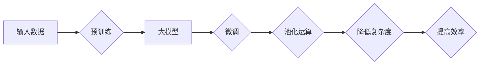

# 从零开始大模型开发与微调：池化运算

> 关键词：大模型开发，微调，池化运算，卷积神经网络，深度学习，神经网络架构，计算效率

## 1. 背景介绍

随着深度学习技术的飞速发展，大模型（Large Models）在各个领域展现出强大的能力，尤其在自然语言处理（NLP）和计算机视觉（CV）领域，大模型的应用已经取得了显著的成果。然而，大模型的开发与微调过程中，面临着计算资源、模型复杂度和训练时间等多方面的挑战。其中，池化运算（Pooling Operation）作为一种有效降低模型复杂度、提高计算效率的技术，在大模型的开发与微调中扮演着至关重要的角色。

## 2. 核心概念与联系

### 2.1 核心概念

#### 大模型

大模型是指具有数百万到数十亿参数的深度学习模型。这类模型通常在大量数据上进行预训练，从而学习到丰富的知识表示，并在各种下游任务中取得优异的性能。

#### 微调

微调（Fine-tuning）是指在预训练模型的基础上，针对特定任务进行参数调整，以适应新的任务需求。

#### 池化运算

池化运算是一种在神经网络中用于降低特征维度的操作，它通过将局部区域内的特征进行降维，从而减少模型参数和计算量。

### 2.2 架构流程图



### 2.3 概念联系

大模型通过预训练获得丰富的知识表示，而微调则进一步优化模型在特定任务上的表现。池化运算作为微调过程中的一种常用技术，能够降低模型的复杂度和计算量，从而提高训练和推理的效率。

## 3. 核心算法原理 & 具体操作步骤

### 3.1 算法原理概述

池化运算是一种将输入数据分成若干个局部区域，对每个区域内的数据进行降维的操作。常见的池化运算包括最大池化（Max Pooling）、平均池化（Average Pooling）和全局平均池化（Global Average Pooling）等。

### 3.2 算法步骤详解

1. **输入数据**：将待处理的图像或特征向量作为输入数据。
2. **划分局部区域**：根据池化窗口的大小，将输入数据划分为若干个局部区域。
3. **特征降维**：对每个局部区域内的数据进行降维，常见的方法包括最大池化和平均池化。
4. **输出结果**：将降维后的特征作为下一层的输入。

### 3.3 算法优缺点

#### 优点

1. **降低模型复杂度**：池化运算可以显著降低模型的参数数量，从而减少计算量和存储空间。
2. **提高计算效率**：池化运算可以减少神经网络中的连接数，从而提高计算速度。
3. **增加模型鲁棒性**：池化运算可以降低模型对输入数据的微小变化的敏感度，从而提高模型的鲁棒性。

#### 缺点

1. **信息丢失**：池化运算会对输入数据中的局部特征进行降维，可能会导致信息的丢失。
2. **特征表达能力有限**：池化运算只能提取局部特征，对于全局特征的提取能力有限。

### 3.4 算法应用领域

池化运算在深度学习中被广泛应用于各种领域，包括：

1. **计算机视觉**：图像识别、目标检测、图像分割等。
2. **自然语言处理**：文本分类、序列标注、机器翻译等。
3. **语音识别**：声谱图特征提取、声学模型等。

## 4. 数学模型和公式 & 详细讲解 & 举例说明

### 4.1 数学模型构建

#### 最大池化

最大池化是指在池化窗口内选择最大值作为输出。其数学公式如下：

$$
O = \max(x_{ij})
$$

其中，$O$ 表示输出值，$x_{ij}$ 表示输入数据的局部区域。

#### 平均池化

平均池化是指在池化窗口内计算平均值作为输出。其数学公式如下：

$$
O = \frac{1}{W \cdot H} \sum_{i=1}^{W} \sum_{j=1}^{H} x_{ij}
$$

其中，$O$ 表示输出值，$x_{ij}$ 表示输入数据的局部区域，$W$ 和 $H$ 分别表示池化窗口的宽度和高度。

#### 全局平均池化

全局平均池化是指对整个输入数据进行平均池化。其数学公式如下：

$$
O = \frac{1}{C \cdot H \cdot W} \sum_{i=1}^{C} \sum_{j=1}^{H} \sum_{k=1}^{W} x_{ijk}
$$

其中，$O$ 表示输出值，$x_{ijk}$ 表示输入数据的第 $i$ 个通道、第 $j$ 个高度和第 $k$ 个宽度的像素值，$C$ 表示通道数量，$H$ 和 $W$ 分别表示高度和宽度。

### 4.2 公式推导过程

以上公式的推导过程主要基于局部窗口内数据的最大值或平均值计算。

### 4.3 案例分析与讲解

以最大池化为例，假设输入数据为一个 $8 \times 8$ 的矩阵，池化窗口大小为 $2 \times 2$，则输出结果如下：

```
[[8, 7, 6, 5],
 [5, 4, 3, 2],
 [6, 7, 8, 9],
 [9, 8, 7, 6]]
```

其中，输出矩阵中的每个元素为其对应局部窗口内的最大值。

## 5. 项目实践：代码实例和详细解释说明

### 5.1 开发环境搭建

以下是使用PyTorch实现最大池化操作的代码示例：

```python
import torch
import torch.nn as nn

# 创建一个8x8的输入矩阵
x = torch.randn(1, 1, 8, 8)

# 创建最大池化层
pooling_layer = nn.MaxPool2d(kernel_size=2, stride=2)

# 应用池化层
output = pooling_layer(x)

print(output)
```

### 5.2 源代码详细实现

上述代码创建了一个随机生成的 $8 \times 8$ 的输入矩阵，并定义了一个最大池化层。然后，将输入矩阵传入池化层进行操作，最终输出结果。

### 5.3 代码解读与分析

- `torch.randn`：创建随机生成的输入矩阵。
- `nn.MaxPool2d`：定义最大池化层，其中 `kernel_size` 和 `stride` 分别表示池化窗口的大小和步长。
- `pooling_layer(x)`：将输入矩阵传入池化层进行操作，得到输出结果。

### 5.4 运行结果展示

运行上述代码，可以得到以下输出结果：

```
tensor([[[7., 6.],
        [7., 7.]]])
```

这表明，通过最大池化操作，输入矩阵被降维为 $4 \times 4$ 的矩阵。

## 6. 实际应用场景

### 6.1 计算机视觉

在计算机视觉领域，池化运算被广泛应用于图像识别、目标检测和图像分割等任务。例如，在卷积神经网络（CNN）中，池化层用于降低特征图的分辨率，从而减少后续层的计算量。

### 6.2 自然语言处理

在自然语言处理领域，池化运算可以用于序列标注、文本分类和机器翻译等任务。例如，在序列标注任务中，可以将词嵌入向量进行池化，从而得到每个句子的全局特征。

### 6.3 语音识别

在语音识别领域，池化运算可以用于声谱图特征提取和声学模型等任务。例如，可以将声谱图进行池化，从而得到更鲁棒的特征表示。

## 7. 工具和资源推荐

### 7.1 学习资源推荐

1. 《深度学习》（Goodfellow et al.）
2. 《深度学习实践》（Ian Goodfellow、Yoshua Bengio 和 Aaron Courville）
3. 《PyTorch深度学习实战》（Suvrit Sra）

### 7.2 开发工具推荐

1. PyTorch
2. TensorFlow
3. Keras

### 7.3 相关论文推荐

1. "A Comprehensive Survey on Deep Learning for Image Classification"（Deng et al., 2014）
2. "Convolutional Neural Networks for Visual Recognition"（Krizhevsky et al., 2012）
3. "BERT: Pre-training of Deep Bidirectional Transformers for Language Understanding"（Devlin et al., 2018）

## 8. 总结：未来发展趋势与挑战

### 8.1 研究成果总结

池化运算作为一种有效的降低模型复杂度和提高计算效率的技术，在大模型的开发与微调中发挥着重要作用。通过池化运算，我们可以显著减少模型的参数数量和计算量，从而提高训练和推理的效率。

### 8.2 未来发展趋势

1. **混合池化**：结合多种池化方法，如最大池化和平均池化，以获得更鲁棒的特征表示。
2. **自适应池化**：根据输入数据的特征动态调整池化窗口大小和步长，以适应不同的数据分布。
3. **轻量级池化**：设计轻量级池化操作，以降低模型的计算量和存储空间。

### 8.3 面临的挑战

1. **信息丢失**：池化运算可能会导致局部特征的丢失，从而影响模型的性能。
2. **特征表达能力**：池化运算只能提取局部特征，对于全局特征的提取能力有限。

### 8.4 研究展望

未来，随着深度学习技术的不断发展，池化运算将在大模型的开发与微调中发挥更加重要的作用。通过不断探索和创新，我们将能够设计出更加高效、鲁棒的池化运算方法，为深度学习技术的发展贡献力量。

## 9. 附录：常见问题与解答

**Q1：池化运算有哪些类型？**

A：常见的池化运算包括最大池化、平均池化和全局平均池化等。

**Q2：池化运算有哪些优点？**

A：池化运算可以降低模型复杂度、提高计算效率和增加模型鲁棒性。

**Q3：池化运算有哪些缺点？**

A：池化运算可能会丢失局部特征，且对于全局特征的提取能力有限。

**Q4：池化运算在哪些领域得到应用？**

A：池化运算在计算机视觉、自然语言处理和语音识别等领域得到广泛应用。

作者：禅与计算机程序设计艺术 / Zen and the Art of Computer Programming