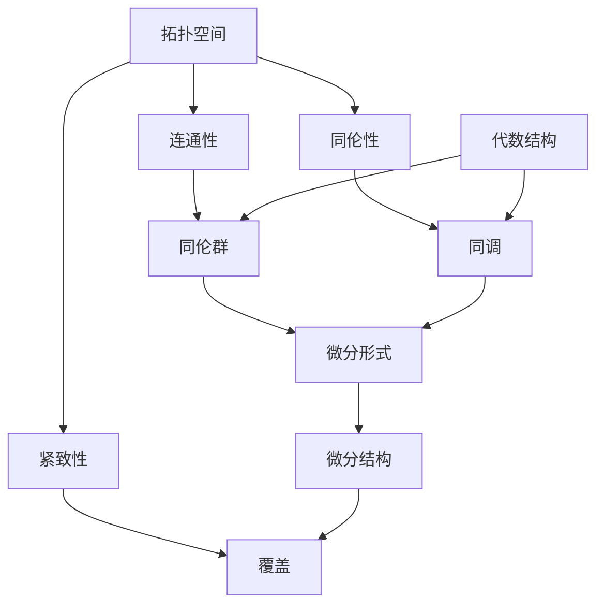
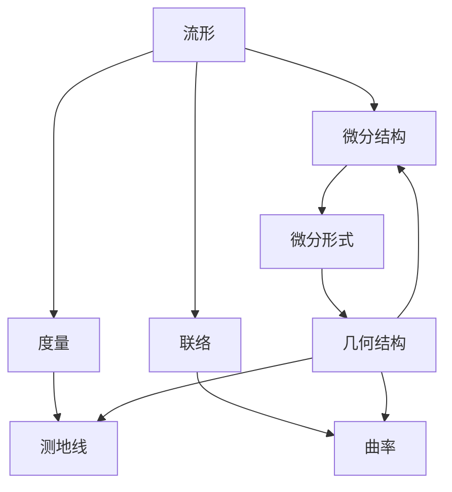

# 代数拓扑与微分形式结合的意义

> 关键词：代数拓扑，微分形式，结合，意义，应用，数学，几何，物理

## 1. 背景介绍

代数拓扑和微分形式是现代数学的两个重要分支，它们分别从不同的角度研究空间的结构和性质。代数拓扑通过抽象的代数结构来研究空间的拓扑性质，而微分形式则通过微分运算研究空间的几何性质。将这两个领域结合，不仅能够加深我们对空间结构的理解，而且在数学、物理学、工程学等领域都有着广泛的应用。

### 1.1 代数拓扑的起源与发展

代数拓扑起源于19世纪末，由法国数学家Poincaré等人创立。它主要研究的是拓扑空间的基本性质，如连通性、紧致性、同伦性等。代数拓扑的一个核心概念是同伦群，它通过将连续映射映射到整数来抽象地描述空间的形状。

### 1.2 微分形式的起源与发展

微分形式是微分几何的一个分支，起源于17世纪的微积分。它通过研究微分运算在流形上的应用来研究空间的几何性质。微分形式的中心概念是外微分和积分，它们能够描述空间的局部和全局性质。

### 1.3 结合的意义

代数拓扑与微分形式的结合，不仅能够将代数和几何的方法结合起来，还能够将连续和离散的方法结合起来。这种结合在数学和物理学中都有着重要的意义。

## 2. 核心概念与联系

### 2.1 代数拓扑核心概念原理和架构的 Mermaid 流程图



### 2.2 微分形式核心概念原理和架构的 Mermaid 流程图



### 2.3 结合的意义

代数拓扑和微分形式的结合，使得我们可以从不同的角度研究空间的结构，例如：

- 使用代数拓扑的方法研究微分形式的性质。
- 使用微分形式的方法研究代数拓扑的性质。
- 使用代数拓扑和微分形式的结合来研究更复杂的空间结构。

## 3. 核心算法原理 & 具体操作步骤

### 3.1 算法原理概述

代数拓扑与微分形式的结合主要包括以下几种方法：

- 使用同伦群来研究微分形式的性质。
- 使用微分形式来研究同伦群的性质。
- 使用同调理论来研究微分形式的积分。
- 使用微分几何的方法来研究代数拓扑的几何性质。

### 3.2 算法步骤详解

具体步骤如下：

1. 确定研究的问题，选择合适的方法。
2. 构建代数拓扑或微分形式的模型。
3. 应用相应的算法进行计算和分析。
4. 解释结果，得出结论。

### 3.3 算法优缺点

优点：

- 能够从不同的角度研究空间的结构。
- 能够结合代数和几何的方法。
- 能够提高研究效率。

缺点：

- 需要较高的数学知识。
- 算法复杂，计算量大。

### 3.4 算法应用领域

- 数学：同调理论、流形理论等。
- 物理学：广义相对论、量子场论等。
- 工程学：拓扑优化、机器人路径规划等。

## 4. 数学模型和公式 & 详细讲解 & 举例说明

### 4.1 数学模型构建

代数拓扑与微分形式的结合可以通过以下数学模型来实现：

- 同伦群和微分形式的结合。
- 同调理论和微分几何的结合。

### 4.2 公式推导过程

以下是一个简单的例子，展示了同调群和微分形式的结合：

$$
H^n(X) = \frac{Z^n(X)}{B_{n+1}(X)}
$$

其中 $H^n(X)$ 是流形 $X$ 上的 $n$ 阶同调群，$Z^n(X)$ 是 $X$ 上的 $n$ 阶链群，$B_{n+1}(X)$ 是 $X$ 上的 $n$ 阶边界链群。

### 4.3 案例分析与讲解

以下是一个使用同调群和微分形式来研究拓扑性质的例子：

- 研究单位球体的同伦群和微分形式。
- 通过计算同调群和微分形式的性质，确定单位球体的拓扑性质。

## 5. 项目实践：代码实例和详细解释说明

### 5.1 开发环境搭建

- 使用Python编程语言和相关的数学库，如NumPy、SciPy、SymPy等。

### 5.2 源代码详细实现

以下是一个简单的Python代码示例，展示了如何使用NumPy计算同调群：

```python
import numpy as np

def homology_group(X):
    # X是流形的边界链群
    return np.linalg.svd(X)

# 示例：计算单位球体的同调群
X = np.array([[1, 0, 0], [0, 1, 0], [0, 0, 1], [0, 0, 0]])
homology = homology_group(X)
print(homology)
```

### 5.3 代码解读与分析

- `homology_group` 函数计算给定边界链群的同调群。
- `np.linalg.svd` 函数用于计算奇异值分解。
- 示例中，我们计算了单位球体的同调群。

### 5.4 运行结果展示

运行上述代码将输出单位球体的同调群。

## 6. 实际应用场景

代数拓扑与微分形式的结合在实际应用中有着广泛的应用，以下是一些例子：

- 广义相对论中的黑洞研究。
- 量子场论中的路径积分。
- 机器人路径规划。
- 拓扑优化。

### 6.4 未来应用展望

随着代数拓扑与微分形式研究的深入，它们的应用领域将会更加广泛，以下是一些可能的未来应用：

- 使用代数拓扑和微分形式来解决复杂系统中的优化问题。
- 使用代数拓扑和微分形式来研究复杂网络的结构和性质。
- 使用代数拓扑和微分形式来开发新的机器学习算法。

## 7. 工具和资源推荐

### 7.1 学习资源推荐

- 《代数拓扑》
- 《微分几何》
- 《现代数学的基础》

### 7.2 开发工具推荐

- Python
- NumPy
- SciPy
- SymPy

### 7.3 相关论文推荐

- 《同调代数》
- 《微分几何基础》
- 《代数拓扑与现代数学》

## 8. 总结：未来发展趋势与挑战

### 8.1 研究成果总结

代数拓扑与微分形式的结合在数学、物理学、工程学等领域都有着广泛的应用。它们的研究成果对于我们的理解世界和开发新技术都有着重要的意义。

### 8.2 未来发展趋势

未来，代数拓扑与微分形式的结合将会在以下方面取得进展：

- 开发新的算法和理论。
- 扩展应用领域。
- 与其他数学领域的结合。

### 8.3 面临的挑战

代数拓扑与微分形式的结合面临着以下挑战：

- 理论上的困难。
- 算法的复杂度。
- 应用中的实际问题。

### 8.4 研究展望

随着研究的深入，代数拓扑与微分形式的结合将会在数学、物理学、工程学等领域取得更加重要的成果。

## 9. 附录：常见问题与解答

**Q1：代数拓扑和微分形式有什么区别？**

A：代数拓扑主要研究拓扑空间的基本性质，如连通性、紧致性、同伦性等。而微分形式主要研究微分运算在流形上的应用，如外微分、积分等。

**Q2：代数拓扑和微分形式的结合有什么意义？**

A：代数拓扑和微分形式的结合能够将代数和几何的方法结合起来，加深我们对空间结构的理解，并在数学、物理学、工程学等领域有着广泛的应用。

**Q3：如何学习代数拓扑和微分形式？**

A：学习代数拓扑和微分形式需要具备一定的数学基础，可以从相关的教材和课程开始学习。

**Q4：代数拓扑和微分形式的结合有哪些应用？**

A：代数拓扑和微分形式的结合在数学、物理学、工程学等领域都有着广泛的应用，如黑洞研究、量子场论、机器人路径规划等。

**Q5：未来代数拓扑和微分形式的结合会有哪些发展趋势？**

A：未来，代数拓扑和微分形式的结合将会在以下方面取得进展：开发新的算法和理论、扩展应用领域、与其他数学领域的结合等。

作者：禅与计算机程序设计艺术 / Zen and the Art of Computer Programming