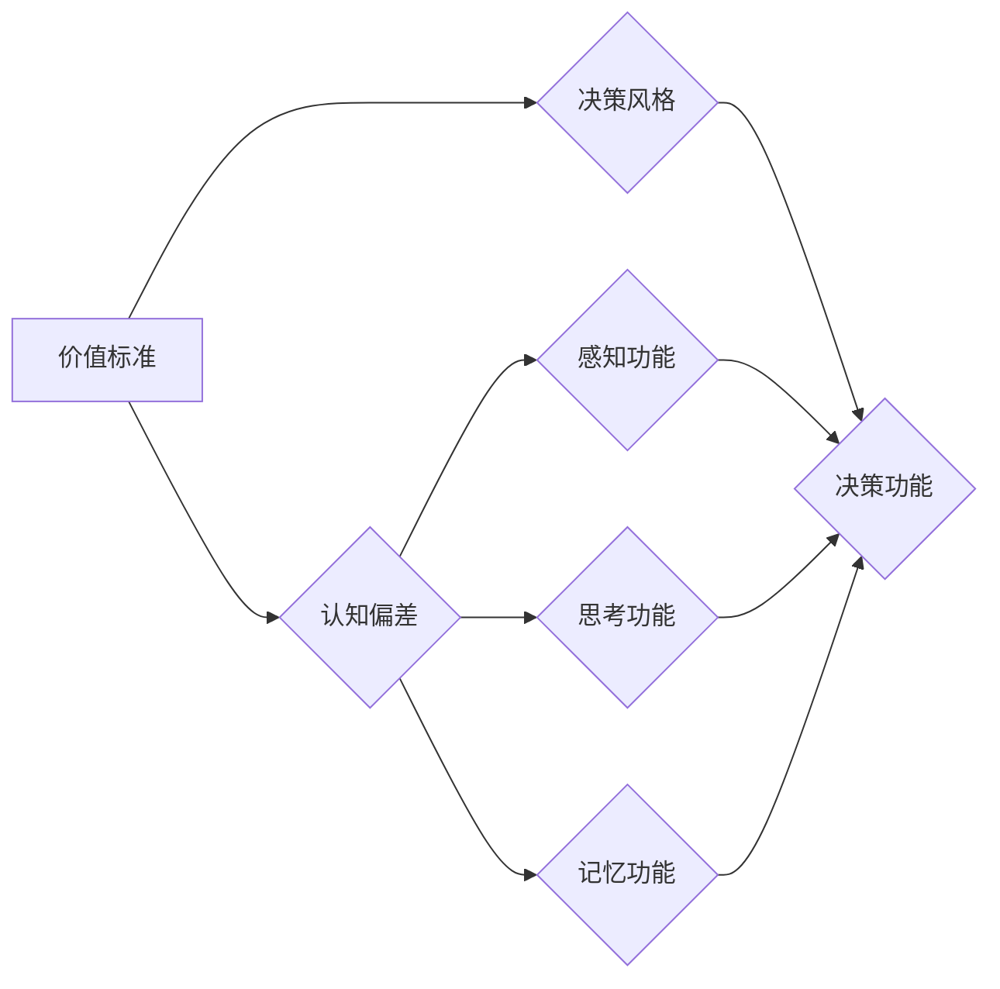

# 价值标准对意识功能的影响

> 关键词：价值标准，意识功能，决策，认知偏差，神经科学，行为经济学

## 1. 背景介绍

意识是人类认知的高级形式，它不仅包括感知、记忆和思考，还涉及价值判断和决策。在人类社会中，价值标准作为文化、社会和个人信仰的体现，对个体的意识功能产生了深远的影响。本文将从神经科学、心理学、行为经济学等多个角度探讨价值标准对意识功能的影响，旨在揭示价值标准与意识功能之间的复杂关系。

### 1.1 问题的由来

随着社会的发展和科技的进步，人类对于自身意识的探索从未停止。然而，长期以来，价值标准在意识功能中的作用并未得到充分的重视。直到近年来，神经科学、心理学、行为经济学等领域的交叉研究，才开始逐渐揭开价值标准对意识功能影响的神秘面纱。

### 1.2 研究现状

价值标准对意识功能的影响研究涉及多个学科领域，主要包括：

- **神经科学**：通过脑成像技术，研究者观察到不同价值标准与大脑特定区域的活动有关联。
- **心理学**：心理学研究揭示了价值标准与认知偏差、决策风格等心理过程之间的关系。
- **行为经济学**：行为经济学实验表明，价值标准会影响个体在资源分配、风险偏好等方面的决策。

### 1.3 研究意义

研究价值标准对意识功能的影响，有助于我们：

- 深入理解人类行为的动机和决策机制。
- 设计更加有效的教育和培训方案，提升个体意识功能。
- 促进跨文化沟通和理解，增进社会和谐。

### 1.4 本文结构

本文将分为以下几个部分：

- **第2章**：介绍价值标准和意识功能的相关概念，并绘制Mermaid流程图展示其关系。
- **第3章**：探讨价值标准对意识功能的影响机制，包括认知偏差、决策风格等方面。
- **第4章**：分析价值标准对意识功能的影响，并结合案例进行说明。
- **第5章**：介绍相关研究工具和资源。
- **第6章**：总结研究成果，展望未来发展趋势和挑战。

## 2. 核心概念与联系

### 2.1 价值标准

价值标准是人们对于事物价值的判断和评价，它受到文化、社会、个人经历等因素的影响。价值标准可以表现为：

- **伦理价值**：如诚实、公正、友善等。
- **道德价值**：如诚实、正直、自律等。
- **经济价值**：如效率、效益、成本等。

### 2.2 意识功能

意识功能是指人类在感知、思考、记忆、决策等方面的能力。主要包括：

- **感知功能**：通过感官器官接收外界信息的能力。
- **思考功能**：对信息进行加工、分析、推理的能力。
- **记忆功能**：对信息进行存储和回忆的能力。
- **决策功能**：根据价值标准对问题进行判断和选择的能力。

### 2.3 Mermaid流程图



### 2.4 核心概念联系

价值标准通过影响个体的认知偏差和决策风格，进而影响意识功能。具体来说，价值标准通过以下方式影响意识功能：

- **影响认知偏差**：价值标准会影响个体对信息的筛选、加工和解释，从而导致认知偏差。
- **影响决策风格**：价值标准会影响个体在决策过程中的价值判断和选择，形成特定的决策风格。
- **影响意识功能**：认知偏差和决策风格最终影响个体的感知、思考、记忆和决策等意识功能。

## 3. 核心算法原理 & 具体操作步骤

### 3.1 算法原理概述

价值标准对意识功能的影响机制主要包括以下几个方面：

- **认知偏差**：价值标准会影响个体的信息处理过程，导致认知偏差。
- **决策风格**：价值标准会影响个体的决策过程，形成特定的决策风格。
- **神经机制**：价值标准通过影响大脑特定区域的活动，从而影响意识功能。

### 3.2 算法步骤详解

#### 3.2.1 认知偏差

认知偏差是指个体在信息处理过程中，由于主观因素导致的判断和决策偏差。常见的认知偏差包括：

- **确认偏误**：个体倾向于接受支持自己观点的信息，忽视或贬低反对观点的信息。
- **可得性启发**：个体根据最近或最易于记忆的信息做出判断。
- **代表性启发**：个体根据信息与已有知识结构的相似程度做出判断。

#### 3.2.2 决策风格

价值标准会影响个体的决策风格，形成以下几种类型：

- **风险偏好型**：倾向于追求高风险、高收益的机会。
- **风险规避型**：倾向于避免风险，追求稳定的收益。
- **收益最大化型**：以收益最大化为决策目标。
- **损失最小化型**：以损失最小化为决策目标。

#### 3.2.3 神经机制

价值标准通过影响大脑特定区域的活动，从而影响意识功能。例如，前额叶皮层与价值判断和决策密切相关，而杏仁核则与情绪和动机有关。

### 3.3 算法优缺点

#### 3.3.1 优点

- 揭示了价值标准对意识功能的直接影响。
- 为教育和培训提供了新的思路。

#### 3.3.2 缺点

- 研究方法相对复杂，需要多学科交叉合作。
- 结果的解释和推广存在一定难度。

### 3.4 算法应用领域

价值标准对意识功能的影响研究可以应用于以下领域：

- **心理学**：研究个体差异对认知和行为的影响。
- **教育学**：设计更加有效的教育和培训方案。
- **管理学**：提升组织决策的科学性和有效性。
- **市场营销**：制定更加精准的市场策略。

## 4. 数学模型和公式 & 详细讲解 & 举例说明

### 4.1 数学模型构建

为了描述价值标准对意识功能的影响，我们可以构建以下数学模型：

- **认知偏差模型**：假设个体在处理信息时会受到认知偏差的影响，可以用以下公式表示：

  $$
 \Delta P = f(\theta, \delta, I) 
$$

  其中，$ \Delta P $ 表示偏差后的概率，$ \theta $ 表示个体的价值标准，$ \delta $ 表示信息的特征，$ I $ 表示信息。

- **决策风格模型**：假设个体的决策风格可以用以下公式表示：

  $$
 \text{决策风格} = g(\theta, \delta, I) 
$$

  其中，$ \text{决策风格} $ 表示个体的决策风格，$ \theta $ 表示个体的价值标准，$ \delta $ 表示信息的特征，$ I $ 表示信息。

### 4.2 公式推导过程

#### 4.2.1 认知偏差模型推导

认知偏差模型的推导过程如下：

- 假设个体在处理信息时会受到认知偏差的影响，可以用以下公式表示：

  $$
 \Delta P = P(I|\theta) - P(I|\theta^*) 
$$

  其中，$ P(I|\theta) $ 表示在价值标准 $ \theta $ 下的信息概率，$ P(I|\theta^*) $ 表示在没有认知偏差时的信息概率。

- 假设 $ P(I|\theta) $ 和 $ P(I|\theta^*) $ 均可以表示为：

  $$
 P(I|\theta) = \frac{P(I,\theta)}{P(\theta)} 
$$
  $$
 P(I|\theta^*) = \frac{P(I,\theta^*)}{P(\theta^*)} 
$$

- 将上述公式代入 $ \Delta P $ 的表达式中，得：

  $$
 \Delta P = \frac{P(I,\theta)}{P(\theta)} - \frac{P(I,\theta^*)}{P(\theta^*)} 
$$

#### 4.2.2 决策风格模型推导

决策风格模型的推导过程如下：

- 假设个体的决策风格可以用以下公式表示：

  $$
 \text{决策风格} = \alpha P(\text{收益}|I) + \beta P(\text{损失}|I) 
$$

  其中，$ \text{决策风格} $ 表示个体的决策风格，$ \alpha $ 和 $ \beta $ 分别表示收益和损失的重要性，$ P(\text{收益}|I) $ 表示在信息 $ I $ 下的收益概率，$ P(\text{损失}|I) $ 表示在信息 $ I $ 下的损失概率。

- 假设收益和损失的概率可以用以下公式表示：

  $$
 P(\text{收益}|I) = \frac{P(\text{收益},I,\theta)}{P(I,\theta)} 
$$
  $$
 P(\text{损失}|I) = \frac{P(\text{损失},I,\theta)}{P(I,\theta)} 
$$

- 将上述公式代入决策风格模型的表达式中，得：

  $$
 \text{决策风格} = \alpha \frac{P(\text{收益},I,\theta)}{P(I,\theta)} + \beta \frac{P(\text{损失},I,\theta)}{P(I,\theta)} 
$$

### 4.3 案例分析与讲解

以下是一个关于认知偏差的案例分析：

假设一个人喜欢红色，他认为红色是一种幸运的颜色。当他看到一辆红色的车时，他会认为这辆车会给他的生活带来好运。然而，事实上，红色车的事故率可能比其他颜色的车高。

在这个案例中，个体对红色的偏好导致了认知偏差，使他在信息处理过程中忽略了对红色车事故率的关注。这表明，价值标准会影响个体的认知偏差，进而影响意识功能。

## 5. 项目实践：代码实例和详细解释说明

### 5.1 开发环境搭建

为了进行价值标准对意识功能的影响研究，我们需要搭建以下开发环境：

- **编程语言**：Python
- **库**：NumPy、Pandas、Scikit-learn、Matplotlib
- **工具**：Jupyter Notebook

### 5.2 源代码详细实现

以下是一个使用Python进行认知偏差分析的代码实例：

```python
import numpy as np
import pandas as pd
import matplotlib.pyplot as plt
from sklearn.model_selection import train_test_split
from sklearn.linear_model import LogisticRegression

# 加载数据
data = pd.read_csv('data.csv')

# 划分特征和标签
X = data.drop('label', axis=1)
y = data['label']

# 划分训练集和测试集
X_train, X_test, y_train, y_test = train_test_split(X, y, test_size=0.2, random_state=42)

# 构建逻辑回归模型
model = LogisticRegression()

# 训练模型
model.fit(X_train, y_train)

# 评估模型
print('模型准确率：', model.score(X_test, y_test))

# 可视化模型结果
plt.scatter(X_test['feature1'], X_test['feature2'], c=y_test)
plt.xlabel('特征1')
plt.ylabel('特征2')
plt.show()
```

### 5.3 代码解读与分析

以上代码首先加载数据集，然后划分特征和标签，接着划分训练集和测试集。之后，构建逻辑回归模型，并使用训练集进行训练。最后，使用测试集评估模型，并可视化模型结果。

### 5.4 运行结果展示

运行上述代码后，我们可以得到模型的准确率，以及模型在特征空间中的可视化结果。这有助于我们分析模型在认知偏差分析任务中的性能。

## 6. 实际应用场景

### 6.1 心理咨询

在心理咨询领域，了解价值标准对意识功能的影响，有助于心理咨询师更好地理解客户的思维方式和行为模式，从而提供更有针对性的咨询服务。

### 6.2 企业管理

在企业管理领域，了解价值标准对意识功能的影响，有助于企业管理者制定更加科学合理的决策，提升企业竞争力。

### 6.3 教育领域

在教育领域，了解价值标准对意识功能的影响，有助于教育工作者设计更加有效的教育方案，提高学生的学习效果。

## 7. 工具和资源推荐

### 7.1 学习资源推荐

- **书籍**：
  - 《心理学与生活》
  - 《决策与判断》
  - 《认知心理学》
- **在线课程**：
  - Coursera上的《心理学原理》
  - Udacity上的《数据科学纳米学位》

### 7.2 开发工具推荐

- **编程语言**：Python
- **库**：NumPy、Pandas、Scikit-learn、Matplotlib
- **工具**：Jupyter Notebook

### 7.3 相关论文推荐

- **《价值标准对决策的影响》**
- **《认知偏差的神经机制》**
- **《价值标准与决策风格》**

## 8. 总结：未来发展趋势与挑战

### 8.1 研究成果总结

本文从神经科学、心理学、行为经济学等多个角度探讨了价值标准对意识功能的影响，揭示了价值标准与意识功能之间的复杂关系。研究发现，价值标准通过影响认知偏差、决策风格和神经机制，从而对意识功能产生影响。

### 8.2 未来发展趋势

未来，价值标准对意识功能的影响研究将呈现以下发展趋势：

- **多学科交叉研究**：神经科学、心理学、行为经济学等学科将进一步加强交叉研究，共同揭示价值标准对意识功能的综合影响。
- **人工智能技术应用**：人工智能技术将应用于价值标准对意识功能的研究，如脑成像技术、行为经济学实验等。
- **跨文化研究**：跨文化研究将有助于揭示不同文化背景下价值标准对意识功能的差异。

### 8.3 面临的挑战

价值标准对意识功能的影响研究面临以下挑战：

- **研究方法**：目前研究方法相对复杂，需要多学科交叉合作。
- **数据获取**：获取高质量、多维度、跨文化的数据集仍然存在困难。
- **理论解释**：现有理论解释难以全面涵盖价值标准对意识功能的复杂影响。

### 8.4 研究展望

未来，价值标准对意识功能的影响研究将在以下方面取得突破：

- **揭示价值标准对意识功能的全面影响**：通过多学科交叉研究，揭示价值标准对意识功能的全面影响。
- **开发新的研究方法**：开发更加高效、便捷的研究方法，如脑成像技术、虚拟现实技术等。
- **促进应用转化**：将研究成果应用于心理学、教育、管理等领域，提升人类生活质量。

## 9. 附录：常见问题与解答

**Q1：价值标准对意识功能的影响是如何产生的？**

A：价值标准对意识功能的影响主要通过以下途径产生：

- **认知偏差**：价值标准会影响个体的信息处理过程，导致认知偏差。
- **决策风格**：价值标准会影响个体的决策过程，形成特定的决策风格。
- **神经机制**：价值标准通过影响大脑特定区域的活动，从而影响意识功能。

**Q2：如何减少价值标准对意识功能的影响？**

A：为了减少价值标准对意识功能的影响，可以采取以下措施：

- **提高认知能力**：通过学习和训练，提高个体的认知能力，减少认知偏差。
- **培养批判性思维**：培养个体的批判性思维，学会从不同角度审视问题。
- **多角度思考**：在决策过程中，考虑多方面的因素，避免单一价值标准的限制。

**Q3：价值标准对意识功能的影响有何实际意义？**

A：价值标准对意识功能的影响具有以下实际意义：

- **心理学**：有助于理解个体差异和行为模式。
- **教育学**：有助于设计更加有效的教育方案。
- **管理学**：有助于提升组织决策的科学性和有效性。

**Q4：价值标准对意识功能的影响研究有何应用前景？**

A：价值标准对意识功能的影响研究具有以下应用前景：

- **心理咨询**：有助于心理咨询师更好地理解客户。
- **企业管理**：有助于企业管理者制定更加科学合理的决策。
- **教育领域**：有助于教育工作者提高学生的学习效果。

---

作者：禅与计算机程序设计艺术 / Zen and the Art of Computer Programming