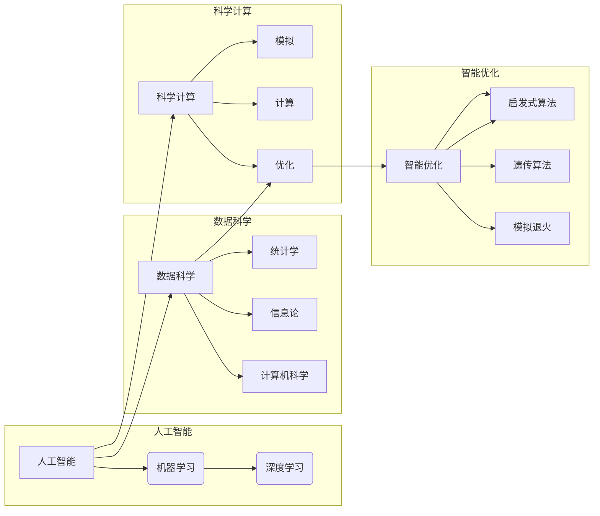

> 人工智能，AI应用，传统科学领域，深度学习，数据科学，模型构建，机器学习，科学计算，智能优化，实验设计

# 传统科学领域的AI应用

### 1. 背景介绍

人工智能（AI）作为一门交叉学科，近年来取得了突飞猛进的发展。随着深度学习、数据科学等技术的不断成熟，AI已经渗透到各行各业，包括传统科学领域。从物理学到生物学，从化学到天文学，AI的应用正在改变我们对科学的认知和研究方法。本文将探讨AI在传统科学领域的应用，分析其核心概念、算法原理、应用案例，并展望未来发展趋势与挑战。

### 2. 核心概念与联系

#### 2.1 核心概念

- **人工智能（AI）**：模拟、延伸和扩展人的智能的理论、方法、技术及应用系统。
- **机器学习（ML）**：使计算机系统能从数据中学习，获得智能，无需明确编程指令。
- **深度学习（DL）**：一种特殊的机器学习技术，通过构建多层神经网络模拟人脑的神经元连接，实现复杂模式的自动学习。
- **数据科学（DS）**：结合统计学、信息论、计算机科学等多学科知识，从大量数据中提取有用信息和知识。
- **科学计算**：利用计算机模拟、计算和优化科学实验和工程问题。
- **智能优化**：利用启发式算法寻找问题的最优解或近似最优解。

#### 2.2 核心概念原理和架构的 Mermaid 流程图



### 3. 核心算法原理 & 具体操作步骤

#### 3.1 算法原理概述

AI在传统科学领域的应用主要基于以下原理：

- **数据驱动**：通过大量数据学习科学规律和模式，实现预测、分类、聚类等任务。
- **模型驱动**：构建数学模型模拟科学现象，通过优化模型参数实现预测和优化。
- **优化驱动**：利用智能优化算法寻找科学问题的最优解或近似最优解。

#### 3.2 算法步骤详解

1. **数据收集**：根据研究目标，收集相关领域的实验数据、观测数据、文献数据等。
2. **数据预处理**：对数据进行清洗、去噪、归一化等处理，提高数据质量。
3. **特征工程**：从数据中提取对研究问题有用的特征，提高模型性能。
4. **模型选择**：根据任务类型和数据特点选择合适的模型。
5. **模型训练**：使用训练数据训练模型，优化模型参数。
6. **模型评估**：使用测试数据评估模型性能。
7. **模型应用**：将模型应用于实际问题解决。

#### 3.3 算法优缺点

**优点**：

- **高效**：能够快速处理海量数据，提高研究效率。
- **准确**：在许多领域达到或超过人类专家水平。
- **泛化能力强**：能够处理各种复杂问题。

**缺点**：

- **数据依赖**：需要大量高质量数据。
- **可解释性差**：模型决策过程难以解释。
- **计算资源需求高**：训练和推理过程需要大量计算资源。

#### 3.4 算法应用领域

AI在传统科学领域的应用广泛，包括但不限于以下领域：

- **物理学**：材料科学、天体物理学、粒子物理学等。
- **化学**：药物设计、材料合成、化学合成等。
- **生物学**：基因测序、蛋白质结构预测、疾病预测等。
- **医学**：疾病诊断、药物研发、医疗影像分析等。
- **环境科学**：气候变化、生态系统建模、灾害预测等。

### 4. 数学模型和公式 & 详细讲解 & 举例说明

#### 4.1 数学模型构建

AI在科学领域的应用涉及多种数学模型，以下列举几个常见模型：

- **神经网络**：模拟人脑神经元连接，通过学习数据提取特征。
- **支持向量机（SVM）**：通过寻找最佳超平面实现分类或回归。
- **决策树**：通过树状结构进行分类或回归。
- **贝叶斯网络**：用于概率推理和不确定性分析。

#### 4.2 公式推导过程

以神经网络为例，其基本公式如下：

- 激活函数：$f(x) = \sigma(w^T x + b)$
- 损失函数：$L(\theta) = \sum_{i=1}^N (y_i - f(x_i))^2$

其中，$w$ 为权重，$b$ 为偏置，$x$ 为输入，$y$ 为输出，$\sigma$ 为激活函数。

#### 4.3 案例分析与讲解

以下以深度学习在药物设计中的应用为例：

- **数据收集**：收集大量药物分子结构、活性数据等。
- **数据预处理**：对数据进行清洗、标准化等处理。
- **特征工程**：提取药物分子结构的指纹特征。
- **模型选择**：选择深度学习模型，如神经网络或卷积神经网络。
- **模型训练**：使用药物分子结构、活性数据训练模型。
- **模型评估**：使用测试数据评估模型性能。
- **模型应用**：将模型应用于新的药物分子结构，预测其活性。

通过深度学习模型，我们可以快速预测药物分子的活性，加速新药研发过程。

### 5. 项目实践：代码实例和详细解释说明

#### 5.1 开发环境搭建

- 安装Python、NumPy、Matplotlib、Scikit-learn等工具。
- 安装深度学习框架，如TensorFlow或PyTorch。

#### 5.2 源代码详细实现

以下使用PyTorch实现一个简单的神经网络模型：

```python
import torch
import torch.nn as nn

class Net(nn.Module):
    def __init__(self):
        super(Net, self).__init__()
        self.fc1 = nn.Linear(784, 500)
        self.relu = nn.ReLU()
        self.fc2 = nn.Linear(500, 10)

    def forward(self, x):
        x = self.fc1(x)
        x = self.relu(x)
        x = self.fc2(x)
        return x

net = Net()
criterion = nn.CrossEntropyLoss()
optimizer = torch.optim.SGD(net.parameters(), lr=0.01)

# 训练模型
# ...
```

#### 5.3 代码解读与分析

上述代码定义了一个简单的神经网络模型，包含两个全连接层和ReLU激活函数。使用交叉熵损失函数进行模型训练，并使用随机梯度下降（SGD）优化器优化模型参数。

#### 5.4 运行结果展示

运行代码后，我们可以得到模型的训练损失和准确率，评估模型性能。

### 6. 实际应用场景

#### 6.1 材料科学

AI在材料科学领域的应用主要包括：

- 材料性能预测：预测材料的物理、化学性质。
- 材料设计：根据性能要求，设计具有特定性质的新型材料。
- 材料合成：预测合成反应的最佳条件。

#### 6.2 生物学

AI在生物学领域的应用主要包括：

- 基因组学：分析基因组序列，预测基因功能。
- 蛋白质结构预测：预测蛋白质的三维结构。
- 药物设计：预测药物分子的活性，加速新药研发。

#### 6.3 医学

AI在医学领域的应用主要包括：

- 疾病诊断：辅助医生进行疾病诊断。
- 药物研发：预测药物分子的活性，加速新药研发。
- 医疗影像分析：分析医学影像，发现病变区域。

### 6.4 未来应用展望

未来，AI在传统科学领域的应用将更加广泛，以下是一些展望：

- **跨学科融合**：AI将与更多学科领域融合，如生物学、化学、物理学等，产生新的交叉学科。
- **个性化研究**：AI将帮助科学家针对特定问题进行个性化研究，提高研究效率。
- **实验优化**：AI将优化实验设计，提高实验成功率。
- **知识发现**：AI将帮助科学家发现新的科学规律。

### 7. 工具和资源推荐

#### 7.1 学习资源推荐

- 《深度学习》
- 《Python机器学习》
- 《统计学习方法》
- 《数据科学入门》
- 《人工智能：一种现代的方法》

#### 7.2 开发工具推荐

- TensorFlow
- PyTorch
- Scikit-learn
- Keras
- Jupyter Notebook

#### 7.3 相关论文推荐

- Deep Learning for Materials Science and Engineering
- Deep Learning for Genomics: A New frontier in biomedicine
- Deep Learning in Drug Discovery

### 8. 总结：未来发展趋势与挑战

#### 8.1 研究成果总结

AI在传统科学领域的应用取得了显著成果，为科学研究和产业发展提供了新的动力。通过AI技术，我们可以快速处理海量数据，发现科学规律，加速新药研发、材料设计等过程。

#### 8.2 未来发展趋势

- **跨学科融合**：AI将与更多学科领域融合，产生新的交叉学科。
- **个性化研究**：AI将帮助科学家针对特定问题进行个性化研究。
- **实验优化**：AI将优化实验设计，提高实验成功率。
- **知识发现**：AI将帮助科学家发现新的科学规律。

#### 8.3 面临的挑战

- **数据质量**：高质量的数据对于AI模型的性能至关重要。
- **算法选择**：针对不同问题选择合适的算法。
- **可解释性**：提高AI模型的可解释性，增强用户信任。
- **计算资源**：AI模型训练和推理需要大量计算资源。

#### 8.4 研究展望

随着AI技术的不断发展，相信在传统科学领域将取得更多突破，为人类社会创造更多价值。

---

作者：禅与计算机程序设计艺术 / Zen and the Art of Computer Programming