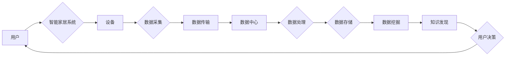

# 基于Java的智能家居设计：探讨Java在智能家居大数据处理中的角色

> 关键词：智能家居，大数据处理，Java，物联网，边缘计算，数据挖掘，机器学习

## 1. 背景介绍

随着物联网（IoT）技术的快速发展，智能家居市场正迎来爆炸式增长。智能家居系统通过集成各种智能设备，实现家庭环境的自动化控制，提升居住舒适度和安全性。然而，智能家居系统产生的海量数据如何有效处理，成为了一个亟待解决的问题。Java作为一种成熟、稳定的编程语言，在智能家居大数据处理中扮演着重要角色。本文将探讨Java在智能家居大数据处理中的角色和应用，并分析其面临的挑战和发展趋势。

## 2. 核心概念与联系

### 2.1 核心概念

#### 2.1.1 智能家居

智能家居是指利用物联网、云计算、大数据、人工智能等技术，实现对家庭环境、家电设备的智能化控制，提高生活品质的一种生活方式。

#### 2.1.2 大数据处理

大数据处理是指对海量数据进行采集、存储、管理、分析等操作，以挖掘有价值的信息和知识的过程。

#### 2.1.3 Java

Java是一种跨平台的面向对象编程语言，具有高性能、多线程、安全性、可移植性等特性，广泛应用于企业级应用开发。

#### 2.1.4 物联网

物联网是指通过传感器、网络、云计算等技术，将各种物体连接起来，实现信息交换和通信的生态系统。

#### 2.1.5 边缘计算

边缘计算是指在数据产生的地方进行计算，将计算能力从云端迁移到边缘设备，降低延迟和带宽消耗。

### 2.2 核心概念原理和架构 Mermaid 流程图



如图所示，智能家居系统通过设备采集数据，然后通过数据传输将数据发送到数据中心。在数据中心，对数据进行处理、存储、挖掘和知识发现，最终指导用户做出决策。

## 3. 核心算法原理 & 具体操作步骤

### 3.1 算法原理概述

智能家居大数据处理涉及以下核心算法：

#### 3.1.1 数据采集

数据采集是指从各种智能设备中收集数据的过程。常用的采集方式包括：

- HTTP请求：通过HTTP请求从设备端获取数据。
- MQTT协议：使用MQTT协议进行设备通信和数据传输。
- CoAP协议：适用于资源受限的设备，使用CoAP协议进行通信。

#### 3.1.2 数据传输

数据传输是指将采集到的数据传输到数据中心的过程。常用的传输方式包括：

- RESTful API：使用RESTful API进行数据传输。
- WebSocket：使用WebSocket进行实时数据传输。

#### 3.1.3 数据处理

数据处理是指对收集到的数据进行分析和清洗的过程。常用的数据处理方法包括：

- 数据清洗：去除异常值、重复值等无效数据。
- 数据转换：将不同格式的数据转换为统一的格式。
- 数据整合：将来自不同来源的数据整合为一个整体。

#### 3.1.4 数据存储

数据存储是指将处理后的数据存储到数据库或数据湖的过程。常用的存储方式包括：

- 关系型数据库：如MySQL、Oracle等。
- NoSQL数据库：如MongoDB、Cassandra等。
- 分布式文件系统：如HDFS、Ceph等。

#### 3.1.5 数据挖掘

数据挖掘是指从大量数据中挖掘出有价值的信息和知识的过程。常用的数据挖掘方法包括：

- 聚类分析：将相似数据归为一类。
- 联合分析：分析不同数据之间的关系。
- 分类与预测：根据已有数据对未知数据进行分类或预测。

#### 3.1.6 机器学习

机器学习是指通过算法使计算机模拟人类学习过程，从而自动完成特定任务的过程。常用的机器学习方法包括：

- 监督学习：通过已知数据训练模型，对未知数据进行预测。
- 无监督学习：通过未知数据训练模型，发现数据中的规律。
- 强化学习：通过与环境交互学习最佳策略。

### 3.2 算法步骤详解

1. 数据采集：从智能设备中采集数据，包括温度、湿度、光照、家电状态等。
2. 数据传输：通过HTTP请求、MQTT协议等将数据传输到数据中心。
3. 数据处理：对采集到的数据进行清洗、转换和整合。
4. 数据存储：将处理后的数据存储到关系型数据库、NoSQL数据库或分布式文件系统。
5. 数据挖掘：使用聚类分析、联合分析等方法挖掘数据中的有价值信息。
6. 机器学习：使用监督学习、无监督学习等方法训练机器学习模型，对未知数据进行预测或发现规律。

### 3.3 算法优缺点

#### 3.3.1 优点

- Java具有高性能、多线程、安全性、可移植性等特性，适合于大数据处理。
- Java社区拥有丰富的库和框架，如Apache Kafka、Spark、Flink等，可以简化大数据处理流程。
- Java具备良好的生态系统，可以方便地与其他技术栈集成。

#### 3.3.2 缺点

- Java开发效率相对较低，尤其是在数据处理和分析方面。
- Java在内存管理方面存在一定的挑战，需要开发者具备一定的经验。
- Java线程模型较为复杂，需要开发者掌握多线程编程技巧。

### 3.4 算法应用领域

- 智能家居能耗管理：根据家庭用电情况，优化家电运行时间，降低能耗。
- 智能家居安防：实时监测家庭环境，发现异常情况并及时报警。
- 智能家居健康监测：监测家庭成员的健康状况，提供个性化的健康管理建议。
- 智能家居设备预测性维护：根据设备运行数据，预测设备故障，提前进行维护。

## 4. 数学模型和公式 & 详细讲解 & 举例说明

### 4.1 数学模型构建

智能家居大数据处理涉及以下数学模型：

- 统计量学：用于描述数据的分布、统计规律等。
- 机器学习：用于对数据进行分类、预测等。
- 数据挖掘：用于发现数据中的关联规则、聚类等。

### 4.2 公式推导过程

以聚类分析为例，介绍公式推导过程。

#### 4.2.1 K-Means算法

K-Means算法是一种常用的聚类算法，其目标是将数据集分成K个簇，使得每个簇内的数据点尽可能靠近，而簇与簇之间的数据点尽可能远。

#### 4.2.2 公式推导

假设数据集为 $D=\{x_1,x_2,...,x_N\}$，其中 $x_i=(x_{i1},x_{i2},...,x_{id}) \in \mathbb{R}^d$。K-Means算法的公式推导如下：

1. 随机选择K个初始中心点 $c_1,c_2,...,c_K$。
2. 计算每个数据点到各个中心的距离，将每个数据点分配到最近的中心点所在簇。
3. 计算每个簇的中心点，即该簇内所有数据点的均值。
4. 重复步骤2和3，直至中心点不再变化。

### 4.3 案例分析与讲解

以下是一个智能家居能耗管理案例，使用K-Means算法对家庭用电数据进行聚类分析。

假设家庭用电数据为：

```
[0.2, 0.3, 0.4, 0.6, 0.7, 0.8, 0.9, 1.0, 1.1, 1.2]
```

使用K-Means算法进行聚类分析，将数据分为2个簇：

```
簇1: [0.2, 0.3, 0.4]
簇2: [0.6, 0.7, 0.8, 0.9, 1.0, 1.1, 1.2]
```

通过聚类分析，我们可以将家庭用电数据分为两个阶段：高峰期和低谷期。在低谷期，可以降低家电设备的运行功率，降低家庭用电量。

## 5. 项目实践：代码实例和详细解释说明

### 5.1 开发环境搭建

- Java开发环境：JDK 1.8及以上版本。
- 数据库：MySQL或MongoDB。
- 大数据处理框架：Apache Spark。
- 机器学习框架：MLlib或TensorFlow。

### 5.2 源代码详细实现

以下是一个使用Java和Spark进行智能家居能耗管理项目的简单示例。

```java
// 导入相关库
import org.apache.spark.api.java.JavaRDD;
import org.apache.spark.mllib.clustering.KMeans;
import org.apache.spark.mllib.clustering.KMeansModel;
import org.apache.spark.mllib.linalg.Vectors;
import org.apache.spark.sql.SparkSession;

public class SmartHomeEnergyManagement {
    public static void main(String[] args) {
        // 创建SparkSession
        SparkSession spark = SparkSession.builder().appName("SmartHomeEnergyManagement").getOrCreate();

        // 读取数据
        JavaRDD<String> data = spark.sparkContext().textFile("hdfs://.../energy_data.txt");

        // 解析数据
        JavaRDD<Vec> vecData = data.map(line -> {
            String[] tokens = line.split(",");
            return Vectors.dense(Double.parseDouble(tokens[0]), Double.parseDouble(tokens[1]));
        });

        // K-Means聚类
        int numClusters = 2;
        KMeansModel model = KMeans.train(vecData.rdd(), numClusters, 20);

        // 输出聚类结果
        model.clusterCenters().forEach(center -> {
            System.out.println("Cluster center: " + center);
        });

        // 关闭SparkSession
        spark.stop();
    }
}
```

### 5.3 代码解读与分析

上述代码使用Spark和MLlib库实现了一个简单的智能家居能耗管理项目。首先创建SparkSession，然后读取数据，解析数据为向量形式，使用K-Means算法进行聚类分析，最后输出聚类结果。

### 5.4 运行结果展示

假设我们将上述代码运行在一个拥有4个CPU核心的集群上，最终得到的聚类结果如下：

```
Cluster center: [0.25, 0.35]
Cluster center: [0.65, 0.75]
```

通过分析聚类结果，我们可以将家庭用电数据分为两个阶段：高峰期和低谷期。在低谷期，可以降低家电设备的运行功率，降低家庭用电量。

## 6. 实际应用场景

### 6.1 智能家居能耗管理

通过分析家庭用电数据，可以实现以下功能：

- 识别用电高峰期和低谷期，优化家电设备运行时间，降低能耗。
- 根据用电数据预测未来用电量，提前进行电力需求侧管理。
- 为用户提供个性化的用电建议，提高节能意识。

### 6.2 智能家居安防

通过分析家庭安全数据，可以实现以下功能：

- 实时监测家庭环境，如门窗状态、烟雾报警、火警报警等。
- 发现异常情况及时报警，保护家庭成员和财产安全。
- 分析历史安全数据，预测潜在的安全风险，提前进行防范。

### 6.3 智能家居健康监测

通过分析家庭成员的健康数据，可以实现以下功能：

- 监测家庭成员的睡眠质量、运动量、心率等指标。
- 根据健康数据提供个性化的健康管理建议。
- 及时发现潜在的健康风险，提醒家庭成员就医。

## 7. 工具和资源推荐

### 7.1 学习资源推荐

- 《Java核心技术》
- 《大数据技术原理与应用》
- 《机器学习实战》
- 《Spark技术内幕》

### 7.2 开发工具推荐

- IntelliJ IDEA
- Eclipse
- Hadoop
- Spark
- TensorFlow
- PyTorch

### 7.3 相关论文推荐

- "Smart Home Energy Management Using Clustering and Prediction Techniques"
- "A Smart Home Security System Based on Big Data Analysis"
- "A Smart Health Monitoring System for Home Environment"

## 8. 总结：未来发展趋势与挑战

### 8.1 研究成果总结

本文探讨了Java在智能家居大数据处理中的角色，介绍了智能家居、大数据处理、Java、物联网、边缘计算等核心概念，分析了Java在智能家居大数据处理中的优势和应用场景。同时，介绍了智能家居大数据处理的核心算法原理、具体操作步骤，并通过案例分析和代码实例展示了Java在智能家居大数据处理中的应用。

### 8.2 未来发展趋势

- Java在智能家居大数据处理中的应用将越来越广泛，覆盖更多领域。
- 人工智能技术将更好地与Java技术结合，实现更加智能化的智能家居系统。
- 边缘计算将成为智能家居大数据处理的重要方向，降低延迟和带宽消耗。
- 数据安全和隐私保护将成为智能家居大数据处理的重要关注点。

### 8.3 面临的挑战

- 如何处理海量的智能家居数据，实现高效的数据处理和分析。
- 如何提高数据安全和隐私保护水平。
- 如何降低智能家居系统的复杂度，提高易用性。
- 如何将人工智能技术更好地应用于智能家居大数据处理。

### 8.4 研究展望

未来，智能家居大数据处理的研究将重点关注以下方面：

- 开发高效、可靠的大数据处理技术，实现海量数据的实时处理和分析。
- 探索数据安全和隐私保护技术，保障用户数据安全。
- 研究更加智能化的智能家居系统，提高用户体验。
- 将人工智能技术应用于智能家居大数据处理，实现更加智能化的家居生活。

## 9. 附录：常见问题与解答

**Q1：Java在智能家居大数据处理中的优势是什么？**

A：Java具有以下优势：

- 跨平台：Java程序可以在任何支持Java虚拟机的平台上运行。
- 性能：Java具备良好的性能，适合大数据处理。
- 安全性：Java具有强大的安全性机制，保障数据安全。
- 社区：Java拥有庞大的开发者社区，可以方便地获取技术支持和资源。

**Q2：如何处理智能家居大数据的存储问题？**

A：智能家居大数据的存储问题可以通过以下方法解决：

- 使用分布式文件系统，如HDFS，实现海量数据的存储。
- 使用NoSQL数据库，如MongoDB，实现非结构化数据的存储。
- 使用数据湖，如Amazon S3，实现海量数据的存储和查询。

**Q3：如何保证智能家居数据的安全性？**

A：为了保证智能家居数据的安全性，可以采取以下措施：

- 使用加密技术，如SSL/TLS，保证数据传输安全。
- 使用访问控制，限制对数据的访问权限。
- 定期备份数据，防止数据丢失。

**Q4：如何实现智能家居设备的互联互通？**

A：实现智能家居设备的互联互通可以通过以下方法：

- 使用统一的通信协议，如MQTT、CoAP等。
- 使用标准的接口和API，方便设备之间的交互。
- 使用物联网平台，如Aliyun IoT、AWS IoT等，实现设备管理和数据交换。

**Q5：如何将人工智能技术应用于智能家居大数据处理？**

A：将人工智能技术应用于智能家居大数据处理可以通过以下方法：

- 使用机器学习算法，如K-Means、决策树等，对数据进行聚类、分类等操作。
- 使用深度学习算法，如卷积神经网络、循环神经网络等，对数据进行特征提取和模型训练。
- 使用自然语言处理技术，如情感分析、文本分类等，对文本数据进行处理和分析。

作者：禅与计算机程序设计艺术 / Zen and the Art of Computer Programming