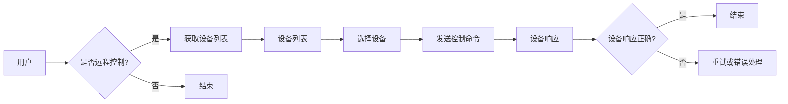

> MQTT协议, RESTful API, 智能家居, 远程控制, 安全模型, 通信协议, 安全认证, 网络架构

# 基于MQTT协议和RESTful API的智能家居远程控制安全模型

智能家居作为物联网(IoT)的重要组成部分，正在逐渐改变我们的生活方式。然而，随着智能家居设备的增多，如何确保这些设备的安全性和隐私性成为一个亟待解决的问题。本文将探讨基于MQTT协议和RESTful API的智能家居远程控制安全模型，旨在提供一个安全、高效、易用的智能家居解决方案。

## 1. 背景介绍

智能家居系统通常由多个智能设备组成，如智能门锁、智能灯光、智能温控等。这些设备通过网络连接到中心服务器或云平台，用户可以通过手机或其他设备远程控制这些设备。然而，传统的通信协议和接口设计往往缺乏安全性考虑，容易遭受黑客攻击和数据泄露的风险。

MQTT协议和RESTful API是两种流行的通信协议，分别适用于不同的场景。MQTT协议是一种轻量级的发布/订阅消息传递协议，适用于低功耗、低带宽的网络环境，适合智能家居设备的实时监控和控制。RESTful API则是一种基于HTTP的API设计风格，适用于构建可扩展的Web服务，适合智能家居设备的远程访问和管理。

## 2. 核心概念与联系

### 2.1 核心概念

#### MQTT协议

MQTT协议是一种基于发布/订阅模式的轻量级消息传递协议，它允许客户端发布消息到服务器上的主题，其他订阅了该主题的客户端可以接收这些消息。MQTT协议的特点包括：

- **轻量级**：MQTT协议的数据包格式简单，占用的网络带宽很小。
- **可靠传输**：MQTT协议支持消息确认，确保消息的可靠传输。
- **低功耗**：MQTT协议支持消息的压缩和离线消息存储，适合低功耗设备。
- **发布/订阅模式**：客户端可以订阅感兴趣的主题，服务器将相关消息推送到订阅者。

#### RESTful API

RESTful API是一种基于HTTP的API设计风格，它利用REST原则构建可扩展的Web服务。RESTful API的特点包括：

- **无状态**：服务器不保存客户端的任何状态。
- **简单性**：使用标准的HTTP方法，如GET、POST、PUT、DELETE等。
- **缓存**：客户端可以缓存请求结果，减少网络请求。
- **URI定位资源**：使用URI来定位资源，并使用HTTP方法来操作资源。

### 2.2 核心概念原理和架构的 Mermaid 流程图



## 3. 核心算法原理 & 具体操作步骤

### 3.1 算法原理概述

基于MQTT协议和RESTful API的智能家居远程控制安全模型主要涉及以下操作：

1. 设备连接到MQTT服务器，订阅感兴趣的主题。
2. 用户通过RESTful API向服务器发送控制命令。
3. 服务器将控制命令通过MQTT协议转发给相应的设备。
4. 设备执行控制命令并返回响应。
5. 服务器将设备响应通过RESTful API返回给用户。

### 3.2 算法步骤详解

1. **设备注册**：设备连接到MQTT服务器，并注册自身信息。
2. **用户认证**：用户通过RESTful API登录到服务器，进行身份认证。
3. **设备订阅**：用户通过RESTful API订阅感兴趣的主题，如设备状态更新。
4. **发送控制命令**：用户通过RESTful API向服务器发送控制命令。
5. **消息转发**：服务器将控制命令通过MQTT协议转发给对应的设备。
6. **设备响应**：设备执行控制命令并返回响应。
7. **消息通知**：服务器将设备响应通过RESTful API通知给用户。

### 3.3 算法优缺点

#### 优点

- **安全性**：通过MQTT协议和RESTful API的安全机制，如TLS加密、OAuth2.0认证等，确保通信安全。
- **可靠性**：MQTT协议支持消息确认，确保消息的可靠传输。
- **易用性**：RESTful API使用标准的HTTP方法，易于理解和开发。
- **可扩展性**：MQTT协议和RESTful API都是成熟的标准协议，具有良好的可扩展性。

#### 缺点

- **复杂性**：实现MQTT协议和RESTful API的安全性需要一定的技术难度。
- **性能开销**：加密通信会增加一定的性能开销。
- **部署难度**：需要部署MQTT服务器和RESTful API服务器。

### 3.4 算法应用领域

基于MQTT协议和RESTful API的智能家居远程控制安全模型适用于以下场景：

- 智能家居系统
- 物联网设备远程控制
- 云平台与设备之间的通信
- 分布式系统中的消息传递

## 4. 数学模型和公式 & 详细讲解 & 举例说明

### 4.1 数学模型构建

在智能家居远程控制安全模型中，我们可以使用以下数学模型来描述：

$$
\text{安全性} = f(\text{加密算法}, \text{认证机制}, \text{访问控制})
$$

其中，安全性是加密算法、认证机制和访问控制的函数。

### 4.2 公式推导过程

#### 加密算法

加密算法是确保通信安全的关键。常见的加密算法包括：

- **对称加密**：使用相同的密钥进行加密和解密，如AES。
- **非对称加密**：使用公钥和私钥进行加密和解密，如RSA。
- **哈希函数**：将输入数据映射到固定长度的输出值，如SHA-256。

#### 认证机制

认证机制用于验证用户和设备的身份。常见的认证机制包括：

- **用户名/密码**：用户通过用户名和密码登录系统。
- **OAuth2.0**：第三方授权框架，允许用户授权第三方应用访问其资源。

#### 访问控制

访问控制用于限制用户和设备对资源的访问。常见的访问控制策略包括：

- **基于角色的访问控制（RBAC）**：用户根据其角色被授予不同的权限。
- **基于属性的访问控制（ABAC）**：用户根据其属性被授予不同的权限。

### 4.3 案例分析与讲解

假设我们有一个智能家居系统，其中包含智能门锁、智能灯光和智能温控设备。用户通过手机APP远程控制这些设备。

1. 用户通过OAuth2.0认证机制登录到云平台。
2. 用户通过RESTful API订阅智能门锁的状态更新。
3. 用户通过RESTful API发送控制命令到云平台。
4. 云平台通过MQTT协议将控制命令发送到智能门锁。
5. 智能门锁执行控制命令并返回响应。
6. 云平台通过RESTful API将设备响应返回给用户。

在这个案例中，我们使用了TLS加密来保护通信安全，OAuth2.0认证机制来验证用户身份，以及RBAC策略来控制用户对设备的访问权限。

## 5. 项目实践：代码实例和详细解释说明

### 5.1 开发环境搭建

为了实现基于MQTT协议和RESTful API的智能家居远程控制安全模型，我们需要以下开发环境：

- MQTT服务器：如Mosquitto、EMQX等。
- RESTful API框架：如Flask、Django等。
- MQTT客户端库：如paho-mqtt、python-mqtt等。
- HTTPS库：如pyOpenSSL、requests等。

### 5.2 源代码详细实现

以下是一个简单的Python代码示例，展示了如何使用paho-mqtt库连接到MQTT服务器，并订阅主题：

```python
import paho.mqtt.client as mqtt

# 创建MQTT客户端实例
client = mqtt.Client()

# 连接到MQTT服务器
client.connect("mqtt.example.com", 1883, 60)

# 订阅主题
client.subscribe("home/lock/status")

# 处理订阅主题的消息
def on_message(client, userdata, message):
    print("Received message '" + str(message.payload) + "' on topic '" + message.topic + "' with QoS " + str(message.qos))

client.on_message = on_message

# 启动客户端循环
client.loop_forever()
```

### 5.3 代码解读与分析

上述代码首先导入了paho-mqtt库，并创建了MQTT客户端实例。然后，客户端连接到MQTT服务器，并订阅了主题"home/lock/status"。最后，定义了一个消息处理函数`on_message`，用于处理订阅主题的消息。

### 5.4 运行结果展示

当服务器发布消息到"home/lock/status"主题时，客户端将接收到消息并打印出来。

## 6. 实际应用场景

基于MQTT协议和RESTful API的智能家居远程控制安全模型可以应用于以下实际场景：

- **智能门锁**：用户可以通过手机APP远程控制门锁的开关，并实时查看门锁状态。
- **智能灯光**：用户可以通过手机APP远程控制灯光的开关、亮度调节和颜色设置。
- **智能温控**：用户可以通过手机APP远程控制空调、暖气等设备的温度调节。
- **家庭安全监控**：用户可以通过手机APP实时查看家庭监控摄像头的视频流，并远程控制摄像头的方向和焦距。

## 7. 工具和资源推荐

### 7.1 学习资源推荐

- MQTT官方网站：https://mqtt.org/
- RESTful API设计指南：https://restfulapi.net/
- Python MQTT客户端库：https://pypi.org/project/paho-mqtt/
- Python HTTPS库：https://pypi.org/project/requests/

### 7.2 开发工具推荐

- MQTT服务器：Mosquitto、EMQX
- RESTful API框架：Flask、Django
- Python MQTT客户端库：paho-mqtt
- HTTPS库：pyOpenSSL、requests

### 7.3 相关论文推荐

- "The Design of the MQTT Protocol"，Andy Stanford-Clark et al.
- "RESTful API Design Principles"，Tom Preston-Werner
- "Security in MQTT", MQTT.org

## 8. 总结：未来发展趋势与挑战

### 8.1 研究成果总结

本文介绍了基于MQTT协议和RESTful API的智能家居远程控制安全模型，探讨了其核心概念、原理、操作步骤和数学模型。通过实例分析和代码实现，展示了如何构建安全、高效、易用的智能家居远程控制系统。

### 8.2 未来发展趋势

随着物联网技术的不断发展，智能家居远程控制安全模型将呈现以下发展趋势：

- **更高安全性**：采用更先进的加密算法和认证机制，提高系统的安全性。
- **更智能的控制**：结合人工智能技术，实现更智能的设备控制和交互体验。
- **更广泛的应用**：将智能家居远程控制安全模型应用于更多领域，如工业自动化、智慧城市等。

### 8.3 面临的挑战

智能家居远程控制安全模型在发展过程中也面临以下挑战：

- **安全性**：随着攻击手段的不断升级，如何保证系统的安全性成为一个重要挑战。
- **兼容性**：如何确保不同设备和平台之间的兼容性。
- **用户体验**：如何提升用户的交互体验，使系统更加易于使用。

### 8.4 研究展望

未来，智能家居远程控制安全模型的研究将主要集中在以下几个方面：

- **安全性**：研究更安全的加密算法和认证机制，提高系统的抗攻击能力。
- **标准化**：推动智能家居远程控制安全模型的标准化，促进不同设备和平台之间的互联互通。
- **用户体验**：研究更智能、更人性化的交互方式，提升用户体验。

## 9. 附录：常见问题与解答

**Q1：MQTT协议和RESTful API如何保证通信的安全性？**

A：MQTT协议和RESTful API都支持TLS加密，可以保证通信过程中的数据安全。此外，还可以使用OAuth2.0等认证机制，确保只有授权用户才能访问系统。

**Q2：如何处理MQTT协议中的离线消息？**

A：MQTT协议支持离线消息存储，当设备离线时，服务器会存储消息，待设备重新上线后，将这些消息转发给设备。

**Q3：如何实现RESTful API的安全认证？**

A：可以使用OAuth2.0等认证机制，对用户进行身份验证和授权。此外，还可以使用JWT等令牌机制，实现无状态的认证。

**Q4：如何实现智能家居设备的远程控制？**

A：设备连接到MQTT服务器，订阅感兴趣的主题。用户通过RESTful API向服务器发送控制命令，服务器将命令通过MQTT协议转发给设备，设备执行命令并返回响应。

作者：禅与计算机程序设计艺术 / Zen and the Art of Computer Programming