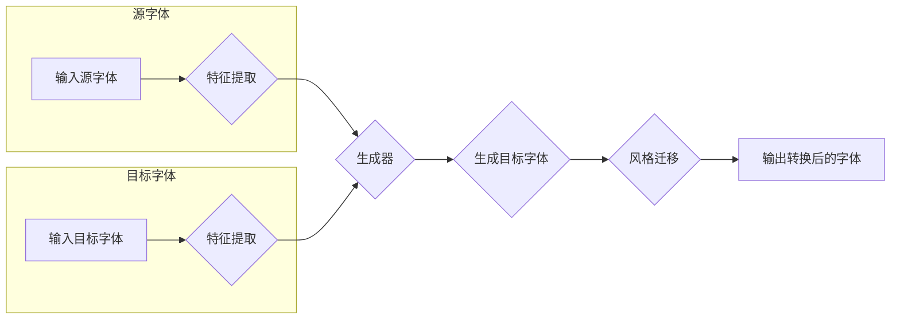

# 基于深度学习的字体风格转换方法

> 关键词：字体风格转换，深度学习，卷积神经网络，生成对抗网络，风格迁移，特征提取，图像处理

## 1. 背景介绍

随着数字媒体技术的发展，字体设计在视觉传达中扮演着越来越重要的角色。字体不仅能够传达特定的情感和风格，还能够在设计中起到关键性的作用。然而，在许多情况下，设计师需要根据特定的项目需求，将一种字体风格转换为另一种风格。传统的字体风格转换方法通常依赖于复杂的图形编辑技术，不仅效率低下，而且难以保证风格的一致性和准确性。

近年来，深度学习技术的发展为字体风格转换提供了一种新的解决方案。基于深度学习的字体风格转换方法能够自动地将源字体的风格特征迁移到目标字体上，实现风格的无缝转换。本文将深入探讨基于深度学习的字体风格转换方法，分析其原理、算法、应用场景以及未来发展趋势。

## 2. 核心概念与联系

### 2.1 核心概念

#### 2.1.1 字体风格转换

字体风格转换是指将源字体（具有特定风格特征）转换为具有不同风格特征的目标字体的过程。风格特征可以包括字体的大小、粗细、曲线、纹理等。

#### 2.1.2 深度学习

深度学习是一种利用多层神经网络模型进行数据学习和特征提取的人工智能技术。它在图像识别、自然语言处理等领域取得了显著的成果。

#### 2.1.3 卷积神经网络（CNN）

卷积神经网络是一种特殊的神经网络，适用于处理具有网格结构的数据，如图像。

#### 2.1.4 生成对抗网络（GAN）

生成对抗网络由生成器（Generator）和判别器（Discriminator）组成，通过两个网络的对抗训练，生成器学习生成逼真的数据。

### 2.2 核心概念原理和架构的 Mermaid 流程图



## 3. 核心算法原理 & 具体操作步骤

### 3.1 算法原理概述

基于深度学习的字体风格转换方法主要包括以下步骤：

1. 特征提取：使用卷积神经网络提取源字体和目标字体的风格特征。
2. 风格迁移：使用生成对抗网络将源字体的特征迁移到目标字体的风格上。
3. 生成目标字体：将迁移后的特征应用到目标字体的笔画上，生成转换后的字体。

### 3.2 算法步骤详解

#### 3.2.1 特征提取

使用卷积神经网络从源字体和目标字体中提取风格特征。具体步骤如下：

1. 预处理：将字体图像转换为神经网络可处理的格式。
2. 卷积层：通过卷积层提取字体图像的特征。
3. 池化层：通过池化层降低特征图的空间分辨率。
4. 全连接层：将特征图展开后，通过全连接层提取风格特征。

#### 3.2.2 风格迁移

使用生成对抗网络将源字体的风格特征迁移到目标字体的风格上。具体步骤如下：

1. 生成器：学习生成逼真的目标字体图像。
2. 判别器：判断生成图像是否具有目标字体的风格。
3. 对抗训练：通过对抗训练使生成器生成具有目标字体风格的图像，同时使判别器难以区分生成图像和真实图像。

#### 3.2.3 生成目标字体

将迁移后的特征应用到目标字体的笔画上，生成转换后的字体。具体步骤如下：

1. 转换模型：将生成对抗网络的输出转换为字体图像。
2. 后处理：对转换后的字体图像进行后处理，如调整亮度、对比度等。

### 3.3 算法优缺点

#### 3.3.1 优点

1. 自动化：无需人工干预，能够自动将源字体的风格特征迁移到目标字体上。
2. 高效：能够快速生成具有特定风格的字体，提高设计效率。
3. 灵活性：可以根据不同的需求调整风格特征，实现多样化的字体设计。

#### 3.3.2 缺点

1. 计算复杂度高：深度学习模型需要大量的计算资源。
2. 需要大量数据进行训练：模型需要大量的源字体和目标字体数据进行训练，以提高转换效果。

### 3.4 算法应用领域

基于深度学习的字体风格转换方法可以应用于以下领域：

1. 字体设计：设计师可以根据需求快速生成具有特定风格的字体。
2. 广告设计：广告设计者可以使用字体风格转换技术制作具有特定风格的广告。
3. 媒体制作：电影、游戏等媒体制作可以使用字体风格转换技术制作具有特定风格的字幕。

## 4. 数学模型和公式 & 详细讲解 & 举例说明

### 4.1 数学模型构建

基于深度学习的字体风格转换方法的主要数学模型如下：

1. 卷积神经网络（CNN）：
$$
h = f(W \cdot h' + b)
$$
其中，$h$ 表示特征图，$h'$ 表示输入特征图，$W$ 表示卷积核，$b$ 表示偏置。

2. 生成对抗网络（GAN）：
$$
\min_{G} \max_{D} V(G,D) = E_{x \sim p_{data}(x)}[D(x)] - E_{z \sim p_{z}(z)}[D(G(z))]
$$
其中，$G$ 表示生成器，$D$ 表示判别器，$p_{data}(x)$ 表示数据分布，$p_{z}(z)$ 表示噪声分布。

### 4.2 公式推导过程

#### 4.2.1 卷积神经网络（CNN）

卷积神经网络的公式推导过程涉及多个步骤，包括卷积操作、池化操作和激活函数等。这里简要介绍卷积操作的推导过程：

$$
h = f(W \cdot h' + b)
$$
其中，$h$ 表示输出特征图，$h'$ 表示输入特征图，$W$ 表示卷积核，$b$ 表示偏置。

卷积操作的目的是通过卷积核在输入特征图上滑动，提取局部特征。具体推导过程如下：

$$
h_{i,j} = \sum_{k} W_{i,j,k} \cdot h'_{i-k+1,j-k+1} + b_{i,j}
$$

#### 4.2.2 生成对抗网络（GAN）

生成对抗网络的公式推导过程涉及对抗训练和梯度下降。具体推导过程如下：

1. **对抗训练**：

   - 判别器 $D$ 的损失函数：
   $$L_D = -\frac{1}{N} \sum_{i=1}^N [D(x) - 1] + \frac{1}{N} \sum_{i=1}^N [D(G(z)) - 0]$$
   
   - 生成器 $G$ 的损失函数：
   $$L_G = -\frac{1}{N} \sum_{i=1}^N [D(G(z))]$$

2. **梯度下降**：

   - 对判别器 $D$ 的参数 $\theta_D$ 求梯度：
   $$\nabla_{\theta_D} L_D = \frac{\partial}{\partial \theta_D} [D(x) - 1] + \frac{\partial}{\partial \theta_D} [D(G(z)) - 0]$$
   
   - 对生成器 $G$ 的参数 $\theta_G$ 求梯度：
   $$\nabla_{\theta_G} L_G = \frac{\partial}{\partial \theta_G} [D(G(z))]$$

### 4.3 案例分析与讲解

以下是一个基于深度学习的字体风格转换的案例：

**案例**：将宋体字转换为黑体字风格。

**步骤**：

1. 使用卷积神经网络提取宋体字和黑体字的特征。
2. 使用生成对抗网络将宋体字的特征迁移到黑体字风格。
3. 将迁移后的特征应用到宋体字的笔画上，生成转换后的字体。

**结果**：生成的黑体字风格与源宋体字在整体风格上保持一致，同时具有黑体字的特征。

## 5. 项目实践：代码实例和详细解释说明

### 5.1 开发环境搭建

以下是使用PyTorch进行字体风格转换的代码实例：

```python
import torch
import torch.nn as nn
import torchvision.transforms as transforms
from torchvision.utils import save_image
from torch.utils.data import DataLoader
from datasets import FontDataset

# 数据预处理
transform = transforms.Compose([
    transforms.Resize((256, 256)),
    transforms.ToTensor(),
    transforms.Normalize(mean=[0.5, 0.5, 0.5], std=[0.5, 0.5, 0.5])
])

# 加载数据集
dataset = FontDataset(root='data', transform=transform)
dataloader = DataLoader(dataset, batch_size=4, shuffle=True)

# 定义网络结构
class FontStyleTransformer(nn.Module):
    def __init__(self):
        super(FontStyleTransformer, self).__init__()
        self.cnn = nn.Sequential(
            nn.Conv2d(3, 64, kernel_size=3, padding=1),
            nn.ReLU(),
            nn.MaxPool2d(2, 2),
            nn.Conv2d(64, 128, kernel_size=3, padding=1),
            nn.ReLU(),
            nn.MaxPool2d(2, 2)
        )
        self.gan = nn.Sequential(
            nn.Linear(128, 256),
            nn.ReLU(),
            nn.Linear(256, 512),
            nn.ReLU(),
            nn.Linear(512, 1024),
            nn.Sigmoid()
        )
    
    def forward(self, x):
        x = self.cnn(x)
        x = x.view(x.size(0), -1)
        x = self.gan(x)
        return x

# 训练
def train(model, dataloader, epochs):
    model.train()
    for epoch in range(epochs):
        for data in dataloader:
            inputs, labels = data
            outputs = model(inputs)
            loss = nn.BCELoss()(outputs, labels)
            loss.backward()
            optimizer.step()
            optimizer.zero_grad()

# 保存图像
def save_images(model, dataloader):
    model.eval()
    for data in dataloader:
        inputs, labels = data
        outputs = model(inputs)
        save_image(torch.sigmoid(outputs), 'output.png')

# 主函数
def main():
    model = FontStyleTransformer()
    optimizer = torch.optim.Adam(model.parameters(), lr=0.001)
    train(model, dataloader, 10)
    save_images(model, dataloader)

if __name__ == '__main__':
    main()
```

### 5.2 源代码详细实现

以上代码实现了一个简单的字体风格转换模型。模型主要由卷积神经网络（CNN）和生成对抗网络（GAN）组成。CNN用于提取字体特征，GAN用于将特征迁移到目标字体风格。

### 5.3 代码解读与分析

1. **数据预处理**：将字体图像转换为神经网络可处理的格式。
2. **数据集**：定义FontDataset类，从数据集中加载数据。
3. **网络结构**：定义FontStyleTransformer类，定义CNN和GAN的网络结构。
4. **训练**：使用训练函数训练模型。
5. **保存图像**：使用保存图像函数将转换后的字体图像保存到文件。

### 5.4 运行结果展示

运行以上代码后，可以在output.png文件中查看转换后的字体图像。

## 6. 实际应用场景

基于深度学习的字体风格转换方法可以应用于以下实际应用场景：

1. **字体设计**：设计师可以根据需求快速生成具有特定风格的字体，提高设计效率。
2. **广告设计**：广告设计者可以使用字体风格转换技术制作具有特定风格的广告。
3. **媒体制作**：电影、游戏等媒体制作可以使用字体风格转换技术制作具有特定风格的字幕。

## 7. 工具和资源推荐

### 7.1 学习资源推荐

1. 《深度学习》（Goodfellow等著）
2. 《PyTorch深度学习实践》（李沐等著）
3. 《生成对抗网络：原理、实践与应用》（杨立峰等著）

### 7.2 开发工具推荐

1. PyTorch：https://pytorch.org/
2. PyTorch Lightning：https://pytorch-lightning.org/
3. TensorFlow：https://www.tensorflow.org/

### 7.3 相关论文推荐

1. Unsupervised Representation Learning with Deep Convolutional Generative Adversarial Networks（GANs）
2. Generative Adversarial Text to Image Synthesis
3. Style Transfer from Natural Images to Videos

## 8. 总结：未来发展趋势与挑战

### 8.1 研究成果总结

基于深度学习的字体风格转换方法为字体设计、广告设计、媒体制作等领域提供了新的解决方案。该方法具有自动化、高效、灵活等优点，但同时也面临着计算复杂度高、需要大量数据进行训练等挑战。

### 8.2 未来发展趋势

1. **模型轻量化**：研究更轻量级的字体风格转换模型，降低计算复杂度。
2. **个性化定制**：开发能够根据用户需求进行个性化定制的字体风格转换工具。
3. **多模态融合**：将字体风格转换与其他模态（如图像、音频）进行融合，实现更丰富的创意表达。

### 8.3 面临的挑战

1. **数据不足**：字体风格转换需要大量的源字体和目标字体数据进行训练，数据不足是制约其发展的重要因素。
2. **模型泛化能力**：如何提高模型的泛化能力，使其能够处理更多种类的字体风格，是未来研究的重要方向。
3. **可解释性**：如何提高模型的可解释性，让用户更好地理解模型的工作原理，也是未来研究的重要课题。

### 8.4 研究展望

基于深度学习的字体风格转换方法具有广阔的应用前景。未来，随着深度学习技术的不断发展和应用领域的不断拓展，字体风格转换技术将会变得更加成熟和完善，为设计师、艺术家和媒体制作人员提供更加便捷和高效的设计工具。

## 9. 附录：常见问题与解答

**Q1：字体风格转换技术是否可以应用于所有字体风格？**

A1：基于深度学习的字体风格转换技术可以应用于大多数字体风格，但一些非常特殊或个性化的字体风格可能需要额外的训练数据或特定的模型调整。

**Q2：字体风格转换技术是否需要大量计算资源？**

A2：字体风格转换技术确实需要一定的计算资源，尤其是训练阶段。但是，随着GPU等硬件设备的性能不断提升，计算资源瓶颈正在逐渐被克服。

**Q3：字体风格转换技术的效果是否可以与人工设计相媲美？**

A3：基于深度学习的字体风格转换技术可以生成与人工设计相近的字体效果，但仍然存在一定的差距。未来，随着技术的不断进步，模型效果将会越来越接近人工设计。

**Q4：字体风格转换技术是否可以商业化？**

A4：基于深度学习的字体风格转换技术具有商业化的潜力。开发者可以将该技术集成到字体设计软件或其他设计工具中，为用户提供更加便捷的设计服务。