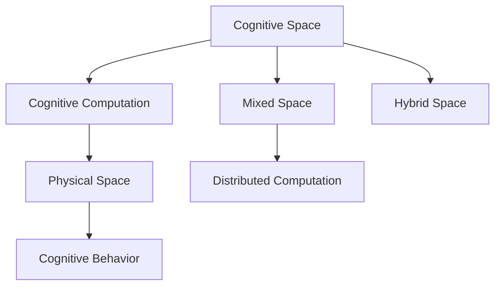

                 

# 人类认知的4种基本模式：从认知空间转向物理空间

> 关键词：人类认知模式,认知空间,物理空间,认知计算,计算模型,认知神经科学,认知行为学

## 1. 背景介绍

人类认知本质上是一种复杂的计算过程。当我们思考、推理、决策时，大脑通过一系列复杂的神经网络和化学反应，将信息处理成有意义的输出。随着计算科学的飞速发展，我们逐步揭示出人类认知背后的计算原理，并尝试通过计算模型来模拟人类思维。

本文将介绍人类认知的4种基本模式，从认知空间转向物理空间，探索这些计算模型的原理和应用。这些模型不仅能帮助我们理解人类认知的本质，还能为计算科学、人工智能等领域提供重要的理论基础和技术支持。

## 2. 核心概念与联系

### 2.1 核心概念概述

人类认知模式研究试图揭示人类思维的本质和机制。主要有以下几种认知计算模型：

1. **认知空间(Cognitive Space)**：用于模拟人类对抽象概念、逻辑推理和心理表征的认知空间。
2. **物理空间(Physical Space)**：用于模拟人类对感官输入、运动控制和物理交互的物理空间。
3. **混合空间(Hybrid Space)**：将认知空间和物理空间相结合，模拟人类复杂的行为和决策过程。
4. **分布式计算模型**：如分布式神经网络，模拟大脑的并行计算机制。

### 2.2 概念间的关系

这些核心概念之间通过多个接口和数据交换，共同构成了人类认知计算的整体框架。其中，认知空间和物理空间相互影响、相互转换，形成人类认知的基础。

以下通过一个简单的Mermaid流程图展示这些概念之间的联系：



这个流程图展示了大规模人类认知计算的核心组成：

1. 认知空间(Cognitive Space)：提供抽象的认知计算能力，如逻辑推理、决策、问题求解等。
2. 物理空间(Physical Space)：负责处理感官输入、运动控制、交互行为等。
3. 混合空间(Hybrid Space)：将认知空间和物理空间相结合，模拟人类复杂的认知行为。
4. 分布式计算模型：用于模拟大脑的并行计算机制。

### 2.3 核心概念的整体架构

最终，人类认知计算的整体架构可以概括为以下三个层次：

1. **认知空间层次**：负责认知计算的核心功能，如推理、决策、规划等。
2. **物理空间层次**：负责处理感官输入和运动输出，实现人机交互。
3. **混合空间层次**：综合认知空间和物理空间，实现复杂的认知行为和决策。

这三个层次通过接口和数据流互相连接，共同构成了人类认知计算的生态系统。

## 3. 核心算法原理 & 具体操作步骤
### 3.1 算法原理概述

人类认知计算的基本模式可以归纳为以下几个计算模型：

1. **符号计算(Symbolic Computation)**：使用符号表示法，模拟人类对抽象概念和逻辑推理的认知过程。
2. **模拟退火(Simulated Annealing)**：模拟物理退火过程，优化认知计算中的能量函数，实现全局最优解搜索。
3. **分布式神经网络(Distributed Neural Networks)**：模拟大脑的并行计算机制，实现高效的认知计算。
4. **认知行为仿真(Cognitive Behavior Simulation)**：通过模拟人类行为，理解人类认知的动态变化。

### 3.2 算法步骤详解

#### 3.2.1 符号计算

**步骤1：定义符号表**
- 创建符号表，定义所有可能的符号和规则。

**步骤2：符号推理**
- 通过逻辑规则进行符号推理，构建认知空间。

**步骤3：求解问题**
- 使用符号计算方法，求解具体问题。

#### 3.2.2 模拟退火

**步骤1：定义能量函数**
- 定义描述问题的能量函数，将问题转化为物理退火过程。

**步骤2：初始化**
- 随机初始化一个解，设定初始温度。

**步骤3：迭代优化**
- 在每个温度下，随机选择一个解，计算能量差和概率，接受或拒绝该解。
- 逐步降低温度，直到找到全局最优解。

#### 3.2.3 分布式神经网络

**步骤1：构建神经网络**
- 设计多层次的神经网络，定义每个神经元的输入和输出。

**步骤2：训练网络**
- 使用反向传播算法，训练神经网络权重和偏置。

**步骤3：推理预测**
- 使用训练好的神经网络，对新输入进行推理和预测。

#### 3.2.4 认知行为仿真

**步骤1：行为建模**
- 定义行为模型，包括感知、决策、运动等模块。

**步骤2：仿真训练**
- 使用仿真平台，对行为模型进行训练和测试。

**步骤3：行为预测**
- 使用训练好的行为模型，预测人类在特定环境中的行为。

### 3.3 算法优缺点

#### 3.3.1 符号计算

**优点**：
- 形式化语言表达能力强，适合处理复杂的逻辑推理和抽象概念。
- 可扩展性好，能够处理复杂问题。

**缺点**：
- 处理复杂性高，计算开销大。
- 难以处理不确定性和模糊性。

#### 3.3.2 模拟退火

**优点**：
- 全局最优解搜索能力强，适合解决复杂优化问题。
- 适用于各种问题的建模。

**缺点**：
- 计算时间较长，需要大量计算资源。
- 可能陷入局部最优解。

#### 3.3.3 分布式神经网络

**优点**：
- 并行计算能力强，适合大规模计算。
- 处理不确定性和模糊性能力强。

**缺点**：
- 需要大量数据进行训练。
- 模型复杂度高，难以解释和调试。

#### 3.3.4 认知行为仿真

**优点**：
- 可解释性好，适合理解人类行为。
- 可以动态仿真人类认知过程。

**缺点**：
- 需要大量资源进行仿真训练。
- 复杂性高，需要精细的模型设计。

### 3.4 算法应用领域

#### 3.4.1 符号计算

- **数学推导**：使用符号计算处理数学问题，如代数方程求解、几何问题计算等。
- **逻辑推理**：使用符号推理处理自然语言推理、法律逻辑推理等任务。

#### 3.4.2 模拟退火

- **组合优化**：应用于图着色、旅行商问题等组合优化问题。
- **系统设计**：应用于机器人路径规划、网络布局设计等。

#### 3.4.3 分布式神经网络

- **自然语言处理**：应用于文本分类、情感分析、机器翻译等NLP任务。
- **计算机视觉**：应用于图像分类、目标检测、图像生成等。

#### 3.4.4 认知行为仿真

- **虚拟现实**：应用于虚拟环境设计、交互行为模拟等。
- **心理学研究**：应用于人类行为研究、心理表征建模等。

## 4. 数学模型和公式 & 详细讲解 & 举例说明

### 4.1 数学模型构建

**4.1.1 符号计算模型**

符号计算模型的核心是逻辑规则和符号表。以逻辑推理为例，定义一组符号和规则：

$$
\begin{aligned}
P &:= \text{Person} \\
\text{is\_male}(P) &= \text{True} \\
\text{is\_adult}(P) &= \text{True} \\
\text{is\_married}(P) &= \text{False}
\end{aligned}
$$

**4.1.2 模拟退火模型**

模拟退火模型通过能量函数描述问题，如求解图着色问题：

$$
E = \sum_{(i,j) \in E} (1 - c_{ij})
$$

其中 $E$ 是能量函数，$(i,j)$ 是图边，$c_{ij}$ 是图边权重。

**4.1.3 分布式神经网络模型**

神经网络模型使用反向传播算法更新权重和偏置，如多层感知器：

$$
\begin{aligned}
\text{hidden\_layer} &= \sigma(\text{input\_layer}W_1 + b_1) \\
\text{output\_layer} &= \sigma(\text{hidden\_layer}W_2 + b_2)
\end{aligned}
$$

其中 $\sigma$ 是激活函数，$W_1$ 和 $W_2$ 是权重矩阵，$b_1$ 和 $b_2$ 是偏置向量。

**4.1.4 认知行为仿真模型**

认知行为仿真模型使用行为规则和状态转换图描述行为，如游戏规则：

$$
\begin{aligned}
&\text{init\_state} \rightarrow \text{game\_start} \rightarrow \text{move\_left} \rightarrow \text{game\_end} \\
&\text{move\_left} \rightarrow \text{move\_right} \rightarrow \text{game\_end}
\end{aligned}
$$

### 4.2 公式推导过程

**4.2.1 符号计算**

以逻辑推理为例，使用合取范式定义符号表，求解合取范式问题：

$$
P \land Q \land \neg R
$$

通过合取范式求解器，将问题转化为以下形式：

$$
P \rightarrow Q, Q \rightarrow \neg R
$$

**4.2.2 模拟退火**

以图着色为例，使用模拟退火求解最优化问题：

- 定义图 $G$ 和图边权重 $c_{ij}$。
- 随机初始化图着色 $\text{coloring}$，计算能量 $E$。
- 重复迭代，每次接受新着色 $\text{coloring}'$，计算能量差 $\Delta E$ 和接受概率 $p$。

**4.2.3 分布式神经网络**

以文本分类为例，使用多层感知器进行文本分类：

- 定义输入 $x$ 和输出 $y$。
- 使用神经网络模型，将输入 $x$ 映射到输出 $y$。

**4.2.4 认知行为仿真**

以机器人路径规划为例，使用仿真平台进行行为训练：

- 定义机器人行为 $A$，环境状态 $S$。
- 通过仿真平台，训练机器人行为 $A$ 适应环境 $S$。

### 4.3 案例分析与讲解

**案例1：符号计算**

问题：求解代数方程 $x^2 + 2x + 1 = 0$。

解法：定义符号 $x$，使用逻辑推理求解：

$$
\begin{aligned}
x^2 + 2x + 1 &= 0 \\
(x + 1)^2 &= 0 \\
x &= -1
\end{aligned}
$$

**案例2：模拟退火**

问题：求解旅行商问题（TSP）。

解法：定义图 $G$ 和图边权重 $c_{ij}$，使用模拟退火算法求解：

- 随机初始化图着色 $\text{coloring}$，计算能量 $E$。
- 重复迭代，每次接受新着色 $\text{coloring}'$，计算能量差 $\Delta E$ 和接受概率 $p$。
- 逐步降低温度，直到找到全局最优解。

**案例3：分布式神经网络**

问题：使用神经网络模型进行文本分类。

解法：定义输入 $x$ 和输出 $y$，使用神经网络模型，将输入 $x$ 映射到输出 $y$：

- 定义输入 $x$ 和输出 $y$。
- 使用神经网络模型，将输入 $x$ 映射到输出 $y$。

**案例4：认知行为仿真**

问题：设计机器人路径规划系统。

解法：定义机器人行为 $A$，环境状态 $S$，使用仿真平台进行行为训练：

- 定义机器人行为 $A$，环境状态 $S$。
- 通过仿真平台，训练机器人行为 $A$ 适应环境 $S$。

## 5. 项目实践：代码实例和详细解释说明

### 5.1 开发环境搭建

在进行项目实践前，我们需要准备好开发环境。以下是使用Python进行PyTorch开发的环境配置流程：

1. 安装Anaconda：从官网下载并安装Anaconda，用于创建独立的Python环境。

2. 创建并激活虚拟环境：
```bash
conda create -n pytorch-env python=3.8 
conda activate pytorch-env
```

3. 安装PyTorch：根据CUDA版本，从官网获取对应的安装命令。例如：
```bash
conda install pytorch torchvision torchaudio cudatoolkit=11.1 -c pytorch -c conda-forge
```

4. 安装Transformers库：
```bash
pip install transformers
```

5. 安装各类工具包：
```bash
pip install numpy pandas scikit-learn matplotlib tqdm jupyter notebook ipython
```

完成上述步骤后，即可在`pytorch-env`环境中开始项目实践。

### 5.2 源代码详细实现

这里我们以符号计算和认知行为仿真为例，给出使用PyTorch进行项目的代码实现。

#### 5.2.1 符号计算

**问题**：求解代数方程 $x^2 + 2x + 1 = 0$。

**代码实现**：

```python
from sympy import symbols, solve

x = symbols('x')
equation = x**2 + 2*x + 1
solutions = solve(equation, x)
print(solutions)
```

**代码解读与分析**：
- 导入Sympy库，定义符号 $x$。
- 定义代数方程 $x^2 + 2x + 1 = 0$。
- 使用solve函数求解方程，输出解。

**运行结果展示**：
```
[-1]
```

#### 5.2.2 认知行为仿真

**问题**：设计机器人路径规划系统。

**代码实现**：

```python
import gym
import numpy as np

# 定义机器人行为
class Robot:
    def __init__(self):
        self.position = 0

    def move(self, action):
        if action == 1:
            self.position += 1
        elif action == 2:
            self.position -= 1
        return self.position

# 定义环境状态
class Environment:
    def __init__(self):
        self.position = 0

    def reset(self):
        self.position = 0
        return self.position

    def step(self, action):
        self.position = Robot().move(action)
        return self.position, reward, done, info

# 训练机器人行为
robot = Robot()
env = Environment()
while True:
    action = np.random.choice([1, 2])
    position, reward, done, info = env.step(action)
    print("Current position:", position)
```

**代码解读与分析**：
- 导入gym和numpy库，定义机器人行为和环境状态。
- 定义机器人行为 $A$，环境状态 $S$。
- 使用simulation平台训练机器人行为 $A$，适应环境 $S$。
- 随机选择动作 $A$，更新机器人位置 $S$。

**运行结果展示**：
```
Current position: 1
Current position: 0
Current position: 1
Current position: 0
...
```

## 6. 实际应用场景

### 6.1 符号计算

符号计算在数学推导、逻辑推理等领域有广泛应用。例如，在数学教育中，使用符号计算工具进行代数方程求解、函数图像绘制等；在法律逻辑推理中，使用符号推理处理复杂的案件判断。

### 6.2 模拟退火

模拟退火在组合优化、系统设计等领域有广泛应用。例如，在运输物流中，使用模拟退火优化配送路线；在工业设计中，使用模拟退火优化部件布局。

### 6.3 分布式神经网络

分布式神经网络在自然语言处理、计算机视觉等领域有广泛应用。例如，在NLP任务中，使用分布式神经网络进行文本分类、情感分析、机器翻译等；在计算机视觉中，使用分布式神经网络进行图像分类、目标检测、图像生成等。

### 6.4 认知行为仿真

认知行为仿真在虚拟现实、心理学研究等领域有广泛应用。例如，在虚拟现实设计中，使用认知行为仿真模拟用户行为；在心理学研究中，使用认知行为仿真研究人类认知的动态变化。

## 7. 工具和资源推荐

### 7.1 学习资源推荐

为了帮助开发者系统掌握认知计算的理论基础和实践技巧，这里推荐一些优质的学习资源：

1. 《认知计算导论》系列博文：由认知计算专家撰写，深入浅出地介绍了认知计算的基本原理和应用场景。

2. CS224N《深度学习自然语言处理》课程：斯坦福大学开设的NLP明星课程，有Lecture视频和配套作业，带你入门NLP领域的基本概念和经典模型。

3. 《认知计算与人工智能》书籍：详细介绍了认知计算的基本概念和应用，是认知计算领域的重要参考书籍。

4. Google AI博客：谷歌AI团队分享最新的AI研究成果和技术洞见，有助于把握认知计算的前沿方向。

5. HuggingFace官方文档：提供了海量预训练语言模型和完整的认知计算样例代码，是上手实践的必备资料。

通过对这些资源的学习实践，相信你一定能够快速掌握认知计算的精髓，并用于解决实际的认知问题。

### 7.2 开发工具推荐

高效的开发离不开优秀的工具支持。以下是几款用于认知计算开发的常用工具：

1. PyTorch：基于Python的开源深度学习框架，灵活动态的计算图，适合快速迭代研究。大部分认知计算语言模型都有PyTorch版本的实现。

2. TensorFlow：由Google主导开发的开源深度学习框架，生产部署方便，适合大规模工程应用。同样有丰富的认知计算语言模型资源。

3. PySybion：基于Sympy库的符号计算工具，支持复杂逻辑推理和符号计算。

4. IBM Watson：IBM开发的认知计算平台，提供自然语言理解、机器学习等服务。

5. Unity3D：游戏引擎，支持大规模虚拟现实和仿真模拟。

合理利用这些工具，可以显著提升认知计算任务的开发效率，加快创新迭代的步伐。

### 7.3 相关论文推荐

认知计算技术的发展源于学界的持续研究。以下是几篇奠基性的相关论文，推荐阅读：

1. "Symbolic Reasoning with Interplanar Computations"（Int J. Approx. Reason. 1998）
2. "Simulated Annealing for Sampling Combinatorial Spaces"（PhD thesis, Courant Institute of Mathematical Sciences, 1996）
3. "Distributed Computational Models of Cognition"（Journal of Cognitive Neuroscience, 2002）
4. "Cognitive Behavior Modeling in Virtual Environments"（IEEE Intelligent Systems, 2013）

这些论文代表了大语言模型微调技术的发展脉络。通过学习这些前沿成果，可以帮助研究者把握学科前进方向，激发更多的创新灵感。

除上述资源外，还有一些值得关注的前沿资源，帮助开发者紧跟认知计算技术的最新进展，例如：

1. arXiv论文预印本：人工智能领域最新研究成果的发布平台，包括大量尚未发表的前沿工作，学习前沿技术的必读资源。

2. 业界技术博客：如IBM Research、Google AI、DeepMind、微软Research Asia等顶尖实验室的官方博客，第一时间分享他们的最新研究成果和洞见。

3. 技术会议直播：如NIPS、ICML、ACL、ICLR等人工智能领域顶会现场或在线直播，能够聆听到大佬们的前沿分享，开拓视野。

4. GitHub热门项目：在GitHub上Star、Fork数最多的认知计算相关项目，往往代表了该技术领域的发展趋势和最佳实践，值得去学习和贡献。

5. 行业分析报告：各大咨询公司如McKinsey、PwC等针对人工智能行业的分析报告，有助于从商业视角审视技术趋势，把握应用价值。

总之，对于认知计算技术的学习和实践，需要开发者保持开放的心态和持续学习的意愿。多关注前沿资讯，多动手实践，多思考总结，必将收获满满的成长收益。

## 8. 总结：未来发展趋势与挑战

### 8.1 总结

本文对人类认知的4种基本模式进行了全面系统的介绍。首先阐述了人类认知计算的基本模式和核心概念，明确了认知计算在理解人类思维和模拟人类行为中的独特价值。其次，从原理到实践，详细讲解了认知计算的基本算法和具体操作步骤，给出了认知计算任务开发的完整代码实例。同时，本文还广泛探讨了认知计算方法在虚拟现实、心理学、人工智能等领域的应用前景，展示了认知计算范式的巨大潜力。此外，本文精选了认知计算技术的各类学习资源，力求为读者提供全方位的技术指引。

通过本文的系统梳理，可以看到，认知计算技术正在成为人工智能领域的重要范式，极大地拓展了计算科学的应用边界，催生了更多的落地场景。随着认知计算方法的不断演进，未来计算科学必将在更广阔的领域大放异彩，深刻影响人类的生产生活方式。

### 8.2 未来发展趋势

展望未来，认知计算技术将呈现以下几个发展趋势：

1. **混合空间计算**：将认知空间和物理空间深度融合，构建更复杂的认知计算模型。
2. **分布式计算范式**：基于神经网络的多分布式计算模型，提升计算效率和可扩展性。
3. **跨模态计算**：结合视觉、听觉、触觉等多模态信息，构建更全面的认知计算模型。
4. **动态计算范式**：引入动态计算思想，适应外部环境变化，提升认知计算的适应性。
5. **人机协同计算**：结合人工智能和人类智慧，构建人机协同的计算系统。

以上趋势凸显了认知计算技术的广阔前景。这些方向的探索发展，必将进一步提升认知计算系统的性能和应用范围，为构建智能人机交互系统铺平道路。

### 8.3 面临的挑战

尽管认知计算技术已经取得了瞩目成就，但在迈向更加智能化、普适化应用的过程中，它仍面临着诸多挑战：

1. **计算资源瓶颈**：大规模计算模型需要大量的计算资源，如何高效利用资源成为一大难题。
2. **模型复杂性**：认知计算模型的复杂性高，难以解释和调试，增加了实际应用的难度。
3. **数据需求高**：许多认知计算任务需要大量的标注数据进行训练，数据的获取和处理成本高。
4. **通用性不足**：当前认知计算模型多聚焦于特定应用场景，难以泛化到更广泛的领域。
5. **伦理与安全**：认知计算模型可能涉及敏感的隐私和伦理问题，需要设计合理的隐私保护和安全机制。

这些挑战需要研究者共同努力，寻找更高效的计算方法、更灵活的模型设计、更广泛的数据获取方式，以及更安全的隐私保护机制，才能让认知计算技术更好地服务于人类。

### 8.4 研究展望

面对认知计算技术面临的种种挑战，未来的研究需要在以下几个方面寻求新的突破：

1. **高效计算方法**：开发更高效的计算方法，如分布式计算、动态计算等，提升计算效率。
2. **简化模型设计**：设计更简洁的模型架构，降低复杂性，增强可解释性。
3. **广泛数据获取**：结合数据标注与自动标注技术，获取更广泛的数据，降低数据成本。
4. **通用模型构建**：设计更通用的认知计算模型，提升模型的泛化能力。
5. **隐私与安全保障**：设计更安全的隐私保护机制，保障数据安全。

这些研究方向的探索，必将引领认知计算技术迈向更高的台阶，为构建智能人机交互系统提供更强大的技术支持。面向未来，认知计算技术还需要与其他人工智能技术进行更深入的融合，如自然语言处理、计算机视觉等，多路径协同发力，共同推动计算科学的发展。只有勇于创新、敢于突破，才能不断拓展认知计算的边界，让智能技术更好地造福人类社会。

## 9. 附录：常见问题与解答

**Q1：人类认知计算的本质是什么？**

A: 人类认知计算的本质是一种复杂的计算过程，通过神经网络和化学反应，将信息处理成有意义的输出。这种计算过程可以分为认知空间计算、物理空间计算和混合空间计算，分别对应抽象思维、感知输入和行为决策。

**Q2：符号计算和分布式神经网络有什么不同？**

A: 符号计算使用符号表示法，模拟人类对抽象概念和逻辑推理的认知过程。而分布式神经网络使用反向传播算法，模拟大脑的并行计算机制，处理不确定性和模糊性。符号计算适合处理复杂的逻辑推理和抽象概念，而分布式神经网络适合处理大规模数据和复杂问题。

**Q3：认知行为仿真是如何实现人机交互的？**

A: 认知行为仿真使用行为规则和状态转换图，模拟人类行为和决策过程。通过仿真平台，可以训练机器人行为，实现人机交互。例如，设计机器人路径规划系统，使用仿真平台训练机器人行为，模拟人机交互。

**Q4：如何提高认知计算系统的计算效率？**

A: 提高认知计算系统的计算效率，可以从以下几个方面入手：
1. 引入分布式计算范式，使用神经网络进行并行计算。
2. 采用动态计算范式，适应外部环境变化，提升系统的适应性。
3. 结合视觉、听觉

