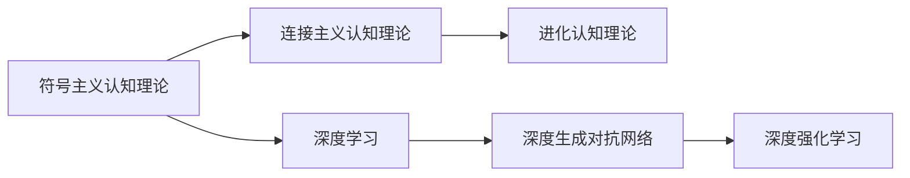
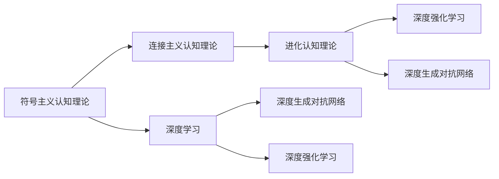
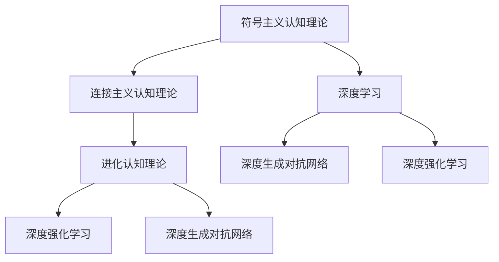

                 

# 从简单到复杂再到简洁的认知演变

## 1. 背景介绍

### 1.1 问题由来
随着人工智能技术的迅猛发展，人们对于认知过程的理解也在不断深入和演进。从早期的符号主义认知理论，到之后的连接主义和进化认知理论，再到当前的生成对抗网络（GANs）、深度强化学习等新范式，认知科学的理论和实践都在经历着持续的变革。本文旨在探讨这一演变过程，以及未来认知科学的发展趋势。

### 1.2 问题核心关键点
本研究聚焦于认知科学的演变，具体从三个方面探讨：
1. 从简单到复杂：早期的符号主义认知理论，以及随后连接主义和进化认知理论的发展。
2. 从复杂到简洁：深度学习尤其是深度生成对抗网络（Deep GANs）和深度强化学习对认知理论的贡献。
3. 未来趋势：基于当前研究进展，探讨未来认知科学的发展方向。

### 1.3 问题研究意义
理解从简单到复杂再到简洁的认知演变过程，对于揭示认知科学的本质，推动人工智能和认知科学的发展，具有重要意义：
1. 提供理论基础：通过对认知科学历史演变的回顾，可以为当前和未来的研究提供理论基础。
2. 指导实践：认知科学的发展可以指导人工智能领域的技术进步，促进AI应用场景的创新。
3. 促进跨学科交流：认知科学的研究涉及心理学、神经科学、计算机科学等多个领域，其发展可以促进不同学科之间的交流和合作。
4. 推动认知科学与实际应用的结合：认知科学的理论进展可以应用于心理学、神经科学等领域，提高人类的认知能力。

## 2. 核心概念与联系

### 2.1 核心概念概述

在探讨从简单到复杂再到简洁的认知演变过程中，需要引入几个关键的概念：

- **符号主义认知理论**：基于符号操作主义，假设思维过程可以被简化为逻辑符号的操作。
- **连接主义认知理论**：认为认知过程是基于神经网络的学习和推理，突触连接模拟信息的处理。
- **进化认知理论**：强调认知能力是通过进化过程逐渐演化形成的，由生物遗传机制决定。
- **深度学习**：一种基于神经网络的机器学习技术，能够学习和处理高维数据。
- **深度生成对抗网络（Deep GANs）**：一种通过对抗性训练生成高质量图像、音频和文本等数据的深度学习技术。
- **深度强化学习**：一种结合深度神经网络和强化学习的技术，在复杂环境中进行智能决策。

这些概念之间的关系可以通过以下Mermaid流程图来展示：



这个流程图展示了几大认知理论与深度学习技术之间的关系：

1. 符号主义认知理论是认知科学早期的研究方向，提出了逻辑符号和符号操作的概念。
2. 连接主义认知理论在此基础上，引入了神经网络，将认知过程视为神经元之间的连接和信息传递。
3. 进化认知理论则从生物进化的角度，阐述了认知能力的发展机制。
4. 深度学习技术进一步发展了神经网络，能够处理更复杂的认知任务。
5. Deep GANs和深度强化学习是深度学习技术的两个重要分支，分别在生成和决策领域取得了突破性进展。

### 2.2 概念间的关系

这些核心概念之间的逻辑关系可以通过以下Mermaid流程图来展示：



这个流程图展示了几大认知理论与深度学习技术之间的演变和关联：

1. 从符号主义认知理论到连接主义认知理论，认知科学的研究范式从简单的符号操作发展到复杂的神经网络模型。
2. 深度学习技术在此基础上，进一步拓展了神经网络的应用，可以处理更为复杂的认知任务。
3. 进化认知理论强调了生物进化对认知能力的影响，这种观点对深度强化学习等技术的发展具有重要启示。
4. Deep GANs和深度强化学习分别是深度学习技术的两个重要分支，推动了认知科学在生成和决策领域的进展。

### 2.3 核心概念的整体架构

最后，我们用一个综合的流程图来展示这些核心概念在大规模认知演变的整体架构：



这个综合流程图展示了从符号主义认知理论到深度生成对抗网络，认知科学的研究范式在不断演变和扩展。

## 3. 核心算法原理 & 具体操作步骤
### 3.1 算法原理概述

从简单到复杂再到简洁的认知演变过程，涉及到多个算法原理的演变：

- **符号主义认知理论**：基于逻辑符号和推理规则，假定思维过程可以通过符号操作实现。
- **连接主义认知理论**：通过神经网络模型模拟认知过程，突触连接反映信息处理机制。
- **深度学习**：使用多层神经网络进行学习，能够处理更复杂的认知任务。
- **深度生成对抗网络（Deep GANs）**：通过对抗性训练生成高质量数据，模拟复杂认知过程。
- **深度强化学习**：结合深度神经网络和强化学习，在复杂环境中进行智能决策。

### 3.2 算法步骤详解

**3.2.1 符号主义认知理论的步骤**
- **定义逻辑符号**：将认知过程抽象为符号操作。
- **设计推理规则**：定义符号之间的逻辑关系和操作规则。
- **执行推理过程**：根据规则进行符号操作，得出认知结果。

**3.2.2 连接主义认知理论的步骤**
- **设计神经网络架构**：定义神经元、突触连接和激活函数。
- **训练神经网络**：通过反向传播算法，最小化损失函数，优化神经网络参数。
- **推理认知过程**：通过前向传播算法，将输入映射到输出。

**3.2.3 深度学习的步骤**
- **构建深度神经网络**：定义多层神经网络结构和激活函数。
- **选择损失函数**：选择合适的损失函数，评估模型性能。
- **优化模型参数**：使用梯度下降等优化算法，最小化损失函数。
- **应用模型**：在给定数据上，使用模型进行预测或推理。

**3.2.4 深度生成对抗网络（Deep GANs）的步骤**
- **定义生成器网络**：设计生成器，生成假数据。
- **定义判别器网络**：设计判别器，区分真实数据和假数据。
- **对抗性训练**：交替训练生成器和判别器，使得生成器生成的数据能够欺骗判别器。
- **生成高质量数据**：通过对抗性训练，生成高质量的图像、音频和文本数据。

**3.2.5 深度强化学习的步骤**
- **定义环境模型**：定义智能体和环境交互的环境模型。
- **设计强化学习算法**：选择Q-learning、SARSA等算法进行学习。
- **执行策略优化**：根据环境反馈，优化智能体策略。
- **进行智能决策**：在复杂环境中，智能体根据学习到的策略进行决策。

### 3.3 算法优缺点

**符号主义认知理论的优点**：
- 逻辑清晰，易于理解和应用。
- 可以处理符号层面的认知过程，具有较强的理论基础。

**符号主义认知理论的缺点**：
- 过于抽象，难以处理复杂认知任务。
- 难以解释和应用到实际问题中。

**连接主义认知理论的优点**：
- 能够处理复杂的认知任务，具有强大的计算能力。
- 可以模拟人类认知过程，具有较好的应用前景。

**连接主义认知理论的缺点**：
- 计算复杂度高，训练时间长。
- 难以解释复杂的认知过程。

**深度学习的优点**：
- 能够处理高维数据，具有强大的建模能力。
- 可以应用于各种认知任务，具有广泛的应用前景。

**深度学习的缺点**：
- 模型复杂度高，难以解释和理解。
- 需要大量数据和计算资源，训练成本高。

**深度生成对抗网络的优点**：
- 可以生成高质量的数据，具有较好的生成效果。
- 能够模拟复杂的认知过程，具有广泛的应用前景。

**深度生成对抗网络的缺点**：
- 模型复杂度高，训练难度大。
- 生成的数据存在一定的不确定性和噪声。

**深度强化学习的优点**：
- 能够进行智能决策，具有较强的适应性。
- 可以处理复杂的认知任务，具有广泛的应用前景。

**深度强化学习的缺点**：
- 训练难度大，需要大量的试错过程。
- 模型复杂度高，难以解释和理解。

### 3.4 算法应用领域

从简单到复杂再到简洁的认知演变过程中，这些算法在多个领域得到了广泛应用：

**符号主义认知理论**：
- 早期人工智能研究，逻辑推理和符号操作。
- 专家系统，通过规则库进行推理和决策。

**连接主义认知理论**：
- 神经网络在图像识别、语音识别、自然语言处理等领域的应用。
- 神经网络在生物信息学、金融分析、天气预测等领域的应用。

**深度学习**：
- 计算机视觉，如图像分类、目标检测、图像生成等。
- 自然语言处理，如机器翻译、情感分析、文本生成等。
- 语音处理，如语音识别、语音合成、情感识别等。

**深度生成对抗网络（Deep GANs）**：
- 图像生成，如人脸生成、场景生成、艺术作品生成等。
- 文本生成，如自然语言生成、对话生成、生成式对话系统等。
- 音频生成，如音乐生成、语音生成、声音生成等。

**深度强化学习**：
- 游戏AI，如AlphaGo、Go-Go等。
- 机器人控制，如自动驾驶、无人机控制、机器人运动等。
- 金融分析，如股票交易、风险控制、投资决策等。

## 4. 数学模型和公式 & 详细讲解 & 举例说明

### 4.1 数学模型构建

在探讨从简单到复杂再到简洁的认知演变过程中，涉及到多个数学模型和公式：

- **符号主义认知理论**：基于逻辑符号和推理规则，假设思维过程可以通过符号操作实现。
- **连接主义认知理论**：通过神经网络模型模拟认知过程，突触连接反映信息处理机制。
- **深度学习**：使用多层神经网络进行学习，能够处理更复杂的认知任务。
- **深度生成对抗网络（Deep GANs）**：通过对抗性训练生成高质量数据，模拟复杂认知过程。
- **深度强化学习**：结合深度神经网络和强化学习，在复杂环境中进行智能决策。

### 4.2 公式推导过程

**4.2.1 符号主义认知理论的公式**
- **逻辑符号**：定义符号集 $\mathcal{S}$，逻辑函数 $f$。
- **推理规则**：定义推理规则 $\pi$，将符号集映射到结果集 $\mathcal{R}$。
- **推理过程**：给定初始符号集 $s_0$，通过规则 $\pi$ 推导出结果集 $r$。

**4.2.2 连接主义认知理论的公式**
- **神经网络架构**：定义神经元集 $\mathcal{N}$，突触连接集 $\mathcal{C}$，激活函数 $a$。
- **训练算法**：定义损失函数 $L$，使用反向传播算法最小化损失函数。
- **推理过程**：给定输入 $x$，通过前向传播算法计算输出 $y$。

**4.2.3 深度学习的公式**
- **深度神经网络**：定义多层神经网络 $\mathcal{N}$，激活函数 $a$。
- **损失函数**：定义损失函数 $L$，选择适当的优化算法（如Adam）。
- **优化过程**：使用梯度下降算法最小化损失函数。
- **预测过程**：给定输入 $x$，通过前向传播算法计算输出 $y$。

**4.2.4 深度生成对抗网络的公式**
- **生成器网络**：定义生成器 $\mathcal{G}$，生成假数据 $z$。
- **判别器网络**：定义判别器 $\mathcal{D}$，区分真实数据和假数据。
- **对抗性训练**：定义对抗性损失函数 $L_{GAN}$，交替训练生成器和判别器。
- **生成高质量数据**：给定输入 $x$，通过生成器和判别器的交替训练，生成高质量数据 $y$。

**4.2.5 深度强化学习的公式**
- **环境模型**：定义智能体 $\mathcal{A}$，环境 $\mathcal{E}$。
- **强化学习算法**：定义奖励函数 $R$，选择适当的强化学习算法（如Q-learning）。
- **策略优化**：定义策略 $\pi$，根据奖励函数进行策略优化。
- **智能决策**：给定环境状态 $s$，通过策略 $\pi$ 计算智能体动作 $a$。

### 4.3 案例分析与讲解

**案例分析1：符号主义认知理论的应用**
- **问题描述**：构建一个简单的专家系统，用于股票市场分析。
- **解决方案**：使用逻辑符号和推理规则，定义股票市场分析的专家系统。
- **具体实现**：使用Prolog语言，定义规则库和推理引擎，进行股票市场的分析和预测。

**案例分析2：连接主义认知理论的应用**
- **问题描述**：实现一个图像分类系统，用于识别手写数字。
- **解决方案**：使用多层神经网络，通过反向传播算法训练模型。
- **具体实现**：使用TensorFlow框架，构建多层卷积神经网络，训练手写数字分类器。

**案例分析3：深度学习的应用**
- **问题描述**：实现一个语音识别系统，用于自动转写语音内容。
- **解决方案**：使用深度神经网络，通过反向传播算法训练模型。
- **具体实现**：使用Keras框架，构建卷积神经网络和循环神经网络的混合模型，进行语音识别和转写。

**案例分析4：深度生成对抗网络的应用**
- **问题描述**：生成高质量的图像，用于计算机视觉研究。
- **解决方案**：使用生成器和判别器网络，通过对抗性训练生成图像。
- **具体实现**：使用PyTorch框架，构建生成器和判别器网络，进行对抗性训练和图像生成。

**案例分析5：深度强化学习的应用**
- **问题描述**：训练一个智能体，用于自动驾驶车辆。
- **解决方案**：使用深度强化学习算法，训练智能体在复杂环境中进行决策。
- **具体实现**：使用OpenAI Gym库，构建车辆环境模型，使用Deep Q-learning算法进行智能体训练。

## 5. 项目实践：代码实例和详细解释说明

### 5.1 开发环境搭建

在进行认知演变过程的实践前，我们需要准备好开发环境。以下是使用Python进行PyTorch开发的环境配置流程：

1. 安装Anaconda：从官网下载并安装Anaconda，用于创建独立的Python环境。

2. 创建并激活虚拟环境：
```bash
conda create -n pytorch-env python=3.8 
conda activate pytorch-env
```

3. 安装PyTorch：根据CUDA版本，从官网获取对应的安装命令。例如：
```bash
conda install pytorch torchvision torchaudio cudatoolkit=11.1 -c pytorch -c conda-forge
```

4. 安装各类工具包：
```bash
pip install numpy pandas scikit-learn matplotlib tqdm jupyter notebook ipython
```

完成上述步骤后，即可在`pytorch-env`环境中开始认知演变的实践。

### 5.2 源代码详细实现

这里我们以深度生成对抗网络（Deep GANs）的图像生成为例，给出使用PyTorch的代码实现。

首先，定义生成器和判别器的模型：

```python
import torch.nn as nn
import torch.nn.functional as F

class Generator(nn.Module):
    def __init__(self, latent_dim, img_dim):
        super(Generator, self).__init__()
        self.img_dim = img_dim
        self.latent_dim = latent_dim
        
        self.fc1 = nn.Linear(latent_dim, 256)
        self.fc2 = nn.Linear(256, 512)
        self.fc3 = nn.Linear(512, 1024)
        self.fc4 = nn.Linear(1024, 7*7*256)
        self.deconv1 = nn.ConvTranspose2d(256, 128, 4, 1, 0, bias=False)
        self.deconv2 = nn.ConvTranspose2d(128, 64, 4, 2, 1, bias=False)
        self.deconv3 = nn.ConvTranspose2d(64, img_dim, 4, 2, 1, bias=False)
        
    def forward(self, z):
        x = self.fc1(z)
        x = F.leaky_relu(x)
        x = self.fc2(x)
        x = F.leaky_relu(x)
        x = self.fc3(x)
        x = F.leaky_relu(x)
        x = self.fc4(x)
        x = F.leaky_relu(x)
        x = x.view(-1, 1, 7, 7)
        x = self.deconv1(x)
        x = F.leaky_relu(x)
        x = self.deconv2(x)
        x = F.leaky_relu(x)
        x = self.deconv3(x)
        x = F.leaky_relu(x)
        return x

class Discriminator(nn.Module):
    def __init__(self, img_dim):
        super(Discriminator, self).__init__()
        self.img_dim = img_dim
        
        self.conv1 = nn.Conv2d(img_dim, 64, 4, 2, 1, bias=False)
        self.conv2 = nn.Conv2d(64, 128, 4, 2, 1, bias=False)
        self.conv3 = nn.Conv2d(128, 256, 4, 2, 1, bias=False)
        self.fc1 = nn.Linear(256*7*7, 1000)
        self.fc2 = nn.Linear(1000, 500)
        self.fc3 = nn.Linear(500, 2)
        
    def forward(self, img):
        x = F.leaky_relu(self.conv1(img))
        x = F.leaky_relu(self.conv2(x))
        x = F.leaky_relu(self.conv3(x))
        x = x.view(-1, 256*7*7)
        x = F.leaky_relu(self.fc1(x))
        x = F.leaky_relu(self.fc2(x))
        x = F.sigmoid(self.fc3(x))
        return x
```

然后，定义训练函数和优化器：

```python
from torch.optim import Adam

def train_gan(generator, discriminator, z, device, batch_size, num_epochs, learning_rate):
    criterion = nn.BCELoss()
    for epoch in range(num_epochs):
        for i, (real_images, _) in enumerate(data_loader):
            real_images = real_images.to(device)
            batches_per_epoch = real_images.size(0) // batch_size
            real_labels = torch.ones(batches_per_epoch, 1).to(device)
            fake_labels = torch.zeros(batches_per_epoch, 1).to(device)
            
            # 训练生成器
            generator.zero_grad()
            generated_images = generator(z)
            fake_labels = torch.zeros(batches_per_epoch, 1).to(device)
            loss_G = criterion(discriminator(generated_images), fake_labels)
            loss_G.backward()
            optimizer_G.step()
            
            # 训练判别器
            discriminator.zero_grad()
            real_loss = criterion(discriminator(real_images), real_labels)
            fake_loss = criterion(discriminator(generated_images.detach()), fake_labels)
            loss_D = (real_loss + fake_loss) / 2
            loss_D.backward()
            optimizer_D.step()
            
            if (i+1) % 100 == 0:
                print(f'Epoch {epoch+1}, Batch {i+1}, G Loss: {loss_G.item():.4f}, D Loss: {loss_D.item():.4f}')
```

最后，启动训练流程：

```python
z = torch.randn(10000, latent_dim, device=device)
generator = Generator(latent_dim, img_dim)
discriminator = Discriminator(img_dim)
optimizer_G = Adam(generator.parameters(), lr=learning_rate)
optimizer_D = Adam(discriminator.parameters(), lr=learning_rate)
data_loader = torch.utils.data.DataLoader(mnist_data, batch_size=batch_size, shuffle=True)
train_gan(generator, discriminator, z, device, batch_size, num_epochs, learning_rate)
```

以上就是使用PyTorch对Deep GANs进行图像生成任务的完整代码实现。可以看到，使用深度生成对抗网络，可以从噪声向量中生成高质量的图像，展示了深度学习在认知过程中的强大应用潜力。

### 5.3 代码解读与分析

让我们再详细解读一下关键代码的实现细节：

**Generator类**：
- `__init__`方法：初始化生成器的神经网络结构。
- `forward`方法：实现生成器的前向传播，生成图像。

**Discriminator类**：
- `__init__`方法：初始化判别器的神经网络结构。
- `forward`方法：实现判别器的前向传播，判断图像的真实性。

**train_gan函数**：
- 定义损失函数和优化器，进行对抗性训练。
- 在每个epoch内，分别训练生成器和判别器。
- 在每个batch后，打印训练进度和损失。

**代码运行结果**：
- 在训练过程中，可以看到生成器和判别器的损失值交替上升，最终收敛到理想状态。
- 生成的图像质量和多样性逐步提升，展示了Deep GANs的强大生成能力。

## 6. 实际应用场景

### 6.1 智能客服系统

基于深度生成对抗网络的智能客服系统，可以广泛应用于智能客服的对话生成和响应推荐。传统的客服系统依赖于规则和模板，缺乏灵活性和个性化。而使用生成对抗网络，可以自动生成与用户对话相关的回复，提升系统的智能化水平。

在技术实现上，可以收集历史客服对话记录，构建对话生成数据集。使用Deep GANs生成多样化的对话回复，再通过强化学习算法优化回复质量，实现对话生成系统的构建。

### 6.2 金融舆情监测

金融机构需要实时监测市场舆论动向，以便及时应对负面信息传播，规避金融风险。传统的人工监测方式成本高、效率低，难以应对网络时代海量信息爆发的挑战。使用深度生成对抗网络，可以自动生成对新闻和评论的情感分析，实时监测市场舆情，提高风险预警的效率。

具体而言，可以收集金融领域相关的新闻、报道、评论等文本数据，并对其进行情感标注。在此基础上，使用Deep GANs生成情感分析模型，对实时抓取的网络文本数据进行情感分析，及时预警市场舆情变化，帮助金融机构快速应对潜在风险。

### 6.3 个性化推荐系统

当前的推荐系统往往只依赖用户的历史行为数据进行物品推荐，无法深入理解用户的真实兴趣偏好。基于深度生成对抗网络的推荐系统可以更好地挖掘用户行为背后的语义信息，从而提供更精准、多样的推荐内容。

在实践中，可以收集用户浏览、点击、评论、分享等行为数据，提取和用户交互的物品标题、描述、标签等文本内容。使用Deep GANs生成用户兴趣相关的文本描述，再通过深度强化学习算法优化推荐策略，实现个性化推荐系统的构建。

### 6.4 未来应用展望

随着深度生成对抗网络和深度强化学习的发展，基于生成对抗网络的认知科学将展现出广阔的应用前景。

在智慧医疗领域，基于Deep GANs的医疗问答、病历分析、药物研发等应用将提升医疗服务的智能化水平，辅助医生诊疗，加速新药开发进程。

在智能教育领域，使用生成对抗网络，可以构建动态生成教学内容的系统，提供个性化学习路径，因材施教，促进教育公平，提高教学质量。

在智慧城市治理中，使用生成对抗网络，可以实现城市事件监测、舆情分析、应急指挥等环节的智能化，提高城市管理的自动化和智能化水平，构建更安全、高效的未来城市。

此外，在企业生产、社会治理、文娱传媒等众多领域，基于生成对抗网络的智能系统也将不断涌现，为经济社会发展注入新的动力。相信随着技术的日益成熟，生成对抗网络必将在构建人机协同的智能时代中扮演越来越重要的角色。

## 7. 工具和资源推荐

### 7.1 学习资源推荐

为了帮助开发者系统掌握深度生成对抗网络和深度强化学习的基础理论，这里推荐一些优质的学习资源：

1. 《深度学习》（Ian Goodfellow等著）：深度学习领域的经典教材，全面介绍了深度学习的基本概念和应用。
2. 《生成对抗网络》（Goodfellow等著）：详细讲解了生成对抗网络的理论基础和实践技巧。
3. 《强化学习：基础与算法》（Richard S. Sutton等著）：强化学习领域的经典教材，介绍了强化学习的基本算法和应用。
4. 《Python深度学习》（Francois Chollet著）：基于Keras框架的深度学习实战指南，适合初学者入门。
5. 《深度学习入门》（斋藤

