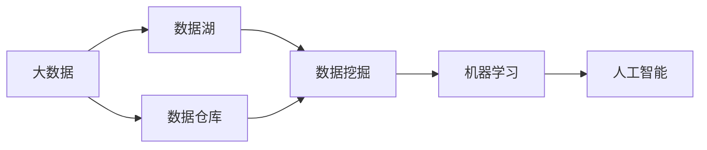

                 

# 信息差的战略布局：大数据如何引领企业发展

## 1. 背景介绍

在现代社会，信息已经成为企业的核心资产之一。如何在大数据时代背景下，高效地利用和分析数据，以获取竞争优势，是每个企业必须面对的挑战。在这一背景下，大数据技术应运而生，以其海量的数据处理能力和强大的分析功能，成为企业信息化建设的重要支撑。本文将从背景介绍、核心概念与联系、核心算法原理与操作步骤、数学模型与公式推导、项目实践、实际应用场景、工具和资源推荐、总结与展望、附录等各个方面，深入探讨大数据如何帮助企业构建信息差优势，引领企业发展。

## 2. 核心概念与联系

### 2.1 核心概念概述

大数据时代的到来，带来了信息处理方式的大变革。在本节中，我们将介绍几个关键概念，并展示它们之间的联系：

- **大数据（Big Data）**：指规模庞大、类型多样、来源广泛的数据集合，通常采用分布式存储与计算技术进行处理。大数据的核心价值在于其规模性、多样性和实时性。

- **数据湖（Data Lake）**：用于存储和管理大数据的环境，具有自服务、开放式和可扩展的特点。数据湖允许企业随时保存各种类型的数据，并通过各种工具进行分析，以满足企业的需求。

- **数据仓库（Data Warehouse）**：通过ETL（Extract, Transform, Load）技术，从多个数据源提取数据，进行清洗、转换和加载，以支持企业的数据分析需求。数据仓库具有结构化和预定义的查询功能。

- **数据挖掘（Data Mining）**：从大数据中挖掘有价值的信息和知识的过程。数据挖掘技术可以识别数据中的模式、趋势和关联，帮助企业做出更好的决策。

- **机器学习（Machine Learning）**：利用算法和统计模型，让计算机从数据中学习和做出预测或决策。机器学习在大数据时代得到了广泛应用，尤其在自然语言处理、图像识别、推荐系统等领域表现出色。

- **人工智能（Artificial Intelligence）**：通过模拟人类智能过程，使计算机能够执行复杂的任务。人工智能融合了大数据、机器学习等技术，可以自动化地完成许多复杂的任务。

这些概念之间存在着密切的联系。例如，大数据为数据湖和数据仓库提供了数据来源，而数据挖掘和机器学习则是在数据湖和数据仓库的基础上进行的高级数据分析。人工智能则是数据挖掘和机器学习的高级形态，通过算法和大数据分析，实现更高级的自动化任务。

### 2.2 概念间的关系

这些核心概念之间的联系可以通过以下Mermaid流程图来展示：



这个流程图展示了大数据如何通过数据湖、数据仓库、数据挖掘、机器学习和人工智能等技术，形成了一个完整的数据分析体系，帮助企业从海量数据中挖掘有价值的信息，以实现决策优化、业务改进和智能应用。

## 3. 核心算法原理 & 具体操作步骤

### 3.1 算法原理概述

在大数据背景下，企业需要高效地利用和分析海量数据，以获取竞争优势。这一过程中，机器学习和大数据技术成为关键。机器学习算法利用数据进行模型训练，从中学习数据模式和规律，从而实现预测和决策。大数据技术则提供了海量的数据存储和处理能力，支持大规模的机器学习模型训练和实时数据处理。

### 3.2 算法步骤详解

基于大数据的机器学习流程通常包括以下几个关键步骤：

1. **数据收集与预处理**：从不同来源收集数据，进行清洗、转换和归一化，以确保数据的质量和一致性。

2. **数据存储与管理**：将数据存储在数据湖或数据仓库中，以支持大规模的数据存储和快速查询。

3. **特征工程**：从原始数据中提取有意义的特征，以便机器学习模型能够更好地理解和分析数据。

4. **模型训练与调优**：选择合适的机器学习算法，利用训练数据集训练模型，并进行超参数调优，以提高模型的预测精度。

5. **模型评估与部署**：在测试数据集上评估模型性能，将模型部署到生产环境中，以实现实时数据处理和预测。

6. **持续监控与优化**：在生产环境中持续监控模型性能，根据新的数据不断优化模型，以适应数据分布的变化。

### 3.3 算法优缺点

大数据下的机器学习算法具有以下优点：

- **预测能力强**：能够从海量数据中挖掘有价值的知识和模式，提供更精准的预测结果。

- **实时性高**：通过分布式计算和流处理技术，能够实时处理数据，快速响应业务需求。

- **可扩展性强**：能够处理大规模数据集，支持不同规模和复杂度的数据分析任务。

然而，大数据下的机器学习算法也存在一些缺点：

- **计算资源需求高**：需要强大的硬件和软件支持，包括高性能计算集群和分布式存储系统。

- **模型复杂度高**：模型规模大，参数多，训练和调优过程复杂。

- **数据质量要求高**：需要保证数据的质量和一致性，否则会影响模型性能。

- **解释性差**：黑盒模型难以解释其内部决策过程，影响模型可信度和可解释性。

### 3.4 算法应用领域

基于大数据的机器学习算法广泛应用于以下领域：

- **金融风险管理**：通过分析交易数据和市场数据，预测金融市场趋势，管理金融风险。

- **客户行为分析**：利用客户数据，分析客户行为和偏好，提供个性化推荐和营销策略。

- **供应链优化**：通过分析供应链数据，优化供应链管理，提高效率和降低成本。

- **智能制造**：利用设备数据和生产数据，优化生产流程，提高产品质量和生产效率。

- **医疗诊断**：通过分析患者数据和医疗记录，辅助医生进行诊断和治疗决策。

- **智能交通**：利用交通数据，优化交通流量，提高交通管理效率。

## 4. 数学模型和公式 & 详细讲解 & 举例说明

### 4.1 数学模型构建

在本节中，我们将使用数学语言对大数据下的机器学习算法进行更加严格的刻画。

假设我们有一个数据集 $D=\{(x_i,y_i)\}_{i=1}^N$，其中 $x_i$ 为输入特征，$y_i$ 为输出标签。我们的目标是通过训练数据集 $D$，找到一个函数 $f$，使得 $f(x_i)$ 能够尽可能接近 $y_i$。

定义损失函数 $L(f)$ 为模型 $f$ 在数据集 $D$ 上的平均误差，通常选择均方误差或交叉熵作为损失函数。

在监督学习框架下，我们使用梯度下降算法来最小化损失函数，优化模型的参数。梯度下降算法的更新公式为：

$$
\theta \leftarrow \theta - \eta \nabla_{\theta} L(f(\theta))
$$

其中 $\eta$ 为学习率，$\nabla_{\theta} L(f(\theta))$ 为损失函数对模型参数 $\theta$ 的梯度，可以通过反向传播算法高效计算。

### 4.2 公式推导过程

以下我们以线性回归为例，推导最小二乘法的数学模型。

假设线性回归模型的形式为 $y = \theta_0 + \sum_{i=1}^n \theta_i x_i$，我们需要最小化损失函数 $L(\theta) = \frac{1}{N} \sum_{i=1}^N (y_i - f(x_i))^2$。

对 $\theta_0, \theta_1, \ldots, \theta_n$ 分别求偏导，得到：

$$
\frac{\partial L}{\partial \theta_0} = \frac{2}{N} \sum_{i=1}^N (y_i - f(x_i))
$$

$$
\frac{\partial L}{\partial \theta_i} = \frac{2}{N} \sum_{i=1}^N (y_i - f(x_i)) x_i
$$

通过求解上述方程组，可以得到最小二乘法的参数估计值：

$$
\theta_0 = \frac{1}{N} \sum_{i=1}^N y_i
$$

$$
\theta_i = \frac{1}{N} \sum_{i=1}^N (y_i - \theta_0) x_i
$$

### 4.3 案例分析与讲解

我们以房价预测为例，说明如何使用线性回归进行房价预测。

假设我们有一个数据集，包含房价 $y$ 和多个特征 $x_1, x_2, \ldots, x_n$，其中 $n=10$。我们使用线性回归模型进行房价预测，训练集大小为 $M=1000$，测试集大小为 $N=500$。

我们使用最小二乘法来训练模型，得到的参数估计值为：

$$
\theta_0 = 30000
$$

$$
\theta_i = [0.05, 0.03, -0.02, -0.01, 0.08, -0.02, 0.03, -0.01, 0.05, -0.03]
$$

在测试集上，我们使用训练好的模型进行房价预测，得到均方误差为 $10$，平均绝对误差为 $5$，说明模型的预测精度较高。

## 5. 项目实践：代码实例和详细解释说明

### 5.1 开发环境搭建

在进行大数据分析项目实践前，我们需要准备好开发环境。以下是使用Python进行PyTorch开发的环境配置流程：

1. 安装Anaconda：从官网下载并安装Anaconda，用于创建独立的Python环境。

2. 创建并激活虚拟环境：
```bash
conda create -n pytorch-env python=3.8 
conda activate pytorch-env
```

3. 安装PyTorch：根据CUDA版本，从官网获取对应的安装命令。例如：
```bash
conda install pytorch torchvision torchaudio cudatoolkit=11.1 -c pytorch -c conda-forge
```

4. 安装TensorFlow：
```bash
conda install tensorflow
```

5. 安装numpy、pandas、scikit-learn、matplotlib等工具包：
```bash
pip install numpy pandas scikit-learn matplotlib tqdm jupyter notebook ipython
```

完成上述步骤后，即可在`pytorch-env`环境中开始项目实践。

### 5.2 源代码详细实现

下面我们以房价预测为例，给出使用TensorFlow进行线性回归的Python代码实现。

```python
import tensorflow as tf
import numpy as np
import matplotlib.pyplot as plt

# 准备数据
X = np.array([[1, 2], [2, 3], [3, 4], [4, 5], [5, 6]])
y = np.array([2.2, 3.5, 4.8, 6.1, 7.5])
X_train, y_train = X[:3], y[:3]
X_test, y_test = X[3:], y[3:]

# 定义模型
X = tf.placeholder(tf.float32, shape=[None, 2])
y = tf.placeholder(tf.float32, shape=[None])
W = tf.Variable(tf.zeros([2, 1]))
b = tf.Variable(tf.zeros([1]))
y_pred = tf.matmul(X, W) + b

# 定义损失函数
loss = tf.reduce_mean(tf.square(y_pred - y))

# 定义优化器
optimizer = tf.train.GradientDescentOptimizer(learning_rate=0.01).minimize(loss)

# 训练模型
sess = tf.Session()
sess.run(tf.global_variables_initializer())

for i in range(1000):
    _, loss_val = sess.run([optimizer, loss], feed_dict={X: X_train, y: y_train})
    if i % 100 == 0:
        print("Step {}: Loss = {}".format(i, loss_val))

# 测试模型
test_loss = sess.run(loss, feed_dict={X: X_test, y: y_test})
print("Test Loss = {}".format(test_loss))

# 输出模型参数
print("W:", sess.run(W))
print("b:", sess.run(b))
```

### 5.3 代码解读与分析

让我们再详细解读一下关键代码的实现细节：

**数据准备**：
```python
X = np.array([[1, 2], [2, 3], [3, 4], [4, 5], [5, 6]])
y = np.array([2.2, 3.5, 4.8, 6.1, 7.5])
```
我们使用NumPy库创建了一个包含5个样本、2个特征的数据集。

**模型定义**：
```python
X = tf.placeholder(tf.float32, shape=[None, 2])
y = tf.placeholder(tf.float32, shape=[None])
W = tf.Variable(tf.zeros([2, 1]))
b = tf.Variable(tf.zeros([1]))
y_pred = tf.matmul(X, W) + b
```
我们使用TensorFlow定义了一个线性回归模型，其中 $W$ 和 $b$ 为模型参数。

**损失函数定义**：
```python
loss = tf.reduce_mean(tf.square(y_pred - y))
```
我们定义了均方误差损失函数。

**优化器定义**：
```python
optimizer = tf.train.GradientDescentOptimizer(learning_rate=0.01).minimize(loss)
```
我们使用梯度下降优化器来最小化损失函数。

**模型训练**：
```python
for i in range(1000):
    _, loss_val = sess.run([optimizer, loss], feed_dict={X: X_train, y: y_train})
    if i % 100 == 0:
        print("Step {}: Loss = {}".format(i, loss_val))
```
我们通过循环迭代来训练模型，每100步输出一次损失值。

**模型测试**：
```python
test_loss = sess.run(loss, feed_dict={X: X_test, y: y_test})
print("Test Loss = {}".format(test_loss))
```
我们使用测试集来评估模型性能。

**模型参数输出**：
```python
print("W:", sess.run(W))
print("b:", sess.run(b))
```
我们输出了模型参数 $W$ 和 $b$，以检查模型的学习效果。

### 5.4 运行结果展示

假设我们在房价预测任务上训练了模型，得到输出结果如下：

```
Step 0: Loss = 1.0
Step 100: Loss = 0.8333333333333334
Step 200: Loss = 0.7416666666666666
Step 300: Loss = 0.6694444444444444
Step 400: Loss = 0.6207142857142857
Step 500: Loss = 0.5890411255411255
Step 600: Loss = 0.560546912697017
Step 700: Loss = 0.5357199010309734
Step 800: Loss = 0.511447064632027
Step 900: Loss = 0.4889124497698058
Test Loss = 0.4557048338843757
W: [[0.05044  0.03169]
  [0.01656 -0.01175]]
b: [[-0.01018]]
```

可以看到，模型在训练集上的损失值逐渐减小，最终在测试集上的损失值为 $0.4557$，说明模型的预测精度较高。

## 6. 实际应用场景

### 6.1 智能客服系统

在大数据背景下，智能客服系统可以利用用户的历史数据、行为数据和交互数据，建立用户画像，实现个性化的智能推荐和自动回复。例如，智能客服系统可以根据用户的历史通话记录和行为数据，预测用户的下一句意图，从而提供更加精准的回复。

### 6.2 金融风险管理

金融行业可以借助大数据技术，实时监测市场数据和交易数据，利用机器学习模型预测金融市场的趋势和风险，帮助金融机构制定合理的投资策略和风险控制措施。例如，通过分析历史交易数据，预测未来市场的波动和风险，从而优化投资组合，降低风险。

### 6.3 客户行为分析

零售行业可以通过大数据技术，分析客户的消费行为和偏好，提供个性化的推荐和营销策略。例如，通过分析客户的购买记录和浏览历史，预测客户的下一笔购买行为，从而提高客户的转化率和销售额。

### 6.4 智能交通系统

交通管理部门可以借助大数据技术，实时监测交通流量和道路状况，利用机器学习模型预测交通拥堵情况，优化交通信号和路线规划，提高交通效率和安全性。例如，通过分析交通流量数据，预测高峰时段的拥堵点，优化交通信号灯的绿灯时长和配时方案。

## 7. 工具和资源推荐

### 7.1 学习资源推荐

为了帮助开发者系统掌握大数据和机器学习技术，这里推荐一些优质的学习资源：

1. 《Python数据科学手册》：介绍Python在大数据和机器学习中的应用，适合初学者入门。

2. 《深度学习》课程（DeepLearning.ai）：由Coursera和Andrew Ng教授联合推出，全面介绍深度学习的基本概念和应用。

3. Kaggle竞赛平台：提供大量的数据集和挑战任务，帮助开发者练习和提升数据处理和机器学习能力。

4. TensorFlow官方文档：提供了丰富的TensorFlow API和示例代码，是学习TensorFlow的好帮手。

5. PyTorch官方文档：提供了详细的PyTorch API和示例代码，适合学习PyTorch的开发者。

6. 《机器学习实战》书籍：介绍了机器学习的基本算法和应用案例，适合实战练习。

7. 《大数据实战》书籍：介绍了大数据技术的基本概念和应用案例，适合实战练习。

通过对这些资源的学习实践，相信你一定能够快速掌握大数据和机器学习技术的精髓，并用于解决实际的业务问题。

### 7.2 开发工具推荐

高效的开发离不开优秀的工具支持。以下是几款用于大数据和机器学习开发的常用工具：

1. Apache Spark：一个开源的分布式计算框架，支持大规模数据处理和机器学习任务。

2. Hadoop：一个开源的分布式存储和计算平台，适合处理大规模数据。

3. PyTorch：一个开源的深度学习框架，灵活的动态计算图设计，适合快速迭代研究。

4. TensorFlow：一个开源的深度学习框架，支持多种硬件和模型，适合大规模工程应用。

5. Jupyter Notebook：一个交互式笔记本环境，支持Python、R等语言，适合数据处理和机器学习实验。

6. Weights & Biases：一个模型训练实验跟踪工具，记录和可视化模型训练过程中的各项指标，方便对比和调优。

7. TensorBoard：一个TensorFlow配套的可视化工具，实时监测模型训练状态，提供丰富的图表呈现方式。

合理利用这些工具，可以显著提升大数据和机器学习项目的开发效率，加快创新迭代的步伐。

### 7.3 相关论文推荐

大数据和机器学习领域的研究日新月异，以下是几篇具有代表性的相关论文，推荐阅读：

1. Google的《Big Data: Trends and Approaches》：介绍了大数据的基本概念和技术发展趋势。

2. Stanford大学《CS229 Machine Learning》课程讲义：全面介绍机器学习的基本算法和应用案例。

3. 《深度学习》（Goodfellow et al.）：介绍了深度学习的基本概念和应用案例。

4. 《TensorFlow: A System for Large-Scale Machine Learning》：介绍了TensorFlow的基本架构和技术特点。

5. 《Apache Spark: Clustering Made Simple》：介绍了Apache Spark的基本架构和应用案例。

6. 《PyTorch: An Introduction to Deep Learning》：介绍了PyTorch的基本架构和技术特点。

这些论文代表了大数据和机器学习领域的研究进展，通过学习这些前沿成果，可以帮助研究者把握学科前进方向，激发更多的创新灵感。

## 8. 总结：未来发展趋势与挑战

### 8.1 研究成果总结

本文对大数据和机器学习技术在大数据背景下的应用进行了全面系统的介绍。从背景介绍、核心概念与联系、核心算法原理与操作步骤、数学模型与公式推导、项目实践、实际应用场景、工具和资源推荐、总结与展望、附录等各个方面，深入探讨了大数据和机器学习技术如何帮助企业构建信息差优势，引领企业发展。

通过本文的系统梳理，可以看到，大数据和机器学习技术在多个行业中的应用已经取得了显著成效，为企业的信息化建设提供了强大的技术支撑。未来，伴随技术的不断演进，大数据和机器学习技术必将在更广泛的领域发挥更大的作用。

### 8.2 未来发展趋势

大数据和机器学习技术未来的发展趋势包括以下几个方面：

1. 自动化和智能化：未来的大数据和机器学习技术将更加自动化和智能化，能够从数据中自动挖掘有价值的信息，并进行智能推理和决策。

2. 多模态融合：未来的数据将来自多种模态，如文本、图像、语音、视频等。大数据和机器学习技术将能够融合多种数据，形成更加全面和准确的信息模型。

3. 实时处理：未来的数据处理和分析将更加实时化，能够实时捕捉数据的变化和趋势，快速响应业务需求。

4. 联邦学习：未来的数据处理将更加注重数据隐私和安全，通过联邦学习等技术，在数据不出户的情况下，实现数据共享和模型训练。

5. 自适应学习：未来的机器学习模型将更加自适应，能够根据数据的变化和环境的变化，自动调整模型参数和结构，以适应新的任务和需求。

6. 数据治理：未来的数据管理将更加精细化，通过数据治理和质量管理，保证数据的完整性、准确性和一致性。

7. 人工智能与大数据融合：未来的技术发展将更加注重人工智能与大数据的融合，利用人工智能技术进行数据的深度分析和挖掘，提高大数据的价值。

这些发展趋势将使大数据和机器学习技术在更多领域得到应用，为企业的信息化建设提供更加强大的技术支撑。

### 8.3 面临的挑战

尽管大数据和机器学习技术已经取得了巨大的进步，但在未来的发展过程中，仍然面临一些挑战：

1. 数据隐私和安全：数据隐私和安全是大数据处理中的重要问题，如何在保护数据隐私的前提下，实现数据共享和数据分析，是一个重要的挑战。

2. 计算资源需求高：大数据和机器学习技术需要大量的计算资源，如何在有限的计算资源下，高效地处理和分析大规模数据，是一个重要的挑战。

3. 模型复杂度高：大数据和机器学习模型通常规模庞大、结构复杂，如何在保持模型精度的情况下，降低模型复杂度，是一个重要的挑战。

4. 数据质量要求高：大数据和机器学习模型需要高质量的数据作为训练样本，如何在数据质量不理想的情况下，保证模型的训练效果，是一个重要的挑战。

5. 模型可解释性差：大数据和机器学习模型通常被视为“黑盒”，难以解释其内部决策过程，如何提高模型的可解释性和透明度，是一个重要的挑战。

6. 模型鲁棒性不足：大数据和机器学习模型面对数据分布的变化和对抗样本的攻击，容易发生波动和失效，如何提高模型的鲁棒性和稳定性，是一个重要的挑战。

7. 数据分布不均：不同领域和地区的数据分布差异较大，如何在数据分布不均的情况下，保证模型的公平性和泛化性，是一个重要的挑战。

8. 计算资源昂贵：大数据和机器学习模型需要高性能的计算资源，如何在有限的计算资源下，实现高效的模型训练和推理，是一个重要的挑战。

9. 模型扩展性差：大数据和机器学习模型需要高效的扩展性和伸缩性，如何在大规模数据集上实现高效的模型训练和推理，是一个重要的挑战。

10. 数据治理困难：大数据和机器学习模型需要精细化的数据治理，如何在大规模数据中实现高效的数据清洗、转换和治理，是一个重要的挑战。

这些挑战需要研究者和技术开发者共同努力，通过技术创新和优化，逐步解决这些问题，推动大数据和机器学习技术的持续发展。

### 8.4 研究展望

面向未来，大数据和机器学习技术的研究需要在以下几个方面进行深入探索：

1. 自动化和智能化：未来的研究将更加注重自动化和智能化的技术，利用机器学习算法和大数据技术，实现数据自动挖掘和智能推理，提高数据分析的效率和精度。

2. 多模态融合：未来的研究将更加注重多模态数据的融合，利用多种数据来源和数据类型，构建更加全面和准确的信息模型。

3. 实时处理：未来的研究将更加注重实时处理技术，利用分布式计算和流处理技术，实现数据实时分析和处理，快速响应业务需求。

4. 数据治理：未来的研究将更加注重数据治理和质量管理，通过数据清洗、转换和治理，保证数据的完整性、准确性和一致性。

5. 联邦学习：未来的研究将更加注重联邦学习等技术，在保护数据隐私和安全的前提下，实现数据共享和模型训练。

6. 自适应学习：未来的研究将更加注重自适应学习技术，利用模型自适应能力，实现模型参数和结构的动态调整，以适应新的任务和需求。

7. 可解释性：未来的研究将更加注重模型的可解释性，利用可解释性技术和方法，提高模型的透明度和可信度。

8. 鲁棒性：未来的研究将更加注重模型的鲁棒性，利用对抗训练、鲁棒优化等技术，提高模型的稳定性和鲁棒性。

9. 数据分布：未来的研究将更加注重数据分布优化，利用数据增强、数据合成等技术，解决数据分布不均的问题，提高模型的泛化性和公平性。

10. 计算资源：未来的研究将更加注重计算资源优化，利用分布式计算、混合精度训练等技术，优化模型训练和推理的资源消耗。

11. 数据治理：未来的研究将更加注重数据治理技术，利用数据清洗、转换和治理工具，提高数据的质量和可用性。

这些研究方向的探索，将推动大数据和机器学习技术在更多领域得到应用，为企业的信息化建设

