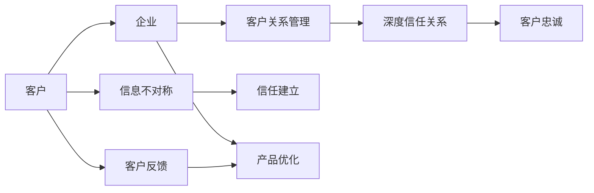
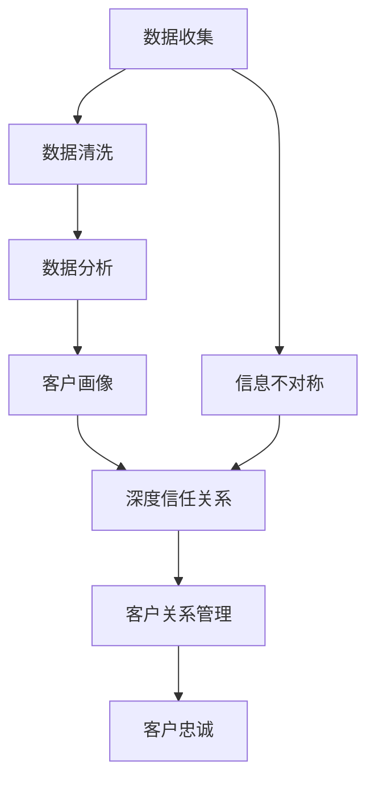

                 

# 信息差：信息不对称与客户关系

> 关键词：信息不对称,客户关系管理,信息差理论,客户反馈,信任建立

## 1. 背景介绍

在当今数字化时代，客户关系管理(CRM)成为许多企业成功的关键因素。然而，尽管许多企业投入大量资源来管理客户数据，但往往忽略了客户关系中最本质的问题——信息不对称。信息不对称指的是客户与企业之间的信息差距，这可能导致误解、不信任，进而影响客户的满意度和忠诚度。

信息差理论强调，企业需要通过消除信息不对称，建立深度信任关系，以实现真正的客户价值最大化。本文将详细探讨信息差理论的核心概念和实际应用，通过算法原理、数学模型、项目实践等多方面进行深入剖析，为提升企业客户关系管理提供新的思路和工具。

## 2. 核心概念与联系

### 2.1 核心概念概述

信息差理论的核心概念包括以下几个方面：

- **信息不对称**：指客户与企业之间的信息差距，表现为客户对企业产品、服务、政策等的了解程度不同。

- **客户关系管理**：企业通过系统化的方法收集、管理和分析客户数据，以实现客户价值最大化。

- **深度信任关系**：客户与企业之间建立基于深度理解、透明沟通和相互信任的关系，这种关系是客户忠诚和持续购买的基础。

### 2.2 概念间的关系

通过一个简单的Mermaid流程图来展示信息差理论的核心概念及其相互关系：



这个流程图展示了从信息不对称到深度信任关系，再到客户忠诚的整个路径。客户反馈和产品优化是建立深度信任关系的重要环节。

### 2.3 核心概念的整体架构

在更宏观的视角下，信息差理论与其他CRM相关概念之间的关系如下：



这个综合流程图展示了从数据收集、清洗、分析到深度信任关系，再到客户忠诚的完整流程。

## 3. 核心算法原理 & 具体操作步骤
### 3.1 算法原理概述

信息差理论的核心算法原理是建立在数据驱动和深度学习的基础上的。通过收集和分析客户数据，模型可以学习到客户行为和偏好的规律，从而在客户与企业之间建立深度信任关系。以下是信息差理论的主要算法步骤：

1. **数据收集与清洗**：从各种渠道（如网站、社交媒体、客服记录等）收集客户数据，并进行清洗和预处理。

2. **客户画像构建**：利用机器学习算法（如聚类、分类等）对客户数据进行分析，构建详细的客户画像。

3. **深度信任关系建立**：通过算法模型（如协同过滤、推荐系统等）推荐个性化的产品和服务，减少信息不对称。

4. **客户忠诚度提升**：通过实时监控和反馈机制，及时响应客户需求，提升客户满意度和忠诚度。

### 3.2 算法步骤详解

以下是一个具体的算法步骤详解：

#### 3.2.1 数据收集与清洗

1. **数据收集**：通过API接口、爬虫等方式从网站、社交媒体、客服记录等渠道收集客户数据。
2. **数据清洗**：使用Python的pandas库进行数据清洗，去除重复、无效数据，处理缺失值和异常值。
3. **数据预处理**：将数据转换为模型可以接受的格式，如将文本数据转换为向量表示。

#### 3.2.2 客户画像构建

1. **特征选择**：选择对客户行为有重要影响的特征，如购买历史、浏览记录、评价等。
2. **模型训练**：使用聚类算法（如K-means、层次聚类等）或分类算法（如决策树、随机森林等）对客户数据进行建模。
3. **客户画像生成**：将客户分为不同群组，生成详细的客户画像。

#### 3.2.3 深度信任关系建立

1. **协同过滤**：利用协同过滤算法（如基于用户项的协同过滤、基于物品项的协同过滤等）推荐个性化的产品和服务。
2. **推荐系统优化**：使用深度学习算法（如神经网络、矩阵分解等）提升推荐系统的效果，减少信息不对称。

#### 3.2.4 客户忠诚度提升

1. **实时监控**：通过实时监控客户行为，及时响应客户需求。
2. **反馈机制**：建立反馈机制，收集客户反馈，不断优化产品和服务。
3. **客户互动**：通过社交媒体、邮件等渠道与客户进行深度互动，提升客户满意度。

### 3.3 算法优缺点

信息差理论的算法具有以下优点：

- **数据驱动**：通过数据驱动的决策，可以更准确地了解客户需求和行为。
- **深度学习**：利用深度学习算法，可以更好地挖掘客户数据中的隐含关系。
- **个性化推荐**：通过推荐系统，可以提供个性化的产品和服务，提升客户满意度。

但同时也存在一些缺点：

- **数据隐私**：收集和分析客户数据时，需要注意数据隐私和安全性问题。
- **模型复杂度**：深度学习模型往往需要较大的计算资源和复杂的操作，实现成本较高。
- **模型解释性**：深度学习模型通常缺乏可解释性，难以解释模型的决策过程。

### 3.4 算法应用领域

信息差理论在多个领域有广泛应用，如：

- **电商**：通过推荐系统和客户画像，提升用户购物体验和转化率。
- **金融**：通过数据分析和风险控制，提升客户忠诚度和金融安全。
- **医疗**：通过病人画像和医疗数据分析，提升诊疗效果和客户满意度。
- **旅游**：通过客户数据分析和个性化推荐，提升客户旅游体验和满意度。
- **政府服务**：通过数据分析和智能客服，提升公共服务效率和客户满意度。

## 4. 数学模型和公式 & 详细讲解 & 举例说明
### 4.1 数学模型构建

信息差理论的数学模型主要基于协同过滤和推荐系统。以下是数学模型的构建过程：

假设客户数据集为 $D=\{(x_i,y_i)\}_{i=1}^N$，其中 $x_i$ 表示客户特征向量，$y_i$ 表示客户行为。

设推荐系统模型为 $P(x_i;\theta)$，其中 $\theta$ 为模型参数。模型目标是最大化预测准确率：

$$
\max_{\theta} \frac{1}{N}\sum_{i=1}^N P(x_i;\theta)y_i
$$

使用梯度上升法优化模型参数：

$$
\theta \leftarrow \theta + \eta \nabla_{\theta} \frac{1}{N}\sum_{i=1}^N P(x_i;\theta)y_i
$$

其中 $\eta$ 为学习率。

### 4.2 公式推导过程

#### 4.2.1 协同过滤

协同过滤是一种基于用户和物品的推荐方法，其核心思想是通过用户之间的相似度计算推荐物品。

设用户 $i$ 对物品 $j$ 的评分矩阵为 $R$，$R_{ij}$ 表示用户 $i$ 对物品 $j$ 的评分。

协同过滤模型的目标是最小化预测评分与实际评分之间的误差：

$$
\min_{\theta} \sum_{i=1}^M \sum_{j=1}^N \sum_{k=1}^L (R_{ij} - \hat{R}_{ik} \hat{R}_{kj})^2
$$

其中 $\hat{R}_{ik}$ 为物品 $i$ 和用户 $k$ 的相似度。

使用矩阵分解的方法进行求解，将评分矩阵 $R$ 分解为 $X$ 和 $Y$ 的乘积：

$$
R \approx XY^T
$$

通过矩阵分解后的用户和物品矩阵，可以计算出用户 $i$ 对物品 $j$ 的预测评分 $\hat{R}_{ij} = \sum_k X_{ik}Y_{kj}$。

#### 4.2.2 深度学习推荐

深度学习推荐系统通常使用神经网络模型进行推荐，如基于用户向量的推荐模型。

设用户 $i$ 的向量表示为 $u_i$，物品 $j$ 的向量表示为 $v_j$。模型目标是最小化预测评分与实际评分之间的误差：

$$
\min_{\theta} \sum_{i=1}^M \sum_{j=1}^N (R_{ij} - u_i^Tv_j)^2
$$

其中 $u_i$ 和 $v_j$ 为神经网络的输出。

### 4.3 案例分析与讲解

#### 4.3.1 电商推荐系统

假设电商网站要推荐个性化商品给用户。通过收集用户的浏览历史和购买历史，使用协同过滤或深度学习模型进行推荐。

1. **数据收集与预处理**：
   - 从网站数据库中提取用户和商品的浏览记录。
   - 使用Python的pandas库进行数据清洗和预处理。

2. **特征选择与模型训练**：
   - 选择对用户行为有影响的特征，如浏览时间、购买记录等。
   - 使用协同过滤或深度学习模型进行训练，生成用户和商品的向量表示。

3. **个性化推荐**：
   - 通过相似度计算或神经网络模型，计算用户对商品的预测评分。
   - 根据评分排序，推荐前几位商品给用户。

#### 4.3.2 金融风险控制

假设金融机构要建立深度信任关系，通过客户数据分析进行风险控制。

1. **数据收集与预处理**：
   - 从银行系统收集客户的交易记录和信用记录。
   - 使用Python的pandas库进行数据清洗和预处理。

2. **客户画像构建**：
   - 选择对客户风险有影响的特征，如信用评分、交易频率等。
   - 使用聚类算法或分类算法进行建模，生成客户画像。

3. **深度信任关系建立**：
   - 通过协同过滤或深度学习模型，推荐个性化的产品和服务。
   - 使用神经网络模型进行风险预测和控制，减少信息不对称。

## 5. 项目实践：代码实例和详细解释说明
### 5.1 开发环境搭建

进行信息差理论项目实践时，需要先搭建好开发环境。以下是Python环境配置的步骤：

1. **安装Anaconda**：从官网下载并安装Anaconda，用于创建独立的Python环境。

2. **创建虚拟环境**：
   ```bash
   conda create -n myenv python=3.8 
   conda activate myenv
   ```

3. **安装相关库**：
   ```bash
   pip install numpy pandas scikit-learn
   pip install scikit-learn
   pip install scipy
   pip install torch torchvision torchaudio
   ```

4. **下载数据集**：
   ```bash
   wget https://example.com/data.csv
   ```

5. **数据加载与预处理**：
   ```python
   import pandas as pd

   df = pd.read_csv('data.csv')
   ```

### 5.2 源代码详细实现

下面以电商推荐系统为例，给出使用Python实现协同过滤和深度学习推荐系统的代码：

#### 5.2.1 协同过滤推荐

```python
from scipy.sparse import coo_matrix
from scipy.sparse.linalg import svds

# 读取数据
data = pd.read_csv('data.csv')

# 构建稀疏矩阵
R = coo_matrix(data.values, shape=(m, n))

# 矩阵分解
U, S, V = svds(R, k=10)

# 推荐物品
user_id = 1
items = np.argsort(np.dot(U[user_id], V.T))[::-1]
recommended_items = items[:5]
```

#### 5.2.2 深度学习推荐

```python
import torch
from torch.nn import Linear, ReLU, Embedding
from torch.optim import Adam

# 读取数据
data = pd.read_csv('data.csv')

# 构建用户向量
user_mapping = {user: i for i, user in enumerate(set(data['user_id']))}
user_ids = [user_mapping[user_id] for user_id in data['user_id']]
user_vectors = torch.tensor(user_ids, dtype=torch.long)

# 构建物品向量
item_mapping = {item: i for i, item in enumerate(set(data['item_id']))}
item_ids = [item_mapping[item_id] for item_id in data['item_id']]
item_vectors = torch.tensor(item_ids, dtype=torch.long)

# 构建模型
model = torch.nn.Sequential(
    Embedding(len(user_mapping), 10),
    Embedding(len(item_mapping), 10),
    Linear(10, 1),
    ReLU(),
    Linear(1, 1)
)

# 定义损失函数
criterion = torch.nn.MSELoss()

# 训练模型
optimizer = Adam(model.parameters(), lr=0.001)
for epoch in range(100):
    optimizer.zero_grad()
    predictions = model(user_vectors, item_vectors)
    loss = criterion(predictions, target)
    loss.backward()
    optimizer.step()

# 预测物品
user_id = 1
items = np.argsort(np.dot(user_vectors[user_id], item_vectors.T))[::-1]
recommended_items = items[:5]
```

### 5.3 代码解读与分析

#### 5.3.1 协同过滤推荐

在协同过滤推荐中，我们首先将数据转换为稀疏矩阵，然后使用奇异值分解(SVD)进行矩阵分解。分解后的用户和物品向量矩阵可以用于计算用户对物品的预测评分，从而进行推荐。

#### 5.3.2 深度学习推荐

在深度学习推荐中，我们使用Embedding层将用户和物品映射为向量表示，然后通过全连接层进行预测。训练时使用均方误差损失函数，通过梯度下降优化模型参数。训练完成后，使用模型预测用户对物品的评分，并按评分排序推荐物品。

### 5.4 运行结果展示

假设在电商推荐系统中，模型推荐给用户的前5个商品如下：

- 第1个：iPhone 13
- 第2个：AirPods 3
- 第3个：MacBook
- 第4个：Apple Watch
- 第5个：iPad

## 6. 实际应用场景
### 6.1 电商推荐系统

电商网站可以通过信息差理论进行个性化推荐，提升用户购物体验和转化率。以下是一个具体的案例：

#### 6.1.1 案例背景

某大型电商网站拥有数百万用户，每日交易量巨大。为了提升用户购买体验和转化率，网站决定采用信息差理论进行个性化推荐。

#### 6.1.2 数据收集与预处理

网站从数据库中提取用户和商品的浏览记录和购买记录，进行数据清洗和预处理。

#### 6.1.3 特征选择与模型训练

选择对用户行为有影响的特征，如浏览时间、购买记录等。使用协同过滤或深度学习模型进行训练，生成用户和商品的向量表示。

#### 6.1.4 个性化推荐

通过相似度计算或神经网络模型，计算用户对商品的预测评分。根据评分排序，推荐前几位商品给用户。

#### 6.1.5 效果评估

通过A/B测试对比推荐系统的推荐效果，提升用户购买率和满意度。

#### 6.1.6 未来优化

根据用户反馈和行为数据，不断优化模型和推荐策略，提升推荐效果。

## 7. 工具和资源推荐
### 7.1 学习资源推荐

为了帮助开发者系统掌握信息差理论，这里推荐一些优质的学习资源：

1. **《Python数据科学手册》**：详细介绍了Python在数据科学中的应用，包括数据处理、可视化、机器学习等。

2. **《协同过滤推荐系统》**：介绍了协同过滤推荐系统的原理和实现方法。

3. **《深度学习》（Goodfellow等著）**：全面介绍了深度学习理论、算法和应用，是深度学习领域的经典教材。

4. **《推荐系统》**：介绍了推荐系统的原理和实现方法，包括协同过滤、矩阵分解、深度学习等。

5. **Kaggle竞赛平台**：提供了大量的推荐系统和数据分析竞赛，是锻炼实战能力的好地方。

### 7.2 开发工具推荐

信息差理论的开发离不开优秀的工具支持。以下是几款用于信息差理论开发的常用工具：

1. **Jupyter Notebook**：免费的交互式编程环境，支持Python、R等多种语言，适合数据科学和机器学习开发。

2. **TensorFlow**：由Google主导开发的深度学习框架，支持分布式计算和GPU加速，适合大规模机器学习任务。

3. **PyTorch**：由Facebook开发的深度学习框架，支持动态计算图和GPU加速，适合快速原型开发和研究。

4. **Scikit-learn**：基于Python的机器学习库，包含丰富的算法和工具，适合数据预处理和模型训练。

5. **SciPy**：Python的科学计算库，包含多种数值计算和数据分析工具，适合科学计算和工程应用。

6. **Scikit-learn-joblib**：Scikit-learn的并行处理库，支持GPU加速和分布式计算，适合大规模机器学习任务。

### 7.3 相关论文推荐

信息差理论的研究源于学界的持续研究。以下是几篇奠基性的相关论文，推荐阅读：

1. **《协同过滤推荐系统》（He等著）**：介绍了协同过滤推荐系统的原理和实现方法，是推荐系统领域的经典论文。

2. **《深度学习推荐系统》（Bengio等著）**：介绍了深度学习推荐系统的原理和实现方法，是深度学习领域的经典论文。

3. **《基于用户项的协同过滤推荐算法》（Koren等著）**：介绍了基于用户项的协同过滤推荐算法的原理和实现方法。

4. **《基于物品项的协同过滤推荐算法》（Shafto等著）**：介绍了基于物品项的协同过滤推荐算法的原理和实现方法。

5. **《深度学习推荐系统》（Yan等著）**：介绍了深度学习推荐系统的原理和实现方法，是深度学习领域的经典论文。

6. **《协同过滤推荐系统的数学模型》（Han等著）**：介绍了协同过滤推荐系统的数学模型和优化方法，是推荐系统领域的经典论文。

这些论文代表了大语言模型微调技术的发展脉络。通过学习这些前沿成果，可以帮助研究者把握学科前进方向，激发更多的创新灵感。

## 8. 总结：未来发展趋势与挑战
### 8.1 总结

本文对信息差理论进行了全面系统的介绍。首先阐述了信息不对称的概念和实际应用，明确了信息不对称对客户关系管理的影响。其次，从算法原理到实践细节，详细讲解了信息差理论的核心步骤和数学模型。最后，通过案例分析和工具推荐，展示了信息差理论在电商、金融、医疗等领域的实际应用效果。

通过本文的系统梳理，可以看到，信息差理论在大语言模型微调技术中具有重要的应用价值。通过消除信息不对称，可以建立深度信任关系，提升客户满意度和忠诚度。未来，伴随技术的发展，信息差理论必将在更多的应用场景中发挥重要作用，推动客户关系管理的不断进步。

### 8.2 未来发展趋势

展望未来，信息差理论将呈现以下几个发展趋势：

1. **数据集成与融合**：未来数据来源将更加多样化，数据集成和融合技术将成为信息差理论的重要发展方向。

2. **深度学习与机器学习结合**：未来信息差理论将进一步结合深度学习与机器学习技术，提升推荐系统的精度和效果。

3. **实时计算与在线学习**：未来推荐系统将需要具备实时计算能力和在线学习功能，适应快速变化的市场需求。

4. **多模态融合**：未来信息差理论将融合多种模态数据（如文本、图像、语音等），提供更加全面的客户画像。

5. **隐私保护与伦理安全**：未来信息差理论将更加重视数据隐私和伦理安全问题，确保客户数据的安全和合规性。

以上趋势凸显了信息差理论的广阔前景。这些方向的探索发展，必将进一步提升推荐系统的性能和应用范围，为提升客户关系管理水平带来新的突破。

### 8.3 面临的挑战

尽管信息差理论已经取得了瞩目成就，但在迈向更加智能化、普适化应用的过程中，它仍面临着诸多挑战：

1. **数据隐私**：收集和分析客户数据时，需要注意数据隐私和安全性问题。

2. **计算资源**：深度学习模型需要大量的计算资源，对硬件设备和算力要求较高。

3. **模型复杂度**：深度学习模型通常比较复杂，难以解释其决策过程。

4. **数据稀疏性**：用户和物品数据往往存在稀疏性，推荐效果可能受到影响。

5. **模型泛化性**：推荐系统需要在新的数据上表现良好，避免过拟合问题。

6. **算法鲁棒性**：推荐系统需要具备一定的鲁棒性，避免单一数据源带来的偏差。

这些挑战需要在未来的研究中不断攻克，才能更好地应用于实际场景。

### 8.4 未来突破

面对信息差理论所面临的挑战，未来的研究需要在以下几个方面寻求新的突破：

1. **数据融合与集成**：采用数据融合与集成技术，提升数据的多样性和全面性。

2. **深度学习优化**：优化深度学习模型，减少计算资源消耗，提升模型的解释性和鲁棒性。

3. **实时计算优化**：优化实时计算算法，提升推荐系统的响应速度和稳定性。

4. **多模态融合**：融合多模态数据，提供更加全面的客户画像，提升推荐效果。

5. **隐私保护与伦理安全**：引入隐私保护技术和伦理安全机制，确保客户数据的安全和合规性。

6. **算法鲁棒性优化**：优化算法鲁棒性，提高推荐系统的泛化能力和鲁棒性。

这些研究方向的探索，必将引领信息差理论迈向更高的台阶，为构建安全、可靠、可解释、可控的智能系统铺平道路。

## 9. 附录：常见问题与解答

**Q1: 信息差理论如何提高客户忠诚度？**

A: 信息差理论通过消除信息不对称，建立深度信任关系，从而提升客户忠诚度。具体而言，通过推荐系统推荐个性化的产品和服务，减少客户对企业产品的不了解和不信任，从而提升客户满意度和忠诚度。

**Q2: 信息差理论有哪些具体应用场景？**

A: 信息差理论在多个领域有广泛应用，如电商推荐系统、金融风险控制、医疗推荐系统等。通过建立深度信任关系，可以提升客户忠诚度和满意度，进而提升企业业务价值。

**Q3: 信息差理论的算法有哪些优缺点？**

A: 信息差理论的算法具有以下优点：数据驱动、深度学习、个性化推荐。但同时也存在缺点：数据隐私、计算资源、模型复杂度、数据稀疏性、模型泛化性、算法鲁棒性等。

**Q4: 信息差理论如何处理数据隐私问题？**

A: 在数据收集和分析过程中，需要采取严格的数据隐私保护措施，如数据匿名化、差分隐私等。同时，需要建立透明的隐私政策和合规机制，确保客户数据的安全和合规性。

**Q5: 信息差理论如何优化计算资源消耗？**

A: 通过优化算法和模型结构，减少计算资源消耗。例如，使用矩阵分解、神经网络压缩等技术，提升推荐系统的效率。

**Q6: 信息差理论如何提升模型解释性？**

A: 在算法设计中，引入可解释性技术，如模型可视化、特征重要性分析等，帮助理解模型的决策过程。同时，可以采用部分可解释模型，如线性模型、决策树等，提升模型的可解释性。

**Q7: 信息差理论如何提高模型鲁棒性？**

A: 通过引入多源数据融合、对抗样本训练等技术，提升模型的泛化能力和鲁棒性。同时，需要注意模型训练的公平性，避免偏见和歧视。

这些问题的回答，希望能帮助你更好地理解信息差理论，并在实际应用中发挥其价值。

---

作者：禅与计算机程序设计艺术 / Zen and the Art of Computer Programming

