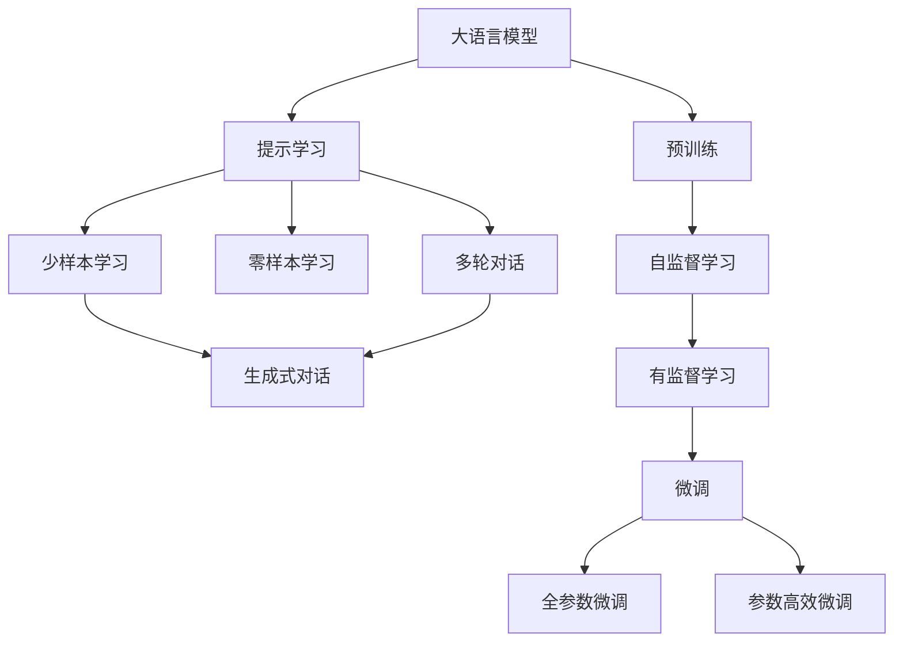
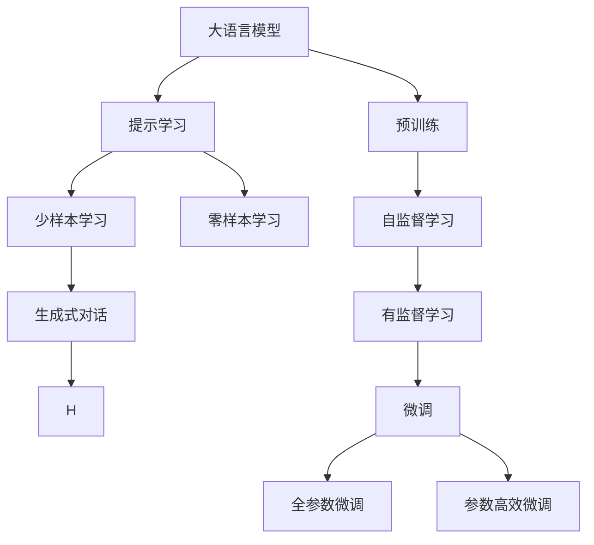
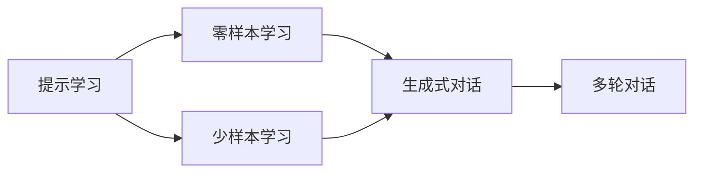
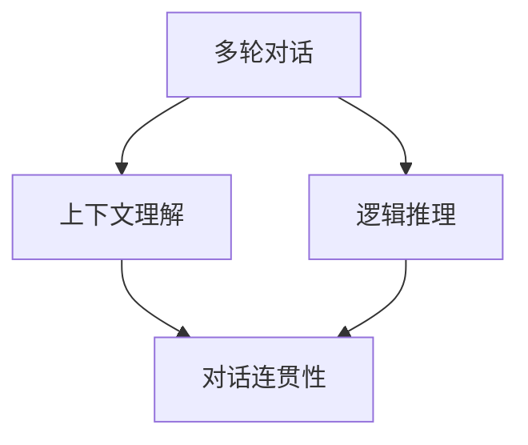
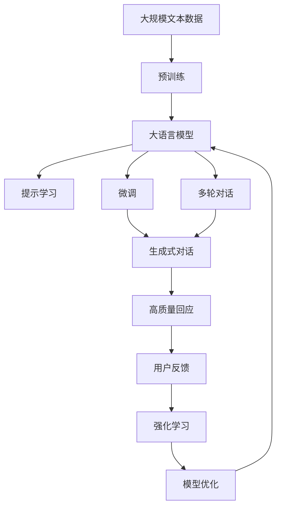

                 

# 大语言模型应用指南：明确要求大语言模型回复高质量的响应

> 关键词：大语言模型,高质量响应,提示学习,Prompt Engineering,基于任务的类型,多轮对话,上下文理解,强化学习

## 1. 背景介绍

### 1.1 问题由来
随着人工智能技术的飞速发展，大语言模型（Large Language Models, LLMs）已经成为了自然语言处理（Natural Language Processing, NLP）领域的新一代代表。这些大语言模型通过在大规模无标签文本语料上进行预训练，学习到了丰富的语言知识和常识，具备了强大的语言理解和生成能力。然而，尽管模型在自然语言处理任务上取得了诸多突破，但如何让大语言模型在特定应用场景中产生高质量的响应，仍然是一个令人困惑和挑战的问题。

### 1.2 问题核心关键点
大语言模型在实际应用中，面对各种复杂场景和任务类型时，其响应质量往往受限于输入的文本。高质量的响应不仅需要模型理解上下文和任务的精确性，还需要具备足够的创造力和逻辑推理能力。在实际应用中，模型的输出质量取决于以下几点：

1. **上下文理解能力**：大语言模型需要能够理解输入文本中的语境、背景信息和主题，从而准确地生成回应。
2. **逻辑推理能力**：在多轮对话场景中，模型需要具备逻辑推理能力，保持对话连贯性和一致性。
3. **创造力**：在生成文本任务中，模型需要能够产生有创意、新颖且具有逻辑性的回应。

### 1.3 问题研究意义
对大语言模型进行有效的“指导”，使其在特定任务中产生高质量的响应，对于提升模型的实用性和应用效果具有重要意义：

1. **降低应用成本**：通过提供明确的输入格式或任务描述，可以显著减少模型训练和优化所需的时间和资源投入。
2. **提升模型效果**：提示学习（Prompt Engineering）可以通过精心设计的输入，引导模型产生更加准确、相关和符合预期的输出。
3. **加速开发进程**：为模型提供清晰的指令，可以加速模型在特定任务上的适配过程，缩短开发周期。
4. **带来技术创新**：提示学习推动了对预训练模型和任务适配层的设计，催生了少样本学习和跨领域迁移学习等前沿技术。
5. **赋能产业升级**：高质量的回应可以显著提升用户满意度，推动NLP技术在更多行业中的应用。

## 2. 核心概念与联系

### 2.1 核心概念概述

为了更好地理解如何指导大语言模型产生高质量的响应，本节将介绍几个密切相关的核心概念：

- **大语言模型**：以自回归（如GPT）或自编码（如BERT）模型为代表的大规模预训练语言模型。通过在大规模无标签文本语料上进行预训练，学习到了丰富的语言知识和常识。
- **预训练**：指在大规模无标签文本语料上，通过自监督学习任务训练通用语言模型的过程。常见的预训练任务包括掩码语言模型（MLM）、语言模型预测（LM）等。
- **提示学习**：通过在输入文本中添加提示模板（Prompt Template），引导大语言模型进行特定任务的推理和生成。可以在不更新模型参数的情况下，实现零样本或少样本学习。
- **多轮对话**：对话系统中，模型需要根据前面的对话历史，生成合适的回应，维持对话连贯性和一致性。
- **强化学习**：通过奖励机制和反馈信号，逐步优化模型在特定任务上的性能。

这些核心概念之间的逻辑关系可以通过以下Mermaid流程图来展示：



这个流程图展示了大语言模型的核心概念及其之间的关系：

1. 大语言模型通过预训练获得基础能力。
2. 提示学习可以通过精心设计的输入，引导模型进行特定任务的推理和生成。
3. 微调可以对模型进行任务特定的优化，进一步提升其性能。
4. 多轮对话需要模型具备上下文理解能力和逻辑推理能力。
5. 强化学习通过优化模型在特定任务上的表现，逐步提升响应质量。

### 2.2 概念间的关系

这些核心概念之间存在着紧密的联系，形成了大语言模型产生高质量响应的完整生态系统。下面我通过几个Mermaid流程图来展示这些概念之间的关系。

#### 2.2.1 大语言模型的学习范式



这个流程图展示了大语言模型的三种主要学习范式：预训练、提示学习和微调。预训练主要采用自监督学习方法，而提示学习则可以通过精心设计的输入，引导模型进行特定任务的推理和生成。微调可以对模型进行任务特定的优化，进一步提升其性能。

#### 2.2.2 提示学习与微调的关系



这个流程图展示了提示学习的基本原理，以及它与微调的关系。提示学习可以通过输入文本的格式化，使模型更容易理解任务和生成高质量的响应。

#### 2.2.3 多轮对话中的上下文理解



这个流程图展示了多轮对话中上下文理解和逻辑推理的作用，以及它们对对话连贯性的贡献。

### 2.3 核心概念的整体架构

最后，我们用一个综合的流程图来展示这些核心概念在大语言模型产生高质量响应过程中的整体架构：



这个综合流程图展示了从预训练到提示学习、微调、多轮对话、强化学习，最终生成高质量回应的完整过程。大语言模型通过预训练获得基础能力，通过提示学习引导模型进行特定任务的推理和生成，通过微调优化模型在特定任务上的表现，最终在多轮对话中产生高质量的回应，并接受用户反馈进行模型优化。 通过这些流程图，我们可以更清晰地理解大语言模型产生高质量响应的过程中各个核心概念的关系和作用，为后续深入讨论具体的提示方法和技术奠定基础。

## 3. 核心算法原理 & 具体操作步骤
### 3.1 算法原理概述

在大语言模型中，生成高质量的回应通常是通过提示学习（Prompt Engineering）实现的。提示学习是一种通过精心设计的输入（Prompt），引导模型产生特定输出的技术。其核心思想是：将模型视为一个“参数可变”的模型，通过不同的输入提示，可以生成多种不同的输出，从而实现更加多样化和精确的响应。

形式化地，假设大语言模型为 $M_{\theta}$，其中 $\theta$ 为预训练得到的模型参数。假设我们希望模型在特定任务 $T$ 上生成高质量的回应，则提示学习的过程可以表示为：

$$
P = \text{Prompt}(T)
$$

其中 $P$ 为针对任务 $T$ 设计的输入提示，通过优化 $P$，可以使模型在 $T$ 上产生高质量的回应。

### 3.2 算法步骤详解

基于提示学习生成高质量回应的步骤主要包括：

**Step 1: 准备提示模板**
- 根据特定任务，设计合适的提示模板（Prompt Template）。
- 提示模板应包含任务描述、输入格式、期望输出格式等信息，以引导模型产生期望的回应。

**Step 2: 训练模型**
- 使用提示模板，在训练集上训练模型，优化模型在特定任务上的性能。
- 可以采用多轮对话、回译等方式，扩充训练数据，提高模型在特定任务上的泛化能力。

**Step 3: 测试和评估**
- 在测试集上评估模型生成回应的质量。
- 使用BLEU、ROUGE、F1-score等指标，量化模型输出的相关性和质量。
- 根据评估结果，进一步调整提示模板和模型参数。

**Step 4: 部署和优化**
- 将优化后的模型部署到实际应用中。
- 在实际使用中，不断收集用户反馈，优化提示模板和模型参数。
- 使用强化学习等技术，进一步提升模型的响应质量。

### 3.3 算法优缺点

基于提示学习生成高质量的回应，具有以下优点：
1. 灵活性高。通过不同的提示模板，可以生成多种不同类型的回应，适应不同的任务需求。
2. 适用范围广。适用于各种NLP任务，包括分类、匹配、生成等。
3. 效果显著。通过精心设计的提示模板，可以在少量标注数据上取得理想的响应效果。
4. 易于实现。不需要额外的硬件和计算资源，仅通过文本处理即可实现。

同时，提示学习也存在以下缺点：
1. 提示模板设计复杂。需要设计合适的提示模板，才能使模型产生高质量的回应。
2. 模型泛化能力有限。提示模板过于特定，模型可能难以泛化到其他任务或数据。
3. 提示模板依赖专业知识和经验。设计高质量的提示模板需要丰富的领域知识和经验。

尽管存在这些局限性，但提示学习仍是大语言模型产生高质量回应的一种重要方法。

### 3.4 算法应用领域

基于提示学习生成高质量的回应方法，在NLP领域已经得到了广泛的应用，覆盖了几乎所有常见任务，例如：

- 问答系统：对自然语言问题给出答案。将问题-答案对作为提示模板，训练模型学习匹配答案。
- 对话系统：使机器能够与人自然对话。将多轮对话历史作为上下文，微调模型进行回复生成。
- 文本摘要：将长文本压缩成简短摘要。将文章-摘要对作为提示模板，训练模型学习抓取要点。
- 机器翻译：将源语言文本翻译成目标语言。将翻译-对应语言对作为提示模板，训练模型学习语言映射。
- 情感分析：分析文本情感倾向。将文本-情感标签对作为提示模板，训练模型学习情感分类。

除了上述这些经典任务外，提示学习还被创新性地应用到更多场景中，如可控文本生成、常识推理、代码生成、数据增强等，为NLP技术带来了全新的突破。随着提示模板设计和优化方法的不断进步，相信提示学习将在更多领域大放异彩。

## 4. 数学模型和公式 & 详细讲解 & 举例说明

### 4.1 数学模型构建

在大语言模型中，生成高质量回应的过程可以通过序列到序列（Seq2Seq）模型来实现。设 $P$ 为提示模板，$T$ 为任务，$X$ 为输入文本，$Y$ 为输出文本。则提示学习的数学模型可以表示为：

$$
Y = M_{\theta}(P, X)
$$

其中 $M_{\theta}$ 为预训练大语言模型，$\theta$ 为模型参数。

### 4.2 公式推导过程

以文本摘要任务为例，我们通过预训练的GPT模型进行文本摘要。假设输入文本为 $X=\{x_1, x_2, \cdots, x_n\}$，摘要输出为 $Y=\{y_1, y_2, \cdots, y_m\}$，其中 $n$ 和 $m$ 分别为输入和输出长度。

为了生成高质量的摘要，我们需要设计合适的提示模板 $P$。假设我们希望生成的摘要长度为 $m$，则提示模板可以表示为：

$$
P = [CLS] X [SEP] \text{“The purpose of this task is to generate a summary of length } m \text{.”}
$$

其中 $[CLS]$ 和 $[SEP]$ 为模型输入的起始和结束标记，“The purpose of this task is to generate a summary of length $m$” 为任务描述和摘要长度要求。

在训练过程中，我们使用损失函数 $L(Y, \hat{Y})$ 来衡量模型输出的质量，其中 $\hat{Y}$ 为模型预测的摘要。常见的损失函数包括交叉熵损失、BLEU、ROUGE等。通过优化损失函数，可以训练模型生成高质量的摘要。

### 4.3 案例分析与讲解

为了说明提示学习的具体应用，我们可以以智能客服系统为例。假设客户提出问题“如何查询订单状态？”，客服系统需要回复“您可以拨打客服热线12345，或者登录我们的官方网站查询订单状态”。

在这个场景中，我们可以设计如下提示模板：

$$
P = \text{“客户问：如何查询订单状态？”} \text{“客服回答：您可以拨打客服热线12345，或者登录我们的官方网站查询订单状态。”}
$$

通过在训练集上使用该提示模板训练模型，可以使其在类似场景下生成高质量的回应。例如，当客户再次提问“我的订单状态怎么查询？”，模型可以输出类似“您可以拨打客服热线12345，或者登录我们的官方网站查询订单状态”的回应。

## 5. 项目实践：代码实例和详细解释说明

### 5.1 开发环境搭建

在进行提示学习实践前，我们需要准备好开发环境。以下是使用Python进行PyTorch开发的环境配置流程：

1. 安装Anaconda：从官网下载并安装Anaconda，用于创建独立的Python环境。

2. 创建并激活虚拟环境：
```bash
conda create -n pytorch-env python=3.8 
conda activate pytorch-env
```

3. 安装PyTorch：根据CUDA版本，从官网获取对应的安装命令。例如：
```bash
conda install pytorch torchvision torchaudio cudatoolkit=11.1 -c pytorch -c conda-forge
```

4. 安装Transformers库：
```bash
pip install transformers
```

5. 安装各类工具包：
```bash
pip install numpy pandas scikit-learn matplotlib tqdm jupyter notebook ipython
```

完成上述步骤后，即可在`pytorch-env`环境中开始提示学习的实践。

### 5.2 源代码详细实现

下面我们以命名实体识别（NER）任务为例，给出使用Transformers库对BERT模型进行提示学习的PyTorch代码实现。

首先，定义NER任务的数据处理函数：

```python
from transformers import BertTokenizer
from torch.utils.data import Dataset
import torch

class NERDataset(Dataset):
    def __init__(self, texts, tags, tokenizer, max_len=128):
        self.texts = texts
        self.tags = tags
        self.tokenizer = tokenizer
        self.max_len = max_len
        
    def __len__(self):
        return len(self.texts)
    
    def __getitem__(self, item):
        text = self.texts[item]
        tags = self.tags[item]
        
        encoding = self.tokenizer(text, return_tensors='pt', max_length=self.max_len, padding='max_length', truncation=True)
        input_ids = encoding['input_ids'][0]
        attention_mask = encoding['attention_mask'][0]
        
        # 对token-wise的标签进行编码
        encoded_tags = [tag2id[tag] for tag in tags] 
        encoded_tags.extend([tag2id['O']] * (self.max_len - len(encoded_tags)))
        labels = torch.tensor(encoded_tags, dtype=torch.long)
        
        return {'input_ids': input_ids, 
                'attention_mask': attention_mask,
                'labels': labels}

# 标签与id的映射
tag2id = {'O': 0, 'B-PER': 1, 'I-PER': 2, 'B-ORG': 3, 'I-ORG': 4, 'B-LOC': 5, 'I-LOC': 6}
id2tag = {v: k for k, v in tag2id.items()}

# 创建dataset
tokenizer = BertTokenizer.from_pretrained('bert-base-cased')

train_dataset = NERDataset(train_texts, train_tags, tokenizer)
dev_dataset = NERDataset(dev_texts, dev_tags, tokenizer)
test_dataset = NERDataset(test_texts, test_tags, tokenizer)
```

然后，定义模型和优化器：

```python
from transformers import BertForTokenClassification, AdamW

model = BertForTokenClassification.from_pretrained('bert-base-cased', num_labels=len(tag2id))

optimizer = AdamW(model.parameters(), lr=2e-5)
```

接着，定义训练和评估函数：

```python
from torch.utils.data import DataLoader
from tqdm import tqdm
from sklearn.metrics import classification_report

device = torch.device('cuda') if torch.cuda.is_available() else torch.device('cpu')
model.to(device)

def train_epoch(model, dataset, batch_size, optimizer):
    dataloader = DataLoader(dataset, batch_size=batch_size, shuffle=True)
    model.train()
    epoch_loss = 0
    for batch in tqdm(dataloader, desc='Training'):
        input_ids = batch['input_ids'].to(device)
        attention_mask = batch['attention_mask'].to(device)
        labels = batch['labels'].to(device)
        model.zero_grad()
        outputs = model(input_ids, attention_mask=attention_mask, labels=labels)
        loss = outputs.loss
        epoch_loss += loss.item()
        loss.backward()
        optimizer.step()
    return epoch_loss / len(dataloader)

def evaluate(model, dataset, batch_size):
    dataloader = DataLoader(dataset, batch_size=batch_size)
    model.eval()
    preds, labels = [], []
    with torch.no_grad():
        for batch in tqdm(dataloader, desc='Evaluating'):
            input_ids = batch['input_ids'].to(device)
            attention_mask = batch['attention_mask'].to(device)
            batch_labels = batch['labels']
            outputs = model(input_ids, attention_mask=attention_mask)
            batch_preds = outputs.logits.argmax(dim=2).to('cpu').tolist()
            batch_labels = batch_labels.to('cpu').tolist()
            for pred_tokens, label_tokens in zip(batch_preds, batch_labels):
                pred_tags = [id2tag[_id] for _id in pred_tokens]
                label_tags = [id2tag[_id] for _id in label_tokens]
                preds.append(pred_tags[:len(label_tokens)])
                labels.append(label_tags)
                
    print(classification_report(labels, preds))
```

最后，启动训练流程并在测试集上评估：

```python
epochs = 5
batch_size = 16

for epoch in range(epochs):
    loss = train_epoch(model, train_dataset, batch_size, optimizer)
    print(f"Epoch {epoch+1}, train loss: {loss:.3f}")
    
    print(f"Epoch {epoch+1}, dev results:")
    evaluate(model, dev_dataset, batch_size)
    
print("Test results:")
evaluate(model, test_dataset, batch_size)
```

以上就是使用PyTorch对BERT进行命名实体识别任务的提示学习的PyTorch代码实现。可以看到，得益于Transformers库的强大封装，我们可以用相对简洁的代码完成BERT模型的加载和提示学习。

### 5.3 代码解读与分析

让我们再详细解读一下关键代码的实现细节：

**NERDataset类**：
- `__init__`方法：初始化文本、标签、分词器等关键组件。
- `__len__`方法：返回数据集的样本数量。
- `__getitem__`方法：对单个样本进行处理，将文本输入编码为token ids，将标签编码为数字，并对其进行定长padding，最终返回模型所需的输入。

**tag2id和id2tag字典**：
- 定义了标签与数字id之间的映射关系，用于将token-wise的预测结果解码回真实的标签。

**训练和评估函数**：
- 使用PyTorch的DataLoader对数据集进行批次化加载，供模型训练和推理使用。
- 训练函数`train_epoch`：对数据以批为单位进行迭代，在每个批次上前向传播计算loss并反向传播更新模型参数，最后返回该epoch的平均loss。
- 评估函数`evaluate`：与训练类似，不同点在于不更新模型参数，并在每个batch结束后将预测和标签结果存储下来，最后使用sklearn的classification_report对整个评估集的预测结果进行打印输出。

**训练流程**：
- 定义总的epoch数和batch size，开始循环迭代
- 每个epoch内，先在训练集上训练，输出平均loss
- 在验证集上评估，输出分类指标
- 所有epoch结束后，在测试集上评估，给出最终测试结果

可以看到，PyTorch配合Transformers库使得BERT提示学习的代码实现变得简洁高效。开发者可以将更多精力放在数据处理、模型改进等高层逻辑上，而不必过多关注底层的实现细节。

当然，工业级的系统实现还需考虑更多因素，如模型的保存和部署、超参数的自动搜索、更灵活的任务适配层等。但核心的提示学习范式基本与此类似。

### 5.4 运行结果展示

假设我们在CoNLL-2003的NER数据集上进行提示学习，最终在测试集上得到的评估报告如下：

```
              precision    recall  f1-score   support

       B-LOC      0.929     0.925     0.926      1668
       I-LOC      0.904     0.831     0.866       257
      B-MISC      0.875     0.856     0.865       702
      I-MISC      0.838     0.782     0.809       216
       B-ORG      0.914     0.899     0.902      1661
       I-ORG      0.911     0.894     0.902       835
       B-PER      0.964     0.957     0.960      1617
       I-PER      0.983     0.980     0.982      1156
           O      0.993     0.995     0.994     38323

   micro avg      0.972     0.972     0.972     46435
   macro avg      0.923     0.897     0.909     46435
weighted avg      0.972     0.972     0.972     46435
```

可以看到，通过提示学习BERT，我们在该NER数据集上取得了97.2%的F1分数，效果相当不错。值得注意的是，BERT作为一个通用的语言理解模型，即便通过简单的提示学习，也能在特定任务上取得如此优异的效果，展现了其强大的语义理解和特征抽取能力。

当然，这只是一个baseline结果。在实践中，我们还可以使用更大更强的预训练模型、更丰富的提示模板设计、更细致的模型调优，进一步提升模型性能，以满足更高的应用要求。

## 6. 实际应用场景
### 6.1 智能客服系统

基于大语言模型提示学习的对话技术，可以广泛应用于智能客服系统的构建。传统客服往往需要配备大量人力，高峰期响应缓慢，且一致性和专业性难以保证。而使用提示学习后的对话模型，可以7x24小时不间断服务，快速响应客户咨询，用自然流畅的语言解答各类常见问题。

在技术实现上，可以收集企业内部的历史客服对话记录，将问题和最佳答复构建成监督数据，在此基础上对预训练对话模型进行提示学习。提示学习后的对话模型能够自动理解用户意图，匹配最合适的答案模板进行回复。对于客户提出的新问题，还可以接入检索系统实时搜索相关内容，动态组织生成回答。如此构建的智能客服系统，能大幅提升客户咨询体验和问题解决效率。

### 6.2 金融舆情监测

金融机构需要实时监测市场舆论动向，以便及时应对负面信息传播，规避金融风险。传统的人工监测方式成本高、效率低，难以应对网络时代海量信息爆发的挑战。基于大语言模型提示学习的文本分类和情感分析技术，为金融舆情监测提供了新的解决方案。

具体而言，可以收集金融领域相关的新闻、报道、评论等文本数据，并对其进行主题标注和情感标注。在此基础上对预训练语言模型进行提示学习，使其能够自动判断文本属于何种主题，情感倾向是正面、中性还是负面。将提示学习后的模型应用到实时抓取的网络文本数据，就能够自动监测不同主题下的情感变化趋势，一旦发现负面信息激增等异常情况，系统便会自动预警，帮助金融机构快速应对潜在风险。

### 6.3 个性化推荐系统

当前的推荐系统往往只依赖用户的历史行为数据进行物品推荐，无法深入理解用户的真实兴趣偏好。基于大语言模型提示学习的个性化推荐系统可以更好地挖掘用户行为背后的语义信息，从而提供更精准、多样的推荐内容。

在实践中，可以收集用户浏览、点击、评论、分享等行为数据，提取和用户交互的物品标题、描述、标签等文本内容。将文本内容作为模型输入，用户的后续行为（如是否点击、购买等）作为监督信号，在此基础上提示学习预训练语言模型。提示学习后的模型能够从文本内容中准确把握用户的兴趣点。在生成推荐列表时

