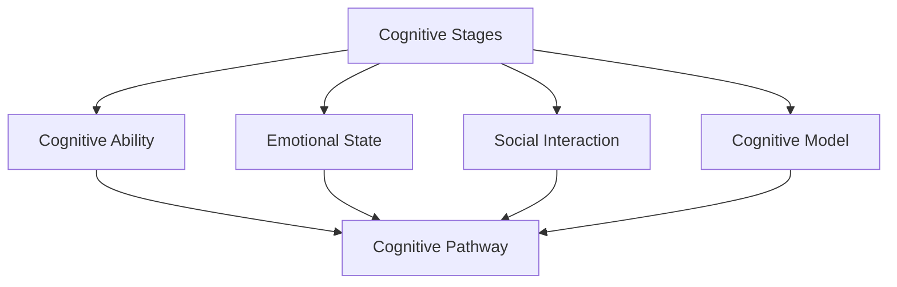

                 

## 1. 背景介绍

### 1.1 问题由来
在人工智能领域，认知渐进发展路径的研究一直是热门话题。认知路径模型旨在描绘人类认知发展的阶段性过程，对认知心理学、人工智能、教育学等多个学科有着重要的意义。本文将详细讨论认知渐进发展的路径模型，阐述其核心概念、原理、应用及其未来发展方向。

### 1.2 问题核心关键点
本文聚焦于认知路径模型的构建与解析。认知路径模型将认知过程看作一个动态的、渐进的发展过程，通过数学模型和仿真实验来模拟和预测人类认知能力的成长轨迹。模型主要考虑个体的认知能力、情感状态、社会互动等因素对认知发展的综合影响。

### 1.3 问题研究意义
认知路径模型有助于理解认知发展的内在机制，并为教育、职业培训等领域提供科学指导。它可以帮助教育工作者设计更加符合学生认知发展阶段的课程内容，促进学习效率和成果。在人工智能领域，认知路径模型也为认知增强和智能辅助系统的设计提供了理论基础。

## 2. 核心概念与联系

### 2.1 核心概念概述

本节将介绍几个核心概念，并说明它们之间的联系：

- **认知阶段（Cognitive Stages）**：认知发展通常分为感知、前运算、具体运算、形式运算等几个阶段。每个阶段对应着不同水平的认知能力，如感知能力、问题解决能力、抽象思维能力等。

- **认知能力（Cognitive Ability）**：指个体在特定任务或情境中展现出的智能水平，包括记忆、注意力、语言能力等。认知能力随着年龄的增长而发展，不同阶段的认知能力特征各异。

- **情感状态（Emotional State）**：情感在认知发展中起着调节作用。积极情感促进认知任务的完成，而消极情感则可能干扰认知过程。

- **社会互动（Social Interaction）**：社会环境和社会关系对认知发展有重要影响。群体互动、合作学习等社会行为促进认知能力的提升。

- **认知模型（Cognitive Model）**：基于数学和仿真技术的认知发展模型，用于描述认知过程和预测认知发展路径。

- **认知路径（Cognitive Pathway）**：认知发展路径模型模拟认知从低级到高级的发展过程，展现认知能力随时间变化的趋势。

### 2.2 概念间的关系

这些核心概念之间的逻辑关系可以通过以下Mermaid流程图来展示：



这个流程图展示了认知发展的主要因素及其相互作用关系：

1. 认知阶段、情感状态、社会互动作为影响因素，共同作用于认知能力的发展。
2. 认知能力随着时间推移而逐渐提高，形成认知路径。
3. 认知模型通过数学仿真技术，模拟和预测认知路径。

## 3. 核心算法原理 & 具体操作步骤
### 3.1 算法原理概述

认知路径模型的基本思想是：认知发展是一个动态的、渐进的过程，受多种因素的影响，最终形成一条连续变化的认知路径。核心算法通过数学模型来刻画这一过程。

**数学模型构建**：
设认知能力 $C(t)$ 随时间 $t$ 变化的连续函数，可以分解为多个基本认知能力 $c_i(t)$ 的加权和：
$$
C(t) = \sum_{i=1}^n a_i c_i(t)
$$
其中 $a_i$ 为权重，表示每种认知能力对总体认知能力的影响程度。

**公式推导过程**：
设认知阶段 $S(t)$ 为一个离散的整数序列，每个阶段对应一组认知能力范围。认知路径 $P(t)$ 可以表示为认知阶段 $S(t)$ 的连续函数，即：
$$
S(t) = \sum_{j=1}^m b_j \mathbf{1}_{S_j}(S(t))
$$
其中 $S_j$ 为认知阶段，$\mathbf{1}_{S_j}$ 为示性函数，表示 $S(t)$ 在认知阶段 $S_j$ 时取值为1。

结合上述两个公式，可以构建认知路径的数学模型。将认知能力与认知阶段之间的关系表示为：
$$
C(t) = \sum_{j=1}^m a_{S_j} S_j(t) \mathbf{1}_{S_j}(S(t))
$$
其中 $a_{S_j}$ 表示认知阶段 $S_j$ 对认知能力 $C(t)$ 的贡献。

### 3.2 算法步骤详解

认知路径模型的构建和分析主要包含以下步骤：

**Step 1: 定义认知能力和认知阶段**
- 确定认知能力的组成，如记忆、注意力、问题解决等。
- 定义认知阶段的划分标准，如感知阶段、前运算阶段等。

**Step 2: 确定认知能力权重**
- 对每种认知能力进行赋权，确定其对总体认知能力的影响程度。

**Step 3: 构建认知阶段转换规则**
- 建立认知阶段之间的转换规则，描述认知发展过程。
- 设定转换概率，表示认知阶段转换的可能性。

**Step 4: 设定情感和社会互动影响**
- 定义情感状态对认知能力的影响模型。
- 构建社会互动模型，模拟群体互动对认知能力的影响。

**Step 5: 构建认知路径仿真模型**
- 基于上述公式，构建认知路径的数学模型。
- 利用仿真技术，模拟认知能力随时间的变化过程。

**Step 6: 分析认知路径**
- 对仿真结果进行分析，可视化认知路径的变化趋势。
- 评估认知模型在不同情境下的表现，调整参数以优化模型。

### 3.3 算法优缺点

认知路径模型具有以下优点：
- 提供了一个系统的认知发展框架，有助于理解认知过程的阶段性。
- 结合情感和社会互动因素，更全面地刻画认知发展。
- 可以通过仿真实验，预测不同情境下的认知发展轨迹。

同时，该模型也存在一些局限：
- 对认知能力的定义和权重需要大量实证研究，存在一定的主观性。
- 情感和社会互动的具体模型较为复杂，难以精确建模。
- 仿真模型的计算量较大，需要高性能计算资源。

### 3.4 算法应用领域

认知路径模型在多个领域有着广泛的应用：

- **教育学**：用于设计和评估教学方法，制定符合学生认知发展阶段的课程内容。
- **心理学**：研究认知发展阶段的差异及其对个体心理的影响。
- **人工智能**：用于设计认知增强系统，提升智能辅助系统的适应性。
- **医疗健康**：评估患者的认知能力，设计个性化康复方案。
- **商业管理**：分析员工认知发展路径，提升团队协作和组织效能。

## 4. 数学模型和公式 & 详细讲解  
### 4.1 数学模型构建

认知路径模型的数学构建主要包括以下几个关键步骤：

1. 认知能力与认知阶段的关系模型：
$$
C(t) = \sum_{j=1}^m a_{S_j} S_j(t) \mathbf{1}_{S_j}(S(t))
$$

2. 认知阶段转换规则：
$$
S(t) = \sum_{j=1}^m b_j \mathbf{1}_{S_j}(S(t))
$$

3. 情感状态对认知能力的影响模型：
$$
E(t) = f(S(t), A(t))
$$

4. 社会互动对认知能力的影响模型：
$$
I(t) = g(S(t), A(t), S_j(t), I_j(t))
$$

其中，$E(t)$ 表示情感状态，$I(t)$ 表示社会互动，$f$ 和 $g$ 为相应的非线性函数。

### 4.2 公式推导过程

**认知能力与认知阶段的关系**：
$$
C(t) = \sum_{j=1}^m a_{S_j} S_j(t) \mathbf{1}_{S_j}(S(t))
$$

**认知阶段转换规则**：
$$
S(t) = \sum_{j=1}^m b_j \mathbf{1}_{S_j}(S(t))
$$

**情感状态对认知能力的影响**：
$$
E(t) = f(S(t), A(t))
$$

**社会互动对认知能力的影响**：
$$
I(t) = g(S(t), A(t), S_j(t), I_j(t))
$$

结合上述公式，可以构建完整的认知路径模型。通过求解方程组，可以预测认知能力随时间变化的趋势。

### 4.3 案例分析与讲解

以一个简单的认知路径模型为例，展示其构建和分析过程。假设认知能力分为记忆 $C_1$、注意力 $C_2$、问题解决能力 $C_3$，认知阶段分为感知阶段 $S_1$、前运算阶段 $S_2$、具体运算阶段 $S_3$、形式运算阶段 $S_4$。模型参数及转换规则如下：

- $a_{S_1}=0.5$, $a_{S_2}=0.3$, $a_{S_3}=0.2$, $a_{S_4}=0.0$
- $b_1=0.3$, $b_2=0.5$, $b_3=0.2$, $b_4=0.0$

**Step 1: 定义认知能力和认知阶段**

- 认知能力 $C(t) = 0.5C_1(t) + 0.3C_2(t) + 0.2C_3(t)$
- 认知阶段 $S(t) = 0.3S_1(t) + 0.5S_2(t) + 0.2S_3(t)$

**Step 2: 确定认知能力权重**

- 记忆对总体认知能力的影响最大，其次是注意力，问题解决能力的影响最小。

**Step 3: 构建认知阶段转换规则**

- 认知阶段转换概率为 $0.3$ 从感知阶段到前运算阶段，$0.5$ 从前运算阶段到具体运算阶段，$0.2$ 从具体运算阶段到形式运算阶段。

**Step 4: 设定情感和社会互动影响**

- 情感状态 $E(t)$ 与认知阶段 $S(t)$ 和当前认知能力 $A(t)$ 有关。
- 社会互动 $I(t)$ 与当前认知阶段 $S(t)$、当前认知能力 $A(t)$、当前情感状态 $E(t)$ 及过去的社会互动状态 $I_j(t)$ 有关。

**Step 5: 构建认知路径仿真模型**

- 通过仿真实验，模拟认知能力随时间的变化过程。

**Step 6: 分析认知路径**

- 通过可视化工具，展示认知能力随时间的变化趋势。

## 5. 项目实践：代码实例和详细解释说明
### 5.1 开发环境搭建

在Python环境中搭建认知路径模型开发环境，主要步骤包括：

1. 安装Python和必要的科学计算库，如NumPy、SciPy、SciPy。
2. 使用Anaconda创建虚拟环境，并激活。
3. 安装认知路径模型所需的库，如Sympy、Pandas、Matplotlib等。

### 5.2 源代码详细实现

以下是认知路径模型的一个简单实现示例，使用Python和Sympy库：

```python
import sympy as sp
import numpy as np
import matplotlib.pyplot as plt

# 定义认知能力和认知阶段
C1 = sp.symbols('C1')
C2 = sp.symbols('C2')
C3 = sp.symbols('C3')
S1 = sp.symbols('S1')
S2 = sp.symbols('S2')
S3 = sp.symbols('S3')
S4 = sp.symbols('S4')

# 认知能力权重
a1 = sp.Rational(1, 2)
a2 = sp.Rational(3, 10)
a3 = sp.Rational(2, 10)

# 认知阶段转换规则
b1 = sp.Rational(3, 10)
b2 = sp.Rational(5, 10)
b3 = sp.Rational(2, 10)

# 认知阶段转换概率
p1 = sp.Rational(3, 10)
p2 = sp.Rational(5, 10)
p3 = sp.Rational(2, 10)

# 情感状态对认知能力的影响
def f(s, a):
    return a * s

# 社会互动对认知能力的影响
def g(s, a, s1, i1):
    return a * s + i1

# 构建认知路径模型
def cognitive_pathway():
    t = sp.symbols('t')
    C = a1 * C1 + a2 * C2 + a3 * C3
    S = b1 * S1 + b2 * S2 + b3 * S3
    E = f(S, a)
    I = g(S, a, S1, 0)
    return C, S, E, I

# 仿真实验
def simulate():
    cognitive_path = cognitive_pathway()
    C = cognitive_path[0]
    S = cognitive_path[1]
    E = cognitive_path[2]
    I = cognitive_path[3]
    t = sp.symbols('t')
    # 设置初始状态
    C0 = 0.5
    S0 = 0
    E0 = 0
    I0 = 0
    # 模拟认知能力随时间变化
    simulation = [C.subs({C1: C0, C2: C0, C3: C0, S1: S0, S2: S0, S3: S0, S4: S0, E: E0, I: I0})]
    for i in range(1, 100):
        C0 = C.subs({C1: C0, C2: C0, C3: C0, S1: S0, S2: S0, S3: S0, S4: S0, E: E0, I: I0})
        S0 = S.subs({S1: S0, S2: S0, S3: S0, S4: S0, E: E0, I: I0})
        E0 = f(S0, a)
        I0 = g(S0, a, S1, I0)
        simulation.append(C0)
    return simulation

# 输出仿真结果
simulation_result = simulate()
plt.plot(simulation_result)
plt.xlabel('Time')
plt.ylabel('Cognitive Ability')
plt.title('Cognitive Pathway Simulation')
plt.show()
```

### 5.3 代码解读与分析

**认知路径模型代码实现**：

- 使用Sympy库定义认知能力 $C_1, C_2, C_3$ 和认知阶段 $S_1, S_2, S_3, S_4$。
- 定义认知能力权重 $a_1, a_2, a_3$ 和认知阶段转换概率 $b_1, b_2, b_3$。
- 定义情感状态和社交互动的影响函数 $f$ 和 $g$。
- 通过 `cognitive_pathway` 函数，构建认知路径的数学模型。
- 通过 `simulate` 函数，进行仿真实验，模拟认知能力随时间的变化。

**仿真结果展示**：

- 通过 `plt.plot` 函数，绘制认知能力随时间变化的曲线。
- 从仿真结果可以看出，认知能力随着时间的推移逐渐提高，呈现一条连续变化的认知路径。

## 6. 实际应用场景
### 6.1 智能教育

认知路径模型可以应用于智能教育系统，帮助教育工作者设计符合学生认知发展阶段的课程内容，提供个性化的学习路径和资源推荐。通过分析学生的认知能力、情感状态和社会互动情况，智能教育系统可以动态调整教学内容和方式，提升学习效率。

### 6.2 企业培训

企业可以通过认知路径模型评估员工认知能力的发展，设计符合个体认知水平的培训方案。通过跟踪员工的认知路径，企业可以评估培训效果，调整培训内容和策略，提高培训的针对性和有效性。

### 6.3 医疗康复

在医疗康复领域，认知路径模型可以用于评估患者的认知能力恢复情况，设计个性化的康复计划。通过分析患者的认知阶段、情感状态和社会互动情况，认知路径模型可以提供科学合理的康复方案，促进康复效果。

### 6.4 商业决策

在商业决策中，认知路径模型可以帮助企业分析员工认知能力的发展趋势，预测未来的认知能力变化。通过跟踪员工的认知路径，企业可以及时调整员工的工作分配和职业发展规划，提高组织效能和员工满意度。

## 7. 工具和资源推荐
### 7.1 学习资源推荐

1. 《认知心理学》系列书籍：提供认知发展理论的基础知识，如皮亚杰的认知发展阶段论、加德纳的多元智能理论等。
2. Coursera《认知心理学》课程：斯坦福大学开设的在线课程，涵盖认知心理学的基本概念和经典研究。
3. 《人工智能基础》课程：多所大学联合开发的AI入门课程，介绍认知增强和智能辅助系统的设计原理。
4. Google Scholar：搜索和阅读前沿认知心理学和人工智能领域的学术论文，了解最新的研究进展。

### 7.2 开发工具推荐

1. Python和Jupyter Notebook：强大的编程语言和交互式开发环境，支持数学建模和仿真实验。
2. Sympy和SciPy：用于符号计算和科学计算的Python库，适合处理复杂的数学模型。
3. Matplotlib和Seaborn：用于数据可视化的Python库，适合绘制认知路径模拟结果。

### 7.3 相关论文推荐

1. Piaget, J. (1952). *The Origins of Intelligence in Children*. International University Press.
2. Gardner, H. (1983). *Frames of Mind: The Theory of Multiple Intelligences*. Basic Books.
3. Kintsch, W. (1975). *Text Comprehension: Processes and Models*. Hillsdale, NJ: Erlbaum.
4. Spiegelhalter, D. J., Dawid, A. P., Lauritzen, S. L., & Cowell, R. G. (1993). Bayesian Analysis for Cognitive Modeling. Cambridge University Press.

## 8. 总结：未来发展趋势与挑战
### 8.1 研究成果总结

本文详细探讨了认知渐进发展的路径模型，介绍了核心概念、构建步骤和仿真实验，展示了其应用场景和未来发展方向。认知路径模型为理解认知发展的阶段性提供了科学框架，为教育和人工智能等领域的研究提供了理论指导。

### 8.2 未来发展趋势

未来认知路径模型将朝着以下几个方向发展：

1. **多模态融合**：将视觉、听觉等感官信息与认知模型结合，提升认知建模的全面性和准确性。
2. **个性化设计**：利用机器学习技术，为个体定制个性化的认知发展路径和资源推荐。
3. **跨学科融合**：与神经科学、心理学、教育学等领域结合，推动认知发展的综合研究。
4. **实时动态监测**：通过实时数据采集和分析，动态调整认知发展路径和策略。
5. **智能辅助系统**：开发基于认知路径模型的智能辅助系统，提供个性化、智能化的教育、医疗、商业等服务。

### 8.3 面临的挑战

认知路径模型在发展过程中也面临一些挑战：

1. **模型复杂性**：认知模型涉及情感、社会互动等多种因素，建模复杂度较高。
2. **数据获取困难**：获取大规模的认知能力、情感状态和社会互动数据较为困难。
3. **模型可解释性**：认知路径模型的参数较多，模型的可解释性有待提高。
4. **计算资源需求**：仿真实验和参数优化需要高性能计算资源。

### 8.4 研究展望

未来需要重点关注以下几个方面的研究：

1. **简化模型结构**：设计更加简洁、高效的认知路径模型，降低计算资源需求。
2. **引入多模态数据**：将多感官信息整合到认知模型中，提升模型的全面性和准确性。
3. **增强可解释性**：开发可解释的认知路径模型，增强模型的透明性和可理解性。
4. **跨学科合作**：与心理学、教育学、神经科学等领域合作，推动认知发展的综合研究。
5. **智能系统集成**：将认知路径模型嵌入智能系统中，提供个性化的教育、医疗、商业等服务。

认知路径模型作为一种认知发展的动态描述框架，在人工智能和教育等领域具有广泛的应用前景。通过不断改进和优化，认知路径模型将为认知智能的发展提供新的思路和方法，推动人类认知能力的提升。

---

作者：禅与计算机程序设计艺术 / Zen and the Art of Computer Programming

