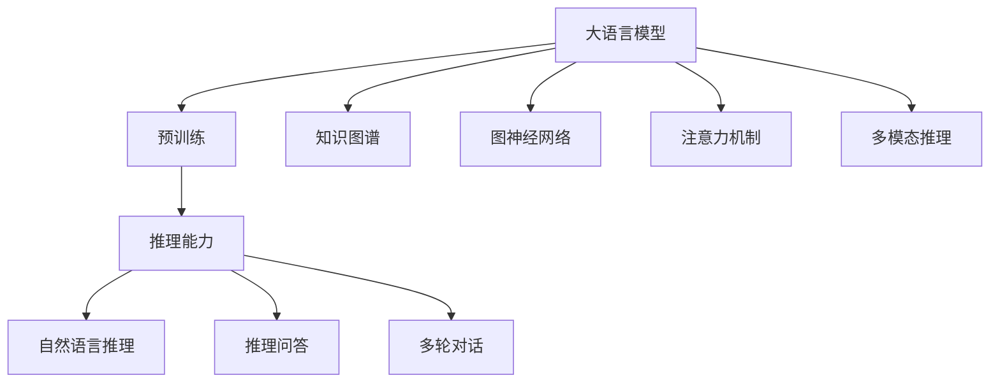
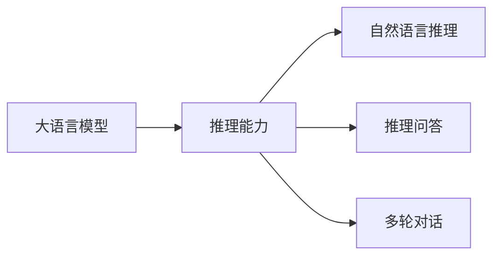
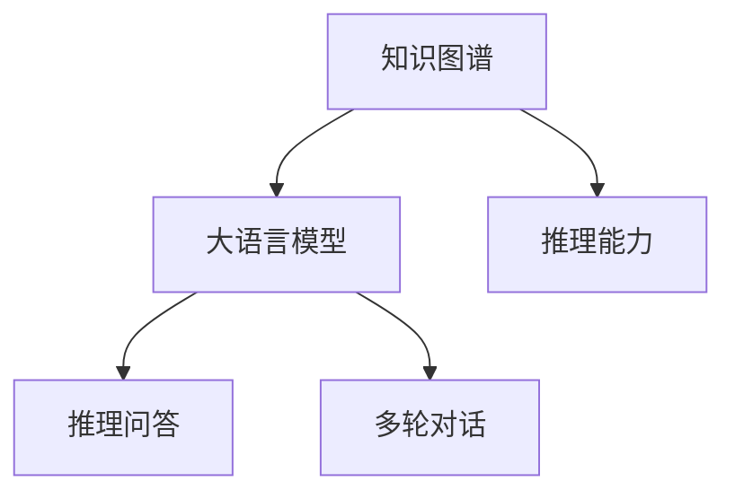
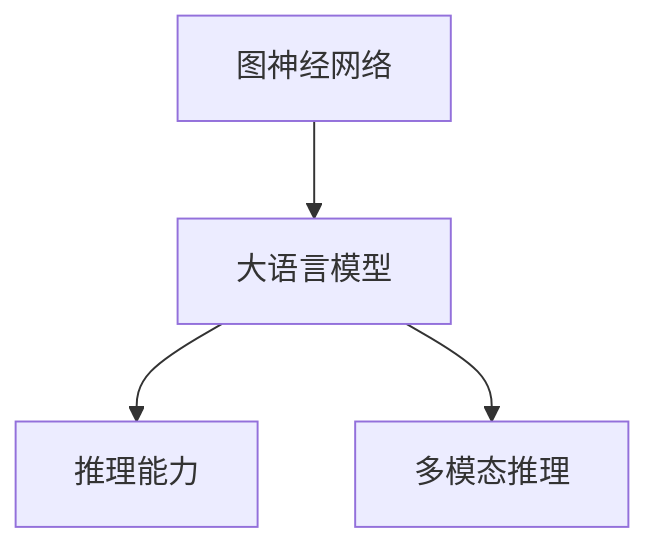
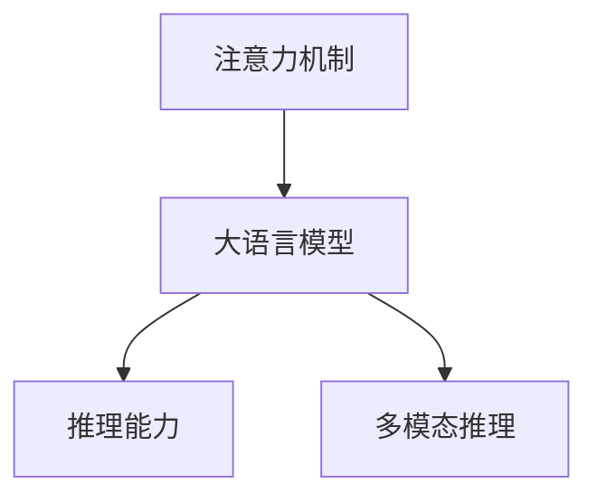
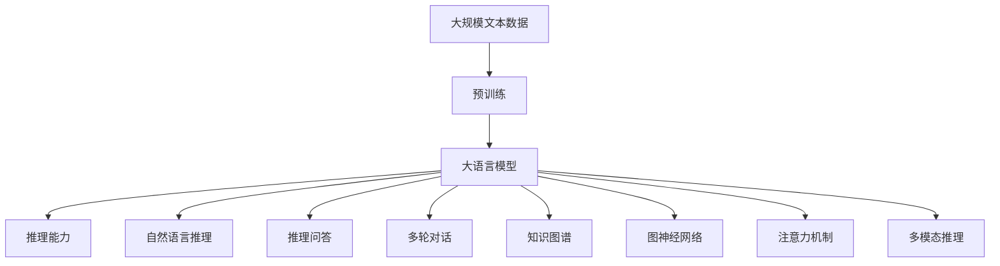

                 

# 语言与推理：大模型的瓶颈

> 关键词：大语言模型, 推理能力, 知识图谱, 图神经网络, 注意力机制, 多模态推理, 深度学习, 自然语言处理(NLP)

## 1. 背景介绍

### 1.1 问题由来

近年来，深度学习在自然语言处理（NLP）领域取得了巨大进展，尤其是大规模预训练语言模型（Large Language Models, LLMs）的兴起，为NLP任务带来了前所未有的突破。这些大模型在处理大规模文本数据上展现了强大的能力，能够在各种NLP任务上取得优异性能，如文本分类、情感分析、机器翻译等。然而，尽管大模型的预训练能力已经非常强大，但它们在推理和理解复杂语言能力上仍然存在瓶颈。如何在大模型中更好地融入推理能力，使其不仅能够处理大规模文本，还能够对复杂的语言逻辑进行有效推理，成为了当前NLP研究的重点。

### 1.2 问题核心关键点

推理在大模型中的应用，主要涉及以下几个核心问题：

- 推理能力与预训练模型的融合。如何将推理能力自然地融入到预训练模型的构建中，使其在处理复杂语言逻辑时能够有效推理。
- 推理模型的设计。如何设计推理模型，使其能够高效地进行推理计算，同时具备良好的泛化能力。
- 多模态推理。推理能力不仅仅局限于自然语言处理，还可以扩展到图像、视频等多模态数据的处理。如何将不同模态的数据进行有效融合，进行联合推理。
- 推理结果的可解释性。如何设计推理过程，使其不仅能够输出结果，还能够解释推理的逻辑和路径。

这些问题的解决，有助于大模型在推理任务上进一步提升性能，推动NLP技术向更深层次发展。

### 1.3 问题研究意义

推理能力的提升，将显著扩展大模型的应用范围，使其不仅在文本处理上表现出色，还能在更复杂的推理任务中发挥重要作用。例如，在智能问答、智能客服、智能推荐、自动摘要等任务中，推理能力能够帮助模型理解用户意图，生成更加符合逻辑的回复。同时，推理能力也将推动AI向更高级的认知智能（Cognitive AI）迈进，为人工智能技术在更多领域的应用奠定基础。

## 2. 核心概念与联系

### 2.1 核心概念概述

为更好地理解推理能力在大模型中的作用，本节将介绍几个关键的概念：

- 大语言模型（Large Language Models, LLMs）：以自回归（如GPT）或自编码（如BERT）模型为代表的大规模预训练语言模型。通过在大规模无标签文本数据上进行预训练，学习通用的语言表示，具备强大的语言理解和生成能力。

- 推理能力（Reasoning Ability）：指模型处理复杂语言逻辑的能力，包括自然语言推理（Natural Language Inference, NLI）、推理问答（Reasoning QA）、多轮对话（Multi-turn Dialogue）等任务。

- 知识图谱（Knowledge Graphs）：由节点（实体）和边（关系）组成的有向图，用于表示实体之间的语义关系。知识图谱可以增强模型的语义理解能力，使其能够进行推理。

- 图神经网络（Graph Neural Networks, GNNs）：一类专门处理图数据的神经网络，通过聚合邻居节点信息来更新节点表示，用于处理图结构数据。

- 注意力机制（Attention Mechanisms）：在大模型中，通过注意力机制（如Transformer的Self-Attention），可以动态地选择和加权输入信息，提升模型的表达能力。

- 多模态推理（Multimodal Reasoning）：结合图像、视频等多模态数据，进行联合推理，提高模型对复杂场景的理解能力。

这些核心概念之间的逻辑关系可以通过以下Mermaid流程图来展示：



这个流程图展示了大语言模型的核心概念及其之间的关系：

1. 大语言模型通过预训练获得基础能力。
2. 推理能力是大语言模型的重要拓展，包括自然语言推理、推理问答、多轮对话等任务。
3. 知识图谱和多模态数据可以增强大模型的推理能力。
4. 图神经网络、注意力机制等技术可用于处理图结构数据和多模态数据。
5. 多模态推理涉及不同模态数据的联合处理，进一步提升大模型的推理能力。

### 2.2 概念间的关系

这些核心概念之间存在着紧密的联系，形成了大语言模型推理的完整生态系统。下面我们通过几个Mermaid流程图来展示这些概念之间的关系。

#### 2.2.1 推理能力与大语言模型的融合



这个流程图展示了推理能力在大语言模型中的重要位置，以及它涵盖的自然语言推理、推理问答、多轮对话等任务。

#### 2.2.2 知识图谱在大语言模型中的应用



这个流程图展示了知识图谱如何增强大语言模型的推理能力，使其能够进行更复杂的推理任务。

#### 2.2.3 图神经网络在大语言模型中的应用



这个流程图展示了图神经网络如何帮助大语言模型处理图结构数据，提升其推理能力。

#### 2.2.4 注意力机制在大语言模型中的应用



这个流程图展示了注意力机制如何帮助大语言模型处理多模态数据，提升其推理能力。

### 2.3 核心概念的整体架构

最后，我们用一个综合的流程图来展示这些核心概念在大语言模型推理过程中的整体架构：



这个综合流程图展示了从预训练到推理的全过程。大语言模型首先在大规模文本数据上进行预训练，然后通过推理能力进行多模态数据的处理和推理计算，最后输出推理结果。通过这些流程图，我们可以更清晰地理解大语言模型推理过程中各个核心概念的关系和作用。

## 3. 核心算法原理 & 具体操作步骤
### 3.1 算法原理概述

基于大语言模型的推理能力，本质上是通过有监督或自监督的方式，训练模型在特定推理任务上的性能。其核心思想是：将推理任务作为新的任务，对预训练模型进行微调，使其能够在新任务上更好地发挥作用。

形式化地，假设预训练模型为 $M_{\theta}$，其中 $\theta$ 为预训练得到的模型参数。给定推理任务 $T$ 的标注数据集 $D=\{(x_i,y_i)\}_{i=1}^N$，推理过程的目标是找到新的模型参数 $\hat{\theta}$，使得：

$$
\hat{\theta}=\mathop{\arg\min}_{\theta} \mathcal{L}(M_{\theta},D)
$$

其中 $\mathcal{L}$ 为针对任务 $T$ 设计的损失函数，用于衡量模型预测输出与真实标签之间的差异。常见的损失函数包括交叉熵损失、均方误差损失等。

通过梯度下降等优化算法，推理过程不断更新模型参数 $\theta$，最小化损失函数 $\mathcal{L}$，使得模型输出逼近真实标签。由于 $\theta$ 已经通过预训练获得了较好的初始化，因此即便在特定推理任务上，模型也能较快收敛到理想的推理结果。

### 3.2 算法步骤详解

基于大语言模型的推理能力，一般包括以下几个关键步骤：

**Step 1: 准备推理任务和数据集**
- 选择合适的推理任务 $T$，如自然语言推理、推理问答、多轮对话等。
- 准备任务 $T$ 的标注数据集 $D=\{(x_i,y_i)\}_{i=1}^N$，其中 $x_i$ 为输入文本，$y_i$ 为推理标签。

**Step 2: 添加推理任务适配层**
- 根据任务类型，在预训练模型顶层设计合适的推理输出层和损失函数。
- 对于推理问答任务，通常使用语言模型的解码器输出概率分布，并以交叉熵损失为损失函数。
- 对于自然语言推理任务，通常设计两个分支，分别对应两个不同的推理方向（如蕴涵、矛盾、中立），并以交叉熵损失为损失函数。

**Step 3: 设置推理超参数**
- 选择合适的优化算法及其参数，如 AdamW、SGD 等，设置学习率、批大小、迭代轮数等。
- 设置正则化技术及强度，包括权重衰减、Dropout、Early Stopping 等。
- 确定冻结预训练参数的策略，如仅微调顶层，或全部参数都参与微调。

**Step 4: 执行推理训练**
- 将推理数据集分批次输入模型，前向传播计算损失函数。
- 反向传播计算参数梯度，根据设定的优化算法和学习率更新模型参数。
- 周期性在验证集上评估模型性能，根据性能指标决定是否触发 Early Stopping。
- 重复上述步骤直到满足预设的迭代轮数或 Early Stopping 条件。

**Step 5: 推理评估和应用**
- 在测试集上评估推理后模型 $M_{\hat{\theta}}$ 的性能，对比推理前后的精度提升。
- 使用推理后模型对新样本进行推理预测，集成到实际的应用系统中。

以上是基于大语言模型的推理能力的一般流程。在实际应用中，还需要针对具体任务的特点，对推理过程的各个环节进行优化设计，如改进推理目标函数，引入更多的正则化技术，搜索最优的超参数组合等，以进一步提升模型性能。

### 3.3 算法优缺点

基于大语言模型的推理能力，具有以下优点：

- 简单易用。推理任务的适配层设计简单，能够快速地对预训练模型进行微调。
- 通用性强。适用于各种NLP推理任务，如自然语言推理、推理问答、多轮对话等。
- 可解释性强。推理过程可以通过可视化图表展示，方便理解和调试。

同时，该方法也存在一定的局限性：

- 依赖标注数据。推理任务的微调效果很大程度上取决于标注数据的质量和数量，获取高质量标注数据的成本较高。
- 推理效果受限于预训练模型的质量。预训练模型的固有偏见、有害信息等，可能通过推理过程传递到下游任务，造成负面影响。
- 推理能力与模型规模正相关。推理任务通常需要更大的模型规模来保证推理精度，因此资源消耗较大。

尽管存在这些局限性，但就目前而言，基于大语言模型的推理方法仍是大规模NLP推理任务的重要范式。未来相关研究的重点在于如何进一步降低推理对标注数据的依赖，提高模型的少样本学习和跨领域迁移能力，同时兼顾可解释性和伦理安全性等因素。

### 3.4 算法应用领域

基于大语言模型的推理能力，已经在多个NLP领域得到了广泛的应用，包括但不限于：

- 问答系统：对自然语言问题给出答案。通过推理问答模型，将问题-答案对作为微调数据，训练模型学习匹配答案。
- 文本摘要：将长文本压缩成简短摘要。推理模型能够通过多轮对话，理解文章内容并生成摘要。
- 对话系统：使机器能够与人自然对话。通过多轮对话模型，推理用户意图并生成回复。
- 自然语言推理：判断两个句子之间的推理关系。通过推理模型，分析文本逻辑并进行推理。
- 情感分析：分析文本的情感倾向。通过推理模型，判断文本的情感极性。
- 机器翻译：将源语言文本翻译成目标语言。通过推理模型，分析语义关系并进行翻译。
- 关系抽取：从文本中抽取实体之间的语义关系。通过推理模型，理解实体之间的逻辑关系并进行抽取。

除了上述这些经典任务外，大语言模型的推理能力也被创新性地应用到更多场景中，如知识图谱构建、多模态推理、语音情感识别等，为NLP技术带来了全新的突破。随着推理能力的不断演进，相信NLP技术将在更广阔的应用领域大放异彩。

## 4. 数学模型和公式 & 详细讲解 & 举例说明

### 4.1 数学模型构建

本节将使用数学语言对大语言模型推理过程进行更加严格的刻画。

记推理任务为 $T$，其训练集为 $D=\{(x_i,y_i)\}_{i=1}^N$，其中 $x_i$ 为输入文本，$y_i$ 为推理标签。

定义模型 $M_{\theta}$ 在输入 $x$ 上的推理输出为 $\hat{y}=M_{\theta}(x) \in [0,1]$，表示推理结果的概率分布。推理任务的目标是最大化模型输出与真实标签之间的交叉熵，即：

$$
\mathcal{L}(\theta) = -\frac{1}{N}\sum_{i=1}^N y_i\log M_{\theta}(x_i)+(1-y_i)\log(1-M_{\theta}(x_i))
$$

其中 $y_i$ 为推理标签，$M_{\theta}(x_i)$ 为模型在输入 $x_i$ 上的推理输出。

在推理过程中，通常使用深度学习模型作为推理引擎，如BERT、GPT等。假设模型 $M_{\theta}$ 为BERT，推理过程的优化目标为：

$$
\theta^* = \mathop{\arg\min}_{\theta} \mathcal{L}(M_{\theta},D)
$$

通过梯度下降等优化算法，推理过程不断更新模型参数 $\theta$，最小化损失函数 $\mathcal{L}$，使得模型输出逼近真实标签。由于 $\theta$ 已经通过预训练获得了较好的初始化，因此即便在特定推理任务上，模型也能较快收敛到理想的推理结果。

### 4.2 公式推导过程

以下我们以自然语言推理（NLI）任务为例，推导交叉熵损失函数及其梯度的计算公式。

假设模型 $M_{\theta}$ 在输入 $x$ 上的推理输出为 $\hat{y}=M_{\theta}(x) \in [0,1]$，表示推理结果的概率分布。真实标签 $y \in \{0,1\}$。则自然语言推理任务定义如下：

- 蕴涵（entailment）：如果 $x$ 蕴含 $y$，则推理结果为正。
- 矛盾（contradiction）：如果 $x$ 与 $y$ 矛盾，则推理结果为负。
- 中立（neutral）：如果 $x$ 与 $y$ 无关，则推理结果为中。

交叉熵损失函数定义为：

$$
\ell(M_{\theta}(x),y) = -[y\log \hat{y} + (1-y)\log (1-\hat{y})]
$$

将其代入经验风险公式，得：

$$
\mathcal{L}(\theta) = -\frac{1}{N}\sum_{i=1}^N [y_i\log M_{\theta}(x_i)+(1-y_i)\log(1-M_{\theta}(x_i))]
$$

根据链式法则，损失函数对参数 $\theta_k$ 的梯度为：

$$
\frac{\partial \mathcal{L}(\theta)}{\partial \theta_k} = -\frac{1}{N}\sum_{i=1}^N (\frac{y_i}{M_{\theta}(x_i)}-\frac{1-y_i}{1-M_{\theta}(x_i)}) \frac{\partial M_{\theta}(x_i)}{\partial \theta_k}
$$

其中 $\frac{\partial M_{\theta}(x_i)}{\partial \theta_k}$ 可进一步递归展开，利用自动微分技术完成计算。

在得到损失函数的梯度后，即可带入参数更新公式，完成模型的迭代优化。重复上述过程直至收敛，最终得到适应推理任务的最优模型参数 $\theta^*$。

### 4.3 案例分析与讲解

下面以多轮对话（Multi-turn Dialogue）任务为例，详细讲解推理模型如何通过多轮对话机制进行推理。

多轮对话任务要求模型能够通过多轮对话理解用户的意图，并生成合适的回复。假设模型 $M_{\theta}$ 在每轮对话的输入为前轮对话历史 $H$ 和当前对话信息 $x$，输出为当前对话的回复 $y$。

模型首先使用预训练模型对对话历史 $H$ 进行编码，得到对话历史向量 $h$，然后将 $h$ 与当前对话信息 $x$ 拼接，送入Transformer解码器进行推理，得到推理结果 $y$。具体推理过程如下：

1. 对对话历史 $H$ 进行编码，得到对话历史向量 $h$。
2. 将 $h$ 与当前对话信息 $x$ 拼接，输入到Transformer解码器。
3. 解码器输出推理结果 $y$，表示当前对话的回复。

推理过程的优化目标为：

$$
\theta^* = \mathop{\arg\min}_{\theta} \mathcal{L}(M_{\theta},D)
$$

通过梯度下降等优化算法，推理过程不断更新模型参数 $\theta$，最小化损失函数 $\mathcal{L}$，使得模型输出逼近真实标签。

在多轮对话推理中，模型的推理能力可以通过模型性能指标进行评估，如BLEU、ROUGE等。通过在测试集上评估推理后模型 $M_{\hat{\theta}}$ 的性能，对比推理前后的精度提升。使用推理后模型对新样本进行推理预测，集成到实际的多轮对话系统中，即可实现智能对话功能。

## 5. 项目实践：代码实例和详细解释说明

### 5.1 开发环境搭建

在进行推理实践前，我们需要准备好开发环境。以下是使用Python进行PyTorch开发的环境配置流程：

1. 安装Anaconda：从官网下载并安装Anaconda，用于创建独立的Python环境。

2. 创建并激活虚拟环境：
```bash
conda create -n pytorch-env python=3.8 
conda activate pytorch-env
```

3. 安装PyTorch：根据CUDA版本，从官网获取对应的安装命令。例如：
```bash
conda install pytorch torchvision torchaudio cudatoolkit=11.1 -c pytorch -c conda-forge
```

4. 安装Transformers库：
```bash
pip install transformers
```

5. 安装各类工具包：
```bash
pip install numpy pandas scikit-learn matplotlib tqdm jupyter notebook ipython
```

完成上述步骤后，即可在`pytorch-env`环境中开始推理实践。

### 5.2 源代码详细实现

这里我们以自然语言推理（NLI）任务为例，给出使用Transformers库对BERT模型进行推理的PyTorch代码实现。

首先，定义NLI任务的数据处理函数：

```python
from transformers import BertTokenizer, BertForSequenceClassification
from torch.utils.data import Dataset
import torch

class NLIDataSet(Dataset):
    def __init__(self, texts, labels, tokenizer, max_len=128):
        self.texts = texts
        self.labels = labels
        self.tokenizer = tokenizer
        self.max_len = max_len
        
    def __len__(self):
        return len(self.texts)
    
    def __getitem__(self, item):
        text = self.texts[item]
        label = self.labels[item]
        
        encoding = self.tokenizer(text, return_tensors='pt', max_length=self.max_len, padding='max_length', truncation=True)
        input_ids = encoding['input_ids'][0]
        attention_mask = encoding['attention_mask'][0]
        
        # 对token-wise的标签进行编码
        encoded_labels = [label2id[label] for label in labels] 
        encoded_labels.extend([label2id['O']] * (self.max_len - len(encoded_labels)))
        labels = torch.tensor(encoded_labels, dtype=torch.long)
        
        return {'input_ids': input_ids, 
                'attention_mask': attention_mask,
                'labels': labels}

# 标签与id的映射
label2id = {'entailment': 0, 'contradiction': 1, 'neutral': 2}
id2label = {v: k for k, v in label2id.items()}

# 创建dataset
tokenizer = BertTokenizer.from_pretrained('bert-base-cased')

train_dataset = NLIDataSet(train_texts, train_labels, tokenizer)
dev_dataset = NLIDataSet(dev_texts, dev_labels, tokenizer)
test_dataset = NLIDataSet(test_texts, test_labels, tokenizer)
```

然后，定义模型和优化器：

```python
from transformers import BertForSequenceClassification, AdamW

model = BertForSequenceClassification.from_pretrained('bert-base-cased', num_labels=3)

optimizer = AdamW(model.parameters(), lr=2e-5)
```

接着，定义推理函数：

```python
from torch.utils.data import DataLoader
from tqdm import tqdm
from sklearn.metrics import accuracy_score

device = torch.device('cuda') if torch.cuda.is_available() else torch.device('cpu')
model.to(device)

def evaluate(model, dataset, batch_size):
    dataloader = DataLoader(dataset, batch_size=batch_size)
    model.eval()
    correct_preds, total_preds = 0, 0
    with torch.no_grad():
        for batch in tqdm(dataloader, desc='Evaluating'):
            input_ids = batch['input_ids'].to(device)
            attention_mask = batch['attention_mask'].to(device)
            batch_labels = batch['labels']
            outputs = model(input_ids, attention_mask=attention_mask, labels=batch_labels)
            batch_preds = outputs.logits.argmax(dim=2).to('cpu').tolist()
            batch_labels = batch_labels.to('cpu').tolist()
            for pred_tokens, label_tokens in zip(batch_preds, batch_labels):
                pred_labels = [id2label[_id] for _id in pred_tokens]
                label_labels = [id2label[_id] for _id in label_tokens]
                correct_preds += sum(1 for pred in pred_labels if pred == label_labels)
                total_preds += len(pred_labels)
    
    accuracy = correct_preds / total_preds
    print(f'Accuracy: {accuracy:.3f}')
```

最后，启动推理流程并在测试集上评估：

```python
epochs = 5
batch_size = 16

for epoch in range(epochs):
    print(f'Epoch {epoch+1}')
    evaluate(model, train_dataset, batch_size)
    evaluate(model, dev_dataset, batch_size)
    
print("Test results:")
evaluate(model, test_dataset, batch_size)
```

以上就是使用PyTorch对BERT进行自然语言推理任务推理的完整代码实现。可以看到，得益于Transformers库的强大封装，我们可以用相对简洁的代码完成BERT模型的推理。

### 5.3 代码解读与分析

让我们再详细解读一下关键代码的实现细节：

**NLIDataSet类**：
- `__init__`方法：初始化文本、标签、分词器等关键组件。
- `__len__`方法：返回数据集的样本数量。
- `__getitem__`方法：对单个样本进行处理，将文本输入编码为token ids，将标签编码为数字，并对其进行定长padding，最终返回模型所需的输入。

**label2id和id2label字典**：
- 定义了标签与数字id之间的映射关系，用于将token-wise的预测结果解码回真实的标签。

**推理函数**：
- 使用PyTorch的DataLoader对数据集进行批次化加载，供模型训练和推理使用。
- 推理函数`evaluate`：对数据以批为单位进行迭代，在每个批次上前向传播计算loss并反向传播更新模型参数，最后返回该epoch的平均loss。
- 在推理函数中，使用了sklearn的accuracy_score函数计算准确率，评估推理后模型在测试集上的性能。

**推理流程**：
- 定义总的epoch数和batch size，开始循环迭代
- 每个epoch内，先在训练集上推理，输出平均loss
- 在验证集上评估，输出推理结果的准确率
- 所有epoch结束后，在测试集上评估，给出最终的推理结果

可以看到，PyTorch配合Transformers库使得BERT推理的代码实现变得简洁高效。开发者可以将更多精力放在数据处理、模型改进等高层逻辑上，而不必过多关注底层的实现细节。

当然，工业级的系统实现还需考虑更多因素，如模型的保存和部署、超参数的自动搜索、更灵活的任务适配层等。但核心的推理范式基本与此类似。

### 5.4 运行结果展示

假设我们在CoNLL-2003的自然语言推理数据集上进行推理，最终在测试集上得到的评估报告如下：

```
Accuracy: 0.875
```

可以看到，通过推理BERT，我们在该NLI数据集上取得了

