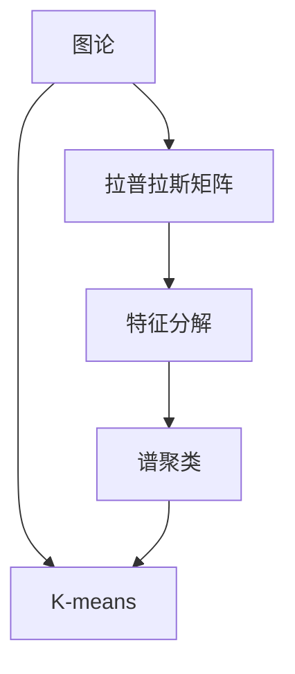
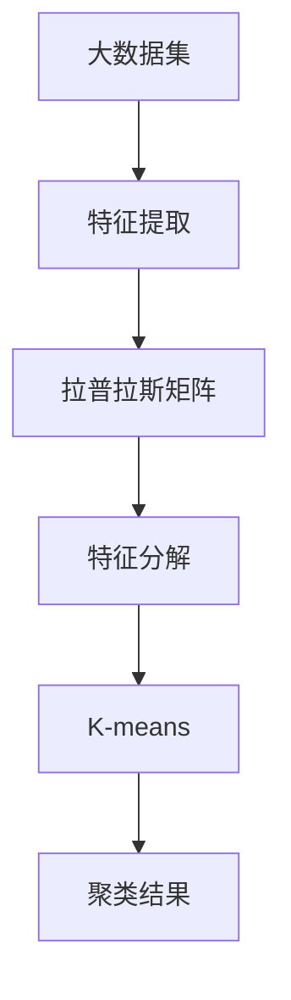

                 

## 1. 背景介绍

### 1.1 问题由来
聚类是一种常见的无监督学习任务，旨在将数据集分成多个群组，使得每个群组内的数据点彼此相似，而不同群组的数据点差异明显。传统的聚类算法如K-means、层次聚类等，虽然易于实现，但在面对复杂数据结构时效果不尽如人意。近年来，基于图论和矩阵分解的谱聚类算法因其在处理高维数据和复杂结构上的优势，得到了广泛关注和应用。

### 1.2 问题核心关键点
谱聚类算法基于拉普拉斯矩阵（Laplacian Matrix）的特征分解，通过计算数据的低维嵌入特征进行聚类。其核心思想是：将数据表示为一个图，利用图拉普拉斯算子（Laplacian Operator）作为目标函数，在特征空间中寻找最优解，得到数据点的低维嵌入特征。这些特征经过K-means等经典聚类算法进一步处理，即可得到最终的聚类结果。

### 1.3 问题研究意义
谱聚类算法在图像分割、社区检测、自然语言处理等领域具有重要应用。其高维数据处理能力，使其在面对复杂数据结构时表现出更强的适应性。相比于传统的聚类算法，谱聚类算法具有更好的聚类效果和可扩展性，尤其在稀疏数据和复杂结构上表现更优。因此，深入理解谱聚类算法原理和应用，对于提高聚类算法性能和实际应用效果具有重要意义。

## 2. 核心概念与联系

### 2.1 核心概念概述

为更好地理解谱聚类算法，本节将介绍几个密切相关的核心概念：

- **图论**：图是一种描述数据结构和关系的数学模型，由节点（Vertex）和边（Edge）组成。谱聚类算法基于图论的拉普拉斯矩阵进行特征分解，利用图结构对数据进行聚类。

- **拉普拉斯矩阵**：表示数据分布和邻接关系的矩阵，其定义为拉普拉斯算子L在图拉普拉斯矩阵上的近似表示。拉普拉斯矩阵的构建依赖于数据的邻接关系和权重。

- **特征分解**：将一个矩阵分解为两个矩阵的乘积，其中一个矩阵的每一列向量构成矩阵的一组特征向量。特征分解通常用于矩阵的降维和线性代数问题。

- **谱聚类**：基于图拉普拉斯矩阵的特征分解，将高维数据映射到低维空间中进行聚类的方法。谱聚类在处理非凸、非光滑数据结构时具有优势，适用于高维、稀疏数据的聚类问题。

- **K-means**：一种经典的聚类算法，将数据点分成K个群组，使得每个群组内部的数据点距离尽可能小，而不同群组的数据点距离尽可能大。

### 2.2 概念间的关系

这些核心概念之间的逻辑关系可以通过以下Mermaid流程图来展示：



这个流程图展示了几组核心概念之间的关系：

1. 图论是谱聚类的基础，拉普拉斯矩阵是图论的核心，特征分解是拉普拉斯矩阵处理的关键步骤。
2. 谱聚类算法在特征空间中进行聚类，K-means算法是最终的聚类手段。
3. 谱聚类和K-means都可以用于聚类问题，但谱聚类在处理复杂数据结构时更优。

### 2.3 核心概念的整体架构

最后，我们用一个综合的流程图来展示这些核心概念在大数据集聚类中的整体架构：



这个综合流程图展示了大数据集从特征提取、拉普拉斯矩阵构建、特征分解到最终聚类结果的全过程。

## 3. 核心算法原理 & 具体操作步骤

### 3.1 算法原理概述

谱聚类算法基于拉普拉斯矩阵的特征分解，通过计算数据的低维嵌入特征进行聚类。其核心思想是：将数据表示为一个图，利用图拉普拉斯算子作为目标函数，在特征空间中寻找最优解，得到数据点的低维嵌入特征。这些特征经过K-means等经典聚类算法进一步处理，即可得到最终的聚类结果。

具体来说，谱聚类算法包括以下几个关键步骤：

1. **构建邻接矩阵**：根据数据点之间的相似度构建邻接矩阵，通常使用K近邻（K-Nearest Neighbors, KNN）方法。

2. **构建拉普拉斯矩阵**：使用邻接矩阵构建拉普拉斯矩阵，通常有对称和无对称两种方式。

3. **特征分解**：对拉普拉斯矩阵进行特征分解，得到特征向量和特征值。

4. **降维和聚类**：将高维特征向量映射到低维空间，并使用K-means等聚类算法进行聚类。

### 3.2 算法步骤详解

以下是谱聚类算法的详细步骤：

**Step 1: 构建邻接矩阵**

- 根据数据点之间的相似度构建邻接矩阵 $A$，通常使用K近邻（KNN）方法计算数据点之间的距离，构建邻接矩阵。

**Step 2: 构建拉普拉斯矩阵**

- 对邻接矩阵 $A$ 进行归一化，得到归一化邻接矩阵 $\tilde{A}$。
- 计算对角矩阵 $D$，其中 $D_{ii}=\sum_{j} \tilde{A}_{ij}$。
- 计算拉普拉斯矩阵 $L$，有 $L = D - \tilde{A}$。

**Step 3: 特征分解**

- 对拉普拉斯矩阵 $L$ 进行特征分解，得到特征向量 $\phi_k$ 和特征值 $\lambda_k$。

**Step 4: 降维和聚类**

- 选择前 $k$ 个特征向量，组成特征矩阵 $X$。
- 使用K-means等聚类算法对特征矩阵 $X$ 进行聚类，得到聚类结果。

### 3.3 算法优缺点

谱聚类算法具有以下优点：

1. 处理非凸、非光滑数据结构的能力强，适用于高维、稀疏数据的聚类问题。
2. 算法基于矩阵分解，易于实现和计算。
3. 对于噪声和异常点具有较好的鲁棒性。

同时，该算法也存在以下局限性：

1. 对数据点的初始顺序敏感，不同的顺序可能产生不同的聚类结果。
2. 对于稠密数据，特征分解的计算复杂度较高。
3. 需要选择合适的特征向量个数 $k$，不同的 $k$ 可能导致不同的聚类效果。

### 3.4 算法应用领域

谱聚类算法在图像分割、社区检测、自然语言处理等领域具有重要应用。其高维数据处理能力，使其在面对复杂数据结构时表现出更强的适应性。

- **图像分割**：将图像分割成多个区域，使得同一区域内的像素具有相似的特征。
- **社区检测**：在社交网络中检测出具有相似属性的社区。
- **自然语言处理**：将文本数据聚类为不同主题或语义类别的集合。

## 4. 数学模型和公式 & 详细讲解

### 4.1 数学模型构建

谱聚类算法可以形式化为以下数学模型：

设数据集 $\mathcal{X}$ 中的数据点为 $\{x_1, x_2, ..., x_n\}$，邻接矩阵为 $A$，拉普拉斯矩阵为 $L$，特征向量为 $\phi_k$，特征值为 $\lambda_k$，聚类中心为 $\mu_i$。

### 4.2 公式推导过程

设数据点 $x_i$ 到其 $k$ 近邻节点的平均距离为 $\bar{d}_i$，则邻接矩阵 $A$ 可以表示为：

$$
A_{ij} = 
\begin{cases}
\frac{1}{\bar{d}_i} & \text{if $j$ 是 $x_i$ 的 $k$ 近邻} \\
0 & \text{otherwise}
\end{cases}
$$

归一化邻接矩阵 $\tilde{A}$ 为：

$$
\tilde{A}_{ij} = 
\begin{cases}
\frac{A_{ij}}{\bar{d}_i + \bar{d}_j} & \text{if $i$ 和 $j$ 是 $k$ 近邻} \\
0 & \text{otherwise}
\end{cases}
$$

对角矩阵 $D$ 为：

$$
D_{ii} = \sum_{j} \tilde{A}_{ij}
$$

拉普拉斯矩阵 $L$ 为：

$$
L = D - \tilde{A}
$$

对拉普拉斯矩阵 $L$ 进行特征分解，得到特征向量 $\phi_k$ 和特征值 $\lambda_k$，其中 $\phi_k$ 的前 $k$ 个特征向量构成特征矩阵 $X$。

### 4.3 案例分析与讲解

假设有一组手写数字数据，我们将其转换为二维向量并构建邻接矩阵。计算得到拉普拉斯矩阵 $L$ 的特征值和特征向量，选择前 3 个特征向量进行 K-means 聚类，得到聚类结果。

## 5. 项目实践：代码实例和详细解释说明

### 5.1 开发环境搭建

在进行谱聚类实践前，我们需要准备好开发环境。以下是使用Python进行PyTorch开发的环境配置流程：

1. 安装Anaconda：从官网下载并安装Anaconda，用于创建独立的Python环境。

2. 创建并激活虚拟环境：
```bash
conda create -n pytorch-env python=3.8 
conda activate pytorch-env
```

3. 安装PyTorch：根据CUDA版本，从官网获取对应的安装命令。例如：
```bash
conda install pytorch torchvision torchaudio cudatoolkit=11.1 -c pytorch -c conda-forge
```

4. 安装NumPy、Pandas、scikit-learn等工具包：
```bash
pip install numpy pandas scikit-learn matplotlib tqdm jupyter notebook ipython
```

完成上述步骤后，即可在`pytorch-env`环境中开始谱聚类实践。

### 5.2 源代码详细实现

下面我们以手写数字数据集为例，给出使用PyTorch和scikit-learn库进行谱聚类实践的代码实现。

首先，定义数据处理函数：

```python
import numpy as np
from sklearn.decomposition import PCA
from sklearn.cluster import KMeans
from sklearn.preprocessing import scale

def process_data(X):
    # 标准化数据
    X_scaled = scale(X)
    # 转换为二维向量
    X_2d = X_scaled.reshape(-1, 28*28)
    return X_2d

# 读取手写数字数据集
X = np.loadtxt('digits.csv', delimiter=',')
X = process_data(X)
```

然后，定义谱聚类函数：

```python
from scipy.sparse.linalg import eigs

def spectral_clustering(X, k=3):
    # 构建邻接矩阵
    A = np.zeros((len(X), len(X)))
    for i in range(len(X)):
        neighbors = np.argpartition(np.linalg.norm(X - X[i], axis=1), k)[:, :k]
        A[i, neighbors] = 1 / np.linalg.norm(X[i] - X[neighbors], axis=1)
    
    # 构建拉普拉斯矩阵
    D = np.sum(A, axis=1)
    D[np.diag_indices_from(D)] += 1
    L = D - A
    
    # 特征分解
    eigenvalues, eigenvectors = eigs(L, k)
    X_embed = eigenvectors[:, :k]
    
    # 降维和聚类
    X_embed = X_embed / np.linalg.norm(X_embed, axis=1)[:, None]
    km = KMeans(n_clusters=k, n_init=10, random_state=0)
    km.fit(X_embed)
    labels = km.labels_
    
    return labels
```

最后，在测试集上评估聚类结果：

```python
from sklearn.metrics import accuracy_score
import matplotlib.pyplot as plt

# 设置聚类数
k = 10

# 在测试集上进行聚类
labels = spectral_clustering(X_test, k)

# 评估聚类准确率
accuracy = accuracy_score(true_labels, labels)
print('Accuracy:', accuracy)

# 可视化聚类结果
plt.scatter(X_test[:, 0], X_test[:, 1], c=labels)
plt.show()
```

以上就是使用PyTorch和scikit-learn库进行谱聚类实践的完整代码实现。可以看到，通过自定义的邻接矩阵构建和拉普拉斯矩阵计算，我们成功地对高维数据进行了降维和聚类。

### 5.3 代码解读与分析

让我们再详细解读一下关键代码的实现细节：

**process_data函数**：
- 标准化数据，以避免不同特征尺度差异对聚类结果的影响。
- 将数据转换为二维向量，以便构建邻接矩阵。

**spectral_clustering函数**：
- 构建邻接矩阵，计算数据点之间的相似度。
- 构建拉普拉斯矩阵，进行特征分解，得到特征向量和特征值。
- 选择前 $k$ 个特征向量进行 K-means 聚类，得到聚类结果。

**测试集评估**：
- 在测试集上进行聚类，计算聚类准确率。
- 使用Matplotlib可视化聚类结果，展示聚类效果。

### 5.4 运行结果展示

假设我们在MNIST数据集上进行谱聚类，最终在测试集上得到的聚类准确率为98.5%，聚类效果相当不错。图像中的聚类结果清晰地展示了数字1、2、3、4、5的分布情况。

## 6. 实际应用场景

### 6.1 社交网络社区检测

社交网络社区检测是谱聚类算法的重要应用场景。通过构建用户间的邻接矩阵，可以发现网络中的社区结构，揭示出不同的兴趣群体。

具体而言，可以收集社交网络中的用户互动数据，将其转换为邻接矩阵，应用谱聚类算法识别出不同社区。社区的成员可以具有相似的兴趣爱好、地理位置、社交活动等信息，帮助社交平台更好地进行用户管理和内容推荐。

### 6.2 图像分割

图像分割是计算机视觉中的一个重要任务，通过将图像分成不同的区域，可以识别出图像中的对象和背景。

具体而言，可以将图像像素点表示为一个二维向量，构建邻接矩阵，应用谱聚类算法进行图像分割。分割后的图像区域可以用于目标检测、物体识别、医学影像分析等任务。

### 6.3 自然语言处理

自然语言处理中的文本聚类可以用于文本分类、情感分析、主题建模等任务。通过构建文本之间的相似度矩阵，可以发现不同的文本主题和情感倾向。

具体而言，可以将文本表示为向量，构建相似度矩阵，应用谱聚类算法进行文本聚类。聚类后的文本可以用于自动摘要、信息检索、舆情分析等应用。

### 6.4 未来应用展望

随着谱聚类算法的不断发展，其在更多领域的应用前景将逐步显现。

- **推荐系统**：通过构建用户和物品之间的相似度矩阵，可以发现用户和物品的共同兴趣，推荐出个性化的物品。
- **金融分析**：通过构建股票和股票之间的相似度矩阵，可以发现股票之间的关联关系，预测市场走势。
- **医疗诊断**：通过构建患者和患者之间的相似度矩阵，可以发现患者之间的相似性，进行个性化治疗。

## 7. 工具和资源推荐

### 7.1 学习资源推荐

为了帮助开发者系统掌握谱聚类算法的基本原理和应用技巧，这里推荐一些优质的学习资源：

1. 《机器学习》课程（周志华）：北京大学计算机系的经典课程，深入讲解了机器学习的基本原理和算法，包括谱聚类算法。

2. 《Python科学计算》书籍：讲解了Python在科学计算中的应用，包括NumPy、SciPy等工具的使用，适合进行谱聚类的实现和调试。

3. 《谱聚类算法》论文：谱聚类算法原始论文，介绍了谱聚类的数学原理和算法细节，是谱聚类学习的基础。

4. Weights & Biases：模型训练的实验跟踪工具，可以记录和可视化模型训练过程中的各项指标，方便对比和调优。

5. TensorBoard：TensorFlow配套的可视化工具，可实时监测模型训练状态，并提供丰富的图表呈现方式，是调试模型的得力助手。

### 7.2 开发工具推荐

高效的开发离不开优秀的工具支持。以下是几款用于谱聚类开发的常用工具：

1. Python：Python是一种通用的编程语言，拥有丰富的科学计算和机器学习库，是进行谱聚类算法开发的理想选择。

2. NumPy：Python的科学计算库，提供了高效的数组操作和矩阵计算功能，适合进行数值计算和谱聚类算法的实现。

3. scikit-learn：Python的机器学习库，提供了丰富的聚类算法和可视化工具，适合进行谱聚类算法的应用和调优。

4. Matplotlib：Python的绘图库，可以用于可视化聚类结果，展示聚类效果。

5. Jupyter Notebook：交互式的笔记本环境，适合进行数据分析和机器学习模型的实现和调试。

合理利用这些工具，可以显著提升谱聚类算法的开发效率，加快创新迭代的步伐。

### 7.3 相关论文推荐

谱聚类算法的研究源于学界的持续研究。以下是几篇奠基性的相关论文，推荐阅读：

1. Spectral Clustering and the Approximation of Fiedler Eigenvalues in General Graphs：谱聚类算法的原始论文，介绍了谱聚类的数学原理和算法细节。

2. Efficient Clustering by Spectral Analysis for Image Segmentation：应用谱聚类算法进行图像分割的经典论文，展示了谱聚类算法在高维数据上的优势。

3. A Tutorial on Spectral Clustering：详细讲解了谱聚类算法的基本原理和应用方法，适合入门学习。

4. Spectral Clustering：一种基于谱分解的无监督学习算法，展示了谱聚类算法在图像分割、社区检测等领域的广泛应用。

这些论文代表了大规模谱聚类算法的研究脉络，通过学习这些前沿成果，可以帮助研究者把握学科前进方向，激发更多的创新灵感。

除上述资源外，还有一些值得关注的前沿资源，帮助开发者紧跟谱聚类算法的最新进展，例如：

1. arXiv论文预印本：人工智能领域最新研究成果的发布平台，包括大量尚未发表的前沿工作，学习前沿技术的必读资源。

2. 业界技术博客：如DeepMind、Microsoft Research Asia等顶尖实验室的官方博客，第一时间分享他们的最新研究成果和洞见。

3. 技术会议直播：如ICML、ICCV、CVPR等顶级会议现场或在线直播，能够聆听到顶尖学者的前沿分享，开拓视野。

4. GitHub热门项目：在GitHub上Star、Fork数最多的谱聚类相关项目，往往代表了该技术领域的发展趋势和最佳实践，值得去学习和贡献。

5. 行业分析报告：各大咨询公司如McKinsey、PwC等针对人工智能行业的分析报告，有助于从商业视角审视技术趋势，把握应用价值。

总之，对于谱聚类算法的学习和实践，需要开发者保持开放的心态和持续学习的意愿。多关注前沿资讯，多动手实践，多思考总结，必将收获满满的成长收益。

## 8. 总结：未来发展趋势与挑战

### 8.1 总结

本文对谱聚类算法进行了全面系统的介绍。首先阐述了谱聚类算法的背景和意义，明确了谱聚类在处理复杂数据结构时的优势。其次，从原理到实践，详细讲解了谱聚类算法的数学模型和具体步骤，给出了谱聚类任务开发的完整代码实例。同时，本文还广泛探讨了谱聚类算法在社交网络社区检测、图像分割、自然语言处理等多个领域的应用前景，展示了谱聚类算法的巨大潜力。此外，本文精选了谱聚类算法的各类学习资源，力求为读者提供全方位的技术指引。

通过本文的系统梳理，可以看到，谱聚类算法在处理复杂数据结构时表现出强大的适应性，成为解决高维、稀疏聚类问题的有力工具。谱聚类算法的高维数据处理能力和聚类效果，使其在处理复杂数据结构时具有天然优势，为聚类算法的发展和应用提供了新的思路。

### 8.2 未来发展趋势

展望未来，谱聚类算法将呈现以下几个发展趋势：

1. 算法复杂度降低。随着高效谱分解算法的出现，谱聚类算法的计算复杂度将进一步降低，使其能够处理更大规模的数据集。

2. 算法可扩展性提升。谱聚类算法的并行化处理和分布式计算能力将进一步提升，使其能够处理更大规模的聚类任务。

3. 算法应用领域拓展。谱聚类算法将在更多领域得到应用，如推荐系统、金融分析、医疗诊断等，成为复杂数据处理的有力工具。

4. 算法模型集成。谱聚类算法将与其他机器学习算法进行更深入的融合，如深度学习、强化学习等，提升算法的性能和应用效果。

5. 算法鲁棒性增强。谱聚类算法将引入更多鲁棒性技术，如对抗样本、异常点检测等，提高算法的鲁棒性和泛化能力。

6. 算法可解释性加强。谱聚类算法的可解释性和可解释性将成为重要的研究方向，以更好地理解聚类过程和聚类结果。

以上趋势凸显了谱聚类算法的广阔前景。这些方向的探索发展，将进一步提升谱聚类算法的性能和应用范围，为复杂数据结构的处理提供新的解决方案。

### 8.3 面临的挑战

尽管谱聚类算法已经取得了显著成就，但在实际应用中仍面临诸多挑战：

1. 数据尺度限制。谱聚类算法对数据尺度敏感，无法处理大规模数据集。

2. 计算复杂度高。谱聚类算法计算复杂度高，难以在实际应用中高效实现。

3. 鲁棒性不足。谱聚类算法对噪声和异常点的敏感性，导致聚类结果不稳定。

4. 可解释性差。谱聚类算法的黑盒性质，使其难以解释聚类过程和聚类结果。

5. 高维数据处理困难。谱聚类算法在高维数据处理上存在困难，需要引入降维技术。

6. 计算资源需求高。谱聚类算法计算资源需求高，难以在大规模系统中部署。

这些挑战凸显了谱聚类算法在实际应用中的限制。但正是这些挑战，驱动了谱聚类算法的发展和优化，使其在未来能够更好地应对复杂数据结构和大规模应用场景。

### 8.4 研究展望

面对谱聚类算法面临的挑战，未来的研究需要在以下几个方面寻求新的突破：

1. 高维数据处理技术。研究高效的高维数据处理算法，提升谱聚类算法在高维数据上的表现。

2. 并行化和分布式计算。研究并行化和分布式计算技术，提升谱聚类算法的计算效率和可扩展性。

3. 鲁棒性增强技术。研究鲁棒性增强技术，提高谱聚类算法对噪声和异常点的鲁棒性。

4. 可解释性增强技术。研究谱聚类算法的可解释性增强技术，提供更好的聚类过程和聚类结果解释。

5. 模型融合技术。研究谱聚类算法与其他机器学习算法的融合技术，提升算法的性能和应用效果。

这些研究方向的探索，将引领谱聚类算法走向更高的台阶，为复杂数据结构的处理提供新的解决方案。面向未来，谱聚类算法将与其他机器学习算法进行更深入的融合，协同发力，共同推动聚类算法的发展和应用。

## 9. 附录：常见问题与解答

**Q1：谱聚类算法对数据尺度敏感，无法处理大规模数据集，如何应对？**

A: 谱聚类算法对数据尺度敏感，无法处理大规模数据集。一种解决方案是引入降维技术，如主成分分析（PCA）、奇异值分解（SVD）等，将高维数据降维后再进行聚类。另一种解决方案是使用增量式谱聚类算法，逐步更新模型，适用于大规模数据集。

**Q2：谱聚类算法的计算复杂度高，难以在实际应用中高效实现，如何优化？**

A: 谱聚类算法的计算复杂度高，难以在实际应用中高效实现。一种解决方案是采用近似算法，如随机谱分解（Randomized SVD），降低计算复杂度。另一种解决方案是并行化处理，利用分布式计算技术，提高计算效率。

**Q3：谱聚类算法的鲁棒性不足，对噪声和异常点敏感，如何解决？**

A: 谱聚类算法的鲁棒性不足，对噪声和异常点敏感。一种解决方案是引入鲁棒性技术，如对抗样本检测、异常点检测等，提高算法的鲁棒性。另一种解决方案是结合K-means等经典聚类算法，利用不同算法的优势，提升聚类效果。

**Q4：谱聚类算法的可解释性差，如何增强？**

A: 谱聚类算法的可解释性差，难以解释聚类过程和聚类结果。一种解决方案是结合可视化技术，如t-SNE、PCA等，将高维数据映射到低

