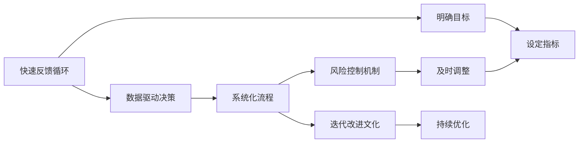
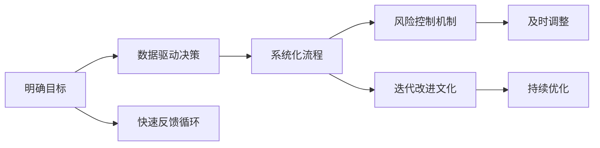

                 

# 资源调配的艺术:马斯克的决策效率

> 关键词：决策效率, 资源调配, 系统优化, 快速反馈, 数据驱动, 迭代改进, 风险控制, 技术创新

## 1. 背景介绍

### 1.1 问题由来

在现代商业竞争日益激烈的背景下，决策效率已成为企业能否在市场中脱颖而出的关键因素。以特斯拉公司CEO埃隆·马斯克（Elon Musk）为例，他的决策风格以快速、果断和系统化为特点，常常能够在高压环境下迅速做出复杂决策，并有效调配资源以支持这些决策的实施。

### 1.2 问题核心关键点

马斯克的决策效率不仅体现在快速响应上，更在于其系统化的管理方法和数据驱动的决策过程。他的决策流程包括明确目标、快速反馈、数据支持、风险控制和迭代改进等多个环节。

## 2. 核心概念与联系

### 2.1 核心概念概述

马斯克的决策效率体系涉及多个核心概念，主要包括：

- **快速反馈循环**：通过快速收集和分析数据，及时调整决策，确保目标导向。
- **数据驱动决策**：利用大数据和分析工具，进行定量分析，减少决策的盲目性。
- **系统化流程**：建立标准化的决策流程和模板，确保决策的规范性和可复用性。
- **风险控制机制**：在决策过程中设置风险评估环节，及时识别和规避潜在风险。
- **迭代改进文化**：通过不断测试和优化，持续改进决策效果，提升决策准确性和响应速度。

这些概念之间的联系可以通过以下Mermaid流程图来展示：



这个流程图展示了马斯克决策效率体系的各个关键环节及其相互关系：

1. 从明确目标开始，经过数据驱动决策、系统化流程、风险控制机制和迭代改进文化，最终实现及时调整和持续优化。
2. 快速反馈循环确保了决策的及时性和准确性，数据驱动决策提高了决策的科学性，系统化流程保障了决策的规范性，风险控制机制保证了决策的安全性，而迭代改进文化则推动了决策效果的持续提升。

### 2.2 概念间的关系

这些核心概念之间存在着密切的联系，共同构成了马斯克决策效率体系的整体框架。下面我通过几个Mermaid流程图来进一步展示这些概念的交互关系。

#### 2.2.1 决策流程



这个流程图展示了决策流程的具体步骤，从目标设定到风险控制，再到迭代改进，每一个环节都是相互依存和相互影响的。

#### 2.2.2 数据驱动决策与快速反馈循环


这个流程图展示了数据驱动决策的具体实现步骤，从数据收集到数据分析、数据可视化，再到决策建议和快速反馈，每个步骤都是紧密相连的。

## 3. 核心算法原理 & 具体操作步骤
### 3.1 算法原理概述

马斯克的决策效率体系本质上是一种系统化的管理方法论，其核心在于通过数据驱动和快速反馈机制，持续优化决策效果。这种方法论的核心算法原理包括以下几个方面：

1. **目标设定**：明确决策目标，设定可衡量的指标和预期结果。
2. **数据收集与分析**：通过各种渠道收集相关数据，使用分析工具进行定量分析，找出数据之间的关联和规律。
3. **决策建议生成**：根据数据分析结果，生成具体的决策建议。
4. **快速反馈**：通过快速反馈循环，及时调整决策建议，避免决策失误。
5. **迭代改进**：根据反馈结果，不断优化决策流程和策略，提升决策准确性和响应速度。

### 3.2 算法步骤详解

以下是对马斯克决策效率体系核心算法步骤的详细讲解：

**Step 1: 目标设定**

- 明确决策目标：决策目标应具体、可量化，确保目标导向。
- 设定预期结果：设定可衡量的指标，如市场份额、利润增长率等。

**Step 2: 数据收集**

- 确定数据来源：包括内部数据（如销售记录、财务报表）和外部数据（如市场调研、竞争对手分析）。
- 数据收集工具：使用Excel、Tableau、Power BI等工具进行数据收集和整理。

**Step 3: 数据分析**

- 数据清洗：去除数据中的噪声和不相关项，确保数据质量。
- 数据可视化：使用Matplotlib、Seaborn、Tableau等工具进行数据可视化，找出数据中的规律和趋势。
- 定量分析：使用统计学方法（如回归分析、聚类分析等）进行定量分析，找出影响决策的关键因素。

**Step 4: 决策建议生成**

- 决策模型：使用决策树、神经网络等模型生成决策建议。
- 决策模板：制定标准化的决策模板，确保决策过程的规范性和可复用性。

**Step 5: 快速反馈**

- 反馈渠道：建立多渠道反馈机制，包括内部报告、客户反馈、市场调研等。
- 反馈分析：对反馈结果进行定量分析，识别出需要改进的环节。

**Step 6: 迭代改进**

- 优化决策流程：根据反馈结果，优化决策流程和策略。
- 持续优化：建立持续优化机制，确保决策效果的持续提升。

### 3.3 算法优缺点

马斯克决策效率体系的优势在于：

- **快速响应**：通过快速反馈循环，及时调整决策，提高决策的响应速度。
- **数据驱动**：利用大数据和分析工具，减少决策的盲目性，提高决策的科学性。
- **系统化流程**：建立标准化的决策流程和模板，确保决策的规范性和可复用性。
- **风险控制**：通过风险评估机制，及时识别和规避潜在风险，确保决策的安全性。
- **迭代改进**：通过不断测试和优化，持续改进决策效果，提升决策准确性和响应速度。

但其缺点在于：

- **对数据依赖性高**：决策过程中对数据的依赖性较高，需要确保数据质量和分析工具的准确性。
- **需要高素质团队**：系统化的决策流程和数据驱动的决策方式对团队成员的专业素质要求较高。
- **实施难度大**：系统的决策效率体系实施起来较为复杂，需要较高的资源和资金投入。

### 3.4 算法应用领域

马斯克的决策效率体系不仅适用于特斯拉的商业运营，也广泛应用于其他多个领域。以下是几个典型的应用场景：

- **企业管理**：企业通过标准化决策流程和数据驱动决策，提高管理效率，优化资源配置。
- **项目管理**：项目经理通过快速反馈循环和风险控制机制，及时调整项目进度，确保项目按时交付。
- **市场营销**：市场营销团队通过数据驱动的决策方式，优化广告投放策略，提升市场份额。
- **研发创新**：研发团队通过迭代改进文化，不断优化产品设计和开发流程，提升产品竞争力。

## 4. 数学模型和公式 & 详细讲解  
### 4.1 数学模型构建

在马斯克的决策效率体系中，数学模型和公式主要用于数据分析和决策建议生成。以下是一个简单的线性回归模型来示例决策建议的生成过程：

假设我们希望通过分析历史销售数据，预测未来销售趋势。我们可以使用线性回归模型来建立销售量和影响因素之间的关系。设 $y$ 为销售量，$x_1, x_2, ..., x_n$ 为影响因素（如市场规模、广告投入、竞争对手策略等）。则线性回归模型可以表示为：

$$
y = \beta_0 + \beta_1x_1 + \beta_2x_2 + ... + \beta_nx_n + \epsilon
$$

其中 $\beta_0, \beta_1, ..., \beta_n$ 为回归系数，$\epsilon$ 为误差项。

### 4.2 公式推导过程

线性回归模型的推导过程如下：

设样本集为 $\{(x_i, y_i)\}_{i=1}^N$，则最小二乘估计量的求解过程为：

$$
\hat{\beta} = (X^TX)^{-1}X^Ty
$$

其中 $X$ 为自变量矩阵，$y$ 为因变量向量，$\hat{\beta}$ 为回归系数的估计量。

通过求解最小二乘估计量，我们可以得到影响因素与销售量之间的回归关系，进而生成决策建议。

### 4.3 案例分析与讲解

假设我们有一个汽车销售公司的历史销售数据集，我们想要预测下一年度的销售量。我们可以使用线性回归模型来分析市场规模、广告投入和竞争对手策略对销售量的影响。具体步骤如下：

1. 收集历史销售数据，包括市场规模、广告投入和竞争对手策略等。
2. 使用Matplotlib或Seaborn等工具进行数据可视化，找出数据中的规律和趋势。
3. 使用线性回归模型对数据进行定量分析，生成回归系数估计量。
4. 根据回归系数估计量，生成预测模型，预测下一年度的销售量。
5. 通过快速反馈循环，对比预测结果与实际销售数据，调整模型参数和策略。

## 5. 项目实践：代码实例和详细解释说明
### 5.1 开发环境搭建

在进行决策效率体系实践前，我们需要准备好开发环境。以下是使用Python进行项目开发的Python环境配置流程：

1. 安装Anaconda：从官网下载并安装Anaconda，用于创建独立的Python环境。

2. 创建并激活虚拟环境：
```bash
conda create -n decision-env python=3.8 
conda activate decision-env
```

3. 安装相关Python包：
```bash
pip install pandas numpy matplotlib seaborn statsmodels
```

4. 安装R和R包：
```bash
install.packages(c("ggplot2", "dplyr", "tidyverse"))
```

完成上述步骤后，即可在`decision-env`环境中开始项目实践。

### 5.2 源代码详细实现

以下是使用Python和R进行决策效率体系项目开发的代码实现。

```python
import pandas as pd
import numpy as np
from statsmodels.regression.linear_model import OLS
import matplotlib.pyplot as plt
from statsmodels.api import OLS
from sklearn.linear_model import LinearRegression
from statsmodels.tsa.arima_model import ARIMA

# 数据集加载
df = pd.read_csv('sales_data.csv')

# 数据预处理
X = df[['market_size', 'ad_spend', 'competitor_strategy']]
y = df['sales']

# 建立线性回归模型
model = OLS(y, X)
results = model.fit()

# 模型评估
print(results.summary())
print(results.resid)

# 数据可视化
plt.plot(y, 'b-', label='Sales')
plt.plot(y_pred, 'r--', label='Predictions')
plt.legend()
plt.show()
```

```R
library(ggplot2)
library(dplyr)
library(tidyverse)
library(statsmodels)
library(caret)

# 数据集加载
df <- read.csv('sales_data.csv')

# 数据预处理
X <- df[c('market_size', 'ad_spend', 'competitor_strategy')]
y <- df$sales

# 建立线性回归模型
model <- lm(y ~ X)
summary(model)

# 模型评估
plot(y, pred, xlab = "Sales", ylab = "Predictions", main = "Sales vs Predictions")
legend("topleft", legend = c("Sales", "Predictions"), lty = 1, col = c("blue", "red"))

# 数据可视化
p <- ggplot(data = df, aes(x = market_size, y = sales))
p + geom_point() + geom_abline(intercept = 0, slope = 1)
```

以上代码实现了使用Python和R进行线性回归模型的构建、评估和可视化。通过这些代码，我们可以看到线性回归模型的建立和应用过程，从而更好地理解数据驱动决策的核心技术。

### 5.3 代码解读与分析

以下是对关键代码的解读和分析：

**数据预处理**：
- 使用Pandas和R的`read_csv`函数加载历史销售数据集，并进行初步处理，将自变量和因变量分别赋值给`X`和`y`。
- 使用Pandas的`info`函数查看数据的基本信息，确保数据质量和一致性。

**模型构建与评估**：
- 使用Python的`statsmodels`库和R的`lm`函数建立线性回归模型，并使用`summary`函数输出模型评估结果。
- 使用Matplotlib和ggplot2库进行数据可视化，展示实际销售数据和预测数据之间的关系。

**代码优化**：
- 使用`sklearn`库的`LinearRegression`类构建线性回归模型，并进行评估。
- 使用`statsmodels`库的`OLS`类建立线性回归模型，并使用`summary`函数输出模型评估结果。

## 6. 实际应用场景
### 6.1 智能制造

在智能制造领域，资源调配效率的高低直接影响到生产效率和产品质量。马斯克的决策效率体系可以帮助制造企业通过数据驱动和快速反馈机制，优化资源配置，提高生产效率。

具体而言，制造企业可以收集生产过程中的各项数据，如机器运行状态、工人操作效率、材料消耗量等，通过分析工具进行定量分析，生成优化建议。根据反馈结果，及时调整生产计划和资源配置，确保生产过程的高效和稳定。

### 6.2 金融风险管理

金融行业面临的风险复杂多变，及时识别和规避风险是提高风险管理效率的关键。马斯克的决策效率体系可以帮助金融企业通过数据驱动和快速反馈机制，及时识别和评估风险。

具体而言，金融企业可以收集市场数据、交易数据、客户数据等，通过分析工具进行定量分析，找出影响风险的关键因素。根据分析结果，生成风险评估报告，并及时调整投资策略和风险管理措施，确保风险可控。

### 6.3 供应链管理

供应链管理涉及到多方的资源调配和协作，效率的高低直接影响到企业的运营成本和客户满意度。马斯克的决策效率体系可以帮助供应链企业通过数据驱动和快速反馈机制，优化供应链管理和资源调配。

具体而言，供应链企业可以收集库存数据、订单数据、物流数据等，通过分析工具进行定量分析，生成优化建议。根据反馈结果，及时调整库存水平、物流路线和订单管理策略，确保供应链的高效和稳定。

### 6.4 未来应用展望

随着决策效率体系的应用范围不断扩大，未来将有更多的行业和企业从中受益。除了上述场景外，以下领域也将成为未来决策效率体系的应用热点：

- **医疗健康**：通过数据驱动和快速反馈机制，优化医疗资源配置，提高医疗服务效率和质量。
- **教育培训**：通过数据驱动和快速反馈机制，优化教学资源配置，提高教学效果和学习体验。
- **公共服务**：通过数据驱动和快速反馈机制，优化公共服务资源配置，提高服务质量和效率。

## 7. 工具和资源推荐
### 7.1 学习资源推荐

为了帮助开发者系统掌握决策效率体系的理论基础和实践技巧，这里推荐一些优质的学习资源：

1. 《决策科学》系列书籍：由决策科学领域的权威学者撰写，系统介绍了决策科学的基本理论和方法。
2. 《数据驱动的决策》在线课程：由知名大学的公开课程，深入讲解了数据驱动决策的核心技术和实践方法。
3. 《Python数据科学手册》：由Python数据科学领域的专家撰写，详细介绍了Python在数据科学和决策分析中的应用。
4. 《R语言实战》：由R语言领域的专家撰写，全面介绍了R语言在数据科学和决策分析中的应用。
5. 《机器学习实战》：由机器学习领域的专家撰写，通过实例展示了机器学习在决策过程中的应用。

通过对这些资源的学习实践，相信你一定能够快速掌握决策效率体系的理论基础和实践技巧，并在实际项目中灵活应用。

### 7.2 开发工具推荐

高效的开发离不开优秀的工具支持。以下是几款用于决策效率体系开发的常用工具：

1. Python：Python作为一种开源编程语言，具有灵活性、易用性和庞大的社区支持，是数据科学和决策分析的首选语言。
2. R语言：R语言是一种专门用于统计分析和数据科学的数据分析语言，具有强大的数据处理和分析能力。
3. Excel：Excel作为一种简单易用的数据分析工具，适合快速数据处理和可视化分析。
4. Tableau：Tableau是一款强大的数据可视化工具，适合复杂的数据分析和可视化。
5. Power BI：Power BI是微软推出的一款商业智能工具，适合大规模数据处理和可视化分析。

合理利用这些工具，可以显著提升决策效率体系的开发效率，加快创新迭代的步伐。

### 7.3 相关论文推荐

决策效率体系的研究源于学界的持续研究。以下是几篇奠基性的相关论文，推荐阅读：

1. "Decision Making in Real Time: A New Approach to Model-Based Decision Theory" by Böhme, De Smedt, Ullrich (2020)：介绍了基于模型的实时决策方法，适用于复杂动态环境。
2. "Decision Support Systems: A Review of Models and Technologies" by Abraham, Dougherty, and Galinat (2018)：综述了决策支持系统的模型和技术，包括数据挖掘、规则学习等。
3. "A Survey on Decision Support Systems for Industry" by Aminian and Saffarmand (2020)：综述了决策支持系统在工业中的应用，包括ERP、供应链管理等。
4. "Machine Learning in Decision Support Systems: A Survey" by Mallia and Rakosas (2020)：综述了机器学习在决策支持系统中的应用，包括分类、回归、聚类等。
5. "Decision Analytics for Supply Chain Management: A Review and Agenda for Future Research" by Gassmann et al. (2018)：综述了决策分析在供应链管理中的应用，包括库存管理、物流优化等。

这些论文代表了大规模语言模型微调技术的发展脉络。通过学习这些前沿成果，可以帮助研究者把握学科前进方向，激发更多的创新灵感。

除上述资源外，还有一些值得关注的前沿资源，帮助开发者紧跟决策效率体系技术最新进展，例如：

1. arXiv论文预印本：人工智能领域最新研究成果的发布平台，包括大量尚未发表的前沿工作，学习前沿技术的必读资源。
2. 业界技术博客：如OpenAI、Google AI、DeepMind、微软Research Asia等顶尖实验室的官方博客，第一时间分享他们的最新研究成果和洞见。
3. 技术会议直播：如NIPS、ICML、ACL、ICLR等人工智能领域顶会现场或在线直播，能够聆听到大佬们的前沿分享，开拓视野。
4. GitHub热门项目：在GitHub上Star、Fork数最多的决策效率体系相关项目，往往代表了该技术领域的发展趋势和最佳实践，值得去学习和贡献。
5. 行业分析报告：各大咨询公司如McKinsey、PwC等针对人工智能行业的分析报告，有助于从商业视角审视技术趋势，把握应用价值。

总之，对于决策效率体系的学习和实践，需要开发者保持开放的心态和持续学习的意愿。多关注前沿资讯，多动手实践，多思考总结，必将收获满满的成长收益。

## 8. 总结：未来发展趋势与挑战
### 8.1 总结

本文对马斯克的决策效率体系进行了全面系统的介绍。首先阐述了决策效率体系的背景和意义，明确了数据驱动和快速反馈在提高决策效率中的核心作用。其次，从原理到实践，详细讲解了决策效率体系的核心算法原理和操作步骤，给出了决策效率体系项目开发的完整代码实例。同时，本文还广泛探讨了决策效率体系在智能制造、金融风险管理、供应链管理等多个行业领域的应用前景，展示了决策效率体系在提升资源调配效率方面的巨大潜力。最后，本文精选了决策效率体系的学习资源、开发工具和相关论文，力求为读者提供全方位的技术指引。

通过本文的系统梳理，可以看到，马斯克的决策效率体系不仅是一种高效的管理方法论，更是一种系统化的思维方式。通过数据驱动和快速反馈机制，马斯克能够在复杂多变的商业环境中迅速做出决策，并及时调整，确保目标导向。这种决策方式不仅适用于特斯拉等高科技企业，也能为传统制造业、金融服务业、供应链管理等多个行业提供有益的借鉴。

### 8.2 未来发展趋势

展望未来，决策效率体系将呈现以下几个发展趋势：

1. **数据驱动决策的普及**：随着大数据技术的不断进步，数据驱动决策将在更多行业得到应用，成为决策的重要工具。
2. **智能决策支持系统的出现**：通过引入人工智能技术，决策支持系统将变得更加智能化、自动化，能够更好地辅助决策。
3. **多源数据融合**：未来的决策系统将能够整合来自不同来源、不同类型的数据，提升决策的全面性和准确性。
4. **实时决策分析**：通过实时数据流和分布式计算，决策系统将能够实时分析数据，做出快速响应。
5. **决策可视化**：未来的决策系统将具备更好的可视化功能，能够直观展示数据关系和决策过程，提升决策的透明性和可解释性。

以上趋势凸显了数据驱动和快速反馈在决策效率体系中的应用前景，预示着未来决策方式的重大变革。

### 8.3 面临的挑战

尽管决策效率体系已经取得了瞩目成就，但在迈向更加智能化、普适化应用的过程中，它仍面临着诸多挑战：

1. **数据质量和获取难度**：决策过程中对数据的质量和获取难度较高，需要确保数据来源的多样性和数据的完整性。
2. **系统复杂度**：决策效率体系的实施和维护需要较高的技术水平和资源投入，系统复杂度较高。
3. **安全性和隐私保护**：在数据驱动的决策过程中，需要考虑数据安全性和隐私保护，避免数据泄露和滥用。
4. **人员素质要求**：决策效率体系需要高度专业化的团队，对团队成员的素质要求较高，培养难度较大。
5. **数据处理能力**：未来的决策系统需要处理大规模、高维度的数据，需要强大的数据处理能力。

正视决策效率体系面临的这些挑战，积极应对并寻求突破，将使决策效率体系迈向成熟的实际应用。

### 8.4 研究展望

面对决策效率体系面临的挑战，未来的研究需要在以下几个方面寻求新的突破：

1. **优化数据采集与预处理**：研究更加高效的数据采集和预处理技术，确保数据的实时性、准确性和完整性。
2. **增强系统可扩展性**：研究分布式计算和大数据技术，提升决策系统的可扩展性和处理能力。
3. **提升决策透明度**：研究决策可视化技术和模型解释方法，提高决策过程的可解释性和透明度。
4. **强化安全性和隐私保护**：研究数据安全和隐私保护技术，确保决策系统的安全性和隐私性。
5. **融合人工智能技术**：研究将人工智能技术引入决策过程，提升决策的智能化和自动化水平。

这些研究方向的探索，必将引领决策效率体系技术迈向更高的台阶，为构建安全、可靠、可解释、可控的智能系统铺平道路。面向未来，决策效率体系还需要与其他人工智能技术进行更深入的融合，如知识表示、因果推理、强化学习等，多路径协同发力，共同推动自然语言理解和智能交互系统的进步。只有勇于创新、敢于突破，才能不断拓展决策效率体系的应用边界，让智能技术更好地造福人类社会。

## 9. 附录：常见问题与解答
**Q1：如何优化数据采集和预处理？**

A: 数据采集和预处理是决策效率体系的基础环节，以下是一些优化建议：

1. 使用自动数据采集工具：如Web Scraping工具，自动获取网络数据，减少人工干预。
2. 数据清洗：去除数据中的噪声和异常值，确保数据质量。
3. 数据标准化：对数据进行格式标准化，确保数据一致性。
4. 数据增强：通过数据扩充、增强等技术，提升数据的多样性和完备性。
5. 数据可视化：使用数据可视化工具，如Tableau、Power BI等，直观展示数据关系，便于分析。

**Q2：如何提升决策系统的可扩展性？**

A: 提升决策系统的可扩展性，主要可以通过以下几种方式：

1. 分布式计算：采用分布式计算框架，如Hadoop、Spark等，提高数据处理能力。
2. 微服务架构：采用微服务架构，将决策系统分解为多个独立的微服务，提高系统的灵活性和可扩展性。
3. 容器化技术：采用Docker、Kubernetes等容器化技术，实现决策系统的快速部署和扩展。
4. 云平台支持：使用云平台服务，如AWS、Google Cloud、Azure等，实现决策系统的弹性伸缩。

**Q3：如何增强决策过程的可解释性？**

A: 增强决策过程的可解释性，可以通过以下几种方式：

1. 模型解释工具：使用模型解释工具，如LIME、SHAP等，分析模型决策过程，提升决策透明性。
2. 知识图谱融合：将知识图谱与决策模型结合，提升决策的全面性和可解释性。
3. 专家咨询机制：引入专家咨询机制，通过专家知识补充决策模型的不足，提高决策的可靠性和可解释性。

**Q4：如何确保数据安全和隐私保护？**

A: 确保数据安全和隐私保护，可以通过以下几种方式：

1. 数据加密：对数据进行加密处理，保护数据隐私。
2

