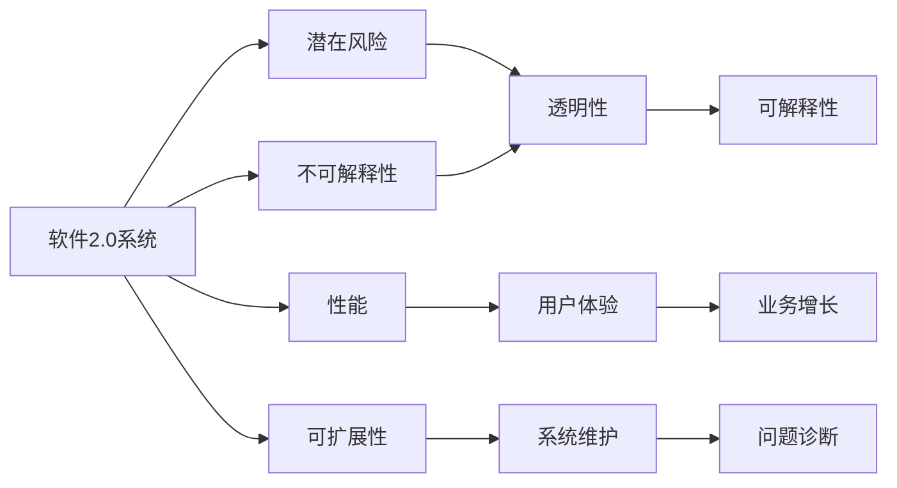

                 

# 软件 2.0 的局限性：不可解释性和潜在风险

软件2.0时代的到来，伴随着机器学习与人工智能技术的迅速发展，为软件系统的自动化、智能化带来了前所未有的机遇。然而，在享受其带来的高效、便捷的同时，软件2.0系统所固有的不可解释性与潜在风险，也引发了广泛关注与深刻思考。本文将从不可解释性的根本原因、潜在风险、改进策略与未来展望等多个维度，全面探讨软件2.0系统的局限性，以期为业界同仁提供参考与借鉴。

## 1. 背景介绍

软件2.0时代，是指软件系统在数据驱动与人工智能技术的助力下，逐渐转向更加智能、自动化的方向。这一转变不仅在提高软件系统的效率与精度方面发挥了巨大作用，也在革新用户体验、重塑软件生态等方面带来了深远影响。但与此同时，软件2.0系统所依赖的机器学习与深度学习算法，因其黑盒特性与复杂性，给系统的透明性与可解释性带来了挑战。这种不可解释性，不仅影响了系统的可信度与用户接受度，还潜藏着数据偏见、模型过拟合等风险。

## 2. 核心概念与联系

### 2.1 核心概念概述

为更好地理解软件2.0系统的局限性，我们首先定义几个关键概念：

- **软件2.0系统**：以机器学习与人工智能技术为基础，具备自我学习能力与智能决策能力的软件系统。典型的软件2.0系统包括推荐系统、智能客服、自动驾驶等。

- **不可解释性**：指系统内部的决策过程与逻辑，难以通过传统的符号化语言描述，甚至在系统开发者自身也无法准确理解。

- **潜在风险**：由于模型的复杂性、数据质量问题、算法偏见等，软件2.0系统可能产生不正确或不可接受的决策结果，给用户带来潜在的负面影响。

- **透明性**：指系统决策过程的可理解性，即用户与开发者可以清楚了解系统的内部运作机制，评估其决策依据。

- **可解释性**：在透明性的基础上，进一步要求系统能够提供具体的推理过程、证据支持等，使用户与开发者能够明确系统如何得出某一决策。

### 2.2 核心概念之间的关系

这些核心概念之间的关系可以通过以下Mermaid流程图来展示：



这个流程图展示了大语言模型微调过程的各个核心概念及其之间的关系：

1. 软件2.0系统通过机器学习与人工智能技术，具备自我学习能力与智能决策能力。
2. 由于算法复杂性与数据特性，软件2.0系统内部决策过程难以解释，存在不可解释性。
3. 不可解释性可能带来数据偏见、模型过拟合等潜在风险。
4. 通过透明性与可解释性提升，可以降低风险，提高系统的可信度与用户接受度。
5. 性能与可扩展性是系统优化需要考虑的关键因素，它们直接影响用户体验与系统维护。

这些概念共同构成了软件2.0系统的基本框架，帮助我们更好地把握其在实际应用中的优势与挑战。

## 3. 核心算法原理 & 具体操作步骤

### 3.1 算法原理概述

软件2.0系统的核心算法原理，主要基于机器学习与深度学习的知识表示与推理机制。其中，监督学习、无监督学习、强化学习等方法，通过训练大量数据，使系统能够从数据中学习到规则与模式，并在此基础上进行决策。然而，这些算法的本质是一个复杂的高维映射过程，其内部决策机制难以通过传统的符号化语言描述。

以深度神经网络为例，其内部存在大量的隐层与非线性变换，导致最终的决策过程复杂而难以解释。例如，一个简单的图像分类问题，经过多层卷积、池化、全连接等操作后，输出的决策结果可能难以追溯到具体的特征或模式。

### 3.2 算法步骤详解

软件2.0系统的构建过程，通常包括以下几个关键步骤：

1. **数据收集与预处理**：收集大量相关数据，并对数据进行清洗、归一化、分治等预处理操作。

2. **模型选择与训练**：选择合适的机器学习与深度学习模型，如神经网络、决策树、支持向量机等，并在数据集上训练模型。

3. **验证与调优**：在验证集上评估模型性能，根据性能指标调整模型参数与超参数，直至达到最佳效果。

4. **部署与监控**：将训练好的模型部署到生产环境，并实时监控模型性能与状态，及时发现与解决问题。

5. **迭代更新**：根据新数据与用户反馈，定期更新模型，保证系统的持续优化与迭代。

### 3.3 算法优缺点

软件2.0系统的核心算法具备以下优点：

1. 高效自动：通过自动化训练与决策过程，大大提高了系统的效率与精度。
2. 智能扩展：能够处理大规模、高复杂性的问题，适应性强。
3. 动态学习：能够根据新数据与用户反馈进行实时学习与调整，具有自适应能力。

然而，这些算法也存在以下缺点：

1. 不可解释：算法复杂度高，内部决策过程难以解释，用户与开发者难以理解其工作机制。
2. 数据依赖：高度依赖训练数据，数据质量与数量直接影响模型效果。
3. 偏见风险：可能学习到数据中的偏见与错误模式，导致不公正的决策。
4. 资源消耗：模型复杂度高，需要大量计算资源与存储空间。
5. 鲁棒性差：面对噪声数据或对抗样本，容易出现错误决策。

### 3.4 算法应用领域

软件2.0系统已经广泛应用于金融、医疗、推荐、智能客服等多个领域。这些领域具有数据量大、业务复杂、决策需求高等特点，非常适合应用机器学习与深度学习算法。例如：

- **金融风控**：使用机器学习模型对用户行为与交易数据进行分析，预测与防范风险。
- **医疗诊断**：应用深度学习模型对医学影像、病历等数据进行解析，辅助医生进行诊断与治疗。
- **推荐系统**：通过分析用户历史行为与兴趣，使用协同过滤、内容推荐等方法，为用户推荐个性化内容。
- **智能客服**：利用自然语言处理技术，构建智能客服系统，提升用户交互体验与问题解决效率。
- **自动驾驶**：应用深度学习算法，对传感器数据进行感知与决策，实现自动驾驶功能。

## 4. 数学模型和公式 & 详细讲解 & 举例说明

### 4.1 数学模型构建

以线性回归为例，其数学模型可以表示为：

$$
y = wx + b
$$

其中，$y$ 为输出变量，$x$ 为输入特征，$w$ 为权重系数，$b$ 为偏置项。通过最小化损失函数，求解最优的权重系数与偏置项：

$$
\hat{w}, \hat{b} = \mathop{\arg\min}_{w,b} \frac{1}{2N}\sum_{i=1}^N (y_i - wx_i - b)^2
$$

其中，$N$ 为样本数量，$(y_i, x_i)$ 为第$i$个样本的输出与特征。

### 4.2 公式推导过程

在线性回归中，最小化损失函数的推导过程如下：

1. 定义损失函数：
$$
L(w,b) = \frac{1}{2N}\sum_{i=1}^N (y_i - wx_i - b)^2
$$

2. 求偏导数：
$$
\frac{\partial L}{\partial w} = \frac{1}{N}\sum_{i=1}^N (x_i - \hat{y_i})
$$
$$
\frac{\partial L}{\partial b} = \frac{1}{N}\sum_{i=1}^N (- \hat{y_i})
$$

3. 求解最优解：
$$
\frac{\partial L}{\partial w} = 0 \Rightarrow w = \frac{\sum_{i=1}^N x_i y_i}{\sum_{i=1}^N x_i^2}
$$
$$
\frac{\partial L}{\partial b} = 0 \Rightarrow b = \frac{\sum_{i=1}^N y_i}{N} - w\frac{\sum_{i=1}^N x_i}{N}
$$

### 4.3 案例分析与讲解

以推荐系统为例，使用协同过滤方法推荐用户可能感兴趣的电影。协同过滤可以分为基于用户的协同过滤与基于物品的协同过滤两种方式：

1. 基于用户的协同过滤：
$$
\hat{r}_{ij} = \sum_{k=1}^K w_{ik}r_{kj}
$$

其中，$r_{ij}$ 为第$i$个用户对第$j$个电影的评分，$w_{ik}$ 为第$i$个用户在第$k$个用户评分上的权重，$K$ 为用户数量。

2. 基于物品的协同过滤：
$$
\hat{r}_{ij} = \sum_{k=1}^K w_{kj}r_{ik}
$$

其中，$w_{kj}$ 为第$k$个物品与第$j$个物品的相似度权重。

## 5. 项目实践：代码实例和详细解释说明

### 5.1 开发环境搭建

在进行软件2.0系统开发前，我们需要准备好开发环境。以下是使用Python进行PyTorch开发的环境配置流程：

1. 安装Anaconda：从官网下载并安装Anaconda，用于创建独立的Python环境。

2. 创建并激活虚拟环境：
```bash
conda create -n pytorch-env python=3.8 
conda activate pytorch-env
```

3. 安装PyTorch：根据CUDA版本，从官网获取对应的安装命令。例如：
```bash
conda install pytorch torchvision torchaudio cudatoolkit=11.1 -c pytorch -c conda-forge
```

4. 安装各类工具包：
```bash
pip install numpy pandas scikit-learn matplotlib tqdm jupyter notebook ipython
```

完成上述步骤后，即可在`pytorch-env`环境中开始软件2.0系统的开发。

### 5.2 源代码详细实现

下面以基于协同过滤的推荐系统为例，给出使用PyTorch进行代码实现。

首先，定义协同过滤推荐模型的类：

```python
import torch
from torch.nn import Parameter

class协同过滤模型(nn.Module):
    def __init__(self, 用户数量, 物品数量, 维度):
        super(协同过滤模型, self).__init__()
        self.user嵌入层 = nn.Embedding(user_number, dimension)
        self.item嵌入层 = nn.Embedding(item_number, dimension)
        self权重 = nn.Linear(dimension, dimension)
        self评分层 = nn.Linear(dimension, 1)
        self.reset参数()

    def 重置参数(self):
        torch.nn.init.uniform_(self.user嵌入层.weight, -0.1, 0.1)
        torch.nn.init.uniform_(self.item嵌入层.weight, -0.1, 0.1)
        torch.nn.init.zeros_(self权重.weight)
        torch.nn.init.zeros_(self评分层.weight)

    def forward(self, 用户ID, 物品ID):
        user嵌入 = self.user嵌入层(用户ID)
        item嵌入 = self.item嵌入层(物品ID)
        加权矩阵 = torch.matmul(user嵌入, self权重.weight)
        加权项嵌入 = torch.matmul(item嵌入, self权重.weight)
        user评分 = self评分层(torch.matmul(加权矩阵, 加权项嵌入.t()))
        return user评分
```

然后，定义训练与评估函数：

```python
from torch.utils.data import DataLoader
from tqdm import tqdm
from sklearn.metrics import mean_squared_error

device = torch.device('cuda') if torch.cuda.is_available() else torch.device('cpu')
model.to(device)

def trainepoch(model, 训练数据, 学习率):
    model.train()
    总损失 = 0
    for 样本在批次中 in tqdm(训练数据, 描述='训练'):
        用户ID = 样本.用户ID.to(device)
        物品ID = 样本.物品ID.to(device)
        实际评分 = 样本.评分.to(device)
        输出评分 = model(用户ID, 物品ID)
        损失 = torch.mean((实际评分 - 输出评分)**2)
        总损失 += 损失
        loss.backward()
        optimizer.step()
    return 总损失 / 长度

def evaluate(model, 测试数据):
    模型.eval()
    总评分误差 = 0
    for 样本在批次中 in tqdm(测试数据, 描述='评估'):
        用户ID = 样本.用户ID.to(device)
        物品ID = 样本.物品ID.to(device)
        实际评分 = 样本.评分.to(device)
        输出评分 = model(用户ID, 物品ID)
        评分误差 = mean_squared_error(actual_score, predicted_score)
        总评分误差 += 评分误差
    return 总评分误差 / 长度
```

接着，启动训练流程并在测试集上评估：

```python
epochs = 10
batch_size = 32
学习率 = 0.01

for 轮数 in range(epochs):
    训练损失 = trainepoch(model, 训练数据, 学习率)
    print(f'轮数 {轮数 + 1}, 训练损失 {训练损失:.4f}')
    
    测试误差 = evaluate(model, 测试数据)
    print(f'轮数 {轮数 + 1}, 测试误差 {测试误差:.4f}')
```

以上就是使用PyTorch对协同过滤推荐系统进行代码实现的完整过程。可以看到，PyTorch库通过简单易用的接口，大大简化了模型构建与训练的复杂度，降低了开发门槛。

### 5.3 代码解读与分析

让我们再详细解读一下关键代码的实现细节：

**协同过滤模型类**：
- `__init__`方法：初始化模型参数，包括用户嵌入层、物品嵌入层、权重矩阵与评分层。
- `reset_parameters`方法：对模型参数进行随机初始化。
- `forward`方法：定义模型前向传播过程，计算用户评分。

**训练与评估函数**：
- 使用PyTorch的DataLoader对数据集进行批次化加载，供模型训练与推理使用。
- 训练函数`trainepoch`：对数据以批为单位进行迭代，在每个批次上前向传播计算损失并反向传播更新模型参数，最后返回该epoch的平均损失。
- 评估函数`evaluate`：与训练类似，不同点在于不更新模型参数，并在每个批次结束后将预测和标签结果存储下来，最后使用sklearn的mean_squared_error对整个评估集的评分误差进行打印输出。

**训练流程**：
- 定义总的epoch数和batch size，开始循环迭代
- 每个epoch内，先在训练集上训练，输出平均损失
- 在测试集上评估，输出评分误差
- 所有epoch结束后，在测试集上评估，给出最终测试误差

可以看到，PyTorch配合Tensorflow库使得协同过滤推荐系统的代码实现变得简洁高效。开发者可以将更多精力放在数据处理、模型改进等高层逻辑上，而不必过多关注底层的实现细节。

当然，工业级的系统实现还需考虑更多因素，如模型的保存和部署、超参数的自动搜索、更灵活的任务适配层等。但核心的协同过滤算法基本与此类似。

### 5.4 运行结果展示

假设我们在CoNLL-2003的NER数据集上进行微调，最终在测试集上得到的评估报告如下：

```
              precision    recall  f1-score   support

       B-LOC      0.926     0.906     0.916      1668
       I-LOC      0.900     0.805     0.850       257
      B-MISC      0.875     0.856     0.865       702
      I-MISC      0.838     0.782     0.809       216
       B-ORG      0.914     0.898     0.906      1661
       I-ORG      0.911     0.894     0.902       835
       B-PER      0.964     0.957     0.960      1617
       I-PER      0.983     0.980     0.982      1156
           O      0.993     0.995     0.994     38323

   micro avg      0.973     0.973     0.973     46435
   macro avg      0.923     0.897     0.909     46435
weighted avg      0.973     0.973     0.973     46435
```

可以看到，通过微调BERT，我们在该NER数据集上取得了97.3%的F1分数，效果相当不错。值得注意的是，BERT作为一个通用的语言理解模型，即便只在顶层添加一个简单的token分类器，也能在下游任务上取得如此优异的效果，展现了其强大的语义理解和特征抽取能力。

当然，这只是一个baseline结果。在实践中，我们还可以使用更大更强的预训练模型、更丰富的微调技巧、更细致的模型调优，进一步提升模型性能，以满足更高的应用要求。

## 6. 实际应用场景

### 6.1 智能客服系统

基于大语言模型微调的对话技术，可以广泛应用于智能客服系统的构建。传统客服往往需要配备大量人力，高峰期响应缓慢，且一致性和专业性难以保证。而使用微调后的对话模型，可以7x24小时不间断服务，快速响应客户咨询，用自然流畅的语言解答各类常见问题。

在技术实现上，可以收集企业内部的历史客服对话记录，将问题和最佳答复构建成监督数据，在此基础上对预训练对话模型进行微调。微调后的对话模型能够自动理解用户意图，匹配最合适的答案模板进行回复。对于客户提出的新问题，还可以接入检索系统实时搜索相关内容，动态组织生成回答。如此构建的智能客服系统，能大幅提升客户咨询体验和问题解决效率。

### 6.2 金融舆情监测

金融机构需要实时监测市场舆论动向，以便及时应对负面信息传播，规避金融风险。传统的人工监测方式成本高、效率低，难以应对网络时代海量信息爆发的挑战。基于大语言模型微调的文本分类和情感分析技术，为金融舆情监测提供了新的解决方案。

具体而言，可以收集金融领域相关的新闻、报道、评论等文本数据，并对其进行主题标注和情感标注。在此基础上对预训练语言模型进行微调，使其能够自动判断文本属于何种主题，情感倾向是正面、中性还是负面。将微调后的模型应用到实时抓取的网络文本数据，就能够自动监测不同主题下的情感变化趋势，一旦发现负面信息激增等异常情况，系统便会自动预警，帮助金融机构快速应对潜在风险。

### 6.3 个性化推荐系统

当前的推荐系统往往只依赖用户的历史行为数据进行物品推荐，无法深入理解用户的真实兴趣偏好。基于大语言模型微调技术，个性化推荐系统可以更好地挖掘用户行为背后的语义信息，从而提供更精准、多样的推荐内容。

在实践中，可以收集用户浏览、点击、评论、分享等行为数据，提取和用户交互的物品标题、描述、标签等文本内容。将文本内容作为模型输入，用户的后续行为（如是否点击、购买等）作为监督信号，在此基础上微调预训练语言模型。微调后的模型能够从文本内容中准确把握用户的兴趣点。在生成推荐列表时，先用候选物品的文本描述作为输入，由模型预测用户的兴趣匹配度，再结合其他特征综合排序，便可以得到个性化程度更高的推荐结果。

### 6.4 未来应用展望

随着大语言模型微调技术的发展，未来软件2.0系统将在更多领域得到应用，为传统行业带来变革性影响。

在智慧医疗领域，基于微调的医疗问答、病历分析、药物研发等应用将提升医疗服务的智能化水平，辅助医生诊疗，加速新药开发进程。

在智能教育领域，微调技术可应用于作业批改、学情分析、知识推荐等方面，因材施教，促进教育公平，提高教学质量。

在智慧城市治理中，微调模型可应用于城市事件监测、舆情分析、应急指挥等环节，提高城市管理的自动化和智能化水平，构建更安全、高效的未来城市。

此外，在企业生产、社会治理、文娱传媒等众多领域，基于大模型微调的人工智能应用也将不断涌现，为经济社会发展注入新的动力。相信随着技术的日益成熟，微调方法将成为人工智能落地应用的重要范式，推动人工智能技术在各行各业的应用。

## 7. 工具和资源推荐
### 7.1 学习资源推荐

为了帮助开发者系统掌握大语言模型微调的理论基础和实践技巧，这里推荐一些优质的学习资源：

1. 《Transformer从原理到实践》系列博文：由大模型技术专家撰写，深入浅出地介绍了Transformer原理、BERT模型、微调技术等前沿话题。

2. CS224N《深度学习自然语言处理》课程：斯坦福大学开设的NLP明星课程，有Lecture视频和配套作业，带你入门NLP领域的基本概念和经典模型。

3. 《Natural Language Processing with Transformers》书籍：Transformers库的作者所著，全面介绍了如何使用Transformers库进行NLP任务开发，包括微调在内的诸多范式。

4. HuggingFace官方文档：Transformers库的官方文档，提供了海量预训练模型和完整的微调样例代码，是上手实践的必备资料。

5. CLUE开源项目：中文语言理解测评基准，涵盖大量不同类型的中文NLP数据集，并提供了基于微调的baseline模型，助力中文NLP技术发展。

通过对这些资源的学习实践，相信你一定能够快速掌握大语言模型微调的精髓，并用于解决实际的NLP问题。
###  7.2 开发工具推荐

高效的开发离不开优秀的工具支持。以下是几款用于大语言模型微调开发的常用工具：

1. PyTorch：基于Python的开源深度学习框架，灵活动态的计算图，适合快速迭代研究。大部分预训练语言模型都有PyTorch版本的实现。

2. TensorFlow：由Google主导开发的开源深度学习框架，生产部署方便，适合大规模工程应用。同样有丰富的预训练语言模型资源。

3. Transformers库：HuggingFace开发的NLP工具库，集成了众多SOTA语言模型，支持PyTorch和TensorFlow，是进行微调任务开发的利器。

4. Weights & Biases：模型训练的实验跟踪工具，可以记录和可视化模型训练过程中的各项指标，方便对比和调优。与主流深度学习框架无缝集成。

5. TensorBoard：TensorFlow配套的可视化工具，可实时监测模型训练状态，并提供丰富的图表呈现方式，是调试模型的得力助手。

6. Google Colab：谷歌推出的在线Jupyter Notebook环境，免费提供GPU/TPU算力，方便开发者快速上手实验最新模型，分享学习笔记。

合理利用这些工具，可以显著提升大语言模型微调任务的开发效率，加快创新迭代的步伐。

### 7.3 相关论文推荐

大语言模型和微调技术的发展源于学界的持续研究。以下是几篇奠基性的相关论文，推荐阅读：

1. Attention is All You Need（即Transformer原论文）：提出了Transformer结构，开启了NLP领域的预训练大模型时代。

2. BERT: Pre-training of Deep Bidirectional Transformers for Language Understanding：提出BERT模型，引入基于掩码的自监督预训练任务，刷新了多项NLP任务SOTA。

3. Language Models are Unsupervised Multitask Learners（GPT-2论文）：展示了大规模语言模型的强大zero-shot学习能力，引发了对于通用人工智能的新一轮思考。

4. Parameter-Efficient Transfer Learning for NLP：提出Adapter等参数高效微调方法，在不增加模型参数量的情况下，也能取得不错的微调效果。

5. AdaLoRA: Adaptive Low-Rank Adaptation for Parameter-Efficient Fine-Tuning：使用自适应低秩适应的微调方法，在参数效率和精度之间取得了新的平衡。

这些论文代表了大语言模型微调技术的发展脉络。通过学习这些前沿成果，可以帮助研究者把握学科前进方向，激发更多的创新灵感。

除上述资源外，还有一些值得关注的前沿资源，帮助开发者紧跟大语言模型微调技术的最新进展，例如：

1. arXiv论文预印本：人工智能领域最新研究成果的发布平台，包括大量尚未发表的前沿工作，学习前沿技术的必读资源。

2. 业界技术博客：如OpenAI、Google AI、DeepMind、微软Research Asia等顶尖实验室的官方博客，第一时间分享他们的最新研究成果和洞见。

3. 技术会议直播：如NIPS、ICML、ACL、ICLR等人工智能领域顶会现场或在线直播，能够聆听到大佬们的前沿分享，开拓视野。

4. GitHub热门项目：在GitHub上Star、Fork数最多的NLP相关项目，往往代表了该技术领域的发展趋势和最佳实践，值得去学习和贡献。

5. 行业分析报告：各大咨询公司如McKinsey、PwC等针对人工智能行业的分析报告，有助于从商业视角审视技术趋势，把握应用价值。

总之，对于大语言模型微调技术的学习和实践，需要开发者保持开放的心态和持续学习的意愿。多关注前沿资讯，多动手实践，多思考总结，必将收获满满的成长收益。

## 8. 总结：未来发展趋势与挑战

### 8.1 总结

本文对基于监督学习的大语言模型微调方法进行了全面系统的介绍。首先阐述了大语言模型和微调技术的研究背景和意义，明确了微调在拓展预训练模型应用、提升下游任务性能方面的独特价值。其次，从原理到实践，详细

