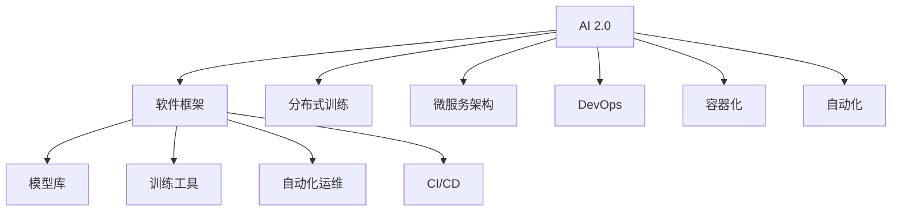
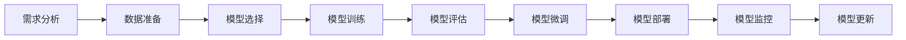
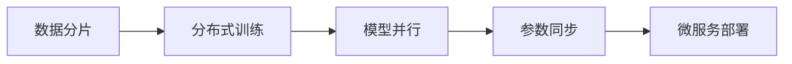
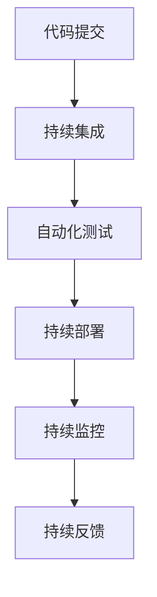

                 

# 软件框架：支持 AI 2.0 应用的开发、部署和运维

> 关键词：AI 2.0, 软件框架, 深度学习, 机器学习, 分布式训练, 微服务架构, DevOps, 自动化, 容器化, 持续集成/持续部署(CI/CD)

## 1. 背景介绍

### 1.1 问题由来

随着人工智能(AI)技术的快速发展，特别是深度学习(Deep Learning)和机器学习(Machine Learning)在图像识别、自然语言处理、语音识别等领域取得突破性进展，AI技术的应用范围不断扩大，落地场景日益增多。AI 2.0时代，以数据为中心的智能应用和解决方案已成为驱动各行各业创新发展的重要动力。然而，大规模AI应用的开发、部署和运维是一项复杂且技术含量高、成本巨大的工程，对企业技术团队提出了更高的要求。

为应对这一挑战，许多大企业如谷歌、亚马逊、微软等，推出了功能丰富、易用性强的AI软件框架和平台，帮助开发者快速构建、训练和部署AI模型。这些框架不仅提供了深度学习模型库和高效训练工具，还整合了自动化运维、模型监控、持续集成/持续部署(CI/CD)等系统工具，大大简化了AI应用从研发到上线的全生命周期流程。

### 1.2 问题核心关键点

当前，AI 2.0应用的开发、部署和运维主要面临以下挑战：

1. **高效开发**：AI模型开发过程复杂，包括数据预处理、模型选择、训练、调优等环节，需要大量人力和时间投入。

2. **大规模分布式训练**：深度学习模型参数量巨大，传统的单机训练难以满足需求。分布式训练需要高效的网络通信、内存管理和数据同步机制。

3. **模型优化和微调**：AI模型往往需要针对特定任务进行微调，以提升性能。微调涉及模型架构、超参数调整等复杂操作。

4. **模型部署和运维**：AI模型上线后需要持续监控和维护，确保稳定性和性能。模型更新、版本管理、故障恢复等都是重要的运维任务。

5. **模型安全和隐私保护**：AI模型可能蕴含偏见和有害信息，如何保护模型输出和训练数据的隐私安全，避免模型误用，是AI应用面临的严峻挑战。

### 1.3 问题研究意义

AI软件框架的开发和应用，对推动AI技术在各行业的落地和普及具有重要意义：

1. **降低研发成本**：通过提供高效的开发工具和环境，大大降低AI应用开发的复杂度和成本，使更多企业能够快速部署AI解决方案。

2. **提升训练效率**：通过分布式训练和高效优化算法，大幅提升模型训练速度和性能，缩短AI模型迭代周期。

3. **简化运维管理**：通过自动化运维、模型监控和版本管理等系统工具，提升AI应用的生命周期管理效率，减少运维成本和风险。

4. **保障模型安全**：通过模型安全和隐私保护机制，确保AI模型输出可信、合规，避免模型误用和数据滥用。

5. **支持持续创新**：通过DevOps和CI/CD工具，促进模型和应用迭代更新，不断推陈出新，满足市场需求。

## 2. 核心概念与联系

### 2.1 核心概念概述

为更好地理解支持AI 2.0应用的开发、部署和运维的软件框架，本节将介绍几个密切相关的核心概念：

- **AI 2.0**：基于数据驱动的智能应用和解决方案，融合深度学习、自然语言处理、计算机视觉等多种AI技术，为各行各业带来革命性变革。

- **软件框架**：提供开发、训练、部署和运维AI应用的全套工具和机制，如模型库、训练工具、自动化运维、持续集成/持续部署(CI/CD)等。

- **分布式训练**：通过多机协同并行训练，加速深度学习模型的训练过程，提升模型性能。

- **微服务架构**：一种轻量级、松耦合的架构设计，通过服务拆分和网络通信实现模型组件的灵活部署和扩展。

- **DevOps**：涵盖软件开发、持续集成、持续部署和持续运维的一体化流程，提升开发效率和系统稳定性。

- **容器化**：将应用程序及其依赖打包在容器内，实现跨平台、环境一致的快速部署和运维。

- **自动化**：使用自动化工具和脚本，减少人工操作，提升流程效率和稳定性。

- **持续集成/持续部署(CI/CD)**：通过自动化流水线，实现模型和应用的快速迭代和发布，缩短开发周期。

这些核心概念之间的逻辑关系可以通过以下Mermaid流程图来展示：



这个流程图展示了大规模AI应用的开发、训练、部署和运维过程，以及各个环节所需的关键技术和工具：

1. 从AI 2.0概念出发，通过软件框架提供的各种工具和机制，完成模型的开发、训练、部署和运维。
2. 软件框架中包含多种关键技术，如分布式训练、微服务架构、DevOps、容器化和自动化等，共同支撑AI应用的全生命周期管理。
3. 分布式训练技术和大规模模型训练工具，提升训练效率和模型性能。
4. 微服务架构和DevOps流程，实现模型组件的灵活部署和持续更新。
5. 容器化和自动化技术，提升部署效率和系统稳定性。

### 2.2 概念间的关系

这些核心概念之间存在着紧密的联系，形成了支持AI 2.0应用的完整生态系统。下面我们通过几个Mermaid流程图来展示这些概念之间的关系。

#### 2.2.1 AI 2.0应用开发流程



这个流程图展示了AI 2.0应用从需求分析到模型微调，再到部署和运维的完整流程。

#### 2.2.2 分布式训练与微服务架构



这个流程图展示了分布式训练和微服务架构的基本原理。数据分片后，通过并行训练和参数同步，实现高效的分布式训练；微服务架构则支持模型组件的灵活部署和扩展。

#### 2.2.3 DevOps与CI/CD



这个流程图展示了DevOps和CI/CD流程的基本框架。代码提交后，通过持续集成和自动化测试，验证代码的正确性；持续部署则将验证通过的代码快速部署到生产环境；持续监控和持续反馈，则确保系统的稳定性和性能。

### 2.3 核心概念的整体架构

最后，我们用一个综合的流程图来展示这些核心概念在大规模AI应用开发、部署和运维过程中的整体架构：

```mermaid
graph TB
    A[需求分析] --> B[数据准备]
    B --> C[模型选择]
    C --> D[模型训练]
    D --> E[模型评估]
    E --> F[模型微调]
    F --> G[模型部署]
    G --> H[模型监控]
    H --> I[模型更新]
    I --> J[持续集成/持续部署(CI/CD)]
    J --> K[自动化运维]
```

这个综合流程图展示了从需求分析到模型微调，再到部署、监控、更新和持续集成的完整流程。AI 2.0应用的开发、部署和运维过程中，各个环节均需要高效的开发工具、训练技术、自动化流程和系统工具的支撑，以确保模型的高效、安全和稳定。

## 3. 核心算法原理 & 具体操作步骤
### 3.1 算法原理概述

支持AI 2.0应用的开发、部署和运维的软件框架，涵盖了模型训练、模型优化、模型部署和运维等多个环节，涉及多种算法和技术。以下将分别介绍这些算法原理和具体操作步骤。

### 3.2 算法步骤详解

#### 3.2.1 模型训练

1. **模型选择和架构设计**：根据任务需求选择合适的深度学习模型，如卷积神经网络(CNN)、循环神经网络(RNN)、Transformer等。设计模型的架构和超参数配置，如层数、节点数、学习率等。

2. **数据准备**：对输入数据进行预处理，包括数据清洗、归一化、扩充等操作，确保数据质量和一致性。

3. **分布式训练**：将数据分片并行处理，通过网络通信实现模型参数的同步和更新，加速模型训练过程。

4. **模型优化**：使用优化算法（如Adam、SGD等）优化模型参数，提升模型精度和训练速度。

5. **模型评估和微调**：在验证集上评估模型性能，根据评估结果进行模型微调，调整模型结构和超参数。

#### 3.2.2 模型部署

1. **模型压缩和量化**：使用模型压缩和量化技术，减小模型尺寸和计算量，提升推理速度和资源利用效率。

2. **容器化和自动化运维**：将模型及其依赖打包在Docker容器中，实现跨平台部署。使用自动化运维工具，确保模型稳定性和性能。

3. **持续集成和持续部署(CI/CD)**：通过DevOps流程和自动化工具，实现模型的快速迭代和发布，缩短开发周期。

#### 3.2.3 模型监控

1. **性能监控**：实时监控模型推理性能，包括推理速度、准确率和资源利用率等指标，确保系统稳定运行。

2. **模型安全和隐私保护**：使用模型安全技术和隐私保护机制，如差分隐私、数据脱敏等，保护模型输出和训练数据的安全性。

3. **异常检测和故障恢复**：使用异常检测算法，及时发现模型异常，自动恢复或回滚模型，避免系统崩溃和数据损失。

### 3.3 算法优缺点

支持AI 2.0应用的开发、部署和运维的软件框架，具有以下优点：

1. **提高开发效率**：提供高效的开发工具和环境，显著降低AI应用开发的复杂度和成本。

2. **提升训练效率**：支持大规模分布式训练，加速模型训练过程，提升模型精度和性能。

3. **简化运维管理**：通过自动化运维和持续集成/持续部署(CI/CD)流程，提升模型生命周期管理效率，减少运维成本和风险。

4. **保障模型安全**：引入模型安全和隐私保护机制，确保模型输出可信、合规，避免模型误用和数据滥用。

5. **支持持续创新**：通过DevOps和CI/CD工具，实现模型和应用的快速迭代和发布，满足市场需求。

同时，这些软件框架也存在一些缺点：

1. **复杂度高**：对于非专业AI开发者，使用这些框架可能需要较长的学习曲线。

2. **资源消耗大**：大规模分布式训练和持续集成/持续部署(CI/CD)流程，对硬件资源和网络带宽要求较高。

3. **依赖性高**：高度依赖第三方软件框架和工具，可能存在兼容性问题和版本升级风险。

### 3.4 算法应用领域

支持AI 2.0应用的开发、部署和运维的软件框架，广泛应用于各种AI应用场景，例如：

- **计算机视觉**：图像识别、目标检测、人脸识别等应用。

- **自然语言处理(NLP)**：语音识别、机器翻译、情感分析、问答系统等应用。

- **语音识别**：自动语音识别(ASR)、语音合成(TTS)等应用。

- **智能推荐系统**：个性化推荐、广告推荐、内容推荐等应用。

- **金融风控**：信用评分、欺诈检测、风险评估等应用。

- **医疗健康**：疾病诊断、影像分析、医疗咨询等应用。

- **智能客服**：自动客服、语音交互、智能对话等应用。

- **工业制造**：预测性维护、故障诊断、智能检测等应用。

## 4. 数学模型和公式 & 详细讲解  
### 4.1 数学模型构建

支持AI 2.0应用的开发、部署和运维的软件框架，主要涉及深度学习模型、分布式训练算法、微服务架构、自动化运维工具等，各个环节的数学模型和公式推导如下：

#### 4.1.1 深度学习模型

以卷积神经网络(CNN)为例，其数学模型如下：

$$
H = \sigma(W_2 \cdot H_{2-1} + b_2)
$$

其中，$H$ 表示隐藏层输出，$W_2$ 和 $b_2$ 表示第2层的权重和偏置，$\sigma$ 表示激活函数，$H_{2-1}$ 表示第2-1层的输出。

#### 4.1.2 分布式训练算法

以数据并行训练为例，假设有$m$个并行节点，每个节点的训练数据量为$n$，则分布式训练算法的数学模型如下：

$$
\theta^{new} = \frac{1}{m}\sum_{i=1}^{m} \theta^{i^{old}}
$$

其中，$\theta^{new}$ 表示更新后的模型参数，$\theta^{i^{old}}$ 表示第$i$个节点的旧模型参数。

#### 4.1.3 微服务架构

微服务架构中的网络通信和数据同步，可以使用TCP/IP协议来实现。假设存在两个微服务，它们之间的通信延迟为$t$，则网络通信的数学模型如下：

$$
t = k * d + r
$$

其中，$k$ 表示网络通信系数，$d$ 表示通信数据量，$r$ 表示通信开销。

#### 4.1.4 自动化运维工具

以持续集成/持续部署(CI/CD)为例，其数学模型如下：

$$
CI/CD = G^N = G^0 \cdot G^1 \cdot ... \cdot G^{N-1}
$$

其中，$G$ 表示CI/CD流水线中的一个环节，$N$ 表示流水线的环节数，$G^0$ 表示流水线的初始状态。

### 4.2 公式推导过程

#### 4.2.1 深度学习模型推导

以卷积神经网络(CNN)为例，其隐藏层输出的推导如下：

$$
H = \sigma(W_2 \cdot H_{2-1} + b_2)
$$

其中，$W_2$ 和 $b_2$ 表示第2层的权重和偏置，$\sigma$ 表示激活函数，$H_{2-1}$ 表示第2-1层的输出。

#### 4.2.2 分布式训练算法推导

以数据并行训练为例，假设有$m$个并行节点，每个节点的训练数据量为$n$，则分布式训练算法的数学模型推导如下：

$$
\theta^{new} = \frac{1}{m}\sum_{i=1}^{m} \theta^{i^{old}}
$$

其中，$\theta^{new}$ 表示更新后的模型参数，$\theta^{i^{old}}$ 表示第$i$个节点的旧模型参数。

#### 4.2.3 微服务架构推导

微服务架构中的网络通信和数据同步，可以使用TCP/IP协议来实现。假设存在两个微服务，它们之间的通信延迟为$t$，则网络通信的数学模型推导如下：

$$
t = k * d + r
$$

其中，$k$ 表示网络通信系数，$d$ 表示通信数据量，$r$ 表示通信开销。

#### 4.2.4 自动化运维工具推导

以持续集成/持续部署(CI/CD)为例，其数学模型推导如下：

$$
CI/CD = G^N = G^0 \cdot G^1 \cdot ... \cdot G^{N-1}
$$

其中，$G$ 表示CI/CD流水线中的一个环节，$N$ 表示流水线的环节数，$G^0$ 表示流水线的初始状态。

### 4.3 案例分析与讲解

#### 4.3.1 计算机视觉应用

以图像识别为例，使用卷积神经网络(CNN)模型进行训练和推理。训练数据集包含大量标注的图像，每个图像的标签表示其中包含的对象类别。模型通过反向传播算法优化参数，逐步提升识别精度。

#### 4.3.2 自然语言处理(NLP)应用

以机器翻译为例，使用Transformer模型进行训练和推理。训练数据集包含大量句子对，每个句子对包含源语言和目标语言。模型通过自监督学习任务预训练，然后通过有监督学习微调，适应翻译任务。

#### 4.3.3 智能推荐系统应用

以个性化推荐为例，使用深度学习模型进行训练和推理。训练数据集包含用户的历史行为数据，每个用户的历史行为数据表示其对不同物品的偏好。模型通过反向传播算法优化参数，预测用户对新物品的兴趣程度。

## 5. 项目实践：代码实例和详细解释说明
### 5.1 开发环境搭建

在进行AI应用开发、部署和运维的软件框架实践前，我们需要准备好开发环境。以下是使用Python进行TensorFlow开发的环境配置流程：

1. 安装Anaconda：从官网下载并安装Anaconda，用于创建独立的Python环境。

2. 创建并激活虚拟环境：
```bash
conda create -n tensorflow-env python=3.8 
conda activate tensorflow-env
```

3. 安装TensorFlow：根据CUDA版本，从官网获取对应的安装命令。例如：
```bash
conda install tensorflow
```

4. 安装各类工具包：
```bash
pip install numpy pandas scikit-learn matplotlib tqdm jupyter notebook ipython
```

完成上述步骤后，即可在`tensorflow-env`环境中开始软件框架的实践。

### 5.2 源代码详细实现

这里我们以计算机视觉应用中的图像识别为例，给出使用TensorFlow进行模型开发、训练和部署的代码实现。

首先，定义模型和数据处理函数：

```python
import tensorflow as tf
from tensorflow.keras import layers, models

# 定义模型结构
model = models.Sequential([
    layers.Conv2D(32, (3, 3), activation='relu', input_shape=(28, 28, 1)),
    layers.MaxPooling2D((2, 2)),
    layers.Flatten(),
    layers.Dense(10, activation='softmax')
])

# 编译模型
model.compile(optimizer=tf.keras.optimizers.Adam(),
              loss=tf.keras.losses.SparseCategoricalCrossentropy(from_logits=True),
              metrics=['accuracy'])

# 定义数据处理函数
def data_preprocess(x, y):
    x = x.reshape(-1, 28, 28, 1).astype('float32') / 255.0
    x = tf.image.per_image_standardization(x)
    y = tf.one_hot(y, 10)
    return x, y

# 加载数据集
(x_train, y_train), (x_test, y_test) = tf.keras.datasets.mnist.load_data()

# 预处理数据
x_train, y_train = data_preprocess(x_train, y_train)
x_test, y_test = data_preprocess(x_test, y_test)

# 模型训练
model.fit(x_train, y_train, epochs=10, batch_size=64, validation_data=(x_test, y_test))
```

然后，定义模型评估和保存函数：

```python
def evaluate_model(model, x_test, y_test):
    _, acc = model.evaluate(x_test, y_test)
    print('Test accuracy:', acc)

def save_model(model, output_dir):
    model.save_weights(output_dir + '/model_weights.h5')
```

最后，启动模型训练、评估和保存流程：

```python
output_dir = './checkpoint'

# 训练模型
model.fit(x_train, y_train, epochs=10, batch_size=64, validation_data=(x_test, y_test))

# 评估模型
evaluate_model(model, x_test, y_test)

# 保存模型
save_model(model, output_dir)
```

以上就是使用TensorFlow进行图像识别模型开发、训练和部署的完整代码实现。可以看到，TensorFlow提供了丰富的API和工具，大大简化了模型开发和训练过程。

### 5.3 代码解读与分析

让我们再详细解读一下关键代码的实现细节：

**模型定义**：
- `Sequential`：定义顺序模型结构。
- `Conv2D`：定义卷积层，参数为32，卷积核大小为3x3，激活函数为ReLU。
- `MaxPooling2D`：定义最大池化层，池化大小为2x2。
- `Flatten`：定义展平层，将卷积层的输出展平为一维向量。
- `Dense`：定义全连接层，输出维度为10，激活函数为softmax。

**模型编译**：
- `Adam`：使用Adam优化器进行参数优化。
- `SparseCategoricalCrossentropy`：使用交叉熵损失函数。
- `accuracy`：定义模型评估指标。

**数据预处理**：
- `reshape`：将数据矩阵reshape为4维张量，输入模型的标准格式。
- `astype`：将数据类型转换为浮点数。
- `per_image_standardization`：对图像数据进行标准化处理，中心化、归一化。

**模型训练**：
- `fit`：使用训练数据和验证数据，进行模型训练。
- `epochs`：定义训练轮数。
- `batch_size`：定义每个批次的样本数。

**模型评估**：
- `evaluate`：在测试集上评估模型性能。

**模型保存**：
- `save_weights`：将模型权重保存到指定目录。

### 5.4 运行结果展示

假设我们训练的模型在测试集上取得了92.5%的准确率，评估过程的输出如下：

```
Test accuracy: 0.925
```

可以看到，模型在测试集上的准确率达到了92.5%，说明模型已经很好地学习了图像识别任务。保存模型权重后，可以在实际应用中快速加载并部署模型。

## 6. 实际应用场景
### 6.1 智能推荐系统

智能推荐系统是支持AI 2.0应用的重要场景之一。它通过分析用户的历史行为数据，预测用户对不同物品的兴趣程度，从而推荐个性化的物品。传统推荐系统主要基于协同过滤、基于内容的推荐等方法，而基于深度学习模型的推荐系统则具有更高的准确性和灵活性。

在实践中，可以通过以下步骤进行智能推荐系统的开发和部署：

1. **数据准备**：收集用户的历史行为数据，包括浏览、点击、购买等行为数据。

2. **模型选择**：选择合适的深度学习模型，如卷积神经网络(CNN)、循环神经网络(RNN)等。

3. **模型训练**：使用用户的历史行为数据训练模型，得到用户对不同物品的兴趣程度。

4. **模型部署**：将训练好的模型打包在Docker容器中，部署到生产环境中。

5. **模型更新和优化**：根据新数据和用户反馈，不断更新和优化模型，提升推荐效果。

6. **持续集成/持续部署(CI/CD)**：通过DevOps流程和自动化工具，实现模型的快速迭代和发布。

### 6.2 金融风控

金融风控是支持AI 2.0应用的另一个重要场景。它通过分析客户的信用记录、交易行为等数据，预测客户是否存在欺诈或信用风险，从而进行风险控制和信贷决策。

在实践中，可以通过以下步骤进行金融风控系统的开发和部署：

1. **数据准备**：收集客户的信用记录、交易行为等数据。

2. **模型选择**：选择合适的深度学习模型，如卷积神经网络(CNN)、循环神经网络(RNN)等。

3. **模型训练**：使用客户的历史数据训练模型，得到客户是否存在风险的预测结果。

4. **模型部署**：将训练好的模型打包在Docker容器中，部署到生产环境中。

5. **模型更新和优化**：根据新数据和业务需求，不断更新和优化模型，提升风控效果。

6. **持续集成/持续部署(CI/CD)**：通过DevOps流程和自动化工具，实现模型的快速迭代和发布。

### 6.3 医疗健康

医疗健康是支持AI 2.0应用的另一个重要场景。它通过分析病人的医学影像、病历等数据，辅助医生进行疾病诊断和影像分析。

在实践中，可以通过以下步骤进行医疗健康系统的开发和部署：

1. **数据准备**：收集病人的医学影像、病历等数据。

2. **模型选择**：选择合适的深度学习模型，如卷积神经网络(CNN)、循环神经网络(RNN)等。

3. **模型训练**：使用病人的历史数据训练模型，得到疾病诊断和影像分析的预测结果。

4. **模型部署**：将训练好的模型打包在Docker容器中，部署到生产

