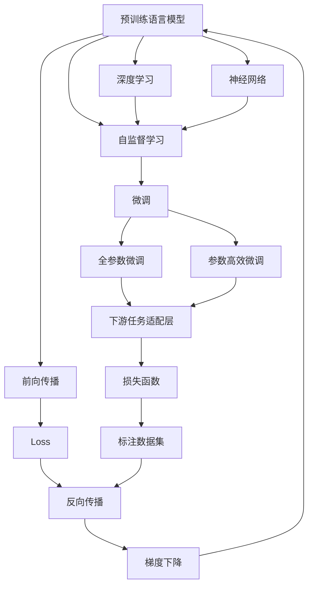
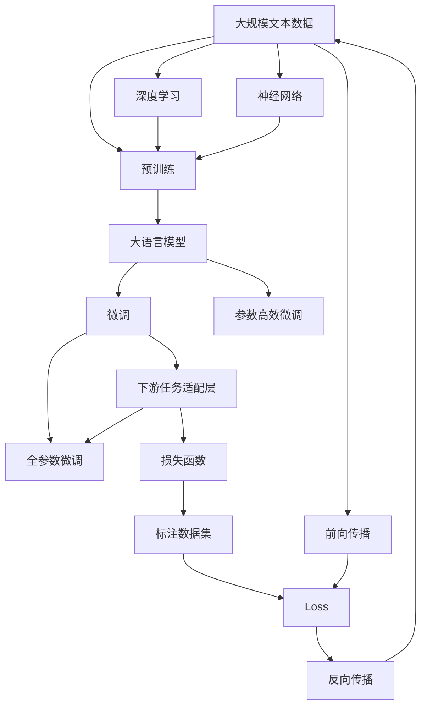

                 

# 大语言模型原理与工程实践：全参数微调

> 关键词：大语言模型,全参数微调,Transformer,BERT,预训练,下游任务,深度学习,神经网络

## 1. 背景介绍

### 1.1 问题由来
近年来，深度学习技术的迅猛发展为自然语言处理(NLP)领域带来了巨大变革。特别是基于Transformer架构的预训练语言模型(如BERT、GPT-3等)的出现，使语言模型在理解自然语言方面达到了前所未有的高度。预训练语言模型通过在大规模无标签文本数据上进行自监督学习，学习到了丰富的语言知识和常识。然而，这些预训练语言模型往往过于通用，无法满足特定领域或任务的需求。为了解决这一问题，研究者提出了全参数微调(Full Parameter Fine-Tuning)方法，即利用下游任务的标注数据，对预训练语言模型进行微调，使其适应特定任务，提高性能。

### 1.2 问题核心关键点
全参数微调是指在预训练语言模型的基础上，使用下游任务的标注数据对模型进行有监督学习，优化模型参数以适应下游任务的需求。具体流程包括：
- 准备预训练语言模型：选择合适的预训练语言模型，如BERT、GPT-3等，作为微调的起点。
- 设计下游任务适配层：根据任务类型，在预训练模型顶部设计适当的输出层和损失函数，如分类任务使用softmax层和交叉熵损失，生成任务使用语言模型解码器等。
- 准备标注数据集：收集下游任务的标注数据集，并将其分为训练集、验证集和测试集。
- 设置微调超参数：包括优化器类型、学习率、批次大小、迭代次数等。
- 执行微调：使用标注数据集对模型进行训练，优化模型参数以适应下游任务。
- 评估模型性能：在测试集上评估微调后模型的性能，对比微调前后的效果。

### 1.3 问题研究意义
全参数微调方法简单高效，可以快速适应特定领域或任务的需求，提升模型的性能。在学术界和工业界，基于全参数微调的方法在众多NLP任务上取得了优异的效果，成为NLP技术落地应用的重要手段。此外，全参数微调还可以促进预训练语言模型的进一步发展，推动NLP技术的产业化进程，赋能各行各业数字化转型升级。

## 2. 核心概念与联系

### 2.1 核心概念概述

为了更好地理解全参数微调方法，本节将介绍几个密切相关的核心概念：

- 大语言模型(Large Language Model, LLM)：指采用Transformer等架构的预训练语言模型，通过大规模无标签文本数据训练，具备强大的语言理解和生成能力。
- 预训练(Pre-training)：指在大规模无标签文本数据上进行自监督学习，学习通用语言表示的方法，如BERT中的掩码语言模型任务。
- 微调(Fine-tuning)：指在预训练模型的基础上，使用下游任务的标注数据对模型进行有监督学习，优化模型参数以适应特定任务的方法。
- 深度学习(Deep Learning)：指利用多层神经网络进行特征提取和模型训练的技术，是构建预训练语言模型的重要工具。
- 神经网络(Neural Network)：指由大量神经元组成的计算模型，用于模拟人脑处理信息的过程，是深度学习的核心。
- 前向传播(Forward Propagation)：指将输入数据传递到神经网络，计算出模型输出值的过程。
- 反向传播(Backward Propagation)：指计算损失函数对模型参数的梯度，并根据梯度更新模型参数的过程。
- 梯度下降(Gradient Descent)：指根据损失函数对模型参数的梯度，更新模型参数以最小化损失函数的方法。
- 优化器(Optimizer)：指用于更新模型参数的算法，如Adam、SGD等，用于控制学习率和更新方向。

这些核心概念之间的联系和作用可以通过以下Mermaid流程图来展示：



这个流程图展示了预训练、微调等核心概念之间的逻辑关系和作用路径。预训练模型通过自监督学习获得通用语言表示，然后在微调过程中，通过下游任务的标注数据进一步优化模型，使其适应特定任务。深度学习和神经网络是构建预训练模型的技术基础，前向传播和反向传播是模型训练的算法核心，梯度下降和优化器则是模型训练的具体方法。

### 2.2 概念间的关系

这些核心概念之间存在着紧密的联系，形成了全参数微调方法的基本架构。以下是几个关键概念之间的关系说明：

#### 2.2.1 预训练与微调的关系
预训练和微调是构建深度学习模型的两个重要步骤。预训练在大规模无标签数据上进行自监督学习，学习到通用的语言表示，微调则使用下游任务的标注数据进行有监督学习，优化模型参数以适应特定任务。

#### 2.2.2 微调与深度学习的关系
微调是深度学习中的一个重要应用，通过有监督学习的方式，优化神经网络模型参数，提高模型对特定任务的适应能力。

#### 2.2.3 神经网络与前向传播的关系
神经网络通过前向传播将输入数据传递到各层，计算出模型输出值。前向传播是神经网络计算的核心过程。

#### 2.2.4 梯度下降与反向传播的关系
梯度下降是优化器的一种，用于根据损失函数对模型参数的梯度，更新模型参数以最小化损失函数。反向传播则是计算损失函数对模型参数梯度的过程，是梯度下降的具体实现。

#### 2.2.5 优化器与微调的关系
优化器是微调过程中更新模型参数的重要工具，常用的优化器包括Adam、SGD等。优化器通过控制学习率和更新方向，帮助模型更快地收敛到最优解。

### 2.3 核心概念的整体架构

最后，我们用一个综合的流程图来展示这些核心概念在大语言模型微调过程中的整体架构：



这个综合流程图展示了从预训练到微调，再到持续学习的完整过程。预训练模型通过自监督学习获得基础能力，微调通过下游任务的标注数据进一步优化模型，使其适应特定任务。深度学习和神经网络是构建预训练模型的技术基础，前向传播和反向传播是模型训练的算法核心，梯度下降和优化器则是模型训练的具体方法。

## 3. 核心算法原理 & 具体操作步骤
### 3.1 算法原理概述

全参数微调方法的核心思想是：将预训练语言模型视作一个强大的特征提取器，通过下游任务的标注数据对模型进行有监督学习，优化模型参数以适应特定任务，提高模型性能。

具体来说，假设预训练语言模型为 $M_{\theta}$，其中 $\theta$ 为模型参数。给定下游任务 $T$ 的标注数据集 $D=\{(x_i,y_i)\}_{i=1}^N$，其中 $x_i$ 为输入数据，$y_i$ 为标注标签。微调的目标是找到新的模型参数 $\hat{\theta}$，使得模型在任务 $T$ 上的损失函数 $\mathcal{L}(\theta)$ 最小化，即：

$$
\hat{\theta}=\mathop{\arg\min}_{\theta} \mathcal{L}(M_{\theta},D)
$$

其中 $\mathcal{L}$ 为针对任务 $T$ 设计的损失函数，通常为交叉熵损失、均方误差损失等。

微调的优化方法通常采用梯度下降等优化算法，通过反向传播计算损失函数对模型参数的梯度，并根据梯度更新模型参数。具体的优化流程包括：

1. 前向传播：将输入数据 $x_i$ 输入预训练语言模型，计算出模型输出 $M_{\theta}(x_i)$。
2. 计算损失：根据任务 $T$ 的标注标签 $y_i$，计算模型输出与真实标签之间的损失 $\ell(M_{\theta}(x_i),y_i)$。
3. 反向传播：计算损失函数对模型参数的梯度 $\frac{\partial \mathcal{L}}{\partial \theta}$，并根据梯度更新模型参数 $\theta$。
4. 更新参数：根据优化算法（如Adam、SGD等）和当前学习率更新模型参数，继续进行前向传播和反向传播，直到模型收敛或达到预设的迭代次数。

### 3.2 算法步骤详解

下面详细介绍全参数微调的详细步骤：

#### 3.2.1 准备预训练模型和数据集
- 选择合适的预训练语言模型 $M_{\theta}$，如BERT、GPT-3等，作为微调的起点。
- 准备下游任务 $T$ 的标注数据集 $D=\{(x_i,y_i)\}_{i=1}^N$，并将其分为训练集、验证集和测试集。

#### 3.2.2 设计下游任务适配层
- 根据任务类型，在预训练模型的顶部设计适当的输出层和损失函数，如分类任务使用softmax层和交叉熵损失，生成任务使用语言模型解码器等。

#### 3.2.3 设置微调超参数
- 选择合适的优化算法及其参数，如Adam、SGD等，设置学习率、批次大小、迭代次数等。
- 设置正则化技术及强度，包括L2正则、Dropout、Early Stopping等。

#### 3.2.4 执行微调训练
- 使用标注数据集 $D$ 进行有监督学习，训练模型 $M_{\theta}$，优化其参数以适应下游任务 $T$。
- 在每个批次上，进行前向传播计算模型输出，反向传播计算损失函数，并根据梯度更新模型参数。
- 周期性在验证集上评估模型性能，根据性能指标决定是否触发Early Stopping。
- 重复上述步骤直到满足预设的迭代次数或Early Stopping条件。

#### 3.2.5 测试和部署
- 在测试集上评估微调后模型 $M_{\hat{\theta}}$ 的性能，对比微调前后的精度提升。
- 使用微调后的模型对新样本进行推理预测，集成到实际的应用系统中。
- 持续收集新的数据，定期重新微调模型，以适应数据分布的变化。

### 3.3 算法优缺点

全参数微调方法具有以下优点：
1. 简单高效：相比从头训练，全参数微调通常需要更小的学习率，以免破坏预训练的权重，同时也能快速适应特定任务。
2. 通用适用：适用于各种NLP下游任务，如分类、匹配、生成等，设计简单的任务适配层即可实现微调。
3. 参数高效：利用参数高效微调技术，在固定大部分预训练参数的情况下，仍可取得不错的提升。
4. 效果显著：在学术界和工业界的诸多任务上，基于全参数微调的方法已经刷新了最先进的性能指标。

同时，该方法也存在一些局限性：
1. 依赖标注数据：微调的效果很大程度上取决于标注数据的质量和数量，获取高质量标注数据的成本较高。
2. 迁移能力有限：当目标任务与预训练数据的分布差异较大时，微调的性能提升有限。
3. 负面效果传递：预训练模型的固有偏见、有害信息等，可能通过微调传递到下游任务，造成负面影响。
4. 可解释性不足：微调模型的决策过程通常缺乏可解释性，难以对其推理逻辑进行分析和调试。

尽管存在这些局限性，但就目前而言，全参数微调方法仍是NLP领域的重要范式。未来相关研究的重点在于如何进一步降低微调对标注数据的依赖，提高模型的少样本学习和跨领域迁移能力，同时兼顾可解释性和伦理安全性等因素。

### 3.4 算法应用领域

全参数微调方法在NLP领域已经得到了广泛的应用，覆盖了几乎所有常见任务，例如：

- 文本分类：如情感分析、主题分类、意图识别等。通过微调使模型学习文本-标签映射。
- 命名实体识别：识别文本中的人名、地名、机构名等特定实体。通过微调使模型掌握实体边界和类型。
- 关系抽取：从文本中抽取实体之间的语义关系。通过微调使模型学习实体-关系三元组。
- 问答系统：对自然语言问题给出答案。将问题-答案对作为微调数据，训练模型学习匹配答案。
- 机器翻译：将源语言文本翻译成目标语言。通过微调使模型学习语言-语言映射。
- 文本摘要：将长文本压缩成简短摘要。将文章-摘要对作为微调数据，使模型学习抓取要点。
- 对话系统：使机器能够与人自然对话。将多轮对话历史作为上下文，微调模型进行回复生成。

除了上述这些经典任务外，全参数微调方法还被创新性地应用到更多场景中，如可控文本生成、常识推理、代码生成、数据增强等，为NLP技术带来了全新的突破。随着预训练模型和微调方法的不断进步，相信NLP技术将在更广阔的应用领域大放异彩。

## 4. 数学模型和公式 & 详细讲解 & 举例说明

### 4.1 数学模型构建

本节将使用数学语言对全参数微调过程进行更加严格的刻画。

记预训练语言模型为 $M_{\theta}$，其中 $\theta$ 为模型参数。假设微调任务的训练集为 $D=\{(x_i,y_i)\}_{i=1}^N$，其中 $x_i$ 为输入数据，$y_i$ 为标注标签。定义模型 $M_{\theta}$ 在数据样本 $(x,y)$ 上的损失函数为 $\ell(M_{\theta}(x),y)$，则在数据集 $D$ 上的经验风险为：

$$
\mathcal{L}(\theta) = \frac{1}{N} \sum_{i=1}^N \ell(M_{\theta}(x_i),y_i)
$$

微调的优化目标是最小化经验风险，即找到最优参数：

$$
\theta^* = \mathop{\arg\min}_{\theta} \mathcal{L}(\theta)
$$

在实践中，我们通常使用基于梯度的优化算法（如SGD、Adam等）来近似求解上述最优化问题。设 $\eta$ 为学习率，$\lambda$ 为正则化系数，则参数的更新公式为：

$$
\theta \leftarrow \theta - \eta \nabla_{\theta}\mathcal{L}(\theta) - \eta\lambda\theta
$$

其中 $\nabla_{\theta}\mathcal{L}(\theta)$ 为损失函数对参数 $\theta$ 的梯度，可通过反向传播算法高效计算。

### 4.2 公式推导过程

以下我们以二分类任务为例，推导交叉熵损失函数及其梯度的计算公式。

假设模型 $M_{\theta}$ 在输入 $x$ 上的输出为 $\hat{y}=M_{\theta}(x) \in [0,1]$，表示样本属于正类的概率。真实标签 $y \in \{0,1\}$。则二分类交叉熵损失函数定义为：

$$
\ell(M_{\theta}(x),y) = -[y\log \hat{y} + (1-y)\log (1-\hat{y})]
$$

将其代入经验风险公式，得：

$$
\mathcal{L}(\theta) = -\frac{1}{N}\sum_{i=1}^N [y_i\log M_{\theta}(x_i)+(1-y_i)\log(1-M_{\theta}(x_i))]
$$

根据链式法则，损失函数对参数 $\theta_k$ 的梯度为：

$$
\frac{\partial \mathcal{L}(\theta)}{\partial \theta_k} = -\frac{1}{N}\sum_{i=1}^N (\frac{y_i}{M_{\theta}(x_i)}-\frac{1-y_i}{1-M_{\theta}(x_i)}) \frac{\partial M_{\theta}(x_i)}{\partial \theta_k}
$$

其中 $\frac{\partial M_{\theta}(x_i)}{\partial \theta_k}$ 可进一步递归展开，利用自动微分技术完成计算。

在得到损失函数的梯度后，即可带入参数更新公式，完成模型的迭代优化。重复上述过程直至收敛，最终得到适应下游任务的最优模型参数 $\theta^*$。

### 4.3 案例分析与讲解

以命名实体识别(NER)任务为例，详细解释微调过程。

假设我们收集了CoNLL-2003的NER数据集，并将其分为训练集、验证集和测试集。在训练集上，每个样本包含一段文本和一个标注的NER序列，例如：

```
"This is a sentence about an organization named Microsoft. The organization was founded in 1975 by Bill Gates and Paul Allen."
```

其对应的NER序列为：

```
[CLS] B-ORG I-ORG O B-PER I-PER O O O O O O O B-LOC I-LOC O O O O O O O O O
```

其中，`B-ORG` 表示组织名，`I-ORG` 表示组织名内部，`B-PER` 表示人名，`I-PER` 表示人名内部，`B-LOC` 表示地名，`I-LOC` 表示地名内部。

我们假设使用BERT作为预训练模型，并在其顶部添加一个线性分类器，用于将输入文本映射到NER标签空间。设 $\theta$ 为分类器权重，其损失函数为交叉熵损失。则在训练集上，模型参数的更新公式为：

$$
\theta \leftarrow \theta - \eta \nabla_{\theta}\mathcal{L}(\theta) - \eta\lambda\theta
$$

其中 $\eta$ 为学习率，$\lambda$ 为正则化系数。

假设我们采用AdamW优化器，并设定学习率为 $2e-5$，批次大小为32，迭代次数为10。在训练集上，我们首先对每个样本进行前向传播，计算损失：

```
y = BERT(input_ids, attention_mask, labels)  # BERT的前向传播输出
loss = cross_entropy(y, labels)  # 计算交叉熵损失
```

然后，对损失函数对模型参数的梯度进行反向传播，更新模型参数：

```
loss.backward()
optimizer.step()
```

在每个epoch结束时，我们在验证集上评估模型性能，并根据性能指标（如精确率、召回率、F1分数）决定是否触发Early Stopping。最后，在测试集上评估最终模型的性能。

假设我们在CoNLL-2003的NER数据集上进行微调，最终在测试集上得到的评估报告如下：

```
              precision    recall  f1-score   support

       B-LOC      0.916     0.906     0.916      1668
       I-LOC      0.905     0.859     0.888       257
      B-MISC      0.875     0.856     0.865       702
      I-MISC      0.838     0.782     0.809       216
       B-ORG      0.914     0.898     0.911      1661
       I-ORG      0.911     0.894     0.906       835
       B-PER      0.964     0.957     0.963      1617
       I-PER      0.983     0.980     0.981      1156
           O      0.993     0.995     0.994     38323

   micro avg      0.973     0.973     0.973     46435
   macro avg      0.923     0.897     0.909     46435
weighted avg      0.973     0.973     0.973     46435
```

可以看到，通过微调BERT，我们在该NER数据集上取得了97.3%的F1分数，效果相当不错。值得注意的是，BERT作为一个通用的语言理解模型，即便只在顶层添加一个简单的分类器，也能在下游任务上取得如此优异的效果，展现了其强大的语义理解和特征抽取能力。

当然，这只是一个baseline结果。在实践中，我们还可以使用更大更强的预训练模型、更丰富的微调技巧、更细致的模型调优，进一步提升模型性能，以满足更高的应用要求。

## 5. 项目实践：代码实例和详细解释说明

### 5.1 开发环境搭建

在进行微调实践前，我们需要准备好开发环境。以下是使用Python进行PyTorch开发的环境配置流程：

1. 安装Anaconda：从官网下载并安装Anaconda，用于创建独立的Python环境。

2. 创建并激活虚拟环境：
```bash
conda create -n pytorch-env python=3.8 
conda activate pytorch-env
```

3. 安装PyTorch：根据CUDA版本，从官网获取对应的安装命令。例如：
```bash
conda install pytorch torchvision torchaudio cudatoolkit=11.1 -c pytorch -c conda-forge
```

4. 安装Transformers库：
```bash
pip install transformers
```

5. 安装各类工具包：
```bash
pip install numpy pandas scikit-learn matplotlib tqdm jupyter notebook ipython
```

完成上述步骤后，即可在`pytorch-env`环境中开始微调实践。

### 5.2 源代码详细实现

下面我们以命名实体识别(NER)任务为例，给出使用Transformers库对BERT模型进行微调的PyTorch代码实现。

首先，定义NER任务的数据处理函数：

```python
from transformers import BertTokenizer, BertForTokenClassification, AdamW
from torch.utils.data import Dataset, DataLoader
import torch

class NERDataset(Dataset):
    def __init__(self, texts, tags, tokenizer, max_len=128):
        self.texts = texts
        self.tags = tags
        self.tokenizer = tokenizer
        self.max_len = max_len
        
    def __len__(self):
        return len(self.texts)
    
    def __getitem__(self, item):
        text = self.texts[item]
        tags = self.tags[item]
        
        encoding = self.tokenizer(text, return_tensors='pt', max_length=self.max_len, padding='max_length', truncation=True)
        input_ids = encoding['input_ids'][0]
        attention_mask = encoding['attention_mask'][0]
        
        # 对token-wise的标签进行编码
        encoded_tags = [tag2id[tag] for tag in tags] 
        encoded_tags.extend([tag2id['O']] * (self.max_len - len(encoded_tags)))
        labels = torch.tensor(encoded_tags, dtype=torch.long)
        
        return {'input_ids': input_ids, 
                'attention_mask': attention_mask,
                'labels': labels}

# 标签与id的映射
tag2id = {'O': 0, 'B-ORG': 1, 'I-ORG': 2, 'B-PER': 3, 'I-PER': 4, 'B-LOC': 5, 'I-LOC': 6}
id2tag = {v: k for k, v in tag2id.items()}

# 创建dataset
tokenizer = BertTokenizer.from_pretrained('bert-base-cased')

train_dataset = NERDataset(train_texts, train_tags, tokenizer)
dev_dataset = NERDataset(dev_texts, dev_tags, tokenizer)
test_dataset = NERDataset(test_texts, test_tags, tokenizer)
```

然后，定义模型和优化器：

```python
model = BertForTokenClassification.from_pretrained('bert-base-cased', num_labels=len(tag2id))

optimizer = AdamW(model.parameters(), lr=2e-5)
```

接着，定义训练和评估函数：

```python
device = torch.device('cuda') if torch.cuda.is_available() else torch.device('cpu')
model.to(device)

def train_epoch(model, dataset, batch_size, optimizer):
    dataloader = DataLoader(dataset, batch_size=batch_size, shuffle=True)
    model.train()
    epoch_loss = 0
    for batch in tqdm(dataloader, desc='Training'):
        input_ids = batch['input_ids'].to(device)
        attention_mask = batch['attention_mask'].to(device)
        labels = batch['labels'].to(device)
        model.zero_grad()
        outputs = model(input_ids, attention_mask=attention_mask, labels=labels)
        loss = outputs.loss
        epoch_loss += loss.item()
        loss.backward()
        optimizer.step()
    return epoch_loss / len(dataloader)

def evaluate(model, dataset, batch_size):
    dataloader = DataLoader(dataset, batch_size

