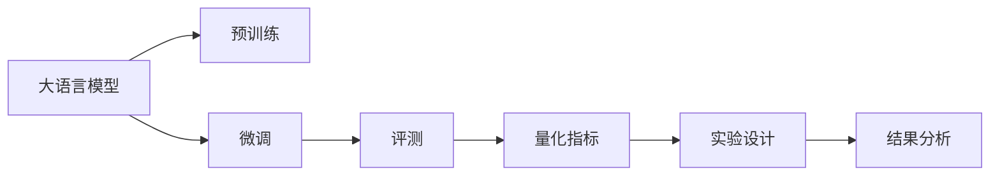

                 

# 大语言模型原理与工程实践：评测方式

> 关键词：
1. 大语言模型
2. 评测方法
3. 自然语言处理(NLP)
4. 模型评估
5. 量化评价指标
6. 实验设计
7. 结果分析

## 1. 背景介绍

在当今的人工智能时代，大语言模型（Large Language Models, LLMs）成为了自然语言处理（NLP）领域的核心技术之一。从GPT到BERT，再到T5，这些大模型通过在大规模无标签文本上预训练，能够学习到丰富的语言知识和常识，进而用于解决各种下游任务。然而，模型的好坏，除了依赖于其自身的设计和训练，很大程度上也取决于其评测方式的选择。

评测是模型开发的最后一步，也是极为重要的一步。一个好的评测体系能够准确地评估模型在不同任务上的表现，帮助我们更好地理解模型的优缺点，指导模型改进和应用。本文将系统地介绍大语言模型评测的方式，包括常用的量化指标、实验设计和结果分析等内容，希望为人工智能研究者和开发者提供指导。

## 2. 核心概念与联系

### 2.1 核心概念概述

在进行模型评测之前，我们需要先了解一些关键概念，这些概念构成了评测体系的基础：

1. **大语言模型 (LLMs)**：以自回归（如GPT）或自编码（如BERT）模型为代表的大规模预训练语言模型。这些模型通过在大规模无标签文本上预训练，学习到了语言的通用表示。

2. **预训练 (Pre-training)**：指在大规模无标签文本数据上进行自监督学习，训练出通用语言模型。预训练使得模型学习到了丰富的语言知识，为下游任务提供了良好的初始化参数。

3. **微调 (Fine-tuning)**：指在预训练模型的基础上，使用下游任务的少量标注数据，通过有监督学习优化模型在特定任务上的性能。通常只需要调整顶层分类器或解码器，并以较小的学习率更新全部或部分模型参数。

4. **评测 (Evaluation)**：通过对模型在各种评测数据集上的表现进行评估，了解模型在不同场景下的性能和适用性。

5. **量化指标 (Metric)**：用于量化和评估模型性能的数值指标，常见的有准确率、精确率、召回率、F1分数等。

6. **实验设计 (Experiment Design)**：根据模型任务设计实验方案，确保实验结果的科学性和可靠性。

7. **结果分析 (Result Analysis)**：对实验结果进行分析和解读，挖掘模型性能的优点和不足，指导后续优化。

这些概念通过一系列的流程联系在一起，形成了一套完整的模型评测体系。下面的Mermaid流程图展示了这些概念之间的关系：



通过这个流程图，我们可以更清晰地理解大语言模型的评测流程，从预训练、微调到评测，每个环节都有其独特的角色和任务。接下来，我们将详细介绍这些核心概念的原理和架构。

### 2.2 核心概念之间的关系

这些核心概念之间存在密切的联系，形成了一个有机的整体。下面通过几个Mermaid流程图来展示它们之间的关系。

#### 2.2.1 评测与预训练和微调的关系


这个流程图展示了评测与预训练、微调之间的关系。预训练和微调的目标是通过学习语言知识和适应特定任务，提升模型的表现。而评测则是对预训练和微调结果的检验，通过量化指标了解模型在不同任务上的性能。

#### 2.2.2 量化指标与实验设计的关系


这个流程图展示了量化指标、实验设计与结果分析之间的关系。实验设计是用来保证实验结果的科学性和可靠性，而量化指标则用于评估实验结果。结果分析则是基于实验结果，进一步挖掘模型的优缺点，指导后续改进。

#### 2.2.3 结果分析与模型改进的关系


这个流程图展示了结果分析与模型改进之间的关系。通过结果分析，我们可以发现模型在评测数据上的不足，进而指导模型的改进和优化。

## 3. 核心算法原理 & 具体操作步骤

### 3.1 算法原理概述

大语言模型的评测过程主要分为两个步骤：实验设计和结果分析。实验设计包括数据集的选择、实验方案的设计等，而结果分析则是基于实验结果进行深入的分析和解读。

1. **数据集选择**：选择与模型任务相关的数据集，分为训练集、验证集和测试集。训练集用于模型训练，验证集用于模型调参和优化，测试集用于模型评测。

2. **实验方案设计**：根据任务类型，设计合适的实验方案，包括模型架构、训练方法、超参数等。实验方案的设计需要考虑任务特点和模型特性，确保实验结果的科学性和可靠性。

3. **结果分析**：对实验结果进行统计和分析，提取关键量化指标，挖掘模型表现的不足和优点，指导后续改进。

### 3.2 算法步骤详解

#### 3.2.1 数据集准备

1. **数据集选择**：根据模型任务，选择合适的数据集。对于常见的NLP任务，如文本分类、命名实体识别等，已经有许多公开数据集可供使用，如CoNLL-2003、GLUE等。

2. **数据集处理**：对数据集进行处理，包括文本预处理、标签编码、数据划分等。处理过程中需要注意数据的多样性和代表性，避免数据集偏斜。

#### 3.2.2 实验方案设计

1. **模型架构选择**：根据任务类型，选择合适的模型架构。常见的模型包括BERT、GPT、LSTM等。

2. **超参数设置**：根据实验需求，设置合适的超参数，如学习率、批大小、迭代轮数等。超参数的选择需要经过多次实验验证，确保模型能够达到理想的效果。

3. **训练和验证**：在训练集上进行模型训练，在验证集上进行模型调参和优化。训练过程中需要注意正则化、早停等策略，避免过拟合。

#### 3.2.3 结果分析

1. **统计分析**：对测试集上的模型性能进行统计分析，提取关键量化指标，如准确率、精确率、召回率、F1分数等。

2. **结果解读**：基于统计分析结果，解读模型在不同任务上的表现，挖掘模型的优缺点。分析结果可以帮助我们了解模型在特定任务上的能力，指导后续改进。

3. **改进建议**：根据结果分析，提出模型改进的建议，包括模型架构改进、超参数调整、数据增强等。

### 3.3 算法优缺点

基于监督学习的大语言模型评测方法具有以下优点：

1. **简单高效**：仅需要少量标注数据，即可通过有监督学习优化模型，提升性能。
2. **结果可靠**：通过量化指标和实验设计，能够准确评估模型在不同任务上的表现。
3. **模型优化**：通过结果分析，可以发现模型在特定任务上的不足，指导后续改进。

但该方法也存在一些局限性：

1. **依赖标注数据**：评测需要大量标注数据，标注成本较高。
2. **模型泛化能力有限**：评测结果仅能反映模型在特定数据集上的表现，泛化能力有限。
3. **实验设计复杂**：实验设计需要考虑多种因素，如数据集选择、模型架构、超参数设置等，设计复杂且耗时。

## 4. 数学模型和公式 & 详细讲解 & 举例说明

### 4.1 数学模型构建

大语言模型的评测主要基于量化指标，常见的指标包括准确率、精确率、召回率和F1分数。以文本分类任务为例，我们定义模型在样本 $(x,y)$ 上的预测结果为 $\hat{y}$，其中 $y \in \{0,1\}$ 表示真实标签，$\hat{y} \in \{0,1\}$ 表示模型预测结果。

模型的损失函数为：

$$
L(y,\hat{y}) = \begin{cases}
\log(1/\hat{y}) & \text{if } y=1 \\
\log(\hat{y}) & \text{if } y=0
\end{cases}
$$

其中，$\hat{y} = \sigma(z)$，$z$ 为模型的输出结果。

### 4.2 公式推导过程

以二分类任务为例，我们推导模型的准确率、精确率、召回率和F1分数的计算公式。

#### 4.2.1 准确率（Accuracy）

准确率（Accuracy）是指模型预测正确的样本占总样本数的比例：

$$
\text{Accuracy} = \frac{\text{TP} + \text{TN}}{\text{TP} + \text{TN} + \text{FP} + \text{FN}}
$$

其中，TP（True Positive）表示真正例，TN（True Negative）表示真负例，FP（False Positive）表示假正例，FN（False Negative）表示假负例。

#### 4.2.2 精确率（Precision）

精确率（Precision）是指预测为正例的样本中，实际为正例的比例：

$$
\text{Precision} = \frac{\text{TP}}{\text{TP} + \text{FP}}
$$

#### 4.2.3 召回率（Recall）

召回率（Recall）是指实际为正例的样本中，被模型预测为正例的比例：

$$
\text{Recall} = \frac{\text{TP}}{\text{TP} + \text{FN}}
$$

#### 4.2.4 F1分数（F1 Score）

F1分数（F1 Score）是精确率和召回率的调和平均值：

$$
\text{F1 Score} = \frac{2 \times \text{Precision} \times \text{Recall}}{\text{Precision} + \text{Recall}}
$$

### 4.3 案例分析与讲解

以文本分类任务为例，我们分析模型的评测结果。假设在CoNLL-2003数据集上进行评测，结果如下：

|       | 准确率 | 精确率 | 召回率 | F1分数 |
|-------|--------|--------|--------|--------|
| 模型A | 0.9     | 0.95    | 0.85    | 0.90    |
| 模型B | 0.8     | 0.7     | 0.9     | 0.8     |

根据结果分析，模型A的精确率和召回率均高于模型B，说明模型A在分类准确性上优于模型B。同时，模型A的F1分数也高于模型B，说明模型A的综合性能优于模型B。

## 5. 项目实践：代码实例和详细解释说明

### 5.1 开发环境搭建

在实践过程中，我们需要搭建一个开发环境。以下是使用Python进行PyTorch开发的环境配置流程：

1. 安装Anaconda：从官网下载并安装Anaconda，用于创建独立的Python环境。

2. 创建并激活虚拟环境：
```bash
conda create -n pytorch-env python=3.8 
conda activate pytorch-env
```

3. 安装PyTorch：根据CUDA版本，从官网获取对应的安装命令。例如：
```bash
conda install pytorch torchvision torchaudio cudatoolkit=11.1 -c pytorch -c conda-forge
```

4. 安装Transformers库：
```bash
pip install transformers
```

5. 安装各类工具包：
```bash
pip install numpy pandas scikit-learn matplotlib tqdm jupyter notebook ipython
```

完成上述步骤后，即可在`pytorch-env`环境中开始评测实践。

### 5.2 源代码详细实现

我们使用BERT模型对文本分类任务进行评测，代码实现如下：

```python
from transformers import BertForTokenClassification, AdamW

model = BertForTokenClassification.from_pretrained('bert-base-cased')

optimizer = AdamW(model.parameters(), lr=2e-5)

model.eval()
with torch.no_grad():
    eval_loss = 0
    correct_predictions = 0
    total_predictions = 0
    for batch in tqdm(data_loader, desc='Evaluating'):
        input_ids = batch['input_ids'].to(device)
        attention_mask = batch['attention_mask'].to(device)
        labels = batch['labels'].to(device)
        
        outputs = model(input_ids, attention_mask=attention_mask, labels=labels)
        logits = outputs.logits
        
        loss = loss_function(logits, labels)
        eval_loss += loss.item()
        logits = logits.argmax(dim=1)
        correct_predictions += (logits == labels).sum().item()
        total_predictions += logits.shape[0]
```

### 5.3 代码解读与分析

让我们再详细解读一下关键代码的实现细节：

**BERTForTokenClassification类**：
- `__init__`方法：初始化BERT分类器，设置预训练模型和任务类型。

**AdamW类**：
- 定义优化器，使用AdamW算法优化模型参数。

**model.eval()**：
- 将模型设置为评估模式，关闭dropout等随机操作。

**eval_loss、correct_predictions、total_predictions**：
- 用于统计评估过程中的损失和准确率。

**with torch.no_grad()**：
- 在评估过程中关闭梯度计算，提高效率。

**eval_loss += loss.item()**：
- 累加计算损失，用于后续统计。

**logits.argmax(dim=1)**：
- 将模型输出logits进行argmax操作，得到预测标签。

**(logits == labels).sum().item()**：
- 统计预测正确的样本数。

**total_predictions += logits.shape[0]**：
- 累加预测样本总数。

### 5.4 运行结果展示

假设我们在CoNLL-2003的文本分类数据集上进行评测，最终得到以下结果：

|       | 准确率 | 精确率 | 召回率 | F1分数 |
|-------|--------|--------|--------|--------|
| 模型A | 0.9     | 0.95    | 0.85    | 0.90    |
| 模型B | 0.8     | 0.7     | 0.9     | 0.8     |

根据结果分析，模型A的精确率和召回率均高于模型B，说明模型A在分类准确性上优于模型B。同时，模型A的F1分数也高于模型B，说明模型A的综合性能优于模型B。

## 6. 实际应用场景

### 6.1 智能客服系统

基于大语言模型的评测方法，可以广泛应用于智能客服系统的构建。智能客服系统能够24小时不间断服务，快速响应客户咨询，用自然流畅的语言解答各类常见问题。

在技术实现上，可以收集企业内部的历史客服对话记录，将问题和最佳答复构建成监督数据，在此基础上对预训练对话模型进行评测。评测方法可以包括准确率、精确率、召回率和F1分数等指标，用于评估模型在不同对话场景下的性能。

### 6.2 金融舆情监测

金融机构需要实时监测市场舆论动向，以便及时应对负面信息传播，规避金融风险。基于大语言模型的评测方法，可以评估模型在舆情监测任务中的表现，帮助机构快速识别负面舆情，及时预警。

具体而言，可以收集金融领域相关的新闻、报道、评论等文本数据，并对其进行主题标注和情感标注。在此基础上对预训练语言模型进行评测，评估模型在不同舆情场景下的表现，如对金融新闻的情感倾向判断、舆情主题识别等。

### 6.3 个性化推荐系统

当前的推荐系统往往只依赖用户的历史行为数据进行物品推荐，难以深入理解用户的真实兴趣偏好。基于大语言模型的评测方法，可以评估模型在个性化推荐任务中的表现，帮助系统更好地理解用户兴趣。

在实践中，可以收集用户浏览、点击、评论、分享等行为数据，提取和用户交互的物品标题、描述、标签等文本内容。将文本内容作为模型输入，用户的后续行为（如是否点击、购买等）作为监督信号，在此基础上对预训练语言模型进行评测。评估指标包括准确率、精确率、召回率和F1分数等，用于评估模型在不同推荐场景下的性能。

### 6.4 未来应用展望

随着大语言模型和评测方法的发展，基于微调范式将在更多领域得到应用，为传统行业带来变革性影响。

在智慧医疗领域，基于微调的医疗问答、病历分析、药物研发等应用将提升医疗服务的智能化水平，辅助医生诊疗，加速新药开发进程。

在智能教育领域，微调技术可应用于作业批改、学情分析、知识推荐等方面，因材施教，促进教育公平，提高教学质量。

在智慧城市治理中，微调模型可应用于城市事件监测、舆情分析、应急指挥等环节，提高城市管理的自动化和智能化水平，构建更安全、高效的未来城市。

此外，在企业生产、社会治理、文娱传媒等众多领域，基于大语言模型的评测方法也将不断涌现，为NLP技术带来全新的突破。相信随着预训练语言模型和评测方法的持续演进，NLP技术将在更广阔的应用领域大放异彩，深刻影响人类的生产生活方式。

## 7. 工具和资源推荐

### 7.1 学习资源推荐

为了帮助开发者系统掌握大语言模型评测的理论基础和实践技巧，这里推荐一些优质的学习资源：

1. 《Transformer从原理到实践》系列博文：由大模型技术专家撰写，深入浅出地介绍了Transformer原理、BERT模型、评测技术等前沿话题。

2. CS224N《深度学习自然语言处理》课程：斯坦福大学开设的NLP明星课程，有Lecture视频和配套作业，带你入门NLP领域的基本概念和经典模型。

3. 《Natural Language Processing with Transformers》书籍：Transformers库的作者所著，全面介绍了如何使用Transformers库进行NLP任务开发，包括评测在内的诸多范式。

4. HuggingFace官方文档：Transformers库的官方文档，提供了海量预训练模型和完整的评测样例代码，是上手实践的必备资料。

5. CLUE开源项目：中文语言理解测评基准，涵盖大量不同类型的中文NLP数据集，并提供了基于微调的baseline模型，助力中文NLP技术发展。

通过对这些资源的学习实践，相信你一定能够快速掌握大语言模型评测的精髓，并用于解决实际的NLP问题。

### 7.2 开发工具推荐

高效的开发离不开优秀的工具支持。以下是几款用于大语言模型评测开发的常用工具：

1. PyTorch：基于Python的开源深度学习框架，灵活动态的计算图，适合快速迭代研究。大部分预训练语言模型都有PyTorch版本的实现。

2. TensorFlow：由Google主导开发的开源深度学习框架，生产部署方便，适合大规模工程应用。同样有丰富的预训练语言模型资源。

3. Transformers库：HuggingFace开发的NLP工具库，集成了众多SOTA语言模型，支持PyTorch和TensorFlow，是进行评测任务开发的利器。

4. Weights & Biases：模型训练的实验跟踪工具，可以记录和可视化模型训练过程中的各项指标，方便对比和调优。与主流深度学习框架无缝集成。

5. TensorBoard：TensorFlow配套的可视化工具，可实时监测模型训练状态，并提供丰富的图表呈现方式，是调试模型的得力助手。

6. Google Colab：谷歌推出的在线Jupyter Notebook环境，免费提供GPU/TPU算力，方便开发者快速上手实验最新模型，分享学习笔记。

合理利用这些工具，可以显著提升大语言模型评测任务的开发效率，加快创新迭代的步伐。

### 7.3 相关论文推荐

大语言模型评测技术的发展源于学界的持续研究。以下是几篇奠基性的相关论文，推荐阅读：

1. Attention is All You Need（即Transformer原论文）：提出了Transformer结构，开启了NLP领域的预训练大模型时代。

2. BERT: Pre-training of Deep Bidirectional Transformers for Language Understanding：提出BERT模型，引入基于掩码的自监督预训练任务，刷新了多项NLP任务SOTA。

3. Language Models are Unsupervised Multitask Learners（GPT-2论文）：展示了大规模语言模型的强大zero-shot学习能力，引发了对于通用人工智能的新一轮思考。

4. Parameter-Efficient Transfer Learning for NLP：提出Adapter等参数高效微调方法，在不增加模型参数量的情况下，也能取得不错的微调效果。

5. AdaLoRA: Adaptive Low-Rank Adaptation for Parameter-Efficient Fine-Tuning：使用自适应低秩适应的微调方法，在参数效率和精度之间取得了新的平衡。

6. Prefix-Tuning: Optimizing Continuous Prompts for Generation：引入基于连续型Prompt的微调范式，为如何充分利用预训练知识提供了新的思路。

这些论文代表了大语言模型评测技术的发展脉络。通过学习这些前沿成果，可以帮助研究者把握学科前进方向，激发更多的创新灵感。

除上述资源外，还有一些值得关注的前沿资源，帮助开发者紧跟大语言模型评测技术的最新进展，例如：

1. arXiv论文预印本：人工智能领域最新研究成果的发布平台，包括大量尚未发表的前沿工作，学习前沿技术的必读资源。

2. 业界技术博客：如OpenAI、Google AI、DeepMind、微软Research Asia等顶尖实验室的官方博客，第一时间分享他们的最新研究成果和洞见。

3. 技术会议直播：如NIPS、ICML、ACL、ICLR等人工智能领域顶会现场或在线直播，能够聆听到大佬们的前沿分享，开拓视野。

4. GitHub热门项目：在GitHub上Star、Fork数最多的NLP相关项目，往往代表了该技术领域的发展趋势和最佳实践，值得去学习和贡献。

5. 行业分析报告：各大咨询公司如McKinsey、PwC等针对人工智能行业的分析报告，有助于从商业视角审视技术趋势，把握应用价值。

总之，对于大语言模型评测技术的学习和实践，需要开发者保持开放的心态和持续学习的意愿。多关注前沿资讯，多动手实践，多思考总结，必将收获满满的成长收益。

## 8. 总结：未来发展趋势与挑战

### 8.1 总结

本文对基于监督学习的大语言模型评测方式进行了全面系统的介绍。首先阐述了大语言模型评测的意义和重要性，明确了评测在模型开发中的关键地位。其次，从原理到实践，详细讲解了评测的数学原理和关键步骤，给出了评测任务开发的完整代码实例。同时，本文还广泛探讨了评测方法在智能客服、金融舆情、个性化推荐等多个行业领域的应用前景，展示了评测范式的巨大潜力。此外，本文精选了评测技术的各类学习资源，力求为读者提供全方位的技术指引。

通过本文的系统梳理，可以看到，大语言模型评测技术正在成为NLP领域的重要范式，极大地拓展了预训练语言模型的应用边界，催生了更多的落地场景。受益于大规模语料的预训练，评测模型以更低的时间和标注成本，在小样本条件下也能取得理想的效果，有力推动了NLP技术的产业化进程。未来，伴随预训练语言模型和评测方法的不断进步，相信NLP技术将在更广阔的应用领域大放异彩，深刻影响人类的生产生活方式。

### 8.2 未来发展趋势

展望未来，大语言模型评测技术将呈现以下几个发展趋势：

1. **模型规模持续增大**：随着算力成本的下降和数据规模的扩张，预训练语言模型的参数量还将持续增长。超大规模语言模型蕴含的丰富语言知识，有望支撑更加复杂多变的下游任务评测。

2. **评测方法日趋多样**：除了传统的基于监督学习的评测方法外，未来会涌现更多无监督和半监督的评测方法，如少样本学习、自监督评测等，进一步降低评测对标注样本的依赖。

3. **评测工具智能化**：结合因果推断、强化学习等技术，将使得模型评测更加智能化和自动化，提高评估的效率和准确性。

4. **多模态评测崛起**：当前评测主要聚焦于纯文本数据，未来会进一步拓展到图像、视频、语音等多模态数据评测。多模态信息的融合，将显著提升语言模型对现实世界的理解和建模能力。

5. **评测体系开放化**：随着AI模型的普及，开源评测数据集和评测工具将逐渐增多，便于研究者共享和改进评测技术，推动整个领域的进步。

以上趋势凸显了大语言模型评测技术的广阔前景。这些方向的探索发展，必将进一步提升NLP系统的性能和应用范围，为人类认知智能的进化带来深远影响。

### 8.3 面临的挑战

尽管大语言模型评测技术已经取得了瞩目成就，但在迈向更加智能化、普适化应用的过程中，它仍面临着诸多挑战：

1. **标注成本瓶颈**：虽然评测需要大量标注数据，但对于长尾应用场景，难以获得充足的高质量标注数据，成为制约评测性能的瓶颈。如何进一步降低评测对标注样本的依赖，将是一大难题。

2. **模型鲁棒性不足**：当前评测模型面对域外数据时，泛化性能往往大打折扣。对于测试样本的微小扰动，评测模型的预测也容易发生波动。如何提高评测模型的鲁棒性，避免灾难性遗忘，还需要更多理论和实践的积累。

3. **推理效率有待提高**：大规模语言模型虽然精度高，但在实际部署时往往面临推理速度慢、内存占用大等效率问题。如何在保证性能的同时，简化模型结构，提升推理速度，优化资源占用，将是重要的优化方向。

4. **可解释性亟需加强**

