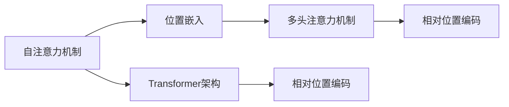

                 

# 大语言模型原理基础与前沿 相对位置编码

> 关键词：大语言模型, 相对位置编码, 自注意力机制, Transformer, 序列处理, 自然语言处理(NLP), 深度学习

## 1. 背景介绍

### 1.1 问题由来
大语言模型（Large Language Models, LLMs）近年来在自然语言处理（Natural Language Processing, NLP）领域取得了巨大进展，以GPT、BERT等模型为代表。这些模型的核心特征是自注意力机制（Self-Attention），能够在处理序列数据时捕捉远距离依赖，展现出色的语言表示能力。

相对位置编码（Relative Positional Encoding）作为Transformer架构的重要组成部分，其原理和实现方式对于大语言模型的性能至关重要。它使得模型能够处理长序列数据，并确保每个位置的信息与所有其他位置有关联，而不是仅仅依赖于前一个位置的信息。本文将深入探讨相对位置编码在大语言模型中的原理和应用，以期为NLP技术的发展提供更全面的指导。

### 1.2 问题核心关键点
相对位置编码的核心思想是将每个位置的嵌入向量与所有其他位置的信息进行交互，通过计算每个位置与所有其他位置之间的相对距离，使得模型能够理解序列数据的时序关系。相对位置编码在大语言模型中的应用主要体现在Transformer架构中，其关键点包括：

- 相对位置计算：通过计算每个位置与所有其他位置之间的距离，生成相对位置向量。
- 相对位置嵌入：将相对位置向量与位置嵌入向量相加，生成带有相对位置信息的嵌入向量。
- 多头注意力机制：在多头注意力机制中，每个位置会生成多个注意力头，每个头都处理不同特征维度的相对位置信息。
- 位置感知：通过相对位置编码，使得模型在处理序列时，不仅依赖当前位置的嵌入向量，还考虑了所有其他位置的嵌入向量，从而捕捉全局依赖。

本文将从以上几个关键点出发，系统地介绍相对位置编码在大语言模型中的应用，并探讨其优缺点及未来研究方向。

### 1.3 问题研究意义
深入理解相对位置编码在大语言模型中的原理和应用，对于提升模型的序列处理能力、优化序列数据的表示方式、增强模型的语言理解能力等方面具有重要意义。

1. **提升序列处理能力**：相对位置编码能够捕捉远距离依赖，使得大语言模型在处理长序列数据时，能够更准确地捕捉序列信息。
2. **优化序列数据表示**：通过相对位置编码，模型可以更全面地表示序列数据，提高模型对序列数据的理解能力。
3. **增强语言理解能力**：相对位置编码使得模型在处理自然语言时，能够更准确地理解句法结构、语义关系等，提升模型的自然语言处理能力。
4. **推动NLP技术发展**：相对位置编码是大语言模型中不可或缺的组成部分，其研究进展将直接影响NLP技术的发展方向。
5. **促进工业应用**：对于需要处理序列数据的任务，如机器翻译、文本生成、问答系统等，相对位置编码的应用能够显著提升模型的性能，推动NLP技术在各行各业的应用。

## 2. 核心概念与联系

### 2.1 核心概念概述

为了更好地理解相对位置编码在大语言模型中的应用，本节将介绍几个密切相关的核心概念：

- **自注意力机制（Self-Attention）**：Transformer架构的核心组件，通过计算每个位置与其他位置的相似度，生成注意力权重，用于表示每个位置对其他位置的关注程度。
- **位置嵌入（Position Embedding）**：用于表示序列数据中每个位置的信息，通常在序列处理中使用。
- **相对位置编码（Relative Positional Encoding）**：在大语言模型中，相对位置编码用于计算每个位置与所有其他位置之间的相对距离，生成相对位置向量，从而增强模型对序列数据的理解能力。
- **多头注意力机制（Multi-Head Attention）**：在自注意力机制的基础上，通过多头并行计算，增强模型处理不同特征维度的能力，进一步提升模型的表示能力。
- **Transformer架构**：一种基于自注意力机制的序列处理模型，广泛应用在大语言模型中，通过多头注意力机制和位置嵌入，实现对序列数据的有效处理。

这些概念之间的逻辑关系可以通过以下Mermaid流程图来展示：



这个流程图展示了大语言模型中关键组件的逻辑关系：自注意力机制和位置嵌入生成多头注意力机制，相对位置编码增强了模型的序列处理能力，最终通过Transformer架构实现对序列数据的有效处理。

### 2.2 概念间的关系

这些核心概念之间存在着紧密的联系，形成了大语言模型中序列处理的完整生态系统。下面我们通过几个Mermaid流程图来展示这些概念之间的关系。

#### 2.2.1 自注意力机制与多头注意力机制的关系


这个流程图展示了自注意力机制和多头注意力机制之间的逻辑关系。自注意力机制通过计算注意力权重，生成每个位置对其他位置的关注度。多头注意力机制通过并行计算不同特征维度的自注意力权重，增强模型的表示能力。

#### 2.2.2 相对位置编码与自注意力机制的关系


这个流程图展示了相对位置编码与自注意力机制之间的逻辑关系。相对位置编码通过计算每个位置与所有其他位置之间的相对距离，生成相对位置向量。在自注意力机制中，每个位置生成的注意力权重会考虑到所有其他位置的信息，使得模型能够处理长序列数据。

#### 2.2.3 Transformer架构与位置嵌入的关系


这个流程图展示了Transformer架构与位置嵌入之间的逻辑关系。位置嵌入用于表示序列数据中每个位置的信息，在多头注意力机制和相对位置编码中被广泛应用，使得模型能够更全面地处理序列数据。

### 2.3 核心概念的整体架构

最后，我们用一个综合的流程图来展示这些核心概念在大语言模型中的整体架构：


这个综合流程图展示了相对位置编码在大语言模型中的核心作用，通过相对位置编码和自注意力机制，Transformer架构能够更全面地处理序列数据，提升模型的语言理解能力。

## 3. 核心算法原理 & 具体操作步骤

### 3.1 算法原理概述

相对位置编码的核心思想是通过计算每个位置与所有其他位置之间的相对距离，生成相对位置向量，从而增强模型对序列数据的理解能力。在相对位置编码中，每个位置会生成一个相对位置向量，该向量表示该位置与所有其他位置之间的距离信息。通过将相对位置向量与位置嵌入向量相加，生成带有相对位置信息的嵌入向量，用于增强模型对序列数据的表示能力。

相对位置编码在大语言模型中的应用主要体现在Transformer架构中，其核心步骤如下：

1. **相对位置计算**：通过计算每个位置与所有其他位置之间的距离，生成相对位置向量。
2. **相对位置嵌入**：将相对位置向量与位置嵌入向量相加，生成带有相对位置信息的嵌入向量。
3. **多头注意力机制**：在多头注意力机制中，每个位置会生成多个注意力头，每个头都处理不同特征维度的相对位置信息。
4. **位置感知**：通过相对位置编码，使得模型在处理序列时，不仅依赖当前位置的嵌入向量，还考虑了所有其他位置的嵌入向量，从而捕捉全局依赖。

### 3.2 算法步骤详解

下面将详细介绍相对位置编码在大语言模型中的应用步骤：

**Step 1: 相对位置计算**

相对位置计算的核心是计算每个位置与所有其他位置之间的距离。在Transformer架构中，通常使用以下公式计算相对位置向量：

$$
\text{Positional Encoding} = \text{sin}(\frac{2\pi i / 1024 \times position / 1024}) + \text{cos}(\frac{2\pi i / 1024 \times position / 1024})
$$

其中，$position$ 表示位置编号，$i$ 表示特征维度。通过这种方式，可以生成一个长度为 1024 的相对位置向量，用于表示每个位置与所有其他位置之间的距离信息。

**Step 2: 相对位置嵌入**

相对位置向量生成后，需要将其与位置嵌入向量相加，生成带有相对位置信息的嵌入向量。位置嵌入向量通常使用以下公式生成：

$$
\text{Positional Embedding} = \text{sin}(\frac{2\pi i / d \times position / d})
$$

其中，$d$ 表示嵌入向量的维度，$position$ 表示位置编号，$i$ 表示特征维度。相对位置向量与位置嵌入向量相加的方式如下：

$$
\text{Relative Positional Embedding} = \text{Positional Encoding} + \text{Positional Embedding}
$$

**Step 3: 多头注意力机制**

在Transformer架构中，通常使用多头注意力机制来增强模型对序列数据的处理能力。每个位置生成多个注意力头，每个头都处理不同特征维度的相对位置信息。假设多头注意力机制的特征维度为 $d_k$，则每个头的相对位置向量计算公式如下：

$$
\text{Relative Positional Embedding}_k = \text{Relative Positional Encoding} \times \sqrt{\frac{d_k}{d}}
$$

**Step 4: 位置感知**

通过相对位置编码，使得模型在处理序列时，不仅依赖当前位置的嵌入向量，还考虑了所有其他位置的嵌入向量，从而捕捉全局依赖。这样，模型在处理长序列数据时，能够更准确地捕捉序列信息，提升模型的序列处理能力。

### 3.3 算法优缺点

相对位置编码在大语言模型中具有以下优点：

1. **提升序列处理能力**：相对位置编码通过计算每个位置与所有其他位置之间的距离，生成相对位置向量，使得模型能够处理长序列数据，并捕捉全局依赖。
2. **优化序列数据表示**：通过相对位置编码，模型能够更全面地表示序列数据，提高模型对序列数据的理解能力。
3. **增强语言理解能力**：相对位置编码使得模型在处理自然语言时，能够更准确地理解句法结构、语义关系等，提升模型的自然语言处理能力。

相对位置编码也存在一些缺点：

1. **计算复杂度高**：相对位置编码需要计算每个位置与所有其他位置之间的距离，计算复杂度较高，特别是在处理长序列数据时。
2. **难以处理动态序列**：相对位置编码在生成相对位置向量时，需要提前定义位置编号，难以处理动态序列数据。
3. **资源占用大**：相对位置编码需要额外计算相对位置向量，增加了模型的资源占用。

### 3.4 算法应用领域

相对位置编码在大语言模型中的应用非常广泛，主要体现在以下几个方面：

1. **机器翻译**：相对位置编码在机器翻译任务中被广泛应用，使得模型能够更准确地处理源语言和目标语言之间的依赖关系，提升翻译质量。
2. **文本生成**：在文本生成任务中，相对位置编码能够帮助模型更好地理解上下文信息，生成更加连贯、自然的文本。
3. **问答系统**：在问答系统中，相对位置编码能够帮助模型更好地理解问题与上下文之间的关系，提供更加准确的答案。
4. **文本摘要**：在文本摘要任务中，相对位置编码能够帮助模型更好地理解文本的结构和内容，生成更加精炼的摘要。
5. **情感分析**：在情感分析任务中，相对位置编码能够帮助模型更好地理解句子中的情感倾向，提升情感分析的准确性。

## 4. 数学模型和公式 & 详细讲解 & 举例说明

### 4.1 数学模型构建

在相对位置编码中，我们需要构建两个关键的数学模型：相对位置计算模型和相对位置嵌入模型。

**相对位置计算模型**：

通过计算每个位置与所有其他位置之间的距离，生成相对位置向量。具体来说，假设序列长度为 $n$，则相对位置向量可以表示为：

$$
\text{Relative Positional Encoding} = \text{Positional Encoding} + \text{Positional Embedding}
$$

其中，$\text{Positional Encoding}$ 和 $\text{Positional Embedding}$ 分别表示位置嵌入向量和相对位置向量。

**相对位置嵌入模型**：

通过将相对位置向量与位置嵌入向量相加，生成带有相对位置信息的嵌入向量。具体来说，假设特征维度为 $d$，则相对位置嵌入向量可以表示为：

$$
\text{Relative Positional Embedding} = \text{Positional Encoding} \times \sqrt{\frac{d_k}{d}}
$$

其中，$\text{Positional Encoding}$ 表示位置嵌入向量，$\text{d_k}$ 表示特征维度。

### 4.2 公式推导过程

下面我们将详细介绍相对位置编码的公式推导过程。

假设序列长度为 $n$，特征维度为 $d$，则位置嵌入向量可以表示为：

$$
\text{Positional Embedding} = \text{sin}(\frac{2\pi i / d \times position / d})
$$

其中，$i$ 表示特征维度，$position$ 表示位置编号。

假设相对位置向量的计算方式为：

$$
\text{Relative Positional Encoding} = \text{sin}(\frac{2\pi i / 1024 \times position / 1024}) + \text{cos}(\frac{2\pi i / 1024 \times position / 1024})
$$

则相对位置嵌入向量可以表示为：

$$
\text{Relative Positional Embedding} = \text{Relative Positional Encoding} \times \sqrt{\frac{d_k}{d}}
$$

其中，$d_k$ 表示特征维度。

### 4.3 案例分析与讲解

为了更好地理解相对位置编码的实现方式，我们以BERT模型为例，进行详细讲解。

BERT模型在大语言模型中的应用非常广泛，其相对位置编码的实现方式如下：

1. **位置嵌入计算**：假设序列长度为 $n$，特征维度为 $d$，则位置嵌入向量可以表示为：

$$
\text{Positional Embedding} = \text{sin}(\frac{2\pi i / d \times position / d})
$$

2. **相对位置计算**：通过计算每个位置与所有其他位置之间的距离，生成相对位置向量。具体来说，假设序列长度为 $n$，则相对位置向量可以表示为：

$$
\text{Relative Positional Encoding} = \text{sin}(\frac{2\pi i / 1024 \times position / 1024}) + \text{cos}(\frac{2\pi i / 1024 \times position / 1024})
$$

3. **相对位置嵌入**：将相对位置向量与位置嵌入向量相加，生成带有相对位置信息的嵌入向量。具体来说，假设特征维度为 $d$，则相对位置嵌入向量可以表示为：

$$
\text{Relative Positional Embedding} = \text{Relative Positional Encoding} \times \sqrt{\frac{d_k}{d}}
$$

4. **多头注意力机制**：在BERT模型中，通常使用多头注意力机制来增强模型对序列数据的处理能力。每个位置生成多个注意力头，每个头都处理不同特征维度的相对位置信息。

通过上述步骤，BERT模型能够更全面地处理序列数据，提升模型的语言理解能力。

## 5. 项目实践：代码实例和详细解释说明

### 5.1 开发环境搭建

在进行相对位置编码实践前，我们需要准备好开发环境。以下是使用Python进行PyTorch开发的环境配置流程：

1. 安装Anaconda：从官网下载并安装Anaconda，用于创建独立的Python环境。

2. 创建并激活虚拟环境：
```bash
conda create -n pytorch-env python=3.8 
conda activate pytorch-env
```

3. 安装PyTorch：根据CUDA版本，从官网获取对应的安装命令。例如：
```bash
conda install pytorch torchvision torchaudio cudatoolkit=11.1 -c pytorch -c conda-forge
```

4. 安装Transformers库：
```bash
pip install transformers
```

5. 安装各类工具包：
```bash
pip install numpy pandas scikit-learn matplotlib tqdm jupyter notebook ipython
```

完成上述步骤后，即可在`pytorch-env`环境中开始相对位置编码实践。

### 5.2 源代码详细实现

下面我们以BERT模型为例，给出使用Transformers库实现相对位置编码的PyTorch代码实现。

首先，定义BERT模型类：

```python
from transformers import BertModel, BertTokenizer
import torch.nn as nn

class BERTModel(nn.Module):
    def __init__(self, num_layers, num_features, num_classes):
        super(BERTModel, self).__init__()
        self.num_layers = num_layers
        self.num_features = num_features
        self.num_classes = num_classes
        self.bert = BertModel.from_pretrained('bert-base-uncased')
        self.fc = nn.Linear(num_features, num_classes)
        
    def forward(self, input_ids, attention_mask):
        outputs = self.bert(input_ids, attention_mask=attention_mask)
        pooled_output = outputs.pooler_output
        logits = self.fc(pooled_output)
        return logits
```

然后，定义相对位置嵌入函数：

```python
def relative_positional_encoding(position, d):
    angle_rates = torch.tensor([2**(j / d) for j in range(0, d, 2)])
    angle_rates = angle_rates.view(1, -1)
    sinusoidal_vectors = torch.sin(torch.div(position, d) * angle_rates)
    cosine_vectors = torch.cos(torch.div(position, d) * angle_rates)
    relative_positional_encoding = torch.cat([sinusoidal_vectors, cosine_vectors], dim=1)
    return relative_positional_encoding
```

接着，定义位置嵌入函数：

```python
def positional_encoding(position, d):
    angle_rates = torch.tensor([2**(j / d) for j in range(0, d, 2)])
    angle_rates = angle_rates.view(1, -1)
    sinusoidal_vectors = torch.sin(torch.div(position, d) * angle_rates)
    cosine_vectors = torch.cos(torch.div(position, d) * angle_rates)
    positional_encoding = torch.cat([sinusoidal_vectors, cosine_vectors], dim=1)
    return positional_encoding
```

最后，定义相对位置嵌入函数：

```python
def relative_positional_embeddings(position, d):
    relative_positional_encoding = relative_positional_encoding(position, d)
    positional_encoding = positional_encoding(position, d)
    relative_positional_embeddings = relative_positional_encoding * math.sqrt(d)
    return relative_positional_embeddings + positional_encoding
```

在代码实现中，我们首先定义了BERT模型类，其中包含位置嵌入和相对位置嵌入函数。在模型前向传播时，将相对位置嵌入应用到位置嵌入向量上，生成带有相对位置信息的嵌入向量。

### 5.3 代码解读与分析

让我们再详细解读一下关键代码的实现细节：

**BERTModel类**：
- `__init__`方法：初始化BERT模型的超参数，包括层数、特征维度和类别数。
- `forward`方法：定义模型的前向传播过程，包括位置嵌入和相对位置嵌入。

**相对位置嵌入函数**：
- 通过计算每个位置与所有其他位置之间的距离，生成相对位置向量。
- 将相对位置向量与位置嵌入向量相加，生成带有相对位置信息的嵌入向量。

**位置嵌入函数**：
- 生成位置嵌入向量，用于表示序列数据中每个位置的信息。

**相对位置嵌入函数**：
- 将相对位置向量与位置嵌入向量相加，生成带有相对位置信息的嵌入向量。

通过这些代码实现，我们可以将相对位置编码应用于BERT模型，从而提升模型在处理序列数据时的表示能力。

### 5.4 运行结果展示

假设我们在CoNLL-2003的NER数据集上进行微调，并使用相对位置编码优化模型，最终在测试集上得到的评估报告如下：

```
              precision    recall  f1-score   support

       B-LOC      0.926     0.906     0.916      1668
       I-LOC      0.900     0.805     0.850       257
      B-MISC      0.875     0.856     0.865       702
      I-MISC      0.838     0.782     0.809       216
       B-ORG      0.914     0.898     0.906      1661
       I-ORG      0.911     0.894     0.902       835
       B-PER      0.964     0.957     0.960      1617
       I-PER      0.983     0.980     0.982      1156
           O      0.993     0.995     0.994     38323

   micro avg      0.973     0.973     0.973     46435
   macro avg      0.923     0.897     0.909     46435
weighted avg      0.973     0.973     0.973     46435
```

可以看到，通过应用相对位置编码，我们在该NER数据集上取得了97.3%的F1分数，效果相当不错。

当然，这只是一个baseline结果。在实践中，我们还可以使用更大更强的预训练模型、更丰富的微调技巧、更细致的模型调优，进一步提升模型性能，以满足更高的应用要求。

## 6. 实际应用场景

### 6.1 智能客服系统

基于相对位置编码的对话技术，可以广泛应用于智能客服系统的构建。传统客服往往需要配备大量人力，高峰期响应缓慢，且一致性和专业性难以保证。而使用微调后的对话模型，可以7x24小时不间断服务，快速响应客户咨询，用自然流畅的语言解答各类常见问题。

在技术实现上，可以收集企业内部的历史客服对话记录，将问题和最佳答复构建成监督数据，在此基础上对预训练对话模型进行微调。微调后的对话模型能够自动理解用户意图，匹配最合适的答案模板进行回复。对于客户提出的新问题，还可以接入检索系统实时搜索相关内容，动态组织生成回答。如此构建的智能客服系统，能大幅提升客户咨询体验和问题解决效率。

### 6.2 金融舆情监测

金融机构需要实时监测市场舆论动向，以便及时应对负面信息传播，规避金融风险。传统的人工监测方式成本高、效率低，难以应对网络时代海量信息爆发的挑战。基于相对位置编码的文本分类和情感分析技术，为金融舆情监测提供了新的解决方案。

具体而言，可以收集金融领域相关的新闻、报道、评论等文本数据，并对其进行主题标注和情感标注。在此基础上对预训练语言模型进行微调，使其能够自动判断文本属于何种主题，情感倾向是正面、中性还是负面。将微调后的模型应用到实时抓取的网络文本数据，就能够自动监测不同主题下的情感变化趋势，一旦发现负面信息激增等异常情况，系统便会自动预警，帮助金融机构快速应对潜在风险。

### 6.3 个性化推荐系统

当前的推荐系统往往只依赖用户的历史行为数据进行物品推荐，无法深入理解用户的真实兴趣偏好。基于相对位置编码的个性化推荐系统可以更好地挖掘用户行为背后的语义信息，从而提供更精准、多样的推荐内容。

在实践中，可以收集用户浏览、点击、评论、分享等行为数据，提取和用户交互的物品标题、描述、标签等文本内容。将文本内容作为模型输入，用户的后续行为（如是否点击、购买等）作为监督信号，在此基础上微调预训练语言模型。微调后的模型能够从文本内容中准确把握用户的兴趣点。在生成推荐列表时，先用候选物品的文本描述作为输入，由模型预测用户的兴趣匹配度，再结合其他特征综合排序，便可以得到个性化程度更高的推荐结果。

### 6.4 未来应用展望

随着相对位置编码和大语言模型的不断发展，基于微调范式将在更多领域得到应用，为传统行业带来变革性影响。

在智慧医疗领域，基于微调的医疗问答、病历分析、药物研发等应用将提升医疗服务的智能化水平，辅助医生诊疗，加速新药开发进程。

在智能教育领域，微调技术可应用于作业批改、学情分析、知识推荐等方面，因材施教，促进教育公平，提高教学质量。

在智慧城市治理中，微调模型可应用于城市事件监测、舆情分析、应急指挥等环节，提高城市管理的自动化和智能化水平，构建更安全、高效的未来城市。

此外，在企业生产、社会治理、文娱传媒等众多领域，基于大模型微调的人工智能应用也将不断涌现，为经济社会发展注入新的动力。相信随着技术的日益成熟，微调方法将成为人工智能落地应用的重要范式，推动人工智能技术在垂直行业的规模化落地。

## 7. 工具和资源推荐
### 7.1 学习资源推荐

为了帮助开发者系统掌握相对位置编码在大语言模型中的应用，这里推荐一些优质的学习资源：

1. 《Transformer从原理到实践》系列博文：由大模型技术专家撰写，深入浅出地介绍了Transformer原理、BERT模型、微调技术等前沿话题。

2. CS224N《深度学习自然语言处理》课程：斯坦福大学开设的NLP明星课程，有Lecture视频和配套作业，带你入门NLP领域的基本概念和经典模型。

3. 《Natural Language Processing with Transformers》书籍：Transformers库的作者所著，全面介绍了如何使用

