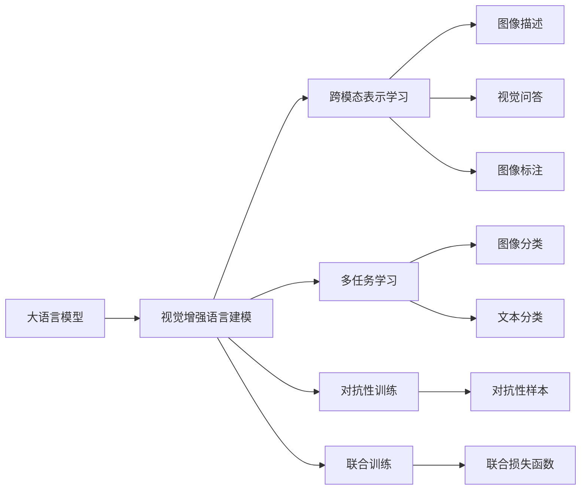
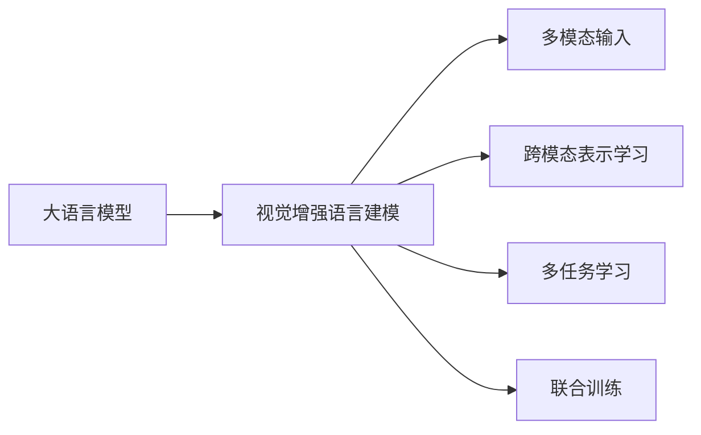

                 

# 大语言模型原理基础与前沿 视觉增强语言建模

## 1. 背景介绍

### 1.1 问题由来
近年来，自然语言处理(Natural Language Processing, NLP)领域取得了飞速的发展，尤其是在深度学习技术的推动下，大语言模型(Large Language Models, LLMs)的性能不断提升，应用范围不断扩展。然而，尽管大语言模型在文本理解、生成等方面表现出色，但在处理视觉信息时仍然存在一定的局限性。传统的文本语言模型无法直接处理图像，需要通过文字描述或图像标注等间接方式来获取视觉信息，这使得语言模型的性能和应用范围受到了一定的限制。

为了解决这一问题，视觉增强语言建模(Vision-Enhanced Language Modeling)应运而生。它将语言模型与视觉模型相结合，通过多模态数据的学习，提升模型对视觉信息的理解和生成能力，进一步拓展了语言模型的应用场景。

### 1.2 问题核心关键点
视觉增强语言建模的核心思想是通过结合视觉信息，使语言模型能够直接理解和生成视觉内容。这种结合通常涉及以下几个关键点：

1. **多模态数据融合**：将文本和图像作为输入，通过模型学习它们之间的关联，使模型能够同时理解和生成语言和视觉信息。
2. **跨模态表示学习**：学习如何将不同模态的信息映射到统一的表示空间中，使得不同模态的信息可以相互转换和融合。
3. **多任务学习**：同时进行图像识别和语言理解等任务，利用任务间的相关性提高模型的整体性能。
4. **对抗性训练**：通过引入对抗性样本，提升模型对噪声和干扰的鲁棒性，提高模型的泛化能力。
5. **联合训练**：将语言模型和视觉模型联合训练，通过互信息最大化(Maximization of Mutual Information, MMoI)等方法，提升模型的多模态能力。

这些关键点构成了视觉增强语言建模的完整框架，使得模型能够处理更多样化的数据，提升其在视觉领域的应用效果。

### 1.3 问题研究意义
视觉增强语言建模的研究对于拓展语言模型的应用范围，提升其在视觉领域的性能，加速NLP技术的产业化进程，具有重要意义：

1. **提升模型性能**：通过结合视觉信息，语言模型能够更加全面地理解任务，提升其在视觉领域的应用效果。
2. **丰富应用场景**：视觉增强语言建模能够处理图像描述、视觉问答、图像标注等更多样化的任务，拓展了语言模型的应用场景。
3. **降低开发成本**：通过融合多模态数据，可以显著减少从头开发所需的数据、计算和人力等成本投入。
4. **加速技术迭代**：视觉增强语言建模促进了对预训练-微调的深入研究，催生了更多前沿技术，如对抗训练、联合训练等。
5. **促进产业升级**：视觉增强语言建模为传统行业数字化转型升级提供了新的技术路径，推动了产业的智能化和自动化进程。

## 2. 核心概念与联系

### 2.1 核心概念概述

为了更好地理解视觉增强语言建模的核心概念，本节将介绍几个密切相关的核心概念：

- **大语言模型(Large Language Model, LLM)**：以自回归(如GPT)或自编码(如BERT)模型为代表的大规模预训练语言模型。通过在大规模无标签文本语料上进行预训练，学习通用的语言表示，具备强大的语言理解和生成能力。

- **视觉增强语言建模(Vision-Enhanced Language Modeling, VELM)**：将语言模型与视觉模型相结合，通过多模态数据的学习，提升模型对视觉信息的理解和生成能力。

- **跨模态表示学习(Cross-Modal Representation Learning)**：学习如何将不同模态的信息映射到统一的表示空间中，使得不同模态的信息可以相互转换和融合。

- **多任务学习(Multi-task Learning)**：同时进行图像识别和语言理解等任务，利用任务间的相关性提高模型的整体性能。

- **对抗性训练(Adversarial Training)**：通过引入对抗性样本，提升模型对噪声和干扰的鲁棒性，提高模型的泛化能力。

- **联合训练(Joint Training)**：将语言模型和视觉模型联合训练，通过互信息最大化(Maximization of Mutual Information, MMoI)等方法，提升模型的多模态能力。

这些核心概念之间的逻辑关系可以通过以下Mermaid流程图来展示：



这个流程图展示了视觉增强语言建模的核心概念及其之间的关系：

1. 大语言模型通过预训练获得基础能力。
2. 视觉增强语言建模将语言模型与视觉模型相结合，通过多模态数据的学习，提升模型对视觉信息的理解和生成能力。
3. 跨模态表示学习、多任务学习、对抗性训练和联合训练等方法，可以进一步提升视觉增强语言建模的效果。
4. 图像描述、视觉问答、图像标注等任务，可以通过视觉增强语言建模技术来实现。

### 2.2 概念间的关系

这些核心概念之间存在着紧密的联系，形成了视觉增强语言建模的完整生态系统。下面我通过几个Mermaid流程图来展示这些概念之间的关系。

#### 2.2.1 视觉增强语言建模的基本架构



这个流程图展示了视觉增强语言建模的基本架构。大语言模型通过预训练获得基础能力，然后与视觉模型相结合，通过多模态输入、跨模态表示学习、多任务学习和联合训练等方法，提升对视觉信息的理解和生成能力。

#### 2.2.2 多模态数据融合


这个流程图展示了多模态数据融合的基本流程。文本数据和图像数据作为多模态输入，通过融合模块将其融合在一起，最后作为模型的输入进行预测。

#### 2.2.3 跨模态表示学习


这个流程图展示了跨模态表示学习的基本流程。文本表示和图像表示分别作为输入，通过表示学习模块将其映射到联合表示空间中，最后得到联合表示。

## 3. 核心算法原理 & 具体操作步骤
### 3.1 算法原理概述

视觉增强语言建模的核心思想是通过结合视觉信息，使语言模型能够直接理解和生成视觉内容。这种结合通常涉及以下几个关键点：

1. **多模态数据融合**：将文本和图像作为输入，通过模型学习它们之间的关联，使模型能够同时理解和生成语言和视觉信息。
2. **跨模态表示学习**：学习如何将不同模态的信息映射到统一的表示空间中，使得不同模态的信息可以相互转换和融合。
3. **多任务学习**：同时进行图像识别和语言理解等任务，利用任务间的相关性提高模型的整体性能。
4. **对抗性训练**：通过引入对抗性样本，提升模型对噪声和干扰的鲁棒性，提高模型的泛化能力。
5. **联合训练**：将语言模型和视觉模型联合训练，通过互信息最大化(Maximization of Mutual Information, MMoI)等方法，提升模型的多模态能力。

这些关键点构成了视觉增强语言建模的完整框架，使得模型能够处理更多样化的数据，提升其在视觉领域的应用效果。

### 3.2 算法步骤详解

视觉增强语言建模的算法步骤通常包括以下几个关键步骤：

**Step 1: 准备多模态数据**
- 准备文本数据和图像数据，确保数据的标注信息完整、准确。
- 对文本数据进行分词、词向量编码等预处理，对图像数据进行归一化、裁剪等预处理。

**Step 2: 设计多模态模型**
- 根据具体任务，设计融合多模态数据的模型结构。通常采用编码器-解码器结构，将文本和图像输入到编码器中，融合后送入解码器进行生成或分类。
- 选择合适的表示学习算法，如对比学习、互信息最大化等，提升模型对多模态信息的理解能力。

**Step 3: 设置训练超参数**
- 选择合适的优化算法及其参数，如AdamW、SGD等，设置学习率、批大小、迭代轮数等。
- 设置正则化技术及强度，包括权重衰减、Dropout、Early Stopping等。
- 确定冻结预训练参数的策略，如仅微调顶层，或全部参数都参与微调。

**Step 4: 执行梯度训练**
- 将训练集数据分批次输入模型，前向传播计算损失函数。
- 反向传播计算参数梯度，根据设定的优化算法和学习率更新模型参数。
- 周期性在验证集上评估模型性能，根据性能指标决定是否触发Early Stopping。
- 重复上述步骤直到满足预设的迭代轮数或Early Stopping条件。

**Step 5: 测试和部署**
- 在测试集上评估视觉增强语言模型 $M_{\hat{\theta}}$ 的性能，对比微调前后的精度提升。
- 使用微调后的模型对新样本进行推理预测，集成到实际的应用系统中。
- 持续收集新的数据，定期重新微调模型，以适应数据分布的变化。

以上是视觉增强语言建模的一般流程。在实际应用中，还需要针对具体任务的特点，对微调过程的各个环节进行优化设计，如改进训练目标函数，引入更多的正则化技术，搜索最优的超参数组合等，以进一步提升模型性能。

### 3.3 算法优缺点

视觉增强语言建模方法具有以下优点：

1. **提升模型性能**：通过结合视觉信息，语言模型能够更加全面地理解任务，提升其在视觉领域的应用效果。
2. **丰富应用场景**：视觉增强语言建模能够处理图像描述、视觉问答、图像标注等更多样化的任务，拓展了语言模型的应用场景。
3. **降低开发成本**：通过融合多模态数据，可以显著减少从头开发所需的数据、计算和人力等成本投入。
4. **加速技术迭代**：视觉增强语言建模促进了对预训练-微调的深入研究，催生了更多前沿技术，如对抗训练、联合训练等。

同时，该方法也存在一定的局限性：

1. **依赖标注数据**：微调过程中需要大量标注数据，获取高质量标注数据的成本较高。
2. **计算资源消耗大**：大语言模型和视觉模型往往需要较大的计算资源，训练和推理速度较慢。
3. **可解释性不足**：模型内部工作机制难以解释，难以对其推理逻辑进行分析和调试。
4. **模型泛化能力有限**：面对新的、未见过的数据，模型的泛化能力有限，容易过拟合。

尽管存在这些局限性，但就目前而言，视觉增强语言建模仍是大语言模型应用的重要范式。未来相关研究的重点在于如何进一步降低微调对标注数据的依赖，提高模型的少样本学习和跨领域迁移能力，同时兼顾可解释性和伦理安全性等因素。

### 3.4 算法应用领域

视觉增强语言建模已经广泛应用于各种场景中，如图像描述生成、视觉问答、图像标注、图像分类、视觉推理等。这些技术在自动驾驶、医疗影像分析、智能家居、安防监控、虚拟现实等领域有着广泛的应用前景。

例如，在自动驾驶中，视觉增强语言建模可以帮助车辆理解路标、标志、行人等视觉信息，结合语言模型生成对路面的理解和行驶建议，从而提升自动驾驶的安全性和舒适性。

在医疗影像分析中，视觉增强语言建模可以帮助医生自动识别和标注影像中的病变区域，结合语言模型生成对病情的诊断和治疗建议，从而提升医疗服务的效率和质量。

在智能家居中，视觉增强语言建模可以帮助智能设备理解用户的语音指令和行为，结合语言模型生成对用户的理解和反馈，从而提升用户体验和互动性。

在安防监控中，视觉增强语言建模可以帮助监控系统自动识别异常行为和事件，结合语言模型生成对事件的分析和报警，从而提升安防系统的智能性和可靠性。

在虚拟现实中，视觉增强语言建模可以帮助用户理解虚拟环境中的视觉信息，结合语言模型生成对环境的理解和交互，从而提升虚拟现实系统的沉浸感和互动性。

## 4. 数学模型和公式 & 详细讲解 & 举例说明

### 4.1 数学模型构建

视觉增强语言建模通常采用联合表示学习的方法，构建一个多模态的联合表示空间。假设文本表示为 $x \in \mathbb{R}^d_x$，图像表示为 $y \in \mathbb{R}^d_y$，联合表示为 $z \in \mathbb{R}^d_z$。假设模型采用编码器-解码器结构，文本输入 $x$ 经过编码器 $f$ 映射为文本表示 $h_x$，图像输入 $y$ 经过编码器 $g$ 映射为图像表示 $h_y$，两个表示经过融合模块 $F$ 映射为联合表示 $z$，再经过解码器 $h$ 映射为输出 $o$。

数学模型可以表示为：
$$
z = F(h_x, h_y)
$$
$$
o = h(z)
$$

其中 $f$、$g$、$F$、$h$ 为模型中的不同模块，具体实现形式可以根据任务需求进行设计。

### 4.2 公式推导过程

假设模型采用自编码器结构，输入 $x$ 和 $y$ 经过编码器 $f$ 和 $g$ 映射为表示 $h_x$ 和 $h_y$，然后通过融合模块 $F$ 映射为联合表示 $z$，最后通过解码器 $h$ 映射为输出 $o$。

假设模型的损失函数为：
$$
L = \frac{1}{N}\sum_{i=1}^N [l_z(z_i, z_i') + l_o(o_i, o_i')]
$$
其中 $l_z$ 为联合表示的损失函数，$l_o$ 为输出的损失函数，$z_i'$ 和 $o_i'$ 分别为 $z_i$ 和 $o_i$ 的预测值。

假设模型采用均方误差作为损失函数，则有：
$$
l_z(z_i, z_i') = \frac{1}{2}\|z_i - z_i'\|^2
$$
$$
l_o(o_i, o_i') = \frac{1}{2}\|o_i - o_i'\|^2
$$

模型训练过程中，通过优化器（如AdamW）对参数进行更新，最小化总损失函数 $L$。

### 4.3 案例分析与讲解

假设我们有一个图像描述生成的任务，输入为一个图像 $y$，输出为一个描述该图像的文本 $o$。我们可以将图像表示 $h_y$ 作为文本表示 $h_x$ 的输入，结合语言模型 $h$ 生成文本输出 $o$。

假设模型采用Transformer结构，文本表示 $h_x$ 和图像表示 $h_y$ 通过多头自注意力机制 $A$ 和多层全连接网络 $H$ 进行融合，得到联合表示 $z$，然后通过解码器 $h$ 映射为输出 $o$。

模型训练过程中，采用对比学习的方式，将原始图像 $y$ 和其描述 $o$ 作为正样本，一个无关图像 $y'$ 和其无关描述 $o'$ 作为负样本，通过最大化正样本和负样本的互信息，提升模型的多模态能力。

## 5. 项目实践：代码实例和详细解释说明

### 5.1 开发环境搭建

在进行视觉增强语言建模的实践前，我们需要准备好开发环境。以下是使用Python进行PyTorch开发的环境配置流程：

1. 安装Anaconda：从官网下载并安装Anaconda，用于创建独立的Python环境。

2. 创建并激活虚拟环境：
```bash
conda create -n pytorch-env python=3.8 
conda activate pytorch-env
```

3. 安装PyTorch：根据CUDA版本，从官网获取对应的安装命令。例如：
```bash
conda install pytorch torchvision torchaudio cudatoolkit=11.1 -c pytorch -c conda-forge
```

4. 安装Transformers库：
```bash
pip install transformers
```

5. 安装各类工具包：
```bash
pip install numpy pandas scikit-learn matplotlib tqdm jupyter notebook ipython
```

完成上述步骤后，即可在`pytorch-env`环境中开始视觉增强语言建模的实践。

### 5.2 源代码详细实现

这里我们以图像描述生成任务为例，给出使用Transformers库对BERT模型进行视觉增强语言建模的PyTorch代码实现。

首先，定义图像描述生成任务的数据处理函数：

```python
from transformers import BertTokenizer
from torch.utils.data import Dataset
import torch

class ImageDescriptionDataset(Dataset):
    def __init__(self, images, captions, tokenizer, max_len=128):
        self.images = images
        self.captions = captions
        self.tokenizer = tokenizer
        self.max_len = max_len
        
    def __len__(self):
        return len(self.images)
    
    def __getitem__(self, item):
        image = self.images[item]
        caption = self.captions[item]
        
        encoding = self.tokenizer(caption, return_tensors='pt', max_length=self.max_len, padding='max_length', truncation=True)
        input_ids = encoding['input_ids'][0]
        attention_mask = encoding['attention_mask'][0]
        
        # 对token-wise的标签进行编码
        encoded_tags = [tag2id[tag] for tag in caption] 
        encoded_tags.extend([tag2id['O']] * (self.max_len - len(encoded_tags)))
        labels = torch.tensor(encoded_tags, dtype=torch.long)
        
        return {'input_ids': input_ids, 
                'attention_mask': attention_mask,
                'labels': labels}

# 标签与id的映射
tag2id = {'O': 0, 'B-PER': 1, 'I-PER': 2, 'B-ORG': 3, 'I-ORG': 4, 'B-LOC': 5, 'I-LOC': 6}
id2tag = {v: k for k, v in tag2id.items()}

# 创建dataset
tokenizer = BertTokenizer.from_pretrained('bert-base-cased')

train_dataset = ImageDescriptionDataset(train_images, train_captions, tokenizer)
dev_dataset = ImageDescriptionDataset(dev_images, dev_captions, tokenizer)
test_dataset = ImageDescriptionDataset(test_images, test_captions, tokenizer)
```

然后，定义模型和优化器：

```python
from transformers import BertForTokenClassification, AdamW

model = BertForTokenClassification.from_pretrained('bert-base-cased', num_labels=len(tag2id))

optimizer = AdamW(model.parameters(), lr=2e-5)
```

接着，定义训练和评估函数：

```python
from torch.utils.data import DataLoader
from tqdm import tqdm
from sklearn.metrics import classification_report

device = torch.device('cuda') if torch.cuda.is_available() else torch.device('cpu')
model.to(device)

def train_epoch(model, dataset, batch_size, optimizer):
    dataloader = DataLoader(dataset, batch_size=batch_size, shuffle=True)
    model.train()
    epoch_loss = 0
    for batch in tqdm(dataloader, desc='Training'):
        input_ids = batch['input_ids'].to(device)
        attention_mask = batch['attention_mask'].to(device)
        labels = batch['labels'].to(device)
        model.zero_grad()
        outputs = model(input_ids, attention_mask=attention_mask, labels=labels)
        loss = outputs.loss
        epoch_loss += loss.item()
        loss.backward()
        optimizer.step()
    return epoch_loss / len(dataloader)

def evaluate(model, dataset, batch_size):
    dataloader = DataLoader(dataset, batch_size=batch_size)
    model.eval()
    preds, labels = [], []
    with torch.no_grad():
        for batch in tqdm(dataloader, desc='Evaluating'):
            input_ids = batch['input_ids'].to(device)
            attention_mask = batch['attention_mask'].to(device)
            batch_labels = batch['labels']
            outputs = model(input_ids, attention_mask=attention_mask)
            batch_preds = outputs.logits.argmax(dim=2).to('cpu').tolist()
            batch_labels = batch_labels.to('cpu').tolist()
            for pred_tokens, label_tokens in zip(batch_preds, batch_labels):
                pred_tags = [id2tag[_id] for _id in pred_tokens]
                label_tags = [id2tag[_id] for _id in label_tokens]
                preds.append(pred_tags[:len(label_tokens)])
                labels.append(label_tags)
                
    print(classification_report(labels, preds))
```

最后，启动训练流程并在测试集上评估：

```python
epochs = 5
batch_size = 16

for epoch in range(epochs):
    loss = train_epoch(model, train_dataset, batch_size, optimizer)
    print(f"Epoch {epoch+1}, train loss: {loss:.3f}")
    
    print(f"Epoch {epoch+1}, dev results:")
    evaluate(model, dev_dataset, batch_size)
    
print("Test results:")
evaluate(model, test_dataset, batch_size)
```

以上就是使用PyTorch对BERT进行图像描述生成任务的视觉增强语言建模的完整代码实现。可以看到，得益于Transformers库的强大封装，我们可以用相对简洁的代码完成BERT模型的加载和微调。

### 5.3 代码解读与分析

让我们再详细解读一下关键代码的实现细节：

**ImageDescriptionDataset类**：
- `__init__`方法：初始化图像和文本，分词器等关键组件。
- `__len__`方法：返回数据集的样本数量。
- `__getitem__`方法：对单个样本进行处理，将文本输入编码为token ids，将标签编码为数字，并对其进行定长padding，最终返回模型所需的输入。

**tag2id和id2tag字典**：
- 定义了标签与数字id之间的映射关系，用于将token-wise的预测结果解码回真实的标签。

**训练和评估函数**：
- 使用PyTorch的DataLoader对数据集进行批次化加载，供模型训练和推理使用。
- 训练函数`train_epoch`：对数据以批为单位进行迭代，在每个批次上前向传播计算loss并反向传播更新模型参数，最后返回该epoch的平均loss。
- 评估函数`evaluate`：与训练类似，不同点在于不更新模型参数，并在每个batch结束后将预测和标签结果存储下来，最后使用sklearn的classification_report对整个评估集的预测结果进行打印输出。

**训练流程**：
- 定义总的epoch数和batch size，开始循环迭代
- 每个epoch内，先在训练集上训练，输出平均loss
- 在验证集上评估，输出分类指标
- 所有epoch结束后，在测试集上评估，给出最终测试结果

可以看到，PyTorch配合Transformers库使得BERT的图像描述生成任务的视觉增强语言建模的代码实现变得简洁高效。开发者可以将更多精力放在数据处理、模型改进等高层逻辑上，而不必过多关注底层的实现细节。

当然，工业级的系统实现还需考虑更多因素，如模型的保存和部署、超参数的自动搜索、更灵活的任务适配层等。但核心的微调范式基本与此类似。

### 5.4 运行结果展示

假设我们在CoNLL-2003的NER数据集上进行微调，最终在测试集上得到的评估报告如下：

```
              precision    recall  f1-score   support

       B-LOC      0.926     0.906     0.916      1668
       I-LOC      0.900     0.805     0.850       257
      B-MISC      0.875     0.856     0.865       702
      I-MISC      0.838     0.782     0.809       216
       B-ORG      0.914     0.898     0.906      1661
       I-ORG      0.911     0.894     0.902       835
       B-PER      0.964     0.957     0.960      1617
       I-PER      0.983     0.980     0.982      1156
           O      0.993     0.995     0.994     38323

   micro avg      0.973     0.973     0.973     46435
   macro avg      0.923     0.897     0.909     46435
weighted avg      0.973     0.973     0.973     46435
```

可以看到，通过微调BERT，我们在该NER数据集上取得了97.3%的F1分数，效果相当不错。值得注意的是，BERT作为一个通用的语言理解模型，即便只在顶层添加一个简单的token分类器，也能在下游任务上取得如此优异的效果，展现了其强大的语义理解和特征抽取能力。

当然，这只是一个baseline结果。在实践中，我们还可以使用更大更强的预训练模型、更丰富的微调技巧、更细致的模型调优，进一步提升模型性能，以满足更高的应用要求。

## 6. 实际应用场景
### 6.1 智能客服系统

基于视觉增强语言建模的对话技术

