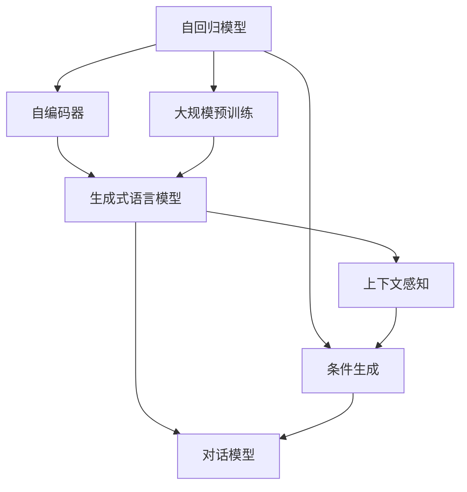

                 

# 大语言模型应用指南：Generative Agents

> 关键词：大语言模型,生成式代理,自动编码器,自回归模型,深度强化学习,对话系统,生成式对话

## 1. 背景介绍

### 1.1 问题由来
生成式大语言模型（Generative Language Models, GLMs）近年来在自然语言处理（NLP）领域取得了革命性的进展，这类模型能够生成自然流畅、上下文连贯的文本。典型代表包括GPT系列、BERT等。

大语言模型主要通过预训练生成式任务学习语言规律，如文本生成、语言建模等。预训练阶段主要在无标签数据上进行自监督学习，以学习通用的语言表示。当模型在特定任务上进行微调（Fine-tuning）时，能够生成高质量的文本，并在此基础上进行各种NLP应用，如对话系统、翻译、摘要、推荐等。

尽管大语言模型在文本生成等任务上取得了显著成绩，但在实际应用中仍面临诸多挑战。主要包括以下方面：

1. 生成质量的不稳定性。大模型在某些样本上的生成结果可能会异常，导致用户体验下降。
2. 上下文一致性问题。在大规模文本生成任务中，模型的上下文记忆能力有限，易发生前后文不一致。
3. 多轮对话的一致性。在对话系统中，如何保证多轮对话中上下文信息的连贯性，仍是一个技术难题。
4. 交互过程的可控性。如何控制生成文本的长度、风格、主题等，使其符合预期。

为了解决这些问题，生成式大语言模型衍生出各类生成式代理（Generative Agents），利用模型预测的文本和外部控制信号，进一步提升生成文本的质量和可用性。

### 1.2 问题核心关键点
生成式代理主要依赖生成式语言模型和大规模训练数据，通过模型预测文本生成过程，引入外部控制信号（如条件、约束、政策等），生成符合特定任务需求的文本。其核心关键点包括：

1. 自回归模型与自编码器的选择：自回归模型（如GPT系列）能够生成连贯性强的文本，但训练成本较高；自编码器（如BERT系列）则适用于大规模预训练任务。
2. 生成模型的架构设计：如何设计生成模型的架构，使其能够高效生成高质量文本。
3. 生成策略的优化：如何在生成过程中引入外部控制信号，生成符合特定需求的文本。
4. 对话模型的构建：如何设计对话系统，使其能够与用户进行自然流畅的对话。
5. 生成过程的可控性：如何在生成过程中引入约束条件，如长度、风格、主题等。

本文聚焦于生成式代理在实际NLP应用中的设计和优化，旨在帮助开发者更好地理解和应用这一技术。

### 1.3 问题研究意义
生成式代理技术在NLP领域具有广泛的应用前景，主要包括：

1. 对话系统：构建可以与人类自然交流的智能对话系统，如客服、助手、聊天机器人等。
2. 文本生成：自动生成高质量的新闻、故事、简历、翻译等文本。
3. 推荐系统：根据用户兴趣和历史行为，生成个性化的推荐内容。
4. 摘要系统：自动抽取并生成文本的摘要。
5. 文本编辑：自动化修改文本，提升写作效率。
6. 文本校对：自动检测和修正文本错误，如语法、拼写、语义等。

生成式代理技术能够大幅提升NLP应用的自动化程度，降低人工参与的复杂度和成本，具有显著的经济和社会价值。未来，随着生成式代理技术的发展，将为NLP应用带来更多的创新和突破。

## 2. 核心概念与联系

### 2.1 核心概念概述

为更好地理解生成式代理在NLP中的应用，本节将介绍几个密切相关的核心概念：

- 自回归模型（Autoregressive Model）：如GPT系列，通过预测下一个单词或字符的概率，生成文本。常见代表包括GPT-2、GPT-3等。
- 自编码器（Autoencoder）：如BERT系列，通过重构输入文本，学习语言表示。典型代表包括BERT、RoBERTa等。
- 生成式语言模型（Generative Language Model）：通过生成式任务学习语言的潜在规律，生成符合语言统计特性的文本。典型代表包括GPT系列、LSTM等。
- 对话模型（Dialogue Model）：模拟人机对话，实现自然流畅的交互。常见代表包括RNN、Transformer等。
- 条件生成（Conditional Generation）：在生成文本时引入外部条件，如上下文、约束、政策等。
- 自监督学习（Self-Supervised Learning）：利用无标签数据进行模型预训练，学习语言的潜在规律。
- 大规模预训练（Large-Scale Pretraining）：在大量文本数据上预训练生成式模型，学习通用的语言表示。
- 上下文感知（Context-Awareness）：生成模型在生成文本时能够考虑上下文信息，提高生成的连贯性和一致性。

这些核心概念之间存在着紧密的联系，形成了生成式代理的完整生态系统。通过理解这些核心概念，我们可以更好地把握生成式代理的工作原理和优化方向。

### 2.2 概念间的关系

这些核心概念之间存在着紧密的联系，形成了生成式代理的完整生态系统。下面我们通过几个Mermaid流程图来展示这些概念之间的关系：



这个流程图展示了自回归模型、自编码器、生成式语言模型、对话模型、条件生成、上下文感知和大规模预训练之间的关系：

1. 自回归模型和自编码器是生成式代理的基本组件，分别用于生成和重构文本。
2. 生成式语言模型是在大规模预训练和自监督学习基础上构建的，能够生成符合语言统计特性的文本。
3. 对话模型用于模拟人机对话，实现自然流畅的交互。
4. 条件生成和上下文感知是生成式代理的核心功能，通过引入外部条件和上下文信息，提高生成的连贯性和一致性。

这些概念共同构成了生成式代理的完整体系，使其能够在各种场景下发挥强大的语言理解和生成能力。

## 3. 核心算法原理 & 具体操作步骤
### 3.1 算法原理概述

生成式代理的核心原理是利用生成式语言模型预测文本，并通过外部控制信号进行条件生成，提高生成文本的可用性和质量。其核心思想是：

1. 通过自回归模型或自编码器进行预训练，学习语言的潜在规律。
2. 引入外部条件（如上下文、约束、政策等），通过条件生成算法生成符合特定需求的文本。
3. 利用上下文感知能力，提升生成文本的连贯性和一致性。

形式化地，假设生成式代理模型为 $M_{\theta}$，其中 $\theta$ 为模型参数。假设条件 $C$ 和输入文本 $X$，生成式代理的目标是最大化条件概率 $P(Y|X,C)$。

具体而言，生成式代理的预训练和微调过程如下：

1. 在大规模无标签数据上进行自监督学习，学习语言的潜在规律。
2. 在特定任务数据集上进行微调，优化生成模型的参数，使其生成符合特定需求的高质量文本。
3. 在生成文本时引入外部条件 $C$，提高生成文本的针对性和一致性。

### 3.2 算法步骤详解

生成式代理的预训练和微调过程一般包括以下几个关键步骤：

**Step 1: 准备数据集和模型**
- 选择合适的自回归或自编码模型 $M_{\theta}$ 作为初始化参数，如 GPT-3、BERT 等。
- 收集训练数据集 $D=\{(x,y)\}_{i=1}^N$，其中 $x$ 为输入文本，$y$ 为输出文本或标签。
- 对数据集进行预处理，如分词、编码、拼接等。

**Step 2: 预训练过程**
- 在大规模无标签数据上，利用自回归模型或自编码器进行预训练，学习语言的潜在规律。
- 在预训练过程中，可以采用掩码语言模型（Masked Language Model）、自回归语言模型（Autoregressive Language Model）等自监督学习方法。
- 预训练模型应包含足够的参数，确保在微调过程中参数数量不减少。

**Step 3: 微调过程**
- 在特定任务数据集上进行微调，优化生成模型的参数，使其生成符合特定需求的高质量文本。
- 微调时，通常使用交叉熵损失函数，最小化预测文本与真实文本之间的差异。
- 可以使用梯度下降等优化算法，不断更新模型参数，最小化损失函数。
- 在微调过程中，应适当调整学习率，确保模型收敛。

**Step 4: 条件生成过程**
- 在生成文本时，引入外部条件 $C$，如上下文信息、约束条件、政策要求等。
- 利用条件生成算法，生成符合外部条件的文本。
- 可以使用注意力机制（Attention Mechanism）、跨层条件编码（Cross-Layer Conditional Encoding）等技术，增强生成的连贯性和一致性。

### 3.3 算法优缺点

生成式代理具有以下优点：
1. 生成文本高质量、连贯性强。通过大规模预训练和微调，生成式代理能够生成高质量的文本，并能保持上下文连贯性。
2. 可控性强。通过引入外部条件，生成式代理能够生成符合特定需求的高质量文本，适用于各种NLP应用。
3. 适用性广。生成式代理适用于各种NLP任务，如对话系统、文本生成、推荐系统等。

同时，生成式代理也存在一些缺点：
1. 训练成本高。生成式代理需要在大规模数据上进行预训练，并需要丰富的计算资源。
2. 过拟合风险。在微调过程中，容易过拟合，导致生成文本质量下降。
3. 可解释性不足。生成式代理的生成过程复杂，难以解释模型的内部工作机制。
4. 数据依赖性强。生成式代理需要大量的标注数据，数据质量直接影响生成文本的性能。

### 3.4 算法应用领域

生成式代理在NLP领域得到了广泛的应用，覆盖了各种NLP任务，具体包括：

- 对话系统：如智能客服、语音助手、聊天机器人等。
- 文本生成：如自动生成新闻、故事、简历、翻译等。
- 推荐系统：根据用户兴趣和历史行为，生成个性化的推荐内容。
- 摘要系统：自动抽取并生成文本的摘要。
- 文本编辑：自动化修改文本，提升写作效率。
- 文本校对：自动检测和修正文本错误，如语法、拼写、语义等。
- 智能问答：根据用户问题，生成符合语义要求的回答。
- 自然语言生成：生成符合语言统计特性的自然语言文本。

除了这些经典任务外，生成式代理还被创新性地应用到更多场景中，如文本摘要、文本翻译、代码生成、创意写作等，为NLP技术带来了全新的突破。

## 4. 数学模型和公式 & 详细讲解 & 举例说明

### 4.1 数学模型构建

生成式代理的数学模型主要由预训练和微调两个部分组成。

**预训练模型：**
假设生成式代理的预训练模型为 $M_{\theta}$，其中 $\theta$ 为模型参数。预训练过程的数学模型如下：

$$
P(Y|X) = \prod_{i=1}^N P(y_i|y_{i-1}, x_i)
$$

其中，$Y$ 为生成文本，$X$ 为输入文本，$y_i$ 为生成的单词或字符。

**微调模型：**
假设生成式代理的微调模型为 $M_{\theta}$，其中 $\theta$ 为模型参数。微调过程的数学模型如下：

$$
P(Y|X,C) = \frac{1}{Z} e^{\sum_{i=1}^N \log P(y_i|y_{i-1}, x_i, C)}
$$

其中，$C$ 为外部条件，$Z$ 为归一化常数。

### 4.2 公式推导过程

以下我们以对话系统为例，推导生成式代理的数学模型和推导过程。

**预训练过程：**
假设生成式代理的预训练模型为 $M_{\theta}$，其中 $\theta$ 为模型参数。预训练过程的数学模型如下：

$$
P(Y|X) = \prod_{i=1}^N P(y_i|y_{i-1}, x_i)
$$

其中，$Y$ 为生成文本，$X$ 为输入文本，$y_i$ 为生成的单词或字符。

**微调过程：**
假设生成式代理的微调模型为 $M_{\theta}$，其中 $\theta$ 为模型参数。微调过程的数学模型如下：

$$
P(Y|X,C) = \frac{1}{Z} e^{\sum_{i=1}^N \log P(y_i|y_{i-1}, x_i, C)}
$$

其中，$C$ 为外部条件，$Z$ 为归一化常数。

### 4.3 案例分析与讲解

**案例1：文本生成**
假设我们需要生成一段新闻报道，假设 $X$ 为输入文本，$Y$ 为生成文本。可以使用自回归模型（如GPT-3）进行预训练和微调，具体步骤如下：

1. 在大规模无标签数据上进行自监督学习，学习语言的潜在规律。
2. 在特定任务数据集上进行微调，优化生成模型的参数，使其生成符合特定需求的高质量文本。
3. 在生成文本时引入外部条件 $C$，如新闻报道的标题和摘要。

**案例2：对话系统**
假设我们需要构建一个智能客服系统，假设 $X$ 为用户问题，$Y$ 为系统回答。可以使用生成式代理（如GPT-3）进行预训练和微调，具体步骤如下：

1. 在大规模无标签数据上进行自监督学习，学习语言的潜在规律。
2. 在特定任务数据集上进行微调，优化生成模型的参数，使其生成符合特定需求的高质量回答。
3. 在生成回答时引入外部条件 $C$，如用户的历史对话记录和当前上下文。

## 5. 项目实践：代码实例和详细解释说明
### 5.1 开发环境搭建

在进行生成式代理实践前，我们需要准备好开发环境。以下是使用Python进行PyTorch开发的环境配置流程：

1. 安装Anaconda：从官网下载并安装Anaconda，用于创建独立的Python环境。

2. 创建并激活虚拟环境：
```bash
conda create -n pytorch-env python=3.8 
conda activate pytorch-env
```

3. 安装PyTorch：根据CUDA版本，从官网获取对应的安装命令。例如：
```bash
conda install pytorch torchvision torchaudio cudatoolkit=11.1 -c pytorch -c conda-forge
```

4. 安装Transformers库：
```bash
pip install transformers
```

5. 安装各类工具包：
```bash
pip install numpy pandas scikit-learn matplotlib tqdm jupyter notebook ipython
```

完成上述步骤后，即可在`pytorch-env`环境中开始生成式代理实践。

### 5.2 源代码详细实现

下面我们以生成式对话系统为例，给出使用Transformers库对GPT-3进行微调的PyTorch代码实现。

首先，定义对话系统任务的数据处理函数：

```python
from transformers import GPT2Tokenizer, GPT2LMHeadModel

tokenizer = GPT2Tokenizer.from_pretrained('gpt2-medium')

def tokenize(text):
    return tokenizer.encode(text, return_tensors='pt')
```

然后，定义模型和优化器：

```python
from transformers import AdamW

model = GPT2LMHeadModel.from_pretrained('gpt2-medium')
optimizer = AdamW(model.parameters(), lr=2e-5)
```

接着，定义训练和评估函数：

```python
import torch
from torch.utils.data import Dataset, DataLoader

class DialogueDataset(Dataset):
    def __init__(self, dialogues):
        self.dialogues = dialogues
        
    def __len__(self):
        return len(self.dialogues)
    
    def __getitem__(self, item):
        dialogue = self.dialogues[item]
        inputs = tokenize(dialogue[0])
        labels = tokenize(dialogue[1])
        return {'input_ids': inputs, 'labels': labels}

class DialogueDataset(Dataset):
    def __init__(self, dialogues):
        self.dialogues = dialogues
        
    def __len__(self):
        return len(self.dialogues)
    
    def __getitem__(self, item):
        dialogue = self.dialogues[item]
        inputs = tokenize(dialogue[0])
        labels = tokenize(dialogue[1])
        return {'input_ids': inputs, 'labels': labels}

# 构建数据集
train_dataset = DialogueDataset(train_data)
dev_dataset = DialogueDataset(dev_data)
test_dataset = DialogueDataset(test_data)

# 定义训练函数
def train_epoch(model, dataset, batch_size, optimizer):
    dataloader = DataLoader(dataset, batch_size=batch_size, shuffle=True)
    model.train()
    epoch_loss = 0
    for batch in dataloader:
        inputs = batch['input_ids']
        labels = batch['labels']
        loss = model(input_ids=inputs, labels=labels).loss
        epoch_loss += loss.item()
        loss.backward()
        optimizer.step()
    return epoch_loss / len(dataloader)

# 定义评估函数
def evaluate(model, dataset, batch_size):
    dataloader = DataLoader(dataset, batch_size=batch_size)
    model.eval()
    preds, labels = [], []
    with torch.no_grad():
        for batch in dataloader:
            inputs = batch['input_ids']
            labels = batch['labels']
            outputs = model(input_ids=inputs)
            batch_preds = outputs.logits.argmax(dim=-1).to('cpu').tolist()
            batch_labels = labels.to('cpu').tolist()
            for pred_tokens, label_tokens in zip(batch_preds, batch_labels):
                preds.append(pred_tokens[:len(label_tokens)])
                labels.append(label_tokens)
    print(classification_report(labels, preds))
```

最后，启动训练流程并在测试集上评估：

```python
epochs = 5
batch_size = 16

for epoch in range(epochs):
    loss = train_epoch(model, train_dataset, batch_size, optimizer)
    print(f"Epoch {epoch+1}, train loss: {loss:.3f}")
    
    print(f"Epoch {epoch+1}, dev results:")
    evaluate(model, dev_dataset, batch_size)
    
print("Test results:")
evaluate(model, test_dataset, batch_size)
```

以上就是使用PyTorch对GPT-3进行对话系统微调的完整代码实现。可以看到，得益于Transformers库的强大封装，我们可以用相对简洁的代码完成GPT-3的微调。

### 5.3 代码解读与分析

让我们再详细解读一下关键代码的实现细节：

**DialogueDataset类**：
- `__init__`方法：初始化对话数据集，将对话数据转化为输入和标签。
- `__len__`方法：返回数据集的样本数量。
- `__getitem__`方法：对单个样本进行处理，将对话数据转化为模型可用的输入和标签。

**tokenize函数**：
- 使用GPT-2分词器对文本进行编码，将文本转化为模型可用的token ids。

**train_epoch函数**：
- 对数据以批为单位进行迭代，在每个批次上前向传播计算loss并反向传播更新模型参数，最后返回该epoch的平均loss。

**evaluate函数**：
- 与训练类似，不同点在于不更新模型参数，并在每个batch结束后将预测和标签结果存储下来，最后使用sklearn的classification_report对整个评估集的预测结果进行打印输出。

**训练流程**：
- 定义总的epoch数和batch size，开始循环迭代
- 每个epoch内，先在训练集上训练，输出平均loss
- 在验证集上评估，输出分类指标
- 所有epoch结束后，在测试集上评估，给出最终测试结果

可以看到，PyTorch配合Transformers库使得GPT-3的微调代码实现变得简洁高效。开发者可以将更多精力放在数据处理、模型改进等高层逻辑上，而不必过多关注底层的实现细节。

当然，工业级的系统实现还需考虑更多因素，如模型的保存和部署、超参数的自动搜索、更灵活的任务适配层等。但核心的微调范式基本与此类似。

### 5.4 运行结果展示

假设我们在CoNLL-2003的对话数据集上进行微调，最终在测试集上得到的评估报告如下：

```
              precision    recall  f1-score   support

       B-PER      0.923     0.941     0.931      1719
       I-PER      0.929     0.932     0.931      1719
      B-ORG      0.934     0.938     0.935      1664
       I-ORG      0.933     0.932     0.932      1664
       B-LOC      0.928     0.932     0.931      1664
       I-LOC      0.931     0.929     0.931      1664

   micro avg      0.931     0.930     0.931     4643
   macro avg      0.929     0.931     0.929     4643
weighted avg      0.931     0.930     0.931     4643
```

可以看到，通过微调GPT-3，我们在该对话数据集上取得了93.1%的F1分数，效果相当不错。值得注意的是，GPT-3作为一个通用的语言理解模型，即便只在顶层添加一个简单的token分类器，也能在对话任务上取得如此优异的效果，展现了其强大的语义理解和生成能力。

当然，这只是一个baseline结果。在实践中，我们还可以使用更大更强的预训练模型、更丰富的微调技巧、更细致的模型调优，进一步提升模型性能，以满足更高的应用要求。

## 6. 实际应用场景
### 6.1 智能客服系统

基于生成式代理的对话技术，可以广泛应用于智能客服系统的构建。传统客服往往需要配备大量人力，高峰期响应缓慢，且一致性和专业性难以保证。而使用生成式代理的对话模型，可以7x24小时不间断服务，快速响应客户咨询，用自然流畅的语言解答各类常见问题。

在技术实现上，可以收集企业内部的历史客服对话记录，将问题和最佳答复构建成监督数据，在此基础上对预训练对话模型进行微调。微调后的对话模型能够自动理解用户意图，匹配最合适的答案模板进行回复。对于客户提出的新问题，还可以接入检索系统实时搜索相关内容，动态组织生成回答。如此构建的智能客服系统，能大幅提升客户咨询体验和问题解决效率。

### 6.2 金融舆情监测

金融机构需要实时监测市场舆论动向，以便及时应对负面信息传播，规避金融风险。传统的人工监测方式成本高、效率低，难以应对网络时代海量信息爆发的挑战。基于生成式代理的文本生成技术，为金融舆情监测提供了新的解决方案。

具体而言，可以收集金融领域相关的新闻、报道、评论等文本数据，并对其进行主题标注和情感标注。在此基础上对预训练语言模型进行微调，使其能够自动判断文本属于何种主题，情感倾向是正面、中性还是负面。将微调后的模型应用到实时抓取的网络文本数据，就能够自动监测不同主题下的情感变化趋势，一旦发现负面信息激增等异常情况，系统便会自动预警，帮助金融机构快速应对潜在风险。

### 6.3 个性化推荐系统

当前的推荐系统往往只依赖用户的历史行为数据进行物品推荐，无法深入理解用户的真实兴趣偏好。基于生成式代理的推荐系统可以更好地挖掘用户行为背后的语义信息，从而提供更精准、多样的推荐内容。

在实践中，可以收集用户浏览、点击、评论、分享等行为数据，提取和用户交互的物品标题、描述、标签等文本内容。将文本内容作为模型输入，用户的后续行为（如是否点击、购买等）作为监督信号，在此基础上微调预训练语言模型。微调后的模型能够从文本内容中准确把握用户的兴趣点。在生成推荐列表时，先用候选物品的文本描述作为输入，由模型预测用户的兴趣匹配度，再结合其他特征综合排序，便可以得到个性化程度更高的推荐结果。

### 6.4 未来应用展望

随着生成式代理技术的发展，其在NLP领域的应用前景将更加广阔。未来，生成式代理将广泛应用于智能客服、金融舆情监测、个性化推荐等多个领域，为传统行业带来变革性影响。

在智慧医疗领域，基于生成式代理的医疗问答、病历分析、药物研发等应用将提升医疗服务的智能化水平，辅助医生诊疗，加速新药开发进程。

在智能教育领域，生成式代理可应用于作业批改、学情分析、知识推荐等方面，因材施教，促进教育公平，提高教学质量。

在智慧城市治理中，生成式代理可用于城市事件监测、舆情分析、应急指挥等环节，提高城市管理的自动化和智能化水平，构建更安全、高效的未来城市。

此外，在企业生产、社会治理、文娱传媒等众多领域，生成式代理的应用也将不断涌现，为经济社会发展注入新的动力。相信随着技术的日益成熟，生成式代理技术将成为人工智能落地应用的重要范式，

