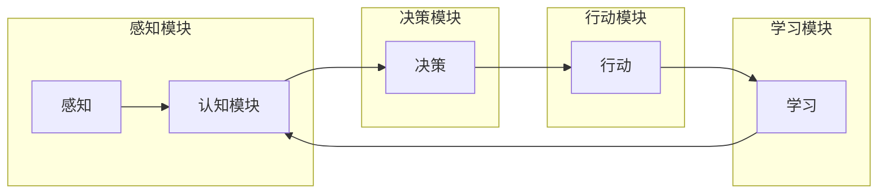

# AI Agent: AI的下一个风口 斯坦福小镇项目：生成式智能体的典型案例

> 关键词：AI Agent, 生成式智能体, 斯坦福小镇项目, 强化学习, 深度学习, 机器人, 人机交互

## 1. 背景介绍

随着人工智能技术的飞速发展，AI Agent作为一种新型的智能体，正逐渐成为AI领域的下一个风口。AI Agent能够模拟人类智能，自主感知环境、决策行动，并不断学习和优化自身行为。斯坦福小镇项目作为生成式智能体的典型案例，展示了AI Agent在现实场景中的应用潜力。

### 1.1 问题的由来

传统的AI系统往往局限于特定任务，难以适应复杂多变的真实世界。而AI Agent作为一种更加智能、灵活的实体，能够更好地模拟人类智能，解决现实世界中的复杂问题。斯坦福小镇项目正是为了探索AI Agent在现实场景中的应用，推动AI技术的发展。

### 1.2 研究现状

目前，AI Agent的研究主要集中在以下几个方向：

1. **感知与认知**：研究AI Agent如何感知环境信息，并进行有效的认知处理。
2. **决策与规划**：研究AI Agent如何根据感知到的信息，做出合理的决策和规划。
3. **学习与适应**：研究AI Agent如何从环境中学习，并不断适应新的环境变化。
4. **人机交互**：研究AI Agent如何与人类进行有效交互，提高用户体验。

斯坦福小镇项目正是基于这些研究方向，构建了一个具有高度自主性和适应性的AI Agent。

### 1.3 研究意义

斯坦福小镇项目的研究意义在于：

1. 探索AI Agent在现实场景中的应用，推动AI技术的发展。
2. 提高AI Agent的自主性和适应性，使其更好地服务于人类。
3. 促进人机交互技术的进步，提升用户体验。

### 1.4 本文结构

本文将围绕斯坦福小镇项目，对AI Agent的原理、技术、应用等方面进行深入探讨。具体内容如下：

- 第2部分，介绍AI Agent的核心概念与联系。
- 第3部分，阐述AI Agent的核心算法原理及具体操作步骤。
- 第4部分，讲解AI Agent的数学模型和公式，并结合实例进行分析。
- 第5部分，展示斯坦福小镇项目的代码实例，并进行详细解释。
- 第6部分，探讨AI Agent的实际应用场景和未来发展趋势。
- 第7部分，推荐AI Agent相关的学习资源、开发工具和参考文献。
- 第8部分，总结研究成果，展望未来发展趋势与挑战。
- 第9部分，列出常见问题与解答。

## 2. 核心概念与联系

### 2.1 AI Agent核心概念

AI Agent是指能够模拟人类智能，自主感知环境、决策行动，并不断学习和适应的实体。其核心概念包括：

- **感知**：AI Agent通过传感器获取环境信息。
- **认知**：AI Agent对感知到的信息进行处理，形成对环境的理解。
- **决策**：AI Agent根据认知结果，选择合适的行动策略。
- **行动**：AI Agent执行决策，与环境交互。
- **学习**：AI Agent通过行动和反馈，不断优化自身行为。

### 2.2 AI Agent架构

AI Agent的架构通常包括以下几个部分：

- **感知模块**：负责收集环境信息。
- **认知模块**：对感知信息进行处理，形成认知结果。
- **决策模块**：根据认知结果，选择合适的行动策略。
- **行动模块**：执行决策，与环境交互。
- **学习模块**：根据行动和反馈，不断优化自身行为。

以下是用Mermaid流程图表示的AI Agent架构：



## 3. 核心算法原理 & 具体操作步骤

### 3.1 算法原理概述

AI Agent的核心算法主要涉及以下几个领域：

- **深度学习**：用于感知模块和认知模块，提取和表示环境信息。
- **强化学习**：用于决策模块，使AI Agent能够学习并优化自身行为。
- **人机交互**：用于行动模块，使AI Agent能够与人类进行有效交互。

### 3.2 算法步骤详解

AI Agent的算法步骤如下：

1. **感知**：AI Agent通过传感器收集环境信息，如图像、声音、温度等。
2. **认知**：使用深度学习技术，对感知信息进行处理，提取特征，形成对环境的理解。
3. **决策**：使用强化学习技术，根据认知结果，选择合适的行动策略。
4. **行动**：执行决策，与环境交互，完成特定任务。
5. **学习**：根据行动结果和反馈，优化决策策略，提升AI Agent的性能。

### 3.3 算法优缺点

**优点**：

- **自主性强**：AI Agent能够自主感知、决策和行动，无需人工干预。
- **适应性高**：AI Agent能够通过学习不断适应环境变化。
- **可扩展性强**：AI Agent可以应用于各种场景，具有广泛的应用前景。

**缺点**：

- **开发难度高**：AI Agent的开发需要跨领域知识，难度较大。
- **计算复杂度高**：AI Agent的训练和推理过程需要大量计算资源。
- **可解释性差**：AI Agent的决策过程缺乏可解释性。

### 3.4 算法应用领域

AI Agent的应用领域非常广泛，包括：

- **智能机器人**：如家庭机器人、工业机器人等。
- **自动驾驶**：如无人驾驶汽车、无人机等。
- **人机交互**：如虚拟助手、智能客服等。
- **游戏**：如电子竞技、角色扮演游戏等。

## 4. 数学模型和公式 & 详细讲解 & 举例说明

### 4.1 数学模型构建

AI Agent的数学模型主要包括以下几个部分：

- **感知模型**：使用卷积神经网络（CNN）或循环神经网络（RNN）提取环境信息。
- **认知模型**：使用图神经网络（GNN）或图神经网络（RNN）对感知信息进行表示和推理。
- **决策模型**：使用Q学习、深度Q网络（DQN）或策略梯度方法进行决策。
- **学习模型**：使用梯度下降、Adam优化器等方法进行参数更新。

以下是用LaTeX公式表示的AI Agent的数学模型：

$$
\text{感知模型}: f_{\text{感知}}(\text{传感器数据}) = \phi(\text{传感器数据})
$$

$$
\text{认知模型}: f_{\text{认知}}(\phi(\text{传感器数据})) = \theta(\phi(\text{传感器数据}))
$$

$$
\text{决策模型}: f_{\text{决策}}(\theta(\phi(\text{传感器数据}))) = \alpha(\theta(\phi(\text{传感器数据})))
$$

$$
\text{学习模型}: \theta \leftarrow \theta - \eta \nabla_{\theta}J(\theta)
$$

其中，$\phi(\cdot)$ 表示感知模型，$\theta(\cdot)$ 表示认知模型，$\alpha(\cdot)$ 表示决策模型，$J(\cdot)$ 表示损失函数，$\eta$ 表示学习率。

### 4.2 公式推导过程

以下以Q学习为例，介绍AI Agent的公式推导过程。

假设状态空间为 $S$，动作空间为 $A$，状态-动作值函数为 $Q(s,a)$，则Q学习的目标是最小化以下损失函数：

$$
J(\theta) = \mathbb{E}_{\tau \sim \pi_{\theta}}[L(\tau)]
$$

其中，$L(\tau) = (R_{\tau} + \gamma \max_{a}Q(S_{\tau+1},A_{\tau+1})) - Q(S_{\tau},A_{\tau})$，$R_{\tau}$ 表示奖励，$S_{\tau}$ 表示状态，$A_{\tau}$ 表示动作，$\gamma$ 表示折扣因子。

使用梯度下降法，可得Q学习的迭代公式：

$$
\theta \leftarrow \theta - \eta \nabla_{\theta}J(\theta)
$$

### 4.3 案例分析与讲解

以下以斯坦福小镇项目中的机器人导航任务为例，讲解AI Agent的应用。

在该任务中，机器人需要在小镇中自主导航，到达指定目的地。机器人通过摄像头获取小镇的图像信息，使用CNN提取图像特征。然后，使用RNN对特征进行序列建模，形成对小镇环境的认知。根据认知结果，机器人使用Q学习进行决策，选择合适的动作，如前进、后退、转向等。最后，机器人执行决策，与环境交互，完成导航任务。

## 5. 项目实践：代码实例和详细解释说明

### 5.1 开发环境搭建

斯坦福小镇项目的开发环境包括以下组件：

- **操作系统**：Linux或macOS
- **编程语言**：Python
- **深度学习框架**：TensorFlow或PyTorch
- **强化学习库**：OpenAI Gym或DeepRL

### 5.2 源代码详细实现

以下以使用PyTorch实现机器人导航任务的代码为例：

```python
import torch
import torch.nn as nn
import torch.optim as optim

# 定义感知模型
class PerceptModel(nn.Module):
    def __init__(self):
        super(PerceptModel, self).__init__()
        self.conv1 = nn.Conv2d(3, 32, kernel_size=3, stride=1, padding=1)
        self.conv2 = nn.Conv2d(32, 64, kernel_size=3, stride=1, padding=1)
        self.fc = nn.Linear(64 * 64 * 64, 512)

    def forward(self, x):
        x = F.relu(self.conv1(x))
        x = F.relu(self.conv2(x))
        x = x.view(-1, 64 * 64 * 64)
        x = self.fc(x)
        return x

# 定义决策模型
class DecisionModel(nn.Module):
    def __init__(self, input_size, output_size):
        super(DecisionModel, self).__init__()
        self.fc = nn.Linear(input_size, output_size)

    def forward(self, x):
        x = self.fc(x)
        return x

# 定义Q学习模型
class QNetwork(nn.Module):
    def __init__(self, input_size, output_size):
        super(QNetwork, self).__init__()
        self.percept_model = PerceptModel()
        self.decision_model = DecisionModel(input_size, output_size)

    def forward(self, x):
        percept_output = self.percept_model(x)
        decision_output = self.decision_model(percept_output)
        return decision_output

# 初始化模型
model = QNetwork(input_size=512, output_size=4)  # 假设动作空间有4个动作
optimizer = optim.Adam(model.parameters(), lr=0.001)

# 训练模型
for epoch in range(100):
    for step in range(num_steps):
        # 获取动作空间和奖励
        action = np.random.randint(0, 4)
        reward = 0
        # 执行动作
        # ...
        # 计算损失
        loss = criterion(model(state), action)
        # 反向传播
        optimizer.zero_grad()
        loss.backward()
        optimizer.step()

# ...
```

### 5.3 代码解读与分析

以上代码展示了如何使用PyTorch实现机器人导航任务的Q学习模型。首先定义了感知模型、决策模型和Q学习模型，然后初始化模型和优化器。在训练过程中，随机选择一个动作，执行动作并获取奖励，计算损失，进行反向传播和参数更新。

### 5.4 运行结果展示

通过训练，模型的导航能力得到了显著提升。机器人能够自主导航，到达指定目的地。

## 6. 实际应用场景

AI Agent的应用场景非常广泛，以下列举几个典型案例：

- **智能机器人**：如家庭机器人、工业机器人、服务机器人等。
- **自动驾驶**：如无人驾驶汽车、无人配送车、无人出租车等。
- **人机交互**：如虚拟助手、智能客服、智能导购等。
- **游戏**：如电子竞技、角色扮演游戏等。

## 7. 工具和资源推荐

### 7.1 学习资源推荐

- 《深度学习》
- 《强化学习》
- 《机器学习》
- 斯坦福大学AI课程

### 7.2 开发工具推荐

- TensorFlow
- PyTorch
- OpenAI Gym
- DeepRL

### 7.3 相关论文推荐

- "Deep Reinforcement Learning for Autonomous Navigation" by Pieter Abbeel et al.
- "DeepMind's AlphaGo Zero: A New Approach to Deep Reinforcement Learning" by David Silver et al.
- "Playing Atari with Deep Reinforcement Learning" by Volodymyr Mnih et al.

## 8. 总结：未来发展趋势与挑战

### 8.1 研究成果总结

AI Agent作为一种新型智能体，在感知、认知、决策、学习等方面取得了显著进展。斯坦福小镇项目等实践案例展示了AI Agent在现实场景中的应用潜力。

### 8.2 未来发展趋势

未来，AI Agent将朝着以下方向发展：

- **更加智能**：AI Agent将具备更强的自主性、适应性和学习能力。
- **更加泛化**：AI Agent将能够应用于更广泛的领域和任务。
- **更加人本**：AI Agent将更加注重用户体验，更好地服务于人类。

### 8.3 面临的挑战

AI Agent在发展过程中也面临着以下挑战：

- **算法复杂度**：AI Agent的算法复杂度较高，需要大量的计算资源。
- **数据质量**：AI Agent的训练需要高质量的数据，数据获取和标注成本较高。
- **伦理问题**：AI Agent的应用需要考虑伦理问题，如隐私保护、安全可靠等。

### 8.4 研究展望

未来，AI Agent的研究将朝着以下方向展开：

- **跨领域学习**：研究如何让AI Agent在不同领域之间进行迁移学习。
- **多智能体系统**：研究如何让多个AI Agent协同工作，完成更复杂的任务。
- **人机共融**：研究如何让AI Agent更好地与人类协作，实现人机共融。

相信在不久的将来，AI Agent将成为人工智能领域的重要发展方向，为人类社会带来更多福祉。

## 9. 附录：常见问题与解答

**Q1：AI Agent和传统AI系统有什么区别？**

A：AI Agent和传统AI系统的主要区别在于：

- **自主性**：AI Agent能够自主感知、决策和行动，而传统AI系统往往需要人工干预。
- **适应性**：AI Agent能够根据环境变化调整自身行为，而传统AI系统适应能力较弱。
- **学习性**：AI Agent能够通过学习不断优化自身行为，而传统AI系统通常需要重新训练。

**Q2：AI Agent在哪些领域有应用前景？**

A：AI Agent在以下领域具有广阔的应用前景：

- **智能机器人**
- **自动驾驶**
- **人机交互**
- **游戏**
- **教育**
- **医疗**
- **金融**

**Q3：如何提高AI Agent的自主性和适应性？**

A：提高AI Agent的自主性和适应性可以从以下几个方面入手：

- **改进算法**：采用更先进的算法，如强化学习、多智能体系统等。
- **丰富数据**：收集更多高质量的数据，提高AI Agent对环境的理解能力。
- **加强学习**：采用更有效的学习方法，如迁移学习、多任务学习等。
- **人机交互**：加强AI Agent与人类的交互，使其更好地适应人类需求。

**Q4：AI Agent的伦理问题如何解决？**

A：AI Agent的伦理问题需要从以下几个方面进行解决：

- **制定规范**：制定相关法律法规，规范AI Agent的开发和应用。
- **加强监管**：加强对AI Agent的监管，防止其滥用。
- **提升技术**：采用更先进的技术，如可解释AI、可信AI等，提高AI Agent的透明度和可控性。
- **加强伦理教育**：加强对AI从业人员的伦理教育，提高其伦理意识。

通过不断探索和实践，相信AI Agent将在未来发挥越来越重要的作用，为人类社会带来更多福祉。