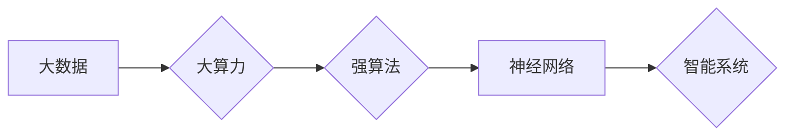

> AI，神经网络，大数据，大算力，强算法，深度学习，计算艺术，机器学习

# AI 神经网络计算艺术之禅：大数据＋大算力＋强算法

深度学习作为人工智能领域的关键技术，已经渗透到我们的日常生活和各行各业。而神经网络，作为深度学习的基础，其计算艺术之禅，在于如何巧妙地运用大数据、大算力和强算法，构建出能够感知、学习、推理和创造的人工智能系统。本文将深入探讨这一领域的核心概念、算法原理、实践案例以及未来发展趋势。

## 1. 背景介绍

### 1.1 问题的由来

随着信息技术的飞速发展，人类已经进入了大数据时代。然而，如何从海量数据中提取有价值的信息，构建智能系统，成为了亟待解决的问题。神经网络的出现，为这一领域带来了新的曙光。通过模仿人脑神经元的工作原理，神经网络能够自动学习和识别数据中的复杂模式，为解决实际问题提供了强大的工具。

### 1.2 研究现状

近年来，神经网络在各个领域的应用取得了显著的成果，如图像识别、语音识别、自然语言处理等。然而，神经网络的计算复杂性也随之增加，对大数据和大算力的需求日益迫切。同时，如何设计高效的算法，优化神经网络结构，成为了研究的重点。

### 1.3 研究意义

深入研究神经网络计算艺术，对于推动人工智能技术的发展具有重要意义。它不仅能够提高智能系统的性能和效率，还能够拓展人工智能的应用范围，为人类社会带来更多福祉。

### 1.4 本文结构

本文将分为以下几个部分：
- 介绍神经网络的核心概念与联系。
- 阐述神经网络的算法原理和具体操作步骤。
- 讲解神经网络的数学模型和公式。
- 分析神经网络在各个领域的应用案例。
- 探讨神经网络的未来发展趋势与挑战。
- 总结研究成果，展望未来研究方向。

## 2. 核心概念与联系

### 2.1 大数据

大数据是指规模巨大、类型多样、价值密度低的数据集合。它具有四个特征：大量（Volume）、多样（Variety）、快速（Velocity）和真实（Veracity）。

### 2.2 大算力

大算力是指强大的计算能力，能够处理大规模数据集和复杂计算任务。它通常依赖于高性能计算设备，如GPU、TPU等。

### 2.3 强算法

强算法是指高效、鲁棒、可扩展的算法，能够解决复杂问题。在神经网络领域，强算法包括深度学习算法、优化算法等。

### 2.4 Mermaid 流程图



## 3. 核心算法原理 & 具体操作步骤

### 3.1 算法原理概述

神经网络通过模拟人脑神经元的工作方式，将输入数据传递到各个神经元，经过非线性变换和权重调整，最终输出结果。其核心原理包括：

- 前向传播：将输入数据逐层传递到神经网络，进行非线性变换和权重调整。
- 反向传播：根据误差反向传播梯度，更新权重和偏置，优化模型参数。
- 优化算法：使用梯度下降、Adam等优化算法，加速模型收敛。

### 3.2 算法步骤详解

1. 数据预处理：对原始数据进行清洗、标准化等处理，使其满足神经网络输入要求。
2. 构建神经网络模型：选择合适的神经网络结构，如卷积神经网络（CNN）、循环神经网络（RNN）等。
3. 损失函数设计：选择合适的损失函数，如均方误差（MSE）、交叉熵损失（CE）等。
4. 模型训练：使用训练数据对神经网络进行训练，优化模型参数。
5. 模型评估：使用验证集评估模型性能，调整超参数和模型结构。
6. 模型部署：将训练好的模型部署到实际应用中。

### 3.3 算法优缺点

#### 优点：

- 能够处理复杂非线性问题。
- 自动学习数据中的复杂模式。
- 具有强大的泛化能力。

#### 缺点：

- 计算量大，需要大算力支持。
- 需要大量标注数据。
- 模型可解释性较差。

### 3.4 算法应用领域

神经网络在各个领域都有广泛的应用，如：

- 图像识别：识别图像中的物体、场景等。
- 语音识别：将语音转换为文本。
- 自然语言处理：进行文本分类、情感分析等。
- 推荐系统：为用户推荐感兴趣的内容。
- 医疗诊断：辅助医生进行疾病诊断。

## 4. 数学模型和公式 & 详细讲解 & 举例说明

### 4.1 数学模型构建

神经网络的核心数学模型包括：

- 激活函数：非线性变换，如ReLU、Sigmoid等。
- 权重和偏置：神经网络参数，用于调整输入数据与输出数据之间的关系。
- 损失函数：衡量模型预测结果与真实标签之间的差异，如MSE、CE等。

### 4.2 公式推导过程

以均方误差（MSE）为例，其公式为：

$$
MSE = \frac{1}{n} \sum_{i=1}^{n}(y_i - \hat{y}_i)^2
$$

其中，$y_i$ 为真实标签，$\hat{y}_i$ 为模型预测值。

### 4.3 案例分析与讲解

以下以CNN为例，讲解其数学模型：

- 卷积层：通过卷积核提取输入数据的局部特征。
- 池化层：降低特征维度，减少计算量。
- 全连接层：将卷积层和池化层提取的特征进行融合，输出最终结果。

## 5. 项目实践：代码实例和详细解释说明

### 5.1 开发环境搭建

1. 安装Python和Anaconda。
2. 安装TensorFlow或PyTorch等深度学习框架。
3. 安装必要的库，如NumPy、Matplotlib等。

### 5.2 源代码详细实现

以下使用PyTorch实现一个简单的CNN模型：

```python
import torch
import torch.nn as nn
import torch.optim as optim

# 定义CNN模型
class SimpleCNN(nn.Module):
    def __init__(self):
        super(SimpleCNN, self).__init__()
        self.conv1 = nn.Conv2d(1, 10, kernel_size=5)
        self.conv2 = nn.Conv2d(10, 20, kernel_size=5)
        self.fc1 = nn.Linear(320, 50)
        self.fc2 = nn.Linear(50, 10)

    def forward(self, x):
        x = nn.functional.relu(nn.functional.max_pool2d(self.conv1(x), 2))
        x = nn.functional.relu(nn.functional.max_pool2d(self.conv2(x), 2))
        x = x.view(-1, 320)
        x = nn.functional.relu(self.fc1(x))
        x = self.fc2(x)
        return x

# 创建模型和优化器
model = SimpleCNN()
optimizer = optim.SGD(model.parameters(), lr=0.01)

# 训练模型
for epoch in range(2):
    for data, target in train_loader:
        optimizer.zero_grad()
        output = model(data)
        loss = nn.functional.mse_loss(output, target)
        loss.backward()
        optimizer.step()

# 测试模型
test_loss = 0
for data, target in test_loader:
    output = model(data)
    test_loss += nn.functional.mse_loss(output, target)

print(f"Test loss: {test_loss / len(test_loader)}")
```

### 5.3 代码解读与分析

- `SimpleCNN` 类定义了一个简单的CNN模型，包括两个卷积层、两个池化层和两个全连接层。
- `forward` 方法实现了模型的前向传播过程。
- 训练模型时，使用SGD优化器进行参数优化。
- 测试模型时，计算测试集上的平均损失。

### 5.4 运行结果展示

运行上述代码，将在控制台输出测试集上的平均损失值。

## 6. 实际应用场景

### 6.1 图像识别

神经网络在图像识别领域取得了显著的成果，如人脸识别、物体检测、图像分割等。以下是一些应用案例：

- 人脸识别：通过神经网络识别图像中的人脸，实现身份验证、门禁控制等功能。
- 物体检测：在图像中检测和识别各种物体，如车辆、行人、交通标志等。
- 图像分割：将图像中的物体、场景等分割成不同的区域，应用于医疗影像分析、卫星图像分析等领域。

### 6.2 语音识别

神经网络在语音识别领域也取得了突破性的进展，如语音转文本、语音合成等。以下是一些应用案例：

- 语音转文本：将语音转换为文本，应用于语音助手、会议记录、客服系统等领域。
- 语音合成：生成逼真的语音，应用于语音播报、教育机器人、娱乐等领域。

### 6.3 自然语言处理

神经网络在自然语言处理领域具有广泛的应用，如文本分类、机器翻译、情感分析等。以下是一些应用案例：

- 文本分类：将文本分类为不同的类别，如新闻分类、情感分析等。
- 机器翻译：将一种语言的文本翻译成另一种语言。
- 情感分析：分析文本的情感倾向，如正面、中性、负面等。

## 7. 工具和资源推荐

### 7.1 学习资源推荐

1. 《深度学习》（Ian Goodfellow等著）：深度学习领域的经典教材，详细介绍了深度学习的基本概念、算法和应用。
2. 《Python深度学习》（François Chollet著）：Python深度学习领域的入门书籍，适合初学者学习。
3. TensorFlow官方文档：TensorFlow深度学习框架的官方文档，提供了丰富的教程和示例代码。
4. PyTorch官方文档：PyTorch深度学习框架的官方文档，提供了丰富的教程和示例代码。

### 7.2 开发工具推荐

1. TensorFlow：由Google开源的深度学习框架，具有强大的计算能力和丰富的应用案例。
2. PyTorch：由Facebook开源的深度学习框架，具有灵活的动态计算图和易于使用的API。
3. Keras：基于TensorFlow和PyTorch的开源深度学习库，提供了丰富的层和模型组件。

### 7.3 相关论文推荐

1. "A Tutorial on Deep Learning for NLP"（NVIDIA论文）：介绍了深度学习在自然语言处理领域的应用。
2. "Sequence to Sequence Learning with Neural Networks"（Google论文）：介绍了序列到序列学习模型，用于机器翻译。
3. "Convolutional Neural Networks for Visual Recognition"（Alex Krizhevsky等论文）：介绍了卷积神经网络在图像识别领域的应用。

## 8. 总结：未来发展趋势与挑战

### 8.1 研究成果总结

本文从大数据、大算力和强算法三个方面，探讨了神经网络计算艺术的核心概念、算法原理、实践案例和未来发展趋势。通过介绍深度学习的基本概念、算法和应用，展示了神经网络在各个领域的强大能力。

### 8.2 未来发展趋势

未来，神经网络计算艺术将呈现以下发展趋势：

- 模型轻量化：为了适应移动设备和边缘计算，神经网络模型将更加轻量化。
- 多模态学习：将文本、图像、语音等多模态信息进行融合，实现更全面的信息处理。
- 生成式模型：生成式模型将更加流行，用于图像、视频、文本等内容的生成。
- 自监督学习：自监督学习将减少对标注数据的依赖，降低模型训练成本。

### 8.3 面临的挑战

神经网络计算艺术在发展过程中也面临着一些挑战：

- 计算资源：随着模型规模的扩大，对计算资源的需求将不断增加。
- 数据质量：高质量标注数据仍然稀缺，数据偏见和隐私问题需要关注。
- 模型可解释性：神经网络模型的可解释性较差，需要进一步研究。

### 8.4 研究展望

未来，神经网络计算艺术的研究将朝着以下方向发展：

- 开发更加高效的算法，降低计算复杂度。
- 研究可解释的神经网络模型，提高模型的可信度和可靠性。
- 探索更加轻量化的模型，适应移动设备和边缘计算场景。
- 加强多模态学习，实现更全面的信息处理。

通过不断创新和突破，神经网络计算艺术将为人工智能领域带来更多可能性，为人类社会创造更多价值。

## 9. 附录：常见问题与解答

**Q1：神经网络是如何学习的？**

A：神经网络通过大量的训练数据，学习输入数据和输出数据之间的关系，不断调整网络参数，使模型预测结果与真实标签之间的差异最小化。

**Q2：什么是深度学习？**

A：深度学习是一种机器学习方法，通过多层神经网络自动学习数据中的复杂模式。

**Q3：什么是大数据？**

A：大数据是指规模巨大、类型多样、价值密度低的数据集合。

**Q4：什么是大算力？**

A：大算力是指强大的计算能力，能够处理大规模数据集和复杂计算任务。

**Q5：什么是强算法？**

A：强算法是指高效、鲁棒、可扩展的算法，能够解决复杂问题。

**Q6：神经网络在哪些领域有应用？**

A：神经网络在图像识别、语音识别、自然语言处理、推荐系统、医疗诊断等领域都有广泛应用。

**Q7：如何选择合适的神经网络结构？**

A：选择合适的神经网络结构需要根据具体任务和数据特点进行。对于图像识别，可以使用CNN；对于序列数据，可以使用RNN或LSTM；对于文本数据，可以使用Transformer。

作者：禅与计算机程序设计艺术 / Zen and the Art of Computer Programming