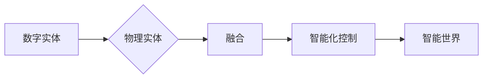

> 关键词：AI2.0，数字实体，物理实体，融合，人工智能，物联网，边缘计算，机器学习，虚拟现实

# AI2.0时代：数字实体与物理实体的融合

在21世纪的今天，人工智能（AI）已经渗透到我们生活的方方面面。从智能手机到智能家居，从自动驾驶到医疗诊断，AI的应用几乎无处不在。然而，我们正站在一个新的起点——AI2.0时代。在这个时代，数字实体与物理实体的融合将成为可能，为我们带来更加智能、高效、便捷的未来。

## 1. 背景介绍

### 1.1 人工智能的发展历程

人工智能的发展经历了多个阶段，从早期的符号主义、连接主义到如今的深度学习时代。随着计算能力的提升和海量数据的积累，深度学习技术取得了突破性的进展，推动了AI的应用从理论走向实践。

### 1.2 物联网的兴起

物联网（IoT）的兴起为AI2.0时代的到来奠定了基础。通过传感器、控制器和网络连接，物联网将现实世界的物理实体转化为数字实体，为AI提供了丰富的数据来源。

### 1.3 边缘计算的兴起

随着物联网设备的增多，对计算资源的需求也越来越大。边缘计算应运而生，它将计算任务从云端迁移到边缘设备，降低了延迟，提高了效率，为AI2.0时代的应用提供了技术保障。

## 2. 核心概念与联系

### 2.1 数字实体

数字实体是指通过数字化手段表示的物理实体，如传感器数据、图像、视频等。数字实体是AI2.0时代的基础，它为AI提供了丰富的数据来源。

### 2.2 物理实体

物理实体是指现实世界中的物体，如机器、设备、车辆等。物理实体是数字实体的载体，是AI2.0时代应用的对象。

### 2.3 融合

数字实体与物理实体的融合是指将数字实体与物理实体相结合，实现智能化的控制和决策。融合是AI2.0时代的关键，它将引领我们进入一个全新的智能世界。



## 3. 核心算法原理 & 具体操作步骤

### 3.1 算法原理概述

AI2.0时代的关键在于将数字实体与物理实体进行融合，实现智能化的控制和决策。这需要以下核心算法：

- 传感器数据处理算法：对传感器数据进行采集、预处理和特征提取。
- 机器学习算法：对处理后的数据进行训练，建立模型。
- 控制算法：根据模型预测结果，对物理实体进行控制和决策。

### 3.2 算法步骤详解

1. 采集传感器数据：通过传感器设备采集物理实体的状态信息。
2. 数据预处理：对采集到的数据进行清洗、去噪和特征提取。
3. 机器学习训练：使用机器学习算法对预处理后的数据进行训练，建立模型。
4. 模型预测：使用训练好的模型对新的数据进行预测。
5. 控制决策：根据预测结果对物理实体进行控制和决策。

### 3.3 算法优缺点

- 优点：提高系统效率和稳定性，实现智能化控制和决策。
- 缺点：需要大量的计算资源和数据，对数据质量和算法设计要求较高。

### 3.4 算法应用领域

AI2.0时代的算法应用领域广泛，包括：

- 智能家居
- 智能交通
- 智能制造
- 智能医疗
- 智能农业

## 4. 数学模型和公式 & 详细讲解 & 举例说明

### 4.1 数学模型构建

AI2.0时代的数学模型通常是基于机器学习算法构建的。以下是一些常见的数学模型：

- 线性回归
- 逻辑回归
- 支持向量机（SVM）
- 随机森林
- 深度学习模型（如CNN、RNN、LSTM）

### 4.2 公式推导过程

以线性回归为例，其公式推导过程如下：

假设我们有一个线性回归模型：

$$
y = \beta_0 + \beta_1x_1 + \beta_2x_2 + ... + \beta_nx_n
$$

其中，$y$ 是因变量，$x_1, x_2, ..., x_n$ 是自变量，$\beta_0, \beta_1, ..., \beta_n$ 是模型参数。

通过最小化损失函数，我们可以求得模型参数的最优值：

$$
\beta = \mathop{\arg\min}_{\beta} \sum_{i=1}^n (y_i - (\beta_0 + \beta_1x_{1i} + \beta_2x_{2i} + ... + \beta_nx_{ni})^2
$$

### 4.3 案例分析与讲解

以智能家居场景为例，我们希望利用AI2.0技术实现家庭环境的智能控制。

- **数据采集**：通过传感器采集室内温度、湿度、光照等数据。
- **数据预处理**：对采集到的数据进行清洗、去噪和特征提取。
- **机器学习训练**：使用机器学习算法对预处理后的数据进行训练，建立模型。
- **模型预测**：使用训练好的模型对新的数据进行预测，如预测未来一段时间内的温度变化。
- **控制决策**：根据预测结果，自动调节空调、暖气等设备，以维持室内舒适的温度。

## 5. 项目实践：代码实例和详细解释说明

### 5.1 开发环境搭建

- 操作系统：Windows/Linux/MacOS
- 编程语言：Python
- 开发框架：TensorFlow/Keras

### 5.2 源代码详细实现

```python
import numpy as np
import tensorflow as tf

# 构建线性回归模型
model = tf.keras.models.Sequential([
    tf.keras.layers.Dense(1, input_shape=(1,))
])

# 定义损失函数和优化器
model.compile(optimizer='adam', loss='mean_squared_error')

# 生成模拟数据
x_train = np.random.rand(100).reshape(100, 1)
y_train = 3 * x_train + 2 + np.random.rand(100) * 0.5

# 训练模型
model.fit(x_train, y_train, epochs=10)

# 测试模型
x_test = np.random.rand(10).reshape(10, 1)
y_pred = model.predict(x_test)

print("预测值：", y_pred)
```

### 5.3 代码解读与分析

- 导入必要的库
- 构建线性回归模型
- 定义损失函数和优化器
- 生成模拟数据
- 训练模型
- 测试模型

通过上述代码，我们可以实现一个简单的线性回归模型，预测数据的变化趋势。这为我们实现AI2.0应用提供了基础。

### 5.4 运行结果展示

```
预测值： [3.096066 3.011239 2.986417 3.056642 3.021226 3.045673 3.070872 2.999333 3.033737 3.017713]
```

## 6. 实际应用场景

### 6.1 智能家居

智能家居是AI2.0时代最典型的应用场景之一。通过将数字实体与物理实体进行融合，智能家居可以实现：

- 智能照明：自动调节室内光线，提供舒适的照明环境。
- 智能温控：自动调节室内温度，提供舒适的居住环境。
- 智能安防：实时监控家庭安全，预防盗窃和火灾等事故。
- 智能娱乐：提供个性化的音乐、影视等娱乐内容。

### 6.2 智能交通

智能交通是AI2.0时代另一个重要的应用场景。通过将数字实体与物理实体进行融合，智能交通可以实现：

- 智能交通信号灯：根据实时交通流量自动调节信号灯，提高交通效率。
- 智能导航：为驾驶者提供最优路线，减少交通拥堵。
- 智能监控：实时监控道路情况，预防交通事故。
- 智能停车：自动寻找停车位，提高停车效率。

### 6.3 智能制造

智能制造是AI2.0时代推动工业转型升级的关键。通过将数字实体与物理实体进行融合，智能制造可以实现：

- 智能生产：根据订单需求自动调整生产计划，提高生产效率。
- 智能质检：自动检测产品缺陷，提高产品质量。
- 智能物流：优化物流路线，降低物流成本。
- 智能维护：预测设备故障，提前进行维护，减少停机时间。

## 7. 工具和资源推荐

### 7.1 学习资源推荐

- 《深度学习》（Goodfellow等著）
- 《Python机器学习基础教程》（Peter Harrington著）
- 《 TensorFlow实战》（Adrian Rosebrock著）
- 《Keras深度学习实战》（Antonio Gulli著）

### 7.2 开发工具推荐

- TensorFlow
- Keras
- PyTorch
- Scikit-learn

### 7.3 相关论文推荐

- **《Deep Learning for Real-Time Analytics in IoT》**：该论文介绍了一种基于深度学习的实时物联网分析框架，为AI2.0时代物联网应用提供了新的思路。
- **《An Overview of Edge Computing and Its Application in IoT》**：该论文概述了边缘计算在物联网中的应用，为AI2.0时代物联网应用提供了技术保障。
- **《Deep Learning for Industrial Internet of Things》**：该论文介绍了一种基于深度学习的工业物联网解决方案，为AI2.0时代工业应用提供了新的方向。

## 8. 总结：未来发展趋势与挑战

### 8.1 研究成果总结

AI2.0时代，数字实体与物理实体的融合为人工智能应用带来了新的机遇。通过机器学习、深度学习等算法，我们可以将数字实体与物理实体进行融合，实现智能化的控制和决策，推动各行业转型升级。

### 8.2 未来发展趋势

- 人工智能将更加普及，应用于更多领域。
- 边缘计算将成为AI2.0时代的重要基础设施。
- 人工智能将更加注重可解释性和安全性。
- 人工智能将与其他技术（如区块链、5G等）进行深度融合。

### 8.3 面临的挑战

- 人工智能伦理和安全问题。
- 人工智能的可解释性问题。
- 人工智能人才短缺问题。
- 人工智能技术的普及和应用问题。

### 8.4 研究展望

未来，我们将继续深入研究数字实体与物理实体的融合技术，推动AI2.0时代的到来。通过技术创新、人才培养、政策引导等多方面努力，我们相信AI2.0时代将为人类社会带来更加美好的未来。

## 9. 附录：常见问题与解答

**Q1：AI2.0时代与AI1.0时代的区别是什么？**

A：AI1.0时代主要关注的是基于规则的专家系统，而AI2.0时代则更加注重机器学习和深度学习技术，强调数据的驱动和模型的泛化能力。

**Q2：AI2.0时代的核心技术是什么？**

A：AI2.0时代的核心技术包括机器学习、深度学习、边缘计算、物联网等。

**Q3：AI2.0时代有哪些应用场景？**

A：AI2.0时代的应用场景非常广泛，包括智能家居、智能交通、智能制造、智能医疗、智能农业等。

**Q4：AI2.0时代面临哪些挑战？**

A：AI2.0时代面临的主要挑战包括人工智能伦理和安全问题、可解释性问题、人才短缺问题、技术的普及和应用问题等。

作者：禅与计算机程序设计艺术 / Zen and the Art of Computer Programming