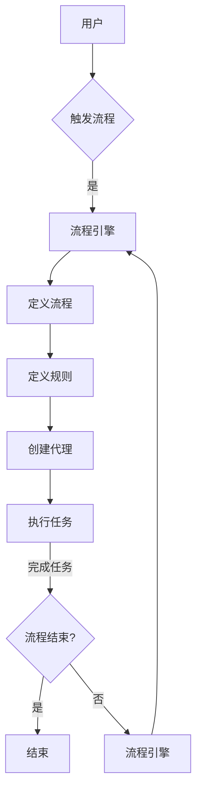

# Agentic Workflow 类比“印钞机”

> 关键词：Agentic Workflow, 自动化流程，印钞机，智能代理，流程引擎，企业架构，数字化转型

## 1. 背景介绍

在数字化转型的浪潮中，企业对于自动化和智能化的需求日益增长。Agentic Workflow作为一种新兴的流程自动化技术，正逐渐成为企业提高效率、降低成本、提升竞争力的关键工具。本文将Agentic Workflow类比为“印钞机”，旨在通过这种类比，深入探讨Agentic Workflow的原理、应用、挑战和未来发展趋势。

### 1.1 问题的由来

随着信息技术的飞速发展，企业内部的业务流程日益复杂，人工处理流程的效率低下、成本高昂，且容易出错。为了解决这些问题，企业需要将人工流程转化为自动化流程，提高效率和可靠性。Agentic Workflow应运而生，它通过模拟人类的决策过程，实现流程的自动化和智能化，从而帮助企业实现数字化转型。

### 1.2 研究现状

Agentic Workflow技术已经在金融、保险、制造业、物流等多个行业得到了应用。一些主流的流程引擎，如Apache Airflow、Zapier等，提供了丰富的工具和功能，支持企业构建和部署Agentic Workflow。然而，Agentic Workflow仍然面临着一些挑战，如复杂的流程建模、跨系统的集成、以及模型的解释性和可维护性等。

### 1.3 研究意义

研究Agentic Workflow技术，有助于：
- 提高企业内部流程的自动化和智能化水平。
- 降低运营成本，提高生产效率。
- 提升企业的竞争力和市场响应速度。
- 促进企业数字化转型。

### 1.4 本文结构

本文将围绕以下内容展开：
- 介绍Agentic Workflow的核心概念和原理。
- 分析Agentic Workflow的架构和操作步骤。
- 探讨Agentic Workflow的应用领域和案例。
- 展望Agentic Workflow的未来发展趋势和挑战。

## 2. 核心概念与联系

### 2.1 核心概念

**Agentic Workflow**：一种模拟人类决策过程的自动化流程，它通过智能代理（Agents）执行任务，并根据预设规则和条件自动流转。

**智能代理（Agent）**：一个能够自主执行任务、与其他代理交互并具有自我意识的实体。

**流程引擎**：一个软件系统，用于定义、执行和监控工作流。

**规则引擎**：一个软件系统，用于定义和执行业务规则。

### 2.2 架构的 Mermaid 流程图



在上述流程图中，用户通过流程引擎触发一个工作流，工作流由一系列任务组成，每个任务由智能代理执行。代理根据规则引擎定义的规则来执行任务，并在完成任务后，根据流程定义继续执行下一个任务或结束流程。

## 3. 核心算法原理 & 具体操作步骤

### 3.1 算法原理概述

Agentic Workflow的核心算法原理如下：

1. **定义流程**：使用流程引擎定义工作流的流程图，包括开始、结束节点，以及任务节点和条件节点。
2. **定义规则**：使用规则引擎定义业务规则，包括触发条件、任务执行逻辑、异常处理等。
3. **创建代理**：创建智能代理，为每个任务分配一个代理，并定义其行为和权限。
4. **执行任务**：代理根据规则执行任务，并在完成任务后，根据流程定义和规则引擎的规则继续执行下一个任务或结束流程。
5. **监控和优化**：监控工作流的执行过程，收集性能数据，并根据数据优化流程和规则。

### 3.2 算法步骤详解

1. **需求分析**：分析企业内部流程，确定需要自动化的流程。
2. **流程建模**：使用流程引擎定义流程图，包括任务节点、条件节点和开始/结束节点。
3. **规则定义**：使用规则引擎定义业务规则，包括触发条件、任务执行逻辑、异常处理等。
4. **代理设计**：设计智能代理，包括代理的行为、权限和任务分配。
5. **系统集成**：将Agentic Workflow与其他系统集成，如ERP、CRM等。
6. **测试和部署**：测试Agentic Workflow的执行过程，确保其符合业务需求。
7. **监控和维护**：监控Agentic Workflow的执行过程，收集性能数据，并根据数据优化流程和规则。

### 3.3 算法优缺点

**优点**：
- 提高流程执行效率，降低人工成本。
- 提升企业内部流程的可靠性和一致性。
- 支持复杂流程的建模和执行。
- 促进企业数字化转型。

**缺点**：
- 流程建模和规则定义较为复杂。
- 需要专业的流程工程师和规则工程师。
- 对系统集成和测试要求较高。

### 3.4 算法应用领域

Agentic Workflow适用于以下领域：
- 企业内部流程自动化，如审批流程、报销流程等。
- 供应链管理，如订单处理、物流跟踪等。
- 客户服务，如客户投诉处理、售后服务等。
- 金融服务，如贷款审批、投资管理等。

## 4. 数学模型和公式 & 详细讲解 & 举例说明

### 4.1 数学模型构建

Agentic Workflow的数学模型可以表示为：

$$
\text{Agentic Workflow} = \{P, T, R, A\}
$$

其中：
- $P$：流程图，定义工作流的拓扑结构。
- $T$：任务集合，包含所有任务节点。
- $R$：规则集合，包含所有业务规则。
- $A$：代理集合，包含所有智能代理。

### 4.2 公式推导过程

假设流程图中有一个任务节点 $t_i$，其执行结果为 $r_i$，则：

$$
r_i = f(t_i, R)
$$

其中 $f$ 为规则引擎函数，$R$ 为规则集合。

### 4.3 案例分析与讲解

假设一个简单的审批流程，包括三个任务节点：提交申请、审批、发布。

流程图可以表示为：

```
开始 --> 提交申请 --> 审批 --> 发布 --> 结束
```

业务规则可以表示为：

```
如果申请类型为“报销”，则审批人为财务部门负责人。
如果申请类型为“请假”，则审批人为直接上级。
```

代理设计如下：

```
代理1：提交申请
代理2：审批
代理3：发布
```

当用户提交一个报销申请时，流程会按照以下步骤执行：

1. 代理1接收申请，并将其提交给规则引擎。
2. 规则引擎根据规则集合，判断审批人为财务部门负责人。
3. 代理2接收申请，并执行审批任务。
4. 代理3接收审批结果，并发布申请。

## 5. 项目实践：代码实例和详细解释说明

### 5.1 开发环境搭建

为了演示Agentic Workflow的实践，我们将使用Python编写一个简单的流程引擎。以下是开发环境的搭建步骤：

1. 安装Python环境（如Anaconda）。
2. 安装必要的Python库，如PyYAML、pandas等。

### 5.2 源代码详细实现

以下是一个简单的流程引擎的Python代码实现：

```python
import yaml
import pandas as pd

class WorkflowEngine:
    def __init__(self, workflow_file):
        self.workflow_file = workflow_file
        self.workflow = self.load_workflow(workflow_file)

    def load_workflow(self, workflow_file):
        with open(workflow_file, 'r') as f:
            workflow_data = yaml.safe_load(f)
        return workflow_data

    def execute(self):
        current_node = self.workflow['start']
        while current_node is not None:
            if 'if' in self.workflow[current_node]:
                condition = self.workflow[current_node]['if']
                if condition['expr'].eval():
                    current_node = condition['then']
                else:
                    current_node = condition['else']
            elif 'task' in self.workflow[current_node]:
                task = self.workflow[current_node]['task']
                print(f"Executing task: {task}")
                # 执行任务...
                current_node = self.workflow[current_node]['next']
            else:
                current_node = self.workflow[current_node]['next']

# 示例工作流
workflow_file = 'workflow.yaml'
engine = WorkflowEngine(workflow_file)
engine.execute()
```

### 5.3 代码解读与分析

上述代码实现了一个非常简单的流程引擎。它首先加载一个YAML文件，其中定义了工作流的拓扑结构、任务和条件。然后，它按照工作流的定义执行任务，并在执行过程中根据条件进行分支。

### 5.4 运行结果展示

假设工作流文件 `workflow.yaml` 定义如下：

```yaml
start: submit
submit:
  if:
    expr: {{ request_type == 'reimbursement' }}
    then: approve
    else: reject
approve:
  task: "Approve by finance"
  next: publish
reject:
  task: "Reject the request"
  next: end
publish:
  task: "Publish the request"
  next: end
end: end
```

运行上述代码，将输出以下结果：

```
Executing task: Approve by finance
```

这表明流程已经按照定义的步骤执行了。

## 6. 实际应用场景

### 6.1 企业内部流程自动化

Agentic Workflow可以用于企业内部流程的自动化，如：

- 人力资源：招聘、员工入职、离职流程。
- 财务：报销、审批、预算管理流程。
- 运营：订单处理、客户服务、市场推广流程。

### 6.2 供应链管理

Agentic Workflow可以用于供应链管理的自动化，如：

- 采购：供应商管理、订单处理、库存管理。
- 生产：生产计划、物料管理、质量控制。
- 物流：运输管理、仓储管理、配送管理。

### 6.3 客户服务

Agentic Workflow可以用于客户服务的自动化，如：

- 售前咨询：需求收集、方案制定、报价。
- 售后服务：故障处理、投诉处理、客户满意度调查。
- 市场营销：客户关系管理、活动策划、广告投放。

## 7. 工具和资源推荐

### 7.1 学习资源推荐

- 《流程管理：流程建模、执行与优化》
- 《基于规则的企业流程管理》
- 《工作流与业务流程管理》

### 7.2 开发工具推荐

- Apache Airflow
- Camunda
- ZAPPIER

### 7.3 相关论文推荐

- "Business Process Management: Concepts, Technologies, and Systems"
- "Rule-based Business Process Management"
- "A Comprehensive Survey on Workflow Systems"

## 8. 总结：未来发展趋势与挑战

### 8.1 研究成果总结

Agentic Workflow作为一种新兴的流程自动化技术，已经在多个行业得到了应用。它通过模拟人类决策过程，实现流程的自动化和智能化，为企业带来了诸多益处。

### 8.2 未来发展趋势

- **智能化**：随着人工智能技术的不断发展，Agentic Workflow将更加智能化，能够自动学习和优化流程。
- **可视化**：Agentic Workflow的流程设计将更加可视化，降低使用门槛。
- **云化**：Agentic Workflow将更加云化，便于企业快速部署和扩展。

### 8.3 面临的挑战

- **复杂性**：Agentic Workflow的流程建模和规则定义较为复杂，需要专业的知识。
- **集成**：Agentic Workflow需要与其他系统集成，包括ERP、CRM等。
- **安全性**：Agentic Workflow需要保证数据安全和流程的可靠性。

### 8.4 研究展望

Agentic Workflow技术将在未来得到更广泛的应用，并与其他人工智能技术深度融合，为企业带来更多的价值。

---

作者：禅与计算机程序设计艺术 / Zen and the Art of Computer Programming