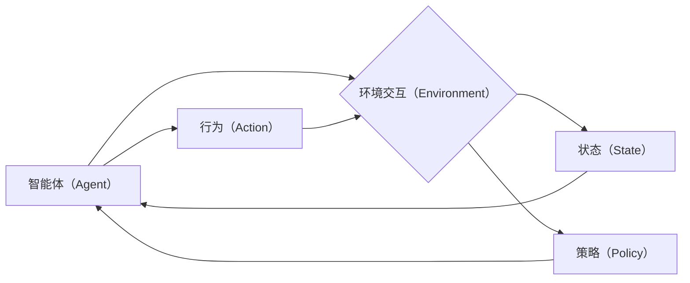

# Agent代理技术在AI系统中的角色

> 关键词：Agent代理，强化学习，智能体，自主决策，多智能体系统，环境交互，分布式计算

## 1. 背景介绍

在人工智能领域，Agent代理（或智能体）是一个核心概念，它代表了具有感知、推理和决策能力的实体。从早期的专家系统到如今的深度学习应用，Agent代理技术在AI系统中的作用日益凸显。本文将深入探讨Agent代理技术在AI系统中的角色，分析其核心概念、原理、应用领域以及未来发展趋势。

### 1.1 问题的由来

随着计算能力的提升和算法的进步，人工智能系统在各个领域得到了广泛应用。然而，大多数AI系统仍然缺乏自主性和灵活性，往往只能完成预定义的任务。为了构建更加智能、自适应的AI系统，Agent代理技术应运而生。

### 1.2 研究现状

近年来，Agent代理技术在人工智能领域取得了显著进展。强化学习、多智能体系统、分布式计算等技术的发展，为Agent代理技术的应用提供了强大的技术支撑。研究现状主要集中在以下几个方面：

- 强化学习：通过与环境交互学习最优策略，Agent代理能够实现自主决策。
- 多智能体系统：多个Agent代理协同工作，共同完成复杂任务。
- 分布式计算：Agent代理在分布式系统中进行任务分配和资源管理。
- 人类-智能体交互：Agent代理能够理解人类意图，提供更加人性化的服务。

### 1.3 研究意义

Agent代理技术在AI系统中的角色至关重要，其意义体现在以下几个方面：

- 提高系统的自主性和适应性：Agent代理能够根据环境变化自主调整行为，提高系统的整体性能。
- 实现复杂任务自动化：通过协同工作，多个Agent代理可以完成复杂任务，提高生产效率。
- 优化资源分配：Agent代理能够在分布式系统中实现资源的最优分配，降低资源浪费。
- 促进人机交互：Agent代理能够理解人类意图，提供更加人性化的服务，提升用户体验。

### 1.4 本文结构

本文将按照以下结构展开：

- 第2章：介绍Agent代理技术的核心概念和联系。
- 第3章：阐述Agent代理技术的核心算法原理和具体操作步骤。
- 第4章：讲解数学模型和公式，并举例说明。
- 第5章：提供代码实例和详细解释说明。
- 第6章：探讨实际应用场景和未来应用展望。
- 第7章：推荐相关工具和资源。
- 第8章：总结研究成果，展望未来发展趋势和挑战。
- 第9章：附录，常见问题与解答。

## 2. 核心概念与联系

### 2.1 核心概念

#### 2.1.1 智能体（Agent）

智能体（Agent）是一个具有感知、推理和决策能力的实体。它能够通过感知环境获取信息，根据自身目标和策略进行推理，并采取行动以实现目标。

#### 2.1.2 环境交互（Environment）

环境是智能体进行感知和决策的背景。环境可以是一个物理空间，也可以是一个虚拟空间，如游戏、模拟器等。

#### 2.1.3 行为（Action）

行为是智能体对环境做出的反应。根据智能体的目标，行为可以是多种多样的，如移动、发送消息、请求资源等。

#### 2.1.4 状态（State）

状态是环境在某一时刻的状态描述。智能体通过感知环境状态来指导自己的行为。

#### 2.1.5 策略（Policy）

策略是智能体在给定状态下选择行为的方式。策略可以是确定性策略，也可以是非确定性策略。

### 2.2 核心概念联系

Agent代理技术的核心概念之间存在着紧密的联系，如下所示：



智能体通过感知环境状态，根据自身策略选择行为，进而影响环境状态，形成一个闭环。

## 3. 核心算法原理 & 具体操作步骤

### 3.1 算法原理概述

Agent代理技术的核心算法主要包括：

- 强化学习（Reinforcement Learning，RL）：通过与环境交互学习最优策略。
- 动态规划（Dynamic Programming，DP）：通过求解最优决策序列来优化目标函数。
- 深度学习（Deep Learning，DL）：使用神经网络模型模拟智能体的感知、推理和决策过程。

### 3.2 算法步骤详解

#### 3.2.1 强化学习

强化学习的基本步骤如下：

1. 初始化智能体、环境和策略。
2. 智能体在环境中采取行动。
3. 环境根据行动提供反馈（奖励）。
4. 智能体根据奖励更新策略。
5. 重复步骤2-4，直到达到终止条件。

#### 3.2.2 动态规划

动态规划的基本步骤如下：

1. 将问题分解为多个子问题。
2. 递归地求解子问题。
3. 根据子问题的解构建原问题的解。

#### 3.2.3 深度学习

深度学习的基本步骤如下：

1. 设计神经网络模型。
2. 使用大量数据训练模型。
3. 使用训练好的模型进行推理。

### 3.3 算法优缺点

#### 3.3.1 强化学习

优点：

- 能够学习到复杂的环境决策。
- 具有较强的泛化能力。

缺点：

- 训练过程可能非常耗时。
- 需要大量的数据。

#### 3.3.2 动态规划

优点：

- 能够求解某些类型的最优化问题。
- 具有较强的可解释性。

缺点：

- 适用于小规模问题。
- 计算复杂度高。

#### 3.3.3 深度学习

优点：

- 能够处理大量数据。
- 模型性能优越。

缺点：

- 模型可解释性较差。
- 需要大量的计算资源。

### 3.4 算法应用领域

Agent代理技术的算法应用领域广泛，包括：

- 游戏：如围棋、国际象棋、电子竞技等。
- 推荐系统：如电影推荐、商品推荐等。
- 自动驾驶：如无人驾驶、自动驾驶机器人等。
- 机器人控制：如无人机、机器人足球等。

## 4. 数学模型和公式 & 详细讲解 & 举例说明

### 4.1 数学模型构建

强化学习的数学模型可以表示为：

$$
M = \{A, S, R, P, \gamma, \theta\}
$$

其中：

- $A$: 行动空间。
- $S$: 状态空间。
- $R$: 奖励函数。
- $P$: 状态转移概率。
- $\gamma$: 折扣因子。
- $\theta$: 策略参数。

### 4.2 公式推导过程

强化学习的基本公式如下：

$$
Q(s, a) = \sum_{s' \in S} P(s'|s, a) [R(s, a, s') + \gamma \max_{a' \in A} Q(s', a')]
$$

其中：

- $Q(s, a)$: 在状态 $s$ 下采取行动 $a$ 的预期收益。
- $P(s'|s, a)$: 从状态 $s$ 采取行动 $a$ 到状态 $s'$ 的转移概率。
- $R(s, a, s')$: 从状态 $s$ 采取行动 $a$ 到状态 $s'$ 的奖励。

### 4.3 案例分析与讲解

以下是一个简单的强化学习案例：智能体在网格世界中寻找宝藏。

1. **定义状态空间**：状态空间由智能体的位置和宝藏的位置组成。
2. **定义行动空间**：行动空间包括向上、向下、向左、向右移动。
3. **定义奖励函数**：如果智能体到达宝藏位置，则获得正奖励；否则，获得负奖励。
4. **定义策略**：策略参数 $\theta$ 表示智能体在每个状态下选择行动的概率分布。
5. **训练过程**：智能体在环境中进行探索，根据奖励更新策略参数 $\theta$。

## 5. 项目实践：代码实例和详细解释说明

### 5.1 开发环境搭建

为了实现上述案例，我们需要搭建以下开发环境：

- Python编程语言
- TensorFlow或PyTorch深度学习框架
- Gym环境库

### 5.2 源代码详细实现

以下是一个使用PyTorch实现的智能体寻找宝藏的代码示例：

```python
import gym
import torch
import torch.nn as nn
import torch.optim as optim

# 定义环境
env = gym.make("GridWorld-v0")

# 定义智能体网络
class Agent(nn.Module):
    def __init__(self, state_dim, action_dim, hidden_dim):
        super(Agent, self).__init__()
        self.fc1 = nn.Linear(state_dim, hidden_dim)
        self.fc2 = nn.Linear(hidden_dim, action_dim)

    def forward(self, state):
        x = torch.relu(self.fc1(state))
        return self.fc2(x)

# 定义损失函数和优化器
criterion = nn.MSELoss()
optimizer = optim.Adam(agent.parameters(), lr=0.01)

# 训练过程
for episode in range(1000):
    state = env.reset()
    done = False
    while not done:
        action = agent(state).argmax()
        next_state, reward, done, _ = env.step(action)
        optimizer.zero_grad()
        loss = criterion(agent(state), action)
        loss.backward()
        optimizer.step()
        state = next_state

# 评估智能体
state = env.reset()
done = False
while not done:
    action = agent(state).argmax()
    _, reward, done, _ = env.step(action)
    print(f"Action: {action}, Reward: {reward}")
```

### 5.3 代码解读与分析

- Gym环境库提供了GridWorld环境，用于模拟智能体在网格世界中寻找宝藏的过程。
- Agent类定义了智能体的神经网络结构，包括两个全连接层。
- 训练过程通过迭代优化智能体的策略参数，使得智能体能够学习到寻找宝藏的策略。
- 评估过程展示智能体在环境中采取的行动和获得的奖励。

## 6. 实际应用场景

### 6.1 自动驾驶

在自动驾驶领域，Agent代理技术可以用于模拟无人驾驶汽车的行为，实现自主导航、避障、停车等功能。

### 6.2 机器人控制

在机器人控制领域，Agent代理技术可以用于控制机器人的动作，实现抓取、搬运、组装等任务。

### 6.3 游戏AI

在游戏AI领域，Agent代理技术可以用于开发更加智能、灵活的游戏角色，提升游戏体验。

### 6.4 虚拟现实/增强现实

在虚拟现实/增强现实领域，Agent代理技术可以用于模拟虚拟角色的行为，实现更加真实的交互体验。

### 6.5 金融交易

在金融交易领域，Agent代理技术可以用于开发自动交易系统，实现智能投资、风险管理等功能。

### 6.4 未来应用展望

随着人工智能技术的不断发展，Agent代理技术的应用领域将更加广泛。以下是一些未来应用展望：

- 智能家居：Agent代理技术可以用于构建智能家居系统，实现自动化控制、节能降耗等功能。
- 医疗健康：Agent代理技术可以用于辅助医生进行诊断、治疗等任务，提高医疗服务水平。
- 教育培训：Agent代理技术可以用于开发个性化学习系统，实现因材施教、智能辅导等功能。
- 娱乐休闲：Agent代理技术可以用于开发更加智能化的娱乐产品，提升用户体验。

## 7. 工具和资源推荐

### 7.1 学习资源推荐

- 《深度学习》（Ian Goodfellow、Yoshua Bengio、Aaron Courville著）：介绍深度学习的基本原理和应用。
- 《强化学习：原理与实战》（David Silver、Alex Graves、Geoffrey Hinton著）：介绍强化学习的基本原理和应用。
- 《Gym环境库》：提供多种经典强化学习环境，方便开发者进行实验。

### 7.2 开发工具推荐

- TensorFlow：开源的深度学习框架，支持强化学习算法。
- PyTorch：开源的深度学习框架，支持强化学习算法。
- OpenAI Gym：开源的强化学习环境库，提供多种经典强化学习环境。

### 7.3 相关论文推荐

- "Deep Reinforcement Learning: A Survey"（S.M. Laibson等，2016）
- "Algorithms for Reinforcement Learning"（C.J.C. Hlldahl、M.L. Madsen、P.E. Madsen，2001）
- "Reinforcement Learning: An Introduction"（Richard S. Sutton、Andrew G. Barto，2018）

## 8. 总结：未来发展趋势与挑战

### 8.1 研究成果总结

Agent代理技术在AI系统中扮演着重要的角色，通过强化学习、多智能体系统、分布式计算等技术的发展，Agent代理技术的应用领域不断扩大。本文从核心概念、原理、应用领域等方面对Agent代理技术进行了全面介绍。

### 8.2 未来发展趋势

- 强化学习算法的进一步发展，如基于深度学习的强化学习、多智能体强化学习等。
- 多智能体系统的协同优化，提高多个Agent代理之间的交互效率。
- 分布式计算在Agent代理技术中的应用，实现大规模、高并发、高可靠性的智能系统。
- 人机交互技术的融合，使Agent代理更加智能、人性化。

### 8.3 面临的挑战

- 如何提高Agent代理的决策能力和鲁棒性。
- 如何解决多智能体系统中的协同控制问题。
- 如何在分布式系统中实现高效的资源管理和任务分配。
- 如何提高Agent代理的可解释性和可信度。

### 8.4 研究展望

Agent代理技术在AI系统中的应用前景广阔，未来需要在算法、系统、应用等多个方面进行深入研究，以推动人工智能技术的进步。

## 9. 附录：常见问题与解答

**Q1：什么是强化学习？**

A：强化学习是一种通过与环境交互学习最优策略的人工智能技术。智能体通过尝试不同的行动，并根据奖励更新策略，最终学习到最优策略。

**Q2：什么是多智能体系统？**

A：多智能体系统是由多个智能体组成的系统，这些智能体可以协同工作，共同完成复杂任务。

**Q3：什么是分布式计算？**

A：分布式计算是指将任务分配到多个计算机上进行并行处理的技术。

**Q4：Agent代理技术有哪些应用领域？**

A：Agent代理技术可以应用于游戏AI、自动驾驶、机器人控制、智能家居、医疗健康、教育培训等领域。

**Q5：如何提高Agent代理的决策能力？**

A：可以通过以下方法提高Agent代理的决策能力：

- 使用更强的算法和模型。
- 提高训练数据的质量和数量。
- 引入先验知识。

**Q6：如何解决多智能体系统中的协同控制问题？**

A：可以通过以下方法解决多智能体系统中的协同控制问题：

- 使用分布式算法。
- 设计合理的通信机制。
- 引入协调器。

**Q7：如何实现分布式系统中的资源管理和任务分配？**

A：可以通过以下方法实现分布式系统中的资源管理和任务分配：

- 使用负载均衡技术。
- 设计分布式调度算法。
- 引入资源管理器。

**Q8：如何提高Agent代理的可解释性和可信度？**

A：可以通过以下方法提高Agent代理的可解释性和可信度：

- 使用可解释的机器学习模型。
- 设计可审计的决策流程。
- 引入伦理道德约束。

作者：禅与计算机程序设计艺术 / Zen and the Art of Computer Programming