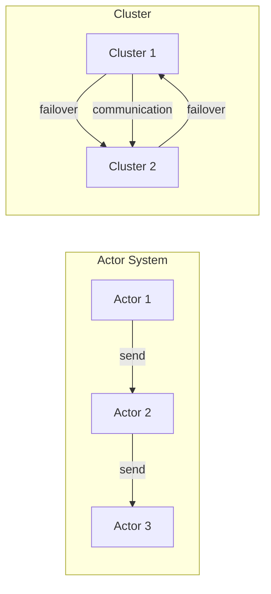

# Akka原理与代码实例讲解

> 关键词：Akka, Actor模型, 分布式系统, 消息传递, 惰性模式, 容错性, 高并发, 持续可用性

## 1. 背景介绍

在分布式系统和并发编程领域，Akka 是一个备受推崇的框架，它基于 Actor 模型构建，旨在提供一种简单且强大的方式来处理并发、分布式以及容错性等挑战。Akka 的设计哲学是让开发者能够更容易地构建无状态或状态较少的Actor系统，这些系统可以在任何计算环境中，包括云计算、容器化环境和多核CPU上高效运行。

### 1.1 问题的由来

随着互联网的快速发展，传统的多线程编程模型逐渐暴露出其局限性。线程间的状态共享和同步机制复杂，难以维护，并且在高并发场景下性能不佳。为了解决这些问题，科学家们提出了 Actor 模型。

### 1.2 研究现状

Akka 是 Actor 模型的实现之一，它由 Typesafe 公司开发，已经成为了构建高并发、高可用分布式系统的首选框架之一。Akka 的设计目标是提供一种简化的编程模型，同时保证系统的容错性和可扩展性。

### 1.3 研究意义

Akka 的出现对于开发者来说具有重要意义，它可以帮助开发者构建以下系统：

- **高并发系统**：Akka 通过 Actor 模型简化了并发编程，使得开发者可以轻松创建并发应用程序。
- **分布式系统**：Akka 提供了构建分布式系统的工具和抽象，使得应用程序可以无缝地在多个节点上运行。
- **容错系统**：Akka 的容错机制可以确保系统在节点故障的情况下仍然可用。

### 1.4 本文结构

本文将分为以下几个部分：

- **核心概念与联系**：介绍 Akka 的核心概念，并使用 Mermaid 流程图展示其架构。
- **核心算法原理 & 具体操作步骤**：深入探讨 Akka 的工作原理和操作步骤。
- **数学模型和公式 & 详细讲解 & 举例说明**：通过数学模型和公式解释 Akka 的工作机制。
- **项目实践：代码实例和详细解释说明**：提供 Akka 的代码实例，并进行详细解释。
- **实际应用场景**：讨论 Akka 在实际应用中的使用案例。
- **工具和资源推荐**：推荐学习 Akka 的资源和开发工具。
- **总结：未来发展趋势与挑战**：总结 Akka 的研究成果，展望未来趋势和挑战。

## 2. 核心概念与联系

### 2.1 核心概念

Akka 的核心概念是 Actor 模型，它是一种基于消息传递的并发模型。在 Actor 模型中，每个 Actor 是一个独立的消息处理单元，它可以发送和接收消息，但不会直接调用其他 Actor 的方法。

### 2.2 架构的 Mermaid 流程图



### 2.3 联系

在 Akka 中，Actor 之间通过消息进行通信。当一个 Actor 接收到一个消息时，它会根据消息类型执行相应的操作。如果 Actor 失败，Akka 会自动进行故障转移，确保系统的持续可用性。

## 3. 核心算法原理 & 具体操作步骤

### 3.1 算法原理概述

Akka 的核心算法原理是基于 Actor 模型，它通过以下机制实现并发和分布式计算：

- **Actor 生命周期管理**：包括创建、终止和监控 Actor。
- **消息传递**：Actor 之间的通信通过异步消息传递进行。
- **容错性**：Akka 通过集群和持久性机制实现容错。
- **分布式协调**：Akka 提供了分布式协调工具，如 Distributed Coordination Service。

### 3.2 算法步骤详解

1. **创建 Actor**：通过 `ActorSystem` 创建新的 Actor。
2. **发送消息**：通过 `ActorRef` 向其他 Actor 发送消息。
3. **接收消息**：Actor 在其内部逻辑中处理接收到的消息。
4. **容错**：如果 Actor 失败，Akka 会自动进行故障转移。

### 3.3 算法优缺点

### 3.3.1 优点

- **简单易用**：Actor 模型简化了并发编程。
- **高并发**：Akka 可以高效地处理高并发场景。
- **容错性**：Akka 提供了强大的容错机制。

### 3.3.2 缺点

- **复杂度**：在处理复杂逻辑时，Actor 模型可能会变得复杂。
- **性能**：与传统的多线程模型相比，Akka 可能会有一些性能损耗。

### 3.4 算法应用领域

Akka 适用于以下领域：

- **实时系统**：如在线游戏、金融交易系统。
- **分布式系统**：如大规模数据处理、云计算平台。
- **微服务架构**：如微服务中的通信和协调。

## 4. 数学模型和公式 & 详细讲解 & 举例说明

### 4.1 数学模型构建

Akka 中的 Actor 模型可以表示为一个图，其中节点代表 Actor，边代表消息传递。

### 4.2 公式推导过程

假设有 n 个 Actor，每个 Actor 可以表示为一个节点，消息传递可以表示为边。则 Akka 的数学模型可以表示为一个有向图：

$$
G = (V, E)
$$

其中，$V = \{A_1, A_2, \ldots, A_n\}$，$E = \{(A_i, A_j) | \text{Actor } A_i \text{ sends a message to Actor } A_j\}$。

### 4.3 案例分析与讲解

假设有一个包含三个 Actor 的系统：A、B 和 C。A 发送消息给 B，B 再将消息发送给 C。这个系统的数学模型可以表示为：

$$
G = (V, E) = (\{A, B, C\}, \{(A, B), (B, C)\})
$$

## 5. 项目实践：代码实例和详细解释说明

### 5.1 开发环境搭建

为了运行 Akka 代码实例，需要以下环境：

- Java 8 或更高版本
- sbt build工具
- Akka 依赖项

### 5.2 源代码详细实现

以下是一个简单的 Akka 示例：

```java
import akka.actor.*;

public class HelloActor extends UntypedActor {
    @Override
    public void onReceive(Message message) throws Exception {
        if (message instanceof String) {
            System.out.println("Hello " + message);
            getSender().tell("Hello back!", getSelf());
        } else {
            unhandled(message);
        }
    }
}

public class AkkaExample {
    public static void main(String[] args) {
        ActorSystem system = ActorSystem.create("HelloSystem");
        ActorRef helloservice = system.actorOf(Props.create(HelloActor.class), "helloService");
        helloservice.tell("Alice", ActorRef.noSender());
        helloservice.tell("Bob", ActorRef.noSender());
    }
}
```

### 5.3 代码解读与分析

在这个例子中，我们创建了一个名为 `HelloActor` 的 Actor，它接收字符串消息，并回复相同的字符串加上 "Hello back!"。`AkkaExample` 类创建了一个 `ActorSystem` 和一个 `HelloActor` 实例，然后向它发送两个消息。

### 5.4 运行结果展示

运行上述代码，将输出以下内容：

```
Hello Alice
Hello back!
Hello Bob
Hello back!
```

## 6. 实际应用场景

### 6.1 分布式计算

Akka 在分布式计算领域有广泛的应用，如 Apache Spark 和 Apache Flink。

### 6.2 微服务架构

Akka 适用于构建微服务架构中的服务间通信。

### 6.3 实时系统

Akka 适用于构建实时系统，如在线游戏和金融交易系统。

## 7. 工具和资源推荐

### 7.1 学习资源推荐

- Akka 官方文档：[https://akka.io/docs/](https://akka.io/docs/)
- Akka 用户指南：[https://akka.io/docs/user-guide](https://akka.io/docs/user-guide)
- Akka 社区论坛：[https://groups.google.com/forum/#!forum/akka-user](https://groups.google.com/forum/#!forum/akka-user)

### 7.2 开发工具推荐

- IntelliJ IDEA：支持 Akka 插件。
- Eclipse：支持 Akka 插件。

### 7.3 相关论文推荐

- "Actors: A Model of Concurrent Computation in Distributed Systems" by Henry J. Leavens, David G. Bobrow, and David A. Randell.
- "Reactive Messaging Patterns with Akka" by replay.io

## 8. 总结：未来发展趋势与挑战

### 8.1 研究成果总结

Akka 作为 Actor 模型的实现之一，在分布式系统和并发编程领域取得了显著的成果。它提供了一种简单且强大的方式来构建高并发、高可用分布式系统。

### 8.2 未来发展趋势

- 更好的性能优化
- 更强的容错机制
- 更易用的 API

### 8.3 面临的挑战

- 理解 Actor 模型
- 性能优化
- 与其他技术的集成

### 8.4 研究展望

Akka 的未来将继续致力于提高性能、易用性和可扩展性，以更好地满足分布式系统和并发编程的需求。

## 9. 附录：常见问题与解答

### 9.1 常见问题

**Q1：什么是 Actor 模型？**

A1：Actor 模型是一种基于消息传递的并发模型，每个 Actor 是一个独立的消息处理单元。

**Q2：Akka 与其他并发模型相比有什么优势？**

A2：Akka 提供了更好的性能、容错性和易用性。

**Q3：如何将 Akka 应用于实际项目中？**

A3：首先了解 Akka 的基本概念和架构，然后根据项目需求选择合适的组件和工具，最后进行开发和测试。

### 9.2 解答

**解答1**：Actor 模型通过消息传递实现并发，避免了传统多线程编程中的同步问题，使得并发编程更加简单。

**解答2**：Akka 提供了 Actor 模型、集群、持久化等功能，可以轻松构建高并发、高可用分布式系统。

**解答3**：首先学习 Akka 的基本概念和架构，然后选择合适的组件和工具，如 ActorSystem、ActorRef 等，最后进行开发和测试。

---

作者：禅与计算机程序设计艺术 / Zen and the Art of Computer Programming