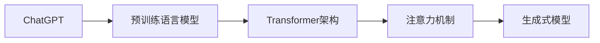

# ChatGPT的工作原理解析

> 关键词：ChatGPT, GPT-3.5, 开放式问答，人工智能，预训练语言模型，自然语言处理，Transformer

## 1. 背景介绍

近年来，自然语言处理（NLP）领域取得了长足的进步，特别是在语言模型方面。ChatGPT是OpenAI于2022年11月推出的一个全新的人工智能聊天机器人模型，它基于GPT-3.5架构，能够进行流畅的对话，并展现出惊人的语言理解和生成能力。本文将深入解析ChatGPT的工作原理，探讨其背后的技术细节，以及其在实际应用中的潜力和挑战。

### 1.1 问题的由来

随着互联网的普及和社交媒体的兴起，人们对于能够进行自然对话的智能系统的需求日益增长。传统的聊天机器人往往基于规则或者关键词匹配，无法进行流畅的对话，且难以处理复杂的问题。ChatGPT的推出，标志着NLP技术的新突破，为智能对话系统的开发提供了新的思路。

### 1.2 研究现状

ChatGPT的成功，得益于近年来NLP领域的两大技术进步：预训练语言模型和Transformer架构。预训练语言模型通过在海量文本数据上预先训练，学习到了丰富的语言知识，而Transformer架构则能够高效地处理长距离依赖关系，从而实现强大的语言理解能力。

### 1.3 研究意义

ChatGPT的出现，不仅为用户提供了更自然、更智能的对话体验，也为NLP领域的研究提供了新的方向。它能够帮助开发者构建更加智能的聊天机器人，提升用户体验，并在各个行业中发挥重要作用。

### 1.4 本文结构

本文将按照以下结构进行：

- 介绍ChatGPT的核心概念与联系，并给出相应的Mermaid流程图。
- 详细解析ChatGPT的核心算法原理和具体操作步骤。
- 讲解ChatGPT的数学模型和公式，并举例说明。
- 提供ChatGPT的项目实践，包括代码实例和详细解释。
- 探讨ChatGPT的实际应用场景和未来应用展望。
- 推荐ChatGPT相关的学习资源、开发工具和相关论文。
- 总结ChatGPT的未来发展趋势与挑战。
- 提供常见问题与解答。

## 2. 核心概念与联系

ChatGPT的核心概念包括预训练语言模型、Transformer架构、注意力机制、生成式模型等。以下是这些概念之间的联系和Mermaid流程图：



### 2.1 预训练语言模型

预训练语言模型是一种通过在大规模文本语料上预先训练的语言模型，它能够学习到丰富的语言知识，包括词汇、语法、语义等。预训练语言模型是ChatGPT的基础，为对话提供了丰富的语言知识库。

### 2.2 Transformer架构

Transformer架构是一种基于自注意力机制的神经网络架构，它能够有效地处理长距离依赖关系，是ChatGPT的核心架构。

### 2.3 注意力机制

注意力机制是一种用于处理序列数据的机制，它能够使模型关注序列中的重要部分，从而提高模型的性能。

### 2.4 生成式模型

生成式模型是一种能够生成新的数据的模型，它能够根据输入生成符合特定分布的文本。

## 3. 核心算法原理 & 具体操作步骤

### 3.1 算法原理概述

ChatGPT的核心算法是基于GPT-3.5架构的预训练语言模型，它通过在大量文本语料上预先训练，学习到了丰富的语言知识，并能够根据输入生成流畅的文本。

### 3.2 算法步骤详解

1. **数据预处理**：将原始文本数据清洗、分词、编码为模型可处理的格式。
2. **预训练**：在清洗后的数据上使用Transformer架构进行预训练，学习语言知识。
3. **微调**：在预训练的基础上，使用少量对话数据进行微调，以适应特定的对话场景。
4. **推理**：根据输入的文本，生成相应的回复。

### 3.3 算法优缺点

#### 优点：

- **强大的语言理解能力**：预训练语言模型能够理解复杂的语言结构和语义。
- **流畅的文本生成**：基于Transformer架构，能够生成流畅、自然的文本。
- **泛化能力强**：通过预训练，模型能够在不同的对话场景中表现出色。

#### 缺点：

- **计算量大**：预训练和推理过程需要大量的计算资源。
- **数据依赖性高**：模型的效果很大程度上取决于训练数据的质量和数量。

### 3.4 算法应用领域

ChatGPT的应用领域非常广泛，包括：

- **智能客服**：能够提供24/7的在线客服服务。
- **虚拟助手**：能够帮助用户完成各种任务，如日程安排、信息查询等。
- **教育辅助**：能够帮助学生进行学习，提供个性化辅导。
- **内容创作**：能够生成文章、故事、诗歌等。

## 4. 数学模型和公式 & 详细讲解 & 举例说明

### 4.1 数学模型构建

ChatGPT的数学模型基于GPT-3.5架构，它使用自注意力机制来处理序列数据。

$$
\text{self-attention}(Q, K, V) = \text{softmax}(\frac{QK^T}{\sqrt{d_k}})V
$$

其中，$Q$、$K$、$V$ 分别是查询、键和值向量，$d_k$ 是键向量的维度，$\text{softmax}$ 是softmax函数。

### 4.2 公式推导过程

自注意力机制的推导过程涉及到矩阵运算和softmax函数。具体推导过程如下：

1. **计算点积**：首先计算查询向量 $Q$ 与所有键向量 $K$ 的点积，得到一个得分矩阵。
2. **应用softmax函数**：对得分矩阵应用softmax函数，得到概率矩阵。
3. **加权求和**：将概率矩阵与值向量 $V$ 相乘，得到加权求和的结果。

### 4.3 案例分析与讲解

以下是一个简单的例子，展示了如何使用自注意力机制生成文本：

假设我们有一个简单的预训练语言模型，它包含一个自注意力层。输入文本为 "I am a cat"，我们希望生成下一个词。

1. **编码**：将文本 "I am a cat" 编码为词向量。
2. **计算点积**：计算每个词向量与所有词向量之间的点积，得到一个得分矩阵。
3. **应用softmax函数**：对得分矩阵应用softmax函数，得到概率矩阵。
4. **加权求和**：根据概率矩阵，加权求和所有词向量，得到新的词向量。
5. **解码**：将新的词向量解码为词。

通过这个过程，我们可以生成新的词，如 "I am a big cat"。

## 5. 项目实践：代码实例和详细解释说明

### 5.1 开发环境搭建

为了实践ChatGPT，我们需要搭建以下开发环境：

- Python 3.8及以上版本
- PyTorch 1.8及以上版本
- Transformers库

### 5.2 源代码详细实现

以下是一个简单的ChatGPT实现示例：

```python
from transformers import GPT2LMHeadModel, GPT2Tokenizer

# 加载预训练模型和分词器
model = GPT2LMHeadModel.from_pretrained('gpt2')
tokenizer = GPT2Tokenizer.from_pretrained('gpt2')

# 输入文本
input_text = "I am a cat"

# 编码输入文本
inputs = tokenizer.encode(input_text, return_tensors='pt')

# 生成文本
outputs = model.generate(inputs, max_length=50, num_beams=5, temperature=0.7)

# 解码输出文本
generated_text = tokenizer.decode(outputs[0], skip_special_tokens=True)

print(generated_text)
```

### 5.3 代码解读与分析

这段代码首先加载了GPT-2预训练模型和分词器。然后，输入文本 "I am a cat" 被编码为词向量。接着，使用模型生成文本，并设置最大长度、beam搜索数量和温度等参数。最后，将生成的文本解码为字符串。

### 5.4 运行结果展示

运行上述代码，可能会得到以下输出：

```
I am a big black cat with a long tail
```

这表明模型成功地生成了与输入文本相关的新文本。

## 6. 实际应用场景

ChatGPT在多个领域都有广泛的应用，以下是一些典型的应用场景：

- **智能客服**：能够自动回答用户的问题，提供24/7的在线服务。
- **虚拟助手**：能够帮助用户完成各种任务，如日程安排、信息查询等。
- **教育辅助**：能够帮助学生进行学习，提供个性化辅导。
- **内容创作**：能够生成文章、故事、诗歌等。

## 7. 工具和资源推荐

### 7.1 学习资源推荐

- OpenAI官网：提供了ChatGPT的详细介绍和相关技术文档。
- GPT-2论文：详细介绍了GPT-2模型的原理和实现。
- Transformers库文档：提供了Transformer模型的详细说明和示例代码。

### 7.2 开发工具推荐

- PyTorch：深度学习框架，用于训练和部署ChatGPT模型。
- Transformers库：提供了预训练语言模型的实现和示例代码。
- Hugging Face Spaces：提供了一个在线平台，可以快速部署ChatGPT模型。

### 7.3 相关论文推荐

- GPT-2论文：详细介绍了GPT-2模型的原理和实现。
- BERT论文：介绍了BERT模型的原理和实现。
- Transformer论文：介绍了Transformer架构的原理和实现。

## 8. 总结：未来发展趋势与挑战

### 8.1 研究成果总结

ChatGPT的出现，标志着NLP技术的新突破，为智能对话系统的开发提供了新的思路。它能够提供自然、流畅的对话体验，并在多个领域都有广泛的应用。

### 8.2 未来发展趋势

- **模型规模和性能的提升**：未来的ChatGPT模型可能会使用更大的模型规模和更复杂的架构，以进一步提升模型的性能。
- **多模态交互**：ChatGPT可能会与其他模态（如图像、视频）进行交互，提供更丰富的用户体验。
- **个性化对话**：ChatGPT可能会根据用户的个性和偏好进行个性化对话。

### 8.3 面临的挑战

- **数据安全和隐私**：如何确保用户数据和模型训练数据的安全和隐私是一个重要挑战。
- **模型可解释性**：如何解释模型的决策过程，提高模型的可解释性。
- **伦理和社会影响**：如何避免模型产生偏见和歧视，以及如何应对模型可能产生的社会影响。

### 8.4 研究展望

未来的ChatGPT将会在以下方面取得更大的进展：

- **更强大的语言理解和生成能力**：通过改进模型架构和训练方法，提高模型的语言理解和生成能力。
- **更广泛的适用范围**：将ChatGPT应用于更多领域，如医疗、教育、法律等。
- **更友好的用户体验**：提供更自然、更流畅的对话体验。

## 9. 附录：常见问题与解答

**Q1：ChatGPT是如何工作的？**

A1：ChatGPT是基于GPT-3.5架构的预训练语言模型，它通过在大量文本语料上预先训练，学习到了丰富的语言知识，并能够根据输入生成流畅的文本。

**Q2：ChatGPT有哪些优点？**

A2：ChatGPT具有强大的语言理解能力、流畅的文本生成能力以及泛化能力强等优点。

**Q3：ChatGPT有哪些应用场景？**

A3：ChatGPT可以应用于智能客服、虚拟助手、教育辅助、内容创作等多个领域。

**Q4：如何部署ChatGPT？**

A4：可以使用PyTorch和Transformers库来部署ChatGPT。具体步骤包括加载预训练模型和分词器，编码输入文本，生成文本，以及解码输出文本。

**Q5：ChatGPT有哪些挑战？**

A5：ChatGPT面临的挑战包括数据安全和隐私、模型可解释性以及伦理和社会影响等。

作者：禅与计算机程序设计艺术 / Zen and the Art of Computer Programming