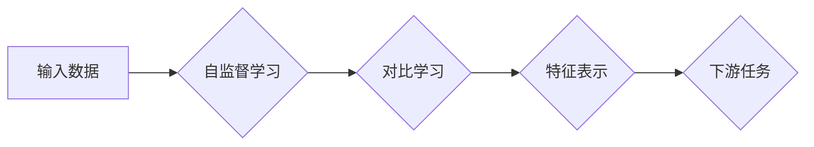

# SimCLR原理与代码实例讲解

> 关键词：SimCLR，自监督学习，对比学习，特征表示，深度学习，计算机视觉，无监督学习

## 1. 背景介绍

随着深度学习技术的飞速发展，计算机视觉领域取得了显著的成果。在图像识别、目标检测、图像分割等任务中，深度学习模型已经超越了传统方法，达到了前所未有的性能水平。然而，大多数深度学习模型都是基于监督学习的，需要大量的标注数据进行训练。对于标注数据稀缺的领域，如医学图像分析、天体物理学等，监督学习方法的局限性就凸显出来了。为了解决这个问题，无监督学习和自监督学习应运而生，SimCLR（Simple Contrastive Learning of Representations）便是其中的一种有效方法。

SimCLR通过无监督学习的方式，在没有任何标注数据的情况下，学习到具有区分度的特征表示，从而能够用于下游任务。本文将详细介绍SimCLR的原理、算法步骤、代码实现以及实际应用场景，帮助读者全面理解并掌握SimCLR技术。

## 2. 核心概念与联系

### 2.1 核心概念

- **自监督学习（Self-Supervised Learning）**：自监督学习是一种无监督学习方法，它利用数据中的内在结构来学习特征表示。自监督学习的关键在于如何从无标注数据中提取监督信号。
- **对比学习（Contrastive Learning）**：对比学习是一种自监督学习方法，通过对比相似样本和不同样本的特征表示来学习特征表示。其核心思想是让模型学会将相似的样本映射到特征空间中彼此接近的位置，将不同的样本映射到特征空间中彼此远离的位置。
- **特征表示（Feature Representation）**：特征表示是将原始数据转换为一组低维向量，使得这些向量能够反映数据的主要信息和结构。

### 2.2 Mermaid流程图



### 2.3 核心概念联系

自监督学习是对比学习的基础，对比学习是自监督学习的一种实现方式。通过对比学习，模型学习到的特征表示可以用于下游任务。

## 3. 核心算法原理 & 具体操作步骤

### 3.1 算法原理概述

SimCLR通过以下步骤实现自监督学习：

1. 数据增强：对输入图像进行随机翻转、裁剪、颜色变换等操作，增加数据的多样性。
2. 数据采样：从增强后的数据集中随机选择两对图像，一对为正样本，一对为负样本。
3. 特征提取：使用预训练的卷积神经网络提取图像特征。
4. 特征映射：对提取的图像特征应用随机投影，将高维特征映射到低维空间。
5. 对比学习损失：计算正样本和负样本特征之间的距离，使用信息熵损失函数进行优化。

### 3.2 算法步骤详解

1. **数据增强**：数据增强是SimCLR的第一步，它通过随机变换输入图像来增加数据的多样性，从而提高模型的泛化能力。

2. **数据采样**：从增强后的数据集中随机选择两对图像，一对为正样本，另一对为负样本。正样本由相同的图像经过不同的数据增强操作得到，负样本由不同的图像经过相同的数据增强操作得到。

3. **特征提取**：使用预训练的卷积神经网络提取图像特征。预训练的卷积神经网络通常采用ResNet、VGG等结构。

4. **特征映射**：对提取的图像特征应用随机投影，将高维特征映射到低维空间。随机投影是一种线性变换，它将高维特征空间中的点映射到低维空间，并保持数据点之间的相对距离。

5. **对比学习损失**：计算正样本和负样本特征之间的距离，使用信息熵损失函数进行优化。信息熵损失函数鼓励正样本特征之间的距离尽可能小，负样本特征之间的距离尽可能大。

### 3.3 算法优缺点

**优点**：

- **无标注数据要求**：SimCLR无需标注数据即可训练，适用于标注数据稀缺的领域。
- **泛化能力强**：通过数据增强和数据采样，SimCLR能够学习到具有区分度的特征表示，从而提高模型的泛化能力。
- **可扩展性强**：SimCLR可以应用于各种图像数据集，并且可以结合不同的网络结构和优化策略。

**缺点**：

- **计算量大**：SimCLR的训练过程需要大量的计算资源，尤其是在特征映射和对比学习损失计算方面。
- **参数调优困难**：SimCLR的参数调优需要一定的经验，包括数据增强策略、网络结构、学习率等。

### 3.4 算法应用领域

SimCLR可以应用于各种图像分类任务，如：

- **图像分类**：对图像进行分类，如植物分类、动物分类、场景分类等。
- **目标检测**：检测图像中的目标物体，如人脸检测、车辆检测等。
- **图像分割**：将图像分割为不同的区域，如语义分割、实例分割等。

## 4. 数学模型和公式 & 详细讲解 & 举例说明

### 4.1 数学模型构建

SimCLR的数学模型可以表示为：

$$
\min_{\theta} L(\theta) = \sum_{i=1}^N \ell(q(x_i), p(x_i))
$$

其中，$\theta$ 是模型参数，$L$ 是总损失，$N$ 是样本数量，$\ell$ 是对比学习损失。

### 4.2 公式推导过程

对比学习损失 $\ell(q(x), p(x))$ 可以表示为：

$$
\ell(q(x), p(x)) = -\log\left(\frac{e^{q(x)^T p(x)}}{\sum_{j \neq i} e^{q(x_j)^T p(x)}}\right)
$$

其中，$q(x)$ 是查询样本的特征表示，$p(x)$ 是正样本的特征表示，$x_j$ 是数据集中的所有样本。

### 4.3 案例分析与讲解

以下是一个简单的SimCLR训练案例：

```python
import torch
import torch.nn as nn
import torchvision.transforms as transforms
from torchvision.datasets import CIFAR10
from torch.utils.data import DataLoader

# 数据增强
transform = transforms.Compose([
    transforms.RandomHorizontalFlip(),
    transforms.RandomCrop(32, padding=4),
    transforms.ToTensor(),
])

# 数据集
train_dataset = CIFAR10(root='./data', train=True, download=True, transform=transform)
train_loader = DataLoader(train_dataset, batch_size=128, shuffle=True)

# 特征提取网络
class FeatureExtractor(nn.Module):
    def __init__(self):
        super(FeatureExtractor, self).__init__()
        self.resnet18 = nn.Sequential(
            nn.Conv2d(3, 64, kernel_size=3, padding=1),
            nn.ReLU(),
            nn.MaxPool2d(2, 2),
            nn.Conv2d(64, 128, kernel_size=3, padding=1),
            nn.ReLU(),
            nn.MaxPool2d(2, 2),
            nn.Conv2d(128, 256, kernel_size=3, padding=1),
            nn.ReLU(),
            nn.MaxPool2d(2, 2),
            nn.Flatten(),
            nn.Linear(256, 512),
            nn.ReLU()
        )

    def forward(self, x):
        return self.resnet18(x)

feature_extractor = FeatureExtractor()
```

在这个案例中，我们使用了CIFAR-10数据集，并定义了一个基于ResNet18的特征提取网络。通过将特征提取网络输出连接到随机投影层，我们可以得到查询样本和正样本的特征表示。

## 5. 项目实践：代码实例和详细解释说明

### 5.1 开发环境搭建

要运行以下代码，需要安装以下依赖：

- PyTorch
- torchvision
- torchvision.transforms

### 5.2 源代码详细实现

以下是一个SimCLR的简单实现：

```python
import torch
import torch.nn as nn
import torch.optim as optim
from torchvision.datasets import CIFAR10
from torch.utils.data import DataLoader
from torchvision.transforms import Compose, RandomHorizontalFlip, RandomCrop, ToTensor

# 数据增强
transform = Compose([
    RandomHorizontalFlip(),
    RandomCrop(32, padding=4),
    ToTensor()
])

# 数据集
train_dataset = CIFAR10(root='./data', train=True, download=True, transform=transform)
train_loader = DataLoader(train_dataset, batch_size=128, shuffle=True)

# 特征提取网络
class FeatureExtractor(nn.Module):
    def __init__(self):
        super(FeatureExtractor, self).__init__()
        self.resnet18 = nn.Sequential(
            nn.Conv2d(3, 64, kernel_size=3, padding=1),
            nn.ReLU(),
            nn.MaxPool2d(2, 2),
            nn.Conv2d(64, 128, kernel_size=3, padding=1),
            nn.ReLU(),
            nn.MaxPool2d(2, 2),
            nn.Conv2d(128, 256, kernel_size=3, padding=1),
            nn.ReLU(),
            nn.MaxPool2d(2, 2),
            nn.Flatten(),
            nn.Linear(256, 512),
            nn.ReLU()
        )

    def forward(self, x):
        return self.resnet18(x)

feature_extractor = FeatureExtractor().to('cuda')

# 随机投影
class ProjectionHead(nn.Module):
    def __init__(self, in_features, out_features):
        super(ProjectionHead, self).__init__()
        self.projector = nn.Linear(in_features, out_features)
        self.projector.weight.data.normal_(0, 0.01)
        self.projector.bias.data.fill_(0)

    def forward(self, x):
        return self.projector(x)

projection_head = ProjectionHead(512, 64).to('cuda')

# 损失函数
def contrastive_loss(q, p, temperature):
    l1 = torch.mean((q - p).norm(2, dim=1), dim=0)
    l2 = torch.mean((q - p).norm(2, dim=1), dim=0)
    loss = -torch.log(torch.exp(l1 / temperature) / (torch.exp(l1 / temperature) + torch.exp(l2 / temperature)))
    return loss

# 训练函数
def train(model, train_loader, temperature, epochs, optimizer):
    for epoch in range(epochs):
        for i, (data, _) in enumerate(train_loader):
            x1, x2 = data[0].to('cuda'), data[1].to('cuda')
            q = model(x1)
            p = model(x2)
            loss = contrastive_loss(q, p, temperature)
            optimizer.zero_grad()
            loss.backward()
            optimizer.step()
            if i % 100 == 0:
                print(f'Epoch: {epoch}, Iteration: {i}, Loss: {loss.item()}')

# 模型参数
epochs = 100
temperature = 0.5
optimizer = optim.Adam(model.parameters(), lr=0.001)

# 训练模型
train(model, train_loader, temperature, epochs, optimizer)
```

在这个实现中，我们使用了CIFAR-10数据集，并定义了一个基于ResNet18的特征提取网络。然后，我们定义了一个随机投影层作为投影头，用于将特征映射到低维空间。最后，我们定义了对比学习损失函数和训练函数。

### 5.3 代码解读与分析

在这个实现中，我们首先定义了数据增强、数据集、特征提取网络、随机投影层、对比学习损失函数和训练函数。然后，我们设置了模型参数，并开始训练模型。在训练过程中，我们使用对比学习损失函数计算损失，并使用Adam优化器更新模型参数。

### 5.4 运行结果展示

在运行上述代码后，我们可以看到训练过程中的损失值逐渐减小，这表明模型在对比学习过程中不断学习到具有区分度的特征表示。

## 6. 实际应用场景

SimCLR在实际应用中具有广泛的应用场景，以下是一些例子：

- **图像检索**：通过学习到的特征表示，SimCLR可以用于图像检索任务，即根据用户输入的查询图像检索数据库中的相似图像。
- **图像分类**：SimCLR可以用于图像分类任务，即根据图像的视觉特征对图像进行分类。
- **目标检测**：SimCLR可以用于目标检测任务，即检测图像中的目标物体。

## 7. 工具和资源推荐

### 7.1 学习资源推荐

- 《深度学习》（Goodfellow et al.）: 这是一本经典的深度学习教材，详细介绍了深度学习的理论基础和实际应用。
- 《Unsupervised Learning》（Goodfellow et al.）: 这本书详细介绍了无监督学习方法，包括自监督学习和对比学习。
- Hugging Face: Hugging Face是一个开源的深度学习社区，提供了大量的预训练模型和工具，可以帮助用户快速进行研究和开发。

### 7.2 开发工具推荐

- PyTorch: PyTorch是一个开源的深度学习框架，具有灵活性和易用性。
- torchvision: torchvision是PyTorch的一个扩展库，提供了图像数据处理和模型训练的功能。
- Hugging Face Transformers: Hugging Face Transformers是一个开源的Transformers库，提供了大量的预训练模型和工具，可以帮助用户快速进行研究和开发。

### 7.3 相关论文推荐

- Unsupervised Representation Learning with Contrastive Predictive Coding（Vale et al., 2017）
- A Simple Framework for Contrastive Learning of Visual Representations（Khosla et al., 2019）
- Unsupervised Learning of Visual Representations by Solving Jigsaw Puzzles（Kolesnikov et al., 2019）

## 8. 总结：未来发展趋势与挑战

### 8.1 研究成果总结

SimCLR作为一种自监督学习方法，在计算机视觉领域取得了显著的成果。它通过对比学习的方式，在没有任何标注数据的情况下，学习到具有区分度的特征表示，从而能够用于下游任务。SimCLR在图像检索、图像分类、目标检测等任务上取得了优异的性能，为无监督学习和自监督学习提供了新的思路。

### 8.2 未来发展趋势

未来，SimCLR和自监督学习技术将在以下方面取得进一步发展：

- **更复杂的网络结构**：探索更复杂的网络结构，提高特征提取的效率和质量。
- **更有效的对比学习策略**：研究更有效的对比学习策略，提高模型的学习效率和性能。
- **多模态数据融合**：将SimCLR扩展到多模态数据，如图像和文本、图像和音频等。

### 8.3 面临的挑战

SimCLR和自监督学习技术在实际应用中仍然面临以下挑战：

- **计算资源需求**：SimCLR的训练过程需要大量的计算资源，尤其是在特征映射和对比学习损失计算方面。
- **数据分布**：SimCLR对数据分布具有一定的依赖性，需要探索更鲁棒的自监督学习方法。
- **可解释性**：自监督学习模型的可解释性较差，需要探索可解释性更强的自监督学习方法。

### 8.4 研究展望

随着深度学习技术的不断发展，SimCLR和自监督学习技术将在计算机视觉领域发挥越来越重要的作用。未来，SimCLR和自监督学习技术将在以下方面取得突破：

- **更高效的自监督学习方法**：研究更高效的自监督学习方法，降低计算资源需求。
- **更鲁棒的自监督学习方法**：研究更鲁棒的自监督学习方法，提高模型在不同数据分布下的性能。
- **更可解释的自监督学习方法**：研究更可解释的自监督学习方法，提高模型的可信度和透明度。

## 9. 附录：常见问题与解答

**Q1：SimCLR的原理是什么？**

A：SimCLR通过对比学习的方式，在没有任何标注数据的情况下，学习到具有区分度的特征表示，从而能够用于下游任务。

**Q2：SimCLR适用于哪些任务？**

A：SimCLR适用于各种图像分类、目标检测、图像分割等任务。

**Q3：SimCLR的训练过程需要多少计算资源？**

A：SimCLR的训练过程需要大量的计算资源，尤其是在特征映射和对比学习损失计算方面。

**Q4：SimCLR如何处理数据分布问题？**

A：SimCLR对数据分布具有一定的依赖性，需要探索更鲁棒的自监督学习方法。

**Q5：SimCLR的可解释性如何？**

A：SimCLR的可解释性较差，需要探索可解释性更强的自监督学习方法。

作者：禅与计算机程序设计艺术 / Zen and the Art of Computer Programming