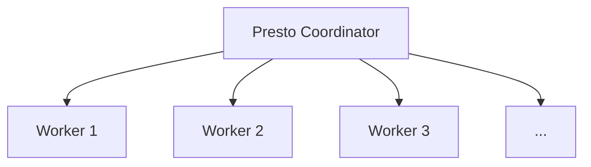
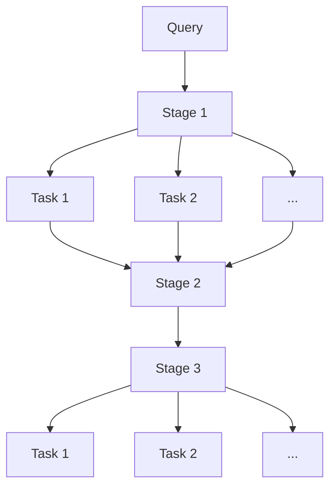

# Presto UDF原理与代码实例讲解

## 1. 背景介绍

### 1.1 问题的由来

在大数据时代，数据分析和处理已经成为企业和组织的核心竞争力之一。Apache Presto是一种开源的分布式SQL查询引擎,旨在对存储在一个或多个不同数据源中的大量结构化数据执行交互式分析查询。然而,在实际应用场景中,我们经常会遇到一些特殊的数据处理需求,这些需求无法通过标准的SQL函数来满足。这就需要我们自定义函数(User Defined Function,UDF)来扩展Presto的功能。

### 1.2 研究现状

Presto本身提供了一个插件系统,允许开发者编写自定义函数并将其集成到Presto中。目前,Presto支持使用Java编写UDF,并且还支持其他语言如Python、R等通过Presto的语言服务进行集成。然而,由于Presto的架构设计和执行模型的复杂性,编写高效、可靠的UDF并不是一件简单的事情。开发者需要深入理解Presto的内部原理,并掌握相关的编程技巧和最佳实践。

### 1.3 研究意义

通过深入探讨Presto UDF的原理和实现细节,我们可以更好地利用Presto的强大功能,满足各种复杂的数据处理需求。同时,了解Presto UDF的开发流程和技巧,也有助于我们编写高质量、高性能的自定义函数,从而提高数据分析和处理的效率。此外,本文还将介绍一些实际的代码示例,帮助读者更好地掌握Presto UDF的开发实践。

### 1.4 本文结构

本文将从以下几个方面深入探讨Presto UDF:

1. 核心概念与联系
2. 核心算法原理与具体操作步骤
3. 数学模型和公式详细讲解与举例说明
4. 项目实践:代码实例和详细解释说明
5. 实际应用场景
6. 工具和资源推荐
7. 总结:未来发展趋势与挑战
8. 附录:常见问题与解答

## 2. 核心概念与联系

在深入探讨Presto UDF的原理和实现之前,我们需要先了解一些核心概念和它们之间的关系。

### 2.1 Presto架构概览

Presto采用了主从架构,由一个协调器(Coordinator)和多个工作器(Worker)组成。协调器负责解析SQL查询、制定执行计划并将任务分发给工作器。工作器则负责实际执行任务,处理数据并返回结果。



### 2.2 Presto执行模型

Presto采用了基于Stage的执行模型,将查询划分为多个Stage,每个Stage由一组Task组成。Task是Presto中最小的执行单元,负责处理数据并产生结果。



### 2.3 Presto UDF概念

UDF(User Defined Function)是Presto中的一种扩展机制,允许开发者编写自定义函数来满足特殊的数据处理需求。Presto UDF可以是标量函数(Scalar Function)、窗口函数(Window Function)或聚合函数(Aggregation Function)。

UDF需要实现特定的接口,并通过Presto的插件系统进行集成和注册。在执行查询时,Presto会根据需要动态加载和执行相应的UDF。

## 3. 核心算法原理与具体操作步骤

### 3.1 算法原理概述

Presto UDF的核心算法原理可以概括为以下几个步骤:

1. **函数描述符定义**: 开发者需要定义UDF的函数描述符(Function Descriptor),包括函数名、参数类型、返回类型等信息。

2. **函数实现**: 根据UDF的类型(标量函数、窗口函数或聚合函数),开发者需要实现相应的接口,编写函数的具体逻辑。

3. **函数注册**: 将实现好的UDF通过Presto的插件系统进行注册,使其可以在SQL查询中被调用。

4. **函数执行**: 在执行查询时,Presto会根据需要动态加载和执行相应的UDF,并将结果与其他数据进行整合。

### 3.2 算法步骤详解

#### 3.2.1 函数描述符定义

函数描述符是Presto识别和调用UDF的关键。它包含以下几个主要部分:

- `FunctionName`: 函数名,用于在SQL查询中调用该函数。
- `Description`: 函数的简短描述。
- `FunctionKind`: 函数的类型,如标量函数、窗口函数或聚合函数。
- `ReturnType`: 函数的返回类型。
- `ArgumentTypes`: 函数的参数类型列表。
- `IsCalledOnNullInput`: 指定在输入为NULL时是否应该调用该函数。
- `IsDeterministic`: 指定该函数是否是确定性的,即对于相同的输入是否总是返回相同的结果。

以下是一个标量函数描述符的示例:

```java
ScalarFunctionImplementation implementation = ScalarFunctionImplementation.builder()
    .name("my_scalar_function")
    .description("A simple scalar function")
    .deterministic(true)
    .calledOnNullInput(true)
    .argumentTypes(VARCHAR)
    .returnType(BIGINT)
    .implementation(new MyScalarFunction())
    .build();
```

#### 3.2.2 函数实现

根据UDF的类型,开发者需要实现相应的接口并编写函数逻辑。以下是三种常见UDF类型的实现示例:

**标量函数**

标量函数需要实现`ScalarFunction`接口,并重写`isRespectingNulls`和`createDescriptorBinding`方法。

```java
public class MyScalarFunction extends ScalarFunction
{
    @Override
    public boolean isRespectingNulls()
    {
        return true; // 指定是否支持NULL输入
    }

    @Override
    public ScalarFunctionImplementation.ScalarFunctionImplementationChoice createDescriptorBinding(...)
    {
        // 实现函数逻辑
    }
}
```

**窗口函数**

窗口函数需要实现`WindowFunction`接口,并重写`createWindowFunction`方法。

```java
public class MyWindowFunction extends WindowFunction
{
    @Override
    public WindowFunctionSupplier createWindowFunctionSupplier(...)
    {
        // 实现函数逻辑
    }
}
```

**聚合函数**

聚合函数需要实现`AggregationFunction`接口,并重写`createAggregationFunction`方法。

```java
public class MyAggregationFunction extends AggregationFunction
{
    @Override
    public AggregationFunctionImplementation createAggregationFunction(...)
    {
        // 实现函数逻辑
    }
}
```

#### 3.2.3 函数注册

实现好的UDF需要通过Presto的插件系统进行注册,才能在SQL查询中被调用。注册过程包括以下几个步骤:

1. 创建一个`Module`类,用于将UDF绑定到Presto的Binder中。

```java
public class MyUdfModule implements Module
{
    @Override
    public void installInChildBinder(Binder.ChildBinder binder)
    {
        binder.bindFunctionImplementation(
            Functions.Implementation.builder()
                .implementation(implementation)
                .signature(signatures)
                .build()
        );
    }
}
```

2. 在`etc/catalogs/my-catalog.properties`文件中,配置插件目录和模块名称。

```
connector.name=my-connector
presto.functions=com.example.MyUdfModule
```

3. 重启Presto服务,使插件生效。

#### 3.2.4 函数执行

在执行SQL查询时,Presto会根据需要动态加载和执行相应的UDF。UDF的执行过程如下:

1. Presto解析SQL查询,识别出需要执行的UDF。
2. 根据函数描述符,Presto从插件中加载相应的UDF实现。
3. 将UDF集成到查询执行计划中,作为一个独立的Task执行。
4. 在Task执行过程中,UDF会处理输入数据并产生结果。
5. UDF的结果会与其他数据进行整合,最终形成查询的输出结果。

### 3.3 算法优缺点

**优点**:

- **扩展性强**: 通过UDF,开发者可以根据需求轻松扩展Presto的功能,满足各种特殊的数据处理需求。
- **灵活性高**: UDF可以使用Java等通用编程语言实现,开发者可以充分发挥创意,实现复杂的数据处理逻辑。
- **性能优化**: 通过优化UDF的实现,开发者可以提高数据处理的效率,从而提升Presto的整体性能。

**缺点**:

- **开发复杂度高**: 开发高质量的UDF需要对Presto的架构和执行模型有深入的理解,存在一定的学习曲线。
- **可维护性挑战**: UDF的代码需要与Presto版本保持同步,升级和维护工作较为繁琐。
- **性能风险**: 如果UDF实现不当,可能会导致性能下降或资源浪费。

### 3.4 算法应用领域

Presto UDF可以应用于各种数据处理和分析场景,包括但不限于:

- **数据清洗和转换**: 使用UDF对原始数据进行清洗、格式化和转换,以满足后续分析的需求。
- **自定义业务逻辑**: 通过UDF实现特定的业务逻辑,如计算复杂的指标、执行自定义规则等。
- **数据加密和安全**: 使用UDF对敏感数据进行加密或解密,提高数据安全性。
- **机器学习和人工智能**: 将机器学习模型或算法封装为UDF,在Presto中执行预测或推理任务。
- **地理空间数据处理**: 使用UDF处理地理空间数据,如计算距离、判断位置关系等。

## 4. 数学模型和公式详细讲解与举例说明

在实现某些复杂的UDF时,我们可能需要构建数学模型并推导相关公式。本节将以一个实际案例为例,详细讲解数学模型的构建过程、公式推导以及实现细节。

### 4.1 数学模型构建

假设我们需要实现一个UDF,用于计算两个地理坐标点之间的距离。为了简化问题,我们假设地球是一个完美的球体,并忽略地形等因素的影响。

我们可以使用球面三角学中的"正弦余弦公式"来计算两点之间的距离。该公式如下所示:

$$
d = R \cdot \arccos(\sin(\phi_1) \cdot \sin(\phi_2) + \cos(\phi_1) \cdot \cos(\phi_2) \cdot \cos(\Delta\lambda))
$$

其中:

- $d$表示两点之间的距离
- $R$表示地球的半径,通常取6371公里
- $\phi_1$和$\phi_2$分别表示两点的纬度
- $\lambda_1$和$\lambda_2$分别表示两点的经度
- $\Delta\lambda = \lambda_2 - \lambda_1$

### 4.2 公式推导过程

为了更好地理解正弦余弦公式的推导过程,我们需要先介绍一些球面三角学的基本概念。

在球面三角形中,我们可以使用三个顶角和它们所对的三条边来描述该三角形。根据球面三角学的定义,球面三角形的三条边就是两点之间的最短距离,即大圆弧长。

现在,我们考虑两个地理坐标点$P_1$和$P_2$,以及它们所在的大圆$C_1$和$C_2$。这两个大圆在地球上相交,形成一个球面三角形$\triangle ABC$。我们的目标就是计算该三角形的边$c$,即$P_1$和$P_2$之间的距离。

<图1>

根据球面三角学的基本定理,我们可以推导出正弦余弦公式:

$$
\begin{aligned}
\sin(c) &= \sin(a) \cdot \sin(b) \
\cos(c) &= \cos(a) \cdot \cos(b)
\end{aligned}
$$

其中$a$和$b$分别表示$\triangle ABC$中$c$对应的两个顶角。

由于$\sin^2(x