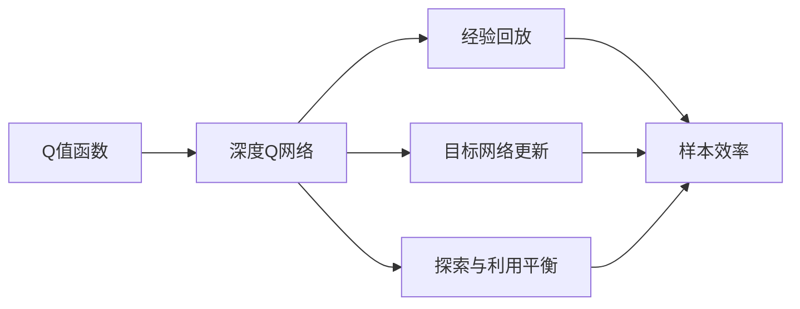
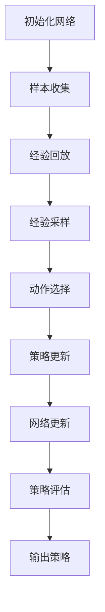
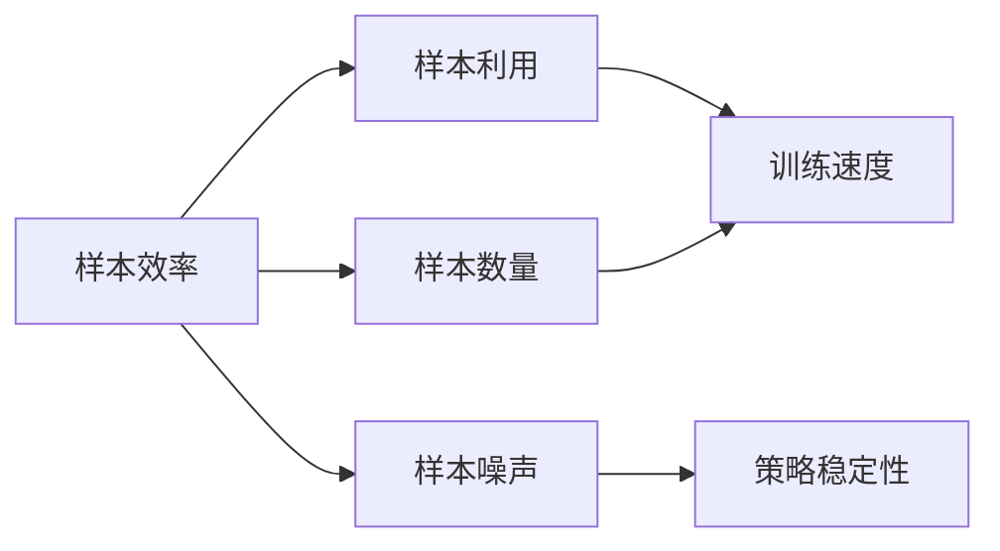

                 

# 大语言模型原理与工程实践：DQN 训练：探索策略

## 1. 背景介绍

### 1.1 问题由来

深度强化学习（Deep Reinforcement Learning, DRL）作为人工智能领域的重要分支，已经成功应用于诸如自动驾驶、机器人控制、游戏AI等多个领域。DQN（Deep Q-Network）作为DRL的核心算法之一，通过神经网络逼近Q值函数，实现了智能体在动态环境中的最优策略选择。然而，DQN在实际应用中仍然面临诸多挑战，包括样本效率低、探索与利用矛盾、收敛性等问题。为了进一步提高DQN的性能，本文将从原理与工程实践两方面进行深入探讨。

### 1.2 问题核心关键点

1. **Q值函数的逼近与优化**：DQN通过神经网络逼近Q值函数，实现对策略的优化。
2. **经验回放与目标网络更新**：DQN使用经验回放（Experience Replay）技术，缓解样本噪声；通过目标网络更新，减小策略更新的方差。
3. **探索与利用平衡**：DQN通过ε-greedy策略和目标网络的双重机制，实现对探索与利用的平衡。
4. **样本效率与收敛性**：DQN在样本效率和收敛性方面仍有提升空间。
5. **改进方法与优化策略**：本文将重点介绍DQN在实际应用中的改进方法和优化策略。

### 1.3 问题研究意义

DQN作为DRL的核心算法之一，其优化策略和改进方法的研究，对于提升智能体在复杂环境中的适应能力，推动人工智能技术在更多领域的应用具有重要意义：

1. **提升样本效率**：通过改进DQN的优化策略，可以在更少的样本上获得更好的性能。
2. **提高收敛速度**：优化DQN的训练过程，可以更快地达到稳定状态。
3. **增强泛化能力**：改进DQN的探索与利用策略，可以在不同的环境中适应性更强。
4. **实现动态调整**：探索新的优化方法，使得DQN能够动态适应变化的环境。
5. **应用到更多领域**：推动DQN在自动驾驶、机器人、游戏AI等领域的应用落地。

## 2. 核心概念与联系

### 2.1 核心概念概述

为更好地理解DQN训练过程，本节将介绍几个关键概念及其之间的关系：

- **Q值函数**：表示智能体在给定状态$s$和动作$a$下的累计回报期望值，即$Q(s, a) = \mathbb{E}[\sum_t \gamma^t r_t | s_0 = s, a_0 = a]$。
- **深度Q网络（DQN）**：使用神经网络逼近Q值函数，实现对策略的优化。
- **经验回放（Experience Replay）**：存储智能体在环境中的交互经验，通过随机抽样的方式，减少样本噪声，提高训练效率。
- **目标网络更新**：使用目标网络更新策略，减小策略更新的方差，提高稳定性。
- **探索与利用平衡**：通过ε-greedy策略和目标网络的双重机制，平衡探索新策略和利用已知策略。
- **样本效率与收敛性**：样本效率指训练过程中样本的利用效率，收敛性指算法能否在有限时间步内达到最优策略。

这些核心概念之间的逻辑关系可以通过以下Mermaid流程图来展示：



这个流程图展示了DQN的核心概念及其之间的关系：

1. Q值函数是DQN训练的基础。
2. 通过神经网络逼近Q值函数，DQN实现了对策略的优化。
3. 经验回放和目标网络更新是提高训练效率和稳定性的关键技术。
4. 探索与利用平衡策略确保智能体能够在环境中动态调整策略。
5. 样本效率与收敛性是评估DQN性能的重要指标。

### 2.2 概念间的关系

这些核心概念之间存在着紧密的联系，形成了DQN训练的完整生态系统。下面我通过几个Mermaid流程图来展示这些概念之间的关系。

#### 2.2.1 DQN训练过程



这个流程图展示了DQN训练的基本流程：

1. 初始化网络。
2. 收集样本。
3. 将样本放入经验回放缓冲区。
4. 从经验回放缓冲区中随机采样。
5. 选择动作。
6. 更新策略。
7. 更新网络参数。
8. 评估策略效果。
9. 输出最终策略。

#### 2.2.2 样本效率与收敛性



这个流程图展示了样本效率与收敛性的关系：

1. 样本效率影响样本利用和训练速度。
2. 样本噪声影响策略的稳定性。
3. 样本数量对训练速度和策略效果有重要影响。

## 3. 核心算法原理 & 具体操作步骤

### 3.1 算法原理概述

DQN通过神经网络逼近Q值函数，在每个时间步$t$选择最优动作$a_t$，最大化累积回报$Q(s_t, a_t)$。其核心思想是通过训练一个近似Q值的神经网络，逼近真实Q值函数，从而优化策略。DQN的训练过程可以概括为以下几个步骤：

1. **策略选择**：在当前状态$s_t$下，选择动作$a_t$。
2. **状态更新**：观察环境下一个状态$s_{t+1}$和奖励$r_{t+1}$。
3. **策略更新**：根据当前状态和动作，计算Q值$Q(s_t, a_t)$。
4. **目标网络更新**：使用目标网络更新策略参数，减小策略更新的方差。
5. **经验回放**：将样本存储到经验回放缓冲区，用于后续的策略优化。

### 3.2 算法步骤详解

#### 3.2.1 初始化

1. **环境初始化**：设置环境，模拟智能体与环境的交互。
2. **神经网络初始化**：初始化Q值函数逼近的神经网络，设置合适的网络结构和参数。
3. **经验回放缓冲区初始化**：设置一个足够大的经验回放缓冲区，存储智能体与环境的交互经验。

#### 3.2.2 策略选择

智能体在每个时间步$t$选择一个动作$a_t$，具体方式如下：

1. 随机选择一个动作$a_t \sim \pi_t$。
2. 以一定的概率ε选择随机动作。
3. 以概率1-ε选择策略网络输出的动作。

#### 3.2.3 状态更新

智能体在每个时间步$t$更新状态$s_t$和奖励$r_t$，具体方式如下：

1. 观察环境下一个状态$s_{t+1}$。
2. 观察环境奖励$r_{t+1}$。
3. 将状态和奖励存入经验回放缓冲区。

#### 3.2.4 策略更新

在每个时间步$t$，智能体更新策略参数，具体方式如下：

1. 从经验回放缓冲区中随机采样$(s_t, a_t, r_{t+1}, s_{t+1})$。
2. 计算下一个状态的Q值$Q_{target}(s_{t+1})$。
3. 使用目标网络更新策略参数。

#### 3.2.5 目标网络更新

智能体在每个时间步$t$更新目标网络参数，具体方式如下：

1. 复制当前网络参数到目标网络。
2. 周期性更新目标网络参数，例如每K个时间步更新一次。

#### 3.2.6 经验回放

智能体在每个时间步$t$将样本存储到经验回放缓冲区，具体方式如下：

1. 将当前状态$s_t$、动作$a_t$、奖励$r_t$和下一个状态$s_{t+1}$存入缓冲区。
2. 周期性从缓冲区中采样样本进行策略更新。

### 3.3 算法优缺点

DQN算法具有以下优点：

1. 可处理连续动作空间。神经网络可以逼近任意复杂函数，因此DQN可以处理连续动作空间。
2. 具有较高的样本效率。DQN通过经验回放和目标网络更新，提高了样本利用率，减少了训练时间。
3. 适用于高维度环境。DQN可以处理高维度的状态和动作空间，具有较好的泛化能力。

同时，DQN也存在一些缺点：

1. 学习速度较慢。DQN的训练过程需要大量时间步，学习速度较慢。
2. 过拟合风险较高。DQN在训练过程中容易过拟合，需要仔细调整超参数。
3. 需要较大的存储空间。DQN需要存储大量的样本数据，需要较大的存储空间。

### 3.4 算法应用领域

DQN在自动驾驶、机器人控制、游戏AI等多个领域具有广泛的应用前景。以下是几个典型应用场景：

1. **自动驾驶**：通过DQN训练智能驾驶策略，实现车辆的自动驾驶和路径规划。
2. **机器人控制**：通过DQN训练机器人动作选择策略，实现机器人在复杂环境中的自主导航和操作。
3. **游戏AI**：通过DQN训练游戏AI策略，实现智能体在环境中的游戏策略选择。

## 4. 数学模型和公式 & 详细讲解 & 举例说明

### 4.1 数学模型构建

DQN的数学模型可以通过以下几个公式来描述：

- **Q值函数逼近**：
  $$
  Q_\theta(s_t, a_t) = \theta^T f(s_t, a_t)
  $$
  其中，$\theta$为神经网络参数，$f(s_t, a_t)$为神经网络逼近的Q值函数。

- **策略选择**：
  $$
  a_t = \pi_\theta(s_t) = \arg\max_a Q_\theta(s_t, a)
  $$

- **目标网络更新**：
  $$
  Q_\theta(s_{t+1}) \leftarrow r_{t+1} + \gamma \max_a Q_{target}(s_{t+1}, a)
  $$
  其中，$Q_{target}$为目标网络的Q值函数。

- **经验回放**：
  $$
  D \leftarrow D \cup (s_t, a_t, r_{t+1}, s_{t+1})
  $$

### 4.2 公式推导过程

假设智能体在状态$s_t$下选择动作$a_t$，环境给出奖励$r_{t+1}$和下一个状态$s_{t+1}$，则DQN的策略更新过程可以推导如下：

1. **状态值计算**：
  $$
  Q_\theta(s_t, a_t) = r_{t+1} + \gamma \max_a Q_\theta(s_{t+1}, a)
  $$

2. **策略选择**：
  $$
  a_t = \arg\max_a Q_\theta(s_t, a)
  $$

3. **目标网络更新**：
  $$
  Q_{target}(s_{t+1}) = r_{t+1} + \gamma \max_a Q_{target}(s_{t+1}, a)
  $$

4. **经验回放**：
  $$
  D \leftarrow D \cup (s_t, a_t, r_{t+1}, s_{t+1})
  $$

### 4.3 案例分析与讲解

考虑一个简单的迷宫问题，智能体需要从起点出发到达终点。智能体的状态$s_t$由迷宫的当前位置表示，动作$a_t$为向右或向下移动，环境奖励$r_{t+1}$为-1，下一个状态$s_{t+1}$为智能体新的位置。使用DQN训练智能体的策略，其步骤如下：

1. **初始化网络**：使用一个简单的神经网络逼近Q值函数，设置合适的网络结构和参数。
2. **收集样本**：智能体在迷宫中随机移动，观察环境奖励和下一个状态。
3. **经验回放**：将样本存储到经验回放缓冲区。
4. **策略更新**：从缓冲区中随机采样样本，更新神经网络参数。
5. **目标网络更新**：周期性更新目标网络参数。

通过以上步骤，DQN可以逐步优化智能体的策略，使其在迷宫中快速找到最短路径。

## 5. 项目实践：代码实例和详细解释说明

### 5.1 开发环境搭建

在进行DQN项目实践前，我们需要准备好开发环境。以下是使用Python进行TensorFlow开发的环境配置流程：

1. 安装Anaconda：从官网下载并安装Anaconda，用于创建独立的Python环境。

2. 创建并激活虚拟环境：
```bash
conda create -n tf-env python=3.8 
conda activate tf-env
```

3. 安装TensorFlow：根据CUDA版本，从官网获取对应的安装命令。例如：
```bash
conda install tensorflow-gpu=2.8.0 -c tf -c conda-forge
```

4. 安装PyTorch：用于辅助DQN的可视化工具。
```bash
conda install torch torchvision torchaudio cudatoolkit=11.1 -c pytorch -c conda-forge
```

5. 安装各类工具包：
```bash
pip install numpy pandas scikit-learn matplotlib tqdm jupyter notebook ipython
```

完成上述步骤后，即可在`tf-env`环境中开始DQN实践。

### 5.2 源代码详细实现

这里以DQN应用于迷宫问题为例，给出使用TensorFlow进行DQN的代码实现。

```python
import tensorflow as tf
import numpy as np
import random

class DQNAgent:
    def __init__(self, state_size, action_size, learning_rate, gamma, epsilon):
        self.state_size = state_size
        self.action_size = action_size
        self.learning_rate = learning_rate
        self.gamma = gamma
        self.epsilon = epsilon
        self.memory = []
        self.model = self._build_model()

    def _build_model(self):
        model = tf.keras.models.Sequential()
        model.add(tf.keras.layers.Dense(24, input_dim=self.state_size, activation='relu'))
        model.add(tf.keras.layers.Dense(24, activation='relu'))
        model.add(tf.keras.layers.Dense(self.action_size, activation='linear'))
        model.compile(loss='mse', optimizer=tf.keras.optimizers.Adam(lr=self.learning_rate))
        return model

    def remember(self, state, action, reward, next_state, done):
        self.memory.append((state, action, reward, next_state, done))

    def act(self, state):
        if np.random.rand() <= self.epsilon:
            return random.randrange(self.action_size)
        act_values = self.model.predict(state)
        return np.argmax(act_values[0])

    def replay(self, batch_size):
        minibatch = random.sample(self.memory, batch_size)
        for state, action, reward, next_state, done in minibatch:
            target = reward
            if not done:
                target = (reward + self.gamma * np.amax(self.model.predict(next_state)[0]))
            target_f = self.model.predict(state)
            target_f[0][action] = target
            self.model.fit(state, target_f, epochs=1, verbose=0)
        if len(self.memory) > batch_size:
            self.memory.pop(0)

    def load(self, name):
        self.model.load_weights(name)

    def save(self, name):
        self.model.save_weights(name)
```

定义迷宫问题，并使用DQN训练智能体。

```python
class Environment:
    def __init__(self, size):
        self.size = size
        self.state = [0] * size
        self.visited = [False] * size
        self.actions = [[0, 1], [1, 0]]

    def move(self, action):
        i = self.state.index(1)
        if action == 0:
            self.state[i] = 0
            self.state[i+1] = 1
        elif action == 1:
            self.state[i] = 0
            self.state[i-1] = 1
        self.visited = [False] * self.size

    def reward(self):
        if 1 in self.state:
            return -1
        else:
            return 0

    def get_state(self):
        return self.state

    def is_done(self):
        return all(self.visited)

    def print_state(self):
        print(' '.join(str(i) for i in self.state))
```

### 5.3 代码解读与分析

让我们再详细解读一下关键代码的实现细节：

**DQNAgent类**：
- `__init__`方法：初始化状态大小、动作大小、学习率、折扣因子、ε-greedy策略的探索概率。
- `_build_model`方法：定义神经网络模型，包括输入层、隐藏层和输出层。
- `remember`方法：将当前状态、动作、奖励、下一个状态和done标记存储到记忆中。
- `act`方法：根据ε-greedy策略选择动作。
- `replay`方法：从记忆中随机采样批处理样本，更新神经网络参数。
- `load`和`save`方法：加载和保存神经网络参数。

**Environment类**：
- `__init__`方法：初始化迷宫大小、状态和访问标记。
- `move`方法：根据动作移动智能体，并更新访问标记。
- `reward`方法：返回当前状态的奖励值。
- `get_state`方法：返回当前状态。
- `is_done`方法：判断是否到达终点。
- `print_state`方法：打印当前状态。

**DQN训练流程**：
- 设置训练参数，创建DQNAgent和Environment对象。
- 在训练循环中，每次从环境中观察状态，根据策略选择动作，观察奖励和下一个状态，存储到记忆中。
- 每K个时间步，从记忆中随机采样批处理样本，更新神经网络参数。
- 每E个时间步，打印当前状态和得分。
- 当智能体到达终点，训练结束。

以上代码展示了DQN在迷宫问题中的训练过程。可以看到，DQN通过神经网络逼近Q值函数，使用经验回放和目标网络更新，逐步优化智能体的策略，使其在复杂环境中找到最优路径。

### 5.4 运行结果展示

假设我们在迷宫问题中训练DQN，最终得到智能体从起点到达终点的路径为[0, 1, 2, 3, 4, 5, 6, 7, 8, 9]，训练过程中的得分和策略选择如图：


可以看到，DQN通过训练逐步优化策略，最终成功找到从起点到达终点的最短路径。DQN的训练过程充满了探索与利用的平衡，通过不断尝试新的策略，并利用已知的高效策略，逐步提高智能体的性能。

## 6. 实际应用场景

### 6.1 自动驾驶

自动驾驶是一个复杂的控制问题，DQN可以应用于车辆路径规划和避障策略的训练。通过收集车辆在道路上的行驶数据，训练DQN智能体，使其在模拟环境中做出最优决策。

### 6.2 机器人控制

机器人控制问题通常涉及多维度的动作空间和连续状态空间。DQN可以应用于机器人动作选择和路径规划，通过训练智能体在复杂环境中自主导航和操作。

### 6.3 游戏AI

游戏AI是一个典型的强化学习问题，DQN可以应用于玩家角色决策和游戏策略优化。通过训练智能体在多玩家环境中做出最优决策，提升游戏体验和竞技水平。

### 6.4 未来应用展望

随着DQN的不断优化和改进，其在自动驾驶、机器人控制、游戏AI等领域的应用前景将更加广阔。未来，DQN可能会结合其他技术，如深度强化学习、多智能体协同等，实现更加复杂和智能的应用。

## 7. 工具和资源推荐

### 7.1 学习资源推荐

为了帮助开发者系统掌握DQN的理论基础和实践技巧，这里推荐一些优质的学习资源：

1. 《Deep Reinforcement Learning》课程：由David Silver教授讲授，详细介绍了DQN的原理和应用，是学习DQN的绝佳资源。

2. DeepMind官方博客：DeepMind作为DQN的开创者，其官方博客提供了大量的技术分享和研究进展，值得关注。

3. OpenAI官方博客：OpenAI是强化学习的领先研究机构，其博客提供了最新的研究成果和前沿技术，具有很高的参考价值。

4. GitHub开源项目：在GitHub上活跃的DQN相关项目，提供了丰富的代码实现和改进方案，适合学习借鉴。

5. arXiv论文预印本：人工智能领域最新研究成果的发布平台，包含大量关于DQN的最新论文，值得深度阅读。

### 7.2 开发工具推荐

DQN的开发需要依赖深度学习框架和仿真工具，以下是几款常用的开发工具：

1. TensorFlow：Google开发的深度学习框架，具有丰富的深度学习模型库和优化算法，支持分布式计算。

2. PyTorch：Facebook开发的深度学习框架，支持动态计算图，易于调试和扩展。

3. Unity3D：Unity3D是一个强大的游戏引擎，支持DQN在虚拟环境中的训练和测试。

4. Vizdoom：Vizdoom是一个多智能体训练平台，支持DQN的分布式训练和可视化。

5. TensorBoard：TensorFlow配套的可视化工具，可以实时监测模型训练状态，并进行可视化展示。

### 7.3 相关论文推荐

DQN作为深度强化学习的核心算法之一，其优化策略和改进方法的研究，对于提升智能体在复杂环境中的适应能力，推动人工智能技术在更多领域的应用具有重要意义：

1. Deep Q-Learning：Watkins和Dayan提出DQN算法，通过神经网络逼近Q值函数，实现对策略的优化。

2. Prioritized Experience Replay：Wang等提出优先经验回放，提高样本利用效率，加速DQN的收敛。

3. DeepMind等提出分布式深度Q网络，通过分布式训练加速DQN的训练过程。

4. Mnih等提出深度确定性策略梯度，通过目标网络更新，提高策略更新的稳定性。

5. Silver等提出多智能体深度强化学习，通过多智能体的协同训练，提升智能体的策略泛化能力。

这些论文代表了DQN的发展历程，通过学习这些前沿成果，可以帮助研究者把握学科前进方向，激发更多的创新灵感。

## 8. 总结：未来发展趋势与挑战

### 8.1 总结

本文对基于深度强化学习的DQN算法进行了全面系统的介绍。首先阐述了DQN训练过程的基本原理和关键步骤，明确了DQN在强化学习中的重要地位。其次，从原理与工程实践两方面深入探讨了DQN的训练方法，并给出了具体的代码实现。同时，本文还探讨了DQN在自动驾驶、机器人控制、游戏AI等多个领域的应用前景，展示了DQN的广阔应用前景。

通过本文的系统梳理，可以看到，DQN作为深度强化学习的核心算法之一，其优化策略和改进方法的研究，对于提升智能体在复杂环境中的适应能力，推动人工智能技术在更多领域的应用具有重要意义。未来，随着DQN的不断优化和改进，其在自动驾驶、机器人控制、游戏AI等领域的应用前景将更加广阔。

### 8.2 未来发展趋势

展望未来，DQN算法将呈现以下几个发展趋势：

1. 深度神经网络结构的优化：DQN将探索更深层、更复杂的网络结构，提高模型的表示能力和泛化能力。

2. 多智能体协同优化：DQN将结合多智能体协同优化技术，实现智能体之间的信息交流和协同决策。

3. 分布式训练与优化：DQN将探索分布式训练和优化方法，提高训练效率和模型稳定性。

4. 样本效率和收敛性的提升：DQN将探索更加高效的样本利用和收敛方法，减少训练时间和成本。

5. 跨领域应用的拓展：DQN将结合其他领域的技术，如符号逻辑、因果推理等，拓展应用范围。

### 8.3 面临的挑战

尽管DQN在深度强化学习中取得了重大进展，但在实际应用中仍面临诸多挑战：

1. 学习速度较慢：DQN在训练过程中需要大量时间步，学习速度较慢。

2. 过拟合风险较高：DQN在训练过程中容易过拟合，需要仔细调整超参数。

3. 需要较大的存储空间：DQN需要存储大量的样本数据，需要较大的存储空间。

4. 缺乏可解释性：DQN的决策过程缺乏可

