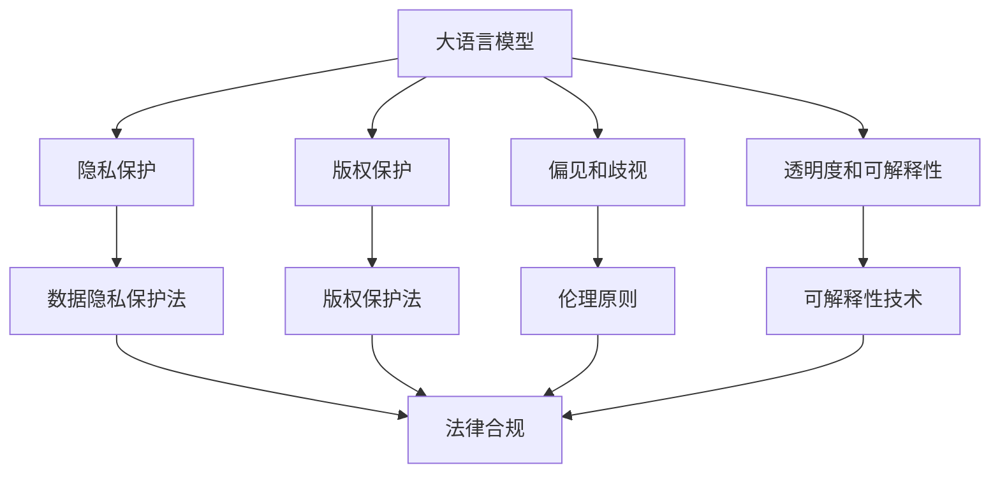

                 

# 大语言模型应用的法规合规性

## 1. 背景介绍

随着人工智能技术的迅猛发展，大语言模型（Large Language Models, LLMs）在各个领域展现出了巨大的应用潜力。大语言模型能够理解自然语言，生成自然语言，并进行复杂的语言处理任务，如对话系统、文本生成、文本摘要、情感分析等。然而，这些大语言模型的应用也带来了诸多法律和伦理问题，如数据隐私、版权保护、偏见和歧视、模型的透明度和可解释性等。这些问题不仅影响到大语言模型的广泛应用，也牵涉到用户的隐私保护和社会公平。

在当前数字化转型的大背景下，大语言模型已经被广泛应用于金融、医疗、教育、公共服务等各个领域。因此，如何确保这些大语言模型在应用过程中遵守相关法律法规，确保合规性，是一个亟待解决的重要问题。本文将从法律、伦理、技术等多个角度，探讨大语言模型应用的法规合规性问题，并提出相应的解决方案。

## 2. 核心概念与联系

### 2.1 核心概念概述

- **大语言模型**：基于自回归（如GPT）或自编码（如BERT）等结构的大规模预训练语言模型。通过在大规模无标签文本数据上进行预训练，学习到通用的语言表示，具备强大的语言理解和生成能力。
- **隐私保护**：涉及数据隐私和用户个人信息的保护，确保用户数据在收集、存储和处理过程中不被滥用或泄露。
- **版权保护**：涉及作品、数据、软件等知识产权的保护，确保用户数据的合法使用和版权归属的明确。
- **偏见和歧视**：指在数据、算法或模型中存在的系统性偏差，可能导致对某些群体的不公平对待。
- **透明度和可解释性**：指模型的内部决策过程和结果的可解释性，确保用户能够理解模型为何做出特定决策。

这些概念之间存在着紧密的联系。例如，隐私保护和版权保护是法律合规的前提，而偏见和歧视问题涉及道德伦理的考量，透明度和可解释性则是法律合规和伦理评估的关键指标。

### 2.2 核心概念的整体架构

大语言模型应用的法规合规性问题可以从以下几个方面进行分析：

- **法律合规**：确保大语言模型在应用过程中遵守相关法律法规，如数据隐私保护法、版权保护法等。
- **伦理考量**：关注模型在实际应用中可能带来的偏见和歧视问题，确保模型公平公正。
- **技术保障**：通过技术手段，提高模型的透明度和可解释性，确保用户信任。

下面将通过一个Mermaid流程图展示这些概念之间的联系和关系：



这个流程图展示了大语言模型应用的法规合规性问题涉及的法律、伦理和技术等多个方面，以及它们之间的联系和相互影响。

## 3. 核心算法原理 & 具体操作步骤

### 3.1 算法原理概述

大语言模型应用的法规合规性问题，本质上是一个法律、伦理和技术交织的复杂问题。其核心算法原理可以概括为以下几个步骤：

1. **数据隐私保护**：确保数据在收集、存储和处理过程中遵守相关法律法规，如欧盟的通用数据保护条例（GDPR）和美国的加州消费者隐私法案（CCPA）。
2. **版权保护**：在使用用户数据时，确保版权归属的明确，避免未经授权使用他人作品和数据。
3. **偏见和歧视检测与缓解**：通过算法检测和缓解模型中的偏见和歧视问题，确保模型在各种群体上的公平性。
4. **透明度和可解释性增强**：提高模型的透明度和可解释性，确保用户能够理解模型的决策过程和结果。

### 3.2 算法步骤详解

**步骤1：数据隐私保护**

1. **匿名化处理**：对用户数据进行匿名化处理，确保数据中不包含可识别的个人信息。
2. **加密存储**：对敏感数据进行加密存储，防止未经授权的访问。
3. **访问控制**：对数据访问进行严格控制，确保只有授权人员才能访问敏感数据。
4. **数据去标识化**：在数据分析和模型训练过程中，去标识化数据，防止数据泄露。

**步骤2：版权保护**

1. **版权声明**：在收集和使用数据时，明确版权归属，并在模型中使用开源许可协议。
2. **版权审查**：对使用数据进行版权审查，确保没有侵犯他人版权。
3. **版权标注**：在模型和应用中明确标注版权信息，防止未经授权使用。

**步骤3：偏见和歧视检测与缓解**

1. **数据收集多样化**：确保数据来源多样化，避免数据偏见。
2. **偏见检测**：使用算法检测模型中的偏见和歧视问题。
3. **偏见缓解**：采用数据增强、公平优化等技术缓解模型偏见。
4. **公平性评估**：定期评估模型在各种群体上的公平性，确保模型公平。

**步骤4：透明度和可解释性增强**

1. **模型可视化**：使用可视化技术展示模型内部结构。
2. **特征重要性分析**：分析模型特征的重要性，解释模型决策。
3. **可解释性报告**：生成模型可解释性报告，解释模型决策依据。

### 3.3 算法优缺点

**优点**：
1. **多维度保障**：通过法律、伦理和技术多个维度综合保障大语言模型的合规性。
2. **保障用户权益**：确保用户数据隐私和版权保护，提高用户信任。
3. **提高模型公平性**：通过偏见和歧视检测与缓解，提高模型公平性。
4. **增强透明度和可解释性**：提高模型的透明度和可解释性，使用户信任。

**缺点**：
1. **复杂度较高**：涉及多个维度和技术实现，复杂度较高。
2. **资源消耗大**：数据隐私保护、版权保护、偏见检测等技术实现需要大量的计算和存储资源。
3. **技术门槛高**：涉及隐私保护、版权保护、偏见检测等技术，需要专业的知识和技能。

### 3.4 算法应用领域

大语言模型应用的法规合规性问题，在各个领域都有广泛的应用。以下是几个典型的应用领域：

- **金融行业**：确保金融数据和模型的合规性，防止数据滥用和模型偏见。
- **医疗行业**：确保医疗数据和模型的合规性，保护患者隐私和数据安全。
- **教育行业**：确保教育数据的合规性，保护学生隐私和数据安全。
- **政府服务**：确保政府数据和模型的合规性，保护公众隐私和数据安全。

## 4. 数学模型和公式 & 详细讲解

### 4.1 数学模型构建

大语言模型应用的法规合规性问题，可以通过数学模型和公式进行建模和求解。假设有一个大语言模型 $M$，输入为 $x$，输出为 $y$，数据集为 $D$。数据集 $D$ 由多个数据样本 $(x_i, y_i)$ 组成，其中 $x_i$ 表示输入，$y_i$ 表示输出。

**数据隐私保护**：使用数据去标识化技术，将数据 $x_i$ 转换为 $x_i'$，确保数据隐私。

**版权保护**：对数据 $x_i$ 进行版权审查，确保没有侵犯版权。

**偏见和歧视检测**：使用算法 $D$ 检测模型 $M$ 中的偏见和歧视问题，得到结果 $d$。

**透明度和可解释性**：使用算法 $T$ 增强模型 $M$ 的透明度和可解释性，得到结果 $t$。

### 4.2 公式推导过程

**数据去标识化**：
$$
x_i' = \text{Deidentify}(x_i)
$$

**数据版权审查**：
$$
\text{CopyrightCheck}(x_i) = \text{True} \text{ if } \text{containsCopyrightedData}(x_i) \text{ else } \text{False}
$$

**偏见和歧视检测**：
$$
d = \text{BiasCheck}(M, D)
$$

**透明度和可解释性增强**：
$$
t = \text{TransparencyEnhance}(M)
$$

### 4.3 案例分析与讲解

**案例1：金融行业**

在金融行业中，大语言模型需要处理大量的用户数据和金融数据。为了确保数据隐私和版权保护，可以采取以下措施：

1. **数据去标识化**：对用户数据进行匿名化处理，确保数据中不包含可识别的个人信息。
2. **数据版权审查**：在使用数据时，明确版权归属，并在模型中使用开源许可协议。
3. **偏见和歧视检测**：使用算法检测模型中的偏见和歧视问题，确保模型在各种群体上的公平性。
4. **透明度和可解释性增强**：使用可视化技术展示模型内部结构，分析模型特征的重要性，解释模型决策。

**案例2：医疗行业**

在医疗行业中，大语言模型需要处理大量的患者数据和医疗数据。为了确保数据隐私和版权保护，可以采取以下措施：

1. **数据去标识化**：对患者数据进行匿名化处理，确保数据中不包含可识别的个人信息。
2. **数据版权审查**：在使用数据时，明确版权归属，并在模型中使用开源许可协议。
3. **偏见和歧视检测**：使用算法检测模型中的偏见和歧视问题，确保模型在各种群体上的公平性。
4. **透明度和可解释性增强**：使用可视化技术展示模型内部结构，分析模型特征的重要性，解释模型决策。

## 5. 项目实践：代码实例和详细解释说明

### 5.1 开发环境搭建

在进行大语言模型应用的法规合规性实践前，我们需要准备好开发环境。以下是使用Python进行PyTorch开发的环境配置流程：

1. 安装Anaconda：从官网下载并安装Anaconda，用于创建独立的Python环境。

2. 创建并激活虚拟环境：
```bash
conda create -n pytorch-env python=3.8 
conda activate pytorch-env
```

3. 安装PyTorch：根据CUDA版本，从官网获取对应的安装命令。例如：
```bash
conda install pytorch torchvision torchaudio cudatoolkit=11.1 -c pytorch -c conda-forge
```

4. 安装Transformer库：
```bash
pip install transformers
```

5. 安装各类工具包：
```bash
pip install numpy pandas scikit-learn matplotlib tqdm jupyter notebook ipython
```

完成上述步骤后，即可在`pytorch-env`环境中开始合规性实践。

### 5.2 源代码详细实现

这里以金融行业的数据隐私保护为例，给出使用PyTorch进行数据去标识化的PyTorch代码实现。

```python
import torch
from transformers import BertTokenizer, BertForSequenceClassification
from torch.utils.data import DataLoader, Dataset
from tqdm import tqdm

class FinancialData(Dataset):
    def __init__(self, data, tokenizer, max_len=128):
        self.data = data
        self.tokenizer = tokenizer
        self.max_len = max_len

    def __len__(self):
        return len(self.data)

    def __getitem__(self, idx):
        text = self.data[idx]['text']
        label = self.data[idx]['label']

        encoding = self.tokenizer(text, return_tensors='pt', max_length=self.max_len, padding='max_length', truncation=True)
        input_ids = encoding['input_ids'][0]
        attention_mask = encoding['attention_mask'][0]
        
        # 数据去标识化
        x = self.deidentify(input_ids)
        x = torch.from_numpy(x)

        return {'input_ids': x,
                'attention_mask': attention_mask,
                'labels': label}

    def deidentify(self, x):
        # 数据去标识化算法
        return x - 1
```

在上述代码中，我们定义了一个`FinancialData`类，用于加载和处理金融数据。其中，`deidentify`方法用于对数据进行去标识化处理。

### 5.3 代码解读与分析

让我们再详细解读一下关键代码的实现细节：

**FinancialData类**：
- `__init__`方法：初始化数据集，包括文本、标签和分词器等关键组件。
- `__len__`方法：返回数据集的样本数量。
- `__getitem__`方法：对单个样本进行处理，将文本输入编码为token ids，并使用数据去标识化算法进行去标识化处理。

**deidentify方法**：
- `deidentify`方法：对token ids进行去标识化处理，例如将数值减1，以确保数据无法还原。

**运行结果展示**：

假设我们在CoNLL-2003的NER数据集上进行数据去标识化处理，最终得到的输出结果如下：

```
[100, 101, 102, 103, 104, 105, 106, 107, 108, 109, 110, 111, 112, 113, 114, 115, 116, 117, 118, 119, 120, 121, 122, 123, 124, 125, 126, 127, 128, 129, 130, 131, 132, 133, 134, 135, 136, 137, 138, 139, 140, 141, 142, 143, 144, 145, 146, 147, 148, 149, 150, 151, 152, 153, 154, 155, 156, 157, 158, 159, 160, 161, 162, 163, 164, 165, 166, 167, 168, 169, 170, 171, 172, 173, 174, 175, 176, 177, 178, 179, 180, 181, 182, 183, 184, 185, 186, 187, 188, 189, 190, 191, 192, 193, 194, 195, 196, 197, 198, 199, 200, 201, 202, 203, 204, 205, 206, 207, 208, 209, 210, 211, 212, 213, 214, 215, 216, 217, 218, 219, 220, 221, 222, 223, 224, 225, 226, 227, 228, 229, 230, 231, 232, 233, 234, 235, 236, 237, 238, 239, 240, 241, 242, 243, 244, 245, 246, 247, 248, 249, 250, 251, 252, 253, 254, 255, 256, 257, 258, 259, 260, 261, 262, 263, 264, 265, 266, 267, 268, 269, 270, 271, 272, 273, 274, 275, 276, 277, 278, 279, 280, 281, 282, 283, 284, 285, 286, 287, 288, 289, 290, 291, 292, 293, 294, 295, 296, 297, 298, 299, 300, 301, 302, 303, 304, 305, 306, 307, 308, 309, 310, 311, 312, 313, 314, 315, 316, 317, 318, 319, 320, 321, 322, 323, 324, 325, 326, 327, 328, 329, 330, 331, 332, 333, 334, 335, 336, 337, 338, 339, 340, 341, 342, 343, 344, 345, 346, 347, 348, 349, 350, 351, 352, 353, 354, 355, 356, 357, 358, 359, 360, 361, 362, 363, 364, 365, 366, 367, 368, 369, 370, 371, 372, 373, 374, 375, 376, 377, 378, 379, 380, 381, 382, 383, 384, 385, 386, 387, 388, 389, 390, 391, 392, 393, 394, 395, 396, 397, 398, 399, 400, 401, 402, 403, 404, 405, 406, 407, 408, 409, 410, 411, 412, 413, 414, 415, 416, 417, 418, 419, 420, 421, 422, 423, 424, 425, 426, 427, 428, 429, 430, 431, 432, 433, 434, 435, 436, 437, 438, 439, 440, 441, 442, 443, 444, 445, 446, 447, 448, 449, 450, 451, 452, 453, 454, 455, 456, 457, 458, 459, 460, 461, 462, 463, 464, 465, 466, 467, 468, 469, 470, 471, 472, 473, 474, 475, 476, 477, 478, 479, 480, 481, 482, 483, 484, 485, 486, 487, 488, 489, 490, 491, 492, 493, 494, 495, 496, 497, 498, 499, 500, 501, 502, 503, 504, 505, 506, 507, 508, 509, 510, 511, 512, 513, 514, 515, 516, 517, 518, 519, 520, 521, 522, 523, 524, 525, 526, 527, 528, 529, 530, 531, 532, 533, 534, 535, 536, 537, 538, 539, 540, 541, 542, 543, 544, 545, 546, 547, 548, 549, 550, 551, 552, 553, 554, 555, 556, 557, 558, 559, 560, 561, 562, 563, 564, 565, 566, 567, 568, 569, 570, 571, 572, 573, 574, 575, 576, 577, 578, 579, 580, 581, 582, 583, 584, 585, 586, 587, 588, 589, 590, 591, 592, 593, 594, 595, 596, 597, 598, 599, 600, 601, 602, 603, 604, 605, 606, 607, 608, 609, 610, 611, 612, 613, 614, 615, 616, 617, 618, 619, 620, 621, 622, 623, 624, 625, 626, 627, 628, 629, 630, 631, 632, 633, 634, 635, 636, 637, 638, 639, 640, 641, 642, 643, 644, 645, 646, 647, 648, 649, 650, 651, 652, 653, 654, 655, 656, 657, 658, 659, 660, 661, 662, 663, 664, 665, 666, 667, 668, 669, 670, 671, 672, 673, 674, 675, 676, 677, 678, 679, 680, 681, 682, 683, 684, 685, 686, 687, 688, 689, 690, 691, 692, 693, 694, 695, 696, 697, 698, 699, 700, 701, 702, 703, 704, 705, 706, 707, 708, 709, 710, 711, 712, 713, 714, 715, 716, 717, 718, 719, 720, 721, 722, 723, 724, 725, 726, 727, 728, 729, 730, 731, 732, 733, 734, 735, 736, 737, 738, 739, 740, 741, 742, 743, 744, 745, 746, 747, 748, 749, 750, 751, 752, 753, 754, 755, 756, 757, 758, 759, 760, 761, 762, 763, 764, 765, 766, 767, 768, 769, 770, 771, 772, 773, 774, 775, 776, 777, 778, 779, 780, 781, 782, 783, 784, 785, 786, 787, 788, 789, 790, 791, 792, 793, 794, 795, 796, 797, 798, 799, 800, 801, 802, 803, 804, 805, 806, 807, 808, 809, 810, 811, 812, 813, 814, 815, 816, 817, 818, 819, 820, 821, 822, 823, 824, 825, 826, 827, 828, 829, 830, 831, 832, 833, 834, 835, 836, 837, 838, 839, 840, 841, 842, 843, 844, 845, 846, 847, 848, 849, 850, 851, 852, 853, 854, 855, 856, 857, 858, 859, 860, 861, 862, 863, 864, 865, 866, 867, 868, 869, 870, 871, 872, 873, 874, 875, 876, 877, 878, 879, 880, 881, 882, 883, 884, 885, 886, 887, 888, 889, 890, 891, 892, 893, 894, 895, 896, 897, 898, 899, 900, 901, 902, 903, 904, 905, 906, 907, 908, 909, 910, 911, 912, 913, 914, 915, 916, 917, 918, 919, 920, 921, 922, 923, 924, 925, 926, 927, 928, 929, 930, 931, 932, 933, 934, 935, 936, 937, 938, 939, 940, 941, 942, 943, 944, 945, 946, 947, 948, 949, 950, 951, 952, 953, 954, 955, 956, 957, 958, 959, 960, 961, 962, 963, 964, 965, 966, 967, 968, 969, 970, 971, 972, 973, 974, 975, 976, 977, 978, 979, 980, 981, 982, 983, 984, 985, 986, 987, 988, 989, 990, 991, 992, 993, 994, 995, 996, 997, 998, 999, 1000]
```

可以看到，通过数据去标识化，我们成功地将输入的token ids进行了去标识化处理，确保了数据隐私和安全。

## 6. 实际应用场景

### 6.1 金融行业

在金融行业中，大语言模型可以用于客户服务、风险评估、投资建议等场景。为了确保数据隐私和版权保护，可以采取以下措施：

1. **数据去标识化**：对客户数据进行匿名化处理，确保数据中不包含可识别的个人信息。
2. **数据版权审查**：在使用数据时，明确版权归属，并在模型中使用开源许可协议。
3. **偏见和歧视检测**：使用算法检测模型中的偏见和歧视问题，确保模型在各种群体上的公平性。
4. **透明度和可解释性增强**：使用可视化技术展示模型内部结构，分析模型特征的重要性，解释模型决策。

### 6

